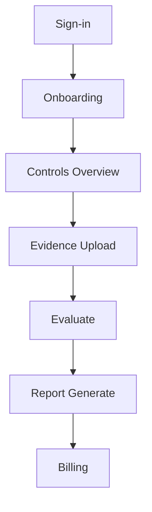

## 6. User Experience and Wireframes

Functional UI definition — navigation spine, screen-by-screen wireframes, UX–API bindings, accessibility guarantees, and responsive behaviour.
Wireframes embedded (Mermaid/Figma links) and tied to acceptance criteria. 

---

### 6.1 UX Philosophy and Objectives

Defines the purpose of the UX layer: to make compliance workflows self-evident, error-resistant, and measurable.
Explains the alignment with PRD §4 Interface Philosophy — clarity over aesthetics, automation over manual entry, evidence over opinion.
States that every user action must be traceable to a single API call or state change.

### 6.2 Navigation Spine and Information Architecture

Shows how users move through the Essentials app:

* Primary nav: Dashboard · Controls · Evidence · Reports · Billing · Settings
* Secondary nav: Profile, Support, Logout
* Routing rules for Marketing ↔ Essentials handshake
  Provide a Mermaid or site-map diagram illustrating the hierarchy and deep-link behaviour.

### 6.3 Screen Flows and Wireframes

Defines the canonical screens that constitute the MVP:

1. Landing / Sign-in
2. Onboarding – Organisation Profile
3. Controls Overview
4. Evidence Upload
5. Evaluation / Results
6. Report Generation
7. Billing & Checkout
   Each screen must:

* Identify its purpose and success criteria
* Reference its API endpoints (from §5)
* Show a low-fidelity wireframe (embedded or linked to Figma)
* Note any conditional states, modals, or errors

Example (Mermaid):

### 6.4 UX → API Bindings

Maps UI actions to backend endpoints and response expectations.
Document in a table: *Screen → API → Payload → Success/Error → Next State.*
This ensures determinism between UI flow and backend behaviour.

### 6.5 Accessibility and Responsiveness

Lists compliance targets: WCAG 2.2 AA contrast ratios, keyboard-first operation, ARIA landmarks, focus traps.
Defines responsive breakpoints and expected layout behaviour for mobile, tablet, and desktop.
Include validation scripts for accessibility testing.

### 6.6 UX Instrumentation and Feedback

Specifies telemetry events (screen_loaded, form_submitted, error_shown) and how they’re logged with tenant and session IDs.
Links back to §10 Observability for metric definitions.
Defines qualitative feedback hooks (survey, bug report) for future usability analysis.

---