# **Product Design Specification (PDS)**

This document defines the design behaviour of Transcrypt’s MVP. It translates the product intent described in the PRD and the system boundaries defined in the SAIS into concrete, testable user-facing design rules. Where the PRD establishes purpose and constraints, and the SAIS describes the architecture that realises them, the PDS specifies how the product presents, behaves, and communicates in the user’s hands.

The PDS is not a branding guide or a high-fidelity visual spec. It defines structure, hierarchy, interaction patterns, layout systems, states, and flows that are invariant across surfaces. Every screen, component, and journey described here is directly constrained by requirements already set in the PRD and implemented in the SAIS. No part of the visual or interaction model may contradict those documents. The PDS expresses them in the language of design rather than engineering.

This is the definitive reference for how Transcrypt should *feel* to use: predictable, calm, unambiguous, and deterministic. All interactions must support the platform’s core commitments — clarity, auditability, and trust — while ensuring that users always understand what state they are in, what they can do, and what happens next.

The PDS is authoritative for all design decisions and remains stable unless the PRD or SAIS undergo material change. Any modification to behaviour, layout, or interface patterns must maintain traceability back to those documents. The PDS ensures that Transcrypt is implemented consistently across Marketing, Essentials, and all authenticated or unauthenticated surfaces.

---

# **1. Purpose and Scope**

## **1.1 Document Intent**

The Product Design Specification defines how Transcrypt presents, behaves, and communicates across every surface the user touches. It converts the product requirements established in the PRD and the architectural boundaries defined in the SAIS into concrete, testable design rules. This document governs structure, hierarchy, interaction, and visual behaviour for both the Marketing runtime and the Essentials application, ensuring they act as two expressions of a single system rather than separate products.

The PDS exists to create a stable, unambiguous foundation for implementation. It prevents divergence between design and engineering by specifying how components respond, how states transition, how flows unfold, and how information is revealed. Every interaction must reflect the principles that underpin Transcrypt: determinism, explainable state, clarity, and trust. This applies equally to intake forms, evaluation views, evidence handling, report presentation, billing sequences, navigation, mobile behaviour, and all degraded or failure conditions.

The intent of this document is not stylistic exploration or creative expansion beyond the product’s defined scope. It is a control instrument. The PDS ensures that every screen, journey, and component feels consistent, predictable, and calm, regardless of context. Any implementation that contradicts the behaviours defined here is considered non-conformant, even if visually polished. The PDS establishes the necessary design guardrails so that users always understand what state they are in, what they can do next, and why the system responds as it does.

---

## **1.2 Scope of Coverage**

The Product Design Specification governs every user-facing surface and behaviour included in the MVP defined by the PRD and implemented in the SAIS. Its scope covers the entire experience of interacting with Transcrypt across both the public Marketing runtime and the authenticated Essentials application. This includes all layout structures, component behaviours, interaction patterns, flow sequences, state transitions, and accessibility rules that appear on screen. Any element a user sees, touches, or relies on for progress falls within the remit of this document.

The PDS defines how navigation works, how forms behave, how validation is surfaced, how evidence uploads progress, how evaluation states change, how findings are revealed, and how reports are consumed. It specifies the rules for loading states, empty states, partial states, complete states, and error or degraded modes. It also governs mobile, tablet, and desktop behaviour to ensure the product remains consistent across device classes. All identity and routing transitions between Marketing and Essentials are included, as are billing interactions, session behaviour, and user feedback mechanisms.

Surfaces or behaviours not part of the PRD’s MVP cut are explicitly out of scope. This includes partner or auditor views, enterprise or assisted-tier functionality, advanced connectors, NIS2 or DORA rulepacks, collaboration surfaces, back-office consoles beyond their minimal user impact, and any system-level or architectural details that do not manifest visually. The PDS does not define brand identity, editorial strategy, or future-phase design directions; these are external to its mandate.

This scope ensures that design decisions remain tightly bound to what Transcrypt actually delivers in v1. The PDS provides the authoritative reference for designers, engineers, and QA to implement the product consistently, without drifting into unplanned features or aesthetic speculation. Only user-visible behaviours that form part of the MVP loop are covered, and all must reflect the principles of clarity, determinism, and explainable state defined at product level.

---

## **1.3 Out-of-Scope Items**

The Product Design Specification applies only to user-visible behaviour within the MVP boundaries defined in the PRD and realised in the SAIS. Anything outside those boundaries is not governed by this document, even if technically possible or anticipated in later phases. The PDS does not describe, authorise, or imply design work for surfaces, flows, or components that belong to future rulepacks, expanded tiers, enterprise features, or internal systems.

Functionality reserved for later phases is explicitly excluded, including auditor dashboards, advisor or assisted-tier views, partner or reseller consoles, supply-chain features, collaboration surfaces, team management, access delegation, multi-plan billing models, enterprise entitlement structures, and any UI related to NIS2, DORA, ISO 27001, CAF, or other non-MVP frameworks. Connectors beyond basic identity checks are likewise out of scope, as are notifications centres, policy libraries, CMS tooling, or any form of advanced configuration surface.

The PDS also excludes domains that are visual or content-related but do not belong to this specification: full brand identity, marketing copy, editorial workflows, SEO strategy, illustration style, analytics dashboards, or CMS author experiences. These are separate disciplines and are not governed here. Architectural or backend concerns without a user-facing surface—such as data models, evidence hashing, gateway routing, inference pipeline mechanics, observability streams, Stripe webhook processing, or evaluation internals—must not appear in the PDS.

Only behaviours that manifest directly on screen for MVP users fall within scope. Anything not visible to the user, not part of the v1 loop, or not defined in PRD or SAIS is excluded. This boundary ensures that the PDS remains precise, implementable, and aligned with the narrow, deterministic product cut required for MVP delivery.

---

## **1.4 Audience and Consumption**

### **1.4.1 Audience**

The Product Design Specification is written for the roles responsible for turning Transcrypt’s product definition and architectural boundaries into a coherent, deterministic user experience. Its core audience includes product designers, frontend engineers, UX writers, and QA engineers who must design, implement, or verify user-visible behaviour. Engineering leads and architects use it to ensure that design work aligns with the system constraints described in the SAIS. Product managers and technical owners reference it to confirm that design decisions remain within the scope established by the PRD.

The PDS is not intended for branding teams, marketing copywriters, editorial staff, or backend-focused system engineers. It does not govern content strategy, visual identity, or internal operational tooling. It governs only the user-facing behaviour of MVP surfaces and the interaction patterns that support them.

### **1.4.2 Consumption**

This document is a prescriptive implementation reference. It must be interpreted as the authoritative source for layout rules, interaction behaviour, structural hierarchy, and component logic across both the Marketing runtime and the Essentials application. Designers work from the PDS directly, rather than creating alternative structures or speculative visual patterns. Frontend engineers implement components and flows exactly as defined, without deviation unless the PRD or SAIS requires a change. QA uses the PDS as the acceptance oracle to determine whether a screen, behaviour, or journey is compliant with product intent.

The PDS must be read in parallel with the PRD and SAIS. Together, they establish what the product does, how the system behaves, and how that behaviour must be expressed on screen. Any implementation that contradicts the PDS is considered non-conformant regardless of polish or subjective preference. The PDS remains stable unless upstream product or architecture changes occur, ensuring consistency across every user-facing surface of the MVP.

---

# **2. Relationship to PRD and SAIS**

The Product Design Specification exists within a strict hierarchy of product governance. It does not operate independently and must never be interpreted as a standalone creative artefact. Its purpose is to translate the intent defined in the PRD and the architectural boundaries defined in the SAIS into the concrete behaviours, layouts, structures, and interaction patterns the user will encounter. As such, the PDS is subordinate to both documents and may only expand their implications, never contradict or redefine them.

The PRD defines the product’s scope, purpose, users, value proposition, and the constraints under which the MVP must operate. It identifies the journeys that matter, the surfaces that exist, and the behaviours that deliver measurable outcomes. The PDS inherits all of these truths. Every design decision in this document must be traceable back to a requirement, principle, or constraint articulated in the PRD. If a behaviour, flow, or screen does not have its origin in the PRD, it is excluded from the PDS regardless of aesthetic or usability appeal.

The SAIS defines the system as it is allowed to exist: surfaces, components, contracts, runtime boundaries, and the deterministic behaviours of every architectural layer. It describes how the platform is constructed and how it behaves internally. The PDS must always operate within these boundaries. It cannot imagine new surfaces, propose behaviours the architecture cannot support, or introduce flows that do not align with the runtime guarantees defined in the SAIS. Where the SAIS specifies a component boundary, the PDS defines how that boundary appears to—instead of how it operates beneath—the user.

The three documents together form a chain of inheritance: PRD at the top, SAIS describing the system that fulfils the PRD, and the PDS defining the user experience produced by that system. The PDS relies on the PRD for purpose and on the SAIS for feasibility. It does not redefine outcomes, add new requirements, or introduce aspirational features not supported by MVP intent. Any ambiguity in design must be resolved by consulting the PRD and SAIS in that order.

The PDS therefore stands as the final translation layer between product definition, engineering architecture, and user-visible behaviour. It provides the structure required for consistent implementation, but always under the authority of the documents above it. Any revision to the PRD or SAIS mandates corresponding updates to the PDS to preserve alignment. Consistency across the three documents is essential: they are not parallel efforts but a single, interlocking description of what Transcrypt is, how it works, and how it must be experienced.

---

# **3. Design Philosophy**

The design philosophy establishes the behavioural foundation that governs how Transcrypt must feel and function in the user’s hands. It translates the product’s core values—clarity, determinism, trust, and explainability—into the principles that shape every screen, flow, and interaction. These principles do not prescribe aesthetics; they define the discipline that prevents inconsistency, ambiguity, and unnecessary complexity across the Marketing runtime and the Essentials application.

Where the PRD sets the intent and the SAIS defines system boundaries, the design philosophy defines the expectations that every user-facing element must satisfy. It ensures that the interface reflects the product’s operational truth: predictable outcomes, visible reasoning, minimal friction, and calm, deliberate transitions. These principles apply equally to content surfaces, interactive components, and operational states such as loading, error, evaluation, or evidence handling.

The philosophy in this section anchors all subsequent design rules. The Core UX Principles describe the qualities every experience must uphold. The Behavioural Tenets define how interactions must behave under varying conditions and across surfaces. The Constraints and Non-Negotiables prevent drift into design experiments or feature creep that would compromise the product’s integrity.

This section ensures that Transcrypt’s user experience is not an aesthetic interpretation but a faithful expression of the system’s design, operational model, and product purpose.

---

## **3.1 Core UX Principles**

### **3.1.1 Clarity First**

Every screen must state its purpose immediately and without ambiguity. Users must never guess what a page is for, what information is required, or what action advances the journey. Clarity governs layout, copy, hierarchy, spacing, and the presence or absence of UI elements. If something does not help the user understand what is happening or what comes next, it does not belong on the screen. Clarity also mandates a single dominant call to action per view, with secondary actions clearly subordinate.

### **3.1.2 Deterministic Interaction**

The user experience must mirror the deterministic behaviour of the system defined in the SAIS. Identical inputs produce identical outcomes, and the UI must never imply randomness, hidden logic, or opaque transitions. Evidence upload, evaluation progression, navigation between Marketing and Essentials, session handling, and report readiness must all reflect the system’s true state with no speculative or anticipatory behaviour. Surfaces must not bluff or guess future outcomes.

### **3.1.3 Explainable State**

Every state transition must have a visible reason. Whether a field is required, an evaluation is pending, a piece of evidence is unusable, or an action is blocked, the cause must be explicit. Explainability applies equally to inference-assisted behaviours: suggestions, insights, or explanations must show why they are being presented and what they are based on. No part of the UI is allowed to behave like a black box. Users must always understand what the system is doing and why.

### **3.1.4 Calm Interfaces**

Transcrypt’s interface must feel stable, quiet, and measured. Calm interfaces use generous spacing, clear typographic hierarchy, restrained motion, and predictable component behaviour. Noise, visual clutter, aggressive cues, and decorative animations are forbidden. Calmness also applies to timing: feedback is immediate but not frantic; changes are visible but not flashy. The UI must reflect the product’s purpose — controlled, methodical, and trustworthy. Marketing surfaces may use expressive visual composition, including elevated hero cards, expanded spacing, and attention-oriented emphasis, provided behaviour remains deterministic and semantic meaning is unchanged.

### **3.1.5 Cross-Surface Consistency**

Marketing and Essentials share the same behavioural contract, semantic meaning, and determinism. Visual expressiveness may diverge: Marketing may employ higher elevation, stronger typographic hierarchy, and expanded spacing for storytelling and conversion, while Essentials remains calm and restrained. Buttons, forms, spacing rules, validation patterns, navigation structures, and interaction logic must be consistent across both surfaces. A user switching from reading a blog article to managing evidence should feel continuity rather than transition. Consistency is a signal of competence and a prerequisite for trust.

### **3.1.6 Progressibility**

Every screen must make the next step obvious. Users should never encounter dead ends, ambiguous branches, or unclear success states. The interface must always provide a forward path, a recovery path, or a clear explanation of why progress is blocked. Progressibility also requires that mistakes be reversible without penalty and that users never feel trapped.

### **3.1.7 Honest System Feedback**

The UI must reveal system activity truthfully. Loading, uploading, saving, evaluating, and error states must be explicit, timely, and unambiguous. No silent failures, no invisible background actions, no delayed feedback that risks double submissions. Errors must be specific and actionable. System activity must always feel observable rather than guessed.

### **3.1.8 Inference Transparency**

Where inference-driven operations influence the user experience, the interface must provide transparency and boundaries. Users must always know when inference is occurring, what it is doing, and what it is not doing. Inference may accelerate or clarify a task but cannot replace clarity, honesty, or user control. If inference fails, fallback states must appear immediately and clearly.

### **3.1.9 Minimal Cognitive Load**

The interface must reduce user effort at every step. Screens should contain only what is essential to the task, with unnecessary decisions removed. Hierarchy, spacing, copy, and interaction design must lighten the user’s cognitive burden rather than add to it. The product must feel simpler than the underlying compliance processes it helps manage.

---

## **3.2 Behavioural Tenets**

### **3.2.1 No Hidden State**

The interface must never conceal progress, meaning, or consequence. Every transition, delay, or system activity must be visible and explicit. Users must always understand whether the system is idle, working, waiting, blocked, or complete. Silent behaviour is forbidden. If nothing is happening, the UI must say so; if something is happening, the UI must show it.

### **3.2.2 No Unauthorised Autonomy**

The system must never act on the user’s behalf without signalling intent. Behaviours such as silent saves, silent retries, silent evaluations, silent dismissals, or silent inference completions are not permitted. The UI must announce any automation before it occurs and confirm it after it finishes. User agency must remain unquestioned at every step.

### **3.2.3 Atomic State Changes**

State transitions must occur in discrete, observable steps. Users must never experience half-states, flickering states, contradictory states, or transitions that resolve in the background without visibility. Actions such as evidence uploads, evaluation runs, item saves, logins, or routing changes must progress atomically, from one clear state to the next.

### **3.2.4 No Speculative Behaviour**

The interface must never anticipate outcomes or reflect states not yet confirmed by the system. No optimistic UI patterns may be used unless the SAIS explicitly guarantees safe rollback. The UI must represent only the system states that actually exist. Nothing guessed, nothing forecast, nothing implied.

### **3.2.5 Reversibility and Recovery**

Users must always have a path back. Mistakes should not trap them. If a workflow is blocked, the interface must provide a clear recovery path. If inference fails, fallback states must appear immediately. The system must never place a user in a situation they cannot escape without losing work.

### **3.2.6 Cross-Surface Predictability**

Marketing and Essentials must follow the same behavioural logic. Forms behave the same way. Validation behaves the same way. Navigation timing behaves the same way. Progress indicators behave the same way. A user switching surfaces should experience continuity, not contrast. Two runtimes, one behavioural contract.
Predictability applies to behaviour and meaning, not visual emphasis. Marketing may diverge visually but must not diverge semantically or behaviourally.

### **3.2.7 Honest Timing**

Timing behaviour must be truthful. Loading, processing, retrying, and failing must be shown exactly as they occur. Artificial delays, decorative spinners, masked latency, or animation used to conceal system reality are not permitted. Users must always be aware of what is happening at the correct moment.

### **3.2.8 System Controls, User Decisions**

The system may constrain, guide, validate, and protect, but may not coerce. No flows may push the user into upgrades, upsells, or unwanted paths. No dark patterns are permitted. The system sets boundaries; the user retains control of decisions within those boundaries.

### **3.2.9 Inference as Helper, Not Decider**

Inference-driven features must act as suggestions, explanations, or contextual guidance. They must not enforce outcomes, override user choices, or silently reshape input. Users must be free to accept, refine, or reject any inference-generated material without friction. If inference cannot respond, fallback must be immediate and explicit.

### **3.2.10 Predictable Idle and Session Behaviour**

Session expiry, autosaves, background evaluations, and routing behaviour must be consistent, predictable, and well signposted. Users must never experience sudden state drops, surprise logouts, or loss of work. Idle rules must be transparent, not punitive or unpredictable.

### **3.2.11 Low Interaction Cost**

Every interaction must justify its existence. Clicks, taps, scrolls, keystrokes, confirmations, and required precision must be kept to a minimum. Workflows must avoid unnecessary steps and avoid creating friction where simplicity is possible. User effort is a controlled resource and must not be wasted.

---

## **3.3 Constraints and Non-Negotiables**

### **3.3.1 No Invention of System States**

The interface must never depict, imply, or rely on states that the system cannot enter. Design cannot introduce speculative pages, imagined transitions, future-phase placeholders, or any behaviour not defined in the PRD or implemented in the SAIS. If a flow, state, or action does not exist in the operational model, it must not appear visually or structurally.

### **3.3.2 No Scope Expansion Beyond MVP**

The PDS must remain strictly within the boundaries of the MVP definition. NIS2, DORA, advanced rulepacks, auditor surfaces, enterprise features, connectors beyond identity, supply-chain modules, collaboration views, and administrative consoles are not permitted. The interface must not hint at their presence, availability, or eventual introduction.

### **3.3.3 No Contradiction of Deterministic Runtime**

UI behaviour must never conflict with the deterministic contract defined in the SAIS. The interface cannot imply randomness, conditional behaviour that does not exist, or alternate outcomes that the backend does not support. All visible behaviour must be traceable to real system states and guaranteed architectural truths.

### **3.3.4 No Speculative or Optimistic Behaviour**

The interface must not forecast results or show states not yet confirmed by the system. No optimistic UI patterns may be used unless explicitly supported by reversible system logic. The PDS prohibits fake progress, fake saves, fake error recovery, or any behaviour that masks the real state of the system.

### **3.3.5 No Hidden Automation or Silent Actions**

All system-driven behaviour must be visible. No silent saves, silent retries, silent evaluations, silent inference calls, or silent state transitions are permitted. If the system acts, the interface must disclose it. Users must always know when the system is processing, waiting, or resolving.

### **3.3.6 No Cross-Boundary Leakage**

Internal structures such as microservices, pipelines, rule-engine internals, evidence hashing, inference routing, or architectural topology must never surface in the UI. Users must not encounter technical terminology, abstractions, or concepts that belong within system design rather than user experience.

### **3.3.7 Controlled Marketing Divergence**

Marketing surfaces may use expressive layouts, mid-level elevation, asymmetrical compositions, and stronger typographic hierarchy for clarity and conversion. These divergences must never alter semantic meaning, determinism, system state, or behavioural consistency. Essentials retains a calm, neutral, tightly controlled visual system.

### **3.3.8 No Funnel or Manipulative Behaviour**

Marketing surfaces must not use nudging, coercion, forced-flow paths, or dark-pattern techniques. The product’s purpose is clarity, competence, and user confidence; the interface must reflect that. All calls to action must be honest, neutral, and unpressured.

### **3.3.9 No Illusion of Model Certainty**

Inference-driven features may never present themselves as authoritative or final. All model outputs must be framed as suggestions or explanations. The UI must never imply that inference is guaranteed correct, flawless, or deterministic. Model fallibility must be visually accommodated.

### **3.3.10 No Hidden Inference Behaviour**

Inference must never run silently or modify user-visible material without signalling. If the model processes, users must see progress. If it fails, fallback must appear immediately. All inference activity must remain transparent and observable at UX level.

### **3.3.11 No Blocking Core Flows with Inference**

Users must never be required to engage with, wait for, or accept inference output to complete a core task. Inference may enhance or supplement flows but may not impede, delay, or control them. Primary product behaviour must remain fully operable without inference.

### **3.3.12 No Dark Patterns of Any Kind**

The PDS forbids manipulative UI behaviours such as disguised buttons, misleading labels, hidden opt-outs, exaggerated warnings, or intentionally confusing flows. Every action must respect user autonomy and reflect the product’s trust-first philosophy.

### **3.3.13 No Component-Level Inconsistency**

A button, form field, error message, validation marker, or navigational element must behave identically across both surfaces and at all screen sizes. Components may not develop local variations or visual drift. Consistency is a non-negotiable enforcement rule.

### **3.3.14 No Visual or Interaction Noise**

Decorative animations, ornamental icons, motion for its own sake, or stylistic embellishments that do not serve clarity are not permitted. The design must remain quiet, deliberate, and functional, reflecting the seriousness and stability of the product’s role.

### **3.3.15 No Partial or Unsupported Journeys**

Every journey described in the PDS must be fully supported by system reality. No half-defined flows, dead ends, or speculative branches may appear. If a feature is not fully implemented in MVP, it must not exist visually or structurally.

### **3.3.16 No Breaking of Atomicity**

Multi-step interactions must proceed in clear, discrete stages without collapsing, blending, or masking transitions for cosmetic convenience. Each state must remain explicit so users understand exactly where they are within a process.

---

# **4. Atomic Design System**

Transcrypt’s atomic design system is the visual and interaction contract that all surfaces must honour: marketing site, Essentials workspace, documentation, and any future inference-driven tools. This section defines the tokens and rules that sit underneath every screen – colours, type, spacing, grid, iconography, and depth – so that the product feels like one continuous, deterministic environment rather than a set of loosely related pages.

The system is **neutral-first with a cerulean accent**. Greys and off-whites carry almost all of the UI load; cerulean exists as a precise accent for interaction and emphasis, not decoration. Semantic status colours (success, warning, error, info) are defined separately and may never be “borrowed” as brand. Conversely, brand accent may never be repurposed as a semantic signal. This separation is not aesthetic preference – it is a hard constraint to keep the interface understandable under stress, in screenshots, and for colour-impaired users.

All design work, whatever the tool, must round-trip through this atomic system. That means:

* **Tokens, not ad-hoc values** – colours, typography, spacing, radii, and shadows are chosen from a finite, named set. New values require explicit extension of the system, not “just this once”.
* **Shared language across surfaces** – a button, chip, card, banner, or table row means the same thing on the marketing site, in the Essentials tenant, and in any future admin or advisor views. There are no “special” components that behave differently just because the context changed.
* **Predictable responsiveness** – layout, grid, and breakpoint rules are defined here. Designers and developers are not free to improvise new breakpoints or stacking behaviours that diverge from this contract.
* **Determinism at the visual layer** – given the same state (tenant role, feature flag, evaluation outcome), the same component tokens must be chosen every time. There is no “designer’s choice” at implementation time.

The subsections that follow specify the system in six dimensions:

* The **colour system** fixes the neutral palette, cerulean accent behaviour, and semantic scales.
* The **typography system** defines the type ramp, weights, and usage by component and surface.
* The **spacing and layout system** codifies spacing units, padding patterns, and container rules.
* The **grid and breakpoint system** defines how layouts reflow from mobile to large desktop.
* The **iconography and illustration rules** constrain style, usage, and when not to use them at all.
* The **component elevation and depth** model defines shadows, borders, and layering for different classes of component.

These rules are intentionally tight. Any future rebrand, dark mode, or extended rulepack UI must either fit inside this atomic frame or be treated as a controlled evolution of it, with explicit updates to this section. There is no path where “we changed the look a bit” is acceptable without revisiting and revising the atomic design system itself.

---

## **4.1 Colour System**

The colour system defines how Transcrypt expresses structure, state, hierarchy, and meaning. It is a behavioural contract, not a stylistic playground. Colour exists to make the product predictable, calm, and self-explanatory under every condition — from rushed evidence uploads to assessor scrutiny. The system is **neutral-first** with a **cerulean accent**, and colour is never used for decoration when it can be used for clarity.

Transcrypt’s entire philosophy — boring, safe infrastructure — relies on colour being quiet, controlled, and strictly tokenised. No surface may introduce a new hue because it “looked better”. All colours, including shadows, borders, and semantic signals, are drawn from a finite named set.

The rules below govern every runtime: Marketing, Essentials, docs, advisor views, read-only verifier mode, and future inference-assisted flows. Colour may not diverge across these surfaces; only composition and emphasis change.

---

### **4.1.1 Neutral Palette**

Neutral tones carry 90% of the interface. They establish calm, reduce cognitive load, and prevent the product from becoming performative. The neutral palette:

* Provides layered backgrounds (page, surface, raised surface).
* Defines border hierarchy and readability under stress.
* Establishes text clarity for long-form content and dense evaluation views.
* Prevents emotional colour fluctuations or brand bleed.

Neutrals must be used for:

* All backgrounds in Essentials.
* All table rows, cards, evidence lists, and evaluation panels.
* All form fields, labels, inputs, dropdowns, and modal scaffolds.
* All documentation surfaces.

Neutrals may not be tinted to match brand mood or marketing campaigns. They are architectural, not expressive.

---

### **4.1.2 Accent Palette**

Cerulean is the sole brand accent, used sparingly and with explicit purpose:

* Primary CTAs in Marketing.
* Inline emphasis on key interactive elements.
* Occasional highlights in hero sections.
* Selected focus states.

Essentials use cerulean only for explicit interaction affordances. Marketing may use cerulean more broadly for hero emphasis, CTAs, narrative blocks, and scannability, provided semantic colours remain untouched. It must never appear:

* As a semantic signal (success, warning, error, info).
* As a background for data-heavy views.
* In evidence items, evaluation results, or export pages.
* In system alerts or onboarding warnings.

Cerulean is governed by **restraint**. The absence of colour expresses professionalism and calm reliability; the presence of cerulean is a deliberate instruction to act.

---

### **4.1.3 Semantic Palette**

Semantic colours map to unambiguous operational states:

* Error
* Warning
* Success
* Info

These states must be instantly recognisable, WCAG-compliant, and unconfusable with accent or brand hues. Semantics:

* May not be lightened or darkened for aesthetics.
* May not be reused as brand tones.
* Must be uniform across all surfaces and roles.
* Must appear identically in Marketing, Essentials, and exports.

When a state is absent, the interface remains neutral. When a state is present, the meaning is clear, final, and unambiguous — regardless of who is viewing the tenant.

---

### **4.1.4 Rules and Prohibitions**

To maintain determinism and prevent drift:

1. **No freestyle gradients** beyond those specified at component level.
2. **No emotional colour** — no warmth, blush, sunset tones, or “friendly” palettes.
3. **No borrowing brand accent** for semantic meanings or system warnings.
4. **No using semantic tones** for decorative elements, illustrations, or charts.
5. **No new hues** added at implementation time.
6. **Accessibility first** — contrast must precede aesthetic considerations.
7. **Inference neutrality** — model outputs use muted neutrals, never cerulean or semantics.
8. **Cross-surface identity** — Marketing may employ expressive composition of approved tokens, including accent-forward CTAs and hero treatments, but may not introduce new hues or semantic-adjacent colours.

Any future rebrand must respect this system. Changes to hue, scale, or usage require explicit revision of §4.1 and must be logged as a system modification, not a marketing decision.

---

## **4.2 Typography System**

Typography in Transcrypt is a structural mechanism, not an aesthetic flourish. It defines how information is parsed, understood, compared, and trusted across every surface: Marketing, Essentials, exports, advisor views, and any future inference-assisted flows. The typographic system removes ambiguity, eliminates improvisation, and ensures that every heading, label, and body block carries predictable meaning.

The goal is *calm readability*. Type should disappear into the background, leaving the user with clarity, not character. A deterministic product demands deterministic typography.

---

### **4.2.1 Type Ramp**

Transcrypt uses a tightly controlled type ramp built for legibility and consistency. The ramp defines:

* **Headings** with clear, stable gradation
* **Body text** for long-form content, evidence descriptions, and application flows
* **Microtext** for timestamps, labels, hint text, and system meta-information

All sizes, weights, and line-heights come from a finite set of tokens. Designers and developers do not introduce new font scales outside this system.

Headings scale gently — no theatrical jumps.
Body size remains constant across Marketing and Essentials.
Microtext never attempts expression; its role is scaffolding, not emphasis.

Exports inherit the same ramp to ensure that what is printed or downloaded matches what users saw on screen.

---

### **4.2.2 Usage Rules**

Typographic usage is governed by strict behavioural rules:

* **One function per token** — a heading token cannot double as a card title if that undermines hierarchy; body text cannot masquerade as a subheading.
* **No colour overrides** — headings must remain neutral; accent is reserved for interaction and never used to “decorate” type.
* **Semantic state reinforcement** — success, warning, error, and info regions must not rely exclusively on colour; typography must signal severity through structure.
* **Cross-surface consistency** — the same component uses identical type values in Marketing pages, Essentials screens, and verifier mode.

Marketing surfaces may use enhanced hierarchy, increased type scale, and bold display patterns for hero sections, while Essentials retains a restrained typographic structure.

Links are styled with cerulean only when interactive and never as general emphasis.
CTA buttons derive their typographic identity from their component class, not from context.

---

### **4.2.3 Behaviour Under Stress**

Typography must not collapse under dense content, long evidence names, or large evaluation reports. To guarantee resilience:

* Headings must remain readable when surrounded by technical content.
* Body text must not allow unexpected wrapping that breaks layouts.
* Microtext must always remain legible, even at high information density.
* Line-heights must prevent collision when semantically tinted components (warning, error, info) include multiline text.

In narrow viewports, typography reflows without shrinking or transforming its identity.
Breakpoints adjust layout, not type scale.

---

### **4.2.4 Restrictions and Prohibitions**

To maintain clarity and avoid drift:

1. **No expressive fonts.** The visual identity is calm, technical, and minimal.
2. Marketing may use expressive typography within the approved ramp; Essentials must remain strictly structural.
3. **No bold accents** for anything other than explicit interactive components.
4. **No using larger or heavier type** to imply system authority or “AI intelligence”.
5. **No typographic variability** between roles (owner, advisor, verifier). Typography is a constant.
6. **No shrinking type below accessibility thresholds**, regardless of density.

Typography becomes part of Transcrypt’s operational truth: precise, legible, and identical across contexts.

---

## **4.3 Spacing and Layout System**

Spacing and layout form the structural skeleton of Transcrypt’s interface. They determine rhythm, breathing room, and the relative weight of components across every surface: Marketing, Essentials, exports, advisor views, and inference-assisted flows. Nothing in Transcrypt floats arbitrarily; no part of the UI expresses “personality” through spacing. The entire system is governed by fixed tokens and predictable patterns so that what users see in one part of the product behaves identically everywhere else.

The spacing system exists to maintain cognitive ease. It prevents dense evidence lists from becoming overwhelming, keeps evaluation summaries readable under time pressure, and ensures exports reflect the same hierarchy users saw on screen. Layout decisions must never introduce novelty or drama.

---

### **4.3.1 Spacing Tokens**

All spacing is derived from a small set of fixed tokens (XS → XL).
These tokens define:

* vertical separation between sections,
* padding within components,
* gutters between grid columns,
* internal spacing inside cards, lists, alerts, and modals,
* margins applied to top-level containers.

Every designer and developer uses the same token set.
No freestyle pixel values, no “this screen is special”, and no “tighten this area just a little”.

Tokens ensure spacing behaves like code: predictable, repeatable, and consistent across tenants.

---

### **4.3.2 Vertical Rhythm**

Transcrypt employs a stable vertical rhythm so that content flows with calm predictability:

* Headings sit on consistent vertical spacing above their body text.
* Lists, tables, and evidence blocks carry uniform separation.
* Sections follow the same rhythm across Marketing and Essentials.
* Stacked content aligns to a repeating baseline grid.

Vertical rhythm prevents the jagged, restless appearance common in SaaS dashboards.
It allows users to skim comfortably, even when processing dense information such as evaluation breakdowns.
Marketing may expand spacing scales and use asymmetrical hero layouts to create narrative emphasis, provided spacing tokens are still used.

Marketing pages use the same rhythm with slightly expanded spacing — never different spacing rules, simply different composition.

---

### **4.3.3 Layout Patterns**

Transcrypt limits layout patterns to a small, deterministic set:

* Single-column flow for long-form content, uploads, evaluation summaries, and evidence lists.
* Two-column layouts for Marketing, onboarding, and advisor workspaces where context and detail sit side by side.
* Responsive collapse rules that reflow layouts predictably at fixed breakpoints.
* Fixed-width content containers to preserve readability on large screens.

Every pattern is known, named, and reused.
No page invents a new layout.
No screen deviates from the grid or safe-area rules.

Essential elements — buttons, forms, alerts, table rows — align cleanly regardless of viewport width.
If a layout changes, it is always due to breakpoint logic, never content volume.

---

### **4.3.4 Restrictions and Constraints**

To protect structural clarity:

1. **No arbitrary whitespace increases or reductions** for aesthetic balance.
2. Essentials must use strict layout patterns. Marketing may use expressive spacing, asymmetry, negative space, and editorial layout patterns for storytelling and attention capture.
3. **No component resizing based on role** — owner, advisor, and verifier views share identical spacing.
4. **No inference-generated content** may introduce new spacing patterns, padding, or alignment behaviour.
5. **No collapsed padding** allowed unless explicitly defined within a component’s own rules.
6. **No asymmetrical gutters** unless the layout pattern specifically calls for them.

Spacing becomes part of the product’s operational consistency. It creates a feeling of solidity, trustworthiness, and calm. When layouts never behave erratically, users understand the product more quickly and remain anchored even under audit pressure.

---

## **4.4 Grid and Breakpoint System**

The grid and breakpoint system defines the spatial logic of Transcrypt’s interface. It ensures that every screen — Marketing, Essentials, advisor workspace, verifier mode, documentation, and future inference-assisted views — follows the same structural rules. This is not a visual style; it is the geometry of the product. If spacing is the local physics, the grid is the cosmology.

Transcrypt rejects bespoke or expressive layouts in the app. Every element sits inside a predictable framework, so users never feel lost or disoriented, regardless of screen size or role. The grid is intentionally simple, intentionally repeatable, and intentionally boring — because boring is safe, and safe is the point.

---

### **4.4.1 Grid Structure**

Transcrypt uses a single, universal grid across all surfaces.
Key properties:

* A fixed **maximum content width** keeps reading comfortable and prevents “enterprise dashboard sprawl”.
* All layouts derive from **one grid**, not variations invented per page.
* Marketing uses the same grid primitives but may employ asymmetric compositions, extended max-width containers, and editorial hero structures. Essentials uses stricter, fixed-layout patterns.
* Essentials uses the grid for evidence lists, evaluation summaries, control breakdowns, tenant settings, and PDF export layouts.
* Advisor and verifier views inherit identical constraints; role changes the data, not the geometry.

The grid enforces order:
components align, text blocks line up, and visual rhythm is predictable across tenants and devices.

---

### **4.4.2 Breakpoint Definitions**

Breakpoints are fixed, named, and few.
They exist to preserve usability — not to encourage creativity.

Each breakpoint represents a **meaningful shift in affordance**, not a stylistic reflow:

* When horizontal space becomes constrained, columns collapse.
* When space becomes abundant, layouts expand within fixed limits.
* No breakpoint introduces new design patterns or special behaviours.

Breakpoint definitions apply identically to Marketing and Essentials.
The same widths govern hero sections, tables, modals, forms, and evidence groups.

No future runtime may introduce a breakpoint outside this set without revising the PDS.

---

### **4.4.3 Responsive Behaviour**

Responsive behaviour must always be deterministic:

* **Stacking** happens at known breakpoints — never early, never late.
* **Gutters** remain consistent across breakpoints; only column count changes.
* **Containers** shrink or expand within strict min/max bounds.
* **Two-column layouts** collapse to one column predictably.
* **Cards** shift fluidly but never resize arbitrarily or change padding.
* **Tables** switch to scroll or stacked mode based on preset rules.

At no point may a developer adjust responsiveness “by feel”.
Transcrypt is engineered, not sculpted.

Marketing reflows with the same logic — the only difference is breathing room.

---

### **4.4.4 Constraints and Prohibitions**

### **4.4.5 Content Width and Container Boundaries**


To maintain system integrity:

1. Essentials may not override grid rules. Marketing may use expanded or editorial container layouts as long as tokens and breakpoint logic remain intact.
2. **No alternate max-width containers** — the grid must feel like the same architecture everywhere in the app.
3. **No custom breakpoints** added by designers or developers in isolation.
4. **No asymmetric layouts** unless explicitly defined as a supported pattern.
5. **No inference-driven layouts** — AI may supply content, not geometry.
6. **No density tuning** per role; owners, advisors, and verifiers all share the same spatial logic.
7. **No layout shifts** caused by content volume (lists may scroll; they may not reflow unpredictably).

These constraints ensure Transcrypt feels consistent, serious, and engineered regardless of who is looking at it or what device they hold.

---

## **4.5 Iconography and Illustration Rules**

Iconography in Transcrypt is functional, not decorative. Icons and illustrations exist only to increase clarity, signal state, and reinforce predictability. Nothing about them is expressive, emotional, playful, or stylistic. Every visual symbol must align with PRD doctrines (calm, deterministic infrastructure) and SAIS invariants (consistent behaviour across roles, tenants, and runtimes). Marketing uses the same system with slightly more air — not different rules.

---

### **4.5.1 Icon Grammar and Semantic Roles**

Icons fall into four categories:

* **Structural icons** (navigation, expand/collapse, external link)
* **State icons** (pass, fail, partial, evidence-required)
* **Action icons** (upload, edit, delete, evaluate)
* **Contextual icons** (limited to Marketing; never decorative)

Rules:

* Icons must **always** be paired with text unless universally recognisable.
* Icon semantics must match deterministic rule-engine outputs.
* Icons may never imply features not implemented in MVP.
* Marketing and Essentials use the **same icon set**.

**Mermaid below — placed inline correctly:**

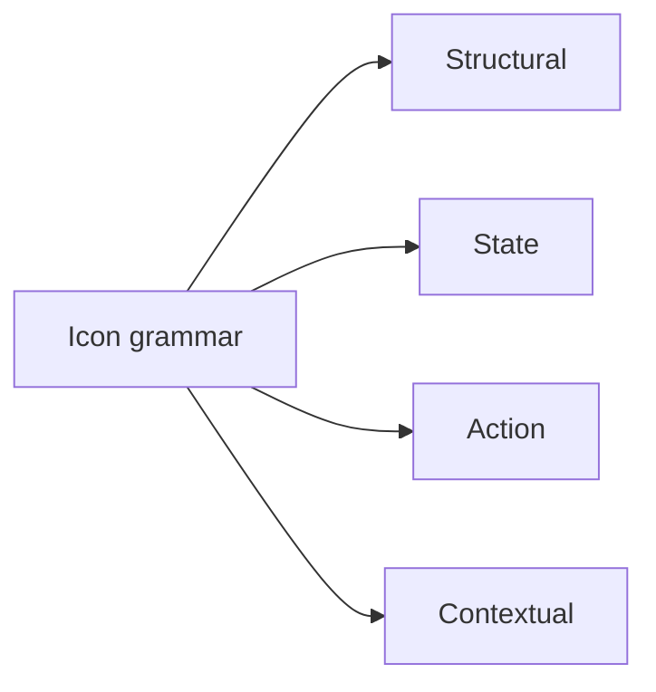

---

### **4.5.2 Style, Geometry, and Optical Balance**

Constraints:

* Outline icons only
* 1.5px stroke at 100% scale
* Rounded terminals
* 24×24 grid (Essentials)
* 20×20 grid (Marketing)
* Stroke colour always from neutral palette, never accent except for explicit CTAs

Accessibility:

* Minimum contrast 3:1
* No colour-only signalling
* Must remain recognisable down to 14px

**Inline Mermaid — fully separated from prose:**

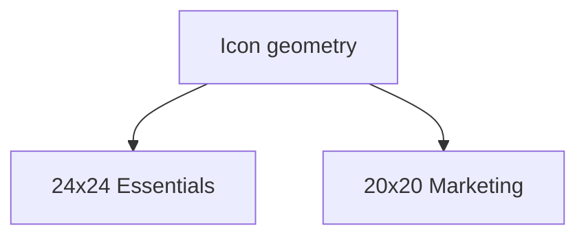

---

### **4.5.3 State Icon Set (Deterministic Evaluation States)**

Transcrypt’s rule engine yields exactly four states:

* Pass
* Fail
* Partial
* Evidence required

Rules:

* Shapes must differ even without colour.
* Outline style, never filled.
* Icons cannot imply uncertainty — state is binary or categorical.
* These icons must appear identically across owner, advisor, and verifier views.

(And for clarity: state icons must not become emotional or suggest future NIS2 capability.)

---

### **4.5.4 Illustration System (Strictly Limited)**

Illustrations in Transcrypt follow strict constraints:

* Flat vector
* Two-tone (neutral + cerulean)
* No characters, mascots, faces, hands, or “infographic humans”
* At most two shapes + one motion cue (e.g., upward arrow)
* Must never imply live automation

Essentials uses minimal, functional illustrations only. Marketing may use expressive, editorial illustrations provided they remain professional, tokenised, and non-semantic.

Allowed locations:

* Marketing conceptual explanation blocks
* Empty states in Essentials
* Report headers (subtle, abstract, non-semantic)

Forbidden:

* Roadmap previewing
* Suggesting integrations not in MVP
* Emotional narration (e.g., “relaxed compliance journey” visuals)

---

### **4.5.5 Usage Discipline and Anti-Pattern Prevention**

This is where most SaaS products break their own systems. Transcrypt will not.

Rules:

1. Icons must earn their place; decorative icons are prohibited.
2. Icon density capped at:

   * Marketing: **1 per section**
   * Essentials: **1 per interaction block**
3. Icons never replace text.
4. No icon may imply integrations, automation, or future-phase scope.
5. Icons must not animate except in controlled micro-states (SAIS §10).
6. Illustration assets may never appear in Essentials except empty states.
7. Icons must respect spacing rules of §4.3 and grid constraints of §4.4.

Every symbol reinforces the same message:
**Calm infrastructure. Deterministic behaviour. No surprises.**

---

## **4.6 Component Elevation and Depth**

Elevation and depth in Transcrypt define how components stack, interact, and establish hierarchy. They communicate priority, focus, and interaction boundaries without theatrics or emotional expression. Depth is not visual flair — it is structural geometry, an invariant behavioural contract enforced across Marketing, Essentials, advisor surfaces, verifier mode, and any future inference-assisted contexts.

Nothing floats arbitrarily. Nothing hovers for show. Nothing casts decorative shadows. Elevation exists to clarify interaction and state for Essentials while giving Marketing a controlled channel for expressive visual hierarchy. Essentials remains calm, boring, deterministic infrastructure; Marketing may create attention and storytelling depth without altering meaning or behaviour.

---

### **4.6.1 Elevation Tokens**

Transcrypt uses a small set of fixed elevation tokens.
Elevation tokens define vertical ordering — not “style” and not “ambience”.

Tokens:

* **Elevation 0** — default plane for all content surfaces
* **Elevation 1** — interactive components requiring affordance: dropdowns, popovers, menus
* **Elevation 2** — drawers, persistent side panels
* **Elevation 3** — blocking modals and global overlays

Rules:

* Tokens cannot be created ad hoc; new levels require a PDS amendment.
* Essentials uses elevation strictly for interactional hierarchy, with modals representing the structural apex.
* Marketing may use elevation 0–3 for expressive visual hierarchy but not for functional overlays.
* No token alters colour or shadow softness — all shadows are minimal, crisp, and neutral.

Shadows (for elevation indication):

* 0: none
* 1: `0 1px 2px rgba(0,0,0,0.06)`
* 2: `0 2px 4px rgba(0,0,0,0.08)`
* 3: `0 4px 8px rgba(0,0,0,0.12)`

No blur theatrics, no diffused glows, no cosmetics.

---

### **4.6.2 Component Elevation Hierarchy**

Each atomic component type has a fixed elevation:

* **Cards:** elevation 0
* **Tables:** elevation 0
* **Form fields:** elevation 0
* **Dropdowns / menus:** elevation 1
* **Tooltips:** elevation 1
* **Side panels / drawers:** elevation 2
* **Modals:** elevation 3
* **Blocking overlays:** elevation 3

Navigation follows similar rules:

* **Header bar:** elevation 1 (fixed)
* **Left sidebar:** elevation 1 (persistent)
* **Right advisor panel:** elevation 2 (contextual)

Marketing may use elevation levels 0–3 for expressive visual hierarchy, including raised cards, hover lifts, and layered hero compositions. Essentials uses elevation strictly for interaction and state (menus, drawers, modals). Marketing may not use functional elevation components such as modals, popovers, drawers, or overlays.

No screen may override these defaults without explicitly updating the system.

**Inline diagram (placed exactly where needed, not at the end):**

```mermaid
flowchart TD
    A[Elevation 3 Modals]:::e3
    B[Elevation 2 Drawers]:::e2
    C[Elevation 1 Menus, Tooltips, Header]:::e1
    D[Elevation 0 Main UI Plane]:::e0

classDef e0 fill=#e6eaed,stroke=#0a1a2a,stroke-width=1px
classDef e1 fill=#d9e2ec,stroke=#0a1a2a,stroke-width=1px
classDef e2 fill=#c0d7e3,stroke=#0a1a2a,stroke-width=1px
classDef e3 fill=#a7cad9,stroke=#0a1a2a,stroke-width=1px
```

---

### **4.6.3 Overlays, Modals, and Blocking Depth**

Modals and overlays represent the system’s highest elevation and require strict behavioural discipline:

* Modals use **Elevation 3** and are always blocking.
* Overlays dim the background with a fixed neutral scrim: `rgba(10, 26, 42, 0.55)`
* Modal elevation never stacks; there is no such thing as “modal on modal”.
* Drawers (Elevation 2) must sit beneath modals and may never overlap them.
* SAIS demands deterministic modal behaviour across tenants — modals cannot vary in size, shape, or position by role.

Rules for motion:

* Modals may fade in at 120–150ms but never slide.
* Drawers may slide (SAIS-approved), but in a single axis only.
* No parallax.
* No spring easing.
* Never imply emotional “softness” or elasticity.

Exports ignore elevation entirely — depth is interaction-only, never baked into printed outputs.

---

### **4.6.4 Hover, Focus, and Active Depth States**

Depth states carry interaction meaning:

* **Hover** may lighten borders or background; Marketing cards and CTAs may use a micro-elevation (up to Elevation 1) for emphasis, while Essentials hover states remain flat.
* **Focus** must use a clear, thick (2px) cerulean outline — never elevation.
* **Active state** may use a micro-elevation (Elevation 1) *only on components that are inherently interactive* (menus, dropdowns) or Marketing hero/CTA treatments that require emphasis.

Elements that **must not** use depth:

* Buttons
* Tabs
* Chips
* Pagination
* Form fields

These rely on colour, border, and spacing — not elevation.

---

### **4.6.5 Restrictions and Prohibitions**

This is where the system draws hard boundaries:

1. **No elevation changes based on role** (owner/advisor/verifier).
2. **No neumorphism, glassmorphism, parallax, or modernist “soft UI”.**
3. **No deep shadows exceeding elevation 3 rules.**
4. **No stacked modals for any reason.**
5. **No shadow changes on viewport resize.**

Elevation is architectural, not expressive.
Depth is hierarchical, not aesthetic.

Everything must look engineered, predictable, and serious — because Transcrypt’s job is to handle evidence and compliance, not to entertain.

---

# **5. Interaction Model**

The interaction model defines how Transcrypt behaves when a user does anything that changes state, requests information, or moves through the system. Where earlier sections established philosophy, structure, and functional scope, this section defines the rules of motion: how components respond, how transitions occur, how forms behave, how evidence moves through the interface, and how identity and session continuity are expressed.

Everything in this chapter reflects truths already defined upstream.
The PRD declares that Transcrypt must feel *calm, deterministic, auditable, and unambiguous*.
The SAIS establishes stateless compute surfaces, strict isolation, predictable routing, and reproducible evaluation paths.
The PDS now binds these architectural and product constraints into the visible, tactile experience of interacting with the system.

The interaction model does not describe aesthetics or visual style.
It governs behaviour: what the user can do, what the system does in response, which states are allowed, how errors surface, how recovery works, and which transitions are forbidden. It ensures that Marketing and Essentials behave as two surfaces of the same product, following the same laws of movement, validation, feedback, and continuity.

A user should always know three things at any moment inside Transcrypt:

1. **What state the system is in.**
2. **What they can do next.**
3. **Why the system responded the way it did.**

This section defines the rules that guarantee those outcomes.

---

## **5.1 Component Behaviour and State Rules**

Components in Transcrypt follow a closed set of states and deterministic transitions. A component never behaves probabilistically, never hides its state, and never implies persistence beyond what the architecture guarantees. These rules apply uniformly across Marketing and Essentials runtimes, ensuring that every interaction feels predictable, explainable, and calm.

Components may only reflect **canonical system state** or **explicitly permitted local UI state**. All transitions must be atomic, reversible where logically appropriate, and auditable through the SAIS-defined telemetry pipeline. No component may introduce behaviour not derivable from the PRD or permitted by architectural constraints.

### **5.1.1 Allowed Component States**

Components may exist only in the following universal states:

* **Idle** — awaiting user input or stably displaying canonical data.
* **Loading** — awaiting a deterministic response from a backend service; no partial interactivity allowed.
* **Success** — operation completed and state is canonical again.
* **Error** — a recoverable or terminal failure with clear explanation.
* **Disabled** — temporarily unavailable due to validation, identity, or billing state.
* **Read Only** — permitted to view but not modify due to role or subscription constraints.

These states map directly to SAIS runtime expectations. No other micro-states or speculative indicators are allowed.

##### **Component State Lifecycle**

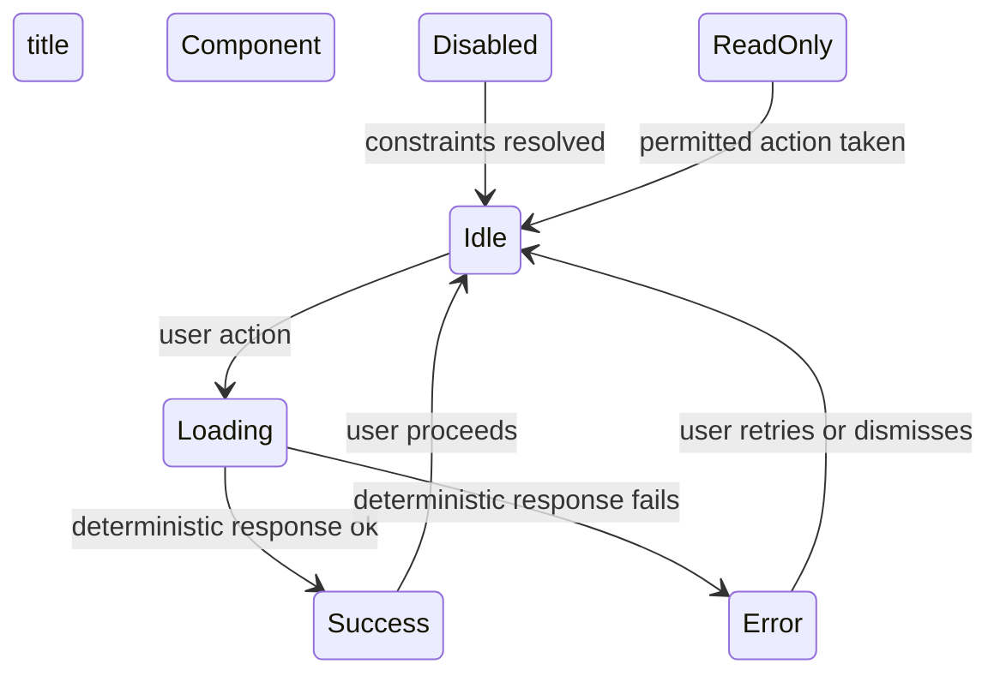

This lifecycle diagram appears here because it defines the behavioural law for **all** components; it cannot logically be deferred.

---

### **5.1.2 Deterministic State Transitions**

Transitions must follow these rules:

* **Explicit triggers only** — a component changes state only in response to a user action or a completed backend request.
* **No hidden recompute** — components must not re-evaluate themselves silently based on timers, background polling, or inference.
* **No partial transitions** — a component may not be half-interactive during Loading or Error.
* **State origin visibility** — the UI must convey whether a state is user-generated, service-generated, or identity-generated.
* **SAIS alignment** — the transition must correspond exactly to UI → Gateway → Service → Response, never implying a behaviour the system cannot perform.

These rules prevent nondeterministic UX behaviours and align with the PRD principle of explainable state.

##### **Deterministic Interaction Flow**

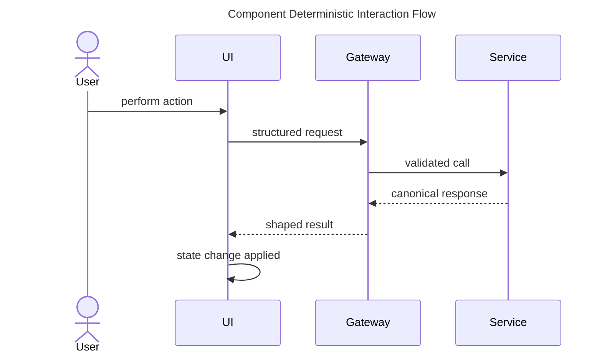

This diagram is inserted here because it **binds component behaviour to the SAIS execution path**. It cannot be detached without breaking comprehension.

---

### **5.1.3 Component–Service Interaction Contract**

Every component–service interaction follows these rules:

* **One request, one outcome** — no multi-path branching, no speculative UI changes.
* **Canonical or nothing** — the UI never renders partial backend data.
* **Audit attached** — each interaction must emit request_id, tenant_id, and version markers, as defined in SAIS §2.4 and §2.6.
* **No local inference loops** — any inference is build-time only; runtime behaviour must remain deterministic.

The UI is simply the visible projection of a stateless backend.
It must never behave as if stateful.

---

### **5.1.4 Unified Behaviour Across Marketing and Essentials**

The Marketing runtime is not a marketing “shell”: it is an SSR/ISR compute surface with obligations identical to Essentials. Therefore:

* Components must behave identically across both surfaces.
* Loading, success, and error states must follow the same visual and behavioural grammar.
* Navigation-related components must respect the same motion laws.
* State cannot differ based on surface; only **authority context** (authenticated vs unauthenticated) may differ.

##### **Unified Surface Behaviour Overview**

```mermaid
flowchart TD
title Unified Component Behaviour Across Surfaces
A[Marketing Component] --> B[Shared Behaviour Rules]
C[Essentials Component] --> B
B --> D[Deterministic State Lifecycle]
```

This diagram appears inline because it is the conceptual bridge that ensures surface parity, a core PRD requirement.

---

### **5.1.5 Forbidden Behaviours**

The following behaviours are strictly prohibited:

* **Silent auto-refresh**
* **Speculative UI predictions**
* **Background polling not declared in PRD**
* **Any probabilistic behaviour**
* **Implicit state transitions**
* **Local data storage beyond session scope**
* **Cross-tenant visual bleedthrough**
* **Optimistic updates** (PRD prohibits non-canonical representations)
* **Intermediate “flashing” states** caused by SSR/ISR hydration
* **Surfaces behaving differently unless dictated by identity or subscription level**

Forbidden behaviours enforce PRD clarity and SAIS architectural invariants.

---

## **5.2 System Navigation and Movement Behaviour**

Navigation in Transcrypt follows explicit, deterministic rules. Movement between screens, surfaces, and states must always reflect canonical system truth, never local assumptions. The Marketing runtime and the Essentials runtime obey the same motion laws, ensuring that no part of the product behaves unpredictably or expresses a separate UX grammar.

Navigation is a *mechanical contract* between the user, the UI, and the architecture. Every transition must be explainable, atomic, auditable, and consistent across devices and contexts. Reloads, backtracking, identity transitions, and error recovery are governed by the same rules.

### **5.2.1 Navigation State Model**

Movement is permitted only between well-defined page states.
No hidden intermediate states, no jitter, and no silent recomputations are allowed.

#### **Allowed Page States**

* **Stable** — screen fully resolved, canonical data loaded.
* **Loading** — awaiting a deterministic backend response.
* **Error** — stable error state with explicit cause and recovery.
* **Redirecting** — controlled movement via gateway-dictated constraints.
* **Session Transition** — identity or subscription state change underway.

Transitions must be one-way, atomic, and traceable.

##### **Navigation State Machine**

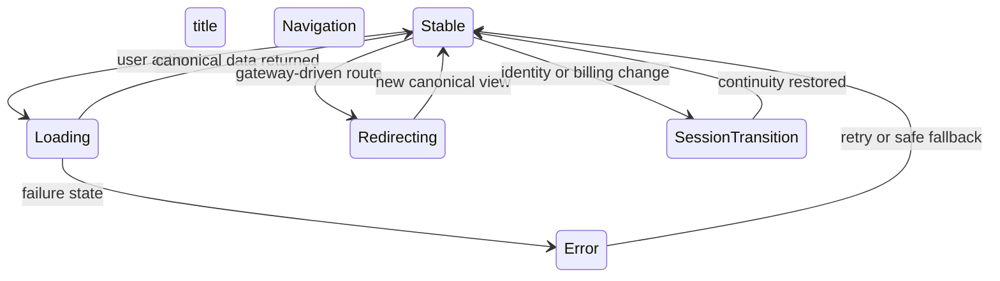

This diagram appears here because it expresses the **fundamental movement rules** that all navigation must obey.

---

### **5.2.2 Page-to-Page Movement Rules**

Page transitions follow these constraints:

* **No implicit navigation** — no movement without user intent or backend instruction.
* **Deterministic continuity** — navigation must not create appearance of different system truth between screens.
* **Canonical reload** — every page load reflects system state, not prior UI assumptions.
* **No client-side routing surprises** — hydration must not produce layout flashes, missing content, or pseudo-states.
* **Permission-aware routing** — forbidden paths must fail cleanly at the gateway.

Movement is linear unless explicitly defined otherwise by product logic; branching flows are avoided unless necessary for rulepack or evidence workflows.

---

### **5.2.3 Marketing↔Essentials Movement Contract**

Transcrypt consists of two compute surfaces:

* **Marketing (SSR/ISR)**
* **Essentials (SSR/authenticated)**

Both follow the same behavioural grammar.
Movement between them must be:

* explicit
* gateway-controlled
* identity-aware
* non-probabilistic
* auditable

##### **Marketing to Essentials Movement**

```mermaid
flowchart TD
title Marketing to Essentials Handoff
A[Marketing Page] --> B[Gateway Verification]
B --> C[Identity Check]
C --> D[Essentials Page]
```

This diagram is placed here because the Marketing→Essentials handoff is **the core navigation boundary** in the entire product.

#### **Rules for Cross-Surface Movement**

* Marketing must never directly route into authenticated content.
* Essentials must not leak into Marketing except through logged-out states.
* Identity context must be passed explicitly and deterministically.
* No implicit login or “magic continuation” is allowed.

This is a system-level guarantee, not a UX flourish.

---

### **5.2.4 Refresh, Reload, and Recovery Behaviour**

Reloading and session boundary behaviours are particularly sensitive under SSR/ISR and stateless compute constraints. The rules are:

* **Reload must never lose truth** — the page always returns to canonical state.
* **Expired sessions must be explicit** — user is returned cleanly to entry point with visible explanation.
* **No stale cache persistence** — ISR content refetch must never contradict Essentials state.
* **No “half-login” state** — refresh must resolve deterministically to logged-in or logged-out.
* **Backward navigation must not reintroduce stale state**.

##### **Refresh and Recovery Flow**

```mermaid
flowchart LR
title Refresh and Recovery Flow
A[User Refreshes Page] --> B[Gateway Validates Session]
B --> C{Session Valid?}
C -->|Yes| D[Canonical Page]
C -->|No| E[Session Expired View]
E --> F[Re-authenticate]
```

This diagram appears here because it expresses **continuity**, which is central to movement behaviour.

---

### **5.2.5 Forbidden Navigation Behaviours**

The following behaviours are strictly prohibited:

* **Speculative routing** (AI-driven or predictive).
* **Client-side path guessing** (routing without gateway confirmation).
* **Silent failures** or ambiguous redirects.
* **Hydration-induced flicker of protected or stale content.**
* **Cross-tenant path leakage**.
* **Optimistic navigation** (routing to a page before the backend confirms legitimacy).
* **Dynamic restructuring of available routes based on incomplete profile or inference.**

These behaviours violate PRD determinism, SAIS boundaries, and Transcrypt’s ethos of trust through clarity.

---

## **5.3 Data Entry, Validation, and Form Integrity**

Data entry in Transcrypt is governed by strict determinism and correctness. Forms do not guess, infer, or behave probabilistically. Every field, validation rule, error message, and recovery path must reflect canonical system truth defined by the PRD and implemented by the SAIS. The UI may perform lightweight syntax checks, but all semantic validation and rule logic remains server-authoritative.

Marketing and Essentials runtimes follow the same behavioural grammar. SSR/ISR boundaries must never introduce conflicting states or ambiguous validation. All errors must be explicit, explainable, and actionable, and the user must always understand what is required, why it is required, and how to correct an issue.

### **5.3.1 Principles of Data Entry and Correctness**

Forms represent the system’s most sensitive operation: capturing data that influences compliance outcomes, evidence binding, billing state, and identity transitions. As such:

* Users must see exactly what data is required and why.
* Required fields must be explicit—no hidden dependencies.
* Syntax checks (email format, allowed characters) may occur locally, but semantic checks (control logic, rulepack requirements, evidence constraints) must occur server-side.
* Forms must not mutate user input silently.
* No auto-complete, auto-guessing, or speculative interpretation of partial input is allowed.
* Changes must only reflect user action or server-authoritative updates.

This ensures correctness and prevents inconsistent compliance evaluation.

### **5.3.2 Deterministic Validation Rules**

Validation follows a layered model:

* **Client-side (syntax only)**: simple correctness rules (length, characters, well-formed formats).
* **Server-side (canonical semantics)**: all business logic, rulepack logic, and control constraints.
* **Gateway mediation**: shape, validate, and reject malformed input.
* **Service validation**: authoritative acceptance or rejection.

No optimistic UI updates are allowed. No field is ever marked “valid” unless confirmed by the canonical path.

#### **Validation Flow**

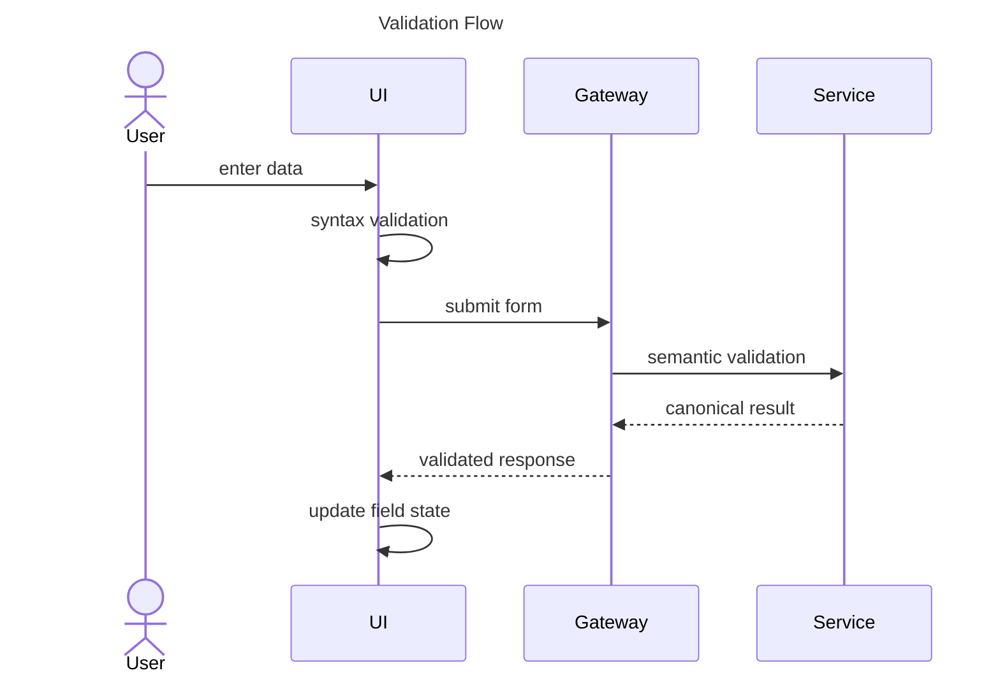

This diagram appears here because it defines the **authoritative chain of validation**, which is the backbone of form behaviour.

### **5.3.3 Error Lifecycle and Recovery**

Errors must be:

* deterministic
* stable
* actionable
* specific to cause
* unambiguous about provenance (client or server)
* cleared only by explicit user correction or server confirmation

No ephemeral “shake” animations, no ambiguous red borders, no “something went wrong”.

Errors fall into three categories:

* **Syntax errors** — caught immediately on field interaction.
* **Semantic errors** — returned from server after canonical evaluation.
* **State errors** — session expiry, forbidden path, or violation of PRD rule constraints.

#### **Error State Lifecycle**

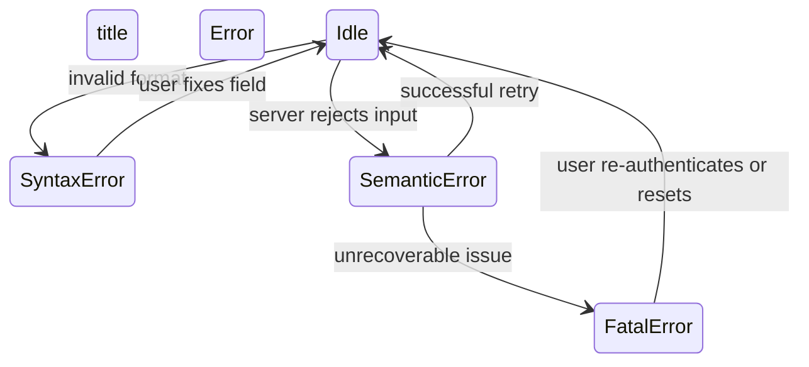

This diagram belongs here because correctness depends on **explicit, predictable recovery paths**.

### **5.3.4 Canonical State, Rehydration, and Refresh Behaviour**

SSR/ISR dynamics can destabilise poorly designed forms. To prevent ambiguity:

* Refresh must always return the form to **canonical** state, not local/UI memory.
* ISR updates may refresh the page shell but must never mutate field values invisibly.
* On refresh, partially entered data may only persist if explicitly permitted and documented.
* Server-derived validation errors must reappear exactly as before—no disappearance unless the cause is resolved.

#### **Canonical Rehydration Flow**

```mermaid
flowchart TD
title Canonical Rehydration Flow
A[User Refresh] --> B[SSR or ISR Render]
B --> C[Gateway Fetches Canonical State]
C --> D{Partial Data Allowed?}
D -->|Yes| E[Merge User Draft and Canonical]
D -->|No| F[Render Canonical State Only]
```

This diagram is inline because rehydration is the **largest risk surface** for inconsistent form correctness.

### **5.3.5 Forbidden Form Behaviours**

The following behaviours violate PRD and SAIS constraints and are strictly prohibited:

* **Optimistic validation** — marking fields correct before server confirmation.
* **Predictive auto-fill** — any inference-driven suggestion at runtime.
* **Implicit field mutation** — changing values without user action.
* **Multi-source truth** — conflicting data between Marketing and Essentials views.
* **Silent error clearing** — hiding error states without cause.
* **Local persistence unless explicitly defined**.
* **Client-side rule logic**, beyond syntax checks.
* **Stale or cached error messages after canonical fetch**.
* **Heuristic or probabilistic field correction.**

These prohibitions ensure that user-entered data remains a direct, unambiguous expression of real system state.

---

## **5.4 Evidence Intake and File Handling Behaviour**

Evidence intake is the most sensitive user-driven operation in Transcrypt. Every uploaded file becomes an immutable artefact tied to compliance, rulepack evaluation, and auditability. The UI must reflect the exact state of the evidence pipeline defined in the SAIS — no optimistic behaviour, no partial acceptance, no silent failure, and no misrepresentation of canonical truth.

Evidence handling follows a strict chain:

User → UI → Signed URL → Object Store → Hashing → Verification → Metadata Commit → Binding → Canonical Evidence Artefact

Every behavioural rule in this section arises directly from that chain.

---

### **5.4.1 Allowed Evidence Types and Constraints**

Before any behavioural rules apply, the UI must enforce clear, explicit constraints:

* allowed MIME types
* maximum file size
* maximum number of files per control
* forbidden formats
* integrity requirements (no multi-part, no partial chunks)
* naming constraints
* zero tolerance for hidden extensions or format masquerading

These constraints come from PRD requirements for explainability and SAIS requirements for safe storage and deterministic verification. The UI must present these limits *before* an upload begins, not after a failure.

---

### **5.4.2 Evidence Intake Pipeline and State Transitions**

Uploading evidence is a multi-stage pipeline. Each stage must be visible and deterministic.

Stages:

1. **Idle** — waiting for user selection.
2. **Selected** — file picked, awaiting signed URL.
3. **Uploading** — browser → object store.
4. **Uploaded** — file in object store, awaiting hash verification.
5. **Hashing** — backend computes digest.
6. **Verifying** — digest compared against size and object store metadata.
7. **Binding** — metadata + hash + object location committed atomically.
8. **Complete** — canonical evidence artefact created.
9. **Failed** — any non-recoverable error.
10. **Retryable** — safe to retry (network glitch, expired URL).

#### **Evidence Intake Pipeline Overview**

```mermaid
flowchart TD
title Evidence Intake Pipeline
A[File Selected] --> B[Obtain Signed URL]
B --> C[Upload to Object Store]
C --> D[Hash File]
D --> E[Verify Integrity]
E --> F[Bind Metadata and Hash]
F --> G[Evidence Complete]
C --> H[Retryable Error]
H --> B
D --> I[Failure]
I --> A
```

This diagram appears here because it defines the full UI-facing flow from selection to canonical artefact.

---

### **5.4.3 Hashing, Verification, and Immutability Rules**

Hashing is not cosmetic — it is the central integrity guarantee of the entire product.

UI behaviour must reflect:

* files are not “uploaded” until hash verification passes
* hashing is performed server-side only
* the UI must show clear progression from uploaded → hashing → verified
* files failing verification must return to a stable, explainable error state
* the UI must never present a file as usable until binding succeeds

Even transient states must be deterministic.

#### **Hashing and Immutability Flow**

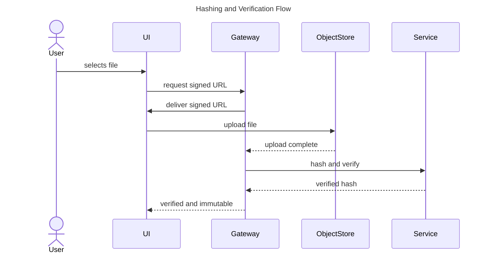

This diagram appears here because it expresses the **verify-or-fail** logic that determines whether evidence becomes canonical.

---

### **5.4.4 Signed URL Lifecycle and File Transport Behaviour**

Signed URLs govern how the browser sends evidence to object storage.
Their lifecycle directly shapes the UI:

* URL request → URL received → URL used → URL expired
* no reuse
* no client-side caching
* no multi-use semantics
* no speculative upload
* expiry errors must present deterministic retry paths
* retries must obtain a new signed URL

#### **Signed URL Lifecycle**

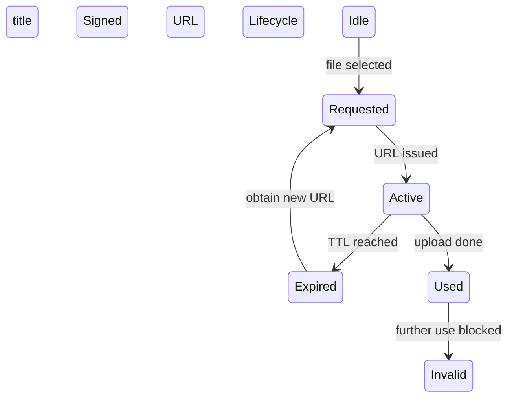

This diagram must be inline because signed URL behaviour directly constrains what the UI may and may not do.

---

### **5.4.5 Atomicity, Retry Semantics, and Failure Behaviour**

Evidence intake must be atomic. That means:

* no partial evidence artefacts
* no orphaned metadata
* no orphaned files in object storage
* retries must never double-commit
* users must see clear, stable error states
* a retry must be functionally equivalent to a fresh upload
* canonical artefacts must be created once only, after metadata+hash+object tie together

Failure classes:

* **URL expiry** (retryable)
* **network interruption** (retryable)
* **hash mismatch** (fatal)
* **object store error** (retryable unless corruption suspected)
* **gateway rejection** (fatal)
* **service-level rejection** (fatal)

#### **Atomicity and Retry State Machine**

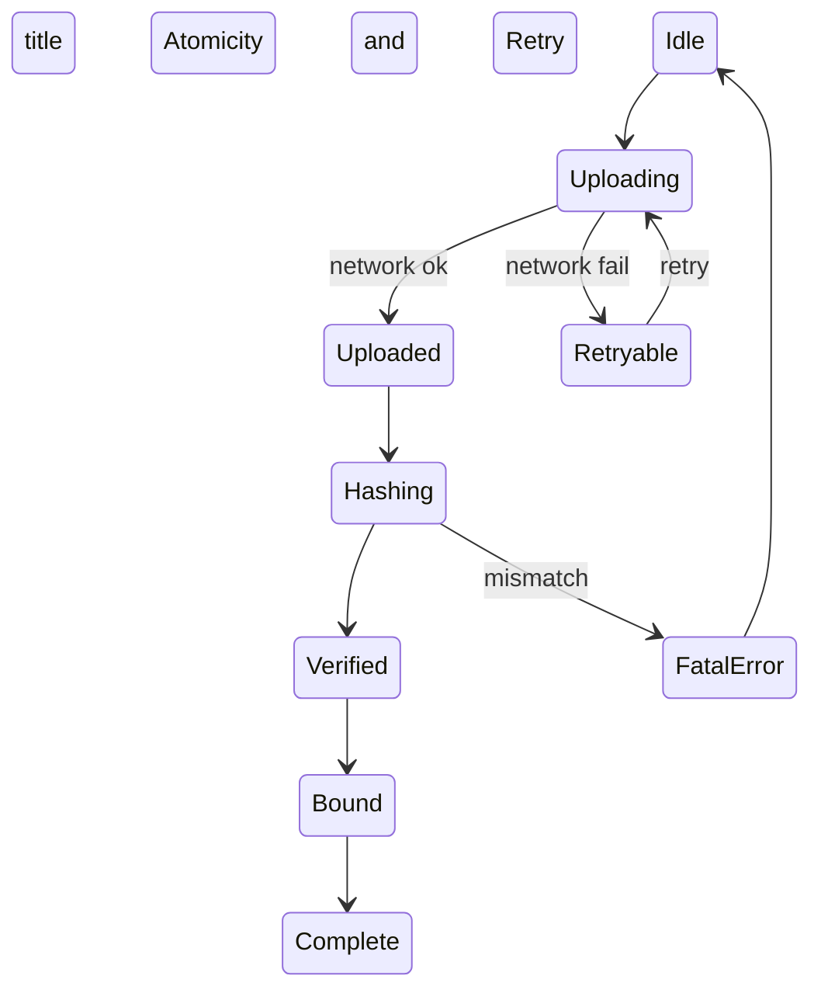

This diagram appears here because atomic recovery is central to safe evidence handling.

---

### **5.4.6 Evidence Binding and Canonicalisation**

Binding is the moment where:

* object store file
* hash digest
* metadata record in Postgres

become a single, immutable evidence artefact.

UI behaviour here must:

* wait for binding before presenting "complete"
* represent binding failures explicitly
* ensure binding steps never appear instantaneous or skipped
* never present unbound files as legitimate evidence
* refresh canonical state after binding to avoid stale or duplicate representations

#### **Binding Semantics Diagram**

```mermaid
flowchart LR
title Evidence Binding Semantics
A[File in Object Store] --> B[Hash Verified]
B --> C[Metadata Record Created]
C --> D[Bind Hash + Metadata + Object]
D --> E[Canonical Evidence Artefact]
```

Inline because it defines the **only moment evidence becomes real**.

---

### **5.4.7 Forbidden Evidence Behaviours**

The following behaviours are strictly prohibited:

* optimistic upload (“appears done before binding”)
* resumable uploads
* chunked uploads
* partial data persistence
* reuse of signed URLs
* client-side hashing
* content-type guessing
* AI-driven metadata extraction
* speculative auto-evidence linking
* silent dropping of failed uploads
* allowing multiple parallel uploads for same evidence slot
* representing incomplete artefacts as usable

These prohibitions protect the integrity of the compliance pipeline and honour the PRD's determinism requirements.

---

## **5.5 Feedback, Error States, and User Visibility Rules**

Feedback in Transcrypt is not decorative. It is the system’s commitment to telling the truth about its own state. Whether loading, blocked, successful, or failed, the UI must represent canonical backend conditions precisely — without speculation, optimism, personality, or approximation.

Errors must be explicit and explainable. Success must only surface when the system has actually reached the canonical state. Visibility rules ensure the user never sees stale, contradictory, or partial representations of reality. The user must always understand what just happened, why it happened, and what they can safely do next.

Marketing and Essentials runtimes use the exact same feedback grammar, ensuring that the public surface communicates with the same calm clarity as the authenticated experience. No inference-driven language or probabilistic messaging is permitted anywhere in the system.

---

### **5.5.1 Feedback Grammar and Visibility Rules**

Feedback must reflect canonical backend truth, expressed in a stable, deterministic grammar:

* **Loading** means a request has been made and a canonical response is pending.
* **Success** means the canonical operation has fully completed.
* **Error** means the operation failed deterministically with a known cause.
* **Blocked** means the operation cannot proceed due to identity, billing, or permission constraints.
* **Idle** means the component reflects a stable, ready-to-act state.

Visibility rules:

* The UI must not flicker between states.
* Loading indicators must be tied to real requests only.
* No parallel spinners.
* No “silent success” or “silent failure.”
* No hiding important failure conditions.
* Success indicators must only appear after backend confirmation.
* Timeout behaviour must be explicit and consistent.

This grammar ensures all feedback matches the deterministic backbone of the SAIS.

---

### **5.5.2 Error States and Provenance**

Errors have three possible origins:

* **Client-side syntax errors** (invalid format).
* **Gateway rejections** (malformed requests, auth issues, expired session).
* **Service-level failures** (semantic rejection, rulepack mismatch, forbidden action).

Each must be visibly distinct and explained to the user with:

* the cause,
* the remedy,
* the next permissible action.

Errors must never imply hidden system behaviour or encourage blind retrying. An error must be actionable or terminal — never ambiguous.

#### **Unified Feedback State Diagram**

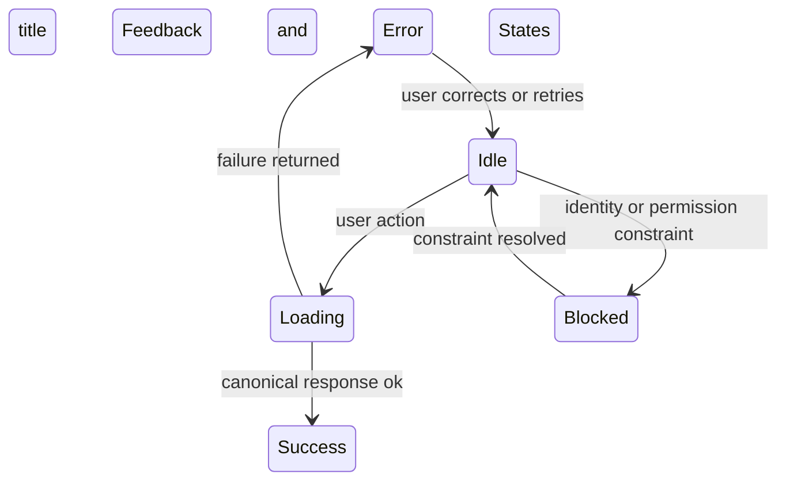

This diagram is presented here because it defines the full feedback state surface used across all components and surfaces.

---

### **5.5.3 Recovery and User Guidance**

Recovery must be deterministic and predictable:

* Errors must persist until the underlying cause is corrected.
* Success must persist until overridden by a new action.
* Loading indicators must end exactly when the canonical response arrives — no wobble, no delay.
* Retry buttons must only appear on retryable states.
* Fatal states must offer a clear path back (e.g., re-authentication).
* Refresh must restore canonical state, not local placeholder values.

User guidance must be:

* directive, not interpretive
* clear, not verbose
* accurate, not speculative
* consistent across Marketing and Essentials

No inference assistance is allowed.

---

### **5.5.4 Forbidden Feedback Behaviours**

The following behaviours violate PRD and SAIS determinism and are strictly forbidden:

* **“Something went wrong” messages** with no provenance.
* **Anthropomorphic or personality-driven language.**
* **Speculative suggestions or AI-generated “best guesses.”**
* **Optimistic success messaging** before backend confirmation.
* **Hiding critical error conditions behind subtle icons.**
* **Loading placeholders that contradict canonical data.**
* **Auto-clearing errors without cause.**
* **Delayed or asynchronous visual state changes** after canonical truth is known.
* **Contradictory state surfaces** (e.g., success + error simultaneously).

These prohibitions prevent the system from misrepresenting its own state — a critical requirement for auditability and user trust.

---

## **5.6 Identity, Session Continuity, and Access Stability**

Identity is the anchor that stabilises every other behaviour in Transcrypt. A user’s identity determines their tenant, their permissions, their visibility rules, and what actions the system will accept. Session continuity ensures that identity remains reliable across refresh, navigation, and cross-surface transitions. Access stability ensures the system never misrepresents authority — no “half logged-in” states, no stale permissions, no ambiguous authority contexts.

Identity is always explicit, never inferred.
Continuity is always deterministic, never approximate.
Access is always authoritative, never optimistic.

Marketing and Essentials surfaces obey the exact same identity rules.

---

### **5.6.1 Identity Context and User State Visibility**

The system must always make the user’s identity context visible and unambiguous:

* **Logged-out**: Public, unrestricted, no tenant context.
* **Logging-in**: Redirecting through IdP, state pending.
* **Logged-in**: Explicit authenticated state, tenant context resolved.
* **Session-valid**: User’s identity and permissions are current.
* **Session-expired**: Session has lapsed; user is returned to a safe entry point.
* **Logged-out (forced)**: User was removed from context due to expiry, revocation, or permission change.

Identity must never appear as:

* partial
* stale
* ambiguous
* visually contradictory

No page may display UI that contradicts the current identity state.

---

### **5.6.2 Session Lifecycle and Continuity Rules**

Sessions represent authenticated continuity. They must follow a deterministic lifecycle governed by the Gateway and SAIS. The UI must reflect these transitions precisely.

#### **Session State Cycle**

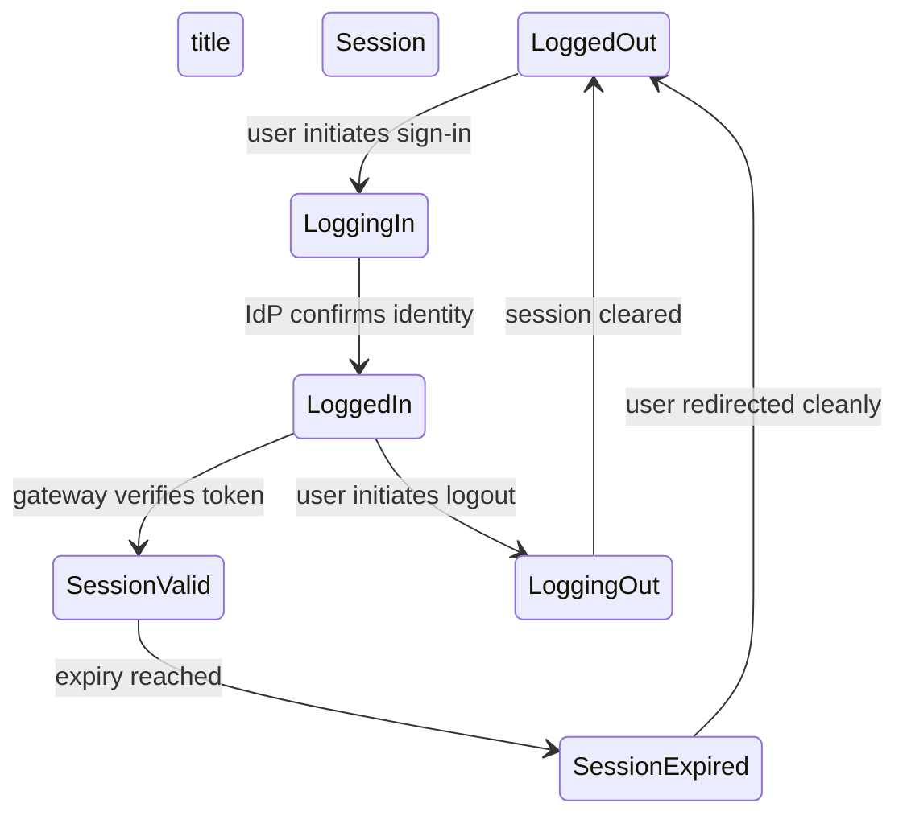

This diagram is inline because identity stability depends entirely on these state transitions.

Session continuity rules:

* A refresh must return the user to a canonical identity state (valid or expired).
* A stale session must be surfaced immediately.
* Permission or billing changes must be expressed the next time identity is validated.
* No partial page rendering should occur during identity shifts.
* No client-side caching of permissions.

Identity is always server-authoritative.

---

### **5.6.3 Cross-Surface Identity Flow and Routing Authority**

Transcrypt has two compute surfaces:

* **Marketing (SSR/ISR)** — may present logged-in/logged-out variants.
* **Essentials (SSR/authenticated)** — requires valid identity.

Movement between surfaces must follow strict rules:

* Marketing → Essentials always flows through **Gateway identity validation**.
* Essentials → Marketing is allowed only via **explicit user intent** (logout or navigation).
* No “hidden” or automatic transitions.
* No client-side identity shortcuts.
* No bypass around Gateway.
* No ISR caching of identity-sensitive content.

#### **Cross-Surface Identity Flow**

```mermaid
flowchart TD
title Cross Surface Identity Flow
A[Marketing Surface] --> B[Gateway Identity Check]
B --> C[Essentials Surface]
C --> D[Return to Marketing]
```

This diagram appears here because cross-surface transitions are the only identity topology boundary in the product — they must be explicit and verifiable.

---

### **5.6.4 Access Stability and Permission Integrity**

Access stability ensures that the user’s authority is always correct and always in sync with canonical truth.

Rules:

* Permissions must be validated on every page load.
* UI must never show controls the user cannot legally use.
* Revoked permissions must take effect on next identity validation.
* Billing lapses must result in clean, predictable transitions to restricted modes.
* No optimistic rendering of privileged controls.
* No role-based UI decisions made client-side beyond basic hiding animations.

If the backend says “no”, the UI must immediately reflect that reality.

Permission integrity demands:

* no contradiction between UI state and backend authority
* no speculative rendering
* no ambiguous disabled controls without explanation
* explicit messaging when an action is blocked due to identity or permission constraints

---

### **5.6.5 Forbidden Identity Behaviours**

The following are strictly prohibited:

* **Predictive or inferred identity** (AI guesses, behavioural heuristics).
* **Silent session expiry** (session must never “just stop working”).
* **Optimistic permission assumptions**.
* **Cross-surface drift** (Marketing implying access that Essentials rejects).
* **ISR rendering of identity-sensitive content**.
* **Partial login or stale role representations**.
* **Identity-dependent UI changes without authoritative confirmation**.
* **Implicit re-authentication** (no background login magic).
* **Permission changes applied without revalidation**.

These prohibitions ensure that identity remains stable, consistent, and auditably correct.

---

# **6. Marketing Runtime Design**

Marketing is the public-facing compute runtime of Transcrypt. It operates as a full SSR/ISR surface under the same architectural constraints that govern Essentials, not as a decorative website or separate product. Its purpose, structure, layout, and content differ from Essentials, but its behaviour must follow the same interaction laws, identity constraints, and determinism rules defined in Sections 4 and 5. Users must experience Marketing and Essentials as two perspectives of a single, coherent system.

Marketing communicates value, establishes credibility, and guides visitors toward the correct next step. It is where most journeys begin, and it must behave with the same stability and clarity as the authenticated application. Identity transitions often originate here, meaning every Marketing page must render correctly under SSR/ISR constraints, hydrate without contradiction, and respect the canonical identity state returned by the gateway.

Marketing must present predictable layouts, stable component behaviour, and deterministic feedback under all conditions, including mobile and low-bandwidth environments. Nothing in this runtime may misrepresent capability, imply hidden functionality, or introduce behavioural drift relative to Essentials.

The subsections that follow define the structural templates, article layouts, identity handoff rules, and performance variants that shape the Marketing runtime and ensure it remains fast, clear, canonical, and fully aligned with the behavioural system model already established.

## **6.1 Page Templates**

The Marketing runtime uses a fixed set of deterministic templates that define the structural skeletons of all public pages. Templates differ in purpose, layout, and content density, but they must all follow the same interaction laws, identity constraints, and determinism rules that govern Essentials. These templates ensure predictable funnel paths, stable SSR/ISR rendering, safe hydration, and a coherent experience across the entire system.

Templates may be visually expressive, but they must not introduce behaviours, components, or interaction patterns that contradict the system grammar defined in Sections 4 and 5. Every template expresses a constrained composition of fixed zones (hero, CTA, trust blocks, footer) and variable content regions, ensuring clarity, consistency, and performance under all device and network conditions.

### **6.1.1 Template Archetypes**

The Marketing runtime supports a controlled set of template archetypes:

* **Landing Template** — hero, value statement, primary CTA, trust surface, narrative blocks.
* **Feature Template** — structured explanation zones, screenshots/illustrations, contextual CTA.
* **Pricing Template** — comparison grid, summary blocks, stable CTA positioning, no behavioural drift.
* **Why/Trust Template** — credibility blocks, external validation, security highlights.
* **Legal Template** — static, anchor-based navigation, no dynamic content.
* **Content Hub Template** — list-based layouts for blog/category surfaces.

Each archetype maintains a predictable left-to-right and top-to-bottom narrative structure. None may introduce functionality belonging exclusively to Essentials, such as evidence widgets, evaluation triggers, or tenant-specific controls.

### **6.1.2 Composition Zones and Invariants**

All templates share the same structural invariants:

* **Header Zone** — navigation, login entry point, stable across all templates.
* **Hero Zone** — clear value statement, deterministic size and spacing rules.
* **Primary CTA Zone** — one CTA per page, positioned deterministically.
* **Narrative Blocks** — long-form content regions with fixed spacing and typography rules.
* **Trust/Validation Blocks** — selective, non-interactive, no behavioural unpredictability.
* **Footer Zone** — global navigation, legal links, stable architecture across templates.

These zones may vary in composition but not in behavioural rules. Hydration must never reflow the structure or reveal contradictory identity states. ISR regeneration must not alter the layout in identity-sensitive ways.

#### **Template Anatomy Diagram**

```mermaid
flowchart TD
title Template Anatomy
A[Header] --> B[Hero]
B --> C[Primary CTA Zone]
C --> D[Narrative Blocks]
D --> E[Trust Blocks]
E --> F[Footer]
```

This diagram appears here because it defines the canonical structural scaffold that all templates must follow.

### **6.1.3 Dynamic and Regenerative Regions**

Marketing templates may contain dynamic content, but only within the following constraints:

* **ISR-generated blocks** must be identity-agnostic.
* **Hydration** must never reveal stale or partially authenticated states.
* **Dynamic content** must not reorder itself based on inference or implicit rules.
* **Inline components** may fetch public data but must not imply user-specific behaviour.

Templates may include:

* updated statistics
* feature highlights
* blog summaries
* announcement banners

…but all dynamic data must be canonical, cached safely, and rendered without violating determinism.

Identity-sensitive areas (e.g., login button, personalised CTA) are rendered only server-side with explicit gateway checks. No template may conditionally alter its structure based on inferred user behaviour.

### **6.1.4 Forbidden Template Behaviours**

The following behaviours are prohibited:

* **Any AI-driven or inferred content rearrangement.**
* **Identity-conditional template switching without gateway validation.**
* **Optimistic rendering of CTA states.**
* **Hydration-induced layout flicker or structure shifts.**
* **Embedding Essentials-only components (evidence forms, evaluation UI).**
* **Implicit navigation or auto-advancing flows.**
* **Templates that obscure or duplicate CTAs.**

Templates must remain stable, safe, predictable, and aligned to the canonical Marketing funnel logic defined in the PRD.

---

## **6.2 Blog and Article Layouts**

The Blog is a structured, deterministic reading environment within the Marketing runtime. It exists to communicate expertise, provide credibility signals, and support search-driven discovery. Although article surfaces differ in density and purpose from landing or product pages, they must still follow the same interaction laws, identity rules, and determinism guarantees defined in Sections 4 and 5. Articles are content-first but never behaviourally permissive: the layout, render path, and component set are constrained to ensure clarity, stability, and architectural correctness.

Blog pages are rendered using SSR or ISR and must never expose stale identity, contradictory state, or dynamic content that implies personalisation. Articles may guide readers to CTAs, but only through stable, non-intrusive zones that do not interrupt reading flow. No inline component may behave differently from its Essentials counterpart in terms of loading, error grammar, or interaction rules.

### **6.2.1 Article Template Structure**

Articles follow a fixed, predictable structure to maintain clarity and avoid behavioural drift:

* **Article Header** — title, subtitle, publish date, optional author line.
* **Metadata Row** — tags and categories, identity-agnostic and deterministic.
* **Hero Media (optional)** — static image or banner; no video autoplay, no dynamic recomposition.
* **Body Content** — long-form content rendered with stable typographic rules, fixed spacing, and deterministic heading hierarchy.
* **Inline Assets** — images, diagrams, code blocks, quotes; all rendered canonically, with no dynamic fetch, inference, or reflow.
* **Closing CTA Zone** — a single, predictable CTA placed after the article, structurally identical across all posts.
* **Article Footer** — navigation to category index or Blog root, not personalised.

This structure may not be conditionally rearranged based on session state, behavioural inference, or traffic source.

### **6.2.2 Readability, Typography, and Asset Rules**

Article readability is a functional requirement, not a cosmetic preference. The following rules apply:

* **Line Length** — fixed maximum width for reading comfort across devices.
* **Heading Hierarchy** — deterministic H1–H4 progression; no collapsed, re-styled, or dynamically injected headings.
* **Spacing and Rhythm** — predictable vertical rhythm across all blocks; no dynamic expansion.
* **Image Rules** — static dimensions, lazy-loaded safely, no inference-based cropping or resizing.
* **Code Blocks** — monospace styling, fixed grammar, deterministic syntax highlighting.
* **Quotes and Callouts** — visually distinct but behaviourally inert; never collapsible or interactive.

Accessibility rules mirror those of Essentials: predictable focus behaviour, no hidden affordances, and no content that reflows unexpectedly at hydration.

### **6.2.3 SSR/ISR Rendering and Canonicality**

Blog pages must be generated under the same SSR/ISR constraints as the rest of the Marketing runtime:

* **Identity-Agnostic Regeneration** — ISR pages must never contain personalised or identity-conditioned content.
* **Canonical URL Rules** — each article has one canonical URL; no dynamic variants.
* **Hydration Safety** — hydration must not re-reveal old session data or create contradictory states in the header.
* **Stable HTML Skeleton** — the layout may not change shape when scripts load; all dynamic behaviours must be opt-in and deterministic.
* **No Mixed Content** — article content must be delivered atomically; no partial or progressive rendering.

If the user is signed in, the only allowed dynamic variant is the header changing state after authoritative gateway validation — never through inference, memory, or cached state.

### **6.2.4 Forbidden Article Behaviours**

The following behaviours are explicitly disallowed:

* **Personalised recommendations**, related posts, or “users also read”.
* **AI-driven or inference-driven content reordering**.
* **Identity-dependent article variants**.
* **Dynamic TOCs that change based on behaviour**.
* **Optimistic components** (e.g., “likes”, counters, ephemeral interactions).
* **Embedded Essentials-only controls**, such as evidence upload widgets.
* **Auto-advancing, scroll-snapping, or behavioural nudging**.
* **Hydration that alters layout structure**.
* **Inline fetches that are not deterministic or canonical**.

Articles must remain clear, predictable, and safe, acting as a credibility surface bound to the same behavioural grammar as the rest of Transcrypt.

---

## **6.3 Marketing→Essentials Handshake States**

The Marketing→Essentials transition is the system’s identity boundary. Marketing is anonymous, cacheable, and identity-agnostic; Essentials is authenticated, tenant-bound, and deterministic. The handshake between them must follow strict rules to prevent stale identity, contradictory state, hydration drift, or incorrect redirect behaviour. Every CTA that leads into Essentials must invoke the same canonical sequence: express intent → gateway challenge → identity validation → target view resolution → deterministic landing.

Marketing may differ in structure and purpose, but it must obey the same interaction laws, identity constraints, and determinism rules that govern the authenticated runtime. No transitional state may imply authentication without gateway validation, and no Marketing page may present an identity state that has not been authoritatively confirmed.

### **6.3.1 Identity Entry Points**

Marketing provides four legal inbound identity paths:

1. **Signup CTA** — initiates the onboarding identity flow for a new tenant owner.
2. **Login CTA** — re-establishes identity for returning users.
3. **Invite Acceptance** — follows a deterministic link containing a structured token; resolves into contributor or helper roles after gateway validation.
4. **Return-to Pathing** — user enters Essentials via a remembered intent (e.g., from a blog article CTA) but only after the gateway confirms identity.

Each path must be stable, non-inferred, and unambiguous. Marketing cannot adjust or reinterpret a user’s intended destination.

### **6.3.2 SSR/ISR Identity State Rules**

Marketing pages may be statically generated or regenerated, but identity-sensitive regions must follow strict rules:

* SSR/ISR output **must always render as anonymous** unless gateway validation occurred during the request.
* Hydration **must not flip identity state** unless the gateway supplies canonical identity.
* Cached pages must not contain personalised fragments.
* The header may switch from anonymous to authenticated only after deterministic confirmation.
* No optimistic UI may predict identity or tenant context.

Templates must remain structurally stable during hydration; no layout shift is permitted when identity resolves.

### **6.3.3 Gateway-Controlled Handoff Sequence**

All transitions from Marketing to Essentials must follow the same sequence:

1. User activates a CTA.
2. Marketing issues an identity intent (login, signup, invite).
3. Gateway performs the authentication challenge.
4. Identity is validated, no partial or inferred states allowed.
5. Essentials resolves the correct target view.
6. User lands on the deterministic post-auth surface.

Marketing may not short-circuit this flow or infer any step. The gateway is the sole authority for identity correctness.

### **6.3.4 Canonical Redirect and Target View Resolution**

Essentials applies a strict target-resolution model:

* **Signup** → Quick Start for new tenants.
* **Login** → previous working surface if known; otherwise Essentials dashboard.
* **Invite Acceptance** → contributor or helper landing page defined by the invite token.
* **Return-to** → a validated URL that must match an allowed list; unrecognised values resolve to dashboard.

Marketing must not override or modify this logic. Redirects must be canonical and must not expose internal URLs or tenant identifiers.

### **6.3.5 Forbidden Transitional States**

The following states are illegal and must never appear:

* **Semi-authenticated UI** (header authenticated, body anonymous).
* **Out-of-date identity** derived from cache, memory, or heuristics.
* **Hydration-induced identity flicker**.
* **Optimistic login indicators** (e.g., “Welcome back” before validation).
* **Implicit tenant association** before Essentials resolves the tenant.
* **Post-auth fragments leaking into pre-auth surfaces**.
* **Split-state rendering** where identity and redirect target disagree.
* **Loopback redirects** caused by stale session cookies.

Every illegal state must instead fall back to deterministic anonymous rendering or a gateway-initiated redirect.

### **6.3.6 Identity Handoff Diagram**

```mermaid
stateDiagram-v2
title Identity Handoff
[*] --> Anonymous
Anonymous --> AuthIntent: CTA Activated
AuthIntent --> GatewayChallenge
GatewayChallenge --> Authenticated: Credentials Validated
Authenticated --> TenantBound: Tenant Context Established
TenantBound --> TargetView: Essentials Resolves Landing
TargetView --> [*]
```

### **6.3.7 Canonical Redirect Flow**

```mermaid
flowchart TD
title Canonical Redirect Flow
A[CTA on Marketing] --> B[Identity Intent]
B --> C[Gateway Challenge]
C --> D[Identity Validated]
D --> E[Resolve Target View]
E --> F[Essentials Landing Page]
```

---

## **6.4 Mobile and Low-Bandwidth Variants**

The Marketing runtime must remain clear, stable, and deterministic under constrained devices and degraded network conditions. Pages must load predictably even when hydration is delayed or unavailable, and no structural or behavioural drift may occur. All templates defined in §6.1 and all article layouts defined in §6.2 must produce a recognisable, coherent experience on mobile screens and in low-bandwidth environments. The product’s value, narrative structure, and CTA clarity must survive intact regardless of device or connection quality.

Marketing pages may express content differently on small screens, but they must obey the same interaction laws, identity constraints, and determinism rules that govern the authenticated runtime. Identity may not be inferred, cached, or guessed. Hydration must not shift layout or reveal contradictory states, and all dynamic or regenerative regions must degrade safely into stable, non-interactive variants.

### **6.4.1 Structural Stability Under Constraints**

All page templates must retain their core structure on mobile:

* **Hero → CTA → body → trust blocks → footer** must remain in the same sequence.
* Layout must use deterministic stacking rules, not device heuristics.
* No element may collapse, reorder, or hide itself based on inferred device behaviour.
* Typography must remain readable at all viewport widths without unexpected wrapping or reflow.
* Navigation must remain predictable: header condenses, but never mutates its states or behaviour.

Hydration delay must not cause the header, hero, or CTA zones to shift position, resize unpredictably, or produce flash-of-unauthenticated/authenticated states.

### **6.4.2 Asset Prioritisation and Degraded Loading**

On slow or unstable connections, Marketing pages must prioritise:

1. **Structural HTML**
2. **Primary CTA**
3. **Hero content**
4. **Body text**
5. **Critical imagery**
6. **Non-essential imagery**
7. **Deferred assets**

The following behaviours are required:

* Inline content must remain readable even if secondary assets fail.
* Hero imagery may degrade to a static, low-resolution placeholder.
* Trust blocks must remain text-first to preserve credibility.
* Article images must be deterministically scaled without progressive reflow.
* No template may collapse its structure due to missing assets.

JS-deferred components must fail safely without causing layout instability.

### **6.4.3 Safe Hydration and Identity Correctness**

Identity handling must remain canonical on mobile and under poor network conditions:

* SSR/ISR output always renders anonymous unless the gateway validated identity at request time.
* Hydration may update header identity state **only** after authoritative gateway confirmation.
* Hydration failure must produce a stable, anonymous header — never a partial or contradictory state.
* CTA behaviour must remain deterministic whether the user is authenticated or not.

Under no circumstances may the system:

* infer identity based on cookies alone,
* use local storage to guess authenticated state,
* use cached fragments to render identity prematurely,
* present a “split header” where mobile identity differs from desktop behaviour.

### **6.4.4 Behaviour Under Network Volatility**

Marketing pages must degrade gracefully under unreliable connections:

* Pages must remain fully navigable **without** hydration or JS.
* Body content must remain visible and readable without style drift.
* CTAs must remain functional with server-side fallback handling.
* Article pages must remain stable even if ISR regeneration is delayed.
* Long-form text must never be truncated or degraded due to network conditions.
* Dynamic content blocks must silently fail into static placeholders.

Network volatility must not cause behavioural drift, flash-of-incorrect-state, or CTA relocation.

### **6.4.5 Forbidden Mobile and Low-Bandwidth Behaviours**

The following behaviours are prohibited:

* **Adaptive or personalised content** based on device type or behaviour.
* **Dynamic template switching** that alters structure under mobile conditions.
* **ML/inference-based image compression or reordering.**
* **Optimistic identity updates** while waiting for gateway validation.
* **Auto-hiding CTAs** or CTA repositioning.
* **Progressive content rearrangement** caused by hydration or asset loading.
* **Interactive components that depend on Essentials behaviour**, such as collapsible evidence views.
* **Any attempt to infer user intent** from scroll behaviour, device metrics, or bandwidth.

Mobile and low-bandwidth variants must remain structurally identical to their full-fidelity counterparts, differing only in expression — never in behaviour, logic, or determinism.

---

# **7. Essentials App Design**

Essentials is Transcrypt’s authenticated application runtime: identity-verified, tenant-bound, and completely deterministic. Every behaviour in this runtime must follow the interaction laws, identity constraints, and state guarantees defined in Sections 4 and 5, and must operate within the tenancy, evidence, and evaluation boundaries defined in the SAIS. Where the Marketing runtime attracts and orients users, Essentials performs the actual work: gathering evidence, evaluating controls, resolving findings, producing reports, and managing identity and account operations.

Essentials is not a collection of pages but a system of states, flows, and structural invariants. Its surfaces must remain stable under load, predictable under error, and measurable at every interaction. No view may drift, infer, speculate, or contradict canonical backend truth. Every state transition must be authoritative: identity from the gateway, evidence integrity from the object store + metadata binding, evaluation from rulepack execution, and reporting from immutable artefact generation. Optimistic UI is forbidden. Split-state behaviour is forbidden. Any partial or contradictory representation of control state, evidence completeness, evaluation progress, or tenant context is forbidden.

The subsections that follow define the structural framework, state-resolution surfaces, and deterministic flows that constitute the Essentials runtime. They cover the application layout framework, dashboard and home states, organisation profile, evidence and evaluation flows, findings and reports, billing and account management, and the error/offline/degraded behaviours that ensure stable operation in all conditions.

Everything inside Essentials must be auditable, measurable, reversible, and safe.
Everything must behave as defined — no improvisation, no ambiguity, no drift.

## **7.1 Application Layout Framework**

The Essentials layout framework provides the structural skeleton for all authenticated surfaces. It constrains navigation, preserves tenant context, and ensures that identity-confirmed views render predictably regardless of state, device, or network conditions. The layout must never produce ambiguous or optimistic renderings; it represents canonical backend truth at all times. Every surface hangs from this frame.

### **7.1.1 Persistent Structural Regions**

Essentials contains three immutable layout regions:

* **App Header** — identity-confirmed state, tenant selector, global navigation anchors. Never optimistic; updates only after gateway-verified identity.
* **Left Navigation Rail** — stable route set: Dashboard, Evidence, Evaluation, Findings, Reports, Org Profile, Billing (role-gated). No collapsing beyond deterministic mobile rules.
* **Content Pane** — the active working surface. No surface may bypass the layout or introduce non-deterministic navigation.

These regions must remain structurally identical throughout Essentials. No page may alter their fundamental behaviour.

### **7.1.2 Navigation Law and Route Stability**

Essentials routing follows strict laws:

* All routes must be deterministic and identity-bound.
* No route may appear unless the backend confirms the user’s role and tenant context.
* Deep links must resolve only to valid, identity-verified surfaces.
* No optimistic route reveal is permitted (e.g., showing “Reports” before backend confirmation).
* Navigation transitions must not reflow the layout or produce hybrid states.

Routing correctness is a product invariant.

### **7.1.3 Page Loading and Data Freshness Guarantees**

Each surface must obey data freshness and identity requirements:

* The header and navigation rail render only after identity and tenant verification.
* The content pane must load with deterministic placeholders where data is pending.
* No surface may show stale evaluation, evidence, or profile data; canonical backend truth overrides cached values.
* Hydration must not contradict SSR-rendered identity or tenant context.

All data must be authoritative, never predictive.

### **7.1.4 Forbidden Layout Behaviours**

Prohibited:

* Layout flicker caused by client-side identity resolution.
* Conditional hiding or shifting of structural elements.
* Navigation options appearing before role verification.
* UI reconstruction based on local storage, heuristics, or inference.
* Any behaviour that gives the impression of multiple tenants simultaneously.

Essentials layout integrity is absolute.

---

## **7.2 Dashboard & Home States**

The Dashboard is the user’s deterministic entry surface after authentication. It is a **state resolver**, not a decorative home page. Its purpose is to orient the user within their tenant, present canonical task state, and provide pathways into the evidence and evaluation flows without contradiction or optimism.

### **7.2.1 First-Time Tenant Owner State**

For brand-new tenants, the Dashboard must:

* Present the **Quick Start** sequence.
* Display evidence and evaluation status as **Not Started** until canonical backend records exist.
* Show zero findings, zero reports, and no partial completions.
* Provide deterministic guidance: “Add Evidence”, “Complete Org Profile”, “Run First Evaluation”.

The Quick Start flow must never guess or infer readiness.

### **7.2.2 Returning User State**

Returning users see canonical state derived from backend truth:

* Evidence completeness indicators
* Last evaluation status
* Outstanding findings requiring attention
* Recently generated reports
* Any workflow blockers (missing profile fields, role restrictions)

Dashboard must never reconstruct state from browser memory or optimistic client caches.

### **7.2.3 Role-Variant Home States**

Each user role yields a different Dashboard expression:

* **Tenant Owner** — full control visibility: Org Profile, Billing, Evidence, Evaluation.
* **Contributor / Helper** — limited scope: evidence tasks only.
* **Read-Only Reviewer** — reports and findings only; no interactive surfaces.
* **Auditor / Insurer** — immutable evidence view and report access.

No role may see actions they cannot legally perform. No hidden role-switching.

### **7.2.4 Dynamic Blocks and Stable Behaviour**

Dashboard may contain dynamic status blocks, but all must obey determinism:

* Evaluation progress updates only from backend polling or push events.
* Evidence completeness updates only after metadata commit.
* No optimistic counts or inferred summaries.
* No “predictive” blocks based on user history or ML.

Dashboard dynamics must be reactive, not speculative.

---

## **7.3 Org Profile Flow**

The Organisation Profile represents the tenant’s identity. It is part configuration, part compliance record, and must be treated as a canonical data object. No behaviour in this flow may misrepresent tenant metadata, role boundaries, or audit visibility.

### **7.3.1 Profile Structure and Canonical Fields**

The Profile contains:

* Legal entity name
* Trading name
* Address and region
* Industry category
* Entity size
* Contact roles
* Required certification metadata (PRD-linked)

Every field has deterministic validation. No field may be optional if required for evaluation or reporting.

### **7.3.2 Editing and Validation Behaviour**

Editing follows strict rules:

* All edits occur in a safe transactional pattern.
* No partial saves; commit is atomic.
* Validation must be deterministic and rulepack-consistent.
* Errors must follow the identity-invariant feedback grammar defined in §5.5.
* No field may imply inferred defaults or pre-populated guesses.

Profile correctness is a product invariant.

### **7.3.3 Role-Based Visibility and Permissions**

Access rules:

* **Tenant Owner** — full edit capability.
* **Contributor** — read-only visibility unless explicitly elevated.
* **Read-Only Reviewer** — restricted, no edit, no download of sensitive org metadata.
* **Auditor** — restricted read-only, no mutation.

No user may see hidden fields or phantom capabilities.

### **7.3.4 Audit and Compliance Boundaries**

Profile changes must:

* be logged immutably
* include before-and-after snapshots
* trigger compliance hooks if required by PRD
* never break evidence or evaluation state
* propagate to reports only after confirmation

The system must prevent:

* profile rollback that invalidates a report
* inconsistent metadata between evaluation and report
* optimistic profile updates shown before commit

### **7.3.5 Forbidden Profile Behaviours**

Prohibited behaviours:

* Inferred fields (“We filled this in for you”).
* Silent auto-saving.
* Delayed validation.
* Cross-field autopopulation via inference or heuristics.
* Profile edits that cause evaluation results to silently drift.
* Rendering profile state based on cached or stale identity.

The Organisation Profile must always represent canonical tenant truth.

---

## **7.4 Evidence Flow**

Evidence Flow defines how users attach, review, and maintain artefacts that prove compliance against controls, while the system guarantees integrity, immutability, and auditability. The UI expresses the exact SAIS pipeline: evidence is never “kind of” accepted, never half-bound, and never represented optimistically. Every state shown to the user must correspond directly to a canonical backend state.

Evidence Flow is **control-centric**: users work from the controls they must satisfy, not from an unstructured file bucket. All navigation, feedback, and labelling in this flow must reinforce that evidence is a formal artefact, not an attachment convenience.

### **7.4.1 Evidence Flow Overview**

At a high level, the Evidence Flow consists of:

1. **Control selection** — user navigates to a specific control that requires evidence.
2. **Evidence intake** — user uploads files or references links using a constrained intake UI.
3. **Pipeline execution** — the system streams the file, computes the hash, and binds metadata.
4. **State update** — the control’s completeness and evidence list update only after a successful bind.
5. **Maintenance** — users may retire, supersede, or cross-link evidence, subject to role and audit rules.

No step is implied. Each is explicit, and the UI must never fuse or hide steps in a way that undermines determinism.

### **7.4.2 Control-Centric Evidence Workspace**

The Evidence workspace is anchored on the **control view**:

* The control card shows: control name, description, rulepack linkage, and current completeness state.
* A clear, deterministic list shows all evidence items currently bound to that control.
* Evidence items show: file name, type, size, hash fingerprint, bound timestamp, and binding user/role.
* Actions available depend on role (add, supersede, retire) and system state.

The user may:

* add evidence
* inspect an evidence item
* see its binding and usage across controls
* follow links to rulepack details

The user may **not**:

* adjust binding semantics
* bypass the normal intake pipeline
* manually alter evidence state.

### **7.4.3 Evidence Intake Pipeline Behaviour**

The intake UI must represent the pipeline exactly as SAIS executes it:

```mermaid
flowchart TD
title Evidence Intake Pipeline
A[User selects control] --> B[Choose file or link]
B --> C[Upload via signed URL]
C --> D[Hash and validate]
D --> E[Bind metadata and object]
E --> F[Update control state]
F --> G[User sees confirmed evidence entry]
```

Behaviour rules:

* The UI may show progress indicators during upload and validation, but it must not mark an item as “attached” until step `E` completes.
* If any step fails, the user sees a clear, non-ambiguous error with the option to retry from a safe step; partial uploads must not appear as artefacts.
* The pipeline is **atomic from the user’s point of view**: they either see a new evidence item with a bound state, or they see a failure — never an in-between ghost.

### **7.4.4 Evidence State Machine and User Messaging**

Evidence items follow a constrained state machine:

```mermaid
stateDiagram-v2
title Evidence Item States
[*] --> PendingUpload
PendingUpload --> Uploading: user confirms selection
Uploading --> Verifying: upload complete
Verifying --> Bound: hash and metadata confirmed
Verifying --> Failed: validation error
Bound --> Superseded: new evidence replaces this
Bound --> Retired: evidence no longer active
Superseded --> Archived
Retired --> Archived
Failed --> [*]
```

The UI must:

* label each state clearly (e.g. “Uploading…”, “Verifying…”, “Bound”, “Superseded”, “Retired”)
* never conflate `Uploading` or `Verifying` with `Bound`
* never show `Superseded` or `Retired` evidence as contributing to control completeness, though they remain visible for audit
* attach all status text to this state machine, not to local heuristics.

### **7.4.5 Evidence Completeness and Control Summary**

Control-level completeness is derived only from **Bound** evidence:

* **Not Started** — zero bound evidence items.
* **In Progress** — at least one bound item, but rulepack requirements not yet met.
* **Complete** — rulepack requirements fully satisfied by bound items.
* **Invalidated** — previously valid evidence no longer satisfies current rulepack or profile state.

The control summary must display:

* the current completeness state
* a short explanation of what is missing (where relevant)
* a deterministic count of bound evidence items
* validation status for any associated profile dependencies.

No control may appear as “better than it is”. Past completeness does not imply present completeness when rulepacks or org profile change.

### **7.4.6 Evidence Maintenance and Cross-Control Reuse**

Maintenance rules:

* **Supersede** — user with sufficient role may attach replacement evidence; the original becomes `Superseded` and remains visible but non-contributing.
* **Retire** — evidence is marked `Retired` when it is no longer relevant; it remains visible for history but cannot satisfy controls.
* **Cross-Control Reuse** — a single evidence item may be linked to multiple controls, but its underlying object and hash are canonical; state updates must propagate consistently.

The UI must:

* avoid duplicating objects when reusing evidence
* show clear indicators where an evidence item is reused across controls
* prevent deletion of evidence that is still actively linked to any control.

### **7.4.7 Forbidden Evidence Behaviours**

The following are explicitly forbidden:

* optimistic “Attached” labels before binding completes
* evidence items appearing in lists without a bound state
* client-side reconstruction of evidence lists from local storage
* deletion of bound evidence without role-appropriate confirmation and audit logging
* inference-based categorisation of evidence (“this probably satisfies X”)
* automatic hiding of `Superseded` or `Retired` items that are needed for audit
* any behaviour in which the UI and backend disagree on whether evidence exists or is valid.

Evidence Flow must always reflect canonical backend truth.

---

## **7.5 Evaluation Flow**

Evaluation Flow defines how the system executes rulepacks against a tenant’s current evidence, org profile, and configuration to produce deterministic results. Evaluations are jobs with explicit lifecycles, never background magic. The UI must show evaluation state precisely, without inference, and must never claim that results exist until the job has completed successfully.

### **7.5.1 Evaluation Entry Points**

Users may initiate evaluation in a small, fixed set of ways:

* **Run evaluation from Dashboard** — a general “run now” path that uses the currently active rulepack set.
* **Run evaluation from Evaluation view** — a more detailed entry where rulepack selection and evaluation scope are confirmed.
* **Re-run evaluation after significant change** — triggered from findings/reports or control surfaces when new evidence or profile changes justify a fresh run.

All entry points must converge on the same evaluation job model; there are no special-case pathways with different semantics.

### **7.5.2 Evaluation Job Lifecycle**

Evaluations are represented by jobs with a strict state machine:

```mermaid
stateDiagram-v2
title Evaluation Job States
[*] --> Queued
Queued --> Running: worker claims job
Running --> Succeeded: all rules evaluated
Running --> Failed: unrecoverable error
Running --> Cancelled: user or system abort
Succeeded --> [*]
Failed --> [*]
Cancelled --> [*]
```

Rules:

* A job is `Queued` once the user confirms an evaluation and the system has validated preconditions (evidence and profile requirements).
* A job becomes `Running` only after a worker has actually claimed it; the UI must not assume this automatically.
* A job is `Succeeded` only when every rule in the rulepack has been evaluated successfully and results persisted.
* `Failed` and `Cancelled` are terminal; they must not be silently retried without user-visible indication.

The UI must show this lifecycle transparently, not rephrase it into ambiguous statuses.

### **7.5.3 Pre-Evaluation Preconditions and Gating**

Before a job can enter `Queued`:

* the system must verify that required evidence completeness thresholds are met, as defined in the PRD and rulepack
* the organisation profile must meet minimum completeness requirements
* the tenant’s billing and entitlement must permit the evaluation
* no incompatible long-running operation is blocking a fresh evaluation (e.g., a prior evaluation still `Running`)

If preconditions fail, the UI shows a clear, stateful message (e.g. “Required evidence missing for controls X, Y, Z”) and refuses to create a job. No grey “maybe running later” behaviour is permitted.

### **7.5.4 Synchronous vs Asynchronous Evaluation Behaviour**

The evaluation flow may have both synchronous and asynchronous dimensions:

* **Synchronous** — short, low-volume runs may complete fast enough for the user to see results in the same session without leaving the Evaluation view.
* **Asynchronous** — long or heavy runs may move to background processing; the UI shows progress and eventual completion.

Behaviour rules:

* The UI must present one unified model — “this evaluation job is in state X” — regardless of duration.
* No separate “quick evaluation” semantics are allowed; everything passes through the same job states.
* Progress updates must be driven by backend state (polling or push), not by timers or approximations.
* The user may navigate away; the job continues, and results are available once `Succeeded`.

### **7.5.5 Re-run, Idempotency, and Versioning**

Evaluations are not ephemeral; they form a historical chain:

* Each job is stamped with: rulepack version, evidence snapshot identifiers, profile version, timestamp, and initiating user/role.
* Re-running an evaluation creates a new job entry with its own immutable record.
* The system must guarantee that re-running with the same inputs produces the same result (determinism).
* When rulepacks change, new evaluations must clearly reference the updated version; prior results remain valid for their version and period.

The UI must make these version ties explicit in job details and in links from findings and reports.

### **7.5.6 Forbidden Evaluation Behaviours**

The following are explicitly forbidden:

* showing any notion of “results” before a job reaches `Succeeded`
* client-side recomputation or simulation of evaluation outcomes
* silently reusing old evaluations when the user requested a fresh one
* altering evaluation results when rulepacks change without running a new job
* failing evaluations being silently re-queued without visible failure state
* optimistic “all good” banners that do not map directly to job states and rule outputs.

Evaluation results must always be the product of a traceable job that ran to completion.

---

## **7.6 Findings & Reports**

Findings & Reports define how evaluation results are surfaced, grouped, and exported as immutable artefacts. Findings are the structured expression of what the evaluation discovered; reports are canonical documents anchored to specific jobs and versions. The UI must ensure that users can understand their posture without confusion and can export evidence of that posture without ambiguity.

### **7.6.1 Findings Model and Grouping**

Findings are the **atomic interpretation** of evaluation outcomes:

* each finding corresponds to one rule or a small, clearly defined rule group
* each has a severity, status, and clear description
* each links to relevant controls, evidence, and rulepack documentation
* each is associated with an evaluation job ID and timestamp

Grouping behaviours:

* findings may be grouped by: control, domain, severity, or status (open/closed)
* grouping is a pure presentation concern; underlying data remains unchanged
* groups must not suppress or merge distinct findings into a single ambiguous line.

### **7.6.2 Findings Triage and Remediation View**

The Findings view must allow:

* filtering by severity, control, and evaluation job
* inspection of individual findings with clear links to underlying evidence and rule definitions
* marking findings as acknowledged or linked to remediation actions (where supported in the PRD)
* clear separation between “this was found” and “this has been addressed”.

Rules:

* findings themselves are immutable outputs of evaluation; the system may track additional remediation metadata, but the original finding must not change
* triage actions must never rewrite evaluation history
* status labels (e.g. “Open”, “In Progress”, “Resolved”) are UI-level remediation indicators, not changes to the evaluation output.

### **7.6.3 Report Generation Pipeline**

Reports are canonical documents generated from evaluation jobs and associated findings. The pipeline must be deterministic and fully traceable:

```mermaid
flowchart TD
title Report Generation Pipeline
A[Evaluation Succeeded] --> B[Collect findings and metadata]
B --> C[Assemble report document]
C --> D[Sign and stamp artefact]
D --> E[Store immutable report]
E --> F[Expose for download and sharing]
```

Rules:

* Report generation may be triggered automatically on evaluation success or explicitly by user action, but in both cases it must follow this pipeline.
* The report captures: tenant identity, profile snapshot, rulepack version, evidence reference set, evaluation job ID, and findings summary.
* Once stored, the report is immutable; any later regeneration must produce a new artefact, tied back to a specific job and context.

### **7.6.4 Report Delivery and Export Rules**

The Reports UI must:

* list all generated reports with clear titles, timestamps, and evaluation job references
* present a clear distinction between “latest report” and historical reports
* support download in at least one fixed, non-editable format (e.g. PDF) as specified in the PRD
* provide a stable link or export mechanism appropriate to the product (e.g. download, secure share).

Constraints:

* exports must not be altered after generation
* partial or in-progress reports must never be downloadable
* no “preview” may misrepresent final content; if a preview is offered, it must be rendered from the same canonical data and formatting rules as the final document.

### **7.6.5 Immutable History and Regeneration**

History rules:

* each report remains tied to its source evaluation job; deleting or rerunning evaluations does not erase historical reports
* if a user generates a new report for the same job (e.g. a different template, if supported), it must be treated as a new artefact with clear identification
* the system may support regeneration under the same inputs only if it guarantees byte-identical output; otherwise, regenerations are treated as new artefacts.

The UI must allow users to:

* see the lineage from report → evaluation job → rulepack version → evidence snapshot
* understand clearly that older reports reflect the system state at the time they were generated.

### **7.6.6 Forbidden Reporting Behaviours**

The following behaviours are explicitly forbidden:

* modifying a report’s contents after generation
* silently replacing or overwriting previously generated reports under the same name
* inferring findings or summaries that are not present in the evaluation output
* presenting non-canonical “lite” summaries as if they were official reports
* generating reports from partial or failed evaluations
* reconstructing reports on the client from cached data
* serving different versions of a “same” report without a clear version distinction.

Reports must always represent a single, unambiguous snapshot:
a specific evaluation, of a specific tenant, at a specific time, with specific inputs.

---

## **7.7 Billing & Account Management**

Billing & Account Management governs how subscriptions, entitlements, and account-level configuration are exposed and controlled within Essentials. It is identity-bound, tenant-bound, and high-risk: every interaction here must be deterministic, auditable, and free from optimism or ambiguity. The UI must never suggest that a billing state has changed until the backend has committed that change and returned canonical confirmation.

Billing surfaces must clearly separate **what is currently true** (active plan, renewal date, entitlements) from **what has been requested but not yet applied** (pending upgrades, downgrades, cancellations). No behaviour may depend on client-side assumptions, cached values, or inferred states.

### **7.7.1 Billing Surface and Scope**

The Billing area covers:

* **Plan Overview** — current subscription tier, renewal date, billing period.
* **Entitlements View** — which capabilities and limits are active for the tenant (evaluation caps, evidence storage tiers, feature access).
* **Payment Details** — payment method summary and status (never raw card data).
* **Change Plan Flows** — upgrade, downgrade, cancellation, and trial-to-paid transitions.
* **Billing History** — invoices, receipts, and historical changes.

This surface applies **per tenant**, not per user. Identity and role determine who can see or change what.

### **7.7.2 Subscription Lifecycle and States**

Subscriptions follow a strict lifecycle:

```mermaid
stateDiagram-v2
title Subscription States
[*] --> Trial
Trial --> Active: payment method confirmed
Trial --> Expired: trial ended without conversion
Active --> PastDue: payment failure
PastDue --> Active: payment resolved
PastDue --> Cancelled: non-payment timeout
Active --> ScheduledChange: upgrade or downgrade requested
ScheduledChange --> Active: change applied at boundary
Active --> Cancelled: user-initiated cancellation
Cancelled --> [*]
Expired --> [*]
```

The UI must:

* show exactly one subscription state per tenant
* distinguish clearly between **current state** and **scheduled change**
* never show a future state (e.g. new plan) as active until the boundary is reached and the backend confirms it
* expose PastDue and Expired as first-class states, not vague “issues with account” banners.

Under no circumstances may the UI treat a plan as Active when the backend marks it `PastDue`, `Expired`, or `Cancelled`.

### **7.7.3 Entitlements and Evaluation Gating**

Entitlements are the operational expression of billing:

* maximum evaluations per period
* access to specific rulepacks or features
* limits on evidence storage or tenants (if applicable)
* constraints on report exports or retention

Rules:

* entitlements must be computed server-side and returned as canonical flags; the UI may only read and display them
* attempts to run evaluation or access gated features when entitlements are insufficient must fail deterministically with clear messaging
* no client-side “trial grace” logic is allowed; grace periods must be encoded in backend rules and reflected as canonical entitlements.

Billing and entitlements must not drift apart. Evaluation gating can only be based on canonical entitlement state.

### **7.7.4 Role-Based Access and Security**

Billing & Account Management is role-gated:

* **Tenant Owner** — full read/write access to plan changes, payment details, and history.
* **Billing Admin (if defined)** — delegated billing control as allowed by PRD.
* **Contributors / Helpers** — no billing access; at most a read-only notice of plan constraints when relevant to their tasks.
* **Auditors / Insurers** — no billing access unless explicitly allowed for a specific use case; by default, none.

The UI must:

* never surface billing actions to roles that cannot exercise them
* never leak billing details (amounts, invoices, payment status) to unauthorised users
* tie every change to a specific identity for audit logging.

### **7.7.5 Invoicing, Receipts, and History**

Historical records must be treated as immutable artefacts:

* each invoice/receipt entry shows date, amount, plan, status, and a stable reference ID
* downloads must always retrieve the original invoice artefact, not a reconstructed or reflowed representation
* history must reflect actual backend events (plan changes, renewals, failed payments), not inferred user journeys.

From the UI perspective:

* users can view a chronological list of billing events
* each event describes what changed and when (e.g. “Upgraded from X to Y effective <date>”)
* failed payment events must be visible and clearly labelled, not hidden.

### **7.7.6 Forbidden Billing Behaviours**

The following are explicitly forbidden:

* optimistic plan labels (“You’re now on Plan X”) before backend confirmation
* hiding PastDue or Expired states behind generic error messages
* reconstructing billing state from local storage or stale API responses
* silently downgrading entitlements without displaying the associated plan change
* modifying or regenerating invoices in a way that changes their financial content
* exposing partial payment details that imply full control but cannot be acted on
* allowing billing flows to proceed when identity or tenant context is not fully resolved.

Billing & Account Management must always reflect canonical backend state and must never lie, understate, or improvise.

---

## **7.8 Error, Offline, and Degraded Modes**

Error, offline, and degraded modes define how Essentials behaves when things go wrong: network failures, backend issues, partial outages, or client-side constraints. The system must fail **safely and deterministically**, preserving identity, tenant integrity, and data correctness above convenience. No failure mode may introduce ambiguous state, contradictory views, or silent corruption.

This section applies across all Essentials flows: Dashboard, Evidence, Evaluation, Findings, Reports, Profile, and Billing. It defines a consistent grammar of error states and a predictable set of recovery paths.

### **7.8.1 Error Taxonomy and Scope**

Errors are classified into a small, explicit taxonomy:

* **User Errors** — invalid input, missing required fields, unauthorised actions.
* **Network Errors** — connectivity loss, timeouts, transient failures between client and API.
* **Backend Errors** — internal errors in services, timeouts in downstream systems, misconfiguration.
* **Permission Errors** — lack of rights for a given operation, role or entitlement mismatch.
* **State Conflicts** — attempts to act on stale or incompatible state (e.g. editing evidence during evaluation lock).

Each category must map to:

* a consistent user-facing message pattern
* a recovery option where possible (retry, correct input, change role)
* logging and telemetry hooks for operations.

### **7.8.2 Error Presentation and Recovery Behaviour**

Error presentation must:

* clearly state **what failed**
* differentiate between temporary and permanent failure
* propose a deterministic recovery option where appropriate
* avoid generic “Something went wrong” patterns unless accompanied by a specific context.

Recovery rules:

* **User Errors** → user can correct input and resubmit; state remains local to the form.
* **Network Errors** → user can retry once connectivity is restored; no duplicate side effects may occur.
* **Backend Errors** → user may retry, but the UI must not spam retries; some operations require user to return later.
* **Permission Errors** → no retry; user must change role or contact an owner.
* **State Conflicts** → UI must refresh state from the backend and present the current canonical view.

Under no circumstances may the UI fake success when the backend has not confirmed it.

### **7.8.3 Offline and Read-Only Behaviour**

Essentials is not an offline-first application, but it must behave safely when connectivity is poor or absent:

* identity checks must fail closed: no assumption of continued authentication when gateways are unreachable
* critical operations (evidence upload, evaluation, billing changes) must be disabled when the system cannot reach the backend
* read-only views (e.g. cached reports already downloaded to the browser) may remain visible, but must clearly indicate that they may be out of date
* any local drafts (e.g. forms partially completed) remain local until the user explicitly retries and receives confirmation.

The system must never:

* commit local changes on reconnection without explicit user action
* pretend that offline actions were applied to the backend
* reconstruct “likely” backend state after an outage.

### **7.8.4 Degraded Modes Under Partial Failure**

Partial failures occur when some services are healthy and others are not (e.g. evidence service up, evaluation service down). The UI must adopt a **degraded but safe** mode:

```mermaid
stateDiagram-v2
title Degraded Mode States
[*] --> Healthy
Healthy --> PartiallyDegraded: one or more services unavailable
PartiallyDegraded --> ReadOnly: writes disabled where unsafe
PartiallyDegraded --> Healthy: all services restored
ReadOnly --> Healthy: full functionality restored
```

Rules:

* in **PartiallyDegraded**, features relying on failed services must be clearly marked as unavailable; buttons disabled with explanatory messaging
* where safe, read-only access to existing data is allowed (e.g. viewing past reports while evaluation is down)
* transitions back to `Healthy` must be explicit; the UI may poll or receive push signals but must not silently flip between states without updating the user.

No behaviour may imply that degraded operations are fully functioning.

### **7.8.5 Telemetry, Logging, and User Feedback**

Every error, degradation, and offline event in Essentials must:

* emit structured telemetry with request ID, tenant ID, operation type, and error category
* be traceable back to a point in time and a specific operation
* avoid leaking sensitive data in error payloads, while still providing enough context for debugging.

From the user’s perspective:

* serious or recurring errors may trigger inline guidance (“If this persists, contact support with reference ID X”)
* the system must avoid spamming alerts; repeated failures of the same type should be summarised, not duplicated.

Error-handling UX exists primarily to preserve trust and clarity, not to provide marketing copy.

### **7.8.6 Forbidden Error and Degraded Behaviours**

The following are explicitly forbidden:

* silently swallowing errors and presenting apparent success
* optimistic UI that assumes an operation will succeed and then quietly ignores failure
* conflicting banners (e.g. “All good” while the app is in a degraded state)
* exposing stack traces or raw backend error messages to end users
* retry storms triggered automatically by the client
* maintaining authenticated UI when the gateway has declared the session invalid or unreachable
* caching stale data and presenting it as current after errors.

Error, offline, and degraded modes must always fail **safe and explicit**, never quiet and ambiguous.

---

# **8. End-to-End User Journeys**

The journeys in this section describe how users move through the system across time, not across individual screens. They show how the components, behaviours, constraints, and invariants defined in previous sections combine into complete, deterministic sequences that begin with intent and end with verified system outcomes.

Each journey crosses multiple layers of the product: Marketing, identity verification, tenancy resolution, Essentials runtime, evidence and evaluation pipelines, and immutable reporting. These journeys must behave consistently regardless of entry point, device, or user role. No journey may contradict canonical backend state, misstate readiness, infer missing information, or expose the user to partial or optimistic transitions.

Where Section 7 defined the structure and behaviour of Essentials surfaces, Section 8 describes how real users experience the system from start to finish. Each subsection documents the allowed transitions, required confirmations, landing states, fallback paths, and failure modes that together form the product’s temporal contract. Every step must be explicit, auditable, and reversible, and no journey may introduce ambiguity between what the user sees and what the system knows to be true.

This section ensures that Transcrypt operates not only as a collection of deterministic components, but as a predictable, end-to-end experience that users can trust.

---

## **8.1 Signup and Login**

Signup and Login define the point at which an anonymous user becomes an authenticated actor, acquires a role, is associated with a tenant, and enters the Essentials runtime. These flows must be deterministic, auditable, and free from optimism. No surface may imply identity, role, or tenant assignment until the backend confirms each step. Marketing may funnel users into identity intent, but it may not infer identity, pre-render authenticated surfaces, or show navigation that belongs to Essentials.

Signup and Login unify around one principle: **identity is a backend fact, not a UI suggestion**. The UI expresses only the states returned by the gateway and may never reconstruct authentication state locally.

### **8.1.1 Entry Conditions and Allowed Starting Points**

Users may begin from any of the following:

* Marketing CTA (e.g. “Start Free Trial”, “Sign In”)
* Direct Essentials route that forces redirect to identity
* Invite acceptance via time-bound, single-use token
* Returning user entering the login entry
* Expired session attempting to re-enter Essentials

These are the only permissible starting points. Forbidden entry points include:

* direct entry into Essentials without identity
* cached “remembered sessions” that disagree with the gateway
* URL parameters attempting to bypass identity, role assignment, or tenant resolution

### **8.1.2 Identity Challenge and Resolution**

All identity transitions occur through the OIDC gateway. The UI must:

* redirect to identity challenge exactly once per intent
* wait for gateway confirmation
* hydrate authenticated state only after receiving canonical identity
* disable navigation and authenticated UI during challenge
* surface identity errors unambiguously

Inline identity is forbidden. Client-side “fake auth” states are forbidden.

```mermaid
sequenceDiagram
title Identity Resolution Sequence
User->>Marketing: Clicks CTA
Marketing->>Gateway: Redirect with intent
Gateway->>OIDCProvider: Authenticate user
OIDCProvider->>Gateway: Token returned
Gateway->>Essentials: Authenticated session with role + tenant context
Essentials->>User: Landing surface (Quick Start or Dashboard)
```

### **8.1.3 Tenant Creation or Tenant Resolution**

Once identity is confirmed, the system must determine the user’s tenant relationship:

* **New user, no tenant** → system creates a new tenant, assigns user as Owner, and routes to Quick Start.
* **Returning user** → user’s existing tenant is resolved; system routes to Dashboard.
* **Invite acceptance** → token identifies tenant and role; user becomes Contributor, Helper, or Reviewer; system routes to Invite Landing.

Tenant resolution must never:

* guess or infer tenant
* use cached tenant ID
* show Essentials UI before tenant context is canonical
* allow ambiguous or multiple-tenant states in the header

```mermaid
stateDiagram-v2
title Tenant Assignment States
[*] --> IdentityConfirmed
IdentityConfirmed --> NewTenant: no existing tenant
IdentityConfirmed --> ExistingTenant: existing tenant found
IdentityConfirmed --> InviteBound: valid invite token
NewTenant --> QuickStart
ExistingTenant --> Dashboard
InviteBound --> InviteLanding
InviteBound --> Dashboard: if invite role merges with existing tenant
```

### **8.1.4 Canonical Landing Surfaces**

After identity and tenant resolution:

* **New tenant owners** land in Quick Start.
* **Returning users** land in Dashboard.
* **Invited users** land in Invite Landing or Dashboard (if they merge into existing tenant).
* **Users with incomplete profile** may see gating banners but must still land on the correct surface.

The system must not:

* land new users on Dashboard
* land returning users on Quick Start
* give invited users Owner capabilities or visibility
* silently redirect without identity and tenant confirmation

### **8.1.5 Failure States and Recovery Paths**

Failures must be explicit and deterministic.

* **Expired or invalid invite token** → user sees a clear invalid-token state with no attempt to assign roles.
* **Invalid credentials** → remain in login flow; no navigation changes.
* **Suspended or blocked tenant** → identity confirmed but Essentials blocked; user sees a tenant-blocked screen.
* **Network failures during authentication** → user returns to Marketing with error context; no partial identity.
* **Repeated failures** → user receives stable guidance, not shifting error banners.

Recovery routes may include retry, password reset, or contacting the Owner, depending on role context.

### **8.1.6 Forbidden Transitions**

The following transitions must never occur:

* authenticated UI shown before backend identity confirmation
* evidence, evaluation, or profile views visible while anonymous
* tenant context inferred from localStorage or cookies
* navigation flicker between anonymous and authenticated headers
* optimistic “You’re logged in” banners before token validation
* defaulting to Dashboard for users who do not yet have a tenant
* accepting invalid invite tokens and assigning fallback roles
* merging identity and tenant state based on browser history

Signup and Login must uphold backend truth at all times.

Identity, tenant assignment, and role resolution must be rendered exactly as the system defines them — never as the client assumes they should be.

---

## **8.2 Marketing→Essentials Routing**

Marketing surfaces operate anonymously and serve only one function in relation to Essentials: they funnel users into intent-driven identity flows that resolve through the gateway and land deterministically in the correct authenticated state. Marketing may encourage action, but it may not authenticate, imply role, or represent tenant state. Routing from Marketing into Essentials must always reflect canonical backend truth.

The handoff is strictly sequenced: **Marketing → Gateway → Identity Provider → Gateway → Essentials**. Any deviation, short-circuit, or locally inferred identity is forbidden. Essentials must not render any authenticated UI until identity and tenant context have been confirmed by the gateway.

### **8.2.1 Allowed Entry Points from Marketing**

The only valid ways to cross from Marketing into Essentials are:

* **Primary CTAs** such as “Start Free Trial”, “Sign In”, or “Login to Dashboard”.
* **Deep links** that require authentication (e.g. `/app/essentials`), which trigger identity challenge immediately.
* **Invite links** delivered externally, which begin in a Marketing-context wrapper but resolve through identity after token validation.
* **Session expiry transitions**, where the user attempts to re-enter Essentials and is redirected back through the identity flow.

Forbidden entry points include:

* UI elements that imply account ownership or authenticated capabilities
* static marketing content attempting to preload authenticated layout
* client-side logic attempting to bypass identity challenge
* cached “last tenant” assumed without gateway confirmation

### **8.2.2 Identity Challenge Trigger Rules**

Every Marketing→Essentials transition must initiate a deterministic identity challenge unless the gateway confirms a valid, current session. No Marketing surface may skip this step or attempt inline authentication.

Routing behaviour:

* CTAs redirect the user to the gateway with an explicit intent (signup, login, or invite-accept).
* The gateway delegates authentication to the OIDC provider.
* Identity is established only when the gateway returns role and tenant information to Essentials.
* Essentials must delay any authenticated rendering until this entire sequence completes.

```mermaid
sequenceDiagram
title Marketing to Essentials Identity Flow
User->>Marketing: Clicks CTA
Marketing->>Gateway: Redirect with intent
Gateway->>OIDCProvider: Authenticate user
OIDCProvider->>Gateway: Token + claims
Gateway->>Essentials: Identity + role + tenant context
Essentials->>User: Canonical landing surface
```

No identity optimism is allowed. Essentials must wait for gateway confirmation before acting.

### **8.2.3 Post-Identity Routing Resolution**

After identity is confirmed, Essentials must resolve the correct landing surface based solely on canonical tenant and role data. The routing map is small, rigid, and must never drift:

* **New tenant owner** → Quick Start
* **Returning user** → Dashboard
* **Invited user** → Invite Landing (or Dashboard if invite merges into existing tenant)
* **Suspended or blocked tenant** → Tenant-blocked holding state
* **Expired invite** → Explicit invalid-token surface (not Dashboard)

```mermaid
stateDiagram-v2
title Marketing to Essentials Routing States
[*] --> IdentityConfirmed
IdentityConfirmed --> NewTenant
IdentityConfirmed --> ExistingTenant
IdentityConfirmed --> InviteBound
IdentityConfirmed --> TenantBlocked
NewTenant --> QuickStart
ExistingTenant --> Dashboard
InviteBound --> InviteLanding
InviteBound --> Dashboard
TenantBlocked --> BlockedState
```

Rules:

* Essentials must never show Dashboard to a new tenant.
* Essentials must never show Quick Start to a returning user.
* Essentials must never assign fallback roles if invite resolution fails.
* Essentials must never infer tenant from cached identifiers.

### **8.2.4 Error Paths and Safe Fallbacks**

Failures must be explicit and must not leak authenticated UI elements.

Allowed failure responses:

* **Invalid invite token** → A clear invalid-token surface with no attempt to assign tenant or role.
* **Tenant blocked** → Identity is confirmed, but Essentials is unavailable; user lands in the blocked tenant screen.
* **Expired session during redirect** → User returns to Marketing with an explicit session-expired message.
* **OIDC errors** → Return to pre-auth state with clear context and retry option.

There is no concept of “silent fallback to Marketing”, and Essentials must not render partial UI when routing fails.

### **8.2.5 Forbidden Routing Patterns**

The following behaviour must never appear:

* authenticated navigation rail or header on Marketing surfaces
* Essentials surfaces appearing prior to identity confirmation
* identity inferred from cookies or local storage
* flicker between anonymous and authenticated headers
* sending users to Dashboard without tenant verification
* bypassing the gateway’s redirect protocol
* optimistic “You are logged in” banners without gateway confirmation
* reusing expired or invalid invites to construct fallback identities
* routing differentiation based on device or heuristic assumptions

Routing between Marketing and Essentials must reflect **canonical backend identity**, not client assumption.

Only once identity is resolved and tenant context is fixed may Essentials render authenticated UI.

---

## **8.3 Subscription & Billing Journey**

The Subscription & Billing journey defines how plan state, entitlement state, and billing events shape the user’s ability to operate Essentials. Subscription status is a canonical backend fact. The UI must never speculate, infer, or display a plan state until backend confirmation is received. Billing drives entitlement, entitlement drives capability, and capability gates evaluation, reporting, and other Essentials workflows.

This journey sits across identity, tenant context, the billing service, and the application service. All transitions must be deterministic, auditable, and consistent with the subscription lifecycle defined in the SAIS. No user action may cause an ambiguous or half-applied plan state.

### **8.3.1 Subscription Entry Points and Visibility Rules**

Subscription information becomes visible only after identity and tenant resolution. The UI must:

* show the current subscription tier and renewal state only after canonical backend confirmation
* expose plan, billing history, and entitlement details only to Tenant Owners (or designated Billing Admins if implemented)
* reflect blocked or past-due states consistently across Dashboard, Evidence, and Evaluation surfaces
* show entitlement-based gating without revealing payment information to non-authorised roles

Forbidden:

* any marketing surface showing authenticated billing data
* any Essentials surface guessing subscription tier based on cached values
* reconstructing subscription state client-side after navigation events

### **8.3.2 Subscription State Machine and Transitions**

The subscription lifecycle is finite, deterministic, and closed. All plan changes, renewals, failures, and cancellations follow this state machine:

```mermaid
stateDiagram-v2
title Subscription Lifecycle States
[*] --> Trial
Trial --> Active: payment method confirmed
Trial --> Expired: trial ended with no activation
Active --> ScheduledChange: upgrade or downgrade requested
ScheduledChange --> Active: change applied at boundary
Active --> PastDue: payment failure
PastDue --> Active: payment resolved
PastDue --> Cancelled: non-payment timeout
Active --> Cancelled: user-initiated cancellation
Expired --> [*]
Cancelled --> [*]
```

Rules:

* only the backend may move a subscription between states
* UI must reflect exactly the current state, never a future one
* ScheduledChange is visible to the user but must not alter entitlements until the boundary time
* PastDue must clearly restrict the evaluation flow, but must not prevent users from viewing existing evidence or reports

### **8.3.3 Billing Actions and Confirmation Flow**

All billing actions (upgrade, downgrade, cancellation, payment update) follow a strict confirmation pipeline:

```mermaid
sequenceDiagram
title Billing Action Pipeline
User->>Essentials: Requests billing change
Essentials->>BillingService: Create change intent
BillingService->>PaymentProvider: Execute action
PaymentProvider->>BillingService: Confirmation or failure
BillingService->>Essentials: Updated subscription state
Essentials->>User: Updated plan + entitlements
```

Behavioural guarantees:

* the UI must not display the new plan until the billing service confirms it
* webhook delays must never justify optimistic plan displays
* partial failures must surface clearly (“Upgrade pending provider confirmation”)
* evaluation gating must only update after new entitlements are received

No speculative UI transitions are allowed.

### **8.3.4 Entitlement Gating and Evaluation Blocks**

Entitlements define whether a tenant can:

* run evaluations
* generate reports
* access certain rulepacks
* store evidence to defined limits (if tiered storage is implemented)

The application service computes entitlements from subscription state. The UI must:

* read entitlements only from backend responses
* disable evaluation entry points deterministically when entitlements are insufficient
* clearly state why a function is unavailable (e.g. “Evaluation blocked due to PastDue subscription”)
* update gating immediately after backend plan-state changes

Forbidden:

* hiding evaluation buttons entirely without explanation
* enabling evaluation during PastDue or Expired states
* offering “retry evaluation” after entitlements block it

### **8.3.5 Webhook Delays, Synchronisation, and Safe UI Behaviour**

Billing providers may introduce delays between a user action and confirmed plan updates. During these windows:

* UI must show a stable “pending change” state
* entitlements must remain based on *current* canonical plan, never the requested plan
* Essentials must not re-enable gated features until confirmed
* failed webhook calls must surface unambiguously to the user (e.g. “Payment update failed—please retry”)

The system must resist UI-visible drift.
The backend remains the only authority on plan state.

### **8.3.6 Error and Suspension States**

Subscription problems must result in clear, deterministic user experiences:

* **PastDue** → evaluation disabled, access to evidence and findings preserved
* **Expired Trial** → evaluation disabled, clear messaging
* **Cancelled** → read-only Essentials, access to historical reports preserved
* **Tenant Blocked** → Essentials locked; user sees a tenant-blocked holding screen
* **Provider errors** → surfaced as “billing update failed” with next steps

No ambiguous messaging (“Some features may be unavailable”) is allowed.

### **8.3.7 Forbidden Billing Behaviours**

The following behaviours must never occur:

* optimistic upgrades or downgrades
* showing entitlements before backend confirmation
* silently removing features on downgrade without immediate feedback
* regenerating or altering invoice artefacts
* cached subscription state overriding backend truth
* showing “Active” while billing service reports PastDue
* speculative trial extensions based on user behaviour
* heuristics or ML inference altering gating logic

Subscription & Billing must be deterministic, authoritative, and strictly aligned with backend state at every step.

---

## **8.4 Org Profile Completion**

The organisation profile defines the tenant’s identity, scope, and compliance parameters. Evaluation and reporting depend on this data being complete, validated, and current. Profile completeness is never inferred, approximated, or guessed; it is a definitive backend fact based on required field sets and validation rules. Users must always see canonical profile state, and Essentials must never surface evaluation, report generation, or completeness indicators that contradict it.

Profile edits follow a strict pipeline: user edits → validation → atomic commit → propagation to dependent services → updated gating. No UI may suggest that a profile is complete until the backend confirms that all required fields are valid and committed.

### **8.4.1 Profile as a System Prerequisite**

The profile is a mandatory prerequisite for:

* evaluation readiness
* rulepack applicability
* evidence interpretation (some controls depend on profile metadata)
* report generation
* subscription alignment (e.g. entity size, industry category)

Essentials must surface profile incompleteness wherever it affects operational flows. Dashboard, Evidence, and Evaluation views must reflect profile-gating consistently.

Forbidden behaviours:

* suppressing profile warnings
* hiding gating messages behind optimistic UX
* representing profile as “nearly complete” or “good enough”
* inferring missing organisation details

### **8.4.2 Required Fields and Validation Rules**

Required fields must be explicitly defined in the backend rule set. They include (but are not limited to):

* legal entity name
* trading name (if applicable)
* registered address
* operating region
* entity size category
* industry classification
* compliance-relevant attributes specified in the PRD

The UI must enforce:

* deterministic validation
* immediate display of field-level errors
* no optimistic validation
* no auto-filling of inferred values
* no quiet acceptance of partial data

If validation fails, the profile remains unchanged until a commit is possible.

### **8.4.3 Profile Completion Flow**

The completion flow is a controlled pipeline, not a free-form form submission. The UI must represent the exact backend flow, including transitional states and failure conditions.

```mermaid
flowchart TD
title Profile Completion Pipeline
A[User edits profile fields] --> B[Submit for validation]
B --> C[Backend validates required fields]
C --> D[Atomic profile commit]
D --> E[Propagation to dependent services]
E --> F[Updated profile completeness state shown to user]
```

Rules:

* profile completeness flips only at step **D**
* step **E** may update evaluation gating and evidence requirements
* UI may not assume completion until step **F**
* failed validation must not alter existing profile state

Optimistic “Saved” indicators are forbidden.

### **8.4.4 Profile Freshness and Evaluation Readiness**

Profile freshness determines whether the system considers evaluations safe and valid. Any edit that affects rulepack applicability or required fields may invalidate readiness.

Profile follows a strict freshness state machine:

```mermaid
stateDiagram-v2
title Profile Freshness States
[*] --> Incomplete
Incomplete --> PendingValidation: user submits edits
PendingValidation --> Complete: validation + commit succeed
PendingValidation --> Incomplete: validation fails
Complete --> Stale: profile edited after evaluation readiness
Stale --> PendingValidation: user resubmits edits
Stale --> Incomplete: required fields removed or invalidated
Complete --> [*]
```

Behaviour rules:

* **Incomplete** → evaluation blocked
* **PendingValidation** → evaluation blocked; UI must inform user
* **Complete** → evaluation permitted
* **Stale** → evaluation blocked until profile is revalidated
* no surface may show readiness while profile is Incomplete, PendingValidation, or Stale

### **8.4.5 Profile Editing After Evaluation**

Profile edits may change:

* control applicability
* evidence requirements
* evaluation preconditions
* report content dependencies

Rules:

* if profile changes in a way that affects evaluation inputs, the evaluation state becomes invalidated
* users must be shown a deterministic blocking message (“Profile changed — evaluation requires revalidation”)
* evidence completeness may change dynamically if profile adjustments alter the required field set
* historical reports remain immutable; profile edits cannot alter past artefacts

UI must never back-fill new profile data into existing reports or historical evaluation summaries.

### **8.4.6 Forbidden Behaviours**

The following are strictly forbidden:

* auto-filling profile values based on previous tenants or behavioural inference
* ML-based suggestions for missing fields
* inline optimistic “Saved” states before backend commit
* treating profile as complete when required fields are missing
* allowing evaluation to run while profile is Incomplete or Stale
* locally reconstructing profile completeness after navigation
* hiding profile gating banners on operational surfaces
* caching old profile state as if it were current

The profile must always reflect canonical backend truth, and all dependent flows must honour it without exception.

---

## **8.5 Evidence Submission**

Evidence Submission describes how users attach artefacts to controls and how the system validates, binds, and surfaces those artefacts safely and deterministically. Evidence is treated as a controlled compliance object, not a loose file. No surface may imply acceptance before the full SAIS pipeline has completed. Evidence must always reflect canonical backend state and must never be optimistic, inferred, or partially represented.

### **8.5.1 Evidence as a Controlled Artefact**

Evidence belongs to controls, not to users or folders. Every artefact must be:

* validated for type, size, and integrity
* hashed before acceptance
* atomically bound to metadata and object storage
* immutable once bound (except through supersede/retire flows)
* fully traceable with tenant_id, request_id, and binding timestamp

Forbidden:

* client-side categorisation
* AI-based metadata extraction
* implied completeness
* displaying evidence based on cached local lists

The UI must show evidence only after the backend confirms that the bind step is complete.

### **8.5.2 Evidence Intake Flow**

The user-facing flow must mirror the exact pipeline defined in the SAIS. No UI shortcuts, batching illusions, or pre-binding previews are permitted.

```mermaid
flowchart TD
title Evidence Intake Sequence
A[Select control] --> B[Choose file or link]
B --> C[Upload via signed URL]
C --> D[Hash and validate server-side]
D --> E[Bind metadata and object atomically]
E --> F[Control completeness recalculated]
F --> G[User sees confirmed evidence entry]
```

Behavioural rules:

* The UI may show progress bars during upload and validation but must not list the evidence item until step **E** completes.
* Failed uploads must never create phantom evidence entries.
* Retry flows must restart from the last safe step and never duplicate objects in storage.
* Evidence must appear instantly after binding; delays or partial states are forbidden.

### **8.5.3 Evidence Item Lifecycle**

Each evidence item follows a strict state machine. The UI must label each state clearly and must never blend adjacent states.

```mermaid
stateDiagram-v2
title Evidence Lifecycle States
[*] --> PendingUpload
PendingUpload --> Uploading
Uploading --> Verifying
Verifying --> Bound: validation + commit succeed
Verifying --> Failed: validation error
Bound --> Superseded
Bound --> Retired
Superseded --> Archived
Retired --> Archived
Failed --> [*]
```

Rules:

* **PendingUpload** and **Uploading** must never contribute to control completeness.
* **Verifying** must not be displayed as “attached”.
* **Bound** is the only state that updates evaluation readiness.
* **Superseded** and **Retired** remain visible for audit but cannot fulfil requirements.
* **Failed** must not leave artefacts in lists.

### **8.5.4 Control Completeness and Evidence Impact**

Control completeness is computed solely from **Bound** evidence items and rulepack requirements. The UI must display:

* clear completeness indicators
* which requirements remain unmet
* how many bound artefacts satisfy the rule
* whether evidence changes trigger evaluation invalidation

Forbidden:

* implied completion (“Looks good!”)
* client-side completeness calculation
* hiding missing requirements
* treating superseded/retired items as valid

Evidence can change the evaluation readiness state immediately and deterministically.

### **8.5.5 Supersede, Retire, and Reuse**

Evidence maintenance is strictly controlled:

* **Supersede:** replacement evidence binds, original transitions to Superseded.
* **Retire:** evidence is made non-applicable but stays visible for audit.
* **Reuse:** a single evidence object may fulfil multiple controls, but its lifecycle state is shared.

Rules:

* Reuse must not duplicate objects in storage.
* Supersede must not silently retire linked evidence without user confirmation.
* Retire must not break historical reports or invalidate past evaluations.
* Attempting to delete active (in-use) evidence must fail deterministically.

### **8.5.6 Error Handling and Atomicity Guarantees**

The system must guarantee:

* no partial files
* no partial metadata
* no half-bound artefacts
* no ghost entries after failures
* no evidence drift between UI and backend

If hashing or validation fails:

* the evidence item must not appear in the UI
* the user must receive clear guidance
* retries must not create duplicate objects

If object storage or metadata commits disagree, the pipeline must fail closed and roll back safely.

### **8.5.7 Forbidden Evidence Behaviours**

The following behaviours are explicitly forbidden:

* optimistic “attached” labels before binding
* AI-based or heuristic evidence interpretation
* uploading in client-side queues without backend visibility
* showing temporary or local-only evidence items
* auto-categorising files into controls
* silent deletion of evidence when superseded or retired
* caching evidence lists and presenting them as current
* any control-completeness calculation client-side
* pre-acceptance previews that imply future success

Evidence Submission must always reflect canonical backend truth and must never mislead the user into thinking that evidence exists, is valid, or is complete when it is not.

---

## **8.6 Run Evaluation**

Running an evaluation is the act of executing the rulepack set against the tenant’s current evidence, profile, and subscription state. Evaluations are deterministic, auditable jobs controlled exclusively by backend state. The UI must never infer readiness, predict outcomes, or surface partial or speculative results. Evaluation is allowed only when all preconditions—subscription, profile completeness, and evidence completeness—are satisfied.

Evaluations produce immutable findings and serve as the foundation for reporting. No UI behaviour may misrepresent evaluation state, readiness, or completeness at any point.

### **8.6.1 Preconditions and Readiness Checks**

Before a user may initiate an evaluation, Essentials must confirm:

* **Subscription entitlements** allow evaluation (not PastDue, not Expired).
* **Profile completeness** is `Complete`.
* **Evidence completeness** is satisfied across all required controls.
* **No evaluation job is currently Running** for the same tenant.

If any precondition fails:

* the UI must block initiation
* the reason must be explicit (e.g. “Evaluation blocked: Missing evidence for controls X and Y”)
* the system must not queue or partially create a job
* no optimistic “running soon” banners may appear

Evaluations must be initiated from a clean, deterministic state.

### **8.6.2 Evaluation Invocation Flow**

When the user triggers an evaluation, the UI must reflect the exact SAIS pipeline. There must be no visual implication of instant results or speculative processing.

```mermaid
sequenceDiagram
title Evaluation Invocation Flow
User->>Essentials: Request evaluation
Essentials->>AppService: Validate readiness + create job
AppService->>Worker: Job queued for execution
Worker->>AppService: Rulepack executed + results persisted
AppService->>Essentials: Job state updated
Essentials->>User: Updated progress or final outcome
```

Rules:

* The UI may show “Queued” only after the backend creates the job.
* The UI may show “Running” only after the worker claims the job.
* No “evaluating…” state is permitted unless confirmed by backend state.
* Reloading Essentials must show the same job state as any other surface—no drift.

### **8.6.3 Evaluation Job Lifecycle**

Evaluation follows a closed state machine. No additional states, sub-states, or interpretations are permitted.

```mermaid
stateDiagram-v2
title Evaluation Job States
[*] --> Queued
Queued --> Running: worker claims job
Running --> Succeeded: all rules evaluated
Running --> Failed: unrecoverable error
Running --> Cancelled: user or system abort
Succeeded --> [*]
Failed --> [*]
Cancelled --> [*]
```

Rules:

* Only backend transitions change job state.
* UI must never invent “Almost finished”, “Partially successful”, or “Analyzing” states.
* Findings and Reports remain locked until the job reaches `Succeeded`.
* Failed jobs must display clear messaging including the category of failure (not details of internal exceptions).
* Cancelled jobs must not silently requeue.

### **8.6.4 User Interaction During Evaluation**

While evaluation is in progress:

* Users may navigate away; the job continues.
* Returning to Dashboard or Evaluation view must show the same canonical state.
* No part of the UI may show partial findings, preview summaries, or speculative statuses.
* Progress indicators must be derived exclusively from backend job state, not timers.

If the user triggers a second evaluation request during an active job:

* the system must refuse
* messaging must explain that evaluation is in progress
* no new job may be queued

Evaluation is always a **single deterministic job**, never parallel or overlapping.

### **8.6.5 Completion, Failure, and Recovery**

When evaluation completes:

* the UI must surface the `Succeeded` state immediately
* Findings become available
* Report generation pipelines become accessible
* Dashboard must update evaluation recency and compliance posture deterministically

On failure:

* the UI must show a clear, non-technical failed state
* previous findings remain visible (from prior successful jobs)
* no partial findings from the failed job may appear
* the user may retry only after verifying readiness again

On cancellation:

* the job ends in a terminal `Cancelled` state
* the system must not retain partial artefacts

### **8.6.6 Forbidden Evaluation Behaviours**

The following behaviours are explicitly forbidden:

* predicting evaluation outcomes
* showing partial or inferred findings
* optimistic UI states (“Likely compliant”, “Early results look good”)
* recomputing evaluation client-side
* presenting stale job states as current
* merging results from different job versions
* running evaluation when profile or evidence is incomplete
* silently retrying failed or cancelled jobs
* displaying findings before the job reaches `Succeeded`

Evaluation must always reflect a single, precise truth defined by backend state.

---

## **8.7 View Findings & Reports**

Viewing Findings and Reports is the point where evaluation results become visible, navigable and exportable. Findings express the rule-level outputs of an evaluation job; reports represent canonical, immutable artefacts that consolidate those results for audit, assurance and certification contexts. No UI surface may infer, reinterpret, or modify findings. No report may be altered, regenerated over the same artefact, or displayed before backend confirmation.

Findings and reports must always reflect backend truth. Their lineage—rulepack version, evaluation job ID, evidence snapshot, profile snapshot—must be explicit, stable, and non-negotiable.

### **8.7.1 Findings as Immutable Evaluation Output**

Each finding corresponds to a single rule evaluation or a clearly defined rule group. Findings must display:

* severity
* status
* clear description bound to the rulepack
* links to controls and relevant evidence
* timestamp
* evaluation job ID
* rulepack version

Rules:

* findings are immutable outputs of an evaluation job
* UI may attach remediation metadata but never alter the underlying finding
* findings produced in one job must never merge with or overwrite findings from another job
* no inference, clustering or AI-based “interpretations” may be applied

Findings represent the **precise output** of the worker that ran the evaluation.

### **8.7.2 Findings Presentation and Navigation**

The Findings view must allow deterministic navigation and never alter the underlying data. It must support:

* filtering by severity
* filtering by control domain
* filtering by evaluation job
* stable grouping (control, domain, severity, status)

Rules:

* grouping is purely presentational, not structural
* no grouping may collapse distinct findings into ambiguous lines
* each finding must remain linkable to its rule, control and evidence
* changes in grouping must not reorder findings inconsistently across sessions

Findings must remain **composable, navigable, traceable**—never interpreted.

### **8.7.3 Findings→Report Pipeline**

Report generation is a separate pipeline triggered after a successful evaluation. The UI must show availability only after the report artefact is fully generated and stored.

```mermaid
flowchart TD
title Report Generation Sequence
A[Evaluation job Succeeded] --> B[Collect findings + metadata]
B --> C[Assemble report content]
C --> D[Sign + stamp artefact]
D --> E[Store immutable report file]
E --> F[Expose report for download]
```

Rules:

* findings must never be pre-assembled into a “preview report”
* the report must not be available until step **E** completes
* any failure between C and E must prevent report visibility entirely
* report content must reflect the exact findings and metadata associated with that job

The pipeline must be auditable and one-directional.

### **8.7.4 Report Artefacts and Historical Lineage**

Reports must remain permanently tied to the evaluation job that produced them. A report’s lineage includes:

* evaluation job ID
* timestamp
* rulepack version
* profile snapshot
* evidence snapshot
* subscription state at time of generation (where relevant)

Report lineage follows a strict state diagram:

```mermaid
stateDiagram-v2
title Report and Evaluation Lineage States
[*] --> EvaluationRun
EvaluationRun --> FindingsReady
FindingsReady --> ReportGenerated
ReportGenerated --> Archived
ReportGenerated --> Current
Archived --> [*]
```

Rules:

* `ReportGenerated` artefacts are immutable
* moving into `Archived` must not alter the report
* historical reports are never replaced or regenerated over the same ID
* generating a new report for the same evaluation job must produce a **new** artefact with a distinct identifier
* evaluation reruns produce entirely new findings + new reports

Historical lineage must remain untouched.

### **8.7.5 Report Download and Exposure Rules**

Report downloads must:

* return the exact immutable artefact stored in the object store
* never be rendered client-side
* never be reconstructed from findings
* always be version-locked

Users must see:

* clear list of available reports
* timestamps
* job IDs
* titles or types (if multiple formats are supported)

Forbidden behaviours:

* “preview mode” that represents anything other than canonical content
* dynamic reflowing of existing artefacts
* locale-based mutation of report text

Reports must remain stable, literal representations of system truth.

### **8.7.6 Forbidden Output Behaviours**

The following are explicitly forbidden:

* summarising findings using inference or ML
* modifying finding text to “improve clarity”
* regenerating reports without producing new artefacts
* showing report links before the artefact exists
* previewing incomplete or partial results
* stitching together findings from multiple jobs
* filtering out high-severity findings for UX “polish”
* presenting reflowed or reformatted report content
* hiding lineage (rulepack version, job ID)
* any client-side attempt to compute compliance posture

Findings and Reports are **the canonical outputs** of evaluation.
They must be displayed exactly as the system produces them, not as the UI wishes to present them.

---

# **9. Accessibility Specification**

Accessibility is a core behavioural requirement of Transcrypt. It is not cosmetic, optional, or dependent on surface. Marketing and Essentials must behave as one accessible system with a single contract. Every interactive element must remain operable, perceivable, and understandable regardless of device, impairment, environment, or user state. Accessibility rules apply equally to controls, navigation, evidence workflows, evaluation surfaces, reporting, billing, identity, degraded modes, and all CTA-bearing screens.

Accessible behaviour is deterministic behaviour. No user should ever encounter ambiguity, hidden state, or conditional interactions based on ability. Accessibility is implemented at the level of components, patterns, flows, and runtime state — not after the fact.

## **9.1 Compliance Targets**

### **9.1.1 Standards and Levels**

Transcrypt aims for:

* **WCAG 2.2 AA** compliance as minimum
* **AAA alignment** where no functional compromise exists
* **EN 301 549** compatibility for public-sector procurement

These targets apply to **all MVP surfaces** — Marketing and Essentials equally.

### **9.1.2 Deterministic Behaviour Under Assistive Tech**

The interface must remain:

* fully navigable with keyboard
* stable under screenreader linearisation
* readable under high contrast
* functional under font scaling (up to 200%)
* operable without pointer input
* operable without vision, colour discrimination, or fine motor precision

No surface may regress when assistive technologies are active.
No state may be hidden behind hover-only affordances.

### **9.1.3 Performance and Latency Under AT Load**

Assistive tech often increases DOM traversal time.
Transcrypt must:

* avoid ARIA over-annotation
* avoid deep nesting
* avoid dynamic DOM churn
* avoid reactive flicker, loading shimmer, or aggressive animation

These rules preserve clarity for all users under stress.

## **9.2 Visual and Interaction Rules**

### **9.2.1 Contrast and Colour Discipline**

Transcrypt already uses a neutral-first palette; accessibility rules extend this:

* minimum **4.5:1** for text
* minimum **3:1** for large text and essential icons
* semantic colours may never be the only channel of meaning
* accent cerulean may never be used as a semantic indicator
* error, success, warning, and info colours must be accompanied by text labels

### **9.2.2 Motion, Timing, and State Transitions**

Motion must be:

* optional
* subtle
* non-essential

Forbidden:

* implicit transitions
* timed auto-advance
* automatic dismissal of alerts
* hidden “success” animations implying uncertain backend state

Users must remain fully in control of pacing.

### **9.2.3 Focus, Hover, and Active States**

Focus must:

* be visible at all times
* never be removed or suppressed
* follow predictable flow
* never be trapped inside components

Hover states must not convey meaning that focus states do not.
Click areas must be large, stable, and appropriately padded.

### **9.2.4 Text, Scaling, and Reading Experience**

At 200% scaling:

* layouts must not collapse unpredictably
* fixed containers must not overflow
* tables must introduce horizontal scroll, never text truncation
* buttons must remain readable and unambiguous

Essentials must remain calm, readable, austere even at extreme zoom.

### **9.2.5 Error Visibility and Clarity**

Errors must:

* be visible without colour
* be announced programmatically
* remain persistent until resolved
* identify the exact field or component causing the issue

No error may rely on subtle colour, position, or gesture.

## **9.3 Screenreader and Keyboard Operation**

### **9.3.1 ARIA and Semantic Structure**

Rules:

* ARIA used sparingly — only where semantic HTML cannot express intent
* every interactive element must be a real interactive element (button, link, input)
* no custom div-buttons unless fully scaffolded
* headings must follow strict descending order
* regions must be landmarked consistently across surfaces

Screenreader users must access the same structural logic as sighted users.

### **9.3.2 Keyboard Flow**

Full keyboard operation must be possible on:

* identity flows
* signup, login, reset flows
* evidence upload
* evaluation start
* navigation
* findings and report viewing
* billing and payment confirmation

Tab order must be:

* predictable
* visible
* never broken by marketing layouts

Escape routes must exist for every modal, drawer, and sheet.

### **9.3.3 Live Regions, Alerts, and Timely Feedback**

Screenreaders must receive:

* immediate confirmation of state changes
* explicit messaging for progress, errors, and blockers
* ARIA live regions with polite or assertive priority depending on impact

Forbidden:

* silent state transitions
* unannounced spinner changes
* silent validation failures
* silent button disable/enable

### **9.3.4 Evidence, Evaluation, and Reports Under AT**

These are the most failure-sensitive flows; they must:

* label all upload inputs and state changes
* announce when evidence transitions between lifecycle states
* announce evaluation job state changes (Queued → Running → Completed)
* announce availability of findings and reports
* ensure that no finding or report is exposed before the backend confirms availability

Accessibility is bound to determinism — never optimism.

---

# **10. Offline and Multi-Device Behaviour**

Offline and multi-device behaviour define how Transcrypt operates when connectivity is absent, intermittent or degraded, and when users switch across phones, tablets, laptops and desktops. Offline behaviour must always fail safe, never speculate, never present stale authenticated state, and never perform queued backend actions without explicit user confirmation. Multi-device behaviour must be consistent, predictable and anchored to canonical backend truth — not local assumptions, caches or inferred session continuity.

Offline and device-variant behaviour are *architectural safety rails*, not enhancements. They protect data integrity, user trust, and compliance correctness under stress.

## **10.1 Offline Modes**

Offline behaviour is not an “extra mode” — it is a deterministic fallback pattern that guarantees safe degradation under connectivity loss. Offline states apply the moment Essentials cannot confirm identity, tenant context, capability, or system state.

### **10.1.1 Identity Failure and Safe-Closed Authentication**

If Essentials cannot reach the identity gateway:

* the system must fail closed
* authenticated UI must collapse to anonymous immediately
* no cached role, tenant or nickname may be shown
* no surface may imply access to evaluation, evidence or profile data

Rules:

* never assume a session is valid when the gateway is unreachable
* never retain authenticated nav rails
* never expose any authenticated metadata

Offline always returns the user to a **safe anonymous state**.

### **10.1.2 Read-Only Access to Locally Held Artefacts**

Certain artefacts may be present locally (previously downloaded reports, cached read-only findings summaries, etc.). When offline:

* these may be displayed **only** as read-only “local copies”
* they must be clearly labelled as potentially outdated
* they must never appear interactive
* they must never allow regeneration, re-evaluation, or modification

The user must never confuse a locally cached artefact with current backend truth.

### **10.1.3 Disabled Operations During Offline**

The following become **immediately disabled**:

* evidence upload
* evaluation initiation
* profile edits
* billing actions
* report generation
* control completion actions
* anything requiring backend confirmation

Disabled states must be explicit, not subtle.
Offline is never a reason to misrepresent capability.

### **10.1.4 Recovery and Reconnect Behaviour**

On reconnection:

* the user must explicitly reattempt any previously blocked operation
* the system must never auto-submit stored intents
* on reconnection, Essentials must re-validate identity and tenant context before restoring authenticated UI
* backend state must be fetched **fresh** before rendering any completion, gating or evaluation status

No queued actions.
No silent transitions.
No auto-syncing.
No speculative reconciliation.

### **10.1.5 Forbidden Offline Behaviours**

Explicitly forbidden:

* retaining authenticated nav while offline
* showing cached evidence lists as if current
* implying evaluation readiness while disconnected
* running local-only “draft evaluations”
* auto-uploading files upon reconnection
* silently retrying billing actions
* silently retrying evidence uploads
* merging offline work with backend state without explicit confirmation

Offline mode must *preserve integrity*, not convenience.

## **10.2 Device Classes and Breakpoints**

Transcrypt must behave consistently across mobile, tablet, laptop and large desktop screens — not cosmetically, but architecturally. Device adaptation must never create divergent feature sets, divergent semantics or divergent interaction patterns. A user switching devices must receive exactly the same capabilities, states and limits.

### **10.2.1 Supported Device Classes**

Transcrypt formally supports:

* mobile phones (narrow viewport)
* tablets (intermediate viewport)
* laptops
* desktop monitors

All devices:

* maintain identical capability
* honour the same interaction laws
* surface identical evaluation, profile and evidence states

No device receives “reduced mode” features or simplified versions of Essentials.

### **10.2.2 Responsive Layout Rules**

Breakpoints must:

* preserve hierarchy
* preserve clarity
* never collapse important information behind hover-only elements
* never remove labels that convey meaning
* maintain touch targets of sufficient size on mobile

Responsive design is structural, not stylistic.

Rules:

* tables must degrade into scrollable containers, never truncated lists
* evaluation states must remain fully visible
* findings lists must preserve filtering and grouping
* evidence lists must preserve lifecycle indicators
* billing screens must remain legible and fully operable
* CTAs must never shrink to ambiguous icons

### **10.2.3 Interaction Consistency Across Devices**

Device size must never alter:

* gating logic
* evaluation initiation rules
* evidence lifecycle semantics
* error surfaces
* identity resolution
* multi-step flows such as profile completion, billing changes or invitations
* routes into or out of Quick Start

Touch vs pointer input may change gesture affordances, but never change **behaviour**.

### **10.2.4 Mobile-First Stability Guarantees**

Due to network variability and smaller viewports, mobile carries stricter requirements:

* identity redirects must not flicker
* long-running evaluations must present stable progress
* evidence upload must use chunk-resilient UI state
* popovers must become modals
* “hover reveals meaning” is forbidden
* keyboard-safe surfaces must not obstruct critical fields

Mobile cannot behave like a “cut down” platform.
It must behave like the full system, optimised for constraints.

### **10.2.5 Multi-Device Session Integrity**

Users frequently switch devices. Rules:

* session state must never be inferred from local caches
* device handoff must reflect the backend session truth
* no device may override evaluation state, profile state or evidence state
* simultaneous device usage must show identical evaluation job states
* billing events must update globally and immediately upon backend confirmation

No optimistic session continuity.
No silent drift.

### **10.2.6 Forbidden Device Behaviours**

Explicitly forbidden:

* device-dependent feature sets
* showing different evaluation readiness on mobile vs desktop
* hidden controls behind hover-only interactions
* mobile-only “light mode” of Essentials
* caching profile/evidence/evaluation states device-locally
* interpreting viewport width as user intent
* assuming mobile means “less serious operations”

Every device must present the same truth.

---

# **11. Design QA and Acceptance Criteria**

Design QA and Acceptance Criteria define the measurable conditions under which Transcrypt’s design implementation is considered correct, complete, and safe to ship. These rules apply uniformly to Marketing and Essentials surfaces; no surface may bypass or dilute them. Acceptance criteria must be deterministic, testable, and tied directly to the behavioural laws established in this PDS, the PRD, and the SAIS.

Design QA evaluates *fidelity to system truth*.
Acceptance evaluates *fidelity to user-facing behaviour*.
Neither may rely on interpretation, heuristics, or design intent.
Only observable, auditable behaviour qualifies.

## **11.1 Component Acceptance**

Component acceptance validates each discrete design element—controls, cards, inputs, text blocks, feedback banners, evidence widgets, evaluation indicators—against the invariant behaviour defined in Section 5.

### **11.1.1 Structural Acceptance**

A component is accepted only if:

* its hierarchy matches the PDS exactly
* all states are implemented (default, hover, focus, active, disabled, error)
* no undocumented states exist
* spacing, padding, margins, and grid behaviour match the layout contract
* it behaves identically across device classes

Any deviation from structural rules fails acceptance.

### **11.1.2 Interactive Acceptance**

A component passes interaction QA if:

* keyboard navigation is correct and complete
* pointer interactions are stable and deterministic
* focus visibility is guaranteed
* error and success states match canonical text and colour rules
* the component triggers *exactly* the expected API calls—no more, no fewer
* no optimistic local state appears

Interactive drift (double-firing, speculative UI, missing feedback) is an automatic rejection.

### **11.1.3 Accessibility Acceptance**

A component is only accepted if:

* WCAG 2.2 AA contrast holds
* touch-target sizing is compliant
* text is readable at 200%
* semantics are correct
* ARIA is used minimally and properly
* screenreader linearisation produces coherent structure

Any accessibility failure is a design failure.

### **11.1.4 Determinism and State Accuracy**

A component passes determinism QA only if:

* every visible state corresponds to confirmed backend truth
* no ephemeral client-only states appear
* loading, pending, and retry states are distinct and correctly triggered
* component state cannot contradict evaluation, evidence, subscription, or identity truth

Ambiguous or misaligned states invalidate the component.

## **11.2 Page-Level Acceptance**

Page-level acceptance evaluates complete screens, ensuring that components, layout, flow, and behavioural rules work as a coherent surface.

### **11.2.1 Layout and Information Density**

A page is accepted only if:

* the layout aligns with Section 4 rules
* spacing, readability, and ordering follow the established hierarchy
* no horizontal overflow occurs at standard breakpoints
* mobile and desktop variants preserve meaning and capability
* no essential information collapses behind hover-only patterns

Pages failing readability or hierarchy consistency are rejected.

### **11.2.2 Error, Feedback, and State Surfaces**

A page must:

* display errors immediately and persistently
* surface backend failures with explicit context
* present no contradictory or overlapping banners
* use only documented feedback components
* clearly show state transitions

Any page that hides or softens critical blocking feedback fails acceptance.

### **11.2.3 Identity, Tenant, and Entitlement Alignment**

Pages must:

* reflect identity state correctly
* show the correct authenticated/anonymous structure
* reflect subscription and entitlement gating deterministically
* never expose authenticated UI to anonymous users
* never show capabilities gated by incomplete profile or evidence

Misaligned identity/tenant logic is an automatic fail.

### **11.2.4 Navigation and Flow Correctness**

A page passes acceptance if:

* all routes and child flows work deterministically
* back, forward, and reload preserve state truth
* no page allows a user to enter an inconsistent journey path
* forbidden paths are blocked with correct messaging

Navigation must behave identically on all device types.

## **11.3 Journey-Level Acceptance**

Journey-level acceptance validates complete, multi-surface flows across time, ensuring temporal correctness, backend alignment, and behavioural determinism. These criteria apply to:

* Signup and Login
* Marketing→Essentials routing
* Subscription & Billing
* Profile completion
* Evidence submission
* Evaluation
* Findings & Reports

### **11.3.1 Temporal Determinism**

A journey is accepted only if:

* its sequence matches the temporal contract defined in Section 8
* no step resolves before backend confirmation
* no optimistic, predictive, or inferred behaviour appears
* state never becomes ambiguous between steps
* all blocked states are explicit

Timing must follow backend-confirmed truth, not UI assumptions.

### **11.3.2 Cross-Surface Consistency**

A journey passes if:

* Dashboard, Evaluation, Evidence, and Profile views show consistent state
* returning to a journey at any time shows canonical state
* no surface shows stale or contradictory information
* identical states appear across devices

Cross-surface contradictions are a hard failure.

### **11.3.3 Error Path Completeness**

A journey must include:

* correct error surfaces at every failure point
* no silent fallbacks
* deterministic recovery options
* correct redirection behaviour

Any missing error state invalidates the journey.

### **11.3.4 Immutability and Audit Integrity**

A journey is accepted only if:

* every evaluation, evidence update, or report creation obeys immutability rules
* lineage is preserved
* no retroactive changes appear
* no surface regenerates or reflows historical artefacts

Breaking immutability breaks acceptance.

### **11.3.5 Forbidden Journey Behaviours**

The following behaviours fail acceptance instantly:

* half-authenticated journeys
* optimistic state transitions
* local reconstruction of backend truth
* any use of inference to guess state
* partial results shown before evaluation completion
* profile/evidence completeness calculated client-side
* device-dependent divergent journeys

Journeys must behave as coherent, deterministic, backend-driven sequences.

---

# **12. Appendices**

## **12.1 Glossary**

### **Access Gate**

A backend-confirmed rule that determines whether the user can perform an action (evaluation, billing, evidence upload).

### **Active (Subscription State)**

The subscription is current, paid, and fully entitled.

### **Anonymous Navigation Rail**

The unauthenticated menu structure rendered when identity is not established.

### **App Service**

The backend service that orchestrates evaluation jobs, evidence binding, and tenant logic.

### **Archived (Evidence/Report State)**

A preserved but inactive state for superseded or retired artefacts.

### **ARIALandmark / Semantic Region**

Structural markers used by assistive tech to orient within a document.

### **ARIA Live Region**

A region that announces updates to screenreaders (assertive/polite).

### **Atomic Commit**

A commit that succeeds or fails as one indivisible unit; no partial writes permitted.

### **Audit Visibility Criterion**

Requirement that actions, outputs, and artefacts remain fully traceable.

---

### **Backend Confirmation**

Definitive signal from the backend that an action or state transition has completed.

### **Backend Truth**

The canonical authoritative state against which all UI behaviour must align.

### **Billing Error Surface**

A UI element that displays billing-related failures deterministically.

### **Billing Service**

The system that handles subscription management, entitlements, and payment integrations.

### **Blocked State (Tenant)**

A tenant that is suspended; Essentials becomes inaccessible.

### **Breakpoints**

Viewport width thresholds controlling responsive layout.

### **Build Geometry**

The structural arrangement of backend services, identity gateway, and workers.

### **Bound Evidence**

Evidence that has passed hash validation and been committed to metadata + object store.

---

### **Capability Banner**

A banner explaining that a feature is unavailable due to gating conditions.

### **Capability Gating**

Feature enforcement based on entitlement, profile completeness, or evidence requirements.

### **Cancelled (Evaluation State)**

The job was intentionally aborted; results are not produced.

### **Canonical Backend Truth**

The single source of state used to determine UI behaviour.

### **Canonical Landing Surface**

The correct post-authentication page determined by tenant + role.

### **Canonical Redirect**

Redirect path guaranteed by the identity gateway.

### **Canonical UI State**

UI state fully aligned to backend truth without drift.

### **Chunk-Resilient Upload**

Evidence upload pattern supporting unreliable networks without duplication.

### **Complete (Profile State)**

All profile requirements are satisfied and committed.

### **Component Acceptance**

QA criteria for correctness of individual UI elements.

### **Control Completeness**

Backend-computed state showing that a control has sufficient valid evidence.

### **Control Mapping**

Relationship between evidence, rules, and evaluation logic.

### **Cross-Surface Drift Check**

Validation that all surfaces show identical state without contradictions.

### **Cross-Surface State Reconciliation**

Ensuring state remains consistent across device and view boundaries.

### **Current (Report State)**

The most recent, active report artefact.

---

### **Degraded Mode**

A safe fallback user experience when capabilities are limited.

### **Determinism Acceptance Rule**

QA rule requiring UI to reflect only backend-confirmed states.

### **Deterministic Behaviour**

Behaviour where the same inputs produce the same observable outputs.

### **Device Class**

A category of devices: phone, tablet, laptop, desktop.

### **Device Drift Prevention**

Ensuring all devices display identical backend state.

### **Draft State (Forbidden)**

Any implied or temporary state not based on backend truth.

### **Drift Checkpoint**

State comparison to prevent UI misalignment.

---

### **EN 301 549**

Accessibility standard for ICT products.

### **End-to-End Journey**

A multi-surface user flow governed by temporal contracts.

### **Entitlement**

Capabilities derived from subscription state.

### **Entitlement Gate**

A rule blocking a capability due to insufficient entitlements.

### **Entitlement Refusal Surface**

UI surface explaining why entitlement blocks an action.

### **Error Terminal**

Terminal state in a workflow representing failure.

### **Evaluation Job**

A backend job executing rulepack checks on tenant evidence.

### **Evaluation Queue**

Backend queue where evaluation jobs wait for workers.

### **Evaluation Readiness**

State where profile, evidence, and subscription conditions allow evaluation.

### **Evaluation Snapshot**

A preserved state of inputs used in a specific run.

### **Evaluation Surface Lock**

Disabling UI related to evaluations due to gating or job status.

---

### **Fail Closed**

Security posture where uncertain states result in no access.

### **Failed (Evaluation State)**

Job executed but did not succeed due to unrecoverable error.

### **Finding Severity**

Assigned severity level (e.g., high, medium, low).

### **Finding Status**

Pass/fail/conditional status of individual rule evaluations.

### **Findings**

Immutable rule-level outputs of an evaluation.

### **Flow Node**

Node in a diagram representing a sequential step.

### **Forbidden Transition**

A state change that is explicitly not allowed.

---

### **Gating Banner**

Banner explaining why a capability is not available.

### **Ghost State**

UI state with no corresponding backend state.

---

### **Hard Failure**

A failure that halts progress and cannot be retried implicitly.

### **Hash Mismatch**

Difference between expected and computed hash; evidence invalid.

### **Historical Findings View**

A view showing findings from prior evaluation jobs.

---

### **Identity Challenge**

The process of redirecting a user to authenticate.

### **Identity Gateway**

Layer responsible for identity validation and redirects.

### **Identity Resolution**

Final confirmation of user identity and role.

### **Idempotency Key**

Key guaranteeing that repeated identical API calls produce the same result.

### **Immutability Acceptance Rule**

Rule ensuring artefacts cannot be modified after creation.

### **Immutable Report**

A report that cannot be altered post-generation.

### **Impermissible UI State**

Any state violating PDS or backend truth.

### **Incomplete (Profile State)**

Mandatory profile data missing.

### **Inline Blocking Surface**

Fixed, in-flow error preventing progress.

### **Intent-Driven Navigation**

Routing triggered by explicit user action and identity resolution.

### **Invite Landing**

The page reached after accepting an invite token.

### **Invite Token**

Signed token mapping a user to a tenant and role.

---

### **Job Lineage**

The relationship between evaluation jobs, findings, and reports.

### **Job State**

The canonical state of a running evaluation.

---

### **Landing Surface**

The page a user arrives at after login or routing.

### **Large Text Rule (WCAG)**

Minimum contrast ratio for large text.

### **Linearisation**

Screenreader interpretation of page structure.

### **Local Artefact Copy**

Downloaded offline copy of findings or reports.

---

### **Metadata Commit**

Database write for evidence metadata.

### **Motion Reduction Mode**

User setting requiring reduced animation.

### **Multi-Device Session Integrity**

Ensuring state continuity across different devices.

### **Multi-Surface Flow**

Journey spanning multiple screens or runtimes.

---

### **Object Commit**

Upload of the evidence file to object storage.

### **Offline Collapse**

Forced transition to safe anonymous mode when connectivity fails.

### **Optimistic State**

UI representing a future state before backend confirmation.

### **Origin State**

Initial state in a state diagram.

### **Operational Invariant**

A behaviour the system must uphold under all conditions.

---

### **PastDue (Subscription State)**

Payment failure state blocking evaluation.

### **Payment Provider Confirmation**

Signal from provider confirming billing success.

### **PendingValidation (Profile State)**

Profile submitted but not yet validated.

### **Phantom Evidence**

UI display of evidence that does not exist in backend truth.

### **Profile Freshness Boundary**

Point at which profile edits invalidate evaluation readiness.

### **Profile Gate**

Blocking rule based on incomplete profile.

### **Profile Revalidation**

Reconfirmation of profile after edits.

### **Provisional UI State**

Temporary local-only UI states (forbidden).

---

### **Queued (Evaluation State)**

Job created but not yet running.

---

### **Redirect Intent**

The reason encoded in Marketing→Identity redirect (signup, login, invite).

### **Redaction Pipeline**

System handling removal or masking of sensitive data.

### **Report Artefact**

Immutable file generated after evaluation.

### **Report Lineage**

Relationship between report and evaluation job.

### **Report Signing**

Cryptographic or deterministic stamping of report.

### **Report Stamping**

Recording metadata (time, version, job ID).

### **Retired Evidence**

Evidence made inactive but preserved.

### **Reuse (Evidence)**

Using the same bound artefact in multiple controls.

### **Running (Evaluation State)**

Evaluation job actively executing.

---

### **Safe Anonymous State**

Guaranteed fallback when authentication cannot be confirmed.

### **Safe-Closed Behaviour**

Behaviour defaulting to safety during uncertainty.

### **ScheduledChange (Subscription State)**

Pending upgrade/downgrade to be applied at boundary time.

### **Sequence Node**

Node representing a step in a sequence diagram.

### **Session Continuity**

Preservation of identity across navigation.

### **Soft Failure**

Failure from which the user can recover without losing state.

### **Stale (Profile State)**

Profile changed after evaluation readiness; evaluation blocked.

### **Stale State**

Any UI representation based on outdated backend data.

### **State Drift**

UI reflecting old or incorrect backend state.

### **State Node**

State in a state diagram.

### **Success Terminal**

Endpoint representing successful completion of a flow.

### **Superseded Evidence**

Previously valid evidence replaced with a new artefact.

### **Surface Determinism**

Requirement that surfaces present only backend-confirmed states.

---

### **Tenant Blocked State**

Tenant suspension preventing all Essentials activity.

### **Tenant Merge**

Invite user merges into existing tenant context.

### **Tenant Resolution**

Backend decision of tenant membership and role.

### **Token Expiry Surface**

UI surface displayed when invite/auth tokens expire.

### **Transitional UI State**

Intermediate but backend-aligned UI state.

### **Trial (Subscription State)**

Time-bound access given before activation.

### **Trial Expiry Window**

Time at which trial expires and entitlements cease.

---

### **Upload Failure**

Failure during evidence upload; nothing is bound.

### **Uploading (Evidence State)**

Stage where file is being transferred, not yet validated.

---

### **Verifying (Evidence State)**

Hash verification and validation in progress.

---

### **WCAG 2.2 AA**

Accessibility standard Transcrypt must comply with.

### **Worker Claiming Job**

Worker taking ownership of a queued evaluation job.

---