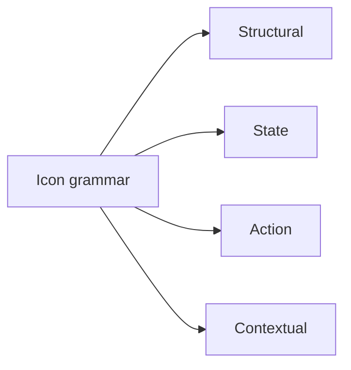
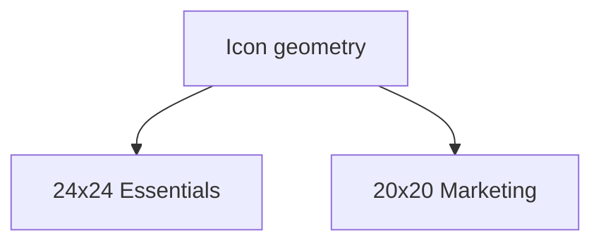

# **Product Design Specification (PDS)**

This document defines the design behaviour of Transcrypt’s MVP. It translates the product intent described in the PRD and the system boundaries defined in the SAIS into concrete, testable user-facing design rules. Where the PRD establishes purpose and constraints, and the SAIS describes the architecture that realises them, the PDS specifies how the product presents, behaves, and communicates in the user’s hands.

The PDS is not a branding guide or a high-fidelity visual spec. It defines structure, hierarchy, interaction patterns, layout systems, states, and flows that are invariant across surfaces. Every screen, component, and journey described here is directly constrained by requirements already set in the PRD and implemented in the SAIS. No part of the visual or interaction model may contradict those documents. The PDS expresses them in the language of design rather than engineering.

This is the definitive reference for how Transcrypt should *feel* to use: predictable, calm, unambiguous, and deterministic. All interactions must support the platform’s core commitments — clarity, auditability, and trust — while ensuring that users always understand what state they are in, what they can do, and what happens next.

The PDS is authoritative for all design decisions and remains stable unless the PRD or SAIS undergo material change. Any modification to behaviour, layout, or interface patterns must maintain traceability back to those documents. The PDS ensures that Transcrypt is implemented consistently across Marketing, Essentials, and all authenticated or unauthenticated surfaces.

---

# **1. Purpose and Scope**

## **1.1 Document Intent**

The Product Design Specification defines how Transcrypt presents, behaves, and communicates across every surface the user touches. It converts the product requirements established in the PRD and the architectural boundaries defined in the SAIS into concrete, testable design rules. This document governs structure, hierarchy, interaction, and visual behaviour for both the Marketing runtime and the Essentials application, ensuring they act as two expressions of a single system rather than separate products.

The PDS exists to create a stable, unambiguous foundation for implementation. It prevents divergence between design and engineering by specifying how components respond, how states transition, how flows unfold, and how information is revealed. Every interaction must reflect the principles that underpin Transcrypt: determinism, explainable state, clarity, and trust. This applies equally to intake forms, evaluation views, evidence handling, report presentation, billing sequences, navigation, mobile behaviour, and all degraded or failure conditions.

The intent of this document is not stylistic exploration or creative expansion beyond the product’s defined scope. It is a control instrument. The PDS ensures that every screen, journey, and component feels consistent, predictable, and calm, regardless of context. Any implementation that contradicts the behaviours defined here is considered non-conformant, even if visually polished. The PDS establishes the necessary design guardrails so that users always understand what state they are in, what they can do next, and why the system responds as it does.

---

## **1.2 Scope of Coverage**

The Product Design Specification governs every user-facing surface and behaviour included in the MVP defined by the PRD and implemented in the SAIS. Its scope covers the entire experience of interacting with Transcrypt across both the public Marketing runtime and the authenticated Essentials application. This includes all layout structures, component behaviours, interaction patterns, flow sequences, state transitions, and accessibility rules that appear on screen. Any element a user sees, touches, or relies on for progress falls within the remit of this document.

The PDS defines how navigation works, how forms behave, how validation is surfaced, how evidence uploads progress, how evaluation states change, how findings are revealed, and how reports are consumed. It specifies the rules for loading states, empty states, partial states, complete states, and error or degraded modes. It also governs mobile, tablet, and desktop behaviour to ensure the product remains consistent across device classes. All identity and routing transitions between Marketing and Essentials are included, as are billing interactions, session behaviour, and user feedback mechanisms.

Surfaces or behaviours not part of the PRD’s MVP cut are explicitly out of scope. This includes partner or auditor views, enterprise or assisted-tier functionality, advanced connectors, NIS2 or DORA rulepacks, collaboration surfaces, back-office consoles beyond their minimal user impact, and any system-level or architectural details that do not manifest visually. The PDS does not define brand identity, editorial strategy, or future-phase design directions; these are external to its mandate.

This scope ensures that design decisions remain tightly bound to what Transcrypt actually delivers in v1. The PDS provides the authoritative reference for designers, engineers, and QA to implement the product consistently, without drifting into unplanned features or aesthetic speculation. Only user-visible behaviours that form part of the MVP loop are covered, and all must reflect the principles of clarity, determinism, and explainable state defined at product level.

---

## **1.3 Out-of-Scope Items**

The Product Design Specification applies only to user-visible behaviour within the MVP boundaries defined in the PRD and realised in the SAIS. Anything outside those boundaries is not governed by this document, even if technically possible or anticipated in later phases. The PDS does not describe, authorise, or imply design work for surfaces, flows, or components that belong to future rulepacks, expanded tiers, enterprise features, or internal systems.

Functionality reserved for later phases is explicitly excluded, including auditor dashboards, advisor or assisted-tier views, partner or reseller consoles, supply-chain features, collaboration surfaces, team management, access delegation, multi-plan billing models, enterprise entitlement structures, and any UI related to NIS2, DORA, ISO 27001, CAF, or other non-MVP frameworks. Connectors beyond basic identity checks are likewise out of scope, as are notifications centres, policy libraries, CMS tooling, or any form of advanced configuration surface.

The PDS also excludes domains that are visual or content-related but do not belong to this specification: full brand identity, marketing copy, editorial workflows, SEO strategy, illustration style, analytics dashboards, or CMS author experiences. These are separate disciplines and are not governed here. Architectural or backend concerns without a user-facing surface—such as data models, evidence hashing, gateway routing, inference pipeline mechanics, observability streams, Stripe webhook processing, or evaluation internals—must not appear in the PDS.

Only behaviours that manifest directly on screen for MVP users fall within scope. Anything not visible to the user, not part of the v1 loop, or not defined in PRD or SAIS is excluded. This boundary ensures that the PDS remains precise, implementable, and aligned with the narrow, deterministic product cut required for MVP delivery.

---

## **1.4 Audience and Consumption**

### **1.4.1 Audience**

The Product Design Specification is written for the roles responsible for turning Transcrypt’s product definition and architectural boundaries into a coherent, deterministic user experience. Its core audience includes product designers, frontend engineers, UX writers, and QA engineers who must design, implement, or verify user-visible behaviour. Engineering leads and architects use it to ensure that design work aligns with the system constraints described in the SAIS. Product managers and technical owners reference it to confirm that design decisions remain within the scope established by the PRD.

The PDS is not intended for branding teams, marketing copywriters, editorial staff, or backend-focused system engineers. It does not govern content strategy, visual identity, or internal operational tooling. It governs only the user-facing behaviour of MVP surfaces and the interaction patterns that support them.

### **1.4.2 Consumption**

This document is a prescriptive implementation reference. It must be interpreted as the authoritative source for layout rules, interaction behaviour, structural hierarchy, and component logic across both the Marketing runtime and the Essentials application. Designers work from the PDS directly, rather than creating alternative structures or speculative visual patterns. Frontend engineers implement components and flows exactly as defined, without deviation unless the PRD or SAIS requires a change. QA uses the PDS as the acceptance oracle to determine whether a screen, behaviour, or journey is compliant with product intent.

The PDS must be read in parallel with the PRD and SAIS. Together, they establish what the product does, how the system behaves, and how that behaviour must be expressed on screen. Any implementation that contradicts the PDS is considered non-conformant regardless of polish or subjective preference. The PDS remains stable unless upstream product or architecture changes occur, ensuring consistency across every user-facing surface of the MVP.

---

# **2. Relationship to PRD and SAIS**

The Product Design Specification exists within a strict hierarchy of product governance. It does not operate independently and must never be interpreted as a standalone creative artefact. Its purpose is to translate the intent defined in the PRD and the architectural boundaries defined in the SAIS into the concrete behaviours, layouts, structures, and interaction patterns the user will encounter. As such, the PDS is subordinate to both documents and may only expand their implications, never contradict or redefine them.

The PRD defines the product’s scope, purpose, users, value proposition, and the constraints under which the MVP must operate. It identifies the journeys that matter, the surfaces that exist, and the behaviours that deliver measurable outcomes. The PDS inherits all of these truths. Every design decision in this document must be traceable back to a requirement, principle, or constraint articulated in the PRD. If a behaviour, flow, or screen does not have its origin in the PRD, it is excluded from the PDS regardless of aesthetic or usability appeal.

The SAIS defines the system as it is allowed to exist: surfaces, components, contracts, runtime boundaries, and the deterministic behaviours of every architectural layer. It describes how the platform is constructed and how it behaves internally. The PDS must always operate within these boundaries. It cannot imagine new surfaces, propose behaviours the architecture cannot support, or introduce flows that do not align with the runtime guarantees defined in the SAIS. Where the SAIS specifies a component boundary, the PDS defines how that boundary appears to—instead of how it operates beneath—the user.

The three documents together form a chain of inheritance: PRD at the top, SAIS describing the system that fulfils the PRD, and the PDS defining the user experience produced by that system. The PDS relies on the PRD for purpose and on the SAIS for feasibility. It does not redefine outcomes, add new requirements, or introduce aspirational features not supported by MVP intent. Any ambiguity in design must be resolved by consulting the PRD and SAIS in that order.

The PDS therefore stands as the final translation layer between product definition, engineering architecture, and user-visible behaviour. It provides the structure required for consistent implementation, but always under the authority of the documents above it. Any revision to the PRD or SAIS mandates corresponding updates to the PDS to preserve alignment. Consistency across the three documents is essential: they are not parallel efforts but a single, interlocking description of what Transcrypt is, how it works, and how it must be experienced.

---

# **3. Design Philosophy**

The design philosophy establishes the behavioural foundation that governs how Transcrypt must feel and function in the user’s hands. It translates the product’s core values—clarity, determinism, trust, and explainability—into the principles that shape every screen, flow, and interaction. These principles do not prescribe aesthetics; they define the discipline that prevents inconsistency, ambiguity, and unnecessary complexity across the Marketing runtime and the Essentials application.

Where the PRD sets the intent and the SAIS defines system boundaries, the design philosophy defines the expectations that every user-facing element must satisfy. It ensures that the interface reflects the product’s operational truth: predictable outcomes, visible reasoning, minimal friction, and calm, deliberate transitions. These principles apply equally to content surfaces, interactive components, and operational states such as loading, error, evaluation, or evidence handling.

The philosophy in this section anchors all subsequent design rules. The Core UX Principles describe the qualities every experience must uphold. The Behavioural Tenets define how interactions must behave under varying conditions and across surfaces. The Constraints and Non-Negotiables prevent drift into design experiments or feature creep that would compromise the product’s integrity.

This section ensures that Transcrypt’s user experience is not an aesthetic interpretation but a faithful expression of the system’s design, operational model, and product purpose.

---

## **3.1 Core UX Principles**

### **3.1.1 Clarity First**

Every screen must state its purpose immediately and without ambiguity. Users must never guess what a page is for, what information is required, or what action advances the journey. Clarity governs layout, copy, hierarchy, spacing, and the presence or absence of UI elements. If something does not help the user understand what is happening or what comes next, it does not belong on the screen. Clarity also mandates a single dominant call to action per view, with secondary actions clearly subordinate.

### **3.1.2 Deterministic Interaction**

The user experience must mirror the deterministic behaviour of the system defined in the SAIS. Identical inputs produce identical outcomes, and the UI must never imply randomness, hidden logic, or opaque transitions. Evidence upload, evaluation progression, navigation between Marketing and Essentials, session handling, and report readiness must all reflect the system’s true state with no speculative or anticipatory behaviour. Surfaces must not bluff or guess future outcomes.

### **3.1.3 Explainable State**

Every state transition must have a visible reason. Whether a field is required, an evaluation is pending, a piece of evidence is unusable, or an action is blocked, the cause must be explicit. Explainability applies equally to inference-assisted behaviours: suggestions, insights, or explanations must show why they are being presented and what they are based on. No part of the UI is allowed to behave like a black box. Users must always understand what the system is doing and why.

### **3.1.4 Calm Interfaces**

Transcrypt’s interface must feel stable, quiet, and measured. Calm interfaces use generous spacing, clear typographic hierarchy, restrained motion, and predictable component behaviour. Noise, visual clutter, aggressive cues, and decorative animations are forbidden. Calmness also applies to timing: feedback is immediate but not frantic; changes are visible but not flashy. The UI must reflect the product’s purpose — controlled, methodical, and trustworthy.

### **3.1.5 Cross-Surface Consistency**

Marketing and Essentials are two expressions of the same system and must behave accordingly. Buttons, forms, spacing rules, validation patterns, navigation structures, and interaction logic must be consistent across both surfaces. A user switching from reading a blog article to managing evidence should feel continuity rather than transition. Consistency is a signal of competence and a prerequisite for trust.

### **3.1.6 Progressibility**

Every screen must make the next step obvious. Users should never encounter dead ends, ambiguous branches, or unclear success states. The interface must always provide a forward path, a recovery path, or a clear explanation of why progress is blocked. Progressibility also requires that mistakes be reversible without penalty and that users never feel trapped.

### **3.1.7 Honest System Feedback**

The UI must reveal system activity truthfully. Loading, uploading, saving, evaluating, and error states must be explicit, timely, and unambiguous. No silent failures, no invisible background actions, no delayed feedback that risks double submissions. Errors must be specific and actionable. System activity must always feel observable rather than guessed.

### **3.1.8 Inference Transparency**

Where inference-driven operations influence the user experience, the interface must provide transparency and boundaries. Users must always know when inference is occurring, what it is doing, and what it is not doing. Inference may accelerate or clarify a task but cannot replace clarity, honesty, or user control. If inference fails, fallback states must appear immediately and clearly.

### **3.1.9 Minimal Cognitive Load**

The interface must reduce user effort at every step. Screens should contain only what is essential to the task, with unnecessary decisions removed. Hierarchy, spacing, copy, and interaction design must lighten the user’s cognitive burden rather than add to it. The product must feel simpler than the underlying compliance processes it helps manage.

---

## **3.2 Behavioural Tenets**

### **3.2.1 No Hidden State**

The interface must never conceal progress, meaning, or consequence. Every transition, delay, or system activity must be visible and explicit. Users must always understand whether the system is idle, working, waiting, blocked, or complete. Silent behaviour is forbidden. If nothing is happening, the UI must say so; if something is happening, the UI must show it.

### **3.2.2 No Unauthorised Autonomy**

The system must never act on the user’s behalf without signalling intent. Behaviours such as silent saves, silent retries, silent evaluations, silent dismissals, or silent inference completions are not permitted. The UI must announce any automation before it occurs and confirm it after it finishes. User agency must remain unquestioned at every step.

### **3.2.3 Atomic State Changes**

State transitions must occur in discrete, observable steps. Users must never experience half-states, flickering states, contradictory states, or transitions that resolve in the background without visibility. Actions such as evidence uploads, evaluation runs, item saves, logins, or routing changes must progress atomically, from one clear state to the next.

### **3.2.4 No Speculative Behaviour**

The interface must never anticipate outcomes or reflect states not yet confirmed by the system. No optimistic UI patterns may be used unless the SAIS explicitly guarantees safe rollback. The UI must represent only the system states that actually exist. Nothing guessed, nothing forecast, nothing implied.

### **3.2.5 Reversibility and Recovery**

Users must always have a path back. Mistakes should not trap them. If a workflow is blocked, the interface must provide a clear recovery path. If inference fails, fallback states must appear immediately. The system must never place a user in a situation they cannot escape without losing work.

### **3.2.6 Cross-Surface Predictability**

Marketing and Essentials must follow the same behavioural logic. Forms behave the same way. Validation behaves the same way. Navigation timing behaves the same way. Progress indicators behave the same way. A user switching surfaces should experience continuity, not contrast. Two runtimes, one behavioural contract.

### **3.2.7 Honest Timing**

Timing behaviour must be truthful. Loading, processing, retrying, and failing must be shown exactly as they occur. Artificial delays, decorative spinners, masked latency, or animation used to conceal system reality are not permitted. Users must always be aware of what is happening at the correct moment.

### **3.2.8 System Controls, User Decisions**

The system may constrain, guide, validate, and protect, but may not coerce. No flows may push the user into upgrades, upsells, or unwanted paths. No dark patterns are permitted. The system sets boundaries; the user retains control of decisions within those boundaries.

### **3.2.9 Inference as Helper, Not Decider**

Inference-driven features must act as suggestions, explanations, or contextual guidance. They must not enforce outcomes, override user choices, or silently reshape input. Users must be free to accept, refine, or reject any inference-generated material without friction. If inference cannot respond, fallback must be immediate and explicit.

### **3.2.10 Predictable Idle and Session Behaviour**

Session expiry, autosaves, background evaluations, and routing behaviour must be consistent, predictable, and well signposted. Users must never experience sudden state drops, surprise logouts, or loss of work. Idle rules must be transparent, not punitive or unpredictable.

### **3.2.11 Low Interaction Cost**

Every interaction must justify its existence. Clicks, taps, scrolls, keystrokes, confirmations, and required precision must be kept to a minimum. Workflows must avoid unnecessary steps and avoid creating friction where simplicity is possible. User effort is a controlled resource and must not be wasted.

---

## **3.3 Constraints and Non-Negotiables**

### **3.3.1 No Invention of System States**

The interface must never depict, imply, or rely on states that the system cannot enter. Design cannot introduce speculative pages, imagined transitions, future-phase placeholders, or any behaviour not defined in the PRD or implemented in the SAIS. If a flow, state, or action does not exist in the operational model, it must not appear visually or structurally.

### **3.3.2 No Scope Expansion Beyond MVP**

The PDS must remain strictly within the boundaries of the MVP definition. NIS2, DORA, advanced rulepacks, auditor surfaces, enterprise features, connectors beyond identity, supply-chain modules, collaboration views, and administrative consoles are not permitted. The interface must not hint at their presence, availability, or eventual introduction.

### **3.3.3 No Contradiction of Deterministic Runtime**

UI behaviour must never conflict with the deterministic contract defined in the SAIS. The interface cannot imply randomness, conditional behaviour that does not exist, or alternate outcomes that the backend does not support. All visible behaviour must be traceable to real system states and guaranteed architectural truths.

### **3.3.4 No Speculative or Optimistic Behaviour**

The interface must not forecast results or show states not yet confirmed by the system. No optimistic UI patterns may be used unless explicitly supported by reversible system logic. The PDS prohibits fake progress, fake saves, fake error recovery, or any behaviour that masks the real state of the system.

### **3.3.5 No Hidden Automation or Silent Actions**

All system-driven behaviour must be visible. No silent saves, silent retries, silent evaluations, silent inference calls, or silent state transitions are permitted. If the system acts, the interface must disclose it. Users must always know when the system is processing, waiting, or resolving.

### **3.3.6 No Cross-Boundary Leakage**

Internal structures such as microservices, pipelines, rule-engine internals, evidence hashing, inference routing, or architectural topology must never surface in the UI. Users must not encounter technical terminology, abstractions, or concepts that belong within system design rather than user experience.

### **3.3.7 No Marketing–Essentials Divergence**

The Marketing and Essentials runtimes must not diverge in tone, behaviour, hierarchy, spacing, interaction patterns, or validation logic. Both surfaces must follow the same behavioural contract. Marketing is not permitted louder, brighter, or more stylistically permissive patterns.

### **3.3.8 No Funnel or Manipulative Behaviour**

Marketing surfaces must not use nudging, coercion, forced-flow paths, or dark-pattern techniques. The product’s purpose is clarity, competence, and user confidence; the interface must reflect that. All calls to action must be honest, neutral, and unpressured.

### **3.3.9 No Illusion of Model Certainty**

Inference-driven features may never present themselves as authoritative or final. All model outputs must be framed as suggestions or explanations. The UI must never imply that inference is guaranteed correct, flawless, or deterministic. Model fallibility must be visually accommodated.

### **3.3.10 No Hidden Inference Behaviour**

Inference must never run silently or modify user-visible material without signalling. If the model processes, users must see progress. If it fails, fallback must appear immediately. All inference activity must remain transparent and observable at UX level.

### **3.3.11 No Blocking Core Flows with Inference**

Users must never be required to engage with, wait for, or accept inference output to complete a core task. Inference may enhance or supplement flows but may not impede, delay, or control them. Primary product behaviour must remain fully operable without inference.

### **3.3.12 No Dark Patterns of Any Kind**

The PDS forbids manipulative UI behaviours such as disguised buttons, misleading labels, hidden opt-outs, exaggerated warnings, or intentionally confusing flows. Every action must respect user autonomy and reflect the product’s trust-first philosophy.

### **3.3.13 No Component-Level Inconsistency**

A button, form field, error message, validation marker, or navigational element must behave identically across both surfaces and at all screen sizes. Components may not develop local variations or visual drift. Consistency is a non-negotiable enforcement rule.

### **3.3.14 No Visual or Interaction Noise**

Decorative animations, ornamental icons, motion for its own sake, or stylistic embellishments that do not serve clarity are not permitted. The design must remain quiet, deliberate, and functional, reflecting the seriousness and stability of the product’s role.

### **3.3.15 No Partial or Unsupported Journeys**

Every journey described in the PDS must be fully supported by system reality. No half-defined flows, dead ends, or speculative branches may appear. If a feature is not fully implemented in MVP, it must not exist visually or structurally.

### **3.3.16 No Breaking of Atomicity**

Multi-step interactions must proceed in clear, discrete stages without collapsing, blending, or masking transitions for cosmetic convenience. Each state must remain explicit so users understand exactly where they are within a process.

---

# **4. Atomic Design System**

Transcrypt’s atomic design system is the visual and interaction contract that all surfaces must honour: marketing site, Essentials workspace, documentation, and any future inference-driven tools. This section defines the tokens and rules that sit underneath every screen – colours, type, spacing, grid, iconography, and depth – so that the product feels like one continuous, deterministic environment rather than a set of loosely related pages.

The system is **neutral-first with a cerulean accent**. Greys and off-whites carry almost all of the UI load; cerulean exists as a precise accent for interaction and emphasis, not decoration. Semantic status colours (success, warning, error, info) are defined separately and may never be “borrowed” as brand. Conversely, brand accent may never be repurposed as a semantic signal. This separation is not aesthetic preference – it is a hard constraint to keep the interface understandable under stress, in screenshots, and for colour-impaired users.

All design work, whatever the tool, must round-trip through this atomic system. That means:

* **Tokens, not ad-hoc values** – colours, typography, spacing, radii, and shadows are chosen from a finite, named set. New values require explicit extension of the system, not “just this once”.
* **Shared language across surfaces** – a button, chip, card, banner, or table row means the same thing on the marketing site, in the Essentials tenant, and in any future admin or advisor views. There are no “special” components that behave differently just because the context changed.
* **Predictable responsiveness** – layout, grid, and breakpoint rules are defined here. Designers and developers are not free to improvise new breakpoints or stacking behaviours that diverge from this contract.
* **Determinism at the visual layer** – given the same state (tenant role, feature flag, evaluation outcome), the same component tokens must be chosen every time. There is no “designer’s choice” at implementation time.

The subsections that follow specify the system in six dimensions:

* The **colour system** fixes the neutral palette, cerulean accent behaviour, and semantic scales.
* The **typography system** defines the type ramp, weights, and usage by component and surface.
* The **spacing and layout system** codifies spacing units, padding patterns, and container rules.
* The **grid and breakpoint system** defines how layouts reflow from mobile to large desktop.
* The **iconography and illustration rules** constrain style, usage, and when not to use them at all.
* The **component elevation and depth** model defines shadows, borders, and layering for different classes of component.

These rules are intentionally tight. Any future rebrand, dark mode, or extended rulepack UI must either fit inside this atomic frame or be treated as a controlled evolution of it, with explicit updates to this section. There is no path where “we changed the look a bit” is acceptable without revisiting and revising the atomic design system itself.

---

## **4.1 Colour System**

The colour system defines how Transcrypt expresses structure, state, hierarchy, and meaning. It is a behavioural contract, not a stylistic playground. Colour exists to make the product predictable, calm, and self-explanatory under every condition — from rushed evidence uploads to assessor scrutiny. The system is **neutral-first** with a **cerulean accent**, and colour is never used for decoration when it can be used for clarity.

Transcrypt’s entire philosophy — boring, safe infrastructure — relies on colour being quiet, controlled, and strictly tokenised. No surface may introduce a new hue because it “looked better”. All colours, including shadows, borders, and semantic signals, are drawn from a finite named set.

The rules below govern every runtime: Marketing, Essentials, docs, advisor views, read-only verifier mode, and future inference-assisted flows. Colour may not diverge across these surfaces; only composition and emphasis change.

---

### **4.1.1 Neutral Palette**

Neutral tones carry 90% of the interface. They establish calm, reduce cognitive load, and prevent the product from becoming performative. The neutral palette:

* Provides layered backgrounds (page, surface, raised surface).
* Defines border hierarchy and readability under stress.
* Establishes text clarity for long-form content and dense evaluation views.
* Prevents emotional colour fluctuations or brand bleed.

Neutrals must be used for:

* All backgrounds in Essentials.
* All table rows, cards, evidence lists, and evaluation panels.
* All form fields, labels, inputs, dropdowns, and modal scaffolds.
* All documentation surfaces.

Neutrals may not be tinted to match brand mood or marketing campaigns. They are architectural, not expressive.

---

### **4.1.2 Accent Palette**

Cerulean is the sole brand accent, used sparingly and with explicit purpose:

* Primary CTAs in Marketing.
* Inline emphasis on key interactive elements.
* Occasional highlights in hero sections.
* Selected focus states.

Essentials may use cerulean **only** where interaction genuinely requires visibility, not as decoration. It must never appear:

* As a semantic signal (success, warning, error, info).
* As a background for data-heavy views.
* In evidence items, evaluation results, or export pages.
* In system alerts or onboarding warnings.

Cerulean is governed by **restraint**. The absence of colour expresses professionalism and calm reliability; the presence of cerulean is a deliberate instruction to act.

---

### **4.1.3 Semantic Palette**

Semantic colours map to unambiguous operational states:

* Error
* Warning
* Success
* Info

These states must be instantly recognisable, WCAG-compliant, and unconfusable with accent or brand hues. Semantics:

* May not be lightened or darkened for aesthetics.
* May not be reused as brand tones.
* Must be uniform across all surfaces and roles.
* Must appear identically in Marketing, Essentials, and exports.

When a state is absent, the interface remains neutral. When a state is present, the meaning is clear, final, and unambiguous — regardless of who is viewing the tenant.

---

### **4.1.4 Rules and Prohibitions**

To maintain determinism and prevent drift:

1. **No freestyle gradients** beyond those specified at component level.
2. **No emotional colour** — no warmth, blush, sunset tones, or “friendly” palettes.
3. **No borrowing brand accent** for semantic meanings or system warnings.
4. **No using semantic tones** for decorative elements, illustrations, or charts.
5. **No new hues** added at implementation time.
6. **Accessibility first** — contrast must precede aesthetic considerations.
7. **Inference neutrality** — model outputs use muted neutrals, never cerulean or semantics.
8. **Cross-surface identity** — Marketing does not get a “fun” variant of the colour system.

Any future rebrand must respect this system. Changes to hue, scale, or usage require explicit revision of §4.1 and must be logged as a system modification, not a marketing decision.

---

## **4.2 Typography System**

Typography in Transcrypt is a structural mechanism, not an aesthetic flourish. It defines how information is parsed, understood, compared, and trusted across every surface: Marketing, Essentials, exports, advisor views, and any future inference-assisted flows. The typographic system removes ambiguity, eliminates improvisation, and ensures that every heading, label, and body block carries predictable meaning.

The goal is *calm readability*. Type should disappear into the background, leaving the user with clarity, not character. A deterministic product demands deterministic typography.

---

### **4.2.1 Type Ramp**

Transcrypt uses a tightly controlled type ramp built for legibility and consistency. The ramp defines:

* **Headings** with clear, stable gradation
* **Body text** for long-form content, evidence descriptions, and application flows
* **Microtext** for timestamps, labels, hint text, and system meta-information

All sizes, weights, and line-heights come from a finite set of tokens. Designers and developers do not introduce new font scales outside this system.

Headings scale gently — no theatrical jumps.
Body size remains constant across Marketing and Essentials.
Microtext never attempts expression; its role is scaffolding, not emphasis.

Exports inherit the same ramp to ensure that what is printed or downloaded matches what users saw on screen.

---

### **4.2.2 Usage Rules**

Typographic usage is governed by strict behavioural rules:

* **One function per token** — a heading token cannot double as a card title if that undermines hierarchy; body text cannot masquerade as a subheading.
* **No colour overrides** — headings must remain neutral; accent is reserved for interaction and never used to “decorate” type.
* **Semantic state reinforcement** — success, warning, error, and info regions must not rely exclusively on colour; typography must signal severity through structure.
* **Cross-surface consistency** — the same component uses identical type values in Marketing pages, Essentials screens, and verifier mode.

Links are styled with cerulean only when interactive and never as general emphasis.
CTA buttons derive their typographic identity from their component class, not from context.

---

### **4.2.3 Behaviour Under Stress**

Typography must not collapse under dense content, long evidence names, or large evaluation reports. To guarantee resilience:

* Headings must remain readable when surrounded by technical content.
* Body text must not allow unexpected wrapping that breaks layouts.
* Microtext must always remain legible, even at high information density.
* Line-heights must prevent collision when semantically tinted components (warning, error, info) include multiline text.

In narrow viewports, typography reflows without shrinking or transforming its identity.
Breakpoints adjust layout, not type scale.

---

### **4.2.4 Restrictions and Prohibitions**

To maintain clarity and avoid drift:

1. **No expressive fonts.** The visual identity is calm, technical, and minimal.
2. **No decorative typography** in Marketing headers — identity comes from clarity, not spectacle.
3. **No bold accents** for anything other than explicit interactive components.
4. **No typographic “play”** in blog posts — long-form content must remain steady and accessible.
5. **No using larger or heavier type** to imply system authority or “AI intelligence”.
6. **No typographic variability** between roles (owner, advisor, verifier). Typography is a constant.
7. **No shrinking type below accessibility thresholds**, regardless of density.

Typography becomes part of Transcrypt’s operational truth: precise, legible, and identical across contexts.

---

## **4.3 Spacing and Layout System**

Spacing and layout form the structural skeleton of Transcrypt’s interface. They determine rhythm, breathing room, and the relative weight of components across every surface: Marketing, Essentials, exports, advisor views, and inference-assisted flows. Nothing in Transcrypt floats arbitrarily; no part of the UI expresses “personality” through spacing. The entire system is governed by fixed tokens and predictable patterns so that what users see in one part of the product behaves identically everywhere else.

The spacing system exists to maintain cognitive ease. It prevents dense evidence lists from becoming overwhelming, keeps evaluation summaries readable under time pressure, and ensures exports reflect the same hierarchy users saw on screen. Layout decisions must never introduce novelty or drama.

---

### **4.3.1 Spacing Tokens**

All spacing is derived from a small set of fixed tokens (XS → XL).
These tokens define:

* vertical separation between sections,
* padding within components,
* gutters between grid columns,
* internal spacing inside cards, lists, alerts, and modals,
* margins applied to top-level containers.

Every designer and developer uses the same token set.
No freestyle pixel values, no “this screen is special”, and no “tighten this area just a little”.

Tokens ensure spacing behaves like code: predictable, repeatable, and consistent across tenants.

---

### **4.3.2 Vertical Rhythm**

Transcrypt employs a stable vertical rhythm so that content flows with calm predictability:

* Headings sit on consistent vertical spacing above their body text.
* Lists, tables, and evidence blocks carry uniform separation.
* Sections follow the same rhythm across Marketing and Essentials.
* Stacked content aligns to a repeating baseline grid.

Vertical rhythm prevents the jagged, restless appearance common in SaaS dashboards.
It allows users to skim comfortably, even when processing dense information such as evaluation breakdowns.

Marketing pages use the same rhythm with slightly expanded spacing — never different spacing rules, simply different composition.

---

### **4.3.3 Layout Patterns**

Transcrypt limits layout patterns to a small, deterministic set:

* Single-column flow for long-form content, uploads, evaluation summaries, and evidence lists.
* Two-column layouts for Marketing, onboarding, and advisor workspaces where context and detail sit side by side.
* Responsive collapse rules that reflow layouts predictably at fixed breakpoints.
* Fixed-width content containers to preserve readability on large screens.

Every pattern is known, named, and reused.
No page invents a new layout.
No screen deviates from the grid or safe-area rules.

Essential elements — buttons, forms, alerts, table rows — align cleanly regardless of viewport width.
If a layout changes, it is always due to breakpoint logic, never content volume.

---

### **4.3.4 Restrictions and Constraints**

To protect structural clarity:

1. **No arbitrary whitespace increases or reductions** for aesthetic balance.
2. **No unique layouts** created for “special” pages or promotional content.
3. **No component resizing based on role** — owner, advisor, and verifier views share identical spacing.
4. **No inference-generated content** may introduce new spacing patterns, padding, or alignment behaviour.
5. **No negative space used for emotional effect** — spacing must remain functional, not expressive.
6. **No collapsed padding** allowed unless explicitly defined within a component’s own rules.
7. **No asymmetrical gutters** unless the layout pattern specifically calls for them.

Spacing becomes part of the product’s operational consistency. It creates a feeling of solidity, trustworthiness, and calm. When layouts never behave erratically, users understand the product more quickly and remain anchored even under audit pressure.

---

## **4.4 Grid and Breakpoint System**

The grid and breakpoint system defines the spatial logic of Transcrypt’s interface. It ensures that every screen — Marketing, Essentials, advisor workspace, verifier mode, documentation, and future inference-assisted views — follows the same structural rules. This is not a visual style; it is the geometry of the product. If spacing is the local physics, the grid is the cosmology.

Transcrypt rejects bespoke or expressive layouts. Every element sits inside a predictable framework, so users never feel lost or disoriented, regardless of screen size or role. The grid is intentionally simple, intentionally repeatable, and intentionally boring — because boring is safe, and safe is the point.

---

### **4.4.1 Grid Structure**

Transcrypt uses a single, universal grid across all surfaces.
Key properties:

* A fixed **maximum content width** keeps reading comfortable and prevents “enterprise dashboard sprawl”.
* All layouts derive from **one grid**, not variations invented per page.
* Marketing pages use the same grid but with different composition, never different rules.
* Essentials uses the grid for evidence lists, evaluation summaries, control breakdowns, tenant settings, and PDF export layouts.
* Advisor and verifier views inherit identical constraints; role changes the data, not the geometry.

The grid enforces order:
components align, text blocks line up, and visual rhythm is predictable across tenants and devices.

---

### **4.4.2 Breakpoint Definitions**

Breakpoints are fixed, named, and few.
They exist to preserve usability — not to encourage creativity.

Each breakpoint represents a **meaningful shift in affordance**, not a stylistic reflow:

* When horizontal space becomes constrained, columns collapse.
* When space becomes abundant, layouts expand within fixed limits.
* No breakpoint introduces new design patterns or special behaviours.

Breakpoint definitions apply identically to Marketing and Essentials.
The same widths govern hero sections, tables, modals, forms, and evidence groups.

No future runtime may introduce a breakpoint outside this set without revising the PDS.

---

### **4.4.3 Responsive Behaviour**

Responsive behaviour must always be deterministic:

* **Stacking** happens at known breakpoints — never early, never late.
* **Gutters** remain consistent across breakpoints; only column count changes.
* **Containers** shrink or expand within strict min/max bounds.
* **Two-column layouts** collapse to one column predictably.
* **Cards** shift fluidly but never resize arbitrarily or change padding.
* **Tables** switch to scroll or stacked mode based on preset rules.

At no point may a developer adjust responsiveness “by feel”.
Transcrypt is engineered, not sculpted.

Marketing reflows with the same logic — the only difference is breathing room.

---

### **4.4.4 Constraints and Prohibitions**

To maintain system integrity:

1. **No bespoke grid overrides** for “unique” pages or special content.
2. **No alternate max-width containers** — the grid must feel like the same architecture everywhere.
3. **No custom breakpoints** added by designers or developers in isolation.
4. **No asymmetric layouts** unless explicitly defined as a supported pattern.
5. **No inference-driven layouts** — AI may supply content, not geometry.
6. **No density tuning** per role; owners, advisors, and verifiers all share the same spatial logic.
7. **No layout shifts** caused by content volume (lists may scroll; they may not reflow unpredictably).

These constraints ensure Transcrypt feels consistent, serious, and engineered regardless of who is looking at it or what device they hold.

---

## **4.5 Iconography and Illustration Rules**

Iconography in Transcrypt is functional, not decorative. Icons and illustrations exist only to increase clarity, signal state, and reinforce predictability. Nothing about them is expressive, emotional, playful, or stylistic. Every visual symbol must align with PRD doctrines (calm, deterministic infrastructure) and SAIS invariants (consistent behaviour across roles, tenants, and runtimes). Marketing uses the same system with slightly more air — not different rules.

---

### **4.5.1 Icon Grammar and Semantic Roles**

Icons fall into four categories:

* **Structural icons** (navigation, expand/collapse, external link)
* **State icons** (pass, fail, partial, evidence-required)
* **Action icons** (upload, edit, delete, evaluate)
* **Contextual icons** (limited to Marketing; never decorative)

Rules:

* Icons must **always** be paired with text unless universally recognisable.
* Icon semantics must match deterministic rule-engine outputs.
* Icons may never imply features not implemented in MVP.
* Marketing and Essentials use the **same icon set**.

**Mermaid below — placed inline correctly:**



---

### **4.5.2 Style, Geometry, and Optical Balance**

Constraints:

* Outline icons only
* 1.5px stroke at 100% scale
* Rounded terminals
* 24×24 grid (Essentials)
* 20×20 grid (Marketing)
* Stroke colour always from neutral palette, never accent except for explicit CTAs

Accessibility:

* Minimum contrast 3:1
* No colour-only signalling
* Must remain recognisable down to 14px

**Inline Mermaid — fully separated from prose:**



---

### **4.5.3 State Icon Set (Deterministic Evaluation States)**

Transcrypt’s rule engine yields exactly four states:

* Pass
* Fail
* Partial
* Evidence required

Rules:

* Shapes must differ even without colour.
* Outline style, never filled.
* Icons cannot imply uncertainty — state is binary or categorical.
* These icons must appear identically across owner, advisor, and verifier views.

(And for clarity: state icons must not become emotional or suggest future NIS2 capability.)

---

### **4.5.4 Illustration System (Strictly Limited)**

Illustrations in Transcrypt follow strict constraints:

* Flat vector
* Two-tone (neutral + cerulean)
* No characters, mascots, faces, hands, or “infographic humans”
* No metaphorical imagery
* Geometric abstractions only
* At most two shapes + one motion cue (e.g., upward arrow)
* Must never imply live automation

Allowed locations:

* Marketing conceptual explanation blocks
* Empty states in Essentials
* Report headers (subtle, abstract, non-semantic)

Forbidden:

* Roadmap previewing
* Suggesting integrations not in MVP
* Emotional narration (e.g., “relaxed compliance journey” visuals)

---

### **4.5.5 Usage Discipline and Anti-Pattern Prevention**

This is where most SaaS products break their own systems. Transcrypt will not.

Rules:

1. Icons must earn their place; decorative icons are prohibited.
2. Icon density capped at:

   * Marketing: **1 per section**
   * Essentials: **1 per interaction block**
3. Icons never replace text.
4. No icon may imply integrations, automation, or future-phase scope.
5. Icons must not animate except in controlled micro-states (SAIS §10).
6. Illustration assets may never appear in Essentials except empty states.
7. Icons must respect spacing rules of §4.3 and grid constraints of §4.4.

Every symbol reinforces the same message:
**Calm infrastructure. Deterministic behaviour. No surprises.**

---

## **4.6 Component Elevation and Depth**

Elevation and depth in Transcrypt define how components stack, interact, and establish hierarchy. They communicate priority, focus, and interaction boundaries without theatrics or emotional expression. Depth is not visual flair — it is structural geometry, an invariant behavioural contract enforced across Marketing, Essentials, advisor surfaces, verifier mode, and any future inference-assisted contexts.

Nothing floats arbitrarily. Nothing hovers for show. Nothing casts decorative shadows. Elevation exists **only** to clarify interaction and state, reflecting Transcrypt’s identity as calm, boring, deterministic infrastructure.

---

### **4.6.1 Elevation Tokens**

Transcrypt uses a small set of fixed elevation tokens.
Elevation tokens define vertical ordering — not “style” and not “ambience”.

Tokens:

* **Elevation 0** — default plane for all content surfaces
* **Elevation 1** — interactive components requiring affordance: dropdowns, popovers, menus
* **Elevation 2** — drawers, persistent side panels
* **Elevation 3** — blocking modals and global overlays

Rules:

* Tokens cannot be created ad hoc; new levels require a PDS amendment.
* Marketing uses far fewer elevation points (mostly 0 and 1).
* Essentials uses all, with modals representing the structural apex.
* No token alters colour or shadow softness — all shadows are minimal, crisp, and neutral.

Shadows (for elevation indication):

* 0: none
* 1: `0 1px 2px rgba(0,0,0,0.06)`
* 2: `0 2px 4px rgba(0,0,0,0.08)`
* 3: `0 4px 8px rgba(0,0,0,0.12)`

No blur theatrics, no diffused glows, no cosmetics.

---

### **4.6.2 Component Elevation Hierarchy**

Each atomic component type has a fixed elevation:

* **Cards:** elevation 0
* **Tables:** elevation 0
* **Form fields:** elevation 0
* **Dropdowns / menus:** elevation 1
* **Tooltips:** elevation 1
* **Side panels / drawers:** elevation 2
* **Modals:** elevation 3
* **Blocking overlays:** elevation 3

Navigation follows similar rules:

* **Header bar:** elevation 1 (fixed)
* **Left sidebar:** elevation 1 (persistent)
* **Right advisor panel:** elevation 2 (contextual)

No screen may override these defaults without explicitly updating the system.

**Inline diagram (placed exactly where needed, not at the end):**

```mermaid
flowchart TD
    A[Elevation 3 Modals]:::e3
    B[Elevation 2 Drawers]:::e2
    C[Elevation 1 Menus, Tooltips, Header]:::e1
    D[Elevation 0 Main UI Plane]:::e0

classDef e0 fill=#e6eaed,stroke=#0a1a2a,stroke-width=1px
classDef e1 fill=#d9e2ec,stroke=#0a1a2a,stroke-width=1px
classDef e2 fill=#c0d7e3,stroke=#0a1a2a,stroke-width=1px
classDef e3 fill=#a7cad9,stroke=#0a1a2a,stroke-width=1px
```

---

### **4.6.3 Overlays, Modals, and Blocking Depth**

Modals and overlays represent the system’s highest elevation and require strict behavioural discipline:

* Modals use **Elevation 3** and are always blocking.
* Overlays dim the background with a fixed neutral scrim: `rgba(10, 26, 42, 0.55)`
* Modal elevation never stacks; there is no such thing as “modal on modal”.
* Drawers (Elevation 2) must sit beneath modals and may never overlap them.
* SAIS demands deterministic modal behaviour across tenants — modals cannot vary in size, shape, or position by role.

Rules for motion:

* Modals may fade in at 120–150ms but never slide.
* Drawers may slide (SAIS-approved), but in a single axis only.
* No parallax.
* No spring easing.
* Never imply emotional “softness” or elasticity.

Exports ignore elevation entirely — depth is interaction-only, never baked into printed outputs.

---

### **4.6.4 Hover, Focus, and Active Depth States**

Depth states carry interaction meaning:

* **Hover** may only lighten borders or background; it must not uplift the component.
* **Focus** must use a clear, thick (2px) cerulean outline — never elevation.
* **Active state** may use a micro-elevation (Elevation 1) *only on components that are inherently interactive* (menus, dropdowns).

Elements that **must not** use depth:

* Buttons
* Tabs
* Chips
* Pagination
* Form fields

These rely on colour, border, and spacing — not elevation.

Hover/active elevation is forbidden on Marketing CTAs, which remain flat to avoid ornamental behaviour.

---

### **4.6.5 Restrictions and Prohibitions**

This is where the system draws hard boundaries:

1. **No decorative shadows.**
2. **No elevation changes based on role** (owner/advisor/verifier).
3. **No component “floating” for visual effect.**
4. **No neumorphism, glassmorphism, parallax, or modernist “soft UI”.**
5. **No deep shadows exceeding elevation 3 rules.**
6. **No inference-driven UI that appears on a separate “plane” or implies AI magic.**
7. **No elevation in Marketing beyond level 1.**
8. **No stacked modals for any reason.**
9. **No shadow changes on viewport resize.**

Elevation is architectural, not expressive.
Depth is hierarchical, not aesthetic.

Everything must look engineered, predictable, and serious — because Transcrypt’s job is to handle evidence and compliance, not to entertain.

---

# **5. Interaction Model**

## **5.1 Component Interaction Rules**

## **5.2 Navigation Behaviour**

## **5.3 Form Behaviour and Validation**

## **5.4 File Upload Behaviour**

## **5.5 Feedback, Errors, and Status Indicators**

## **5.6 Session and Identity Interaction Rules**

# **6. Marketing Runtime Design**

## **6.1 Page Templates**

## **6.2 Blog and Article Layouts**

## **6.3 Marketing→Essentials Handshake States**

## **6.4 Mobile and Low-Bandwidth Variants**

# **7. Essentials App Design**

## **7.1 Application Layout Framework**

## **7.2 Dashboard & Home States**

## **7.3 Org Profile Flow**

## **7.4 Evidence Flow**

## **7.5 Evaluation Flow**

## **7.6 Findings & Reports**

## **7.7 Billing & Account Management**

## **7.8 Error, Offline, and Degraded Modes**

# **8. End-to-End User Journeys**

## **8.1 Signup and Login**

## **8.2 Marketing→Essentials Routing**

## **8.3 Subscription & Billing Journey**

## **8.4 Org Profile Completion**

## **8.5 Evidence Submission**

## **8.6 Run Evaluation**

## **8.7 View Findings & Reports**

# **9. Accessibility Specification**

## **9.1 Compliance Targets**

## **9.2 Visual and Interaction Rules**

## **9.3 Screenreader and Keyboard Operation**

# **10. Offline and Multi-Device Behaviour**

## **10.1 Offline Modes**

## **10.2 Device Classes and Breakpoints**

# **11. Design QA and Acceptance Criteria**

## **11.1 Component Acceptance**

## **11.2 Page-Level Acceptance**

## **11.3 Journey-Level Acceptance**

# **12. Appendices**

## **12.1 Glossary**

## **12.2 Reference Artefacts**

---

If you want the Level-3 skeleton added next, I can do that cleanly and systematically without breaking this structure.
