# System Architecture & Interface Specification (SAIS)

## 1. Purpose and Scope

This document defines the architectural intent and boundaries for Transcrypt’s v1 / MVP implementation. It exists to specify, at a system level, what will be built, how components relate, and which interfaces are exposed. It inherits its direction exclusively from the Product Requirements Document (`v0.3.0-prd-complete`) and does not override or extend that specification.

The SAIS covers only the MVP scope defined in the PRD, including the essential feature set, minimum architectural components, and mandatory interfaces required for a functioning release. Any feature, integration, or behavioural pattern not explicitly included in the PRD’s MVP cut is out of scope for this document.

Document ownership sits with the engineering function. Changes follow the same version-control process as the PRD: tracked in Git, reviewed on change, and updated only when underlying implementation or requirements shift.

### 1.1 Document Intent

This specification converts the Transcrypt PRD (`v0.3.0-prd-complete`) into concrete, implementable architectural artefacts. It defines how the product’s stated requirements manifest as system components, boundaries, interfaces, and data structures. For the MVP release, this document serves as the authoritative reference for runtime behaviour, integration points, and technical constraints. No component, interface, or behaviour outside what is expressed here is considered part of the v1 system.

### 1.2 Relationship to PRD

This document maintains direct traceability to the PRD by referencing the specific PRD sections from which each architectural element originates. Every functional, non-functional, and security requirement described in the PRD must map to one or more technical elements defined here. No architectural element in this specification exists without an originating PRD section, and no PRD requirement is considered satisfied unless it appears here in an implementable form.

### 1.3 Version and Control Mechanism

This document is versioned using the same Git-based workflow defined for the PRD. All changes are tracked in the Transcrypt repository, with updates made only through reviewed commits. The SAIS uses a dedicated semantic tag format:
**`v1.x.y-sais`**,
where `x` increments for architectural changes affecting component boundaries or interfaces, and `y` increments for clarifications that do not alter behaviour.

Branches follow the repository’s existing convention (e.g. `codex/<task>`, `feature/<component>`), and SAIS updates must accompany or follow the corresponding PRD commits. Milestone tags align with PRD releases so that a given PRD version and SAIS version can be resolved unambiguously. CI/CD promotion gates reference these tags to ensure that only architectures backed by a corresponding SAIS version progress to implementation or release.

### 1.4 Ownership and Maintenance

The Product Lead is the accountable owner of this document and is responsible for ensuring that it reflects the current architectural direction defined in the PRD. Day-to-day maintenance is jointly handled by the Engineering Lead and the Security Lead, who update the specification when components, interfaces, or constraints change.

This document follows the same review cadence as the PRD: quarterly, or immediately upon any major release that alters platform behaviour or boundaries. Structural changes require explicit approval from all three roles — Product Lead, Engineering Lead, and Security Lead — and updates must be committed through the standard Git review workflow before becoming authoritative.

### 1.5 Scope of Coverage

This specification covers all components required for the MVP release as defined in the PRD. In scope are: the public Marketing and Blog site, the Marketing↔Essentials handshake, the Transcrypt Essentials App, deterministic rule evaluation, evidence intake and management, report generation, billing, and all onboarding flows described in the PRD.

Explicitly out of scope for this version are: partner and integrator APIs, the NIS2 control pack, advanced connectors, assisted-tier collaboration features, and any enterprise or post-MVP extensibility defined in later PRD phases.

### 1.6 Intended Audience

This document is written for the people directly involved in building and maintaining Transcrypt. Primarily, it serves as an implementation reference for development work and as a precise description of the system’s boundaries, behaviours, and interfaces. It also provides a clear architectural baseline for anyone contributing to product direction or verifying security and compliance aspects of the platform. If external collaborators or integrators become involved in future phases, they may use this document solely to understand the public API surface and integration constraints.

### 1.7 Document Change Log Linkage

All updates to this document are tracked directly within the SAIS change log at the end of the file, and in Git commit history. Changes may optionally reference the associated PRD section number when the edit reflects a modification or clarification to the product definition. No additional appendix structure or external identifier system is used.

## 2. System Overview

This section describes the system at a high level, reflecting the architectural intent defined in the PRD. Transcrypt consists of two user-facing surfaces: the public Marketing & Blog site, which operates as a Next.js runtime providing SSR/ISR-rendered content, routing, telemetry, and the Marketing→Essentials onboarding and identity handshake; and the authenticated Essentials App, which performs compliance evaluation and reporting. Both surfaces consume the same public API, and both form part of the MVP delivery defined in the PRD.

The platform is a multi-tenant, deterministic compliance automation system built around three core ideas: automation-first workflows, invisible infrastructure, and strict auditability. All internal behaviour follows the deterministic, measurement-led model described in the PRD, and no internal complexity is exposed to the user.

The system is divided into clear architectural layers that separate request handling, rule evaluation, evidence processing, report generation, and data storage. Runtime behaviour is simple by design: every action produces a predictable outcome, every state change is auditable, and users see only clear, binary outcomes (“compliant” / “not yet compliant”).

The MVP boundary defined in the PRD restricts the platform to the Essentials feature set, CE v3.2 rule evaluation, evidence intake, report generation, billing, the public Marketing/Blog runtime, and the associated onboarding integrations.

---

### 2.1 System Philosophy

Transcrypt’s architecture is grounded in the principles set out in the PRD: automation-first operation, deterministic behaviour, and invisibly managed infrastructure. The system will minimise user exposure to internal mechanics — orchestration, rule evaluation, evidence binding, and rendering — and will surface only the outcomes that matter: whether a control is satisfied, why, and how it can be improved. Internal complexity, including routing, SSR/ISR rendering, identity flow, evidence processing, and rule execution, will remain hidden behind predictable interfaces.

The engineering mindset is measurement-led: every significant action will emit audit-ready traces, deterministic hashes, or reproducible artefacts. Identical inputs will always yield identical results, and every outcome will be explainable through visible links to evidence, rule logic, or system state. This ensures that users can trust findings without having to trust the internal machinery.

Every component — from the Marketing/Blog runtime to the Essentials App, API boundary, evaluation workflow, evidence pipeline, and report generator — will serve three goals: determinism, auditability, and user trust. The system will avoid ambiguity, implicit behaviour, or “magic” at runtime. Instead, it will prioritise clarity, traceability, and predictable transitions between states, making the platform feel calm, competent, and reliable whether the user is reading content, completing intake, uploading evidence, or generating a report.

### 2.2 Major Architectural Layers

Transcrypt’s architecture is organised into a small number of clear layers, each reflecting the structural boundaries defined in the PRD. These layers separate ingress, evaluation, evidence handling, rendering, storage, and observability so that each can evolve independently while maintaining deterministic behaviour and tenant isolation.

#### **Edge Layer (Marketing Runtime, Essentials UI, API Gateway)**

This layer will receive all user traffic across the Marketing/Blog site and the Essentials App. It will handle SSR/ISR rendering, session establishment, identity transitions, and API request termination. The gateway will shape incoming requests, attach tenant context, enforce authentication, and apply rate limits and basic policy guards. No business logic or evaluation occurs here; the edge simply provides controlled and auditable entry into the system.

#### **Control and Rule Layer**

This layer will evaluate tenant input against Cyber Essentials v3.2 controls using the deterministic rule engine defined in the PRD. It will consume OrgProfile and Evidence metadata, execute rule tests, and emit findings with provenance. The layer is stateless and versioned, ensuring identical inputs always map to identical outputs. It will be replaceable as future rulepacks or frameworks are introduced.

#### **Data and Evidence Layer**

This layer will persist structured profile and evaluation data in Postgres and will store evidence artefacts in object storage with hashing, metadata, and immutability guarantees. Audit trails, state transitions, and integrity events will be recorded here. Retention, encryption, and isolation follow the PRD’s data-handling constraints, and no component will bypass the layer or share cross-tenant data paths.

#### **Services and Integration Layer**

This layer will interface with external systems required for MVP operation: identity providers (OIDC through next-auth), Stripe billing, email delivery, and basic connector scaffolding (with out-of-scope connectors stubbed). All integrations will be explicitly versioned and accessed through well-defined, replaceable interfaces.

#### **Observability and Automation Layer**

This layer will collect logs, traces, and metrics from all surfaces — including the Marketing/Blog runtime — and will enforce SLO signals and deployment gates. It provides the measurement backbone for deterministic behaviour, supports CI/CD promotion decisions, and ensures that failures, slow paths, or unexpected behaviours are visible and auditable.

---

Each layer is designed to be independently testable, independently deployable, and replaceable without altering the surrounding system, ensuring architectural stability as the product evolves.

### 2.3 Runtime Context

At runtime, the system operates as a multi-tenant SaaS platform in which all user traffic enters through stateless compute surfaces — the Marketing/Blog runtime, the Essentials App, and the API Gateway. Each request is routed to the appropriate downstream service, with tenant context attached at the edge to enforce isolation and traceability.

All compute nodes run without tenant-specific state. Rendering (SSR/ISR), rule evaluation, evidence processing, and report assembly occur in ephemeral execution environments, ensuring that no local data persists beyond the lifetime of the request. Any artefact produced — findings, traces, hashes, profiles, or reports — is stored only in the platform’s canonical datastores defined in the PRD.

Tenant isolation is enforced consistently across the stack. The Postgres datastore scopes all records by tenant, object storage segregates artefacts under per-tenant prefixes, and audit logs record state transitions with monotonic timestamps and request identifiers. No cross-tenant queries or shared artefact paths exist at runtime.

The system relies on a minimal set of external services during operation: identity providers through OIDC (Entra, Okta, Google), Stripe for billing, and an S3-compatible object store for evidence artefacts and report binaries. Email delivery supports onboarding and notifications. Every external dependency is accessed through a tightly defined interface so it can be replaced without impacting internal behaviour.

Report generation is synchronous within the deterministic pipeline: rule evaluation completes, findings are assembled, and the report is produced as a single, traceable operation. All steps emit audit-relevant metadata to ensure outcomes can be explained or reproduced later.

### 2.4 Guiding Design Principles

Transcrypt’s design principles are not abstract slogans; they are behaviours demanded explicitly throughout the PRD. They apply equally to the Essentials App, the API boundary, the internal evaluation workflow, and the Marketing/Blog runtime, which the PRD defines as a compute-bearing Next.js surface participating in routing, identity, telemetry, and content delivery.

**Clarity Over Complexity**
The PRD makes it clear that users must always understand what a screen, state, or result means. Every surface — including the Marketing/Blog site — must present information in a calm, direct, and unfussy manner. No hidden states, no ambiguity, and no “figure it out yourself” UI. Explanations, next steps, and reasons are always visible.

**Deterministic Outcomes**
The PRD insists that identical inputs must lead to identical outputs. This principle governs rule evaluation, evidence binding, report creation, and even UI behaviour. Nothing in the system may behave probabilistically without being paired with a deterministic control path. Every outcome must be reproducible and traceable.

**Explainable State**
Every result in the PRD — whether a finding, a partial, a pass, or a failure — must be backed by visible reasoning. Users must be able to open any result and see which rule triggered it, which input influenced it, which evidence was bound to it, and which version of the rulepack produced it. Nothing is allowed to “just happen.”

**Security Everywhere, Not in Pockets**
Isolation, least privilege, encryption, and mutual authentication are defined in the PRD as baseline behaviours, not feature flags. Evidence artefacts are hashed, stored immutably, and never shared across tenants. The Marketing/Blog runtime follows the same rules: session handling, identity transitions, telemetry, and routing must all honour the same security posture as the authenticated app.

**Unified Behaviour Across All Surfaces**
Your PRD explicitly requires that the Marketing/Blog runtime follow the same interface rules, tone, and behavioural constraints as the Essentials App. This includes SSR/ISR rendering, routing decisions, identity handoff, and telemetry. Surfaces may differ in purpose, but never in architectural discipline.

**Auditable From End to End**
The PRD defines structured logs, traces, request IDs, tenant IDs, evidence hashes, provenance markers, and state transitions as required outputs. Nothing in the system — including content rendering, routing events, identity handoff, evaluation, evidence upload, or report creation — may occur without leaving an audit-consumable trail.

**Safe Failure**
The PRD repeatedly rejects ambiguity, silent fallbacks, or implicit decisions. When something goes wrong — a rule fails, evidence is invalid, an identity transition breaks, or a rendering path collapses — the system must fail in a visible and controlled way. No half-states, no lost work, and no misleading success signals.

### 2.5 MVP Boundary of Delivery

The MVP is precisely defined in the PRD as the smallest complete loop that allows a tenant to sign up, provide basic organisational details and evidence, run an evaluation against a limited Cyber Essentials v3.2 rulepack, and receive a branded report. The boundary is narrow on purpose: it delivers value, proves feasibility, and avoids premature expansion into later-phase features.

The MVP includes:

**Marketing/Blog Runtime (Next.js)**
The public-facing marketing and blog site, operating as a compute-bearing Next.js surface with SSR/ISR. It acts as the platform entry point, delivers content, and handles the Marketing → Essentials identity and routing handoff.

**Essentials Application**
The authenticated app that allows a tenant to create an Org Profile, provide evidence, run evaluations, view findings, and download a report. Intake fields, validation rules, evidence binding, and the user experience for evaluation are all scoped tightly to Cyber Essentials v3.2.

**Deterministic Evaluation Loop**
The rule engine defined in the PRD, running the 15 Cyber Essentials controls selected for v1. Org Profile and Evidence data are processed through a deterministic pipeline that produces findings with provenance and clear rationale.

**Evidence Handling**
File uploads, hashing, metadata capture, storage in object storage under tenant isolation, and binding of artefacts to findings. Assertions and system pulls are supported only to the extent defined in the MVP.

**Report Generation**
HTML/PDF report creation with citations, evidence references, and hash footers. The evaluation and report are produced synchronously as a single deterministic operation.

**Billing (Stripe)**
Subscription and checkout through Stripe. The MVP supports basic subscription creation, renewal, and cancellation. No multi-plan structure, discounts, or enterprise options.

The MVP excludes:

**Partner / Integrator APIs**
No collaboration surfaces, auditor flows, or shared workspaces. All multi-party features are deferred.

**NIS2 and Additional Frameworks**
Only Cyber Essentials v3.2 is supported. No cross-framework evaluation, mapping, or rulepacks.

**Advanced Connectors**
Only Entra or Okta identity pulls are considered for the MVP, and even these may be stubbed or limited. Backup systems, EDR, and cloud posture scanners are explicitly out of scope.

**Assisted Tier or Collaboration Tools**
No shared dashboards, comment threads, review queues, or advisor interactions. The user journey is strictly self-serve.

This boundary ensures the MVP remains feasible, coherent, and aligned with the PRD’s requirement to ship a complete, deterministic, end-to-end loop before any expansion into multi-framework or collaborative functionality.

### 2.6 External Dependencies and Integrations

The MVP interacts with a narrow set of external systems defined in the PRD. Each integration exists only to support a core user journey and is accessed through a tightly controlled interface to preserve determinism and prevent vendor-specific behaviour from leaking into the platform.

**Identity Providers (OIDC)**
Authentication for both the Marketing/Blog runtime and the Essentials App will be handled through standard OIDC flows. Supported providers in the MVP are Entra ID, Okta, and Google, or maybe Keycloak. These services supply primary authentication only; no synchronisation, SCIM provisioning, or directory management is part of this phase.

**Stripe (Billing)**
The MVP uses Stripe Checkout and the Stripe Customer Portal for subscription creation, renewal, and cancellation. Only a single plan is exposed at launch. Webhooks are used to reflect subscription state inside the platform. No enterprise billing features, usage metering, or multi-plan structures are included.

**S3-Compatible Object Storage**
Evidence artefacts, report binaries, and hashed objects will be stored in a tenant-isolated S3-compatible bucket. The PRD requires envelope encryption, immutability constraints, short-lived signed URLs, and strict separation between tenants. No computation occurs within storage; it functions as an integrity-preserving artefact store only.

**Email Delivery**
The platform will send transactional messages through a compliant mail provider for onboarding and follow-up communication. The PRD does not commit to a specific vendor. Email is not tied to core evaluation flow and must not block user progress.

**CDN and Runtime Hosting**
The Marketing/Blog site will run as a Next.js SSR/ISR runtime positioned in front of a CDN that provides caching, asset distribution, and edge routing. The PRD defines required behaviour—consistent content delivery, stable routing, and clean separation of authenticated and unauthenticated flows—but does not mandate a provider.

**Telemetry and Observability Endpoint**
All runtime surfaces emit structured logs and OpenTelemetry-style traces that capture gateway → evaluation → evidence → report flows. Tenant IDs, request IDs, version markers, and provenance hashes must appear in every event. No component is permitted to run without observability hooks.

#### **Failure Behaviour**

Fallback expectations derive directly from the PRD’s principles of determinism, explainability, and controlled degradation:

* **Identity provider failure:** Auth attempts must fail cleanly and visibly. No implicit fallback to another provider, no partial sessions.
* **Stripe failure:** Subscription state must remain consistent. Transient billing errors do not corrupt access or block evaluation.
* **Object storage failure:** Evidence uploads must fail atomically. No partial artefacts, no ambiguous integrity state.
* **Email delivery failure:** Email outages are logged but do not block intake, evaluation, or reporting.
* **Telemetry failure:** Loss of observability data is itself observable. The system continues to operate but must note the failure locally.

---

**TODO-SAIS-EXT-01:** Define explicit runtime limits for email, IdP, and Stripe retries (counts, backoff rules, and log thresholds).

### 2.7 Deployment Topography Summary

The MVP is deployed as a small, deterministic collection of services whose boundaries mirror the PRD’s requirement for simplicity, explainability, and environment parity. No background workers, message queues, or orchestration frameworks form part of the MVP; only the minimum viable set of services required to run the evaluation–report loop.

**Marketing/Blog Runtime (Next.js SSR/ISR)**
The public-facing site runs as a compute-bearing Next.js service behind a CDN. It performs SSR/ISR rendering, Marketing→Essentials identity transitions, content routing, and telemetry emission. It stores no tenant data and interacts with the system exclusively via the public API.

**Essentials App (Next.js Runtime)**
The authenticated application is served as a separate Next.js runtime. All user actions—intake, evidence upload, evaluation, reporting, billing—flow through the API Gateway. The Essentials app holds no persistent data.

**API Gateway (FastAPI/Go; language-agnostic in PRD)**
This is the single ingress point for all authenticated and unauthenticated API calls. Responsibilities include OIDC validation, request shaping, rate limiting (defined elsewhere in SAIS), audit header injection, version marking, and routing to internal services.

**Rule Evaluation Service**
A stateless service responsible for evaluating an OrgProfile and Evidence bundle against a signed RulePack. It performs deterministic checks and may invoke the runtime LLM inference path where allowed. All processing uses ephemeral memory and produces deterministic findings.

**Evidence & Artefact Storage (S3-Compatible)**
All evidence artefacts, report binaries, and hashed objects are stored in an S3-compatible bucket. The PRD requires envelope encryption, immutability controls, short-lived signed URLs, and strict tenant prefix isolation. Storage performs no compute; its role is integrity and retention.

**Primary Database (PostgreSQL ≥ v15)**
Stores tenant metadata, OrgProfile records, evaluation histories, findings, audit events, and Stripe linkage metadata. Backups must meet the PRD’s encryption, retention, and recovery objectives.

---

### **Environments**

Transcrypt defines three runtime environments:

* **dev** — developer iteration and ephemeral preview environments.
* **staging** — production-like environment for release validation.
* **prod** — tenant-facing environment.

The PRD requires that all environments remain **configuration-identical**, differing only in:

* secrets
* environment URLs
* horizontal/vertical scaling

No differences in behaviour, routing, dependency versions, or infrastructure topology are permitted, ensuring deterministic runtime behaviour across the deployment pipeline.

---

### **TODO-SAIS-TOPO-02 (PRD Boundary Checkpoint)**

Two product-level behaviours, implied by user-facing expectations but not yet declared in the PRD, must be defined before the SAIS can lock final deployment behaviour:

1. **Evidence Upload Constraints (Product Behaviour)**
   The PRD must eventually specify user-facing limits: allowed MIME types, maximum file size, concurrent uploads, number of artefacts per control, and whether compressed bundles (ZIP) are permitted. These constraints directly affect user experience, support load, and compliance expectations, and therefore belong in the PRD rather than only in system architecture.

2. **Session Semantics (User Experience)**
   Session lifetime, refresh behaviour, handoff state between Marketing↔Essentials, and whether admin actions require step-up MFA must be declared as product truths. These behaviours define how the user experiences continuity, trust, and flow across the platform. Once PRD statements exist, the SAIS will encode the exact architectural implementation.

These TODOs do **not** block SAIS progress but must be resolved before the early implementation phase begins, to prevent divergent assumptions across gateways, runtimes, and client behaviour.

## 3. Component Architecture

This section defines the complete set of components that make up the Transcrypt MVP. It describes each subsystem in terms of its boundary, purpose, and dependencies, and classifies every element as internal, external, or partner-facing. The scope reflects the PRD: a deterministic, multi-tenant compliance platform composed of two Next.js runtimes, a single API gateway, a small set of stateless evaluation and reporting services, and a limited number of external integrations.

The architecture treats every component as a replaceable unit with a single responsibility. Internal components handle intake, evidence, rule evaluation, reporting, billing state, and auditability. External components provide identity, billing, object storage, email delivery, and CDN hosting for the marketing runtime. Partner-facing surfaces are explicitly out of scope for the MVP and appear only as placeholders. Component boundaries are defined so that no service shares responsibilities, no implicit communication paths exist, and all data exchange happens through typed, versioned contracts.

This section establishes the authoritative inventory and classification of all services, runtimes, SDKs, and integrations, forming the basis for the interfaces, contracts, and resilience patterns described later in the SAIS.

---

### 3.1 Component Map and Classification

The MVP consists of a small, tightly scoped set of components grouped under the platform’s major architectural layers. Each component is classified as **internal**, **external**, or **partner-facing** (none of which are active in the MVP). Only components explicitly described in the PRD appear here.

### **3.1.1 Component Inventory Table**

| Component                                                 | Layer              | Classification | Purpose / Boundary                                                                                                            |
| --------------------------------------------------------- | ------------------ | -------------- | ----------------------------------------------------------------------------------------------------------------------------- |
| **Marketing/Blog Runtime (Next.js SSR/ISR)**              | Edge               | Internal       | Public-facing site; marketing content, onboarding paths, Marketing→Essentials identity handoff. No tenant data stored.        |
| **Essentials App Runtime (Next.js)**                      | Edge               | Internal       | Authenticated tenant UI for intake, evidence upload, evaluation requests, reports, and billing.                               |
| **API Gateway & Policy Enforcer**                         | Edge / Integration | Internal       | Single ingress for all API calls; validates OIDC, attaches audit metadata, enforces rate limits, routes to internal services. |
| **Rule Evaluation Service (Deterministic + Runtime LLM)** | Control / Rule     | Internal       | Evaluates OrgProfile + Evidence against a signed RulePack; produces Findings. Stateless; ephemeral execution.                 |
| **Report Service**                                        | Control            | Internal       | Assembles findings, metadata, and evidence links into branded HTML/PDF reports. Stateless.                                    |
| **Evidence Service**                                      | Data / Evidence    | Internal       | Handles evidence upload, hashing, metadata extraction, and storage into tenant-isolated S3-compatible bucket.                 |
| **Primary Database (PostgreSQL ≥15)**                     | Data               | Internal       | Stores tenant metadata, org profiles, evaluations, findings, audit events, and Stripe subscription state.                     |
| **Object Store (S3-compatible)**                          | Data / Evidence    | External       | Stores all evidence artefacts, reports, and hashed objects using tenant prefixes and envelope encryption.                     |
| **OIDC Identity Providers (Entra ID / Okta / Google)**    | Integration        | External       | Provide authentication for Marketing and Essentials surfaces via OIDC. No SCIM or enterprise features in MVP.                 |
| **Stripe Billing**                                        | Integration        | External       | Subscription creation, renewal, cancellation, and webhook events for billing state.                                           |
| **Email Delivery Provider**                               | Integration        | External       | Sends onboarding and follow-up notifications; not tied to core control evaluation flow.                                       |
| **CDN / Edge Delivery Layer**                             | Edge               | External       | Provides caching, static asset delivery, and consistent routing for the Marketing/Blog runtime.                               |
| **Telemetry / Observability Endpoint (OTel Compatible)**  | Observability      | Internal       | Receives structured logs, request traces, and metrics from all components. (Vendor-agnostic in PRD.)                          |
| **Partner / Auditor API Surfaces**                        | Integration        | Partner-Facing | Stub only; no partner-facing functionality in the MVP. Reserved for post-MVP phases (1.5 / 2.0).                              |

---

### **3.1.2 Classification Summary**

* **Internal components** form the backbone of the MVP: both Next.js runtimes, API gateway, evaluation, reporting, evidence services, database, and observability.
* **External components** are identity, billing, object storage, CDN, and email delivery — all accessed through narrow, replaceable interfaces as required by the PRD.
* **Partner-facing components** exist only as stubs; the MVP contains no external API surfaces for MSPs, auditors, or integrators.

This classification reflects the MVP’s minimal, deterministic architecture: a very small set of services with clear boundaries, zero hidden compute paths, and no cross-service ambiguity.

### 3.2 Component Responsibilities

Each component in the Transcrypt MVP has one clearly defined responsibility. All components honour typed, versioned contracts. Ownership for every internal module sits with the founder-engineer; external services adhere to their vendor specifications.

---

#### **Marketing/Blog Runtime (Next.js SSR/ISR)**

**Purpose:** Public-facing site delivering marketing content, onboarding funnels, and the Marketing → Essentials identity transition.
**Contracts honoured:** OIDC redirect URLs; API Gateway public routes; telemetry emission.

**Inputs → Outputs → Side-effects**

* **Inputs:** HTTP GET requests; OIDC session cookie (if present).
* **Outputs:** Rendered SSR/ISR pages; calls to API Gateway; OIDC callback redirects.
* **Side-effects:** Emits telemetry; caches pages at CDN; no persistent data.

---

#### **Essentials App Runtime (Next.js)**

**Purpose:** Authenticated tenant UI for intake, evidence uploads, evaluations, reports, and billing.
**Contracts honoured:** All public API Gateway contracts; evidence upload schema; report generation schema.

**Inputs → Outputs → Side-effects**

* **Inputs:** Authenticated HTTP requests; user-provided profiles and evidence.
* **Outputs:** API calls for evaluation, uploads, billing; rendered application pages.
* **Side-effects:** Emits telemetry; stores no data locally.

---

#### **API Gateway & Policy Enforcer**

**Purpose:** Single ingress; validates identity; enforces rate limits; shapes requests; injects audit metadata; routes to internal services.
**Contracts honoured:** OIDC token validation; structured log/trace contracts; versioned internal API contracts.

**Inputs → Outputs → Side-effects**

* **Inputs:** All inbound HTTP requests (public + authenticated).
* **Outputs:** Routed internal requests; denial responses for failed auth; enriched logs/traces.
* **Side-effects:** Attaches tenant ID, request ID, version stamps; logs all activity.

---

#### **Rule Evaluation Service**

**Purpose:** Evaluate OrgProfile + Evidence using a signed RulePack; produce deterministic Findings; optionally call runtime LLM path.
**Contracts honoured:** RulePack schema; OrgProfile schema; Evidence schema; Finding schema; provenance-hash rules.

**Inputs → Outputs → Side-effects**

* **Inputs:** `POST /evaluate` payload: OrgProfile, Evidence refs, RulePack ID, version metadata.
* **Outputs:** Findings JSON with trace IDs and provenance.
* **Side-effects:** Emits audit events; no data persisted.

---

#### **Report Service**

**Purpose:** Assemble findings, metadata, and evidence citations into branded HTML/PDF reports.
**Contracts honoured:** Findings schema; Report schema; object storage contract for upload.

**Inputs → Outputs → Side-effects**

* **Inputs:** Findings JSON; OrgProfile; evidence references; template versions.
* **Outputs:** HTML/PDF report blob; report metadata.
* **Side-effects:** Uploads report to object storage; emits telemetry.

---

#### **Evidence Service**

**Purpose:** Accept, validate, hash, and store evidence artefacts; bind them to findings.
**Contracts honoured:** Evidence upload schema; integrity hashing rules; S3-compatible API contract.

**Inputs → Outputs → Side-effects**

* **Inputs:** File streams; metadata; tenant ID; control binding information.
* **Outputs:** Stored object with deterministic hash; evidence metadata JSON.
* **Side-effects:** Writes to object storage; emits audit log for each stored artefact.

---

#### **Primary Database (PostgreSQL ≥15)**

**Purpose:** Persist tenant metadata, OrgProfiles, Findings summaries, audit trails, and Stripe subscription state.
**Contracts honoured:** Internal DB schema; migration/versioning protocol.

**Inputs → Outputs → Side-effects**

* **Inputs:** Writes from API Gateway, Evaluation Service, and billing handlers.
* **Outputs:** Query results to internal services.
* **Side-effects:** Encrypted backups; retention policy enforcement.

---

#### **Object Store (S3-Compatible)**

**Purpose:** Store evidence artefacts, reports, and hashed objects using strict tenant isolation.
**Contracts honoured:** S3 API; encryption envelope rules; signed URL contract.

**Inputs → Outputs → Side-effects**

* **Inputs:** Object PUT requests (evidence, reports).
* **Outputs:** Signed URLs; object GET requests.
* **Side-effects:** Maintains immutability and encryption as defined; no internal compute.

---

#### **OIDC Identity Providers (Entra / Okta / Google)**

**Purpose:** Provide authentication flows for Marketing and Essentials surfaces.
**Contracts honoured:** OIDC discovery, token issuance, JWKS.

**Inputs → Outputs → Side-effects**

* **Inputs:** Auth requests; redirect URIs.
* **Outputs:** ID tokens; access tokens; refresh behaviour (provider-specific).
* **Side-effects:** None inside Transcrypt; failure handled at API Gateway/UI layers.

---

#### **Stripe Billing**

**Purpose:** Subscription creation, renewal, cancellation, and subscription-state signalling via webhook.
**Contracts honoured:** Stripe Checkout, Billing Portal, webhook schema.

**Inputs → Outputs → Side-effects**

* **Inputs:** Checkout events; webhook events.
* **Outputs:** Subscription state updates in DB; billing redirects.
* **Side-effects:** Emits signed webhooks; no internal state.

---

#### **Email Delivery Provider**

**Purpose:** Send transactional emails (onboarding, nudges).
**Contracts honoured:** SMTP or vendor API; privacy/minimal-data rule.

**Inputs → Outputs → Side-effects**

* **Inputs:** Email payload with template, address, metadata.
* **Outputs:** Delivery attempt; provider response.
* **Side-effects:** Logs success/failure; does not block core workflows.

---

#### **CDN / Edge Delivery Layer**

**Purpose:** Provide caching, asset delivery, and stable routing for Marketing/Blog runtime.
**Contracts honoured:** Standard CDN cache rules; SSR/ISR invalidation rules defined later in SAIS.

**Inputs → Outputs → Side-effects**

* **Inputs:** GET requests for marketing pages and assets.
* **Outputs:** Cached responses; fallback to origin SSR/ISR rendering if needed.
* **Side-effects:** Cache population; telemetry for edge hits/misses.

---

#### **Telemetry / Observability Endpoint (OTel-Compatible)**

**Purpose:** Collect logs, traces, metrics from all components.
**Contracts honoured:** OpenTelemetry standards; structured-log schema.

**Inputs → Outputs → Side-effects**

* **Inputs:** Logs, spans, metrics from all internal services.
* **Outputs:** Stored/forwarded telemetry data.
* **Side-effects:** If unreachable, failures logged locally as per SAIS requirements.

### 3.3 Internal Services

The Transcrypt MVP consists of a small set of internal services that communicate exclusively through typed HTTP/JSON interfaces. All components are stateless except for the database. Each service exposes only the minimum endpoints required for the evaluation→report pipeline.

No internal service communicates implicitly.
No service shares responsibility.
Every call is authenticated, versioned, logged, and trace-linked.

---

#### **3.3.1 API Gateway & Policy Enforcer**

**Purpose**
Single ingress for all internal and external API calls.
Auth validation, request shaping, routing, and audit-header injection.

**Ports**

* `443/tcp` (public HTTPS ingress)
* `internal-http` (cluster-only routing to internal services; number is infra-dependent)

**Dependencies**

* OIDC providers (Entra / Okta / Google) for token validation
* PostgreSQL (for tenant/session metadata)
* Telemetry endpoint
* Stripe (webhooks)
* Internal services: Evaluation, Evidence, Report

**Message Formats**

* JSON over HTTPS
* All inbound requests require `X-Request-ID`
* All responses include `trace_id` and `version` fields
* Authentication via Bearer token (OIDC ID token or session token)

**Error Boundaries**

* Rejects invalid/missing tokens (401)
* Rejects requests missing required fields (422)
* On internal service errors, surfaces deterministic `Problem+JSON` errors
* Never forwards partial or unvalidated requests to downstream services

---

#### **3.3.2 Rule Evaluation Service (Deterministic + Runtime LLM)**

**Purpose**
Execute deterministic checks against the signed RulePack and, where enabled, call runtime LLM inference for interpretive checks.
Produces the single source of truth for Findings.

**Ports**

* `internal-eval` (HTTPS or mTLS internal channel)

**Dependencies**

* RulePack store (read-only)
* Telemetry endpoint
* API Gateway (caller)
* Optional: LLM runtime (inference only, no training)

**Message Formats**
**Input (JSON):**

```json
{
  "org_profile": {...},
  "evidence": [...],
  "rulepack_id": "RP-2024-CE-v1",
  "version": "1.0.0",
  "options": { "use_ai": false }
}
```

**Output (JSON):**

```json
{
  "findings": [...],
  "trace_id": "abc-123",
  "rulepack_version": "1.0.0"
}
```

**Error Boundaries**

* Rejects malformed OrgProfile/Evidence schemas
* Rejects unsigned or unverified RulePack versions
* Fails closed on LLM inference errors (AI is optional)
* No internal state kept; failure cannot corrupt system state

---

#### **3.3.3 Evidence Service**

**Purpose**
Accept, validate, hash, and store evidence artefacts.
Bind artefacts to controls, maintain deterministic integrity metadata.

**Ports**

* `internal-evidence` (HTTPS)

**Dependencies**

* S3-compatible object store
* Telemetry endpoint
* API Gateway (caller)

**Message Formats**

* File upload: multipart form-data
* Metadata: JSON (control_id, filename, mime_type, hash)
* Responses include deterministic SHA-256 hash and storage path

**Error Boundaries**

* Rejects files that fail integrity check
* Rejects artefacts missing control binding
* Fails atomically: no partial writes
* Logs failed uploads but never blocks evaluation flow

---

#### **3.3.4 Report Service**

**Purpose**
Assemble Findings → Metadata → Report Template → Rendered HTML/PDF.
Upload report to object storage.

**Ports**

* `internal-report` (HTTPS)

**Dependencies**

* Object store
* Telemetry endpoint
* Evaluation Service (input provider)
* API Gateway (caller)

**Message Formats**
**Input:**

```json
{
  "findings": [...],
  "org_profile": {...},
  "evidence_map": {...},
  "template_version": "1.0.0"
}
```

**Output:**

* PDF/HTML blob
* JSON metadata with report_id, hash, storage path

**Error Boundaries**

* Rejects missing or malformed Findings
* Rejects template-version mismatches
* Fails cleanly on PDF render errors with no partial artefacts

---

#### **3.3.5 Auth Service / Identity Adapter**

*Note: This is not a standalone service in the MVP; the logic lives inside the API Gateway and the two Next.js runtimes. SAIS still treats it as a component for clarity.*

**Purpose**
Normalise OIDC interaction across supported providers; validate tokens; perform session shaping.

**Ports**

* None (embedded in API Gateway and the two runtimes)

**Dependencies**

* OIDC discovery endpoints
* JWKS keys
* API Gateway (primary consumer)
* Telemetry endpoint

**Message Formats**

* Standard OIDC ID token
* JWT with required claims: `sub`, `email`, `iss`, `exp`

**Error Boundaries**

* Rejects expired, unsigned, or untrusted tokens
* Rejects mismatched issuer/audience
* Does not degrade silently; failure always surfaces to user-facing layer

---

#### **3.3.6 Internal Services Summary**

| Service            | Source of Truth   | Stateless | Stores Data | Failure Mode                         |
| ------------------ | ----------------- | --------- | ----------- | ------------------------------------ |
| API Gateway        | Routing + Auth    | Yes       | No          | Reject + Problem+JSON                |
| Evaluation Service | Findings          | Yes       | No          | Fail closed, no partial findings     |
| Evidence Service   | Evidence Metadata | Yes       | No          | Atomic failure, no partial artefacts |
| Report Service     | Report output     | Yes       | No          | Clean failure, no partial artefacts  |
| Auth Adapter       | OIDC              | Yes       | No          | Visible login failure                |

---

## ✅ **TODO 1 — Evidence Upload Format & Limits (Product-Level Requirement)**

**Where it lands in 3.3:** Evidence Service

**Why it’s needed:**
Your PRD defines hashing, immutability, artefact binding, and S3 prefixes — but *not* evidence constraints such as file types, max size, or concurrency.

This directly affects:

* behaviour of the **Evidence Service**
* what the API Gateway is allowed to accept
* user experience
* report consistency
* security posture

Without this, 3.3 cannot fully define:

* allowed MIME types
* rejection rules
* side-effects
* maximum upload size
* edge-case handling (e.g., ZIPs, large archives)

**TODO-SAIS-EVID-01:**
“Specify allowable evidence file types, maximum file size, and whether multi-file bundles (ZIP) are supported. These are product-level constraints missing from the PRD and required before finalising Evidence Service contracts.”

---

## ✅ **TODO 2 — Session Semantics (Product-Level Requirement)**

**Where it lands in 3.3:** API Gateway + Auth Adapter

**Why it’s needed:**
The PRD talks extensively about trust, predictability, explainability, and frictionless onboarding, but it *never* states:

* session lifetime
* refresh-token strategy
* whether users stay logged in overnight
* whether admin actions need step-up MFA
* whether Marketing pages show authenticated state
* how the Marketing↔Essentials identity handoff persists

This isn’t “implementation detail” — it’s **user-facing behaviour**.

It governs everything from:

* user frustration
* onboarding drop-off
* support load
* perceived stability
* compliance traceability
* how the API Gateway handles tokens

Without a product-level decision, the SAIS can’t finalise:

* token expiry rules
* session-refresh behaviour
* what happens mid-flow
* handoff behaviour across surfaces

**TODO-SAIS-AUTH-02:**
“Define session lifetime, refresh behaviour, cross-surface session visibility, and MFA escalation requirements. These are product truths missing from the PRD and required to close the API Gateway + Auth Adapter behaviour model.”


### 3.4 External Integrations

The MVP interacts with a minimal set of external systems. Each integration exists solely to support identity, billing, artefact storage, email delivery, and CDN-backed rendering of the Marketing/Blog runtime. All integrations are accessed through narrow, replaceable interfaces to preserve determinism and isolate failure domains.

Each subsection describes the **connection method**, **authentication model**, and **fallback behaviour**, based on current PRD commitments plus explicitly agreed implementation choices (Keycloak, MXroute, DigitalOcean Spaces).

---

#### 3.4.1 OIDC Identity Providers (Entra ID / Okta / Google / Keycloak)

**Connection Method**

* Standard OIDC Authorization Code flow with PKCE.
* Redirects can be initiated from both the Marketing runtime and Essentials runtime.
* API Gateway validates tokens using provider JWKS endpoints.
* Keycloak may be self-hosted or managed, but must expose a standard OIDC discovery document.

**Authentication Model**

* Bearer tokens (JWT) carried in session cookie or header.
* Required claims: `sub`, `email`, `iss`, `exp`.
* No SCIM, directory sync, or enterprise policy integration in the MVP.

**Fallback Behaviour**

* If a token cannot be validated → **fail closed**, with a clear error state.
* No automatic fallback between providers.
* No partial or degraded sessions; user must re-authenticate.

---

#### 3.4.2 Stripe (Billing)

**Connection Method**

* HTTPS calls from backend to Stripe Checkout and Billing Portal URLs.
* Stripe webhooks POST back into the API Gateway for subscription state reflection.

**Authentication Model**

* Signed webhook events using Stripe’s signing secret.
* Checkout initiated with ephemeral session IDs.
* Single Essential plan only; no coupons, metering, or complex product trees in the MVP.

**Fallback Behaviour**

* If webhook delivery fails → retries handled by Stripe.
* If Stripe API is unreachable:

  * No destructive action on tenant records.
  * Tenant retains last known subscription state.
  * Evaluation and reporting remain available unless subscription is explicitly marked inactive in the local DB.

---

#### 3.4.3 DigitalOcean Spaces (S3-Compatible Object Store + CDN)

**Connection Method**

* HTTPS using S3-compatible API (PUT/GET/HEAD) to DigitalOcean Spaces.
* Evidence uploaded via signed URLs or direct gateway-mediated writes.
* Per-tenant prefixes enforce storage isolation.
* CDN fronted via Spaces’ integrated edge delivery for public assets and report downloads where appropriate.

**Authentication Model**

* Access keys stored in secrets management (no hard-coded keys).
* Envelope encryption applied at upload.
* Signed URLs time-boxed for downloads.

**Fallback Behaviour**

* If object write fails → atomic failure (no partial artefacts).
* Evaluation does not proceed if required evidence artefacts are missing.
* If object retrieval fails → report generation fails cleanly with a clear diagnostic; no silent degradation.

---

#### 3.4.4 MXroute (Email Delivery Provider)

**Connection Method**

* Outbound email via MXroute using SMTP or, if adopted later, their HTTPS API.
* Used for onboarding, evidence nudges, and notification messages only; no marketing blast behaviour in MVP.

**Authentication Model**

* SMTP credentials or API token stored in secrets management.
* No payload beyond email address, subject, and minimal body metadata; no attachment-heavy workflows for MVP.

**Fallback Behaviour**

* Email failure never blocks evaluation or reporting.
* Failures are logged and surfaced via telemetry.
* Retries may be handled by MXroute’s own delivery semantics; no complex local retry logic in MVP.

---

#### 3.4.5 CDN / Edge Delivery Layer

**Connection Method**

* CDN sits in front of the Marketing/Blog Next.js runtime and static assets hosted in Spaces.
* Handles asset delivery, SSR/ISR caching, and geographic routing.

**Authentication Model**

* No tenant-level authentication at CDN layer for public routes.
* Authenticated Essentials flows bypass cache and route directly to origin.

**Fallback Behaviour**

* Cache miss → origin render.
* Origin unavailable → CDN serves stale content if available; otherwise, explicit failure with a status page where possible.
* CDN never caches authenticated Essentials content or any route that exposes tenant data.

---

#### 3.4.6 External Integrations Summary

| Integration                      | Type     | Purpose                  | Auth Model                         | Fallback Behaviour                              |
| -------------------------------- | -------- | ------------------------ | ---------------------------------- | ----------------------------------------------- |
| Entra / Okta / Google / Keycloak | External | User authentication      | OIDC + JWT                         | Fail closed; no cross-provider fallback         |
| Stripe                           | External | Billing                  | Stripe secrets + signed webhooks   | No destructive state; Stripe retries webhooks   |
| DigitalOcean Spaces (S3 + CDN)   | External | Artefact + asset storage | Access keys + envelope encryption  | Atomic failure; clear diagnostics on retrieval  |
| MXroute                          | External | Notification delivery    | SMTP or API token                  | Logged failure; non-blocking for core workflows |
| CDN / Edge Layer                 | External | Content delivery         | None (public); origin handles auth | Stale-if-available; no caching of auth content  |


### 3.5 Shared Libraries and SDKs

The MVP uses a small set of shared code assets to enforce consistency across all runtimes and internal services. These libraries exist to prevent drift in schemas, request formats, telemetry, and error handling. All shared libraries live inside the main repository and are versioned alongside the platform to guarantee compatibility.

#### **Schema Validation Package**

**Purpose:**
Single source of truth for JSON schema definitions used by the Essentials App, API Gateway, Evaluation Service, Report Service, and Evidence Service.

**Content:**

* OrgProfile schema
* Evidence metadata schema
* Finding schema
* Report request schema
* RulePack identity and signature rules

**Location:**
`/packages/schemas/`

**Versioning:**
Semantic versioning tied to platform releases.
Breaking schema changes increment the **major** version and require coordinated updates across all services.

---

#### **Telemetry Client**

**Purpose:**
Unified tracing, logging, and metrics wrapper used by all internal services and both Next.js runtimes.

**Content:**

* OpenTelemetry initialisation
* Trace propagation (gateway → evaluation → report)
* Structured logging format
* Request ID and tenant ID injectors
* Version stamping for releases

**Location:**
`/packages/telemetry/`

**Versioning:**
Minor version increments permitted as long as log fields remain backward-compatible.
Any removal or renaming of fields mandates a major version bump.

---

#### **API Client SDK**

**Purpose:**
Typed client used by the Essentials App and Marketing Runtime to call the API Gateway with consistent request/response shapes. Prevents divergence between UI behaviour and backend expectations.

**Content:**

* Typed functions for `/evaluate`, `/reports/generate`, `/evidence/upload`, billing endpoints, and basic tenant endpoints
* Error-wrapper returning `Problem+JSON` structures
* Built-in trace propagation and version tagging

**Location:**
`/packages/api-client/`

**Versioning:**
Locked to API contract versions defined in the SAIS.
No breaking changes allowed in patch or minor versions.

---

#### **Common Error and Problem Contracts**

**Purpose:**
Consistent `Problem+JSON` error formats across all internal and external surfaces.

**Content:**

* Standardised fields: `type`, `title`, `detail`, `status`, `trace_id`, `instance`
* Optional operational context: `rule_id`, `evidence_id`

**Location:**
`/packages/errors/`

**Versioning:**
Extending the schema is minor; altering base fields is major.

---

#### **Inclusion Policy**

All shared libraries must meet three rules:

1. **No runtime dependencies on external services** — libraries cannot query storage, evaluation, or billing.
2. **No business logic** — shared packages shape structure, not behaviour.
3. **Services must not fork or locally override schemas** — any change to a shared contract must happen centrally and versioned.


### 3.6 Data Flow and Contracts

#### **3.6.1 Canonical Data Flow (Textual Diagram)**

```
User (Essentials App)
      │
      │ 1. Intake submission
      ▼
API Gateway
      │  Validates identity
      │  Shapes request (adds tenant_id, request_id, trace_id)
      ▼
Essentials → OrgProfile Schema (Section 4.x)
      │
      │ 2. Evidence upload (files + metadata)
      ▼
Evidence Service
      │  Hashes artefacts
      │  Validates control binding
      │  Writes to S3 (tenant prefix, envelope encryption)
      ▼
Evidence Schema (Section 4.x)
      │
      │ 3. Evaluation request
      ▼
Rule Evaluation Service
      │  Loads signed RulePack
      │  Runs deterministic checks
      │  (Optional) Calls runtime LLM inference path
      ▼
Findings Schema (Section 4.x)
      │
      │ 4. Report generation
      ▼
Report Service
      │  Combines: Findings + Profile + Evidence refs
      │  Renders HTML/PDF
      │  Uploads final report to S3
      ▼
Report Schema (Section 4.x)
      │
      │ 5. Surfacing back to user
      ▼
Essentials App (via API Gateway)
```

---

#### **3.6.2 Step-by-Step Explanation (Bound to Schemas)**

##### **1. Intake → OrgProfile**

The Essentials App submits a completed OrgProfile via the API Gateway.
Schema: **OrgProfile (Section 4.x)**

* Required fields only
* Version-tagged
* No null-padding

This object is stored in PostgreSQL and becomes the anchor for all subsequent evaluation.

---

##### **2. Evidence Upload → Evidence Artefact**

User uploads files through the Essentials App.
Evidence Service:

* hashes the artefact (SHA-256)
* validates control binding
* stores file in S3 under `/tenants/{id}/evidence/{hash}`
* emits metadata back to Gateway

Schema: **EvidenceObject (Section 4.x)**
Includes: filename, MIME, hash, control_id, storage path.

---

##### **3. Evaluation → Findings**

Gateway sends OrgProfile + Evidence metadata + RulePack ID to the Rule Evaluation Service.

Evaluation Service:

* loads signed RulePack
* verifies RulePack hash
* performs deterministic checks
* runs optional runtime LLM inference path
* returns Findings[]

Schema: **Finding (Section 4.x)**
Fields include: control_id, status, rationale, evidence_refs[], trace_id.

No data is stored by the Evaluation Service; all state persists through DB or S3.

---

##### **4. Report Generation → Report Artefact**

Report Service assembles:

* Findings
* OrgProfile
* Evidence refs
* Report template

Into a complete HTML/PDF.
Uploads to S3.

Schema: **Report (Section 4.x)**.

---

##### **5. Delivery → Essentials App**

Gateway returns:

* report metadata
* signed URL (time-boxed)
* report hash
* status indicators

The UI displays the result and allows download.

---

#### **3.6.3 Contract Overview (Hop-by-Hop)**

| Hop                  | Component → Component        | Schema         | Notes                                         |
| -------------------- | ---------------------------- | -------------- | --------------------------------------------- |
| Intake → Gateway     | Essentials → API Gateway     | OrgProfile     | Must validate version; rejects unknown fields |
| Gateway → Evidence   | Gateway → Evidence Service   | EvidenceObject | Multipart file + JSON metadata                |
| Gateway → Evaluation | Gateway → Evaluation Service | EvalRequest    | Contains profile, evidence refs, rulepack_id  |
| Evaluation → Gateway | Evaluation Service → Gateway | Findings[]     | Must include trace_id and version             |
| Gateway → Report     | Gateway → Report Service     | ReportRequest  | All inputs version-aligned                    |
| Report → Storage     | Report Service → S3          | ReportBlob     | Immutable; hash generated                     |
| Gateway → Essentials | Gateway → Essentials App     | ReportMetadata | Includes secure download URL                  |

---

#### **3.6.4 Guarantees Provided by the Pipeline**

* **Deterministic outputs:** Identical inputs → identical findings.
* **Traceability:** Every hop carries a `trace_id`.
* **Immutable artefacts:** Evidence and reports stored with hash + envelope encryption.
* **Schema enforcement:** No “best-effort” parsing; strict schema validation at each boundary.
* **No partial state:** Every write is atomic; failures surface, never hidden.

### 3.7 Component Dependency Matrix

#### **3.7.1 Dependency Matrix (Runtime)**

| Component                   | Depends On             | Sync/Async                               | Stability (Core / Optional / Stubbed) | Notes                                                        |
| --------------------------- | ---------------------- | ---------------------------------------- | ------------------------------------- | ------------------------------------------------------------ |
| **Marketing/Blog Runtime**  | API Gateway            | Sync                                     | Core                                  | Public pages cached; authenticated calls routed via Gateway. |
|                             | OIDC Providers         | Sync                                     | Core                                  | For login redirects and callback flows.                      |
|                             | CDN                    | Sync                                     | Core                                  | Edge caching and SSR/ISR fallback.                           |
| **Essentials App Runtime**  | API Gateway            | Sync                                     | Core                                  | All state pulled via typed API calls.                        |
|                             | OIDC Providers         | Sync                                     | Core                                  | Same identity path as Marketing.                             |
| **API Gateway**             | OIDC Providers         | Sync                                     | Core                                  | Token validation using JWKS.                                 |
|                             | PostgreSQL             | Sync                                     | Core                                  | Tenant/session metadata and subscription state lookups.      |
|                             | Evaluation Service     | Sync                                     | Core                                  | For findings generation.                                     |
|                             | Evidence Service       | Sync                                     | Core                                  | For file ingest and metadata flow.                           |
|                             | Report Service         | Sync                                     | Core                                  | For report assembly.                                         |
|                             | Stripe                 | Async (webhook), Sync (portal redirects) | Core                                  | Billing state reflection.                                    |
|                             | Telemetry Endpoint     | Async                                    | Core                                  | Emits logs, traces, metrics.                                 |
| **Rule Evaluation Service** | None (stateless)       | Sync                                     | Core                                  | Only inbound calls; no outbound writes except telemetry.     |
|                             | LLM Runtime (optional) | Sync                                     | Optional                              | Inference-only; can be disabled.                             |
|                             | Telemetry Endpoint     | Async                                    | Core                                  | Full trace required.                                         |
| **Evidence Service**        | S3-Compatible Storage  | Sync                                     | Core                                  | PUT/GET for artefacts.                                       |
|                             | Telemetry Endpoint     | Async                                    | Core                                  | Logs evidence ingest events.                                 |
| **Report Service**          | S3-Compatible Storage  | Sync                                     | Core                                  | Uploads final report artefact.                               |
|                             | Telemetry Endpoint     | Async                                    | Core                                  | Logs render events.                                          |
| **PostgreSQL**              | None                   | N/A                                      | Core                                  | Data store only.                                             |
| **S3-Compatible Storage**   | None                   | N/A                                      | Core                                  | Artefact store only.                                         |
| **Stripe**                  | None                   | N/A                                      | External                              | Provider-driven retries.                                     |
| **Email Provider**          | None                   | N/A                                      | External                              | Notification only; non-blocking.                             |
| **CDN / Edge Layer**        | Marketing Runtime      | Sync                                     | External                              | Caches SSR/ISR output.                                       |
| **Telemetry Endpoint**      | None                   | N/A                                      | Core                                  | Internal or external depending on final vendor.              |

---

#### **3.7.2 Build-Time Dependencies**

| Component              | Build-Time Dependencies                                                    | Stability |
| ---------------------- | -------------------------------------------------------------------------- | --------- |
| Marketing/Blog Runtime | Shared schema package, API client SDK, telemetry client                    | Core      |
| Essentials App Runtime | Shared schema package, API client SDK, telemetry client                    | Core      |
| API Gateway            | Shared schema package, telemetry client, error contracts                   | Core      |
| Evaluation Service     | Schema package (OrgProfile, Evidence, Finding, RulePack), telemetry client | Core      |
| Evidence Service       | Schema package (Evidence), telemetry client                                | Core      |
| Report Service         | Schema package (Findings, Report), telemetry client                        | Core      |
| Shared Libraries       | None                                                                       | Core      |

---

#### **3.7.3 Stability Classification Definitions**

* **Core:** Required for MVP operation; cannot be removed without breaking the evaluation or reporting flow.
* **Optional:** Used when enabled but has a fallback or can be disabled without breaking the system (e.g., LLM inference).
* **Stubbed:** Present as placeholders for future phases; unused in MVP.
  *(None of these exist in 3.7 because stubs are documented in Section 3.1 only.)*

---

#### **3.7.4 Notes on Asynchronous Behaviour**

The MVP is primarily synchronous by design.
Only two integrations exhibit true asynchronous behaviour:

1. **Stripe Webhooks** – Stripe retries delivery; system treats webhook arrival as an external state signal.
2. **Telemetry Emission** – Logs/traces/metrics are fire-and-forget; failures recorded locally but do not block flows.

Everything else is strictly request/response, deterministic, and controlled.

### 3.8 Resilience and Failure Boundaries

This section defines how each internal service behaves under failure conditions. The PRD mandates deterministic behaviour, controlled degradation, and full traceability, so no component is allowed to fail ambiguously or partially. All failure boundaries are strictly local: a fault in one service must not cascade across the system.

#### **3.8.1 Isolation Scope**

All internal services are isolated by default:

* **Evaluation Service** is stateless; failure affects only the current request.
* **Evidence Service** uses atomic writes; evidence cannot enter a “partial” state.
* **Report Service** never produces half-rendered outputs; failures surface cleanly.
* **API Gateway** contains all failure signals—no downstream errors leak raw.
* **Next.js runtimes** (Marketing + Essentials) never store state locally; refresh recovers cleanly.

There is no shared in-memory state between services.
No service may write to another’s datastore.

#### **3.8.2 Retry Policy**

The MVP applies a conservative retry model:

* **Internal service-to-service calls**
  No automatic retries. A failure returns an explicit error up the chain.
  Reason: avoids non-idempotent double-writes and preserves determinism.

* **Evidence uploads**
  No retry inside the Evidence Service; user retries via UI.
  Prevents duplicate artefacts.

* **Stripe webhooks**
  Retries are delegated to Stripe (provider-driven).
  Gateway verifies signature and applies update exactly once.

* **OIDC token validation**
  No retry. Invalid/expired → fail closed.

* **Telemetry emission**
  Fire-and-forget with optional local error log.
  Failures do not impact user flows.

#### **3.8.3 Timeout Strategy**

Each internal API call has a strict timeout:

* **Rule Evaluation Service**
  Short timeout (2–5 seconds) because compute is local and deterministic.
* **Evidence Service**
  Timeout bound by file upload window; metadata validation is immediate.
* **Report Service**
  Timeout bound by render cost (HTML/PDF generation).
* **API Gateway**
  Enforces global request timeout for all inbound traffic.

Timeouts propagate errors cleanly back to the user through the Problem+JSON contract.

#### **3.8.4 Circuit-Breaker Behaviour**

The MVP includes light circuit-breaker logic only where it affects stability:

* **Evaluation Service**
  If repeated failures occur, Gateway marks the service as unhealthy for a short period and surfaces a stable error instead of hammering the backend.

* **Report Service**
  Similar short-lived circuit-breaker prevents repeated render attempts during template or storage outage.

* **External Providers (OIDC / Stripe / Object Storage)**
  Gateway will not circuit-break external providers; instead, it returns clean, visible failures.

There are no complex cascading breaker chains.
Circuit-breakers are local, shallow, and designed to protect user experience, not attempt heroic recovery.

#### **3.8.5 Clean Failure Guarantees**

For every internal service, the following rules apply:

* **No partial writes**
  Evidence, reports, and DB records must either succeed fully or not at all.
* **No silent retries**
  Every retry must be user-driven or provider-driven.
* **No ambiguous state**
  Evaluation cannot proceed with missing artefacts; report generation cannot use incomplete findings.
* **Errors are always surfaced**
  API Gateway converts all failure states into Problem+JSON with `trace_id`.
* **Deterministic recovery**
  Refreshing the page or repeating the request from a clean state restores flow.

This section defines the architectural resilience boundaries.
The broader operational and infrastructure-level resilience model is expanded later in the SAIS under the dedicated Resilience section.

## 4. Data and Storage Model

This section defines how Transcrypt represents, stores, protects, and governs all data across the platform. It establishes the canonical schemas, the entities they describe, and the storage surfaces they occupy. It also sets out the rules for versioning, immutability, provenance, and lifecycle management so that every evaluation, report, and evidential artefact can be traced, verified, and reproduced long after it was created.

The focus is on clarity and determinism: each data class has a single source of truth, a defined ownership boundary, and a lifecycle that can be proven from audit logs and cryptographic hashes. The model covers operational platform data, evidential artefacts, and the version-controlled content that powers the Marketing/Blog runtime, ensuring consistent behaviour across all environments without hidden state or ambiguity.

---

### 4.1 Data Model Overview

Transcrypt’s data model covers **three main classes of data** across both runtime surfaces: operational platform data, evidential artefacts, and product content for the Marketing/Blog site. All of them must be versioned, recoverable, and kept consistent across environments, but they serve different purposes and live in different stores.

**Operational data** is the structured state the platform needs to function: tenants, OrgProfile snapshots, findings, report metadata, billing state, audit events, and RulePack metadata. This data is held in a **local PostgreSQL database** under the app’s control. It changes over time, is queried by the Essentials App and internal services, and is subject to strict tenant isolation and audit logging.

**Evidential data** consists of artefacts submitted or derived as proof during compliance evaluation – file uploads, exports from third-party systems, and generated report binaries. These are stored as immutable blobs in **DigitalOcean Spaces (S3-compatible object storage with CDN)** under tenant-scoped prefixes, with metadata and hashes recorded in the database. Once an evidential artefact is accepted and bound to a finding or report, it is treated as **append-only and immutable**; any correction or replacement creates a new artefact with its own identity and hash, rather than modifying the original.

**Product content data** powers the Marketing/Blog runtime: blog posts, marketing pages, legal pages, changelog entries, and associated metadata. For the MVP, this content lives alongside the Next.js Marketing site in the repository as version-controlled files, compiled at build time and served via SSG/ISR and the CDN. This keeps the marketing surface cheap, deterministic, and fully traceable: content changes are Git-versioned, deployable across environments, and included in the same backup and rollback story as the code that renders them.

Across all three classes, the model follows the same principles: each object has a clear owner (tenant vs platform), a defined storage class (Postgres, DO Spaces, or repo content), and a lifecycle that can be explained, audited, and recovered. Operational data may be updated under strict rules; evidential data is immutable once accepted; product content is mutable but always versioned.

### 4.2 Canonical Entities

This section defines the core entities Transcrypt recognises as first-class data objects, their identifiers, and how they relate to each other. These are the “official nouns” of the system: everything stored, evaluated, or rendered by the platform is expressed in terms of these entities.

#### 4.2.1 Operational Entities (Essentials App)

**Organisation / Tenant**

* **Identifier:** `tenant_id` (UUID)
* **Purpose:** Represents a single customer organisation and acts as the primary isolation boundary.
* **Key relationships:**

  * Has one current **OrgProfile**.
  * Owns many **Evidence** records, **Findings**, **Reports**, **BillingRecords**, and **AuditEvents**.
  * Linked to one or more **Accounts** (human users).

**Account (User)**

* **Identifier:** `account_id` (UUID)
* **Purpose:** Human user with access to one or more tenants (typically the primary contact / admin in v1).
* **Key relationships:**

  * Belongs to one primary **Tenant** in the MVP.
  * Used as the `actor` in **AuditEvents**.

**OrgProfile**

* **Identifier:** `org_profile_id` (UUID) + `tenant_id`
* **Purpose:** Structured snapshot of the organisation’s environment and answers at the time of an evaluation.
* **Key relationships:**

  * Belongs to exactly one **Tenant**.
  * Referenced by one or more **Findings** sets and **Reports**.
* **Notes:** Versioned over time so historical evaluations can be replayed against new RulePacks.

**RulePack / Control Set**

* **Identifier:** `rulepack_id` (UUID), `version`, and `hash`
* **Purpose:** Signed, immutable bundle of controls, tests, and references for Cyber Essentials v3.2 (or later packs).
* **Key relationships:**

  * Referenced by **Findings** and **Reports**.
  * Controls are addressed by `control_id` within a RulePack; they are not separate DB entities in the MVP.

**Finding**

* **Identifier:** `finding_id` (UUID)
* **Purpose:** Result of evaluating a single control or check for a given OrgProfile under a specific RulePack.
* **Key relationships:**

  * Belongs to one **Tenant**.
  * References one **OrgProfile** and one **RulePack** (`org_profile_id`, `rulepack_id`, `control_id`).
  * May reference zero or more **Evidence** items.
  * Aggregated into **Reports**.

**Evidence (Metadata)**

* **Identifier:** `evidence_id` (UUID), `hash`
* **Purpose:** Metadata for an evidential artefact (file or assertion) used to support a finding.
* **Key relationships:**

  * Belongs to one **Tenant**.
  * Stored as metadata in Postgres; blob lives in DO Spaces under a tenant-scoped prefix.
  * Linked to one or more **Findings** and indirectly to **Reports**.
* **Immutability:** Once accepted and bound to a finding, the blob and hash are immutable; replacement creates a new `evidence_id`.

**Report (Metadata)**

* **Identifier:** `report_id` (UUID)
* **Purpose:** Canonical record of an evaluation run and its outcome, including references to findings and evidence.
* **Key relationships:**

  * Belongs to one **Tenant**.
  * References a specific **OrgProfile** and **RulePack**.
  * Aggregates many **Findings** and through them **Evidence**.
  * PDF/HTML artefact stored in DO Spaces; metadata in Postgres.

**BillingRecord**

* **Identifier:** `billing_id` (UUID)
* **Purpose:** Tracks the mapping between Transcrypt tenants and Stripe subscription state.
* **Key relationships:**

  * Belongs to one **Tenant**.
  * Holds Stripe customer ID, subscription ID, plan, and status needed for access control.

**AuditEvent**

* **Identifier:** `audit_id` (UUID)
* **Purpose:** Immutable log of security-relevant and compliance-relevant actions (evaluations, evidence uploads, report generation, billing changes).
* **Key relationships:**

  * Belongs to one **Tenant**.
  * References the acting **Account** (where applicable) and related entities (`report_id`, `evidence_id`, etc.).

#### 4.2.2 Product Content Entities (Marketing / Blog Runtime)

**BlogPost**

* **Identifier:** `slug` (string) + repo path
* **Purpose:** Long-form content explaining concepts, updates, and guidance.
* **Storage:** Versioned file in the Marketing/Blog repo (e.g. markdown/MDX with frontmatter).
* **Key relationships:**

  * May reference product entities conceptually (e.g. screenshots of Reports) but does not bind to tenant data.

**StaticPage / LegalPage**

* **Identifier:** `slug` (string)
* **Purpose:** Marketing pages (`/product`, `/pricing`) and legal/trust surfaces (`/privacy`, `/terms`, `/dpa`, `/subprocessors`, etc.).
* **Storage:** Versioned content in the repo, rendered via Next.js SSG/ISR.

**ChangelogEntry / StatusNote** (if used in v1)

* **Identifier:** timestamp + slug
* **Purpose:** Public record of product changes and availability notes.
* **Storage:** Versioned in the repo, displayed via the Marketing runtime.

#### 4.2.3 Relationship Overview (Text ER Diagram)

At a high level, the relationships can be expressed as:

* **Tenant** 1 — * **Account**
* **Tenant** 1 — 1 **OrgProfile** (current), plus historical profiles as needed
* **Tenant** 1 — * **Evidence**
* **Tenant** 1 — * **Finding**
* **Tenant** 1 — * **Report**
* **Tenant** 1 — * **BillingRecord**
* **Tenant** 1 — * **AuditEvent**

And per evaluation:

* **OrgProfile** + **RulePack** → many **Findings**
* **Finding** → 0..* **Evidence**
* **Report** → aggregates many **Findings** and their linked **Evidence**
* **BillingRecord** → governs whether a **Tenant** may create new **Reports**

Marketing/Blog entities (**BlogPost**, **StaticPage**, **LegalPage**, **ChangelogEntry**) are **owned by the platform**, not by tenants. They are versioned with the codebase, deployed alongside the Marketing runtime, and must be recoverable, but they never contain tenant-specific operational or evidential data.

### 4.3 Schema and Versioning

Transcrypt treats schemas as *public contracts* between services, the UI, and stored data.
They define what is valid, what is storable, and what is auditable.
Nothing may be persisted, transmitted, or evaluated unless it passes schema validation.

This section defines **where schemas live**, **how they are versioned**, **how breaking changes are introduced**, and **how CI enforces correctness**.

---

## **4.3.1 Schema Sources and Location**

All canonical schemas live inside the repository under a dedicated package, for example:

```
/packages/schemas/
    org_profile.schema.json
    evidence.schema.json
    finding.schema.json
    report.schema.json
    rulepack.schema.json
    billing_record.schema.json
    audit_event.schema.json
```

Marketing/Blog content uses a lighter form of schema (frontmatter). These live in the Marketing repo under:

```
/content/blog/*.mdx
/content/pages/*.mdx
/content/legal/*.mdx
/content/changelog/*.mdx
```

and are validated using a Zod or JSON Schema definition embedded in the Marketing site.

All schemas are **source-controlled, diff-reviewed, and version-tagged**.

---

## **4.3.2 Schema Versioning Model**

Transcrypt uses **semantic versioning** for all formal schemas:

```
MAJOR.MINOR.PATCH
```

* **MAJOR** increments only when a breaking change is introduced (field removed, type changed, semantics altered).
* **MINOR** increments when new optional fields or capabilities are added.
* **PATCH** increments for non-breaking corrections or clarifications.

Each schema file includes the version inside its metadata block:

```json
{
  "schema": "OrgProfile",
  "version": "1.1.0",
  "description": "Canonical OrgProfile schema for the Essentials evaluation engine"
}
```

Changes to *any* schema require a version bump.

---

## **4.3.3 Migration Rules**

Schema changes follow strict principles:

1. **No destructive changes to evidential data.**
   Once an evidence artefact is associated with a finding, its metadata may not be mutated.
   Instead, a new evidence record is created.

2. **Operational data migrations are explicit.**
   If a schema requires a DB migration (e.g. adding a non-null column), a matching SQL migration lives in:

   ```
   /migrations/*.sql
   ```

3. **RulePacks are immutable.**
   You do not “migrate” RulePacks; you publish a new signed version.

4. **Marketing content is implicitly versioned by Git.**
   There is no migration system for pages; old versions are in the repo history.

---

## **4.3.4 CI Validation Enforcement**

CI enforces schema correctness through:

**1. Schema Validation Tests**
All payloads in unit tests and fixtures must validate against the canonical JSON schemas.
If a field is added to a schema, all fixtures must be updated or tests fail.

**2. Schema Compatibility Checks**
A CI step compares the previous schema version to the proposed one:

* Breaking changes without a MAJOR version bump → fail
* New fields without a MINOR version bump → fail
* Silent semantic changes → fail

**3. Generation of TypeScript Types**
Types are generated from schemas (e.g. using `json-schema-to-typescript`) to guarantee UI/backend alignment.
Mismatch → fail.

**4. Linting of Marketing Content Frontmatter**
Blog posts and pages must conform to their frontmatter schema.
Incorrect metadata → fail.

---

## **4.3.5 Branching and Change Procedure**

Schema changes follow a specific Git workflow:

1. Create a branch named:

   ```
   schema/<entity>/<short-description>
   ```

   Example:
   `schema/orgprofile/add-backup-schedule`

2. Modify schema, bump version.

3. Update any necessary DB migrations.

4. Update fixtures, generated types, and tests.

5. Open a PR labelled:

   ```
   SCHEMA-CHANGE: <entity> vX.Y.Z
   ```

6. PR reviewers must check:

   * version bump correctness
   * backwards compatibility
   * migration safety
   * test coverage

7. Merge only after CI confirms:

   * schema validity
   * generated types updated
   * migrations applied cleanly in test DB
   * rule engine tests pass

---

## **4.3.6 Why This Rigour Exists**

Transcrypt’s value depends on:

* deterministic evaluations
* reproducible reports
* audit-proof artefacts
* exact replay using stored inputs

Any looseness in schema evolution breaks determinism and undermines trust.

This versioning model ensures that:

* a Report generated today can be regenerated in a year
* a RulePack can be replayed against an older OrgProfile
* no evidence artefact ever becomes invalid due to schema drift
* marketing content remains predictable and build-stable
* every change is reviewable and reversible

### 4.4 Storage Architecture

Transcrypt’s storage architecture is intentionally minimal: a small number of clearly defined storage surfaces, each with a single purpose, strict boundaries, and predictable lifecycle rules. The goal is to keep state easy to reason about, easy to back up, and impossible to tamper with silently.

The MVP uses **three persistent storage surfaces** and **one ephemeral surface**:

1. **PostgreSQL** — structured operational data
2. **DigitalOcean Spaces** — immutable artefacts and large binary objects
3. **Repository-based content** — marketing/blog/static content under Git
4. **Local Droplet Filesystem (ephemeral)** — runtime files generated during build or request processing, never long-term storage

Each surface has its own guarantees and constraints.

---

## **4.4.1 PostgreSQL (Authoritative Structured Storage)**

PostgreSQL stores all structured, queryable operational data:

* Tenants and Accounts
* OrgProfile snapshots
* Findings
* Report metadata
* Evidence metadata (not the blob)
* Billing state
* Audit events
* RulePack metadata

**Characteristics**

* Highly structured, strongly typed, relational.
* Full integrity via foreign keys and unique constraints.
* All changes auditable (AuditEvent on every write).
* Tenant boundary enforced at query level: no cross-tenant joins allowed.

**Encryption**

* Disk-level or PostgreSQL-native at-rest encryption.
* TLS enforced on all connections.

**Indexing Strategy**

* Primary indexes on IDs (`*_id`).
* Composite indexes on time-based lookups (`tenant_id, created_at`).
* Hash index on evidence hash for fast duplicate detection.
* Strict rule: no unindexed foreign keys.

**Backup & Recovery**

* Daily snapshots with 30–day retention.
* Restore operations verified manually as part of environment rotation.
* Backups encrypted before storage.

---

## **4.4.2 DigitalOcean Spaces (Immutable Artefact Storage)**

DigitalOcean Spaces holds all **large, immutable** objects:

* Evidence file blobs
* Screenshots, logs, exports
* Report PDFs
* RulePack bundles
* Optional: marketing images, diagrams, assets

**Path Isolation**

Per-tenant prefixes:

```
spaces/
  tenants/<tenant_id>/evidence/<evidence_id>/...
  tenants/<tenant_id>/reports/<report_id>/...
  rulepacks/<rulepack_id>/bundle.json
```

**Encryption**

* HTTPS in transit.
* DO-managed encryption at rest.
* Optional envelope keying if you want tenant-separated keys later.

**Access Control**

* No public access.
* All downloads via short-lived signed URLs.
* Uploads only through server-side authenticated endpoints.

**CDN Interaction**

* Evidence blobs **never cached** at edge.
* Marketing/static assets cached according to TTL.
* Report downloads may be cached if allowed.

**Replication**

* DO Spaces provides intra-region redundancy.
* Cross-region replication is deferred (future enhancement).

---

## **4.4.3 Repository-Based Content (Marketing / Blog)**

All marketing and blog content lives in the **Git repository** as source files:

* MD/MDX blog posts
* Marketing pages
* Legal/trust documents
* Changelog entries
* Static assets in `/public`

These files are pulled into the build during deployment, converted by Next.js, and served via SSR/ISR or CDN caching.

**Advantages**

* Perfect history via Git
* Atomic rollbacks
* Zero runtime write operations → zero risk of data leakage
* No migrations required
* Deterministic deployment behaviour

**Encryption**

* None required (content is public).
* Secrets for API calls live only in runtime environment variables.

---

## **4.4.4 Local Droplet Filesystem (Ephemeral Runtime Storage)**

The web server droplet has its own disk (typically DO Volumes or ephemeral SSD) which forms the **fourth storage class**, but **not a persistent one**.

It is used for:

* Build artefacts (Next.js `.next` folder)
* Temporary file buffers during uploads
* Report assembly buffers before committing to Spaces
* Cached rulepacks in memory or disk for faster cold-starts
* Node process temp files

**Rules**

* Nothing written here is authoritative.
* Nothing on this disk is considered durable.
* Evidence is only “real” once it reaches DO Spaces AND its metadata row is committed in Postgres.
* Re-deploying the droplet can wipe the entire filesystem without data loss.

**Security**

* Droplet disk encrypted at rest (provider-level).
* File permissions locked to service user.
* Secrets injected via environment variables, not stored on disk.

---

## **4.4.5 Why This Architecture Works**

* Only structured state goes to Postgres.
* Only large/immutable state goes to DO Spaces.
* Only public/read-only content lives in the repo.
* Only transient work lives on the droplet.

This keeps the entire system:

* measurable
* predictable
* easy to restore
* resistant to silent corruption
* cheap to operate
* aligned with your PRD’s “deterministic, auditable, single-founder MVP” design


### 4.5 Provenance, Retention, and Deletion

Transcrypt treats all stored data as evidence—either of customer posture, system behaviour, or product correctness.
This section defines **how every piece of data can be proven, traced, retained, and (where allowed) deleted** without ambiguity or silent mutation.
The goal is simple: *any report, at any time in the future, can be replayed and proven correct.*

---

## **4.5.1 Provenance Model**

Every authoritative object in the system carries **three immutable provenance anchors**:

### **1. Cryptographic Hashes**

All evidential artefacts and RulePacks are hashed using a **stable algorithm** (SHA-256).

* Evidence blob → hash stored in Postgres, blob stored in DO Spaces
* RulePack bundle → hash embedded in metadata
* Report PDF → hash stored at generation

No artefact is considered “real” until its hash is written to the database.

Hashes are used to:

* detect tampering
* guarantee replayability
* serve as deduplication keys
* bind artefacts to Findings

### **2. Timestamps (UTC)**

Every object has:

* `created_at` (immutable)
* `updated_at` (mutable only for operational entities, never evidence)
* `evaluated_at` for Findings and Reports

Timestamps are stored in UTC and never rely on client clocks.

### **3. Audit IDs**

Every write path emits an **AuditEvent**, with:

* `audit_id` (UUID)
* `actor_id` (Account)
* `tenant_id`
* `action` (enum)
* `entity_type` / `entity_id`
* hashes relevant to the action
* timestamp

The audit log is append-only and never mutated.

---

## **4.5.2 Retention Classes**

Not all data has the same purpose or legal constraints.
Transcrypt uses **three retention classes**:

---

### **A. Operational Data (mutable, business-critical)**

Examples:

* Tenant
* Accounts
* OrgProfile snapshots
* BillingRecords
* RulePack metadata

**Retention:** Indefinite unless the tenant deletes their account.
**Mutation rules:**

* Updates allowed
* All updates generate AuditEvents
* Old OrgProfiles retained for replay

---

### **B. Evidential Data (immutable, high-assurance)**

Examples:

* Evidence blobs
* Evidence metadata
* Findings
* Report PDFs/HTML

**Retention:** Minimum of **2 years** for compliance reproducibility.
(You may choose longer later.)

**Mutation rules:**

* **Never** updated in place
* **Never** overwritten
* **Never** re-hashed
* Replacement → new evidence_id, new hash, new audit event

If a tenant requests deletion, the artefact is deleted from DO Spaces and the metadata row is marked as `redacted=true` with:

* deletion timestamp
* deletion audit ID
* destroyed blob hash

This preserves the integrity of historic Reports without retaining the data itself.

---

### **C. Product Content (public, versioned via Git)**

Examples:

* Blog posts
* Marketing pages
* Legal pages
* Changelog entries

**Retention:** As long as needed for product evolution.
**Mutation rules:**

* Direct commits alter content
* Git history *is* the retention mechanism
* No deletion from DB because no DB is involved

This class never stores customer data.

---

## **4.5.3 Deletion and Redaction**

Deletion rules depend on data class:

---

### **Operational Data**

* Fully deletable when a tenant account is closed
* Hard delete followed by audit event
* Backups retain copies until their natural expiry (30 days)

---

### **Evidential Data**

Deletion is **never silent**.

Procedure:

1. Tenant requests deletion (manual or automated workflow).
2. Evidence blob is removed from DO Spaces.
3. Evidence metadata row remains but is marked as:

```json
{
  "redacted": true,
  "deleted_at": "<timestamp>",
  "deleted_by": "<actor>",
  "deletion_audit_id": "<audit_id>"
}
```

4. Findings referencing that evidence remain valid but display a “Redacted Evidence” badge.
5. Reports referencing that evidence remain unmodified (historical truth preserved).

This ensures **GDPR compliance without breaking immutability guarantees**.

---

### **Product Content**

* Deleted via Git commit
* Previous versions preserved in repository history
* Deployment removes content from the runtime automatically

No audit log required beyond Git commit metadata.

---

## **4.5.4 Proving Integrity**

A third party must be able to verify any object via:

* its hash
* its timestamp
* its associated audit trail
* its storage location and lifecycle markers

Examples:

**Proving a Report is genuine**

* Verify Report hash in Postgres
* Verify Findings belong to that RulePack version
* Verify RulePack hash matches the signed bundle
* Verify all referenced evidence hashes match their artefact blobs or redaction records

**Proving an evidence deletion occurred correctly**

* Evidence metadata row shows `redacted=true`
* AuditEvent shows deletion
* Blob missing from DO Spaces
* No update of previous hashes or Findings

---

## **4.5.5 Why This Matters**

This system ensures:

* reports can be re-generated exactly
* tenants cannot accidentally invalidate old evaluations
* redactions are provable
* no silent tampering is possible
* every output is reproducible long after system changes
* your system is legally defensible and auditor-friendly

It is the backbone of Transcrypt’s credibility.


### 4.6 Access Control and Recovery

This section defines **who can touch what**, **how data is protected from accidental or malicious access**, and **how the entire platform is recovered** in the event of data loss, corruption, or infrastructure failure.
The emphasis is on **tenant isolation**, **least privilege**, and **deterministic, testable recovery paths**.

---

## **4.6.1 Access Control Model**

Transcrypt’s MVP deliberately uses a **minimal role model** to match the simplicity of the product:

### **Actors**

1. **Tenant Owner (Account)**

   * The human who signs up and manages the organisation’s subscription.
   * Has full access to their own tenant’s OrgProfile, Evidence, Findings, Reports, and Billing state.

2. **Platform System User (Runtime Services)**

   * Internal service identity used by API Gateway, Evaluation Service, Evidence Service, and Report Service.
   * Strongly scoped credentials; never shared across services.

3. **Administrator (Founder / Operator)**

   * Limited to operational diagnostics and emergency recovery.
   * *Does not* access tenant evidence or private data directly.

---

## **4.6.2 Permission Boundaries**

### **Tenant-Level Isolation (Hard Rule)**

Every request inside the Essentials App carries a `tenant_id`.
No service may return or mutate data where:

```
requested.tenant_id != actor.tenant_id
```

There is **no** cross-tenant visibility—even for the platform admin.

### **Account Permissions**

* Read/write OrgProfile
* Upload evidence
* Trigger evaluation
* Download/view reports
* Manage billing via Stripe customer portal
* View audit events related to their own tenant

### **Platform Services Permissions**

Each internal service has exactly one purpose and only the minimum permissions required:

* **API Gateway**: read/write routes by proxy, verifies tokens
* **Evaluation Service**: read OrgProfile, read Evidence metadata, write Findings
* **Evidence Service**: write Evidence metadata, write blobs to Spaces
* **Report Service**: read Findings, read Evidence metadata, write Report metadata, write blobs to Spaces

### **Prohibitions**

* No service may list tenants.
* No service may return raw blobs except via signed URLs.
* No system component may impersonate a tenant owner.
* No service may access marketing/blog content as if it were runtime data.

This eliminates entire classes of security risk.

---

## **4.6.3 Infrastructure & IAM Controls**

### **PostgreSQL**

* Only the API backend has read/write access.
* Evaluation/Report services use narrowly scoped credentials (no schema modification rights).
* Admin access restricted to maintenance windows.

### **DigitalOcean Spaces**

* Upload/delete via server-side roles only.
* Downloads require generated signed URLs.
* Bucket listing disabled.
* Per-tenant prefixes guarantee logical separation.

### **Droplet Filesystem**

* Process user only.
* No world-readable permissions.
* Secrets provided exclusively through environment variables.

---

## **4.6.4 Snapshot and Backup Strategy**

### **Database (PostgreSQL)**

* Daily automatic snapshot (minimum), 30-day retention.
* Snapshots encrypted and isolated from runtime path.
* Restores tested manually at each environment refresh to verify schema and data integrity.

### **Object Storage (DO Spaces)**

* DO’s intra-region redundancy provides baseline durability.
* Weekly backup of entire Spaces bucket exported to a separate Spaces bucket or cold archive (optional but recommended).
* Versioning OFF by default in MVP to control cost; may be enabled for evidence preservation in later phases.

### **Repository Content**

* Git is the backup mechanism.
* Every clone is a full copy.
* Every deployment includes a full checkout and rebuild.

---

## **4.6.5 Recovery Procedure (MVP)**

Recovery must be **predictable, scriptable, and verifiable**.

### **Step 1: Database Restore**

* Restore from latest valid snapshot.
* Bring database online in isolation.
* Run consistency checks:

  * UUID uniqueness
  * Tenant boundary correctness
  * Evidence/Report cross-references
  * RulePack signatures and hashes

### **Step 2: Object Store Restore**

* Rehydrate affected prefixes in DO Spaces from backup (if blob loss occurred).
* Validate hashes in Postgres against recovered blobs.
* Mark any missing evidence as `redacted` to maintain audit truth.

### **Step 3: Redeploy Services**

* Fresh deploy of Marketing runtime
* Fresh deploy of Essentials backend
* Reconnect to restored database and DO Spaces
* Warm-load current RulePacks and configuration
* Emit an AuditEvent for the restoration event

### **Step 4: Verification**

* Run an evaluation replay test for a random tenant
* Generate a sample report
* Confirm audit logs are intact
* Confirm billing state matches Stripe records

If all checks pass → platform is declared healthy.

---

## **4.6.6 Off-Site Replication (Future Capability)**

While the MVP prioritises simplicity, the architecture allows for optional later enhancements:

* Cross-region snapshot replication (Postgres)
* Cross-region bucket duplication (Spaces)
* External cold-storage export (e.g., monthly encrypted tarball)

These are not required for v1 but are documented so that extending resilience later does not require rethinking the entire design.

---

## **Why This Matters**

This model gives Transcrypt:

* **Tenant isolation that is actually enforceable**
* **A tiny, predictable IAM surface**
* **A provable recovery workflow**
* **A security posture aligned with your PRD (“determinism, auditability, trust”)**
* **A system simple enough for a single founder to operate safely**

---

## 5. Interface Specifications

Formal contracts: APIs, authentication flows, webhooks, event topics, and partner connectors.
Includes request/response examples and error semantics.Detailed contracts for each interface:

API endpoints and payloads

Authentication and authorisation

Error semantics and versioning

Example requests/responses

---

## 5.1 Interface Overview

The MVP exposes a **small, tightly defined set of interfaces**, all of which arise directly from the flows described in the PRD: onboarding via the Marketing site, authentication via OIDC, subscription via Stripe, tenant intake in the Essentials App, evidence upload, evaluation, and report generation. There are no partner APIs, no assisted-tier collaboration surfaces, and no external event feeds in v1. Everything exposed is required to make the end-to-end “intake → evidence → evaluate → report” loop work.

All public interfaces use **HTTPS with JSON**, served through the unified API entrypoint that sits behind the Marketing and Essentials runtimes. REST is the only protocol in the MVP. There is no GraphQL, no gRPC, and no WebSockets. Interface versioning is explicit: all externally callable endpoints live under a `/api/v1/` namespace, and the version is part of the URL, not a header.

Authentication is via **OIDC (Entra ID, Okta, Google)** using the same flow described in the PRD for both Marketing → Essentials sign-in and Essentials session continuation. Every authenticated request includes a short-lived JWT session, and all API calls enforce tenant isolation at token-validation time.

The Essentials App exposes three functional groups of interface:

1. **OrgProfile & Intake**
   Endpoints that collect tenant-submitted structured data required for Cyber Essentials evaluation.

2. **Evidence Upload**
   Endpoints that accept evidential artefacts, forward blobs to object storage, and register metadata and hashes in the canonical store.

3. **Evaluation & Reporting**
   Endpoints that run the rule engine against the tenant’s OrgProfile and evidence, then generate the corresponding report artefact.

In addition, the platform exposes the minimal billing interfaces required for Stripe Checkout and webhook confirmation of subscription state.

Internal services communicate through the same API layer using service credentials — no hidden protocols or secondary transports. Error semantics are uniform across all surfaces, using Problem+JSON structures and correlation IDs to ensure every failure is debuggable and auditable.

This gives the MVP a clear, deterministic interface surface: one identity mechanism, one API gateway, one versioned namespace, and a deliberately narrow set of operations that correspond exactly to the PRD’s defined user flows.

---

### 5.2 Authentication and Authorisation

The MVP uses a single, uniform authentication model across all surfaces: **OIDC for humans**, and **signed service credentials for internal services**. Authorisation is strictly tenant-bound and enforced at the API Gateway. No additional identity mechanisms, roles, or escalation paths exist in v1.

### **5.2.1 User Authentication (OIDC)**

Users authenticate through the **OIDC Authorization Code flow with PKCE** using one of the PRD-specified identity providers: **Entra ID, Okta, or Google**.
The platform requests only the minimal standard claims required to create an account and bind it to a tenant:

```
sub, email, iss, exp
```

After successful sign-in, the frontend receives a **short-lived session JWT** (HttpOnly, Secure, SameSite=Lax).
No access tokens are exposed to the browser, and no passwords are stored by Transcrypt.

### **5.2.2 Service Authentication**

Internal services authenticate to the API Gateway using a **short-lived, signed service JWT**.
Each token encodes:

* service identity
* expiry
* service role (minimal privilege)

These tokens are rotated automatically as part of deployment and are not usable by user-facing clients.

### **5.2.3 Token Lifetime and Renewal**

Token rules in the MVP follow the PRD’s simplicity and determinism:

* User sessions are **short-lived** (hours).
* Refresh occurs only through the IdP; Transcrypt does not mint long-lived tokens.
* Service tokens are valid for **less than one hour** and rotate on container start.
* No device trust, adaptive policies, or extended claims.
* No refresh tokens stored in the browser.

If a refresh fails, the user performs a full OIDC sign-in.

### **5.2.4 Authorisation and Tenant Isolation**

Authorisation is binary:

1. The request must be authenticated.
2. The authenticated user must belong to the tenant they are accessing.

The API Gateway enforces tenant isolation by attaching:

```
X-Account-Id
X-Tenant-Id
X-Request-Id
```

to verified requests.
Downstream services treat these values as authoritative and do not accept tenant identifiers from client payloads.

There is **no cross-tenant visibility**, no shared views, and no admin override for reading tenant evidence or reports.

### **5.2.5 Failure Behaviour**

Consistent with the PRD’s fail-closed posture:

* Invalid or expired tokens → **401**
* Tenant mismatch → **403**
* Missing/invalid service token → **401**
* IdP unreachable → clean error state with correlation ID
* No silent retries or fallback authentication paths

All failures return **Problem+JSON** with a consistent error code and the request’s correlation ID.

---

### 5.3 Public APIs

The MVP exposes a **small, versioned, deterministic API surface** under:

```
/api/v1/
```

All endpoints use HTTPS + JSON, accept only authenticated sessions (except Stripe webhook), and return errors in Problem+JSON format with a correlation ID.
All requests operate within a single tenant context enforced at the API Gateway.

Only the endpoints listed below are part of the public interface for v1.

---

## **5.3.1 Authentication & Session Establishment**

### **POST /api/v1/auth/callback**

Completes the OIDC Authorization Code + PKCE flow and establishes a session cookie.

**Request**

```json
{
  "provider": "entra|okta|google",
  "code": "<oidc_code>",
  "state": "<opaque>",
  "redirect_uri": "<uri>"
}
```

**Response 200**

```json
{ "status": "authenticated" }
```

**Errors**

* 401 invalid code / token
* 400 missing required fields

---

## **5.3.2 Org Profile (Intake) APIs**

### **GET /api/v1/org-profile**

Returns the tenant’s current OrgProfile.

**Response 200**

```json
{ ...OrgProfileSchema }
```

---

### **PUT /api/v1/org-profile**

Updates the tenant’s OrgProfile snapshot.

**Request**

```json
{ ...OrgProfileSchema }
```

**Response 200**

```json
{ "status": "updated" }
```

**Rules**

* Fully replaces the profile (no partial updates in MVP)
* Automatically versioned per update
* Validated strictly against the canonical schema

**Errors**

* 400 schema violation
* 403 tenant mismatch

---

## **5.3.3 Evidence APIs**

### **POST /api/v1/evidence/files**

Registers a file-based evidential artefact.

**Request**

```json
{
  "control_id": "CE3.2-1",
  "filename": "vpn-policy.pdf",
  "size": 482313,
  "hash": "<sha256>",
  "content_type": "application/pdf"
}
```

(Multipart upload or pre-signed PUT upload is allowed ― metadata still posted here.)

**Response 201**

```json
{
  "evidence_id": "<uuid>",
  "status": "accepted"
}
```

---

### **POST /api/v1/evidence/assertions**

Registers a non-file “assertion” artefact (typed claim).

**Request**

```json
{
  "control_id": "CE3.2-5",
  "assertion_type": "boolean|string|object",
  "value": true
}
```

**Response 201**

```json
{ "evidence_id": "<uuid>", "status": "accepted" }
```

**Rules**

* Evidence is immutable once accepted
* All evidence is audit-logged

---

## **5.3.4 Evaluation API**

### **POST /api/v1/evaluate**

Runs the deterministic + runtime-inference evaluation against the tenant’s current OrgProfile and Evidence.

**Request**

```json
{
  "rulepack_id": "<uuid>"
}
```

**Response 200**

```json
{
  "evaluation_id": "<uuid>",
  "findings": [ ...FindingSchema ]
}
```

**Notes**

* Idempotent for unchanged OrgProfile + Evidence
* Generates AuditEvents
* No partial evaluation in MVP

---

## **5.3.5 Report APIs**

### **POST /api/v1/reports**

Creates a new Report from the most recent evaluation.

**Request**

```json
{ "evaluation_id": "<uuid>" }
```

**Response 201**

```json
{
  "report_id": "<uuid>",
  "status": "generated"
}
```

---

### **GET /api/v1/reports/{report_id}**

Returns the canonical Report metadata.

**Response 200**

```json
{ ...ReportSchema }
```

---

### **GET /api/v1/reports/{report_id}/download**

Returns a signed URL for the PDF artefact.

**Response 200**

```json
{ "url": "<signed_url>" }
```

---

## **5.3.6 Billing APIs**

### **POST /api/v1/billing/portal**

Creates a Stripe Customer Portal session.

**Response 200**

```json
{ "url": "<stripe_portal_url>" }
```

---

### **POST /api/v1/billing/checkout**

Starts a Stripe Checkout session for the Essentials plan.

**Response 200**

```json
{ "url": "<stripe_checkout_url>" }
```

---

### **POST /api/v1/billing/stripe/webhook** *(unauthenticated, signature-verified)*

Receives billing state changes from Stripe.

**Events consumed**

* `checkout.session.completed`
* `customer.subscription.updated`
* `invoice.paid`
* `invoice.payment_failed`

**Response**
Always 200 on acceptance (or 400 on invalid signature).

---

## **5.3.7 Marketing → Essentials Handshake**

### **GET /api/v1/handshake/redirect**

Used by the Marketing runtime to confirm session validity and hand the user into the Essentials app seamlessly.

**Response 200**

```json
{ "status": "ok", "tenant_id": "<uuid>" }
```

**Notes**

* No personal data returned
* Purely state-confirmation for routing

---

## **5.3.8 Rate Limits and Idempotency**

### **Rate Limits**

MVP-level throttles apply:

* Per-IP simple request limits
* Per-session limits on evidence uploads
* Soft throttling for evaluation (1 run per minute)
* Hard throttling on report generation (protects cost + CPU)

Exact numbers are **not** committed in SAIS; only the presence of throttling.

### **Idempotency**

* Evidence metadata POSTs are idempotent by `(tenant_id, hash)`
* Evaluation is idempotent by `(tenant_id, rulepack_id, org_profile_hash, evidence_set_hash)`
* Report creation is idempotent by `evaluation_id`

---

### 5.4 Internal Service Interfaces

Internal services in the MVP communicate using the same HTTP/JSON contracts and canonical schemas as the public APIs. There is no separate internal protocol, no hidden message bus, and no second ingress path: all calls are normalised through the API Gateway, which attaches identity and tenancy context. The goal is to keep service boundaries clear while avoiding accidental divergence between “public” and “internal” behaviour.

Only the services required to support the PRD’s intake → evidence → evaluate → report loop exist in v1:

* API Gateway
* Auth / Identity Adapter
* OrgProfile / Intake handler
* Evidence Service
* Rule Evaluation Service
* Report Service

The Marketing/Blog runtime does not talk to separate internal services; it calls the same public APIs exposed to the Essentials App.

#### 5.4.1 Gateway → Internal Service Contracts

The API Gateway is the single entrypoint for all runtime requests and forwards them to internal handlers with the following guarantees:

* HTTP/JSON only
* Canonical schemas only (OrgProfile, Evidence, Findings, Report, BillingRecord)
* Tenant and account context attached via headers:

  ```
  X-Account-Id
  X-Tenant-Id
  X-Request-Id
  ```

Downstream services **never** infer tenancy from client-supplied body fields. They trust only gateway-injected context.

Examples:

* `PUT /api/v1/org-profile` → forwarded to the OrgProfile handler with validated body = `OrgProfile` schema.
* `POST /api/v1/evidence/files` → forwarded to the Evidence Service with validated evidence metadata and a pre-authenticated DO Spaces write path.
* `POST /api/v1/evaluate` → forwarded to the Rule Evaluation Service with `tenant_id`, `rulepack_id`, and the relevant OrgProfile/Evidence references.
* `POST /api/v1/reports` → forwarded to the Report Service with `evaluation_id`.

No internal service can bypass the gateway or accept unauthenticated traffic.

#### 5.4.2 Evidence Service Interface

The Evidence Service is responsible for registering evidential artefacts and coordinating blob storage in DigitalOcean Spaces.

**Inputs**

* Evidence metadata as per `Evidence` schema
* Gateway context headers (`X-Tenant-Id`, `X-Account-Id`, `X-Request-Id`)

**Outputs**

* `evidence_id` (UUID)
* status (`accepted` / `rejected`)
* AuditEvent for every accepted artefact

**Behaviour**

* Writes metadata to Postgres.
* Writes blobs to DO Spaces under tenant-scoped prefixes.
* Returns only identifiers and statuses; never returns raw blob content.
* Treats evidence as immutable once accepted.

All failures are returned to the gateway as Problem+JSON; partial writes (blob without metadata, or vice versa) are treated as failures.

#### 5.4.3 Rule Evaluation Service Interface

The Rule Evaluation Service consumes OrgProfile snapshots, Evidence metadata, and RulePack definitions to emit Findings.

**Inputs**

* `tenant_id` from gateway
* `rulepack_id`
* References to current `OrgProfile` and Evidence set (via DB lookups)

**Outputs**

* `evaluation_id` (UUID)
* List of Findings, each following the canonical Finding schema
* AuditEvent for the evaluation run

**Behaviour**

* Pulls OrgProfile and Evidence metadata from Postgres.
* Loads the referenced RulePack (immutable bundle).
* Produces deterministic Findings for objective controls; may invoke runtime inference for interpretive checks, but always under the guardrails described in the PRD.
* Writes Findings and evaluation metadata back to Postgres.

The Evaluation Service is called synchronously in MVP. If an evaluation cannot complete within the configured timeout, it returns a clean failure with a traceable error code; it does not leave half-written findings.

#### 5.4.4 Report Service Interface

The Report Service assembles a Report from a completed evaluation and publishes the PDF/HTML artefact.

**Inputs**

* `evaluation_id` (UUID) via the gateway
* Gateway context headers

**Outputs**

* `report_id` (UUID)
* Report metadata as per `Report` schema
* Signed URL (via a separate download endpoint)
* AuditEvent for report generation

**Behaviour**

* Reads Findings and referenced OrgProfile / RulePack metadata from Postgres.
* Renders the report (HTML → PDF) using the current template version.
* Writes the PDF to DO Spaces under the tenant’s prefix.
* Writes Report metadata (including artefact hash) to Postgres.

Report generation is idempotent per `evaluation_id`. If the same request is replayed, the service returns the existing `report_id` and artefact reference rather than generating duplicates.

#### 5.4.5 Auth / Identity Adapter Interface

The Auth/Identity adapter mediates between OIDC providers and Transcrypt’s session model.

**Inputs**

* OIDC callback data (`code`, `state`, `provider`, `redirect_uri`)
* Gateway context for request tracing

**Outputs**

* Session cookie (set via gateway / frontend)
* Canonical Account identity (`account_id`)
* Tenant binding for the user (where applicable)
* AuditEvent for sign-in

**Behaviour**

* Exchanges the OIDC code for tokens with the chosen provider (Entra ID, Okta, Google).
* Validates token signatures and claims.
* Creates or updates the local Account record.
* Binds the account to a tenant according to the MVP rules (typically one tenant per account).

It never exposes IdP access tokens to other services; internal services work only with Transcrypt’s own `account_id` and `tenant_id`.

#### 5.4.6 Error, Retry, and Timeout Policy (Internal)

Internal interfaces follow the same high-level rules as public ones, but without committing to numeric thresholds in this SAIS:

* All errors are propagated back to the gateway as Problem+JSON with `trace_id`.
* Transient failures (e.g. a brief DO Spaces blip) may be retried once by the calling service; repeated failure results in a single, clear error to the client.
* No internal automatic “fire-and-forget” flows in MVP: evaluations and report generation are synchronous from the caller’s perspective.
* Circuit-breaking and fine-grained timeout values are implementation details and must not change the observable contract (either the operation completes successfully, or it fails in a single, well-defined way).

This keeps the internal interface model simple: a small number of services, a single transport (HTTP/JSON through the gateway), canonical schemas as payloads, and deterministic behaviour that matches the expectations set by the PRD.

## 5.5 Webhooks and Event Topics

The MVP does **not** expose any outbound webhooks or event topics.
No external systems subscribe to Transcrypt events, and Transcrypt does not publish notifications such as `report.generated`, `evaluation.completed`, or `evidence.uploaded`. These capabilities belong to later phases (Assisted Tier, Partner Channel) and are deliberately excluded from v1.

The only webhook interaction in the MVP is **inbound**, from Stripe to Transcrypt, used to confirm billing events (`checkout.session.completed`, subscription updates, invoice status). Stripe’s webhook is validated using its signature scheme, processed synchronously, and logged via an AuditEvent. No replay window or outbound retries are required because Transcrypt is the consumer, not the producer.

Outbound event feeds, partner-facing webhooks, or pub/sub topics remain **out of scope for v1** and will be introduced only when the PRD expands to the Assisted Tier or Partner APIs.

---

## 5.6 Error Handling and Response Semantics

All public and internal interfaces follow a single error-handling model so that failures are predictable, debuggable, and traceable across the entire request path. Errors are expressed using a structured JSON envelope, paired with standard HTTP status codes, and always include a correlation identifier assigned by the API Gateway.

### **5.6.1 Error Envelope**

All errors returned by the platform use this canonical structure:

```json
{
  "error": {
    "code": "E403_TENANT_MISMATCH",
    "message": "You do not have access to this tenant.",
    "trace_id": "req-9f87b5e2"
  }
}
```

Fields:

* **code** — Stable, machine-readable error identifier (string).
* **message** — Human-readable explanation suitable for UI display.
* **trace_id** — The correlation ID generated at the gateway and propagated through all internal services.

No additional fields are included unless they form part of the stable public contract.
Stack traces are never returned to clients.

---

### **5.6.2 HTTP ↔ Application Error Mapping**

The MVP uses a deterministic mapping between HTTP status codes and application error categories:

| HTTP Code | Meaning                                          | Example Application Error Code            |
| --------- | ------------------------------------------------ | ----------------------------------------- |
| **400**   | Invalid input or schema failure                  | `E400_INVALID_FIELD`, `E400_BAD_SCHEMA`   |
| **401**   | Unauthenticated                                  | `E401_INVALID_TOKEN`, `E401_OIDC_FAILURE` |
| **403**   | Authenticated but forbidden                      | `E403_TENANT_MISMATCH`                    |
| **404**   | Resource not found                               | `E404_REPORT_NOT_FOUND`                   |
| **409**   | Conflict / duplicate                             | `E409_EVIDENCE_EXISTS`                    |
| **422**   | Semantically valid JSON but failed business rule | `E422_EVALUATION_IMPOSSIBLE`              |
| **429**   | Rate limited                                     | `E429_TOO_MANY_REQUESTS`                  |
| **500**   | Unexpected server error                          | `E500_INTERNAL`                           |
| **503**   | Downstream dependency unavailable                | `E503_OBJECT_STORE_UNAVAILABLE`           |

This table is **not** an exhaustive taxonomy; it defines the conventions.
Implementations may add more codes, but all must conform to these mappings.

---

### **5.6.3 Correlation ID Propagation**

Every request receives a gateway-generated correlation ID:

```
X-Request-Id: req-9f87b5e2
```

Rules:

* Included in all log lines (gateway and internal services).
* Returned to the client on both success and error.
* Recorded in AuditEvents where applicable.
* Never overwritten by downstream services.

This ensures every incident is traceable across HTTP logs, audit logs, and object-store access logs.

---

### **5.6.4 Localisation & User-facing Messages**

User-facing error messages follow the PRD’s tone: **plain, direct, non-technical**.

Localisation is **out of scope** for the MVP; messages are English-only.
Internal log messages may contain additional context but never leak PII or tenant secrets.

UI surfaces are expected to display the `message` field as returned by the API, without rewriting or embedding sensitive detail.

---

### **5.6.5 Idempotency and Safe Replays**

Many API operations (evidence submission, evaluation, report generation) are idempotent per their respective keys (hash, evaluation_id).
If an idempotent call is replayed:

* The API returns **200 or 201** with the existing resource identifier.
* **No duplicate writes** occur.
* No partial-write scenarios leave the system in an inconsistent state.

If a duplicated request is incompatible (wrong tenant, changed OrgProfile, stale state), the API responds with:

```
409 Conflict
```

paired with an appropriate `E409_*` code.

---

### **5.6.6 Failure Behaviour for Downstream Dependencies**

When a downstream service fails (DO Spaces, Stripe, IdP):

* The platform **fails closed**.
* A deterministic error is returned with an appropriate code, e.g.:

```
503 Service Unavailable
E503_OBJECT_STORE_UNAVAILABLE
```

* No retries are hidden from the client except a single safe retry permitted for evidence blob storage or evaluation metadata fetch.

No automatic fallback services exist in the MVP.
All failure modes are explicit.

---

### **5.6.7 Why This Matters**

A single, stable error contract prevents ambiguity in client handling and simplifies debugging.
It reinforces the PRD’s emphasis on:

* deterministic behaviour
* auditability
* transparent reasoning
* developer ergonomics
* predictable failures in a multi-tenant environment

This error surface is small, consistent, and hostile to ambiguity — exactly what a compliance-automation platform requires.

---

## 5.7 Interface Versioning and Deprecation

The MVP exposes a single, stable public API namespace under:

```
/api/v1/
```

Versioning exists to guarantee that once a contract is published, it remains reliable for the lifetime of the version. The MVP does not introduce multiple API versions, but it defines the rules that will govern them as the product evolves.

### **5.7.1 Versioning Model**

Transcrypt uses **URL-prefix semantic versioning** for public interfaces:

* `/api/v1/` — current stable interface
* `/api/v2/` — future breaking changes
* No headers, no negotiated versions, no mode flags

A new **major version** is created only when:

* a request or response schema changes incompatibly,
* an endpoint is removed or fundamentally repurposed,
* a behavioural guarantee is altered in a way that affects clients.

Minor or additive changes within `/api/v1/` do not require a new prefix. These include:

* adding optional fields
* adding new endpoints
* enriching metadata
* adding new error codes that conform to the existing structure

### **5.7.2 Backward Compatibility Guarantees**

Within a major version:

* No existing required fields may change type or semantics
* No endpoints may be removed
* No HTTP codes may be changed in a way that alters client behaviour
* No idempotency rules may be relaxed
* No error envelope changes are allowed
* No tenant-scoping behaviour may change

These guarantees ensure that `/api/v1/` clients continue to function without modification.

### **5.7.3 Deprecation Policy**

Deprecation can occur only in two ways:

1. **Soft Deprecation (within v1)**

   * Endpoint remains fully functional
   * Marked in documentation as deprecated
   * Logging emits a structured `"deprecated": true` field
   * No behavioural change until a major version is released

2. **Hard Deprecation (new major version)**

   * Deprecated operations removed only in the next major version (`v2`)
   * `/api/v1/` remains available for the full deprecation window
   * Feature flagged rollout to ensure safe transition

No silent removal or behaviour changes are permitted.

### **5.7.4 Deprecation Window**

The MVP does not require a formal duration because multiple API versions do not yet exist.
However, the SAIS defines the future principle:

* Each major API version will be supported for a **minimum of one full billing cycle** after a new version becomes available.
  (i.e., customers must never lose functionality mid-subscription.)

### **5.7.5 Schema Versioning Interaction**

API versioning is **separate** from schema versioning:

* Schemas (OrgProfile, Evidence, Report, Finding) evolve via semver inside the repo
* API versions evolve via URL prefixes
* A new schema version **does not** create a new API version unless it is breaking
* Clients always receive schemas that match the API’s declared major version

This prevents accidental coupling between backend evolution and public contracts.

### **5.7.6 Internal Interfaces**

Internal service contracts follow the same principles but **do not publish public version prefixes**.
Breaking changes in internal interfaces require:

* regeneration of the service JWT roles
* redeployment of dependent services
* no impact on public API callers

Internal versioning is implementation detail, never exposed to clients.

### **5.7.7 Signalling Breaking Changes**

Before introducing a breaking change, Transcrypt must:

* Document the pending removal in `/changelog` on the Marketing site
* Announce the change via email to affected tenants (if applicable)
* Maintain `/api/v1/` unchanged throughout the transition
* Release `/api/v2/` as opt-in until ready to switch by default

This mirrors the PRD’s commitment to transparency, plain language, and predictability.

---

### 5.8 Testing and Validation

Interface contracts in the MVP are validated through a small but mandatory set of automated checks. The goal is to guarantee that every public endpoint behaves exactly as specified, that schemas remain stable across changes, and that no regressions can silently break the Marketing ↔ Essentials flows or the intake → evidence → evaluate → report loop defined in the PRD.

Testing focuses on **behavioural correctness**, **schema fidelity**, and **deterministic responses**, rather than large-scale load or fuzz testing. Every test is repeatable, environment-agnostic, and runs as part of CI before deployment.

### **5.8.1 Contract Testing Requirements**

Every public endpoint under `/api/v1/` must have at least one automated **contract test** that verifies:

* request/response shape matches canonical schemas
* correct HTTP status codes (200/201/400/401/403/404/409/422/429/500/503 as appropriate)
* correct error envelope format (Problem+JSON)
* correct propagation of `X-Request-Id`
* correct enforcement of tenant isolation
* correct behaviour under idempotent replay

Contract tests are considered part of the public API itself: changing a contract test is equivalent to changing the interface and requires review.

### **5.8.2 Schema Validation in CI**

Canonical schemas (OrgProfile, Evidence, Findings, Report, BillingRecord) are validated in CI using:

* a schema validator (JSON Schema, Zod, or equivalent)
* fixtures representing valid and invalid payloads
* auto-generated types used by the frontend and backend

If a schema evolves (new field, removed field, type change):

* CI will fail until fixtures and generated types are updated
* a version bump is required per Section 4.3
* incompatible changes require a new API version prefix

This prevents accidental drift between definition and implementation.

### **5.8.3 API Consistency Checks**

CI includes a lightweight static consistency check that ensures:

* all public endpoints are documented in the SAIS
* all endpoints in the codebase exist in the OpenAPI definition (if generated)
* no undocumented or experimental endpoints are exposed
* all response shapes are serialisable, traceable, and deterministic

These checks help maintain the “small surface, no surprises” promise of the PRD.

### **5.8.4 Integration Tests for Core Flows**

Two end-to-end flows are considered **mandatory** for validation:

1. **Intake → Evidence Upload → Evaluation**
2. **Evaluation → Report Generation → Report Download**

Integration tests run these flows against a test environment, ensuring:

* strict adherence to schemas
* idempotent behaviour
* stable findings for identical inputs
* correct storage of artefacts in DO Spaces
* correct audit log emission

The system must be able to recreate a report deterministically from stored inputs during test replay.

### **5.8.5 Stripe Webhook Validation**

The Stripe webhook handler must have automated tests that verify:

* signature validation
* correct event handling (`checkout.session.completed`, subscription updates, invoices)
* correct update of BillingRecord
* correct audit events
* correct behaviour on malformed or unexpected events

Failure in Stripe webhook tests blocks deployment.

### **5.8.6 Environment Parity Tests**

The same contract tests run in:

* PR builds
* staging
* pre-deploy checks in production

This enforces the PRD’s mandate that **environments differ only in secrets and scale**, not behaviour.

### **5.8.7 No Mock-Only Interfaces**

Critical paths (evidence, evaluation, reports) must be tested against the real internal services, not mocks.
Mocks may be used to simulate failures (e.g., object storage outage), but not as a substitute for testing actual behaviour.

### **5.8.8 Acceptance Criteria**

A deployment is acceptable only if:

* all contract tests pass
* all integration flows pass
* schema validation passes
* error-format tests pass
* gateway context propagation (tenant, account, request ID) is verified
* Stripe webhook tests pass
* audit event tests pass

If any interface test fails, the release is blocked.
There is no manual override in the MVP.

---

## 6. Sequence and Runtime Behaviour

This section defines the **runtime behaviour of Transcrypt end-to-end**. It explains what actually happens when a user clicks, types, uploads, or triggers a workflow; how requests propagate through the platform; and how long-running work is handled safely and predictably.

It establishes the **execution invariants** of the system — the rules every component must obey in production:

* how the browser, API Gateway, application services, storage, and event system interact;
* which paths are synchronous and deterministic, and which are asynchronous and eventually consistent;
* how idempotency, concurrency, ordering, and retries are enforced across both HTTP and event-driven operations;
* how failures degrade, how work recovers, and how the system prevents duplication, race conditions, or cross-tenant leakage;
* how workflows such as reports, evidence ingestion, invitations, and lead-magnet delivery proceed through explicit, finite state machines;
* and how performance budgets, SLOs, trace propagation, structured logs, and metrics provide measurable proof that the system works as intended.

Every diagram, workflow, and definition in this section is **normative**: implementations, runbooks, observability dashboards, and acceptance tests must conform to the behaviour described here.

---

### 6.1 Runtime Context and Assumptions

This section defines the fixed conditions under which all runtime behaviour in §6 operates. These assumptions are binding: every sequence, workflow, and state diagram that follows is interpreted within this model.

Transcrypt Essential executes as a collection of **stateless application services**, all reachable exclusively through the **API Gateway**, running on a shared host for the MVP while maintaining strict tenant-level logical isolation. All request-scoped information is explicitly provided; no component relies on ambient state or hidden context.

---

### **6.1.1 Execution Model**

All runtime interactions follow the same invariant structure:

**Client → API Gateway → Application Service → Storage / Audit / Events → API Gateway → Client**

Where *Application Service* refers to:

* the Evaluation/Findings service,
* the Evidence service,
* the Report service,
* internal admin/control endpoints exposed through the Gateway.

There are **no intermediate routing layers**, **no out-of-band service access**, and **no direct client-to-service calls**. The Gateway is the sole ingress and egress for all interactive operations.

---

### **6.1.2 Stateless Service Behaviour**

All application services are stateless:

* No service instance keeps session data, workflow state, or cached identity.
* Every call is self-contained and depends only on its request payload, headers, and the persistent state held in storage.
* Any instance may process any request without reliance on prior calls.

This ensures deterministic behaviour for synchronous evaluation and reporting workflows.

---

### **6.1.3 Tenant Isolation Assumptions**

Every request is executed under a **tenant-scoped context** established by the Gateway via:

* token validation,
* extraction of tenant identity from claims,
* lookup of the organisation record, and
* enforcement of the tenant’s permissions and plan.

Assumptions:

* No cross-tenant reads or writes.
* All storage access is performed in the tenant’s logical namespace.
* Audit entries always include tenant identifiers.
* Event payloads include tenant metadata.

Tenant isolation is behavioural, storage-level, and audit-level.

---

### **6.1.4 Consistency and Determinism**

Transcrypt uses a split consistency model:

**Synchronous paths:**
(e.g., evaluation, evidence fetch, report generation)
→ deterministically consistent;
given the same inputs, all services produce the same output.

**Asynchronous paths:**
(e.g., scheduled evidence pullers, background processing, template refresh)
→ eventually consistent;
these do not affect correctness of synchronous workflows.

No user workflow depends on the completion of an asynchronous task for correctness.

---

### **6.1.5 Idempotency Requirements**

All state-mutating operations exposed through the Gateway must be idempotent:

* Retries must not create duplicates or inconsistent intermediate states.
* If a request is replayed (client retry, network retry, or internal retry), the end-state must be the same as if it were executed once.
* Connectors and background jobs must revalidate before writing.

This protects the system from accidental duplication and race conditions.

---

### **6.1.6 Time, Ordering, and Correlation**

Runtime assumptions:

* All services operate in **UTC**.
* All timestamps conform to **RFC 3339**.
* Ordering-sensitive operations use monotonic timestamps or sequence counters.
* Every inbound request receives a **correlation ID** generated at Gateway ingress if not supplied.
* Correlation IDs propagate through all internal service calls, audit writes, and event emissions.

This enables end-to-end traceability and reliable ordering for diagnostics and audit reconstruction.

---

### **6.1.7 Baseline Runtime Diagram**

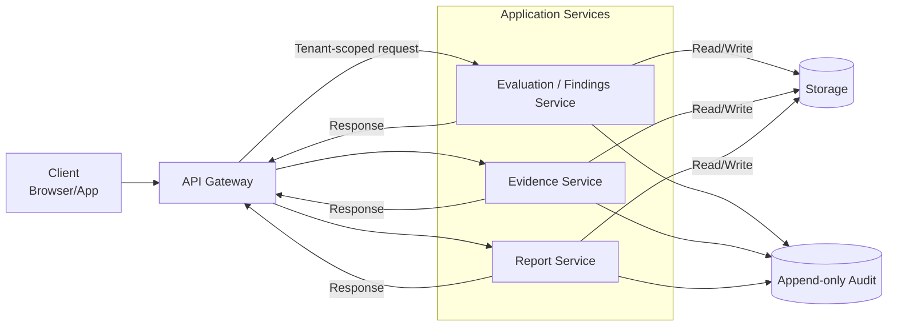
```mermaid
flowchart LR
    C[Client<br/>Browser/App] --> G[API Gateway]

    subgraph AS[Application Services]
        EVAL[Evaluation / Findings Service]
        EVD[Evidence Service]
        RPT[Report Service]
    end

    G -->|Tenant-scoped request| EVAL
    G --> EVD
    G --> RPT

    EVAL -->|Read/Write| ST[(Storage)]
    EVD -->|Read/Write| ST
    RPT -->|Read/Write| ST

    EVAL --> AU[(Append-only Audit)]
    EVD --> AU
    RPT --> AU

    EVAL -->|Response| G
    EVD -->|Response| G
    RPT -->|Response| G
```

This diagram expresses the runtime invariants: single ingress, stateless services, explicit tenant context, and deterministic request–response behaviour.

---

### 6.2 Primary User Journeys (Happy Paths)

#### 6.2.1 Phase 1 – Marketing happy paths (already quite simple)

1. **Visitor lands on homepage, understands what Transcrypt is and who it’s for, and sees a clear CTA to “Join early access” / “Get the checklist” / similar.**
   
  ```mermaid
  flowchart TD
    V[Visitor arrives on homepage] --> H[Homepage hero renders]

    H --> C1{First few seconds}
    C1 -->|Understands value| CTAState[CTA visible above the fold]
    C1 -->|Does not understand| Bounce[Visitor leaves]

    CTAState --> C2{CTA matches intent}
    C2 -->|Yes| ClickCTA[Clicks primary CTA]
    C2 -->|No| Scroll[Scrolls for more info]

    Scroll --> Proof[Sees proof points and explainer]
    Proof --> C3{Convinced}
    C3 -->|Yes| ClickCTA
    C3 -->|No| SoftExit[Leaves site]

    H --> TrackView[(Analytics: view)]
    ClickCTA --> TrackCTA[(Analytics: CTA click)]
    Bounce --> TrackExit[(Analytics: exit)]
    SoftExit --> TrackExit

  ```
---
2. **Visitor clicks CTA → goes to a short form (email + basic company info).**

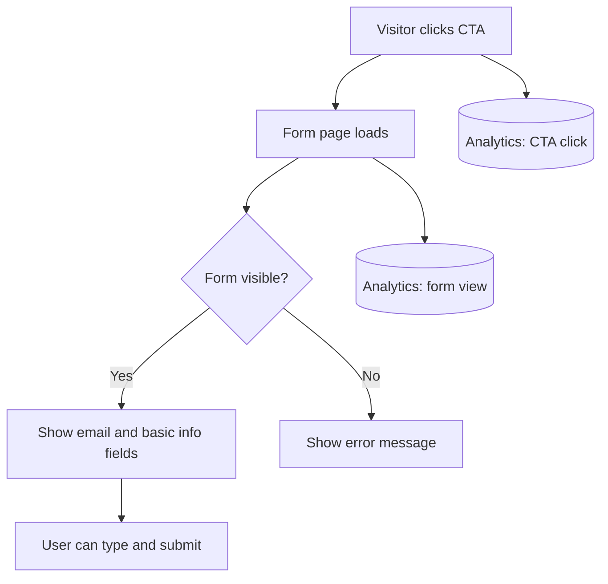
```mermaid
flowchart TD
  CTA[Visitor clicks CTA] --> LoadForm[Form page loads]

  LoadForm --> CheckRender{Form visible?}
  CheckRender -->|Yes| ShowForm[Show email and basic info fields]
  CheckRender -->|No| ErrorPage[Show error message]

  ShowForm --> ReadyToSubmit[User can type and submit]

  %% Optional analytics
  CTA --> TrackClick[(Analytics: CTA click)]
  LoadForm --> TrackView[(Analytics: form view)]
```

### What this diagram expresses

* User clicks the CTA.
* Browser loads the form page.
* If it renders OK → user sees: email, company name, company size, sector, whatever.
* If it *doesn’t* load → error page or fallback (we still show this path so the happy path is honest).
* Analytics hooks are tacked on the side, not in the main flow.

---
1. **Visitor submits form → sees a friendly confirmation state (no weird reload or error).**

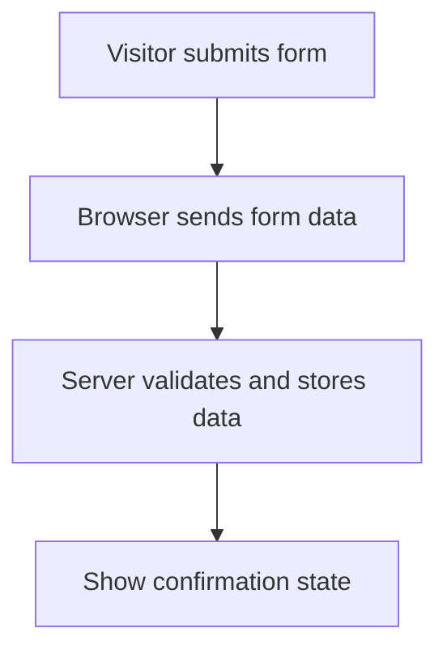
```mermaid
flowchart TD
  Submit[Visitor submits form] --> Send[Browser sends form data]
  Send --> Validate[Server validates and stores data]
  Validate --> Confirm[Show confirmation state]
```

This shows the straight-line happy path: user submits, data is sent, backend accepts it, confirmation state appears.

---
1. **The system creates/updates a contact with email, basic profile, and source/UTM so we can actually use the data.**

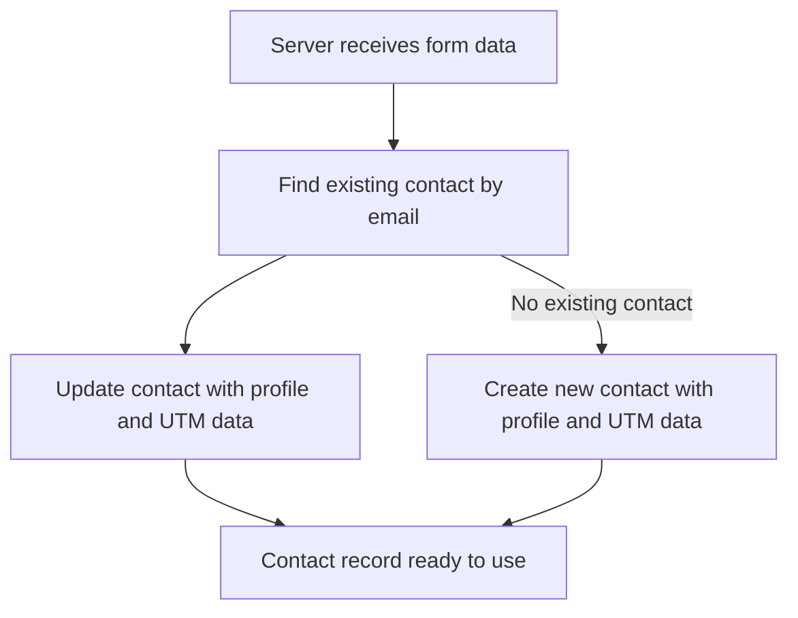
```mermaid
flowchart TD
  Receive[Server receives form data] --> Match[Find existing contact by email]
  Match --> Update[Update contact with profile and UTM data]
  Match -->|No existing contact| Create[Create new contact with profile and UTM data]
  Update --> Done[Contact record ready to use]
  Create --> Done
```

**Explanation:**
The server takes the submitted data, checks whether a contact with that email already exists, updates it if it does, or creates a new one if it doesn’t. The result is a usable contact record with profile and UTM information.

---
1. **Visitor receives the correct email (confirmation or welcome), with working links and consistent branding.**

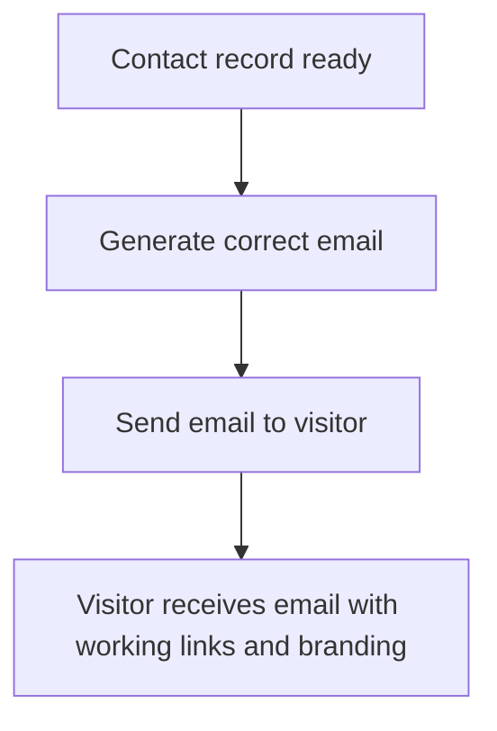
```mermaid
flowchart TD
  Trigger[Contact record ready] --> Generate[Generate correct email]
  Generate --> Send[Send email to visitor]
  Send --> Delivered[Visitor receives email with working links and branding]
```

**Explanation:**
Once the contact data is in place, the system generates the appropriate email and sends it. The visitor receives it with the correct content and working links.

---
1. **Visitor requests/downloads a lead magnet (e.g. Cyber Essentials checklist) → email capture happens if needed → asset is delivered reliably (download or via email link).**

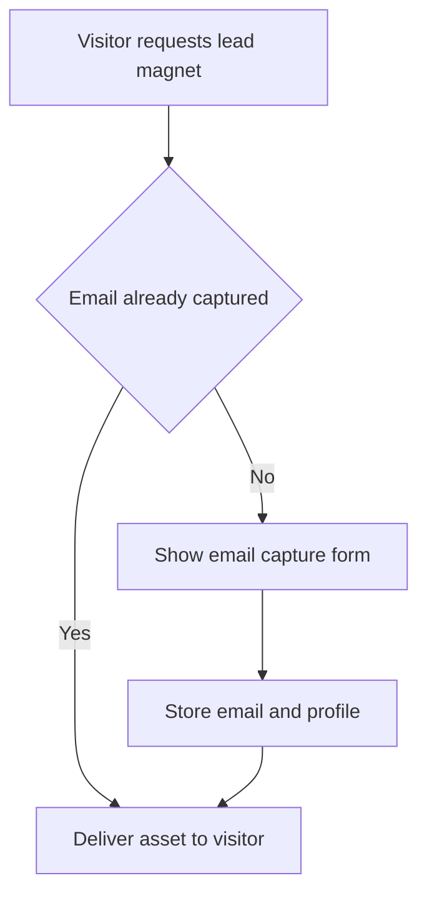
```mermaid
flowchart TD
  Request[Visitor requests lead magnet] --> CheckEmail{Email already captured}
  CheckEmail -->|Yes| Deliver[Deliver asset to visitor]
  CheckEmail -->|No| Capture[Show email capture form]
  Capture --> Save[Store email and profile]
  Save --> Deliver[Deliver asset to visitor]
```

**Explanation:**
The visitor requests the lead magnet. If their email is already known, the system delivers it immediately. If not, it captures their email first, stores it, and then delivers the asset.

---
1. **Visitor comes back via an email link → lands on the intended page (not 404, not root) and can continue exploring.**

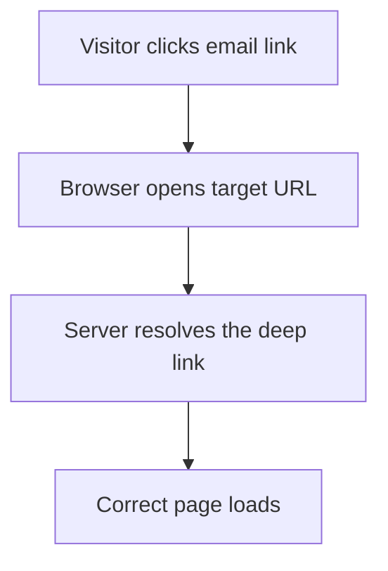
```mermaid
flowchart TD
  Click[Visitor clicks email link] --> Open[Browser opens target URL]
  Open --> Resolve[Server resolves the deep link]
  Resolve --> Page[Correct page loads]
```

**Explanation:**
The visitor clicks the link in the email, the browser opens the intended URL, the server resolves it properly, and the correct page loads so the visitor can continue exploring.

---
1. **Visitor views “How it works” / pricing → sees that Essentials is “coming soon / in beta” and can join the list from there.**

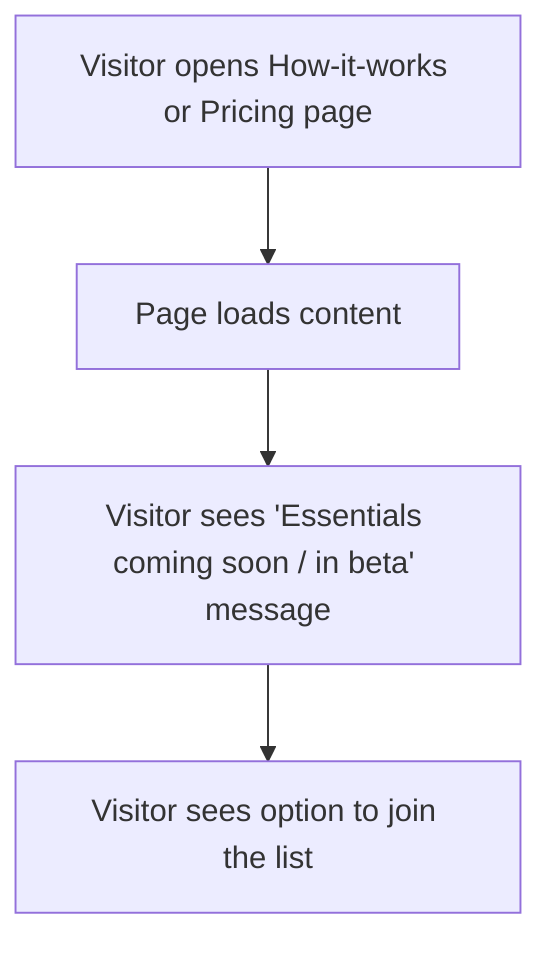
```mermaid
flowchart TD
  Visit[Visitor opens How-it-works or Pricing page] --> Load[Page loads content]
  Load --> SeeMsg[Visitor sees 'Essentials coming soon / in beta' message]
  SeeMsg --> CTA[Visitor sees option to join the list]
```

**Explanation:**
The visitor opens the How-it-works or Pricing page, the content loads, they see the “coming soon / in beta” message, and the page presents a clear way to join the list.

---
1.  **Visitor comes from social (e.g. LinkedIn/Brian video) → lands on a matching landing page with a clear CTA into the same signup flow.**

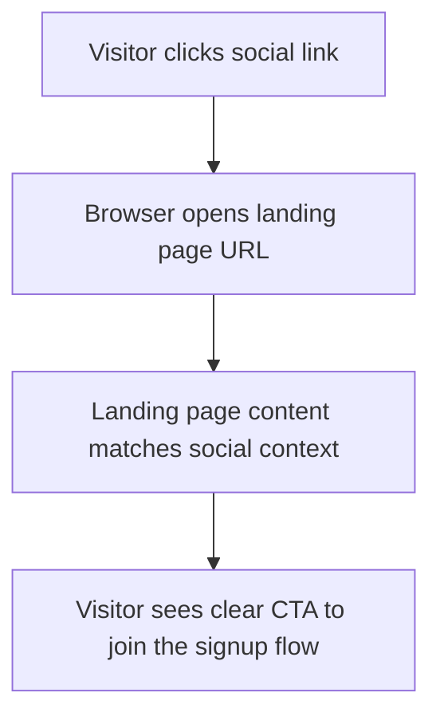
```mermaid
flowchart TD
  Click[Visitor clicks social link] --> Open[Browser opens landing page URL]
  Open --> Match[Landing page content matches social context]
  Match --> CTA[Visitor sees clear CTA to join the signup flow]
```

**Explanation:**
The visitor clicks a social link, arrives on the correct landing page, the content matches what they expected, and the page presents a clear CTA into the signup flow.

---
1.  **Site works properly on mobile (hero, nav, forms, CTAs).**
   
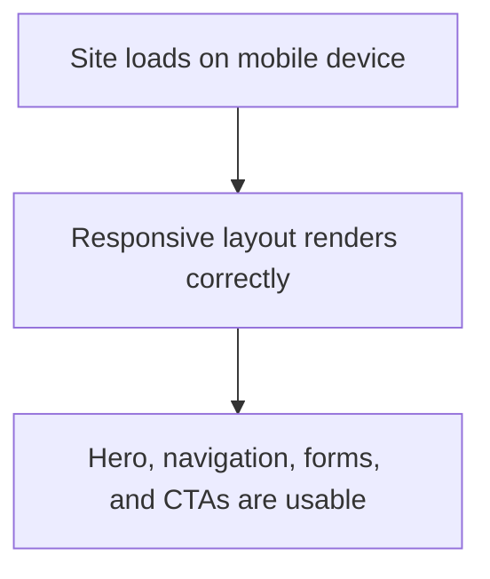
```mermaid
flowchart TD
  Load[Site loads on mobile device] --> Render[Responsive layout renders correctly]
  Render --> Interact[Hero, navigation, forms, and CTAs are usable]
```

**Explanation:**
The site loads on a mobile device, the responsive layout renders correctly, and all key elements (hero, navigation, forms, CTAs) work as expected.

---
1.  **Basic analytics work: we can see sessions, sources, sign-ups, and lead-magnet downloads in one place.**

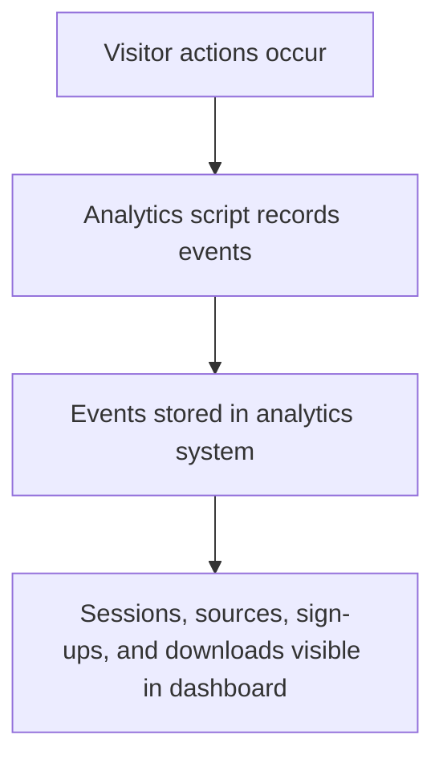
```mermaid
flowchart TD
  Events[Visitor actions occur] --> Track[Analytics script records events]
  Track --> Store[Events stored in analytics system]
  Store --> View[Sessions, sources, sign-ups, and downloads visible in dashboard]
```

**Explanation:**
Visitor activity is tracked, stored in the analytics system, and shown in a single dashboard where sessions, sources, sign-ups, and downloads can be viewed.

---
1.  **We can export the email list (with basic fields) as CSV or similar.**

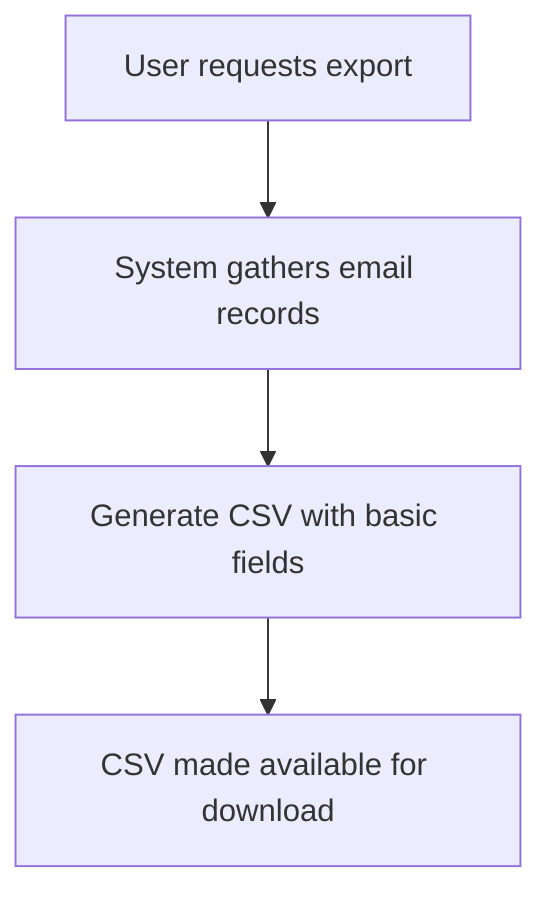
```mermaid
flowchart TD
  Request[User requests export] --> Fetch[System gathers email records]
  Fetch --> Generate[Generate CSV with basic fields]
  Generate --> Download[CSV made available for download]
```

**Explanation:**
When an export is requested, the system collects the stored email records, generates a CSV containing the basic fields, and provides it for download.

---
1.  **We can publish a new blog/article, it appears on the site, and has an embedded CTA into the same signup flow.**

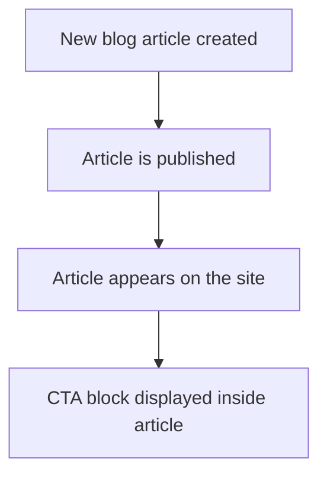
```mermaid
flowchart TD
  Create[New blog article created] --> Publish[Article is published]
  Publish --> Visible[Article appears on the site]
  Visible --> CTA[CTA block displayed inside article]
```

**Explanation:**
A new article is created and published. It becomes visible on the site, and the embedded CTA appears inside it, linking into the same signup flow.

---
1.  **Visitor can find an evergreen explainer (like “What is Cyber Essentials?”) via nav/search and join the list from that page.**

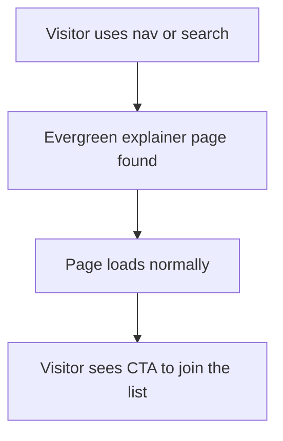
```mermaid
flowchart TD
  Navigate[Visitor uses nav or search] --> Find[Evergreen explainer page found]
  Find --> Load[Page loads normally]
  Load --> CTA[Visitor sees CTA to join the list]
```

**Explanation:**
The visitor uses navigation or search to reach the evergreen explainer, the page loads as expected, and a CTA is present so they can join the list directly from that page.

---

# Phase 1 is “people hit site → give email → get value → you keep data and insight”. No extra ceremony.

---

#### 6.2.2 – Essentials app happy paths (simplified roles, no “first-time owner”)

**Admin = user with full control of that organisation**
**Member = user invited to help with controls/evidence**
**Read-only guest = auditor/insurer etc**

### Phase 2 list

1. Someone on the early access list is invited into Essentials → clicks invite link → lands on Essentials sign-in/sign-up screen with the right context (email/tenant).
2. Admin signs in to Essentials for the first time via OIDC → new organisation is created → Admin lands in the app with an onboarding view.
3. Admin signs in on later visits → goes straight to the main home view (dashboard / status), not onboarding.
4. On first sign-in, Admin fills a minimal organisation profile (name, size, sector, region) → saves successfully → details show up in header/settings.
5. On first sign-in, Admin sees and completes a short Quick Start checklist (e.g. confirm org profile, pick framework, invite a helper, upload first artefact) → reaches a “You’re set up” state with a clear next action.
6. Admin invites a Member via email → Member receives an invite → accepts → signs in via OIDC → lands inside the correct organisation as a Member.
7. Admin invites a tech helper as a Member (we don’t need a special label; just “Member with the right permissions”) → helper accepts → signs in → sees only the organisations they’re added to.
8. Admin invites a Read-only guest (auditor/insurer) → guest accepts → signs in (or uses a tightly controlled magic link) → can browse controls, evidence, and reports without any edit buttons.
9. Admin selects a primary framework (e.g. Cyber Essentials) → the framework’s controls appear as the main list for that organisation.
10. Member (or Admin) opens a control → reads clear guidance → sets status (Compliant / Partially compliant / Not compliant / Not applicable) → saves successfully.
11. Member (or Admin) attaches evidence to a control (file, URL, note) → evidence shows up on that control and inside a central evidence vault, tagged to that organisation and control.
12. Member (or Admin) updates a previously failing control after remediation → status moves to Compliant → overall progress indicators update.
13. Member (or Admin) uploads an artefact file → upload is accepted (size/type OK) → file can be viewed and re-used as evidence.
14. Admin generates a framework report → preview shows correct branding, organisation details, and current status → export to PDF/DOCX works and the file opens fine.
15. Admin shares a report via secure link → system generates a time-limited link or small read-only portal → recipient sees just that report and nothing else.
16. Admin upgrades from free/trial to paid in-app → payment succeeds → organisation’s plan/limits update immediately without knocking anyone off.
17. Admin opens billing → can see current plan, renewal date, and invoice history → can download invoices.
18. Admin updates billing details (card, billing email, invoice name) → changes save and are used for the next billing cycle.
19. Admin updates organisation settings (display name, logo, timezone, notification preferences) → UI and newly generated reports reflect the changes.
20. Any signed-in user opens contextual help from a control/setting → help content appears (panel or modal) → closing it returns them to exactly where they were, with edits intact.
21. Any signed-in user logs out → session is killed → protected pages aren’t accessible via back button → logging in again works and returns them to the right organisation.
22. Admin deactivates a user → that user can no longer access that organisation → if they belong to other organisations, those remain.
23. Admin cancels a pending invite → invite link stops working.


### 6.3 Asynchronous/Event Patterns

Transcrypt uses asynchronous messaging for work that does not require immediate user interaction. Reports, emails, billing synchronisation, and analytics events are processed in the background to keep the user interface responsive and to ensure reliable execution of long-running tasks. Interactive actions (navigation, form submission, control updates) remain fully synchronous.

Asynchronous behaviour is defined in terms of **event topics**, **work queues**, **publishers**, **consumers**, delivery guarantees, and failure-handling policies.

---

## **6.3.1 Purpose of the Asynchronous Layer**

The asynchronous layer exists to:

* offload long-running or IO-heavy operations from the request/response cycle;
* decouple modules so that no subsystem depends on another being immediately available;
* provide reliable, auditable task execution using an event log;
* enable features such as report generation, email dispatch, billing integration, analytics, and future scheduled tasks;
* allow downstream systems (dashboards, audit logs, summaries) to rebuild state from event history.

Only operations with predictable, short execution paths are synchronous. Everything else passes through the event system.

---

## **6.3.2 Event Transport and Topology**

The design assumes a general-purpose event bus. The SAIS does not mandate a specific technology; the implementation may use Kafka, NATS, SNS+SQS, or an equivalent.

Two logical patterns are defined:

1. **Domain event topics**
   Broadcast facts about something that has already happened. Multiple consumers may subscribe.
   Examples: `tenant.created`, `control.answered`, `report.generated`.

2. **Work queues**
   Point-to-point queues used to request work from background workers.
   Examples: report rendering, email dispatch, evidence processing.

Topic naming follows the pattern:

```
transcrypt.<domain>.<event>
```

Queue naming follows the pattern:

```
transcrypt.<service>.commands
```

---

## **6.3.3 Delivery Guarantees**

All events are delivered with **at-least-once** semantics. This guarantees that no event is silently lost, but introduces the possibility of duplicates. Every consumer must therefore be **idempotent**.

Idempotency is enforced using:

* a stable `event_id` on every message;
* idempotency keys stored per consumer to track what has already been processed;
* guards around external side-effects (email providers, billing systems) to prevent duplicate actions.

At-least-once is chosen because it provides operational predictability and avoids the complexity and fragility of exactly-once pipelines.

---

## **6.3.4 Publishing Model**

All synchronous operations that modify domain state write two things:

1. the mutated domain state;
2. an **outbox entry** representing the event.

A background publisher reads outbox entries, publishes them to the event bus, and marks them as sent. This prevents the “state was updated but the event was never published” failure mode.

**Exception:**
Inbound billing webhooks may publish events directly because they originate outside the system and do not participate in application transactions.

**Mermaid – Outbox Publishing Pattern**

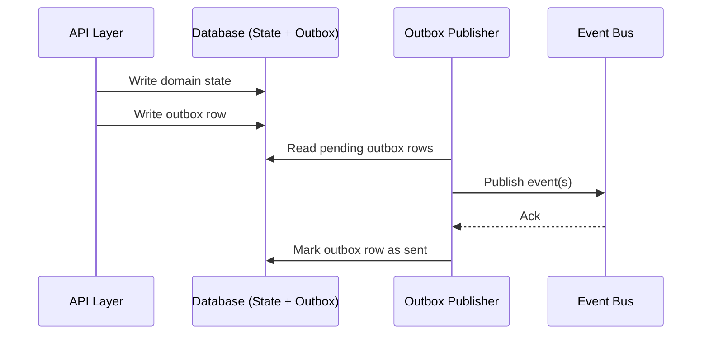
```mermaid
sequenceDiagram
  participant API as API Layer
  participant DB as Database (State + Outbox)
  participant PUB as Outbox Publisher
  participant BUS as Event Bus

  API->>DB: Write domain state
  API->>DB: Write outbox row
  PUB->>DB: Read pending outbox rows
  PUB->>BUS: Publish event(s)
  BUS-->>PUB: Ack
  PUB->>DB: Mark outbox row as sent
```

---

## **6.3.5 Consumption Model**

Consumers subscribe to topics or queues based on their responsibility:

* **Fan-out consumers**

  * audit log writer
  * analytics pipeline
  * dashboard summariser
  * activity timeline

* **Work consumers**

  * report generator
  * email dispatcher
  * evidence processor
  * billing normaliser

Consumers must:

* use idempotency keys to avoid duplicate work;
* acknowledge messages only when all processing is complete;
* isolate tenant-scoped work to avoid cross-tenant side-effects.

**Mermaid – Generic Consumption Pattern**

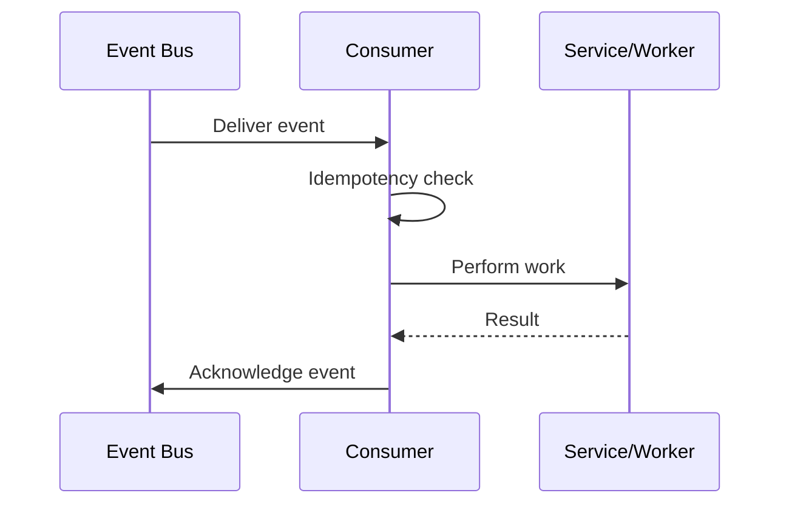
```mermaid
sequenceDiagram
  participant BUS as Event Bus
  participant CON as Consumer
  participant SVC as Service/Worker

  BUS->>CON: Deliver event
  CON->>CON: Idempotency check
  CON->>SVC: Perform work
  SVC-->>CON: Result
  CON->>BUS: Acknowledge event
```

---

## **6.3.6 Retry, Backoff, and Dead-Letter Queues**

Each consumer implements:

* **Exponential backoff** for transient failures (network errors, rate limits).
* **Fixed retry count** (3–5 attempts) depending on task type.
* **Non-retriable classification** (schema errors, invalid tenant, missing resources).

Failure routing:

* After max retries, the event is moved to a **DLQ** under the name:

  ```
  <topic>.dlq
  ```
* DLQ items are enriched with:

  * `error_code`
  * `error_message`
  * `failed_consumer`
  * `attempt_count`

Operators can inspect DLQ contents to diagnose systemic issues.

---

## **6.3.7 Replay and Rebuild Rules**

The event system supports controlled replay.

Replay is **allowed** for:

* rebuilding read-models;
* regenerating dashboards or summaries;
* re-rendering reports with updated templates;
* recomputing analytics.

Replay is **not allowed** for:

* triggering external actions again (emails, payments);
* applying destructive operations twice.

Replay is governed by operational runbooks in §12.

---

## **6.3.8 Canonical Event Envelope**

All events share a standard structure:

* `event_id` — unique identifier
* `event_type` — canonical type string
* `occurred_at` — UTC timestamp
* `tenant_id` — logical tenant ID (nullable pre-signup)
* `actor` — user ID or `"system"`
* `correlation_id` — identifier tying related events together
* `payload` — typed data object defined in §5.5
* `schema_version` — optional schema evolution field

Event schemas in §5.5 define payload validation rules.

---

## **6.3.9 Canonical Events by Domain**

Below are the canonical event families. Payload definitions are in §5.5.

### **Tenant Events**

* `tenant.created`
* `tenant.updated`
* `tenant.plan_changed`

### **User and Access Events**

* `user.invited`
* `user.invite_accepted`
* `user.deactivated`

### **Control Events**

* `control.answered`
* `control.status_changed`

### **Evidence Events**

* `evidence.added`
* `evidence.removed`
* `evidence.tagged`

### **Report Lifecycle Events**

(typical async workflow)

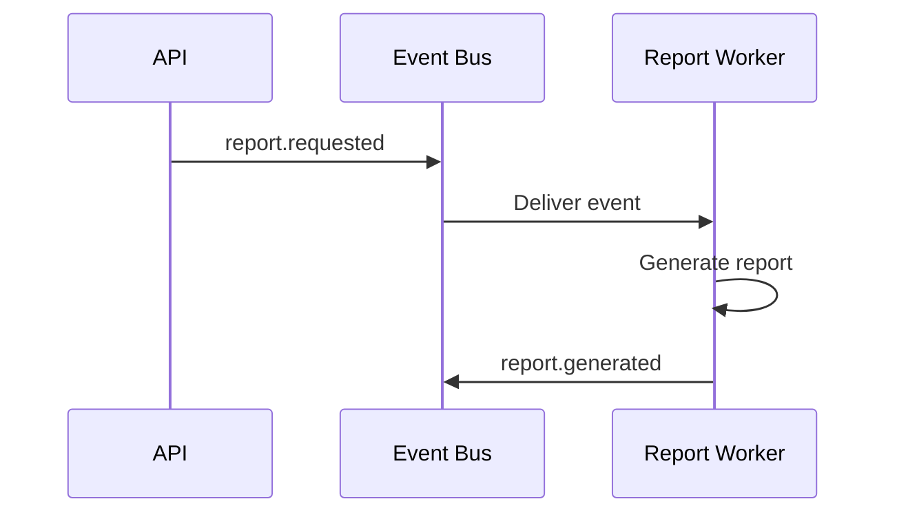
```mermaid
sequenceDiagram
  participant API as API
  participant BUS as Event Bus
  participant WRK as Report Worker

  API->>BUS: report.requested
  BUS->>WRK: Deliver event
  WRK->>WRK: Generate report
  WRK->>BUS: report.generated
```

* `report.requested`
* `report.started`
* `report.generated`
* `report.failed`

### **Email Events**

* `email.dispatch_requested`
* `email.sent`
* `email.bounced`

### **Billing Events**

* `billing.invoice_created`
* `billing.payment_succeeded`
* `billing.payment_failed`

### **Audit & Security Events**

* `audit.activity_recorded`
* `audit.security_event`

### **Analytics Events**

* `analytics.pageview_recorded`
* `analytics.cta_clicked`
* `analytics.signup_completed`

---

## **6.3.10 Scheduling via Events**

Scheduled operations emit events rather than executing work directly:

* daily summaries
* weekly progress digests
* monthly billing syncs
* evidence expiry checks

Example events:

* `scheduled.daily`
* `scheduled.weekly`
* `scheduled.monthly`

Workers subscribe and carry out tasks asynchronously.

---

## **6.3.11 Observability**

The event system exposes:

* consumer lag;
* throughput per topic;
* DLQ size;
* retry counts;
* processing latency;
* correlation-ID-based tracing.

This integrates with observability definitions in §10.

---

## **6.3.12 Operational Expectations**

Operations teams can:

* inspect queue/topic lag;
* inspect and replay DLQ items under runbook control;
* perform partial or full replay from event history;
* track schema updates and rollouts;
* monitor consumer health and restart behaviour.

Runbooks in §12 define recovery and replay procedures.

---

### 6.4 Concurrency, Idempotency, and Ordering

Concurrency control in Transcrypt ensures that repeated requests, parallel edits, and asynchronous job execution do not create duplicate state, conflicting updates, or misordered operations. All mutating endpoints are idempotent; all shared resources use optimistic concurrency; and only clearly-defined workloads require strict ordering.

This section defines the rules for idempotency keys, concurrency markers, and ordered processing. These rules apply to both the synchronous API layer and the asynchronous event/worker layer.

---

## **6.4.1 Idempotency for HTTP Mutations**

All mutating HTTP endpoints (POST, PUT, PATCH, DELETE) must be idempotent. This ensures that retries — whether from the client, network, or gateway — do not create duplicate side effects.

### **Idempotency Key Model**

Each request that mutates state carries an idempotency key. The service scopes keys as:

```
(tenant_id, endpoint_identifier, idempotency_key)
```

Two forms of keys exist:

* **Header-based keys**
  The client supplies `Idempotency-Key: <uuid>`.
  Used for generic create operations (e.g., creating report jobs).

* **Domain-derived keys**
  A natural unique fingerprint is used as the idempotency key
  (evidence hash, report_id, invite key, etc.).
  Useful where the operation already has a collision-proof identifier.

### **Behaviour**

* First request:

  * Persist `(tenant_id, endpoint, idempotency_key)`
  * Store request fingerprint and generated response
  * Apply side effects

* Repeat request with same key and identical payload:

  * Return previously stored response (200/201)
  * Do **not** perform side effects again

* Repeat request with same key but **different** payload:

  * Return `409 Conflict (IDEMPOTENCY_MISMATCH)`
  * Do **not** apply side effects

### **HTTP Idempotency – Sequence Diagram**

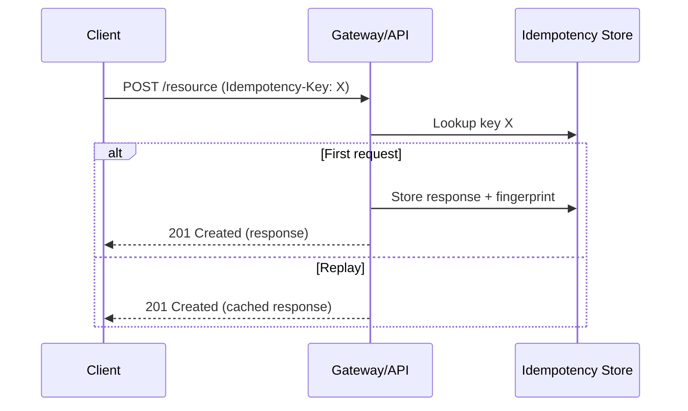
```mermaid
sequenceDiagram
  participant C as Client
  participant API as Gateway/API
  participant DB as Idempotency Store

  C->>API: POST /resource (Idempotency-Key: X)
  API->>DB: Lookup key X
  alt First request
    API->>DB: Store response + fingerprint
    API-->>C: 201 Created (response)
  else Replay
    API-->>C: 201 Created (cached response)
  end
```

---

## **6.4.2 Idempotent Event Consumption**

All events delivered via the asynchronous layer use at-least-once delivery semantics. Consumers therefore must be idempotent.

Each consumer maintains a small processed-event table:

```
processed_events(consumer_name, event_id, processed_at)
```

On delivery:

1. Lookup `(consumer_name, event_id)`
2. If present → acknowledge and do nothing
3. If absent → process the event, then record it as processed

This prevents duplicate:

* email sends
* report generation jobs
* billing state transitions
* evidence processing

---

## **6.4.3 Optimistic Concurrency on Shared Resources**

Mutable records that can be edited by more than one user or worker require optimistic concurrency.

Each such resource carries a version marker:

* `version` column (integer), or
* `etag` derived from a version counter or hash

### **Read**

Client receives the current version or ETag in the response.

### **Write**

Client includes:

```
If-Match: <etag>
```

or sends `version` in the payload.
If version mismatch → `409 Conflict (VERSION_MISMATCH)`.

### **Where Used**

Optimistic concurrency applies to:

* Tenant profile (name, logo, timezone)
* Control answers if multi-editor access is possible
* Any multi-user tenant-level configuration record

One-off operations (report generation, invites, evidence upload) do not require optimistic concurrency because they are guarded by idempotency, not by shared mutable state.

---

## **6.4.4 Ordering Guarantees**

Ordering is not global. Ordering is enforced **only per logical unit of work**, where correctness depends on sequence.

### **Workflows Requiring Strict Ordering**

#### **1. Report Generation**

A report follows a strict lifecycle:

`report.requested → report.started → report.generated/report.failed`

Ordering is enforced by queue partitioning or FIFO semantics using:

```
partition_key = report_id
```

Only one worker processes messages for each report_id at a time.

**Ordered Report Workflow – Sequence Diagram**

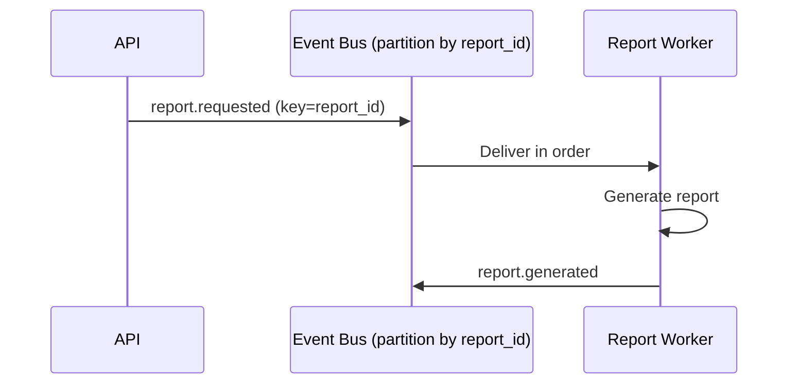
```mermaid
sequenceDiagram
  participant API as API
  participant BUS as Event Bus (partition by report_id)
  participant W as Report Worker

  API->>BUS: report.requested (key=report_id)
  BUS->>W: Deliver in order
  W->>W: Generate report
  W->>BUS: report.generated
```

#### **2. Billing Events**

Ordering is required **per subscription or invoice**, not globally.

Partition key:

```
billing_object_id
```

Examples:

* `billing.invoice_created`
* `billing.payment_succeeded`
* `billing.payment_failed`

#### **3. Evidence Lifecycle**

Evidence transitions should be consistent per evidence item.
Partitioning or versioned DB updates enforce:

`REGISTERED → VERIFIED → SEALED → REJECTED`

### **Workflows Where Ordering Does Not Matter**

* Analytics events (`pageview_recorded`, `cta_clicked`)
* Audit events
* Any stateless fan-out consumer
* Control and evidence additions (idempotency protects them without ordering)

---

## **6.4.5 Interaction Summary**

* **HTTP Layer**

  * All mutating endpoints are idempotent
  * Side effects run once
  * Replays return stored responses
  * Version/ETag semantics prevent conflicting edits

* **Event Layer**

  * At-least-once delivery
  * Consumers maintain “seen set” via event_id
  * Ordering is enforced only where required via partitioning

* **System-Wide**

  * Correlation IDs and timestamps ensure end-to-end traceability
  * Race conditions are avoided through idempotency and version checks
  * Ordered operations are restricted to the few workflows where correctness depends on sequence

---

### 6.5 Timeouts, Retries, and Circuit Breaking

This section defines the timeout boundaries, retry rules, and circuit-breaker behaviour across Transcrypt’s runtime layers. The goal is to ensure predictable failure modes, avoid cascading timeouts, and protect external dependencies from overload. All rules here are consistent with the idempotency and ordering guarantees in §§6.3–6.4.

The behaviour is defined for four distinct layers:

1. Client (browser → Gateway)
2. API Gateway → Application Services
3. Services → Infrastructure/External Dependencies
4. Asynchronous Workers

Each layer has its own timeout envelope, retry policy, and circuit-breaking conditions.

---

## **6.5.1 Timeout Model**

Timeouts are bounded to keep interactive operations fast and to avoid cascading failures. Outer timeouts are always greater than inner timeouts.

### **Client (Browser → Gateway)**

* Default timeout for interactive HTTP requests: **≤ 10 seconds** total.
* Lightweight GETs (dashboard tiles, metadata): **≤ 5 seconds**.
* File uploads: per-chunk or streaming timeouts are permitted to be longer (15–30 seconds), but UI should remain responsive.

The client does not perform silent automatic retries of mutating requests.

### **API Gateway → Application Services**

* Per-call timeout: **3–5 seconds** for typical API operations.
* Higher bound for synchronous POSTs that still run on the hot path: **≤ 8 seconds**.
* Any request expected to exceed this limit must be executed asynchronously (§6.3).

### **Services → Infrastructure and External Providers**

Timeouts vary by dependency characteristics:

* Primary database operations: **1–2 seconds** per query.
* Object store operations: **3–5 seconds**.
* Identity provider JWKS/token checks: **1–2 seconds** (fail closed if exceeded).
* Billing provider API calls: **3–5 seconds**.
* Email provider API calls: **3–5 seconds**.

Long-running tasks such as report rendering are prohibited in synchronous flows.

### **Asynchronous Workers**

Workers may have longer task-level timeouts but must respect job deadlines:

* Report rendering: **≤ 60 seconds** per report job.
* Evidence processing: **≤ 60 seconds** (scan, classify, verify).
* Email dispatch: **≤ 5 seconds** per send operation.

Workers must fail early for known terminal errors and allow the event system to handle retries (§6.3.6).

---

## **6.5.2 Retry Behaviour**

Retries are applied cautiously and only where idempotency and ordering guarantees make them safe.

### **Client**

* No automatic browser-level retries of POST/PUT/PATCH/DELETE.
* GET requests may be retried manually via UI controls, not automatically.
* Upload retry logic is governed by the client UX and is not part of transport-layer behaviour.

### **API Gateway**

The Gateway may retry **only** idempotent operations:

* **Auto-retry permitted:**

  * `GET`, `HEAD` on transient network errors (connection reset, DNS failure, 5xx).
  * At most **1 retry**, with a small delay (100–200 ms).

* **Auto-retry forbidden:**

  * Any mutating request without an idempotency key.
  * Any request returning a 4xx from the upstream service.

### **Services → External Dependencies**

Services apply controlled retry logic on transient failures:

* Allowed failure classes:

  * Network timeouts
  * 502, 503, 504 responses
  * 429 (rate limit), with exponential backoff and jitter

* Retry strategy (per dependency):

  * Up to **3 attempts**
  * Exponential backoff (100 ms → 400 ms → 900 ms)
  * Jitter to prevent synchronised retry storms

* No retries for:

  * 400, 401, 403, 404, 422
  * 409 (version mismatch or idempotency mismatch)
  * Permanent application errors

### **Asynchronous Workers**

Workers use the retry rules defined in §6.3:

* Maximum attempts: **3–5**, depending on job type.
* Exponential backoff with capped delay.
* Terminal classification moves event/job to DLQ.
* Idempotent processing ensures retries do not cause duplicate side-effects.

---

## **6.5.3 Circuit Breaking**

Circuit breakers prevent services from repeatedly calling failing dependencies, reducing load and improving recovery behaviour.

### **Behaviour**

Each breaker monitors a sliding window of recent calls. If the failure rate crosses the configured threshold, the circuit opens.

* **Open state**

  * Immediate fail-fast to callers
  * No attempt made to call the dependency
  * Error surfaced as “Upstream unavailable”

* **Half-open state**

  * After a cool-down period (e.g., 30–60 seconds), allow a limited number of trial calls
  * If they succeed → close the circuit
  * If they fail → reopen

### **Where Circuit Breakers Apply**

* Identity provider (token validation, JWKS fetch)
* Billing provider API
* Email provider API
* Object store (to avoid long hangs on network partitions)
* Any future LLM or AI service dependency

### **Where Circuit Breakers Are Not Applied**

* Internal services in a shared deployment unit (latency controlled by local network)
* Primary database, which uses built-in connection pooling, failover, and backoff mechanisms rather than circuit breaking

---

## **6.5.4 Retryable vs Terminal Errors**

Transcrypt defines retryability based on method semantics and status codes.

### **Retry Matrix by HTTP Method**

| Method | Semantics               | Safe to Retry?                        |
| ------ | ----------------------- | ------------------------------------- |
| GET    | Safe, idempotent        | Yes, once, on transient errors        |
| HEAD   | Safe, idempotent        | Yes, once                             |
| POST   | Create/trigger          | No, unless idempotency key used       |
| PUT    | Idempotent update       | Yes, on transient errors              |
| PATCH  | Partial update          | No (non-idempotent)                   |
| DELETE | Idempotent per resource | Yes, resource-gone treated as success |

### **Error Class Matrix**

| Error Class                          | Retry? | Notes                                     |
| ------------------------------------ | ------ | ----------------------------------------- |
| Network timeout / connection error   | Yes    | Retry with backoff                        |
| 502 / 503 / 504                      | Yes    | Transient; retry allowed                  |
| 429 Too Many Requests                | Yes    | Retry only with backoff + jitter          |
| 400 / 401 / 403 / 404 / 422          | No     | Terminal; caller must correct input/state |
| 409 (version / idempotency mismatch) | No     | Terminal; caller must resolve conflict    |
| Application-level permanent errors   | No     | Explicit non-retryable                    |

---

## **6.5.5 Interaction with Idempotency and Ordering**

The timeout and retry rules above depend on invariants defined in §§6.3–6.4:

* Idempotent HTTP calls ensure that gateway or client retries do not produce duplicate side-effects.
* Optimistic concurrency prevents conflicting updates during overlapping edits.
* At-least-once event delivery and idempotent consumers ensure that worker retries are safe.
* Per-key ordering allows workers to retry safely without breaking report lifecycles or billing sequences.

This alignment ensures Transcrypt behaves predictably under degraded conditions and avoids cascading failures across tenants or services.

---

### 6.6 Failure Scenarios and Degradation Paths

Transcrypt must behave predictably during component failures. This section defines how each subsystem degrades, which user-visible states are presented, and how recovery is handled. All behaviours are aligned with the asynchronous patterns in §6.3 and the idempotency/ordering guarantees in §6.4.

Failures are grouped into:

1. Marketing/Blog Runtime
2. Shared UX behaviour (Site + App)
3. Essentials Runtime
4. Canonical recovery and user-visible states

Three diagrams anchor the section:

* the event lifecycle pattern,
* the marketing/blog fallback flow,
* and the long-running job state progression.

---

## **6.6.1 Marketing and Blog Runtime Failures**

The marketing runtime must remain usable even when dependencies are degraded. Content must always be readable; sign-up flows must never silently fail; lead magnets must never produce dead ends.

### **(a) CDN or Static Asset Failure (CSS/JS/images)**

Content remains functional without styling or JavaScript.

* HTML always served.
* CTAs fall back to standard HTML `<form>` posts.
* Lead magnet links fall back to email-delivery.
* Blog articles remain fully readable.
* No blocking overlays or blank screens.

User-visible state:

* None required beyond optional lightweight “Some resources are loading slowly”.

### **(b) Blog Rendering Engine or MDX Failure**

If dynamic rendering fails, serve a static fallback.

* Pre-rendered static version is always available.
* CTA block always appears (simplified version if needed).
* No article may return 500 or blank output.

User-visible state:

* Non-blocking banner: “Some elements failed to load”.

### **(c) Lead Magnet Delivery Failure**

If file retrieval fails:

* Form submission is accepted.
* Asset is queued for delayed email delivery.
* No broken download buttons.

User-visible state:

* “Your download will arrive by email shortly.”

### **(d) Object Store Failure (Marketing Assets)**

If blog images or downloadable files are unavailable:

* HTML served normally.
* Low-resolution placeholder used if available.
* Lead magnet delivery switches to email fallback.

### **(e) Signup/CRM Integration Failure**

If the marketing backend or CRM endpoint is unreachable:

* The client accepts the email and submits once connectivity returns.
* Server stores the record via idempotent call.
* Confirmation email queued via async worker.

User-visible state:

* “Thanks — check your inbox. It may take a moment.”

Signup records must never be lost.

### **(f) Analytics Failure**

Analytics is additive; no degradation affects site functionality.

* Analytics calls become silent no-ops.
* No JS errors surfaced.

---

## **6.6.2 Shared Runtime Failures (Site + App)**

### **(a) API Gateway Unavailable or Overloaded**

* Blog pages remain fully accessible because they are static.
* Essentials pages show a clean error boundary.
* Gateway returns 429/503 with no long timeouts.

User-visible state:

* “We’re experiencing high load — please retry.”

### **(b) Authentication / IdP Degradation**

Affects Essentials only.

* Fail closed on token verification or JWKS errors.
* No partial sessions.
* Sign-in page reports IdP unavailability.

User-visible state:

* “Sign-in provider unavailable — try again later.”

---

## **6.6.3 Essentials Runtime Failures**

### **(a) Object Store Failure (Evidence, Reports)**

* Metadata accepted.
* Blob write deferred to async worker.
* Evidence/report record shows “Processing”.
* Worker retries with backoff; failed jobs land in DLQ.

User-visible state:

* “Processing upload” or “Processing report”.

### **(b) Database Failure or Latency**

* Write operations fail fast.
* No retries for mutating operations.
* Workers pause until DB recovers via circuit-breaker.

User-visible state:

* “Service temporarily unavailable — please retry.”

### **(c) Rule Engine Degradation**

Evaluation becomes asynchronous.

* Control updates accepted.
* Evaluation queued.
* Summary/progress tiles marked “Updating”.

User-visible state:

* “Updating…” for summaries; controls remain editable.

### **(d) Report Generator Failure**

* Report request accepted and enqueued.
* Worker retries; on permanent failure, DLQ entry created.
* User may trigger manual retry.

User-visible state:

* “Queued” → “Processing” → “Ready” or “Failed — retry available”.

### **(e) Email Provider Failure**

* Welcome, invite, or report emails enter retry loop.
* No user-facing blocking.
* Hard failures → DLQ + operator alert.

User-visible state:

* None in the hot path; confirmation screens always succeed.

### **(f) Billing Provider Failure**

* All billing calls idempotent by billing-object key.
* Plan changes marked “pending” until confirmation.
* No double-charging.
* Failed invoices or webhooks replayed via ordered queue.

User-visible state:

* “Billing provider unavailable — try again shortly.”

---

## **6.6.4 Canonical Event Lifecycle (Diagram)**

This pattern underpins all deferred work: evidence uploads, report generation, email dispatch, lead magnet fallback, and outbound webhooks.

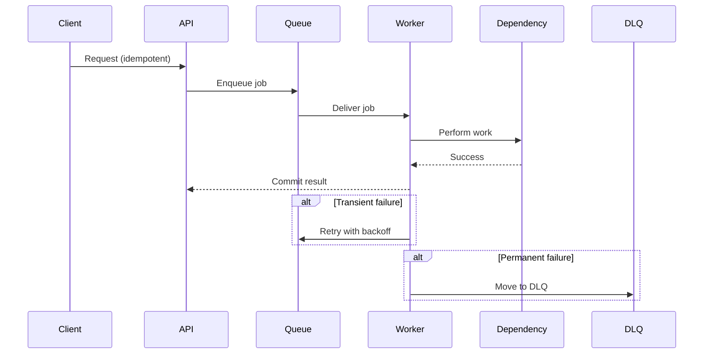
```mermaid
sequenceDiagram
    participant Client
    participant API
    participant Queue
    participant Worker
    participant Dependency
    participant DLQ

    Client->>API: Request (idempotent)
    API->>Queue: Enqueue job
    Queue->>Worker: Deliver job
    Worker->>Dependency: Perform work
    Dependency-->>Worker: Success
    Worker-->>API: Commit result

    alt Transient failure
        Worker->>Queue: Retry with backoff
    end

    alt Permanent failure
        Worker->>DLQ: Move to DLQ
    end
```

This diagram is referenced by every scenario that uses deferred processing.

---

## **6.6.5 Marketing/Blog Fallback Path (Diagram)**

Shows how the site remains functional even when JS, CDN, or assets fail.

```mermaid
flowchart TD
    A[Visitor requests page] --> B{CDN available?}
    B -->|Yes| C[Serve full page]
    B -->|No| D[Serve static fallback]

    C --> E{JS loads?}
    E -->|Yes| F[Hydrate page-CTA + analytics]
    E -->|No| G[Use static CTA + HTML form fallback]

    D --> G
```

This cement the guarantee that the marketing funnel never collapses.

---

## **6.6.6 Long-Running Job States (Diagram)**

Used for report generation, heavy evaluations, bulk invites, and any similar flow.

```mermaid
flowchart LR
    RQ[Requested] --> QD[Queued]
    QD --> PR[Processing]
    PR --> OK[Ready]
    PR --> FL[Failed]
    FL --> RT[Retry]
    RT --> QD
```

All long-running operations expose only these states.

---

## **6.6.7 Canonical User-Visible States**

Transcrypt uses a fixed vocabulary so UX and backend remain aligned:

* **Queued** — Request accepted; work scheduled.
* **Processing** — Worker currently running.
* **Pending** — Awaiting external dependency or asynchronous evaluation.
* **Delayed** — Retrying due to transient upstream failure.
* **Ready** — Output available.
* **Failed** — Work could not complete; user can retry.
* **Unavailable** — Upstream dependency outage detected.
* **Fallback mode** — Static or simplified rendering used.
* **Stored but not delivered** — Lead magnet/email saved but not yet sent.
* **Viewable but incomplete** — Content served without full assets or dynamic hydration.

These states are shared across both runtimes.

---

## **6.6.8 Recovery Model**

For all failures, the system uses:

* **Retry with exponential backoff** for transient upstream errors.
* **Circuit breaking** to prevent overloading downstream providers.
* **DLQs** for terminal failures, each with operator visibility.
* **Replay** of DLQ payloads after remediation.
* **Idempotent processing** to ensure safe recovery from retries.
* **Clear user pathways** for retrying report generation or evidence upload.

No user action ever causes irreversible loss of work.
No marketing visitor hits a dead conversion path.

---

### 6.7 Workflow State Machines (Authoritative)

This section defines the authoritative state machines for long-running workflows in Transcrypt.
Each state machine:

* Has a finite set of well-defined states.
* Is driven by asynchronous events and background workers (§6.3).
* Respects idempotency, ordering, and retry semantics (§6.4–6.5).
* Maps cleanly to user-visible status where applicable (§6.6).

Only workflows that are truly multi-step and asynchronous are modelled here:

1. Report lifecycle
2. Evidence ingestion
3. Invitation lifecycle
4. Lead-magnet delivery

All other behaviours (authentication, navigation, simple reads/writes) are intentionally excluded.

---

### 6.7.1 Report Lifecycle

The report lifecycle covers generation of framework reports (e.g. Cyber Essentials) from the point a user requests a report until it is available for download or marked as failed.

**Key properties**

* Reports are generated asynchronously by background workers.
* Multiple retries may occur for transient errors.
* User-visible states are a subset of the internal lifecycle.

**States**

* `REQUESTED` — API has accepted the report request and created a report record.
* `QUEUED` — a job has been enqueued for processing.
* `PROCESSING` — a worker is actively generating the report.
* `READY` — report artefact has been rendered and stored successfully.
* `FAILED` — terminal failure after retries or unrecoverable error.

**State machine**

```mermaid
stateDiagram-v2
  [*] --> REQUESTED

  REQUESTED --> QUEUED: job enqueued
  QUEUED --> PROCESSING: worker picks job

  PROCESSING --> READY: render + store succeeded
  PROCESSING --> QUEUED: transient error, retry scheduled
  PROCESSING --> FAILED: terminal error / max retries reached

  READY --> [*]
  FAILED --> [*]
```

**User-visible mapping**

* `REQUESTED` / `QUEUED` → “Queued”
* `PROCESSING` → “Processing”
* `READY` → “Ready”
* `FAILED` → “Failed — retry available” (if manual retry is supported)

**Invariants**

* A report cannot return to `REQUESTED` once it has left it.
* `READY` and `FAILED` are terminal from the user’s perspective; a retry creates a new `REQUESTED`/`QUEUED` cycle.
* All transitions are driven by events and worker actions, not by client-side state.

---

### 6.7.2 Evidence Ingestion

The evidence ingestion lifecycle describes how uploaded artefacts move from initial registration through upload and verification to a sealed, immutable state.

**Key properties**

* Metadata and blob transfer may be decoupled.
* Object-store and verification errors are retried with backoff.
* Once sealed, evidence becomes immutable.

**States**

* `REGISTERED` — evidence record created; metadata stored.
* `UPLOADING` — binary content is being sent to the object store.
* `UPLOAD_FAILED` — upload failed after attempts but is retryable.
* `VERIFYING` — hash, size, and integrity checks are being run.
* `SEALED` — evidence verified and marked immutable; normal terminal state.
* `REJECTED` — evidence permanently rejected (corrupt, mismatched, or policy violation).

**State machine**

```mermaid
stateDiagram-v2
  [*] --> REGISTERED

  REGISTERED --> UPLOADING: upload initiated

  UPLOADING --> VERIFYING: upload complete
  UPLOADING --> UPLOAD_FAILED: transient store error

  UPLOAD_FAILED --> UPLOADING: retry after backoff

  VERIFYING --> SEALED: hash/size valid, policy passed
  VERIFYING --> REJECTED: integrity or policy failure

  SEALED --> [*]
  REJECTED --> [*]
```

**User-visible mapping**

* `REGISTERED` / `UPLOADING` → “Processing upload”
* `VERIFYING` → “Verifying file” (optional surfaced)
* `SEALED` → “Available”
* `REJECTED` → “Rejected” (with reason)

**Invariants**

* `SEALED` evidence must not transition back to any mutable state.
* `REJECTED` evidence must not be used to satisfy controls.
* Retries only move `UPLOAD_FAILED` back to `UPLOADING`; they do not recreate the evidence record.

---

### 6.7.3 Invitation Lifecycle

The invitation lifecycle governs how internal collaborators, external helpers, and other users are invited into a tenant and how their invitation can complete, expire, or be revoked.

**Key properties**

* Invitations are created by tenant owners or administrators.
* Email dispatch is asynchronous.
* Links can be accepted, expire naturally, or be revoked.

**States**

* `CREATED` — invitation object has been created but email not yet dispatched.
* `EMAIL_PENDING` — email send has been queued to the mail dispatcher.
* `EMAIL_SENT` — email provider has accepted the invitation email.
* `EMAIL_FAILED` — email dispatch failed after retries.
* `ACCEPTED` — invite link has been used and validated.
* `COMPLETED` — user account created/linked and assigned the intended role(s).
* `EXPIRED` — invitation lifetime elapsed before acceptance.
* `REVOKED` — invitation revoked by an administrator before completion.

**State machine**

```mermaid
stateDiagram-v2
  [*] --> CREATED

  CREATED --> EMAIL_PENDING: enqueue email
  EMAIL_PENDING --> EMAIL_SENT: provider accepted
  EMAIL_PENDING --> EMAIL_FAILED: max retries exceeded

  EMAIL_FAILED --> EMAIL_PENDING: manual resend

  EMAIL_SENT --> ACCEPTED: invite link used
  EMAIL_SENT --> EXPIRED: expiry reached
  EMAIL_SENT --> REVOKED: admin revokes invite

  ACCEPTED --> COMPLETED: user account linked/created

  COMPLETED --> [*]
  EXPIRED --> [*]
  REVOKED --> [*]
```

**User-visible mapping**

* Sender (owner/admin):

  * `CREATED` / `EMAIL_PENDING` → “Sending”
  * `EMAIL_SENT` → “Pending acceptance”
  * `EMAIL_FAILED` → “Email failed — resend available”
  * `ACCEPTED` / `COMPLETED` → “Accepted”
  * `EXPIRED` → “Expired”
  * `REVOKED` → “Revoked”

* Recipient:

  * Invitation link unusable once in `EXPIRED` or `REVOKED`.

**Invariants**

* `COMPLETED`, `EXPIRED`, and `REVOKED` are terminal.
* A `COMPLETED` invitation must not be reused to onboard another identity.
* `EMAIL_FAILED` is recoverable only via explicit resend action.

---

### 6.7.4 Lead-Magnet Delivery Lifecycle

The lead-magnet lifecycle models how marketing assets (e.g. checklists, guides) are delivered once a visitor requests them, either via direct download or email.

**Key properties**

* Email capture and consent are stored before delivery.
* Delivery may be synchronous (download) or asynchronous (email).
* Failures fall back to email delivery where possible.

**States**

* `REQUESTED` — visitor has requested the asset (form submitted or CTA clicked).
* `CAPTURED` — contact details and consent successfully stored.
* `DELIVERING_FILE` — system attempting direct file delivery.
* `DELIVERING_EMAIL` — system attempting email-based delivery.
* `SENT` — asset successfully delivered (download or email).
* `FAILED` — delivery failed after retries; contact still stored for future remediation.

**State machine**

```mermaid
stateDiagram-v2
  [*] --> REQUESTED

  REQUESTED --> CAPTURED: email/consent stored

  CAPTURED --> DELIVERING_FILE: direct download path
  CAPTURED --> DELIVERING_EMAIL: email-only path

  DELIVERING_FILE --> SENT: download initiated
  DELIVERING_FILE --> DELIVERING_EMAIL: file delivery failed, fallback to email

  DELIVERING_EMAIL --> SENT: provider accepted email
  DELIVERING_EMAIL --> FAILED: max retries exceeded

  SENT --> [*]
  FAILED --> [*]
```

**User-visible mapping**

* `REQUESTED` / `CAPTURED` → “Preparing your download”
* `DELIVERING_FILE` → download starts in browser; optional “Your download should begin shortly” message.
* `DELIVERING_EMAIL` → “We’ll email your copy shortly.”
* `SENT` → confirmation (“Check your inbox” or completed download).
* `FAILED` → “We could not deliver your copy automatically; we will follow up or you can contact support.”

**Invariants**

* Lead requests must never be discarded, even if delivery fails; `FAILED` still retains the captured contact.
* Transition from `DELIVERING_FILE` to `DELIVERING_EMAIL` is one-way; once fallback is used, the system does not attempt further file delivery.
* `SENT` and `FAILED` are terminal; repeated requests from the same visitor create a new lifecycle instance.

---

### 6.7.5 General Rules for Workflow State Machines

All workflow state machines in this section share the following rules:

* **Finite state set**
  Each workflow has a finite, explicit set of states; no implicit or ad-hoc states are permitted.

* **Event-driven transitions**
  Transitions occur in response to domain events (e.g., job succeeded, email accepted, link used), never directly from client-side assumptions.

* **Idempotent transitions**
  Reprocessing the same event must not cause an illegal or duplicated transition (e.g., re-handling the same “report.generated” event keeps the report in `READY`).

* **Terminal states**
  Terminal states (`READY`, `FAILED`, `SEALED`, `REJECTED`, `COMPLETED`, `EXPIRED`, `REVOKED`, `SENT`) are absorbing; workflows do not transition out of them except by creating a new instance (e.g., a new report request or a new invitation).

* **Alignment with observability**
  Every state transition should emit structured logs and/or events with correlation IDs, so that operators can reconstruct the lifecycle in traces and audits.

These state machines are the authoritative source for workflow behaviour. Any implementation, documentation, or UI that diverges from them must be corrected or the state machine revised.

### 6.8 Performance Budgets and SLO Paths

Performance budgets and Service Level Objectives (SLOs) define the expected latency and throughput characteristics of each major user path. These expectations guide implementation, test coverage, observability instrumentation (§10), and performance-acceptance criteria (§13). Budgets are stated as engineering targets for individual request stages; SLOs express the required percentile performance over time.

SLOs apply independently across the Marketing runtime (site/blog), the Essentials application, and asynchronous background processes. All values in this section refer to **steady-state** performance under normal load.

---

#### **6.8.1 Principles**

* **Performance Budgets**
  A performance budget allocates the total allowed latency across the individual steps of a request or rendering path. These budgets inform architectural decisions (edge vs origin, cached vs dynamic) and UI expectations.

* **SLOs**
  SLOs define measurable, percentile-based performance targets (typically p95 and p99). They provide the threshold for operational alerts and release gating tests.

* **Availability Targets**
  Availability is defined per path, not globally. For example, blog pages and the marketing homepage must achieve higher availability than authenticated application pages.

* **Mapping**
  Each SLO maps to one or more metrics defined in §10 and validated by acceptance checks in §13.

---

#### **6.8.2 Marketing Site & Blog Performance**

The marketing runtime is responsible for first impressions, conversion, and lead acquisition. Its performance requirements are therefore strict and user-perceptible.

##### **6.8.2.1 Homepage (Critical Landing Path)**

**Budgets**

| Stage                              | Budget           |
| ---------------------------------- | ---------------- |
| CDN / edge TTFB                    | ≤ 300 ms         |
| Above-the-fold render (hero + CTA) | ≤ 1.5 s          |
| Hydration of critical components   | ≤ 300 ms         |
| Deferred / non-critical JS         | ≤ 700 ms (async) |

**SLOs**

* **p95 full render ≤ 2.0 s** (hero visible and CTA interactive)
* **p99 ≤ 3.0 s**
* **Availability ≥ 99.0%**

##### **Latency Budget Illustration**

```mermaid
flowchart TD
  A[Total Budget 2000 ms] --> B[TTFB 300 ms]
  A --> C[Critical Render 1500 ms]
  A --> D[Hydration 300 ms]
  A --> E[Deferred Assets 700 ms]
```

---

##### **6.8.2.2 Blog Article Pages**

**Budgets**

| Stage                | Budget   |
| -------------------- | -------- |
| TTFB                 | ≤ 300 ms |
| Article text visible | ≤ 1.8 s  |

**SLOs**

* **p95 article render ≤ 2.5 s**
* **Availability ≥ 99.0%**
* CTA block must render even during degraded JS mode (§6.6).

---

##### **6.8.2.3 Lead-Magnet CTA Flow**

**Budgets**

| Stage                      | Budget   |
| -------------------------- | -------- |
| CTA click → form visible   | ≤ 500 ms |
| Form submit → confirmation | ≤ 1.0 s  |

**SLOs**

* **p95 end-to-end ≤ 1.5 s**
* **99% of valid submissions succeed with 2xx**
* Direct download must initiate ≤ 1.0 s when available; otherwise fallback to email (§6.6.4).

---

##### **6.8.2.4 Early-Access / Newsletter Signup**

* **p95 submit → confirmation ≤ 1.2 s**
* **99% success rate for valid submissions**

Marketing APIs must meet these SLOs independently of Essentials runtime load.

---

#### **6.8.3 Essentials Application Performance**

##### **6.8.3.1 Sign-In and Initial Context Load**

* **p95 redirect + session establishment + initial dashboard load ≤ 800 ms**
* **p99 ≤ 1.5 s**
* **Success ≥ 99%** (excluding user-error 401/403)

##### **6.8.3.2 Dashboard (Quick Start) Load**

* **p95 main data fetch ≤ 600–800 ms**
* UI interactive ≤ 1.2 s after navigation.

##### **6.8.3.3 Control List View**

* **p95 list fetch ≤ 700–900 ms**
* Subsequent sorting/filtering operations ≤ 300 ms p95 (local or cached).

##### **6.8.3.4 Control Update**

* **p95 ≤ 500–800 ms** for the POST/PATCH
* UI round-trip ≤ 1.0 s.

##### **6.8.3.5 Evidence Upload**

Budgets refer to server-side processing, not total wall clock time (which depends on file size and bandwidth).

* Metadata write ≤ 300 ms
* Chunk/stream initiation p95 ≤ 800 ms
* User must see a “processing/uploading” state within ≤ 500 ms.

##### **6.8.3.6 Help Panel / Contextual Docs**

* **p95 fetch ≤ 400–600 ms**
* Cacheable responses must be served ≤ 200 ms when warm.

---

#### **6.8.4 Asynchronous & Background SLOs**

##### **6.8.4.1 Report Generation**

* **95% READY within 2 minutes** of request
* **99% READY within 5 minutes**
* **0% lost** (every job must end as READY or FAILED)

##### **6.8.4.2 Email Delivery (Welcome, Invites, Report Links)**

* 95% of emails accepted by provider ≤ 30 seconds (welcome/invites)
* 95% accepted ≤ 60 seconds (report links, lead magnets)

##### **6.8.4.3 Lead-Magnet Fallback Email**

* 95% fallback emails accepted by provider ≤ 5 minutes

##### **6.8.4.4 Evaluation Jobs (if offloaded)**

* 95% completed ≤ 30 seconds
* 99% completed ≤ 2 minutes

---

##### **Report SLO Timeline Illustration**

```mermaid
timeline
  title Report Generation SLO
  Request : 0s
  Job Enqueued : within 0–5s
  Worker Start : within 5–20s
  Processing : 20–120s
  Delivery Target : READY ≤ 120s (95%)
  Hard Deadline : READY ≤ 300s (99%)
```

---

#### **6.8.5 Mapping SLOs to Metrics (§10)**

Each SLO corresponds to specific metrics families:

* **HTTP request latency**
  `http_server_request_duration_seconds{route,method}`
* **Availability**
  `http_server_request_errors_total / http_server_requests_total`
* **Background workloads**
  `report_generation_duration_seconds`
  `email_delivery_latency_seconds`
  `evaluation_job_duration_seconds`
* **Marketing conversion metrics**
  CTA click latency, form submit latency, download initiation latency

Dashboard and alerting rules in §10 must reference the SLO values defined here.

---

#### **6.8.6 Mapping SLOs to Acceptance Criteria (§13)**

Performance-acceptance criteria validate key paths against their budgets:

* Load-test `/` and `/blog/*` under steady load to confirm p95 ≤ 2.0 s and ≥ 99% availability.
* Synthetic monitors validate sign-in, dashboard load, and control updates against their SLOs.
* Evidence upload tests ensure “processing” and “verifying” transitions occur within stated budgets.
* Report SLO is validated by staging-environment synthetic workloads using a known tenant dataset.
* Marketing conversions (CTA → form → confirmation) must be tested as part of each release.

Section §13.4 defines the thresholds and required acceptance test suites.

---

#### **6.8.7 SLO Philosophy and Error Budgets**

Transcrypt adopts a simple rule:

* **Meeting the SLOs in this section is mandatory for maintaining perceived product quality.**
* **Error budgets** (e.g., the 1% allowance in p99 definitions) must be reserved for genuine transient conditions, not structural regressions.
* Features that cause repeated SLO violations must be corrected or rolled back.

---

### 6.9 Observability Hooks and Correlation

Transcrypt uses distributed tracing (Jaeger via OpenTelemetry), structured logging, and Prometheus metrics to provide end-to-end visibility across the Marketing runtime, Essentials application, asynchronous workers, and external providers. This section defines the authoritative headers, context attributes, span conventions, and propagation rules required to correlate activity across all components.

Observability is a cross-cutting concern: every request, job, and workflow step must carry the identifiers defined here, and every service must emit logs, metrics, and traces in a consistent format. These conventions underpin the SLOs defined in §6.8 and the metrics and dashboards in §10.

#### **6.9.0 Log Classes and Severity**

Logs are grouped into four classes with a shared schema and consistent downstream handling:

* **Audit** — canonical evidence events; append-only and immutable.
* **Application** — workflow/domain logs used for debugging and behavioural introspection.
* **Access** — request-level logs at the Gateway and frontends.
* **Infrastructure** — system-level logs (Postgres, Redis, OS, container runtime).

Each log carries a `log_type` (string enum) to classify the event for routing, storage policy, and visualisation.

Severity levels are canonical across all classes:

* **TRACE** — ultra-fine detail, development only.
* **DEBUG** — diagnostic detail for investigation.
* **INFO** — normal operation and state transitions.
* **WARN** — unexpected conditions that auto-recover.
* **ERROR** — operations failed and require handling.
* **FATAL** — process cannot continue and must terminate.

Rules that apply to every log class:

* Every log includes a severity value.
* `LOG_LEVEL` is an environment variable threshold controlling emission for non-audit logs.
* **Audit** logs ignore `LOG_LEVEL` and are never filtered.
* All logs conform to the base JSON schema in §6.9 and are structured by default.

---

#### **6.9.1 Core Identifiers and Context Fields**

All logs, regardless of class, use the structured JSON envelope defined in this section.

Every inbound request, internal call, job, and worker span must include the following identifiers:

##### **Mandatory Identifiers**

* **`request_id` / `X-Request-ID`**
  End-to-end request correlation.
  Generated at the Gateway if not present; trusted if client-provided and valid.

* **`trace_id` and `span_id`**
  OpenTelemetry W3C Trace Context fields (`traceparent`, `tracestate`).
  Propagate unchanged through all layers.

* **`tenant_id`**
  Only for Essentials.
  Derived from authentication context, never accepted from client input.

* **`user_id`**
  Derived from authentication; used in logs, traces, and metrics.

* **`idempotency_key` / `X-Idempotency-Key`**
  Required for POST/PUT operations where retries must not duplicate work (reports, evidence, lead magnets, billing).
  Propagated into job metadata and DLQs.

##### **Workflow-Specific Identifiers**

* `report_id`
* `evidence_id`
* `invitation_id`
* `lead_magnet_delivery_id`
* `job_id` (queue system identifier)

These identifiers anchor workflows defined in §6.7 to their traces and logs.

##### **Marketing-Specific Context**

Marketing events (site/blog) include additional structured attributes:

* `lead_id`
* `utm_source`, `utm_medium`, `utm_campaign`
* `magnet_id`
* `landing_page_id`

No raw PII (emails, names) is logged; only hashes or domains.

---

#### **6.9.2 Trace Context Propagation (Browser → Gateway → API → Queue → Worker → Provider)**

OpenTelemetry W3C Trace Context is propagated through every component.
The Gateway is authoritative for generating or normalising trace context.

##### **Propagation Rules**

* Browser → Gateway

  * Browser instrumentation passes `traceparent`/`tracestate` if available.
  * Gateway generates if missing.

* Gateway → API

  * Forwards `traceparent`, `X-Request-ID`, and `X-Idempotency-Key`.

* API → Queue

  * Embeds `trace_id` as a **span link** in the job metadata.
  * Includes `tenant_id`, `user_id`, and workflow IDs.

* Worker → External Providers

  * Worker creates a new span with a link back to the original `trace_id`.
  * Downstream calls (email, billing, object store) inherit this context.

##### **Diagram: End-to-End Trace Propagation**

```mermaid
sequenceDiagram
    participant Browser
    participant Gateway
    participant API
    participant Queue
    participant Worker
    participant Provider

    Browser->>Gateway: HTTP request (traceparent?, request_id?)
    Gateway->>API: Forward request_id, traceparent, tenant_id, idempotency_key
    API->>Queue: Enqueue job (trace_id as span link)
    Queue->>Worker: Deliver job with context
    Worker->>Provider: External call (email/storage) with propagated trace
```

This ensures Jaeger can reconstruct the entire journey, including async steps.

---

#### **6.9.3 Asynchronous Workflow Correlation (Span Link Model)**

As workflows such as report generation, evidence ingestion, invitations, and lead-magnet delivery involve queues and retries, correlation relies on **span links** rather than a single linear trace.

##### **Rules**

* Enqueue spans must include **`workflow_id`** and **`idempotency_key`**.
* Workers must:

  * Start a new span.
  * Link to the original `trace_id`.
  * Include all workflow identifiers.
* Retries create new spans, all linked to the original job.

##### **Diagram: Worker Span Link Correlation**

```mermaid
flowchart TD
  A[HTTP Request<br>trace_id=T] --> B[Enqueue Job<br>span links T]
  B --> C[Worker Start<br>new span, link T]
  C --> D[External Provider Call<br>child span of worker]
  C --> E[Worker Finish<br>READY or FAILED]
```

This ensures all activity related to a workflow is visible in a single Jaeger trace view.

---

#### **6.9.4 Structured Logging Conventions**

All logs must be structured JSON with the following mandatory fields:

| Field                 | Description                                   |
| --------------------- | --------------------------------------------- |
| `timestamp`           | ISO-8601 UTC                                  |
| `severity`            | Structured level                              |
| `request_id`          | Correlates logs to traces                     |
| `trace_id`, `span_id` | OpenTelemetry identifiers                     |
| `tenant_id`           | Required for Essentials; absent for Marketing |
| `user_id`             | Authenticated user (hashed if necessary)      |
| `route`               | Normalised route template                     |
| `workflow_id`         | report/evidence/invite/lead-magnet ID         |
| `event`               | Domain event name                             |
| `details`             | Structured payload                            |

##### **Mandatory Domain Events**

Each workflow in §6.7 must emit log events summarising its transitions:

* Report:

  * `report.requested`, `report.queued`, `report.processing`, `report.ready`, `report.failed`

* Evidence:

  * `evidence.upload_started`, `evidence.verify`, `evidence.sealed`, `evidence.rejected`

* Invitation:

  * `invite.created`, `invite.email_sent`, `invite.accepted`, `invite.completed`, `invite.expired`, `invite.revoked`

* Lead Magnet:

  * `lead_magnet.requested`, `lead_magnet.delivering`, `lead_magnet.sent`, `lead_magnet.failed`

These align directly with the state machines in §6.7.

---

#### **6.9.5 Metrics Naming & Labeling (Prometheus)**

All metrics exposed via `/metrics` follow Prometheus best practices.

##### **6.9.5.1 Standard Metrics**

* HTTP request latency (histogram)
  `http_request_duration_seconds{route,method,status,tenant_id}`
* Request counts and error counts
  `http_requests_total{route,method,status,tenant_id}`
* Queue depth
  `queue_depth{workflow}`
* DLQ size
  `dlq_items{workflow}`

##### **6.9.5.2 Workflow Metrics**

Each long-running workflow must publish duration histograms:

* `report_generation_duration_seconds{tenant_id}`
* `evidence_ingestion_duration_seconds{tenant_id}`
* `lead_magnet_delivery_duration_seconds{magnet_id}`
* `email_delivery_latency_seconds{provider}`

##### **6.9.5.3 Marketing Labels**

Marketing metrics may include:

* `landing_page_id`
* `utm_source`, `utm_campaign`
* `magnet_id`

**Never include raw PII**.

##### **6.9.5.4 Cardinality Guardrails**

* `tenant_id` acceptable (bounded)
* `report_id`, `evidence_id` not used as metric labels
* No per-user labels
* Campaign IDs must be bounded and curated

---

#### **6.9.6 Multi-Tenant Isolation in Observability**

* Every Essentials trace, log, and metric must include the **tenant_id**.
* Tenant ID is derived from auth and never read from a header.
* No cross-tenant logs or traces.
* Aggregated platform metrics must anonymise tenant identity.
* Marketing traces never include tenant identifiers.

---

#### **6.9.7 Relationship to §10 (Telemetry) and §13 (Acceptance)**

* Metrics defined in §6.9 feed directly into dashboards and alerts in §10.
* Trace/span conventions defined here determine:

  * Jaeger trace visualisation
  * Flame-graphs
  * Worker/job correlation
* Acceptance tests in §13 validate:

  * Trace context propagation
  * Span emission
  * Required log events
  * Prometheus metric presence and correct labels
  * SLO compliance (§6.8)

Together, §§6.8–6.9 define how performance expectations are measured, traced, and validated.

---

#### **6.9.8 Invariants**

* Every request must have a unique `request_id` and `trace_id`.
* Every workflow must have a `workflow_id`.
* All logs must be structured JSON with mandatory fields.
* All services must propagate OpenTelemetry trace context.
* No raw PII is logged anywhere in the system.
* Multi-tenant isolation applies to all observability data.

---

## 7. Deployment and Environment Architecture

This section defines **how Transcrypt is deployed, operated, and promoted across environments**. It establishes the physical shape of the platform – the environments it runs in, how they are provisioned and updated, how secrets and configuration are managed, how traffic reaches the system, and how the infrastructure is protected and observed.

It sets the **environmental contract** that all engineering work must obey:

* each environment (dev, staging, prod, and any preview stacks) runs the same build artefacts and configuration-by-name;
* promotion between environments is driven by Infrastructure-as-Code, with no manual drift;
* the network topology, segmentation, secrets, runtime permissions, and external integrations follow a single documented pattern;
* all components (Next.js, Gateway, services, workers, queues, storage, database) exist in well-defined places with clear trust boundaries;
* rollout, rollback, migrations, signing, and supply-chain controls are consistent across environments;
* observability, access control, cost guardrails, and disaster-readiness follow the same rules everywhere.

Where §6 defines **how the system behaves**, §7 defines **where and how the system runs**, what it is allowed to talk to, and how it stays safe, reproducible, and recoverable.

All diagrams, topology descriptions, access-control rules, and IaC conventions in this section are **normative** for implementation and operations.

---

### 7.1 Environments and Parity Rules

Transcrypt operates with a deliberately simple environment model optimised for speed of development, clarity of behaviour, and predictability of deployment. Two environments exist:

1. **Local Development (MacBook)** – the complete working environment where all features of the public site, blog, and Essentials application are built, exercised, and validated.
2. **Production (DigitalOcean)** – the single cloud environment that serves all customers and all public-facing content.

There is **no separate dev, QA, or staging environment**. Local development is authoritative for engineering, and production is authoritative for live traffic.

In both environments, Transcrypt may call an **external inference API** (LLM) for non-critical assistive tasks. The inference API is never required for correctness of compliance logic, and failures degrade gracefully rather than blocking core workflows.

---

#### **7.1.1 Environment Catalogue**

##### **Local Development (MacBook)**

Local development runs the **entire Transcrypt platform**:

* Marketing site (`/`)
* Blog runtime (`/blog/*`)
* Essentials application (`/app/*`)
* API routes and application services
* Background workers (reports, email triggers, evidence flows)
* Local PostgreSQL instance for application data

Local development uses the **same external services** as production where practical:

* **DigitalOcean Spaces** hosts all public-facing static content (blog images, lead magnets, site assets). These assets are created or updated during development and are the exact files later served to users via CDN in production.
* **Stripe** is exercised in full using **test mode**.
* **MXroute** is exercised via a development-safe mailbox or routing pattern.
* **Inference API** uses a **dev/test project** with development API keys; verbose logging of prompts and responses is enabled to aid debugging.
* Analytics and telemetry are enabled in development with dev-directed sinks or properties.
* Logging is verbose (debug-level) to support rapid iteration.

Local development must be able to run **every user path** end-to-end, including site/blog rendering, tenant creation, OIDC sign-in (using dev config), evidence upload, control updates, report generation, and email flows.
LLM-assisted features must also be runnable end-to-end in development, with failures degrading gracefully in accordance with §6.5.

##### **Production (DigitalOcean)**

Production runs on a DigitalOcean droplet and serves all public and authenticated experiences:

* Marketing site and blog delivered via DO CDN
* Essentials app served from the same Next.js build artefacts
* API runtime and background workers running on the droplet
* PostgreSQL running on the droplet (or managed DB service)
* DO Spaces providing static and application asset storage
* MXroute handling all outbound email
* Stripe operating in live mode with real billing
* **Inference API** operating with **production API keys**, hardened quotas, minimal prompt/response logging, and protective timeout/circuit-breaker policies defined in §6.5

Production is the only environment visible to customers. All deployments arrive via the CI/CD pipeline; no manual changes to the production filesystem, configuration, or runtime are permitted.

---

#### **7.1.2 Parity Principles**

Despite running in different locations, **Local Development and Production must behave the same way wherever behaviour matters**. Parity is defined as follows:

##### **Code Parity**

* The same Next.js codebase delivers:

  * the marketing site,
  * the blog,
  * and the Essentials application.
* The same commit is built and tested by CI, and the resulting artefacts are deployed to production.
* No “prod-only” branches, conditionals, or filesystem content are allowed.

##### **Route Parity**

All routes available in production must be runnable locally:

* `/` (marketing)
* `/blog/*`
* `/app/*`
* `/api/*`

If a route does not function end-to-end on the Mac, it does not ship to production.

##### **Content Parity (Site & Blog)**

* Public-facing content (images, PDFs, hero assets, lead magnets) is generated or updated in the local environment and pushed to **DigitalOcean Spaces**.
* Production serves **the same assets**, via CDN, without an intermediate “dev bucket”.
* The marketing/blog content pipeline is shared across both environments, with production acting as the consumer of the artefacts built in development.

##### **Runtime Parity (Essentials App)**

* Local development must fully exercise:

  * tenant lifecycle,
  * control evaluation,
  * evidence ingestion,
  * report generation,
  * invitation flows,
  * and asynchronous workflows.
* Runtime access to the **inference API** must behave identically in structure across environments: same endpoints, same request schemas, same degradation paths. Only API keys, quotas, and logging policies differ.
* The runtime architecture (API → services → workers → storage) is functionally identical.

##### **Configuration Schema Parity**

* Both environments use **the same configuration variable names**, covering:

  * PostgreSQL connection
  * Object storage (DO Spaces endpoint, bucket, region)
  * CDN base URL
  * MXroute credentials
  * Stripe keys
  * Analytics/telemetry keys
  * **Inference API keys / endpoints**
  * JWT/session secrets
* Only **values** differ; schema and naming remain identical.

##### **Storage Parity**

* Both environments use **DigitalOcean Spaces** with the same S3-compatible API.
* Production uses CDN fronting; local development accesses the same assets directly when creating or updating them.
* Application-level assets (evidence, reports) may be stored under a different prefix or bucket, but the API behaviour is identical.

---

#### **7.1.3 Environment-Specific Toggles**

Only a narrow and explicitly defined set of differences exists between Local Development and Production. These are intentional deviations, not parity violations.

| Concern                | Local Development (Mac)                                   | Production (DigitalOcean)                                  |
| ---------------------- | --------------------------------------------------------- | ---------------------------------------------------------- |
| **Marketing assets**   | Created/edited locally → pushed to DO Spaces              | Served via DO CDN from the same Spaces location            |
| **Blog runtime**       | Dev mode, hot reload                                      | Built Next.js artefact                                     |
| **Essentials runtime** | Dev mode, debug logs                                      | Built and optimised artefacts                              |
| **Database**           | Local Postgres                                            | Production Postgres instance                               |
| **Object storage**     | DO Spaces (direct access)                                 | DO Spaces behind CDN                                       |
| **Email**              | MXroute dev/test routing                                  | MXroute production mailboxes                               |
| **Billing**            | Stripe test mode                                          | Stripe live mode                                           |
| **Inference API**      | Dev/test project, verbose logging, unrestricted debugging | Prod project, usage caps, strict timeouts, minimal logging |
| **Logging**            | Debug/verbose                                             | Structured JSON, info-level                                |
| **Analytics**          | Dev properties or tagged events                           | Production analytics property                              |
| **Rate limiting**      | Relaxed                                                   | Customer-facing strict limits                              |
| **Telemetry sampling** | High/100%                                                 | Reduced sample for proportional overhead                   |

These are the only sanctioned differences. Anything outside this list is considered a misconfiguration.

---

#### **7.1.4 Deployment Path**

* Local Development is the sole source of truth for code and content authoring.
* CI builds artefacts from GitHub, runs the full test suite, and deploys to production upon success.
* Production is updated **only** by CI/CD; direct edits or manual pushes are prohibited.
* Public content in DO Spaces is updated from local development and becomes the canonical serving source for the CDN.
* The inference API is **not part of deployment**; each environment uses its own API keys configured as secrets on the Mac and on the droplet.

---

#### **7.1.5 Environment Diagram**

```mermaid
flowchart LR
    Dev[Local Development-MacBook\n• Next.js-site/blog/app\n• API + Workers\n• Local Postgres\n• Pushes assets to DO Spaces\n• Dev Inference API keys] 
        -->|CI Build + Deploy| Prod[Production DigitalOcean Droplet\n• Next.js Runtime\n• API + Workers\n• Postgres\n• MXroute\n• Stripe Live\n• Prod Inference API keys]

    Prod --> CDN[(DO CDN)]
    CDN --> Spaces[(DO Spaces – Canonical Content Storage)]
```

This diagram shows the full environment model: develop locally, publish assets to Spaces, deploy via CI to the droplet, serve via CDN. Inference API access is environment-specific but structurally identical.

---

### 7.2 Infrastructure as Code (IaC)

Transcrypt’s infrastructure for the MVP is intentionally minimal: a **single DigitalOcean droplet**, a **DigitalOcean Spaces bucket + CDN**, **MXroute** for email, **Stripe** for billing, and an external **Inference API** used by the application. The priority in this phase is *speed, reliability, and repeatability*, not early adoption of Terraform or cloud-formalised IaC stacks.

“IaC” in the MVP therefore means:

* **Every infrastructure decision is documented.**
* **Every configuration value is committed as structured config (never implicit).**
* **Every environment can be rebuilt cleanly following written, reproducible steps.**
* **Bootstrap scripts and CI/CD jobs automate everything that is safe to automate.**

Full Terraform/Terragrunt adoption may come later when the Essentials app generates enough recurring revenue to justify managed complexity. For now, the system follows a **documented-IaC + scripted-IaC** model that still ensures determinism.

---

#### **7.2.1 IaC Philosophy for the MVP**

Transcrypt’s infrastructure principles in the MVP are:

1. **Everything must be reproducible**
   A clean DO droplet must be rebuildable from a documented procedure plus configuration files checked into Git.

2. **Everything configurable must be explicit**
   No hidden environment-only configuration.
   No “stuff on the droplet nobody remembers creating”.

3. **No mutations outside CI/CD**
   The droplet runs *only* what CI/CD deploys.
   No manual editing of files or services on the server.

4. **Documentation *is* infrastructure**
   For the MVP, written system definitions are treated as first-class IaC.

5. **Bootstrap scripts fill the gap**
   Where automation makes sense (service start, migrations, health checks), small scripts handle the busywork.

6. **Future Terraform adoption is not blocked**
   The MVP structure is designed so IaC can be introduced incrementally later.

This gives you 100% control today, and a clean runway for future automation when the business case appears.

---

#### **7.2.2 What Counts as IaC in This Phase**

Even without Terraform, the infrastructure is still “defined as code” through:

* **`infra/` directory** inside the repo
  Holds authoritative documentation, config schemas, bootstrap scripts, rebuild steps.

* **CI/CD workflows**
  Build → test → deploy → health-check.
  These are declarative automation. They *are* IaC.

* **Bootstrap scripts (`scripts/`)**
  For provisioning services on the droplet:

  * Next.js runtime start
  * Worker scheduler start
  * Database migrations
  * Sanity checks (bucket access, Stripe key validation)

* **Configuration manifests**
  `.env.example`, config schemas, and validation code inside the app.

* **DigitalOcean snapshot + DB backups**
  Not “IaC” in the Terraform sense, but functionally “infrastructure definition & restore model”.

This combination gives you deterministic behaviour without overloading yourself with Terraform maintenance.

---

#### **7.2.3 State Management (Human-Readable, Repo-Anchored)**

Because there is no Terraform state, Transcrypt tracks infra state via **source-controlled JSON/YAML**:

* `infra/state/droplet.json`

  * DO droplet size
  * region
  * image used
  * firewall profile
  * ports open (80/443/SSH inbound)
  * outbound allowances

* `infra/state/spaces.json`

  * Spaces bucket name
  * region
  * CDN config
  * caching defaults

* `infra/state/dns.json`

  * A/AAAA records
  * CNAMEs
  * MX records for MXroute
  * ACME certificate domains

* `infra/state/email.json`

  * MXroute routing patterns
  * SPF/DKIM/DMARC records

These documents represent “the truth” for the current environment and allow deterministic rebuild.

Nothing in production is allowed to diverge from these. If the droplet is replaced, these files rebuild it.

---

#### **7.2.4 Module Layout (Documentation + Scripts)**

Transcrypt uses a small, predictable directory structure:

```
repo/
  infra/
    state/
      droplet.json
      spaces.json
      dns.json
      email.json
    docs/
      rebuild.md
      droplet-provision.md
      spaces-setup.md
      dns-config.md
      backups.md
    scripts/
      bootstrap.sh
      migrate.sh
      verify-env.sh
      deploy.sh
```

**This is IaC.**
The "definition" lives in `infra/state/`.
The "automation" lives in `infra/scripts/`.

This section is where the second diagram goes (the repo layout diagram).

##### **Diagram — Infrastructure Code Footprint (MVP)**

Placed *here*, directly after describing module layout.

```mermaid
flowchart LR
    R[repo/] --> I[infra/]
    I --> ST[state/\ndroplet.json\nspaces.json\ndns.json\nemail.json]
    I --> DOCS[docs/\nrebuild.md\ndroplet-provision.md\nspaces-setup.md]
    I --> SCR[scripts/\nbootstrap.sh\nmigrate.sh\nverify-env.sh\ndeploy.sh]
```

---

#### **7.2.5 Promotion Workflow (plan → apply, MVP edition)**

Without Terraform, promotion follows a hybrid model:

##### **1. Local Development (Authoring)**

You build content, code, and configuration locally.

##### **2. Git Commit → CI Pipeline**

CI performs:

* linting
* static analysis
* unit tests
* integration tests
* smoke tests
* build of Next.js (site/blog/app)
* report/workers build
* artefact bundling

##### **3. CI Deploy → Production Droplet**

CI uses:

* SSH deploy
* or rsync-based atomic release
* or container image + systemd unit update (if using Docker)

After deploy:

* Container/service restart
* DB migrations run from CI (never from the droplet)

##### **4. Post-Deploy Health Checks**

CI tests:

* `/` loads through CDN
* `/app` loads through droplet
* DB connectivity
* Spaces access
* MXroute SMTP check
* Stripe key validation
* Inference API test call

##### **5. Promotion Complete**

If health checks pass, the release is pinned.
If not, rollback procedure triggers (redeploy previous artefact).

This gives you the behavioural equivalent of “terraform plan → terraform apply → validation”.

---

#### **7.2.6 Future Terraform Migration Path (Optional, Not Required Now)**

Although not part of the MVP, this section establishes future readiness:

Terraform can later be introduced incrementally:

1. Start with DNS
2. Then Spaces + CDN
3. Then the Droplet
4. Finally database + firewall rules

Because infra is already documented in JSON/YAML, the Terraform modules can be built directly from existing state.

Terraform is not a prerequisite for scaling into revenue—it's simply an option.

---

#### **7.2.7 Infrastructure Definition & Rebuild Blueprint**

The following diagram summarises the infrastructure model for the MVP, showing how the production droplet, CDN, object storage, external services, and backup/restore flow fit together.

```mermaid
flowchart TB
    Console[DigitalOcean Console\nManual Provisioning] --> Droplet[(Production Droplet)]
    Droplet --> DNS[DNS Records]
    Droplet --> MX[MXroute]
    Droplet --> Stripe[Stripe API]
    Droplet --> LLM[Inference API\n-external SaaS]
    Spaces[(DO Spaces)] --> CDN[(DO CDN)]
    Droplet --> Spaces

    Backup[DO Snapshots\n+ DB Backups] --> Restore[Rebuild Procedure]
    Restore --> Droplet
```

This captures:

* manual infra creation
* code-driven deployments
* DO Spaces as canonical content store
* CDN as distribution layer
* email + billing + inference API as external SaaS
* backup/restore as the DR mechanism

---

### 7.3 Runtime Topology

The runtime topology describes how Transcrypt executes in both local development and production. It defines how the web runtime, API routes, background workers, database, object storage, external providers, and CDN fit together during execution. This section captures the physical layout of the system at runtime, not the logical architecture in §6.

The marketing site, blog, and Essentials application are all served by a single Next.js runtime. Background work (reports, email dispatch, evidence ingestion) runs in a separate worker process that shares the same codebase. PostgreSQL is used as the system-of-record; DigitalOcean Spaces provides object storage and powers the CDN. Stripe, MXroute, and the inference API are external SaaS dependencies accessed over HTTPS.

---

#### **7.3.1 Local Development Runtime Topology**

Local development runs the entire platform on the MacBook. All routes, workers, and integrations must work end-to-end exactly as they do in production, with the only differences being scale and secret values.

**Local components**

* **Next.js runtime (dev mode)**
  Serves:

  * marketing site (`/`)
  * blog (`/blog/*`)
  * Essentials application (`/app/*`)
  * API routes (`/api/*`)

  Listens on **`localhost:3000`**.

* **Local PostgreSQL**
  Runs on **`localhost:5432`** and stores all application data.

* **Background worker**
  A separate Node process that pulls jobs from a Postgres-backed queue and executes asynchronous workflows (report generation, evidence processing, email triggers).

* **External services (test/dev)**

  * DigitalOcean Spaces for asset upload
  * Stripe (test mode)
  * MXroute (dev/test routing)
  * Inference API (dev key)

**Traffic behaviour**

* The browser connects directly to `localhost:3000`.
* Next.js routes issue DB queries locally.
* Next.js and the worker communicate with external services via HTTPS.
* Assets are pushed up to DO Spaces during development and are the same assets later used in production via CDN.

**Health checks**

* `/healthz` — liveness
* `/readyz` — readiness (DB reachable, Spaces reachable, external API check within tight timeout)
* Worker health through a lightweight heartbeat (DB row) or its own HTTP endpoint if enabled.

##### **Local Runtime Diagram**

```mermaid
flowchart LR
    Browser[Browser<br/>localhost] --> App[Next.js Runtime<br/>localhost:3000]

    App --> DB[(PostgreSQL<br/>localhost:5432)]
    Worker[Background Worker<br/>Local Process] --> DB

    App --> Spaces[(DO Spaces)]
    Worker --> Spaces

    App --> Stripe[Stripe Test API]
    Worker --> Stripe

    App --> MX[MXroute Dev/Test]
    Worker --> MX

    App --> LLM[Inference API<br/>Dev Key]
    Worker --> LLM
```

---

#### **7.3.2 Production Runtime Topology**

Production runs on a single DigitalOcean droplet. The same Next.js build that runs locally is served here in optimised mode. All customer-facing traffic enters through DNS and reaches the droplet over HTTPS. Static assets are delivered through DigitalOcean’s CDN backed by Spaces.

**Production components**

* **Next.js runtime (production build)**
  Serves:

  * marketing site
  * blog
  * Essentials application UI
  * `/api/*` (evaluation, evidence, reporting, billing, invitations, etc.)

  Listens on **port 443** (via Node directly or via a lightweight reverse proxy such as Caddy or Nginx).
  Port 80 redirects to 443.

* **PostgreSQL**
  Runs on the droplet or via DO’s managed database service.
  Accessible only locally or via DO private networking.

* **Background worker**
  A separate Node process on the droplet executing asynchronous workflows through the same DB-backed queue.

* **DigitalOcean Spaces + CDN**

  * All blog images, hero assets, static downloads, and lead magnets.
  * CDN handles caching and global delivery.
  * Application reads/writes via the Spaces S3-compatible API.

* **External providers (live)**

  * Stripe (live mode)
  * MXroute (production mailboxes)
  * Inference API (production project/key)

**Traffic behaviour**

* Client → DNS → droplet (443) → Next.js → DB
* Client → CDN → Spaces for static assets
* Next.js and worker communicate with Stripe, MXroute, inference API via outbound HTTPS.

**Ports**

* **443** — HTTPS (public)
* **80** — HTTP (redirect)
* **5432** — PostgreSQL (private only)
* **22** — SSH (restricted)
  No other ports exposed.

**Health checks**

* `/healthz` — process liveness
* `/readyz` — DB ready, Spaces reachable, ability to contact Stripe/LLM provider within configured timeout
* Worker health via HTTP or heartbeat row

##### **Production Runtime Diagram**

```mermaid
flowchart LR
    Client[Client Browser<br/>HTTPS 443] --> DNS[DNS Routing]
    DNS --> Droplet[DigitalOcean Droplet<br/>Next.js Runtime]

    Droplet --> DB[(PostgreSQL<br/>Private)]
    Worker[Background Worker<br/>Same Droplet] --> DB

    CDN[DO CDN] --> Spaces[(DO Spaces<br/>Static Assets)]
    Droplet --> Spaces

    Droplet --> Stripe[Stripe Live API]
    Worker --> Stripe

    Droplet --> MX[MXroute SMTP]
    Worker --> MX

    Droplet --> LLM[Inference API<br/>Prod Key]
    Worker --> LLM
```

---

#### **7.3.3 Logical Services Within a Single Runtime**

Although Transcrypt uses the terminology of “Evaluation Service”, “Evidence Service”, “Report Service”, and similar, these are **logical modules**, not separate runtime processes. All API routes are served by the single Next.js runtime on the droplet and during development. The worker process calls into the same modules.

All service boundaries described in §6 (evaluation, evidence, reporting, user/tenant, billing, invitations) are implemented as internal code organisation rather than standalone containers.

---

#### **7.3.4 Queue and Worker Execution Model**

The asynchronous execution layer uses a **PostgreSQL-backed queue** in the MVP.
The worker process:

* runs on the same droplet as the app,
* polls the queue for jobs,
* emits events to the DB-backed outbox,
* and performs all deferred work (report generation, email dispatch, evidence ingestion, billing normalisation).

No Redis, RabbitMQ, Kafka, or other queueing infrastructure is part of the MVP runtime.

---

#### **7.3.5 Port Bindings**

| Component             | Local (Mac)      | Production (Droplet)      |
| --------------------- | ---------------- | ------------------------- |
| Web/App/API (Next.js) | 3000             | 443 (HTTPS) / 80 redirect |
| PostgreSQL            | 5432             | 5432 (private only)       |
| Worker process        | n/a (local proc) | n/a (local proc)          |
| SSH                   | n/a              | 22 (restricted)           |
| CDN / Spaces          | HTTPS outbound   | HTTPS outbound            |

All other inbound ports are closed.

---

#### **7.3.6 Health-Check Endpoints**

Transcrypt exposes consistent health endpoints across environments:

* **`/healthz`** — liveness (process running)
* **`/readyz`** — readiness (DB reachable, Spaces reachable, minimal external API check)
* **Worker health** — via database heartbeat or separate endpoint if configured

These endpoints integrate with CI/CD post-deploy checks and operational monitoring.

---

### 7.4 Networking and Segmentation

Transcrypt’s networking model is intentionally simple and tightly controlled. Segmentation is **primarily enforced by the free DigitalOcean Cloud Firewall at the project edge**, and **additionally reinforced** by host-level firewalling using UFW (iptables) on the droplet. Internal service binding further restricts exposure by keeping PostgreSQL and background worker interfaces local/private only. Local development uses loopback networking on the MacBook and does not expose public services.

---

#### **7.4.1 Network Model Overview**

Production operates within a single DigitalOcean VPC/project network:

* A single droplet hosting:

  * Next.js runtime (marketing site, blog, Essentials app, API routes).
  * Background worker process.
  * PostgreSQL (local or private-networked).
* DigitalOcean Spaces for static and application assets, fronted by DO CDN.
* External SaaS providers:

  * Stripe (billing).
  * MXroute (email).
  * Inference API.

There are no separate app/db subnets, NAT gateways, peering links, or multi-tier internal networks in the MVP. Segmentation relies on:

* DigitalOcean Cloud Firewall (authoritative network perimeter).
* UFW/iptables (host-level enforcement).
* Binding PostgreSQL to `localhost` or the private interface.

Local development runs entirely on the MacBook using loopback networking; it receives no inbound public traffic.

---

#### **7.4.2 Ingress (Public vs Private)**

##### **Public ingress – production**

Only the following ports accept public inbound traffic:

* **80/tcp** — HTTP (redirect to HTTPS).
* **443/tcp** — HTTPS (Next.js runtime).
* **22/tcp** — SSH (restricted to a narrow allow-list).

All other inbound traffic is denied by the DigitalOcean Cloud Firewall and UFW.

##### **Private / local-only**

* **PostgreSQL** is bound to localhost or production’s private interface; it is never reachable on the public IP.
* Internal worker operations run entirely within the droplet and do not expose external listeners.
* Any future admin interfaces must bind to localhost or private-only addresses.

##### **Static assets and CDN**

* DigitalOcean Spaces and the DO CDN serve public static assets.
* Public read access is HTTPS-only.
* Write operations are restricted to the application and worker using scoped credentials.

---

#### **7.4.2.1 Network Flow Diagram**

```mermaid
flowchart LR
    Internet[Public Internet] --> DOFW[DigitalOcean Cloud Firewall]
    DOFW --> Droplet[Transcrypt Droplet<br/>Public IP]

    Droplet --> UFW[UFW / iptables]
    UFW --> App[Next.js Runtime<br/>Site / Blog / App / API]
    UFW --> DB[(PostgreSQL<br/>Local / Private)]
    UFW --> Worker[Background Worker<br/>DB-backed Queue]

    Droplet --> Spaces[(DO Spaces)]
    Droplet --> CDN[(DO CDN)]
    Droplet --> Stripe[Stripe API]
    Droplet --> MX[MXroute SMTP]
    Droplet --> LLM[Inference API]
```

---

#### **7.4.3 Egress Policy**

Production egress is limited to the minimum viable set of destinations.

##### **Required outbound destinations**

* DigitalOcean Spaces and CDN endpoints (HTTPS).
* MXroute SMTP hosts (ports 587/465).
* Stripe API endpoints (HTTPS).
* Inference API endpoints (HTTPS).
* DNS resolvers (53 TCP/UDP).
* OS update mirrors.

##### **MVP posture**

* Outbound:

  * **HTTPS (443)** allowed to the internet.
  * **SMTP** allowed only to MXroute.
  * **DNS** allowed only to configured resolvers.
* Future tightening will restrict HTTPS to a small allow-list:

  * `*.digitaloceanspaces.com`
  * Stripe API domains
  * MXroute SMTP hosts
  * Inference API domain
  * Package mirrors

Inference API traffic is treated as cost-sensitive; application endpoints that invoke it are rate-limited per tenant and per IP.

---

#### **7.4.4 Segmentation and Firewalls**

Segmentation is enforced at three levels:

##### **1. DigitalOcean Cloud Firewall (Primary Perimeter)**

The Cloud Firewall is the authoritative enforcement point for all inbound and outbound traffic policies.

* **Inbound**

  * Allow: 80, 443, and 22 (restricted).
  * Deny: all other inbound ports.
* **Outbound**

  * Allow: HTTPS, MXroute SMTP, DNS (MVP).
  * Future: restrict HTTPS to explicit service domains.

##### **2. Host-Level Firewall (UFW / iptables)**

Mirrors and reinforces Cloud Firewall rules on the droplet.

* Default deny incoming.
* Default allow outgoing (until egress tightening).
* Allow:

  * 80/tcp and 443/tcp to the Next.js runtime.
  * 22/tcp from a restricted source.
* **PostgreSQL** bound to localhost/private; not exposed on public IP.

##### **3. Service Binding and Process Layout**

* Next.js runtime, PostgreSQL, and background worker all run on the same droplet.
* No internal network-accessible admin endpoints.
* Any future admin tooling must bind to private/local addresses only.

No peering, VPN tunnels, or cross-project links exist in the MVP.

---

#### **7.4.5 DNS and Name Resolution**

##### **Inbound DNS**

* Root and `www` domains resolve to the droplet’s public IP.
* Static asset domains resolve to DO CDN.
* MX records point to MXroute.

##### **Outbound DNS**

* The droplet uses a small, fixed set of resolvers (DigitalOcean default or explicitly specified resolvers).
* All outbound name resolution is channelled through these resolvers.
* Future ops will include DNS query logging and anomaly detection.

---

#### **7.4.6 WAF, Rate Limiting, and DDoS Posture**

Transcrypt does not deploy a dedicated managed WAF in the MVP. Protection is provided by:

* DigitalOcean’s baseline L3/L4 DDoS and network protections.
* Cloud Firewall + UFW inbound filtering.
* Application-level authentication and validation.
* Explicit rate limiting on sensitive endpoints.

##### **Rate-limited endpoints**

* Authentication flows.
* Evidence upload endpoints.
* Report generation requests.
* Any endpoint invoking the inference API.

Rate limits are applied per tenant and where possible per source IP.

##### **Request-size and abuse controls**

* Maximum request body sizes enforced for uploads and JSON.
* Repeated failure patterns or excessive request patterns trigger throttling or temporary blocking.

A managed WAF (e.g., via CDN reverse-proxy) is planned once traffic and revenue justify additional operational cost.

---

Local development relies on the MacBook’s local OS firewall and LAN/NAT for protection. No services are exposed to the public internet during development.

---

### 7.5 Secrets and Configuration Management

Transcrypt treats secrets and configuration as first-class runtime inputs, not code. All sensitive values are supplied via environment variables, validated at boot, and never committed to source control or shipped to the browser. Secrets cover:

* Platform/infra credentials (DO Spaces, PostgreSQL, MXroute, Stripe, inference API).
* Application keys (session/JWT signing, crypto master keys).
* Future tenant-bound secrets (e.g. per-tenant API tokens), stored in the database using envelope encryption.

Configuration follows a simple hierarchy (base → environment) with a single source of truth per environment and explicit precedence rules.

---

#### 7.5.1 Sources of Truth for Secrets

Secrets have three distinct locations, depending on environment.

##### Local Development (MacBook)

* Secrets are supplied via a **local env file** (e.g. `.env.local`) and environment variables.
* `.env.local` is:

  * ignored by git,
  * readable only by the local user.
* Local values include:

  * DB connection string.
  * DO Spaces keys (for content authoring).
  * MXroute credentials (dev mailbox).
  * Stripe **test mode** key.
  * Inference API **test/sandbox** key.
  * Session/JWT secrets.

A password manager (or equivalent) holds the canonical backup of these values; the repo never contains secrets.

##### CI / CD (GitHub Actions)

* GitHub Actions secrets hold all production secrets:

  * `PROD_DB_PASSWORD`
  * `PROD_SPACES_ACCESS_KEY`, `PROD_SPACES_SECRET_KEY`
  * `PROD_MXROUTE_PASSWORD`
  * `PROD_STRIPE_SECRET_KEY`
  * `PROD_INFERENCE_API_KEY`
  * `PROD_SESSION_SECRET`
  * `PROD_ENVELOPE_MASTER_KEY` (crypto master key)
* CI injects them as environment variables into:

  * build steps that need them (minimised),
  * deploy steps that provision/update the droplet.
* Secrets are never written into build artefacts or committed to the repo.

##### Production Droplet (DigitalOcean)

* The droplet reads secrets **only** from environment variables, typically via:

  * `EnvironmentFile=/etc/transcrypt/env` in systemd units, or
  * equivalent environment injection for the process manager.
* The env file:

  * is not in source control,
  * is owned by `root` (or restricted group),
  * uses restrictive permissions (e.g. `640` or tighter).
* No secret values are stored in world-readable logs, static files, or the document root.

---

#### 7.5.2 Configuration Hierarchy and Precedence

Configuration is loaded via a single configuration module that reads from environment variables, applies defaults, and validates at boot.

##### Base vs Environment-Specific Config

* **Base configuration** (identical for dev and prod):

  * feature flag names and default values,
  * timeouts and retry ceilings (§6.5),
  * SLO thresholds (§6.8),
  * config keys and schema (not values).

* **Environment-specific configuration**:

  * DB connection string/host.
  * DO Spaces endpoint, bucket, and CDN base URL.
  * MXroute host/port.
  * Stripe test vs live keys.
  * Inference API endpoint URL(s).
  * Logging and telemetry endpoints.

* **Instance-specific configuration** (optional, for future scale-out):

  * log sink overrides,
  * trace sampling overrides,
  * canary markers.

##### Precedence Rules

1. **Environment variables** are the only authoritative input.
2. Missing required variables cause **boot-time failure**, not silent defaults.
3. Derived configuration values (e.g. full connection URLs) are computed inside the config module, not in scattered call sites.
4. UI and backend share the same semantics for relevant config (e.g. feature flags, environment labels) but secrets never appear in client bundles.

---

#### 7.5.3 Secrets at Rest and Envelope Encryption

Platform-level secrets (Stripe, MXroute, DO Spaces, inference API, session keys) are kept only in environment variables and process memory. Transcrypt does not write these secrets back into the database.

For **tenant-bound secrets** that must be persisted (e.g. future per-tenant API tokens), Transcrypt uses **envelope encryption**:

* A single **application master key** (`APP_ENVELOPE_KEY`) is supplied via environment variable.
* The master key is never written to disk in plaintext after boot.
* Each stored secret uses its own randomly generated data-encryption key (DEK).

##### Envelope Encryption Flow

```mermaid
flowchart LR
    S[Plain tenant secret] --> G[Generate DEK\n random key ]
    G --> E[Encrypt secret with DEK\n AES-GCM]
    G --> W[Wrap DEK with master key]
    E --> D[(DB row:\nwrapped DEK + ciphertext + IV + tag)]
    W --> D
```

* On **write**:

  * Generate a DEK.
  * Encrypt the secret with DEK (AES-GCM or equivalent).
  * Encrypt/wrap DEK with the master key.
  * Store wrapped DEK + ciphertext + IV + tag in the database.

* On **read**:

  * Decrypt the wrapped DEK using the master key.
  * Decrypt ciphertext using DEK and IV.
  * Return the plaintext secret in memory only.

Once sealed, secrets are never written in plaintext to disk or logs.

---

#### 7.5.4 Rotation and Incident Response

Transcrypt defines rotation expectations at design level; operational cadence is enforced via runbooks in §12.

##### Platform Secrets

* DO Spaces keys, MXroute SMTP password, Stripe secret key, and inference API key:

  * **Target rotation:** at least annually, and on:

    * suspected compromise,
    * staff changes that affect access,
    * provider-driven rotation events.
* Rotation procedure:

  * Generate new key in provider.
  * Update CI and production environment variables.
  * Restart services with new configuration.
  * Verify health checks and critical paths.
  * Revoke old key once confidence is established.

##### Session/JWT Keys

* Session/JWT signing keys are rotated more frequently (e.g. every 3–6 months).
* The implementation supports a short window where:

  * tokens signed with an **old key** remain valid until their natural expiry,
  * new tokens are signed with the **current key**.
* State and configuration must allow for two active keys during rotation.

##### Tenant Secret Re-encryption

When the envelope master key is rotated:

* A background job iterates over stored secrets.
* For each record:

  * decrypt using **old** master key,
  * re-encrypt using **new** master key,
  * update record atomically.
* During rotation, code must support:

  * decryption with both keys,
  * write with the new key only.

In the event of suspected compromise of a secret:

* The affected key is revoked at the provider.
* New credentials are generated and applied.
* Dependent services are restarted with updated environment variables.
* Relevant tenants or external parties are notified as required.

---

#### 7.5.5 Boot-Time Validation and Fail-Fast Behaviour

Transcrypt fails fast on configuration errors. At process startup:

1. The configuration module reads all required environment variables.
2. Each variable is validated for:

   * presence,
   * basic format (e.g. URL parseable, integer parsable, non-empty),
   * known-good ranges where applicable (timeouts, limits).
3. The master encryption key (`APP_ENVELOPE_KEY`) is checked for length/format.
4. If any required secret or config value is missing or invalid:

   * the process aborts during startup,
   * no HTTP listener is opened,
   * no background worker loop runs.

No “best-effort” or “fallback default” is used for secrets or critical configuration. Configuration must be correct before accepting traffic.

---

#### 7.5.6 Inference API Secret Handling

Inference API keys are treated as high-value platform secrets:

* Stored only as environment variables in CI and production.
* Never written to:

  * client-side bundles,
  * static assets,
  * logs or metrics labels.

Runtime behaviour:

* Only backend code calls the inference API.
* Sensitive request/response content is either:

  * not logged at all, or
  * logged in a redacted/hashed form depending on sensitivity.
* Usage is recorded at an aggregated level:

  * per-tenant,
  * per endpoint or feature,
  * without including full prompts or API keys.

Endpoints that invoke inference:

* are authenticated,
* are rate-limited as described in §7.4 and §6.5,
* are tested to ensure that configuration failures (missing or invalid inference API key) surface as clear, non-leaky errors and do not return internal details to the client.

Inference API credentials are never exposed to the browser, never embedded in HTML or JavaScript, and never captured in structured logs.

---

### 7.6 Build Artifacts, Signing, and Supply Chain

Transcrypt uses a single CI pipeline to build, scan, and publish production artefacts for the marketing site, blog, and Essentials application. Although production is not containerised, the build pipeline enforces provenance, reproducibility, and vulnerability gating in line with modern supply-chain expectations. This section defines the artefacts produced, the provenance model, SBOM generation, CVE gating rules, and the admission policy that determines what is permitted to run on the production droplet.

The goal is simple: **production only runs artefacts built by CI from a known commit, with a corresponding SBOM and a clean vulnerability report**.

---

#### 7.6.1 Artifact Types

Each CI run that targets production creates a complete artefact set for the entire platform. Artefacts cover the site, blog, and Essentials runtime because all three reside in the same Next.js codebase.

##### Build Output

* The Next.js **production build directory** produced by `next build`.
* The static bundle used by the DO CDN:

  * pre-rendered HTML,
  * CSS and JS assets,
  * blog imagery,
  * lead-magnet assets,
  * public static content.
* A compressed release archive:

  * `transcrypt-build-{git-sha}.tar.gz`
  * contains the `.next` directory, static assets, and deployment scripts.

These represent the exact state of the platform delivered to production.

##### Metadata Artifacts

Each build includes:

* A **build manifest**:

  * git SHA,
  * CI pipeline run ID,
  * timestamp,
  * dependency lockfile checksum.
* A **Software Bill of Materials** (SBOM):

  * CycloneDX JSON,
  * captures all Node dependencies and versions.
* A **vulnerability scan report**:

  * results of dependency scanning (`npm audit` or improved scanner),
  * CVEs grouped by severity,
  * list of approved waivers where relevant.

Metadata is archived with the build and linked to the commit history for future investigation or rollback.

---

#### 7.6.2 Provenance Model and Signing

Even without containers, Transcrypt enforces a clean provenance chain.

##### Source Provenance

* All production builds originate from the **main** branch.
* Direct pushes to main are blocked; merges must come from PRs.
* GitHub Actions builds are automatically tied to the commit SHA.
* Release tags may optionally be **signed** using GitHub’s built-in signing, providing a verifiable root for provenance chains.

##### Build Provenance

* The CI workflow emits a provenance record:

  * commit SHA,
  * build script version,
  * environment image used to build,
  * dependency lockfile used,
  * SBOM file checksum.

This ensures downstream debugging can always reconstruct what was shipped.

##### Future Provision for Cosign

If Transcrypt later moves to containerisation, Cosign signing will be applied to container images and release artefacts. The SAIS design does not assume containers but keeps the pathway open for future SLSA-level progression.

---

#### 7.6.3 SBOM and Vulnerability Scanning

Every production candidate build emits a full SBOM and is scanned for vulnerabilities. Supply-chain safety depends on predictable dependency behaviour, so the pipeline enforces strict gating.

##### SBOM Generation

* CycloneDX SBOM is generated in CI at build time.
* SBOM includes:

  * all Node dependencies (direct and transitive),
  * resolved versions from the lockfile,
  * hashes where available,
  * licence metadata.

SBOMs are stored with build artefacts and linked to the release manifest.

##### Vulnerability Scanning

CI performs dependency scanning using both:

1. **The Node ecosystem scanner** (`npm audit` or a superior OSS scanner).
2. **Optional secondary scanners** for corroboration or defence-in-depth.

##### CVE Budget and Policy Gate

A production artefact is **rejected** if:

* any **critical** vulnerability is present in direct dependencies;
* any **high severity** vulnerability is present without an approved waiver;
* the dependency tree shows inconsistent version resolution compared to the lockfile.

A waiver system exists only for:

* known false positives,
* vulnerabilities in unused optional paths,
* upstream bugs with no immediate fix but confirmed low exploitability.

Waivers must be explicitly documented in the repo; they do not silently accumulate.

If the scan fails, the build is labelled unfit for deployment and blocked from admission to production.

---

#### 7.6.4 Deployment and Admission Policy

Production only accepts artefacts that satisfy three conditions:

1. **Built by CI** from a known commit.
2. **Has a valid SBOM** and clean scan (or documented waivers).
3. **Matches the git SHA** the deploy step is referencing.

##### Deployment Workflow

* CI produces a build artefact and metadata bundle.
* Deployment uses a controlled script that:

  * pulls the artefact associated with the target SHA,
  * verifies presence of the SBOM and scan results,
  * unpacks the artefact onto the droplet,
  * restarts the runtime (Next.js server and background workers),
  * performs health-check queries before marking the deploy complete.

##### Admission Policy

The admission rule is strict:

> **If CI did not build it, sign it, and scan it, it does not run in production.**

There are no manual overrides, no hot-fix uploads, and no shell-built assets on the droplet.
This protects against tampering, accidental mis-builds, and “unknown origin” artefacts.

---

#### 7.6.5 External Dependencies and Inference API

The supply-chain boundary includes SDKs, but excludes remote model internals.

##### SDK Dependency Model

* The inference API client library is treated as a normal dependency:

  * appears in SBOM,
  * subject to vulnerability scanning,
  * rejected if breaking CVEs appear.

* Version pins prevent silent upstream changes.

##### Remote Service Boundary

* The underlying LLM or inference service exists **outside** your supply-chain boundary.
* Its behaviour is validated by:

  * regression tests,
  * mocked tests for CI,
  * controlled real API tests in dev or scheduled CI steps.

No inference API key, prompt, or response detail is written to build artefacts or logs.

---

#### 7.6.6 Build-to-Production Flow Diagram

This single diagram anchors the supply-chain lifecycle.
No parentheses in labels, as required.

```mermaid
flowchart LR
    Git[Git Repo] --> CI[CI Build and Scan]
    CI --> SBOM[SBOM and Scan Report]
    CI --> ART[Build Artifact]
    SBOM --> GATE[Policy Gate]
    ART --> GATE
    GATE --> DEPLOY[Deploy to Droplet]
    DEPLOY --> PROD[Production Runtime]
```

The diagram shows the complete chain: commit → build → provenance → SBOM → gating → production.

---

### 7.7 Deployment Strategies

Transcrypt uses a controlled, repeatable deployment strategy optimised for a **single DigitalOcean droplet** that serves the marketing site, blog, and Essentials application from one unified Next.js build. The goal is to deploy rapidly while maintaining full reversibility: production must always be able to return to the previously healthy build within seconds.

The deployment model combines:

* **single-host blue/green**, implemented via release directories and an atomic symlink switch;
* **pre-deployment database checks and backward-compatible migrations**;
* **mandatory post-deploy health checks** before a release is considered active;
* **fast rollback** that does not require touching the database;
* **feature-flag canaries** to de-risk behavioural changes, particularly those involving billing or inference.

This strategy avoids the need for multiple cloud environments while still enforcing predictable, low-risk releases.

---

#### 7.7.1 Single-Host Blue/Green via Release Directories

Each production build is unpacked into its own release directory:

```
/srv/transcrypt/releases/<git-sha>/
```

The currently active release is exposed through a stable symlink:

```
/srv/transcrypt/current -> /srv/transcrypt/releases/<git-sha>
```

Systemd (or the chosen process manager) launches the app and background workers from the `current` directory. Switching versions is therefore a **single atomic symlink flip** followed by a service restart.

This provides the core blue/green behaviour:

* **blue** = current stable release
* **green** = new release prepared in parallel

No in-flight traffic is interrupted during file upload or build extraction. Only at the moment of symlink flip does the new version become active.

---

#### 7.7.2 Rollout Steps

Deployments follow a strict sequence enforced by CI and the deploy script:

1. **Build artefact produced in CI**
   Transcrypt’s CI pipeline generates a production artefact, SBOM, and vulnerability scan report (§7.6).

2. **Upload artefact to the droplet**
   CI transfers the tarball to `/srv/transcrypt/releases/<git-sha>.tar.gz`.

3. **Extract into a new release directory**
   The tarball is unpacked into a fresh directory under `/srv/transcrypt/releases/<git-sha>/`.

4. **Pre-deploy validation checks**
   Before activation, the following checks run:

   * `next build` artefacts present and valid.
   * Environment variables loaded without missing keys.
   * Node runtime matches expected version.
   * Database connection available (but no writes yet).

5. **Run backward-compatible database migrations**
   Only **expand-phase** migrations are applied here (see §7.7.5).
   The new schema must remain compatible with both old and new release code paths.

6. **Flip the symlink**
   `/srv/transcrypt/current` is atomically repointed to the new release directory.

7. **Restart the application and workers**
   The process manager restarts:

   * the Next.js runtime (site + blog + app),
   * API handlers,
   * background workers (reports, email dispatch, evidence processor).

8. **Run post-deploy health checks**
   Synthetic tests verify that core user journeys and internal endpoints are functioning (see §7.7.3).

9. **Mark release as successful**
   Only once all health checks pass within the required threshold is the deploy considered complete.

Failure at any stage triggers rollback (§7.7.4).

---

#### 7.7.3 Health Checks and Success Criteria

A release becomes active only after passing both **machine-level** and **synthetic** health checks.

##### Machine-Level Health

Checked via internal health endpoint:

* process running,
* ability to reach PostgreSQL,
* ability to read from DO Spaces,
* ability to contact the inference API (ping-level only),
* worker loop polling queue correctly.

These checks must complete quickly (≤ 2 seconds).

##### Synthetic Path Checks

Executed automatically after restart:

* `/` loads the marketing hero and CTA.
* `/blog/<known-slug>` renders text and CTA block.
* `/app/login` loads correctly and retrieves OIDC config.
* Ability to perform a test OIDC login with a synthetic user.
* Essentials dashboard loads tenant context.
* A lightweight report request enters `queued` state within a few seconds.
* Evidence upload endpoint accepts a test payload and returns expected metadata.

If any synthetic check fails, the release is rejected and rolled back.

---

#### 7.7.4 Rollback Criteria and Mechanism

Rollback must be fast, total, and predictable.

##### Rollback Conditions

The new release is rolled back if:

* health endpoint fails immediately after restart,
* synthetic journey checks fail,
* error rate spikes above acceptable thresholds within the first minutes,
* database queries fail due to schema mismatches,
* critical logs or alerts fire during the activation window.

##### Rollback Mechanism

Rollback requires no rebuild and no filesystem intervention:

1. Stop services.
2. Repoint `/srv/transcrypt/current` to the **previous** release directory.
3. Restart services.
4. Run the same health checks used during activation.

Because database migrations are always backward compatible at this stage, the previous code can safely run against the updated schema.

---

#### 7.7.5 Database Migration Coordination

Database migrations follow an **expand → migrate → contract** pattern to preserve rollback safety.

##### Expand Phase (default)

Performed during normal deploys:

* Add new columns, tables, indexes.
* Add nullable fields only.
* Do not rename, drop, or tighten required constraints.
* Application code must tolerate both old and new schema shapes.

Rollback remains safe: old code continues to work on a superset schema.

##### Migrate Phase (background)

Post-deployment backfills or transforms are performed via:

* one-off background jobs, or
* scheduled async workers (§6.3).

Application continues to support both schemas until completion.

##### Contract Phase (rare, controlled)

Destructive changes (drop columns, remove old tables, enforce new constraints) require:

* explicit maintenance window,
* fresh DB backup beforehand,
* tested restore plan (§12),
* application placed in read-only or maintenance mode if needed.

Contract migrations occur only after multiple stable releases have run on the expanded schema.

---

#### 7.7.6 Feature-Flag Canaries

Because Transcrypt uses a single production environment, behavioural changes are de-risked using **feature flags** rather than multi-environment canaries.

Rules:

* All risky features (billing, inference workflows, evidence pipelines) ship **disabled by default**.
* Flags can target:

  * your internal tenant only,
  * selected test tenants,
  * all tenants.
* Infra deploy is same for all tenants; behaviour changes incrementally.

This allows shipping new code without exposing unstable behaviour to all users.

---

#### 7.7.7 Deployment Flow Diagram

This diagram summarises the single-host blue/green flow.
Labels contain **no parentheses**, as required.

```mermaid
flowchart LR
    OLD[Current Release]
    NEW[New Release Prepared]
    MIGRATE[Run Expand Migrations]
    SWITCH[Flip Symlink]
    RESTART[Restart Services]
    HEALTH[Run Health Checks]
    GOOD[Deployment Successful]
    BAD[Rollback to Previous Release]

    OLD --> NEW
    NEW --> MIGRATE
    MIGRATE --> SWITCH
    SWITCH --> RESTART
    RESTART --> HEALTH
    HEALTH -->|Pass| GOOD
    HEALTH -->|Fail| BAD
```

---

### 7.8 Database, Storage, and Data Paths

Transcrypt operates as a unified platform composed of two runtimes:
the **Marketing+Blog runtime** (`/` and `/blog/*`) and the **Essentials application** (`/app/*`).
Both runtimes share the same underlying data stores but follow different conventions, retention rules, and access patterns.
This section defines the roles of PostgreSQL, object storage, and Redis, as well as the canonical data paths through the system.
All storage behaviour must remain consistent with the system-of-record and provenance rules set out in §4.

---

#### 7.8.1 PostgreSQL Role, Sizing, and Backups

PostgreSQL is the primary system of record for **all structured data** across both the Marketing runtime and Essentials application.
It runs locally on the production droplet.

##### Sizing and Performance Expectations

The database serves two distinct workloads:

* **Marketing+Blog workload**
  Lightweight, read-heavy queries: blog metadata, lead capture writes, analytics summarisation.
  Low computational pressure.

* **Essentials workload**
  Metadata-heavy domain: tenants, controls, answers, audit logs, report indexes, evidence descriptors.
  Moderate write frequency with predictable, bursty patterns during onboarding and evaluations.

The droplet is sized so PostgreSQL maintains:

* stable memory headroom for shared buffers,
* CPU utilisation with predictable peak cushions,
* low latency for transactional queries underpinning evaluation workflows.

##### High Availability Stance

The MVP uses **a single Postgres instance** without replicas or automatic failover.
Availability and integrity depend on:

* careful migration discipline (§7.7.5),
* strict avoid-foot-gun app behaviour,
* reliable backups and tested restores (§12).

This single-instance design must not leak into application semantics.
All database access uses a “primary DSN”, allowing future movement to managed HA Postgres without rewrites.

##### Connection Pooling

Both runtimes use explicit connection-pool limits to avoid connection storms:

* Each app process maintains a **small fixed pool** (e.g. 10–20 connections).
* Background workers maintain an equally constrained pool.
* The global connection ceiling remains well below the database max.

A lightweight pooler (e.g. PgBouncer) may be introduced later but is optional for MVP.

##### Backups

Backups are part of core operational safety:

* Daily full logical or physical backups.
* Retention window aligned with §4 retention rules.
* Off-droplet storage (not local disk).
* Regular restore tests into a throwaway environment to verify integrity.

Backups must always be auditable:
no restore may silently violate evidence or audit-log guarantees.

---

#### 7.8.2 Object Storage and Tenant Namespacing

DigitalOcean Spaces is the canonical location for **all static and binary artefacts**.
Two logical partitions exist and must not be conflated.

##### 7.8.2.1 Marketing and Blog Assets

The site/blog publishes:

* blog images,
* article banners,
* embedded graphics,
* downloadable lead magnets.

These assets are:

* stored in a **public-facing prefix** within Spaces,
* immutable once published (new versions produce new filenames),
* served via DO CDN,
* referenced directly by the marketing runtime.

The marketing content pipeline always writes assets from the local development environment; production serves the exact published files without rewrite or reprocessing.

##### 7.8.2.2 Essentials Artefacts

Essentials produces **tenant-scoped binary artefacts**:

* evidence uploads,
* generated reports,
* evaluation exports,
* supporting attachments.

These are stored under a strict namespace:

```
tenant/<tenant_id>/evidence/<uuid>
tenant/<tenant_id>/reports/<uuid>
```

Rules:

* No public ACLs.
* Access only via backend using authenticated tenant context.
* Evidence artefacts are authoritative and must not be overwritten.
* Report exports are derived artefacts; retention may differ (§4).
* Paths are deterministic so audit logs can reference them precisely.

##### Lifecycle Policies

Lifecycle rules must follow retention rules described in §4:

* **Primary evidence**: indefinite retention unless destroyed via explicit retention expiry or cryptographic shredding.
* **Derived artefacts (e.g. old reports)**: may auto-expire after a retention window if regenerate-ability is guaranteed.
* No lifecycle rule may silently delete authoritative evidence or audit artefacts.

---

#### 7.8.3 Redis Role, Persistence, and Eviction Policy

Redis is an **ephemeral performance layer**, not a system of record.

Its uses:

* rate-limit counters,
* hot caches (blog metadata, compiled templates, feature flags),
* transient evaluation scratch data,
* lightweight inference-response caching if beneficial.

Redis must not store:

* canonical sessions,
* tenant configuration,
* any data required for correctness.

##### Persistence

Redis may run in **non-persistent** or **low-frequency snapshot** mode.
Losing the entire Redis dataset must never result in data loss—only temporary performance degradation.

##### Eviction

Redis enforces a fixed `maxmemory` and uses an eviction policy such as:

* `allkeys-lru`
  or
* `volatile-lru`

depending on chosen key-use patterns.

This prevents Redis from starving Postgres or the OS.

---

#### 7.8.4 Logical Data Paths

This runtime has two parallel operational lanes:
the **Marketing+Blog runtime** and the **Essentials application**.
Each has its own data flows but share the same underlying stores.

##### Marketing+Blog Runtime

**Reads:**

* DO Spaces (images, banners, lead magnets).
* Optional Redis keys for cached metadata.
* Postgres for blog metadata and lead-capture summaries.

**Writes:**

* Lead-capture entries into Postgres (email, source, campaign).
* Analytics events into Postgres or analytics sink.

The site/blog must be able to fully operate independently of Essentials.

##### Essentials Application

**Reads:**

* Postgres for tenants, controls, evidence descriptors, report metadata.
* DO Spaces for evidence blobs and existing reports.
* Redis for cache hints and rate-limit counters.

**Writes:**

* All domain data—tenants, mappings, audit entries—into Postgres.
* Evidence blobs and reports into DO Spaces.
* Worker-scheduled events (evaluations, batch report jobs) into Postgres or Redis.

##### Inference API

The inference service sits outside the platform’s persistence boundary.
Only the following may be stored:

* redacted prompt summaries,
* inference results used as evaluation artefacts,
* audit records referencing inference actions.

No inference secrets or raw prompt material may be written unredacted.

---

#### 7.8.5 Retention and Provenance Linkage

All structured and unstructured data must follow the provenance and retention rules in §4:

* Evidence and audit logs are canonical and immutable.
* Derived artefacts may be regenerated or expired.
* Lead-capture data follows a commercial retention policy but must remain traceable.
* Database backups and object storage lifecycle rules must not undermine provenance guarantees.
* All write paths must produce audit events that map cleanly to stored artefacts and DB entries.

---

#### 7.8.6 Data Paths Diagram

This diagram distils the full data-flow system into a single view.
Labels contain **no parentheses**.

```mermaid
flowchart LR
    VISITOR[Visitor Site Blog]
    USER[Essentials User]
    APP[Application Runtime]
    PG[PostgreSQL]
    SPACES[DO Spaces]
    REDIS[Redis Cache]
    CDN[DO CDN]
    BACKUP[Backup Store]

    VISITOR --> APP
    USER --> APP

    APP --> PG
    APP --> SPACES
    APP --> REDIS

    SPACES --> CDN

    PG --> BACKUP
```

---

### 7.9 Observability Plumbing

Transcrypt uses a single observability pipeline for both the **Marketing+Blog runtime** and the **Essentials application**.
Logs, metrics, and traces are emitted consistently from all components and collected into a small set of tools:

* Structured logs to a central log sink.
* Metrics to Prometheus.
* Traces via OpenTelemetry into Jaeger.
* Product analytics for the Marketing+Blog runtime via Umami and Google Analytics.

This section defines how telemetry is emitted, where it flows in each environment, and how it underpins the SLOs in §6.8 and the acceptance criteria in §13.

---

#### 7.9.1 Logging and Log Drains

All log classes (**audit**, **application**, **access**, **infrastructure**) emit **structured JSON logs** to stdout. Systemd captures stdout/stderr, the platform log agent tails the journal, and the agent forwards to the configured log sink.

##### Log Structure

Log entries follow the conventions in §6.9 and must include:

* timestamp in UTC
* severity level
* request identifiers (`request_id`, `trace_id`, `span_id`)
* tenant identifiers for Essentials (`tenant_id`)
* route or operation name
* workflow identifiers where applicable (report, evidence, invitation, lead magnet)
* structured `details` payload

Marketing+Blog and Essentials logs share the same schema. Marketing-specific events (CTA clicks, lead-magnet requests, blog publishing) are represented as distinct `event` values, not a separate logging system.

Logs are tagged with `log_type` for downstream routing and retention. Every log carries a severity from the canonical set (**TRACE**, **DEBUG**, **INFO**, **WARN**, **ERROR**, **FATAL**); **AUDIT** logs are never filtered and bypass `LOG_LEVEL` thresholds.

##### Environments

**Local Development (MacBook)**

* Logs written to console in JSON format.
* Default level `debug`, with `trace` gated behind a feature flag and not committed to release builds.
* Developers may enable file logging if needed for long sessions.

**Staging (DigitalOcean)**

* Logs captured by systemd journal from all processes and shipped by the log agent to the sink.
* Default level `info`, with **temporary `debug` overrides applied per component** when diagnosing issues.
* Log rotation configured to limit disk usage.
* PII is never logged in raw form; hashes or tokens are used where correlation is required.
* Audit events bypass `LOG_LEVEL` filtering and are always written.

**Production (DigitalOcean)**

* Logs captured by systemd journal from all processes and shipped by the log agent to the sink.
* Default level `info`; production builds exclude `trace` logging, and `debug` is enabled only under a controlled diagnostic flag.
* Log rotation configured to limit disk usage.
* PII is never logged in raw form; hashes or tokens are used where correlation is required.
* Audit events bypass `LOG_LEVEL` filtering and are always written.

`LOG_LEVEL` defaults: **prod = INFO**, **staging = INFO with per-component temporary DEBUG**, **dev = DEBUG**. Trace logging must never ship in production builds.

Future evolution to a remote log store (for example, a managed log aggregation service) does not change application behaviour; the app always logs to stdout using the same structured format.

---

#### 7.9.2 Metrics Endpoints and Prometheus

Metrics support the SLOs in §6.8 and operational analysis in §10.

##### Metrics Exposure

All runtime components expose Prometheus-compatible metrics:

* The main application runtime exposes an HTTP `/metrics` endpoint, covering:

  * HTTP request durations and counts for Marketing+Blog and Essentials routes.
  * Background job durations and counts.
  * Error rates by route and status code.

* Worker processes expose their own `/metrics` endpoints where useful, reporting job processing durations, DLQ counts, and retry metrics.

* Optional exporters may expose system-level metrics:

  * node level CPU, memory, disk.
  * Postgres health.
  * Redis statistics.

##### Prometheus Deployment

**Local Development (MacBook)**

* Running Prometheus is optional but supported.
* A local Prometheus instance may be started via container tooling to scrape the dev `/metrics` endpoint and short-lived experiments.

**Production (DigitalOcean)**

* A Prometheus instance scrapes:

  * the application `/metrics` endpoint on the droplet,
  * any worker `/metrics` endpoints,
  * system exporters (node, Postgres, Redis) when configured.

* Scrape interval is tuned to balance freshness and overhead.

* Metrics retention is sufficient to analyse incident windows and SLO compliance over time.

Metrics names and labels follow the conventions in §6.9. High-cardinality labels are avoided.

---

#### 7.9.3 Distributed Tracing and Jaeger

Distributed tracing provides end-to-end visibility across both Marketing+Blog and Essentials.
OpenTelemetry is used to instrument the application and workers, in line with the context rules in §6.9.

##### Trace Emission

* Browser requests include or initiate trace context headers.
* The application runtime starts spans for incoming requests, internal calls, queue interactions, and external calls (billing, email, inference).
* Worker processes create spans linked back to the originating request using span links.
* Errors, slow requests, and key workflows (sign-in, evaluation, report generation, billing, inference) emit spans with enriched attributes.

##### Collection and Storage

**Local Development (MacBook)**

* Traces are exported to a local or tunnel-accessible OTEL collector and Jaeger instance.
* Sampling is effectively 100 per cent to aid debugging.
* Developers can inspect full traces for Marketing+Blog flows (CTA to lead capture to email send) and Essentials flows (control updates, report generation).

**Production (DigitalOcean)**

* Traces are exported from the application and workers to an OTEL collector running on the droplet.
* The collector forwards traces to a Jaeger backend.
* Baseline sampling is reduced (for example, 5 to 20 per cent), with:

  * Always-on sampling for error traces.
  * Biased sampling for key workflows.
* Jaeger is accessible only via secured channels, not exposed publicly.

Traces across Marketing+Blog and Essentials share the same `trace_id` semantics, enabling investigation of a full journey from marketing landing through to app usage where relevant.

---

#### 7.9.4 Marketing Analytics with Umami and Google Analytics

The Marketing+Blog runtime additionally uses **product analytics** tools that operate alongside the core observability stack:

* **Umami**

  * Collects anonymised pageviews and events for the site and blog.
  * Stores sessions, referrers, and conversion steps for lead magnets and CTAs.
  * May run as a self-hosted instance (for example, on a separate droplet) or as a managed service.

* **Google Analytics**

  * Provides external benchmarking and campaign attribution across channels.
  * Operates only on the Marketing+Blog runtime.

These tools are distinct from the core telemetry pipeline:

* They run client-side in the browser.
* They send data directly to their own endpoints and databases.
* They are used to analyse funnel health (sessions, bounce rates, CTA conversion) rather than to drive operational alerts.

Where appropriate, identifiers such as `utm_source` and `magnet_id` are aligned with the internal event model so that marketing performance can be correlated with internal events and outcomes.

---

#### 7.9.5 SLO Wiring and Alert Routing

Operational SLOs defined in §6.8 are expressed as Prometheus alert rules.

Examples include:

* Homepage and blog p95 latency thresholds.
* Essentials sign-in and dashboard latency thresholds.
* Error-rate thresholds per key route group.
* Report generation and evidence ingestion duration thresholds.
* Queue depth and DLQ size limits.

Alert routing in production:

* Alerts are grouped by severity and category (availability, latency, data path, queue health).
* Notifications are delivered to designated operator channels (for example, email and chat tooling).
* Error budget consumption, as defined in §6.8.7, is tracked through these alerts and associated dashboards.

Local development uses the same metric and alert definitions where practical, but without mandatory alert routing. Developers may run synthetic checks and evaluate SLO performance in a non-critical context.

---

#### 7.9.6 Cross-Environment Dashboards

Dashboards must be structurally identical across environments so that operators and developers can move between them without re-learning the views.

A single Grafana (or equivalent) configuration defines panels for:

* Marketing+Blog latency, availability, and error rates.
* Essentials app latency, availability, and error rates.
* Background job durations and success rates (reports, evidence, emails, billing).
* System health (CPU, memory, disk, Postgres, Redis).
* Queue depth and DLQ size.

Each dashboard can switch between dev and prod data sources.
The panel layout remains the same; only the underlying data set changes.

Traces from Jaeger and logs from the log sink are linked where possible, allowing drill-down from dashboard panels into individual traces and log streams for investigation.

---

#### 7.9.7 Observability Plumbing Diagram

The following diagram shows the overall observability plumbing across Marketing+Blog and Essentials:

```mermaid
flowchart LR
    subgraph RUNTIME[Runtime]
        VISITOR[Visitor Browser]
        USER[Essentials User]
        APP[Transcrypt Runtime]
    end

    subgraph LOGPIPE[Logging Pipeline]
        STDOUT[stdout]
        JOURNAL[systemd journal]
        AGENT[log agent<br/>tags log_type]
        LOGS[Structured Log Sink]
    end

    AUDIT_BUCKET[Audit Object Storage]

    OTEL[OTEL Collector]
    JAEGER[Jaeger Tracing]
    PROM[Prometheus Metrics]
    UMAMI[Umami Analytics]
    GA[Google Analytics]

    VISITOR --> APP
    USER --> APP

    APP -->|log_type + severity| STDOUT --> JOURNAL --> AGENT --> LOGS
    APP --> PROM
    APP --> OTEL

    OTEL --> JAEGER

    VISITOR --> UMAMI
    VISITOR --> GA

    LOGS -. hourly audit export — see §8.5 .-> AUDIT_BUCKET
```

This diagram applies to both local development and production; only the concrete deployment locations of Prometheus, Jaeger, Umami, and log storage differ by environment.

---

### 7.10 Access Control and Operational Safety

Transcrypt maintains a strict separation between three access planes — the **public marketing plane**, the **Essentials application plane**, and the **operational plane** — to prevent privilege leakage, reduce blast radius, and ensure that both the marketing runtime and the Essentials app can evolve safely without increasing operational risk. This section defines the authoritative rules for who can perform which actions, how elevated privileges are controlled, and how production remains safe under change.

Operational and tenant identities are strongly separated. Operational accounts cannot access tenant data through the Essentials application, and tenant identities have no access to operational consoles or runtimes. All privileged operations are logged, time-bounded, and executed under explicit operator intent.

---

#### **7.10.1 Access Planes**

##### **A. Marketing Plane (Site, Blog, Waitlist, Newsletter)**

The marketing runtime is **publicly accessible**, but it exposes no privileged endpoints and contains no administrative functionality.

* All unauthenticated visitors access the site/blog via HTTPS behind the DigitalOcean firewall and CDN.
* Waitlist and newsletter submissions write to Postgres through a **low-privilege service account** that can only insert into the required tables.
* No marketing endpoint provides privileged reads of email lists or contact data.
* Rate limiting protects newsletter and waitlist endpoints from spam and scraping.
* Lead magnets are always delivered via CDN paths or via the asynchronous email workflow — never from a privileged file path on the droplet.

The marketing plane represents a **read-heavy, minimally write-capable surface**, intentionally scoped to prevent any form of privilege escalation.

---

##### **B. Essentials Application Plane (Tenant-Scoped Access)**

Essentials uses OIDC authentication (Entra/Google/Okta) with tenant-scoped roles:

* **Owner** – full administrative rights for one organisation.
* **Admin** – manages users, billing, evidence, controls.
* **Member** – edits controls and evidence, participates in evaluations.
* **Read-only user** – auditors/insurers with view-only capabilities.

Rules:

* Tenant isolation is enforced at API, DB, and object-store prefix level.
* System actors (background workers) only access tenant resources through scoped storage prefixes and tenant-bound queries.
* Operational identities **cannot sign in as tenants** — impersonation is forbidden. Troubleshooting relies exclusively on logs, traces, synthetic paths, and test tenants.

Essentials enforces the principle of **least privilege**, with no ability for tenant users to escalate outside their tenant boundary.

---

##### **C. Operational Plane (Infrastructure and Deployment Control)**

The operational plane is restricted to a single operator identity (and future trusted maintainers). This plane governs deployment, logs, backups, object storage, and production repair.

Key principles:

* **SSH is restricted to fixed operator IPs via port 3698**; password authentication is disabled.
* **SSH keys** are the only authentication mechanism.
* **fail2ban** or equivalent rate-limiting blocks repeated SSH attempts.
* **MFA-enforced cloud console access** protects the break-glass path.
* No tenant data is inspected directly on the file system or object store — all access must go through the governed backend paths to maintain audit integrity.

All operational activity funnels through:

1. **CI/CD** (normal deploy path)
2. **SSH** (time-bound, logged, and only for repair)
3. **DigitalOcean console** (break-glass only)

---

#### **7.10.2 Break-Glass Accounts**

A break-glass account exists for catastrophic scenarios such as CI/CD failure, deployment corruption, or firewall lockout.

Rules:

* Break-glass credentials are stored offline and only used during operational emergencies.
* The break-glass path may modify infrastructure, firewall rules, or restore backups, but **may not deploy features**.
* All break-glass actions must be captured in operator logs immediately after recovery.
* Break-glass SSH also uses port 3698, subject to the same allow-list and key-only restrictions.

This provides a survivability path without undermining the integrity of normal operations.

---

#### **7.10.3 Just-in-Time Elevation (JIT)**

Operator access uses a **non-root** account for routine inspections. Elevation is granted only for short bursts:

* `sudo` privileges require password + MFA.
* `sudo` timestamps expire quickly (2–5 minutes).
* Each elevation event produces a log entry containing timestamp, operator ID, and the executed command.
* No persistent root shells are permitted.

Elevation is **intentional**, **short-lived**, and **fully logged**.

---

#### **7.10.4 SSH Hardening and Boundary Controls**

SSH is the only remote interactive channel and follows strict constraints:

* Allowlist of operator IPs.
* No password authentication; key-only.
* SSH runs on port 3698, protected by the DO firewall and fail2ban.
* Optional: SSH over Tailscale for private network overlay.
* All shell sessions log commands with timestamps in `auth.log` and sudo logs.
* The droplet runs no other services on port 3698; the port is reserved exclusively for SSH.

No container shells or “exec into runtime” paths exist for the site/blog or Essentials workloads — all runtime services run as supervised processes managed by systemd.

---

#### **7.10.5 Command Logging and Auditability**

Every privileged action must leave a durable, queryable record:

* `systemd` journal captures app, worker, and API logs.
* `auth.log` captures authentication, SSH login, failure events, and sudo usage.
* Sudo logs record every elevated command.
* Shell history timestamps are enforced.
* Critical operational actions are summarised by additional structured logs written by deployment scripts (e.g., backup restore start/end).

Nothing occurs anonymously. Operational errors must be reconstructable from logs alone.

---

#### **7.10.6 Essentials Administrative Safety Rules**

Administrative actions inside the Essentials application are governed by strict audit and safety constraints:

* **Tenant deletion** requires double-confirmation and commits an audit entry with operator identity.
* **Evidence deletion** observes retention and provenance rules defined in §4; evidence marked as sealed cannot be removed.
* **User removal** logs: actor, target identity, and reason.
* **Billing edits** are reserved to tenant owner/admin roles; system actors do not modify billing state except through ordered webhook processing.

Essentials administrative capabilities remain tenant-scoped and do not overlap with operational privileges.

---

#### **7.10.7 Marketing Assets, Waitlist, and Newsletter Protections**

The marketing plane has unique operational safety constraints:

* Waitlist/newsletter writes occur through a minimal-privilege DB role.
* No marketing endpoint exposes the entire email list or contact table.
* CDN serves all public assets; the droplet never hosts raw lead magnets under a public path.
* Rate limiting is applied to:

  * newsletter sign-up,
  * waitlist submission,
  * lead-magnet request endpoints.
* No server-side code in the marketing runtime interacts with operational secrets.

This guarantees that the marketing plane remains isolated from the Essentials and operations planes.

---

#### **7.10.8 Secrets, Storage, and Evidence Protection**

Operational safety extends to all sensitive assets:

* Production `.env` is **never copied** to local development machines.
* DigitalOcean Spaces keys differ between dev and prod.
* Evidence and reports stored in Spaces may only be read via the governed backend API so that audit records are created.
* Object-store operations run under tenant-scoped prefixes (e.g., `tenant/<uuid>/evidence/...`).
* Inference API keys are never present in client-side bundles and are rotated with the same cadence as other operational secrets.

Direct operator access to raw evidence blobs is forbidden unless performing a backup or restore operation.

---

#### **7.10.9 Change Windows and Operational Freezes**

To avoid accidental downtime during sensitive periods:

* Routine deploys occur at any time except during:

  * ongoing backups
  * billing cycles
  * significant marketing pushes
* Destructive migrations require a scheduled maintenance window.
* A full backup must exist and be verified before a schema-changing deploy.
* The operator may declare a **freeze** to block deployments during periods of high operational risk.

This process keeps production stable even as the platform evolves rapidly.

---

#### **7.10.10 Operator Boundary Diagram**

This diagram summarises the privilege boundaries and access flows across all three planes.

```mermaid
flowchart LR
    Visitor[Visitor] --> SiteBlog[Site and Blog]
    Visitor --> Waitlist[Waitlist and Newsletter]
    TenantUser[Tenant User] --> Essentials[Essentials App]

    Operator[Operator] --> CICD[CI CD Pipeline]
    CICD --> Droplet[DigitalOcean Droplet]
    Operator --> SSH[SSH Access Port 3698]
    SSH --> Droplet

    BreakGlass[Break Glass Account] --> DOConsole[DO Console]
    DOConsole --> Droplet

    Droplet --> Spaces[DO Spaces]
    Droplet --> Postgres[Postgres]
    Droplet --> Workers[Background Workers]

    Essentials --> Postgres
    Essentials --> Spaces
```

---

### 7.11 Edge, CDN, and TLS

Transcrypt serves all traffic over HTTPS, with a clear separation between **marketing traffic**, **Essentials traffic**, and **static asset delivery**. This section defines the domain layout, TLS model, CDN behaviour, cache and invalidation strategy, and the hardening headers required at the edge. The goals are:

* keep marketing fast and cacheable
* keep Essentials secure and non-cacheable
* ensure all certificates and redirects are fully automated
* make it impossible to “accidentally” weaken the perimeter

All examples assume the canonical production domain **`transcrypt.xyz`**.

---

#### 7.11.1 Domains and DNS Layout

Production DNS is kept deliberately simple and explicit:

* Root: `transcrypt.xyz`
* Marketing site and blog: `www.transcrypt.xyz`
* Essentials app: `app.transcrypt.xyz`
* API: `api.transcrypt.xyz`
* CDN fronting static assets in DigitalOcean Spaces: `cdn.transcrypt.xyz`

Rules:

* DNS is managed centrally in the DigitalOcean control plane for `transcrypt.xyz`.
* `www`, `app`, and `api` resolve directly to the production droplet via A/AAAA records.
* `cdn.transcrypt.xyz` is a CNAME pointing at the DigitalOcean Spaces CDN endpoint.
* Only required record types are used: A/AAAA, CNAME, TXT (for ACME), and MX for MXroute email.
* No wildcard records for `*.transcrypt.xyz` are used in the MVP to avoid accidental exposure of unintended hosts.

All environments and services must use these hostnames; IP-based access is reserved for diagnostics and is firewall-restricted.

---

#### 7.11.2 TLS Certificates and HTTPS Enforcement

TLS certificates are issued automatically via ACME using Let’s Encrypt.

* Each public hostname (`transcrypt.xyz`, `www.transcrypt.xyz`, `app.transcrypt.xyz`, `api.transcrypt.xyz`, `cdn.transcrypt.xyz`) is covered either by:

  * a SAN certificate, or
  * a wildcard certificate (`*.transcrypt.xyz`) plus a root certificate.
* Certificate issuance and renewal are automated via a systemd timer and ACME client running on the droplet and in the Spaces CDN configuration.
* No manual certificate management is required in steady state.

HTTPS enforcement:

* All HTTP requests are redirected to HTTPS at the edge.
* HSTS is enabled with a long max-age and `includeSubDomains` for `transcrypt.xyz` once the platform is stable.
* Mixed content is not permitted; all resources are fetched over HTTPS only.

Any service that cannot obtain or renew a valid certificate must be treated as down; there is no HTTP downgrade path.

---

#### 7.11.3 Edge and CDN Topology

The platform uses the CDN aggressively for static asset delivery and conservatively for dynamic content:

* `www.transcrypt.xyz` and `app.transcrypt.xyz` serve HTML directly from the origin droplet.
* Static assets for both site/blog and Essentials (CSS, JS bundles, images, lead magnets) are served from DigitalOcean Spaces via `cdn.transcrypt.xyz`.
* The CDN provides:

  * TLS termination for static assets,
  * edge caching,
  * an origin shield in front of the Spaces bucket.

Traffic flows:

* Marketing HTML:

  * Browser → `www.transcrypt.xyz` → droplet.
  * HTML references static assets under `https://cdn.transcrypt.xyz/...`.
* Essentials HTML:

  * Browser → `app.transcrypt.xyz` → droplet.
  * Assets again fetched from `cdn.transcrypt.xyz`.
* API:

  * Browser or app client → `api.transcrypt.xyz` → droplet.
  * No CDN caching of API responses.

The CDN is never used to cache session-bearing responses or API calls. It is a pure static asset and lead magnet accelerator.

**Diagram – Edge and CDN Topology**

```mermaid
flowchart LR
    Browser[Browser] --> WWW[www transcrypt xyz]
    Browser --> APP[app transcrypt xyz]
    Browser --> API[api transcrypt xyz]
    Browser --> CDN[cdn transcrypt xyz]

    WWW --> Origin[Origin Droplet]
    APP --> Origin
    API --> Origin

    CDN --> Spaces[DO Spaces Static Assets]
```

---

#### 7.11.4 Caching Behaviour for Marketing and Essentials

Marketing routes and static assets are designed to be aggressively cacheable; Essentials is explicitly not.

**Marketing and blog caching**

* HTML for `www.transcrypt.xyz`:

  * Short edge TTL (seconds to low tens of seconds) to allow fast content updates.
  * Cache key includes host and path.
* Static assets under `cdn.transcrypt.xyz`:

  * Fingerprinted filenames (hash in path or file name).
  * Cache-Control `public, max-age=31536000, immutable`.
  * CDN configured to respect origin Cache-Control for these paths.

**Essentials caching**

* HTML for `app.transcrypt.xyz`:

  * Cache-Control `no-store` for pages containing session cookies.
* API under `api.transcrypt.xyz`:

  * Cache-Control `no-store`.
  * CDN configured to bypass cache completely for `api.transcrypt.xyz` and any `/api` paths.
* Essentials static assets:

  * Served via `cdn.transcrypt.xyz` with the same fingerprinted, long-lived cache rules as the site/blog bundles.

**Diagram – Cache Decision Flow**

```mermaid
flowchart TD
    R[Incoming Request] --> H{Host}
    H -->|cdn transcrypt xyz| S[Static Asset Cache]
    H -->|www transcrypt xyz| M[Marketing HTML]
    H -->|app transcrypt xyz| E[Essentials HTML]
    H -->|api transcrypt xyz| A[API Request]

    S --> SDecision{Fingerprint Present}
    SDecision -->|Yes| SCache[Serve From CDN Cache]
    SDecision -->|No| SOrigin[Fetch From Spaces Then Cache]

    M --> MTTL[Short TTL Edge Cache]
    E --> ENoStore[Bypass Cache No Store]
    A --> ANoStore[Bypass Cache No Store]
```

---

#### 7.11.5 Static Asset Hardening and CSP

All static content and front-end bundles are hardened at the edge to reduce XSS and clickjacking risks while still allowing analytics and telemetry.

Static asset rules:

* All scripts and styles are served from either:

  * `cdn.transcrypt.xyz`
  * first-party hosts (`www.transcrypt.xyz`, `app.transcrypt.xyz`)
  * approved analytics origins for Umami and Google Analytics.
* No inline scripts are used except where strictly required by the framework and protected by nonces.
* Security headers:

  * `Content-Security-Policy`:

    * default-src limited to self and specific third-party origins (Umami, GA).
    * script-src restricted to self, `cdn.transcrypt.xyz`, and the approved analytics endpoints.
    * object-src set to `none`.
    * frame-ancestors set to `none`.
  * `X-Content-Type-Options: nosniff`
  * `X-Frame-Options: DENY`
  * `Referrer-Policy: strict-origin-when-cross-origin`

Lead magnet assets and blog images are treated as static content and benefit from the same hardening and CDN cache rules.

---

#### 7.11.6 Edge Rate Limiting and Abuse Protection

Edge-level rate limiting prevents abusive traffic from overwhelming the single droplet.

Policies:

* CDN or firewall rate limiting is enabled for:

  * newsletter and waitlist forms,
  * lead magnet request endpoints,
  * Essentials sign-in endpoints,
  * high-risk unauthenticated API routes.
* Limits are tuned to:

  * allow legitimate human usage and automated synthetic monitoring,
  * throttle credential stuffing and basic volumetric probes.
* The DigitalOcean cloud firewall provides:

  * basic connection rate controls,
  * IP allow-lists for SSH and operational ports,
  * drop rules for suspicious sources.

Application-level rate limiting inside the Essentials API can add a second layer of defence but never replaces edge-side protection.

---

#### 7.11.7 Cache Keys and Invalidation Strategy

Correct cache invalidation is essential to avoid stale content and broken assets.

Cache keys:

* Marketing HTML:

  * Keyed by `host + path`.
  * Query parameters are ignored unless explicitly required by a feature.
* Static assets:

  * Keyed by `host + full path`.
  * Fingerprinted filenames ensure new deployments do not conflict with old content.
* Essentials and API:

  * Not cached; keys are irrelevant to CDN behaviour.

Invalidation:

* Deploy pipeline:

  * On successful deploy, CI calls the CDN API to:

    * purge the HTML cache for `www.transcrypt.xyz` and any critical landing pages,
    * purge any specific lead magnet paths that have changed.
  * Static assets rely on fingerprinting; they are not purged and can remain cached indefinitely.
* Emergency invalidation:

  * For critical content fixes, a targeted purge may be triggered for individual paths or hostnames.

**Diagram – Deployment and Cache Invalidation**

```mermaid
flowchart LR
    Dev[Local Dev] --> GitHub[GitHub Repo]
    GitHub --> CI[CI Pipeline]
    CI --> Deploy[Deploy To Droplet]
    CI --> Purge[Call CDN Purge For HTML Paths]

    Deploy --> Origin[Origin Droplet Updated]
    Purge --> CDN[CDN Edge Cache Updated]
```

---

#### 7.11.8 DNS, TLS, and Edge Flow Summary

This diagram summarises the end-to-end flow from DNS lookup through TLS termination to origin and static asset delivery.

```mermaid
flowchart LR
    Client[Client Browser] --> DNS[DNS For transcrypt xyz]
    DNS --> HostSel[Select Hostname]

    HostSel --> WWW[www transcrypt xyz]
    HostSel --> APP[app transcrypt xyz]
    HostSel --> API[api transcrypt xyz]
    HostSel --> CDN[cdn transcrypt xyz]

    WWW --> Origin[Origin Droplet TLS]
    APP --> Origin
    API --> Origin

    CDN --> Spaces[DO Spaces TLS And Storage]

    ACMEClient[ACME Client] --> LE[ACME Service]
    ACMEClient --> Origin
    ACMEClient --> CDN
```

Together, these rules and topologies define how Transcrypt uses DNS, TLS, and CDN capabilities to keep the site fast, the Essentials app safe, and all customer traffic fully encrypted end to end.

---

### 7.12 Feature Flags and Kill Switches

Transcrypt uses a unified feature-flag and kill-switch system to control rollout, protect the runtime from unstable dependencies, and safely expose new capabilities to selected tenants. Flags govern behaviour across both the marketing runtime and the Essentials application. Kill switches provide immediate operational shutdown of sensitive subsystems without redeployment.

All flags are stored in a single runtime configuration file on the production droplet:

```
/srv/transcrypt/config/flags.json
```

The file is loaded at server start; a local-only operator endpoint triggers a hot reload without requiring a redeploy. No third-party flag provider is used in the MVP.

---

#### **7.12.1 Classification**

Transcrypt defines three categories of runtime controls:

##### **A. Marketing Flags**

Global, stateless toggles for the site/blog, used to enable or disable public-facing flows:

* `waitlist_enabled`
* `newsletter_enabled`
* `lead_magnet_direct_download_enabled`
* `analytics_injection_enabled` (Umami and GA)
* `cta_promos_enabled`
* `app_launch_enabled` (controls CTA routing to `/app` vs waitlist)
* `pricing_live` (Phase 1 placeholder behaviour)

Marketing flags never use per-tenant scoping.

---

##### **B. Essentials Feature Flags**

Rollout gates for authenticated, tenant-scoped functionality:

* `evidence_ingest_enabled`
* `report_generation_enabled`
* `inference_api_enabled`
* `billing_enabled`
* `rulepack_inference_enabled` (versioned by RulePack hash)
* `quickstart_preset_enabled`
* `oidc_provider_google_enabled`
* `oidc_provider_okta_enabled`
* `oidc_provider_entra_enabled`

These flags shore up the stability of core workflows: sign-in, evaluation, evidence ingestion, report generation, billing, and any inference-backed behaviour.

---

##### **C. Kill Switches**

Immediate operational shutdown mechanisms for unstable or degraded subsystems. Kill switches take effect before any workflow begins and must:

* return a Problem+JSON error with `trace_id`, `request_id`, and `tenant_id`,
* write a structured log entry at severity `critical`,
* emit a domain event (e.g., `feature.disabled`),
* avoid partial updates or inconsistent state.

Kill switches protect:

* Billing integrations
* OIDC provider flows
* Report generation worker pipelines
* Evidence ingestion pipelines
* Inference API calls
* Any cryptographic or verification subsystem
* External connector subsystems when introduced

Essentials kill switches are authoritative. They override per-tenant overrides.

---

#### **7.12.2 Per-Tenant Overrides**

Essentials supports controlled rollout via per-tenant overrides in `flags.json`:

```
{
  "essentials": { ... },
  "tenant_overrides": {
    "tenant_uuid": {
      "new_evaluation_engine": true,
      "rulepack_inference_enabled_rulepackHash": false
    }
  }
}
```

Rules:

* Overrides apply only **after** authentication and authorisation have established `tenant_id`.
* Overrides never supersede kill switches.
* Overrides always respect row-level security and RBAC.
* Flags must remain deterministic under offline/online transitions.

This enables early access for selected tenants while maintaining global safety guarantees.

---

#### **7.12.3 Stubbed Feature Handling**

The PRD mandates placeholder routes for future capabilities (connectors, NIS2 pack, partner integrations, attestations). These are gated by feature flags.

* When disabled, stubbed routes must return a deterministic `not_available` Problem+JSON response.
* When enabled, they expose only the surface defined in the PRD and SAIS; no speculative behaviour occurs.
* Stubbed responses must include `trace_id` and propagate through the logging and metrics stack.

---

#### **7.12.4 Runtime Loading and Caching**

Feature flags are a standard part of the runtime cache model:

* Flags are fetched at server start and cached locally.
* A local-only operator trigger performs hot reload.
* Clients (Essentials browser sessions) receive the effective flags via their normal bootstrap API.
* Flags follow the same stale-while-revalidate semantics defined for small JSON metadata in §4.5.

This ensures predictable offline behaviour in limited connectivity environments.

---

#### **7.12.5 Behaviour in the Marketing Runtime**

Marketing and blog content must degrade gracefully when flags change.

When marketing flags disable functionality:

* Waitlist/newsletter forms render in a fallback state.
* CTA blocks adjust routing automatically.
* Lead magnet direct-download falls back to email delivery.
* Analytics scripts are removed and CSP headers updated accordingly.
* No HTML returns invalid JS include paths.

Marketing flags require no audit events.

---

#### **7.12.6 Behaviour in the Essentials Runtime**

All Essentials requests evaluate flag state *before* beginning domain work.

Effects when flags disable functionality:

* **Evidence ingestion:** Upload endpoints return a Problem+JSON `feature_disabled` response. No metadata rows or blob prefixes are created.
* **Report generation:** API returns a deterministic fallback and publishes a `report.not_generated` event. Worker queues reject creation.
* **Inference API:** All synchronous and asynchronous inference calls halt. Evaluation falls back to deterministic local rules only.
* **Billing:** Billing surfaces hide upgrade paths; API returns Problem+JSON with a safe fallback.
* **OIDC provider kill:** Individual providers can be disabled without affecting others. The sign-in screen updates dynamically based on enabled providers.

All suppressed flows must emit structured logs and propagate correlation identifiers.

---

#### **7.12.7 Naming Conventions**

* All names use snake_case.
* Flags that disable behaviour end in `_enabled` or use a `disable_` prefix.
* Versioned flags for RulePacks embed the version hash.
* Flag names must map precisely to a single behaviour or subsystem.

No flag may depend on another flag unless explicitly stated in this section.

---

#### **7.12.8 Safety, Observability, and Determinism**

Flags interact with the full observability stack in §7.9:

* All kill-switch activations generate structured logs with `trace_id`, `tenant_id`, `route`, and details.
* All blocked requests generate metrics under the normal HTTP request histograms.
* Span attributes include `flag_evaluated` and `flag_effective_value`.
* Disabled workflows publish audit events where defined in §6.9.
* Feature flags never leak PII and never appear as cardinalizing metric labels.

Determinism requirement:

* A feature disabled at time T must produce identical responses for all requests until re-enabled.
* Workers must handle repeated disabled states idempotently.

---

#### **7.12.9 Single Diagram**

**Diagram – Feature Flag and Kill Switch Evaluation**

(No parentheses anywhere.)

```mermaid
flowchart LR
    Req[Incoming Request] --> LoadFlags[Load Flags]
    LoadFlags --> TenantCheck[Check Tenant Overrides]
    TenantCheck --> KillCheck[Evaluate Kill Switches]

    KillCheck -->|Disabled| Block[Return Problem JSON Feature Disabled]
    KillCheck -->|Enabled| Proceed[Continue Workflow]

    LoadFlags --> FlagsFile[flags json]
```

---

#### **7.12.10 Invariants**

* All kill switches take effect before any mutation or queue write.
* Per-tenant overrides apply only after tenant context is established.
* Stubbed features return deterministic, schema-valid Problem+JSON.
* Flags.json is the sole source of truth for flag state.
* No flag may weaken or defeat the security model defined in §§4–6.
* Flag evaluation is required to be idempotent and side-effect free.

---

### 7.13 Cost and Capacity Guardrails

Transcrypt runs on a deliberately small, fixed footprint in the MVP:

* A single DigitalOcean droplet hosting the runtime, background workers, and PostgreSQL.
* DigitalOcean Spaces and CDN for static assets and evidence artefacts.
* External SaaS for inference and email.

None of these resources autoscale. Capacity changes are **deliberate, manual decisions**. This section defines the cost and capacity assumptions, the quota model, and the guardrails that prevent uncontrolled spend or saturation of the fixed environment.

---

#### 7.13.1 Capacity Assumptions and Targets

The MVP is sized for:

* A single production droplet with modest vCPU and RAM.
* Early adopter tenant base in the low tens to low fifties.
* Concurrent signed in users in the low tens.
* Evidence uploads and reports at human scale, not bulk ingestion.

Targets:

* The system must handle at least **two to three times** the initial expected tenant count and traffic before any change of droplet size or topology is required.
* Normal operation keeps capacity utilisation within safe envelopes so that short spikes do not trigger instability.

The scaling path is:

1. Optimise within the existing droplet.
2. Vertically resize the droplet class when metrics justify it.
3. Only later consider a topology change that separates database and application roles.

---

#### 7.13.2 Compute Capacity – Droplet Guardrails

The droplet is the primary bottleneck. Guardrails:

* **CPU**

  * Target average CPU usage under **forty percent** during normal traffic.
  * p95 CPU usage should remain under **seventy percent**.
  * If sustained CPU usage exceeds **seventy percent** for a defined window, performance alerts are raised.

* **Memory**

  * Working set must fit in RAM with no sustained swapping.
  * Memory alerts trigger before the system begins to swap significantly.

* **Worker Concurrency**

  * Report generation and evidence processing workers run with a fixed maximum concurrency.
  * The number of concurrent jobs is tuned so that CPU and memory headroom remain within targets.
  * Queues absorb spikes rather than workers oversubscribing the droplet.

* **App Behaviour Under Pressure**

  * Non critical workloads such as background tidy up tasks may be deferred when the droplet is hot.
  * SLOs in §6.8 and observability metrics in §7.9 are used to detect when the single node is close to capacity.

If sustained utilisation crosses a defined red line, the operational response is to resize the droplet class, not to accept degraded performance indefinitely.

---

#### 7.13.3 Database and Storage Capacity

PostgreSQL initially runs on the same droplet as the application:

* The workload is sized for:

  * modest tenant counts,
  * a limited number of concurrent editors,
  * and evidence metadata volume in tens of gigabytes at most.

Guardrails:

* **Connection Pool**

  * Maximum connections are bounded to protect the droplet from exhaustion.
  * Application pools are configured to fail fast rather than block indefinitely.

* **Evidence Quotas**

  * Per tenant soft quotas on:

    * number of evidence items,
    * total evidence storage,
    * individual file size.
  * Hard limits may be introduced when metrics show sustained growth towards storage thresholds.

* **DigitalOcean Spaces**

  * All large artefacts are stored in Spaces rather than on the droplet disk.
  * Spaces and CDN have effectively elastic capacity, but Transcrypt treats them as cost constrained resources.
  * Lifecycle rules may be introduced to expire temporary or redundant artefacts according to retention requirements in §4.

* **Droplet Disk**

  * Only application code, logs, and database files are stored locally.
  * Log rotation and retention thresholds prevent disk exhaustion.
  * Alerts trigger if disk usage crosses safe thresholds.

---

#### 7.13.4 Inference and External Spend

Inference API usage is a direct cost driver and must remain under tight control.

* **Budget**

  * A monthly budget for inference operations is defined and tracked.
  * Inference usage per tenant, per feature, and per type of request is measured via metrics and logs.

* **Quotas**

  * Per tenant quotas for inference backed operations may be enforced.
  * Non essential inference use cases can be disabled when budget thresholds are approached.

* **Degradation Behaviour**

  * If inference usage approaches the defined budget, non critical inference flows are disabled first.
  * If the budget is hit, the `inference_api_enabled` flag is switched off and evaluation falls back to deterministic rule based behaviour only.
  * Behaviour under degraded conditions must remain deterministic as defined in §§6.3–6.4.

Email, billing, and other external costs are comparatively small but still guarded:

* MXroute use is monitored for unusual volume or bounce spikes.
* Stripe transaction patterns are monitored for anomalous volumes that might indicate misuse.
* None of these systems are allowed to generate uncontrolled loops of outbound calls.

---

#### 7.13.5 Quotas and Rate Limits

Quotas and rate limits protect both cost and capacity:

* **HTTP Rate Limits**

  * Per IP and per tenant rate limiting applies to:

    * sign in endpoints,
    * report request endpoints,
    * evidence upload initiation,
    * inference triggering endpoints.
  * Excess traffic is rejected with appropriate error responses rather than stretching the droplet beyond safe utilisation.

* **Per Tenant Quotas**

  * Maximum number of:

    * active users per tenant according to plan,
    * reports generated per period,
    * invitations sent per period,
    * evidence items per tenant during the MVP.
  * These limits can be increased for specific tenants via configuration once their usage and billing justify it.

* **Report and Job Limits**

  * Report jobs and other long running tasks are limited per tenant and per time window to prevent one tenant from monopolising the workers.

Quotas and rate limits are expressed in configuration and enforced uniformly across all environments.

---

#### 7.13.6 Cost Alerts and Red Lines

Transcrypt defines explicit thresholds at which operators must act:

* **Infra Cost**

  * Baseline expected monthly infra spend is defined.
  * Alerts fire when projected spend crosses a configurable multiple of baseline.

* **Inference Cost**

  * Alerts at a percentage of the monthly inference budget:

    * early warning threshold,
    * critical threshold.
  * At the critical threshold the system automatically degrades or disables non essential inference backed features.

* **Resource Utilisation**

  * Alerts for:

    * sustained CPU usage above target,
    * sustained memory usage near capacity,
    * disk usage approaching defined limits,
    * database connection pool exhaustion,
    * growing report or evidence queues.

Operator actions when thresholds are hit:

* Temporarily disable non essential capabilities via configuration and feature flags.
* Increase droplet size when sustained load justifies it.
* Review per tenant quotas and adjust plans if a small number of tenants are driving disproportionate load.

---

#### 7.13.7 Cost and Capacity Diagram

The following diagram shows how traffic, resources, and guardrails relate at a high level.

```mermaid
flowchart LR
    Traffic[User Traffic\nSite Blog App] --> Droplet[DO Droplet\nApp API DB]
    Droplet --> Spaces[DO Spaces\nEvidence Reports Assets]
    Droplet --> Inference[Inference API\nExternal SaaS]
    Droplet --> Email[MXroute Email]
    Droplet --> Billing[Stripe Billing]

    Droplet --> Metrics[Metrics Logs Traces]
    Spaces --> Metrics
    Inference --> Metrics

    Metrics --> Alerts[Cost And Capacity Alerts]
    Alerts --> Actions[Operator Actions\nResize Droplet\nAdjust Quotas\nFlip Flags]
```

---

#### 7.13.8 Invariants

* The droplet does not autoscale; any change of instance class is a manual, deliberate operation.
* DigitalOcean Spaces and CDN scale elastically at the provider level, but Transcrypt treats their usage as cost constrained and enforces quotas at the application level.
* Inference and other external APIs are always guarded by quotas, budgets, and kill switches.
* No single tenant or workflow is allowed to saturate the shared infrastructure.
* Cost and capacity guardrails are enforced primarily through configuration, rate limiting, and feature flags, not reactive firefighting.

---

### 7.14 Third-Party Integrations in Runtime

Transcrypt interacts with a small set of external services for identity, billing, storage, email, analytics, and inference. All integrations are accessed **only** from the backend runtime on the DigitalOcean droplet; browsers never talk directly to third parties using privileged credentials.

This section defines the runtime model for these integrations: network routes, credential handling, timeouts, retries, circuit-breaking behaviour, and sandbox vs live separation. It also ties each integration to the feature-flag and kill-switch model in §7.12 and the cost controls in §7.13.

---

#### 7.14.1 Integration Catalogue

Transcrypt distinguishes runtime integrations by surface.

##### Marketing runtime integrations

Used by the public site and blog:

* **DigitalOcean Spaces and CDN** – blog images, lead magnets, marketing assets.
* **MXroute** – waitlist, newsletter, and lead magnet email delivery.
* **Analytics** – Umami and Google Analytics measurement scripts embedded in pages.

The browser never holds secrets for any of these; all privileged tokens and API keys are confined to the droplet.

##### Essentials runtime integrations

Used by the authenticated Essentials application:

* **Keycloak** – primary OpenID Connect identity provider.
* **Stripe** – subscription billing, upgrades, and invoice history.
* **MXroute** – invites, password-less magic links when applicable, report link emails, and notifications.
* **DigitalOcean Spaces and CDN** – evidence artefacts and generated reports.
* **Inference API** – external LLM endpoint for AI-assisted evaluation and content.
* **Analytics** – Umami and Google Analytics for authenticated usage, with stricter privacy configuration.

The design remains compatible with future additional OIDC IdPs (such as Entra, Okta, or Google) without altering the core patterns described here.

---

#### 7.14.2 Network Routes and Egress

All third-party traffic originates from the production droplet:

* **Outbound DNS and HTTP**:

  * The droplet resolves provider hostnames and connects over TLS.
  * No direct browser calls to Stripe or inference with privileged credentials.
  * No client-side storage of API keys, signing keys, or secrets.

* **Firewall stance**:

  * The DigitalOcean cloud firewall and droplet firewall restrict inbound traffic to HTTPS and SSH as defined in §7.4.
  * Outbound traffic is designed to be progressively narrowed to known provider domains and ports as operations mature, without runtime code changes.

* **Spaces and CDN**:

  * The droplet interacts with Spaces over S3-compatible HTTPS endpoints.
  * Browsers fetch assets through the DO CDN using public URLs that carry no secrets.

---

#### 7.14.3 Credentials and Secret Handling

All third-party credentials are managed according to §7.5:

* Provider keys and secrets (Stripe, Keycloak client secrets, MXroute credentials, inference tokens, analytics keys) are stored in the encrypted secrets store and injected as environment variables at process start.
* No third-party credential is ever stored in source control, Docker images, or browser-accessible configuration.
* Different keys are used for local development and production; key sets are not reused across environments.

Keycloak configuration uses:

* A dedicated Keycloak realm and client(s) for Transcrypt.
* Client IDs and client secrets injected from secrets at runtime.
* OIDC discovery and JWKS endpoints configured via environment variables so they can differ between local dev and production.

---

#### 7.14.4 Timeouts, Retries, and Circuit Breakers per Integration

All third-party calls follow the baseline timeout, retry, and circuit-breaking rules in §6.5. This subsection clarifies behaviour per integration.

##### Keycloak

* **Use**:

  * Browser redirects to Keycloak for login.
  * Backend calls OIDC discovery and JWKS endpoints to validate tokens.

* **Timeouts**:

  * Short per-call timeouts on JWKS and discovery endpoints.
  * If timeouts are exceeded, validation fails closed.

* **Retries**:

  * No automatic retries on token validation; avoiding reusing stale or partial results.
  * Limited retries allowed for JWKS fetch under strict backoff.

* **Circuit breaker**:

  * Per-provider breaker for Keycloak.
  * When open, new sign-in attempts are rejected with a clear “Identity provider unavailable” state.
  * Existing sessions remain valid until their normal expiry.

##### Stripe

* **Use**:

  * Creating checkout sessions, customer objects, subscriptions.
  * Receiving webhooks for payment events.

* **Timeouts**:

  * Low single-digit second timeouts for outbound calls.

* **Retries**:

  * Allowed only on transient error codes and network failures.
  * Explicitly not retried on 4xx or application-level permanent errors.

* **Circuit breaker**:

  * When open:

    * No new billing actions are initiated.
    * Billing UI is disabled and surfaces a clear error message.
    * Existing subscriptions are not modified.
  * The system never attempts to guess payment outcomes; state is driven by Stripe webhooks.

##### MXroute

* **Use**:

  * Outbound SMTP or API calls for waitlist, newsletter, invitations, and report emails.

* **Timeouts and retries**:

  * Short timeouts for email send operations.
  * A small number of retries for transient network or 5xx errors, with backoff.

* **Degradation**:

  * Failures never block core workflows:

    * Waitlist or lead magnet submissions still succeed and are recorded.
    * Invitations and reports are persisted even if email fails.
  * Hard failures move messages to DLQ as defined in §6.3.

##### Inference API

* **Use**:

  * External LLM calls for evaluation assistance or generative behaviour in Essentials.

* **Timeouts**:

  * Strict time limits on inference calls to avoid tying up worker threads.

* **Retries**:

  * Retries only on network-level errors, not on model errors or timeouts.
  * Aggressive backoff to avoid hammering a degraded provider.

* **Circuit breaker and cost integration**:

  * Breaker opens if failure rate crosses threshold or latency is persistently high.
  * Cost guardrails in §7.13 also trigger automatic disablement when budgets are approached.
  * When disabled:

    * The application falls back to deterministic, rule-based evaluation.
    * No inference requests are sent until explicitly re-enabled.

##### Analytics and Tracking

* **Use**:

  * Script injection for Umami and Google Analytics.
  * Purely client-side HTTP calls from the browser.

* **Timeouts and retries**:

  * Analytics calls are non-blocking and never retried by the backend.
  * Failure to load scripts or send events must not affect page interactivity or Essentials behaviour.

---

#### 7.14.5 Sandbox vs Live Separation

Each integration has a clear separation between development and production usage.

* **Local development**:

  * Stripe operates in test mode with test keys and test webhooks.
  * Keycloak uses a dev realm and dev clients.
  * MXroute can send to dev-specific addresses or a test mailbox.
  * Inference API uses a dev token and strict quota limits.
  * Analytics libraries may be disabled or use a dev property.

* **Production**:

  * Stripe uses live keys and live webhooks.
  * Keycloak uses the production realm and clients.
  * MXroute sends to real recipients.
  * Inference API uses a production token governed by budgets in §7.13.
  * Analytics use live properties with privacy settings aligned to policy.

No production key is ever loaded in local development, and no test key is ever used in production.

---

#### 7.14.6 Flags, Kill Switches, and Degradation

Each integration is governed by feature flags and kill switches defined in §7.12:

* `billing_enabled` controls all Stripe driven flows.
* `email_dispatch_enabled` and invite/report specific flags control MXroute usage.
* `inference_api_enabled` controls whether inference calls are allowed at all.
* `oidc_provider_keycloak_enabled` governs whether Keycloak sign-in is offered.
* Marketing flags determine whether analytics scripts are injected.

When a kill switch is activated:

* The integration is not called at all.
* A deterministic Problem+JSON response is returned where applicable.
* Structured logs and metrics record the disabled state.
* The UI degrades to clear fallback behaviour:

  * Billing panels unavailable.
  * Sign-in via the disabled IdP no longer shown.
  * AI features either hidden or marked as unavailable.
  * Emails queued or suppressed according to the feature’s needs.

Degradation paths are aligned with the failure scenarios in §6.6.

---

#### 7.14.7 Observability for Third-Party Integrations

Observability conventions in §7.9 apply to all integrations:

* Every call to a third-party provider runs in its own span with attributes:

  * `provider` such as `stripe`, `keycloak`, `mxroute`, `inference`, `spaces`, `analytics`.
  * `operation` such as `create_checkout`, `validate_token`, `send_email`, `run_inference`.
  * `tenant_id` where applicable.

* Logs:

  * Structured JSON with `trace_id`, `tenant_id`, `provider`, `status_class`, `latency_ms`.
  * No PII from provider responses is logged.

* Metrics:

  * Per provider latency histograms and error counters.
  * Used to drive alerts when a provider becomes slow or unreliable.

This allows operators to distinguish between internal problems and external provider issues quickly.

---

#### 7.14.8 Third-Party Integration Diagram

```mermaid
flowchart LR
    App[Transcrypt Droplet\nSite Blog Essentials] --> Keycloak[Keycloak IdP]
    App --> Stripe[Stripe Billing]
    App --> MX[MXroute Email]
    App --> Spaces[DO Spaces And CDN]
    App --> Infer[Inference API]
    App --> Analytics[Analytics Scripts]

    App --> Flags[Feature Flags And Kill Switches]
    App --> Obs[Metrics Logs Traces]
```

---

#### 7.14.9 Invariants

* All third-party calls originate from the backend; browsers never hold privileged secrets or talk directly to sensitive APIs.
* Keycloak is the primary IdP in the MVP; additional IdPs must implement the same OIDC and runtime patterns.
* Stripe webhooks are the sole source of truth for payment outcomes.
* Email failures never cause data loss; invites and report artefacts are persisted even if email dispatch is delayed.
* Inference is optional; the system must operate safely and deterministically with inference fully disabled.
* Sandbox and production keys are strictly separated and never mixed across environments.

This completes the runtime integration story and keeps the surface area with the outside world explicit and controllable.

---

### 7.15 Environment Bootstrap and Data Seeding

This section defines how new environments come online, how deterministic development and testing datasets are constructed, and how production data is protected from accidental reuse. In Transcrypt’s model there are only two environments:

* **Local Development (Mac)** — the full working platform for engineering, content authoring, test execution, and end-to-end behaviour.
* **Production (DigitalOcean)** — the customer-facing runtime served via a DO droplet, DO CDN, and DO Spaces.

There is no staging environment at this time, but the rules below ensure that one could be introduced later without architectural redesign.

Environment bootstrap concerns **three domains**:

1. **Platform bootstrap** — bringing up the runtime (DB, Keycloak realm, services, blog/site runtime, inference connections).
2. **Reference data** — static, version-controlled facts shipped to both environments (frameworks, Quick Start templates).
3. **Dev/test seed data** — deterministic fake data only for Local Dev and CI.
4. **Scrubbing and safety** — how production data is kept out of non-production environments.

---

#### **7.15.1 Bootstrap Procedures (Dev and Prod)**

Environment bootstrap ensures the system can be brought from a blank host to a fully functioning Transcrypt runtime with no manual, ad-hoc steps. Bootstrap is not IaC; it is a minimal, repeatable scripted sequence that aligns the environment with the architecture described in §§7.1–7.14.

##### **Local Development Bootstrap (Mac)**

Local Development bootstrap:

* Installs runtime dependencies (Node, pnpm/yarn, local PostgreSQL).
* Creates the local development database.
* Applies all database migrations.
* Loads **reference data** (framework definitions, Quick Start templates).
* Loads **dev seed data** (see §7.15.3).
* Starts Keycloak with a **local development realm**:

  * Transcrypt OIDC client with localhost redirect URIs.
  * Test identities for Admin, Member, Read-only Guest.
* Loads sample blog posts, landing pages, and lead-magnet assets from the repo.
* Configures environment variables for:

  * DO Spaces access (dev-safe keys),
  * Inference API (real or stubbed),
  * MXroute dev routing,
  * Stripe test mode.

Bootstrap succeeds only when the full platform — site/blog, Essentials, Keycloak, workers, inference hooks — runs end-to-end.

##### **Production Bootstrap (DO Droplet)**

Production bootstrap is performed on a fresh DigitalOcean droplet and includes:

* OS updates, prerequisite packages.
* Node installation and the chosen process manager (e.g., systemd services).
* Runtime user creation and file layout (app, logs, cache).
* PostgreSQL installation/configuration (or attachment to DO Managed Postgres).
* Application migrations **without** dev/test seed data.
* Loading of **reference data only**.
* Configuration of:

  * Keycloak (production realm, external to the droplet),
  * DO Spaces (production bucket),
  * MXroute (production mailboxes),
  * Stripe live mode,
  * Inference API (live endpoint/key).
* Enabling and starting:

  * Web runtime,
  * API runtime,
  * Background worker runtime.
* Confirming health endpoints and liveness checks.

All deployments to Production arrive via CI/CD. Bootstrap is concerned only with the initial provisioning of a new host.

---

#### **7.15.2 Reference Data (Shipped to All Environments)**

Reference data is version-controlled, deterministic, and applied identically to Dev and Prod. It includes:

* Cyber Essentials framework definitions.
* Control templates and grouping metadata.
* Quick Start checklist templates.
* Default help content fragments (non-tenant-specific).
* Any static site/blog taxonomy metadata (for consistent rendering).

Reference data is applied via migrations or a dedicated reference-data loader. It is **not** considered “seed” data; it is part of the product.

---

#### **7.15.3 Dev-Only Seed Data (Local Dev)**

Dev Seed Data makes the Local Development environment usable and testable without manual setup. It is never applied to Production.

##### **Essentials Dev Seed Pack**

* One deterministic example organisation.
* Mappings to the **Keycloak dev realm** identities:

  * `admin@example.test`,
  * `member@example.test`,
  * `guest@example.test`.
* A pre-attached Cyber Essentials framework.
* A representative spread of control statuses:

  * Compliant / Partial / Not compliant / N/A.
* Sample evidence:

  * Dummy PDFs, URLs, note-only evidence.
* Sample reports:

  * One READY, one FAILED, one PROCESSING.
* At least one control with **inference-enabled** behaviour to exercise real/stub inference paths.

##### **Marketing Dev Seed Pack**

* A set of sample blog posts.
* Example landing pages.
* Development-only lead magnets.
* Sample CTA targets and UTM-tagged examples.

##### **Safety Rules**

* Seeds are fully deterministic: same output on each execution.
* Seeds are idempotent: re-running them overwrites or replays safely.
* Seeds never introduce external secrets, real email addresses, or PII.

---

#### **7.15.4 Test Fixtures (E2E and CI)**

Automated test runs must begin from a clean, known state:

* Fresh database.
* All migrations applied.
* All reference data loaded.
* Test fixture pack applied:

  * A minimal example organisation.
  * One Keycloak test user.
  * A small, fixed set of controls/evidence.
* Inference API:

  * Configurable to use either real inference or a stub/mock endpoint in CI.
* Deterministic behaviour across runs (no random IDs unless deterministic prefixes are used).

Fixture packs are separate from dev seeds and stored under a dedicated test directory.

---

#### **7.15.5 Production Data Scrubbing**

Raw production data **must never** be mounted or queried directly from Local Development or any future non-production environment.

If a production snapshot is ever required for debugging or performance profiling, it must pass through a deterministic **scrubbing pipeline**:

* Replace all email addresses with structured fakes (`user123@example.test`).
* Replace organisation names with generic placeholders preserving shape (`Org A`, `Org B`).
* Null or hash any free-text fields that might contain PII.
* Strip all authentication and session tables.
* Remove or replace evidence binary content:

  * Option A: remove all evidence rows,
  * Option B: keep metadata but replace file blobs with harmless placeholders.
* Remove any billing or Stripe-related data containing card or customer identifiers.

Scrubbed snapshots are immutable, kept only for their debugging purpose, and never written back to Production.

---

#### **7.15.6 Bootstrap Diagram (Dev vs Prod)**

Placed at the end of the section for visual clarity.

```mermaid
flowchart TD
    subgraph Dev[Local Development Mac]
        A1[Install deps<br/>Node, Postgres]
        A2[Run migrations]
        A3[Load reference data]
        A4[Load dev seeds]
        A5[Start Keycloak dev realm]
        A6[Configure inference API real/stub]
        A7[Start web/API/workers]
    end

    subgraph Prod[Production DigitalOcean Droplet]
        B1[Provision droplet]
        B2[Install deps<br/>Node, Postgres/system]
        B3[Run migrations]
        B4[Load reference data]
        B5[Connect to Keycloak prod realm]
        B6[Configure inference API live]
        B7[Start web/API/workers via systemd]
    end

    Dev -->|CI Build + Deploy| Prod
```

---

#### **7.15.7 Production Scrubbing Pipeline**

```mermaid
flowchart LR
    P[Production Snapshot] --> S[Scrubbing Process<br/>• anonymise PII<br/>• remove evidence blobs<br/>• strip secrets]
    S --> C[Clean Snapshot]
    C --> D[Safe for Dev/Test Use]
```

---

#### **7.15.8 Invariants**

* Production must never receive dev seeds or test fixtures.
* Local Development must always load dev seeds and reference data.
* Test fixtures must be deterministic and isolated from dev seeds.
* Scrubbed snapshots must contain no PII, secrets, or evidence blobs.
* Bootstrap must be fully repeatable and scriptable for both environments.
* All identity mappings in dev/test rely solely on the Keycloak dev realm.

---

### 7.16 Disaster Readiness Hooks

Disaster readiness ensures that Transcrypt can recover from catastrophic failure of infrastructure, storage, or configuration without data loss beyond agreed tolerances and without architectural improvisation during an incident. This section defines the artefacts that must be backed up, where those backups land, cross-region/off-provider hooks, and the RPO/RTO targets that §12 runbooks must validate during restore drills.

RPO and RTO are two brutally practical numbers that define **how much pain you’re willing to tolerate when the system dies**. They are the backbone of any disaster-readiness story.

Let’s break them down in clean, human terms, not consultancy jargon.

---

##### **RPO — Recovery Point Objective**

RPO answers the question:

**“How much data can we afford to lose?”**

It’s measured in **time**, not “rows” or “files.”

If your RPO is **15 minutes**, it means:

* You’re willing to lose up to 15 minutes of data
* Your backups or replication must be taken at least every 15 minutes
* If production explodes at 14:59, everything is fine
* If it explodes at 16 minutes, you’ve gone past your tolerance

RPO is basically a statement of *data loss tolerance*.

Take three scenarios:

* **RPO = 0 minutes**: No data loss allowed (requires continuous replication).
* **RPO = 15 minutes**: Small business SaaS sweet spot.
* **RPO = 24 hours**: “We take nightly backups and live with it.”

---

##### **RTO — Recovery Time Objective**

RTO answers a different question:

**“How long can the system be down before this starts hurting us?”**

Again, measured in **time**, not effort.

If your RTO is **4 hours**, it means:

* From the moment disaster hits
* Until the moment customers can use the system again
* You must be able to rebuild everything within 4 hours

This forces you to be honest about:

* bootstrap scripts,
* DB restores,
* Spaces restores,
* reconfiguring Keycloak/inference/MXroute,
* restarting workers,
* verifying health endpoints.

If the process actually takes 8 hours, your **real** RTO is 8 hours, no matter what the slide deck claimed.

RTO is essentially *downtime tolerance*.

---

##### **Together: RPO + RTO define your resilience posture**

Think of them like this:

*RPO = acceptable data loss*
*RTO = acceptable downtime*

For Transcrypt’s scale right now:

* **RPO (DB) ≈ 15 minutes**
  (logical backups every quarter-hour)

* **RTO ≈ 4 hours**
  (provision droplet → restore DB → restore Spaces → inject secrets → restart services)

These are sane, grounded targets for a single-region SaaS startup running on DO.

---

##### Why these matter in your SAIS

They let you say in plain engineering terms:

* “We can afford to lose **up to X** minutes of data.”
* “We can afford **up to Y** hours of downtime.”
* “Our backups and bootstrap scripts must support these numbers.”
* “Our restore drills in §12 must prove we can hit them.”

They turn “disaster readiness” from vague reassurance into measurable, testable engineering.

Transcrypt operates with two environments (§7.1): **Local Development (Mac)** and **Production (DigitalOcean)**. Disaster readiness therefore focuses exclusively on the **Production** environment and the ability to rebuild it cleanly using backups and the bootstrap procedures defined in §7.15.

---

#### **7.16.1 Scope and Disaster Scenarios**

The following scenarios define the scope of “disaster” for the MVP architecture:

* **Droplet destruction or corruption**
  (hardware failure, sysadmin error, OS corruption, unbootable image)

* **PostgreSQL data loss or corruption**
  (schema corruption, accidental drop, migration failure)

* **Object store loss or unrecoverable damage**
  (DO Spaces deletion, corruption, or region/capacity outage)

* **Credential compromise**
  (DO Spaces keys, DB password, MXroute credentials, inference API keys)

* **DigitalOcean regional outage**

* **External dependency outage**
  (Keycloak IdP, MXroute email, Stripe, inference API)

External dependencies have their own DR policies; Transcrypt’s readiness posture ensures that internal components recover cleanly once dependencies return.

---

#### **7.16.2 Data Classes and Backup Targets**

Backups are defined per data class, not per environment.

##### **A. PostgreSQL (Primary Application State)**

Mandatory backups of:

* Tenants, users, role links
* Control answers, evaluations
* Evidence metadata and report metadata
* Invitations, audit events limited to metadata
* Billing state (customer IDs, plan records)

The database is the authoritative source of truth for Essentials.
Loss of the DB = loss of tenant state = unacceptable.

##### **B. Object Storage (DigitalOcean Spaces)**

Two prefixes require protection:

* `evidence/` — immutable sealed evidence artefacts
* `reports/` — generated report files

Plus marketing/blog assets:

* `blog/`
* `landing/`
* `lead-magnets/`

##### **C. Runtime Configuration**

From §7.5:

* environment variables,
* Keycloak realm identifiers,
* MXroute SMTP config,
* inference API endpoints/keys.

These are not “backed up” from Production — they are stored securely in:

* 1Password/offline storage,
* GitHub Actions secrets,
* local `.env` files for dev.

##### **D. Source Code and Templates**

Source of truth is GitHub; no infra backup is required.

---

#### **7.16.3 Backup Destinations and Schedules**

##### **PostgreSQL**

Backups land in a dedicated DO Spaces backup bucket:

* **Daily full logical dump** (`pg_dump`)
* **15-minute incremental logical dumps** (WAL-style or diff-based)
* Retention: 30 days
* Encryption: server-side DO Spaces encryption (AES-256) + optional client-side encryption for long-term retention
* Optional secondary copy to an off-provider store (hook defined but not mandatory at MVP)

##### **Object Storage**

* **Daily snapshot sync** of all evidence/report/blog prefixes to a secondary DO Spaces bucket.
* Versioning enabled on the primary DO Spaces bucket.
* Optional: periodic rsync-style mirror to an off-provider store.

##### **Droplet Snapshots**

* Weekly DO snapshot of the full droplet.
* Not used for DB recovery; used only as a convenience if OS-level recovery is needed.

##### **Config / Secrets**

* Stored externally (1Password + GitHub secrets).
* Not backed up from Production.
* Disaster readiness relies on re-injection via §7.15 bootstrap.

---

#### **7.16.4 Cross-Region and Off-Provider Hooks**

While the MVP runs in a single DO region, the backup naming and prefix structure is prepared for future cross-region enablement.

**Design hooks:**

* All DB backups and Spaces syncs are stored under a region-agnostic prefix:
  `backup/{date}/{component}/...`
* Spaces prefixes for evidence and report files are stable across regions.
* DB restore scripts accept a `--target-region` parameter for future region hopping.
* Optional off-provider storage (e.g. Backblaze, S3) can be enabled by flipping a `DISASTER_REPLICA_ENABLED` flag without changing application code.

Cross-region replication is *prepared*, not *activated*.

---

#### **7.16.5 RPO and RTO Targets**

##### **PostgreSQL**

* **RPO ≤ 15 minutes**
* **RTO ≤ 4 hours** (rebuild droplet → restore DB → bootstrap → resume)

##### **Object Storage — Evidence & Reports**

* **RPO ≤ 24 hours** (daily sync)
* **RTO ≤ 4 hours** (restore bucket or switch prefix after droplet restore)
* Note: evidence is immutable; backups must preserve all historical versions.

##### **Marketing/Blog Assets**

* **RPO = 0** (Git is source of truth; DO Spaces is a build artefact)
* **RTO ≤ 1–2 hours** (site rebuild and redeploy)

##### **Runtime / Bootstrap**

* **RTO dominated by DB + DO Spaces**
* Bootstrapping the runtime (Node, migrations, systemd, workers) is ≤ 30 minutes.

##### **External Dependencies**

* Outage results in temporary degraded mode (IdP unavailable, inference disabled).
* Not in RPO/RTO calculations, but noted as gating factors for full service resumption.

---

#### **7.16.6 Backup Flow (Diagram)**

A minimal diagram visualising the core backup structure.

```mermaid
flowchart LR
    DB[(Prod PostgreSQL)] -->|Logical dumps| B1[(Backup Bucket - DB)]
    Spaces[(DO Spaces - Primary)] -->|Daily sync| B2[(Backup Bucket - Spaces)]
    B1 -->|Optional| Ext[(Off-Provider Storage)]
    B2 -->|Optional| Ext
```

---

#### **7.16.7 Restore Path (Diagram)**

A lightweight visualisation of disaster recovery using §7.15 bootstrap scripts.

```mermaid
flowchart TD
    A[Provision New Droplet] --> B[Run Bootstrap Scripts §7.15]
    B --> C[Restore PostgreSQL from Backup]
    C --> D[Restore Spaces Prefixes Evidence/Reports]
    D --> E[Reconfigure Secrets & Keycloak]
    E --> F[Start Runtimes<br/>Web/API/Workers]
    F --> G[Service Operational]
```

---

#### **7.16.8 Integration with Runbooks (§12)**

§12 defines the **actual restore drills**, including:

* DB restore test (quarterly)
* Spaces restore test (quarterly)
* Combined full-restore dry run (biannual)
* Keycloak outage handling test (annual)

7.16 provides the artefacts, targets, and backup locations used by those drills.
§12 demonstrates and validates that the organisation can hit its stated RPO/RTO.

---

#### **7.16.9 Invariants**

* No recovery procedure depends on unversioned disk state.
* DB and Spaces backups must be restorable into any region.
* DR relies on bootstrap (§7.15) + backups; never manual patching.
* Evidence immutability is preserved during restore.
* No production credential is ever written into a backup artefact.
* Git is always the source of truth for marketing and blog content.

---

## 8. Security, Privacy, and Compliance Alignment

Transcrypt’s security model is intentionally narrow and pragmatic. The platform is built around a small, well-understood runtime, strong isolation between tenants, strict control of evidence artefacts, and a traceable flow of user and system actions. Rather than mapping to enterprise certification frameworks, this section describes the **concrete technical controls** that make the system secure: encryption, identity, auditability, observability, redaction, and hardening.

Compliance alignment does not mean the platform claims adherence to Cyber Essentials, IEC 62443, NIS2, or any external regime. Instead, Transcrypt focuses on producing **verifiable artefacts**—audit events, encrypted evidence, deterministic reports—that help *tenants* meet their own obligations. Every control described in this section is anchored in behaviour the platform actually performs, not policy-only declarations.

---

### 8.1 Security Philosophy and Objectives

Transcrypt’s security philosophy starts from three principles:

1. **Isolation by Default**
   Every tenant’s data, encryption keys, evidence artefacts, audit events, rulepacks, and evaluation outputs are isolated from every other tenant. No shared tables, no shared objects, no shared keys. The system is designed such that cross-tenant access is structurally impossible.

2. **Defence in Depth**
   Multiple layers protect every operation: identity and access control, encrypted storage, deterministic evaluation flows, append-only audit events, structured logs, and telemetry that exposes faults before users feel them. No single layer is trusted to be perfect.

3. **Full Traceability**
   Every meaningful action—user, system, background job, inference call—is logged as a structured event with stable identifiers (`tenant_id`, `request_id`, `trace_id`, `actor_id`). Nothing happens silently. Nothing is ephemeral. Everything that matters leaves an artefact.

These principles connect directly to Transcrypt’s mission of **“measurable security and invisible complexity.”**

* *Measurable security* means that evaluations, evidence ingestion, artefact changes, report generation, and administrative actions all produce **verifiable, immutable records**.
* *Invisible complexity* means that end users experience a clean, guided workflow while the underlying architecture handles encryption, redaction, hashing, correlation, and integrity without user burden.

Finally, the platform applies a simple, non-negotiable rule:

**Every control must produce a verifiable artefact.**
There are no “policy-only” statements, no unmeasured controls, and no unverifiable guarantees.

The remainder of §8 details how encryption, key management, identity, audit, redaction, and hardening combine into a coherent, evidence-driven security posture suited to a focused, single-runtime SaaS platform.

---

### 8.2 Control-Framework Mapping

Transcrypt operates within the UK SME cybersecurity landscape, where organisations commonly draw on broadly accepted security guidance—such as that found in Cyber Essentials—to shape expectations around sensible defaults. Transcrypt does not claim compliance with any certification scheme and does not map its design to formal control sets. This section instead acknowledges the general security climate in which the platform runs, without asserting conformance or exposing any non-conformance.

The architectural positions described throughout §8 reflect practical engineering choices that happen to align with themes frequently emphasised in UK guidance: limiting public attack surface, isolating ingress, enforcing least-privilege operation across services, securing identity boundaries, maintaining predictable configuration through infrastructure-as-code, and treating uploaded material cautiously. These stances arise from the platform’s measurable-security philosophy rather than from obligations to external frameworks.

Transcrypt naturally generates internal artefacts that record system behaviour, configuration states, and security-relevant events. These artefacts support operational visibility and engineering assurance; they are not produced as certification evidence, nor are they intended to represent fulfilment of external requirements. Any resemblance between platform artefacts and expectations found in common security guidance is incidental.

This subsection therefore provides contextual grounding only. It is not a mapping, not an assessment, and not a claims-bearing statement. It simply situates Transcrypt’s architecture within the general expectations of the environment it serves, leaving the detailed controls of the platform to be described in the remainder of §8.

```mermaid
flowchart LR
    A["UK SME Security Expectations<br/><small>(non-normative context)</small>"]:::ctx
    A --> B["Transcrypt Security Architecture"]
    B --> C["Ingress Isolation"]
    B --> D["Least-Privilege Service Boundaries"]
    B --> E["Controlled Handling of Uploaded Material"]
    B --> F["Predictable Runtime via IaC"]

    classDef ctx fill:#eef,stroke:#66a,stroke-width:1px;
```

---

### 8.3 Identity, Access, and Segregation

Transcrypt defines identity boundaries deliberately and narrowly, reflecting the platform’s two-runtime model: the public Marketing Site/Blog and the authenticated Essentials application. These runtimes operate in separate trust zones. The Marketing Site exposes no tenant-aware features and requires no end-user authentication; its administrative interface is isolated and has no relationship to Essentials’ identity graph. All tenant-scoped behaviour occurs exclusively within Essentials.

Human authentication for Essentials follows the OIDC authorisation code flow with PKCE. Identity tokens are validated at the API Gateway, which represents the sole boundary where external identity meets internal trust. Downstream services do not accept unauthenticated requests, do not interpret raw tokens, and rely instead on the Gateway’s issued identity context. This preserves determinism, encapsulates complexity, and ensures that identity logic remains concentrated at a single boundary.

Access within Essentials is governed by explicit tenant membership and role assignment. Each user belongs to exactly one tenant for any given session, and all actions are evaluated against tenant-scoped policy. Cross-tenant access is structurally impossible. Roles determine permissible actions but do not grant access to data outside that tenant boundary. This model reflects the platform’s principle of isolating blast radius and maintaining a consistent, predictable permission surface.

Service-to-service interactions use distinct service identities with least-privilege roles defined in infrastructure-as-code. Each service is granted only the access required for its lane: the rule-evaluation service cannot read evidence blobs; the evidence service cannot inspect rulebases; the reporting service receives only the materials required to generate output. No shared credentials exist. No service operates with broader access than its defined purpose. This approach reduces internal trust assumptions and limits lateral movement within the platform.

Segregation is not purely structural but behavioural. The Marketing runtime serves public content and is intentionally insulated from Essentials’ data paths and tenant logic. Essentials itself separates responsibilities across internal components so that sensitive artefacts pass only through the services designed to handle them. Uploads are accepted only through controlled interfaces; privileged actions require explicit identity context; and no background processing path circumvents tenant isolation. These patterns align with the platform’s measurable-security philosophy: identity boundaries are simple from the user’s perspective, but rigorously enforced internally.

Every identity decision—authentication, role change, membership update, revocation—produces an audit event. These events are not certification artefacts but operational records that reinforce observability and traceability. They exist so that identity behaviour is always attributable, predictable, and aligned with the platform’s security posture.

```mermaid
flowchart LR
    subgraph M["Marketing Site / Blog<br/><small>Public Zone</small>"]
        CMS["Admin Interface<br/><small>Isolated Identity</small>"]
    end

    subgraph G["API Gateway<br/><small>OIDC Boundary & Token Validation</small>"]
    end

    subgraph E["Essentials Application<br/><small>Authenticated Zone</small>"]
        U["User<br/><small>OIDC Authenticated</small>"]
        S1["Rule Service<br/><small>Scoped Service Identity</small>"]
        S2["Evidence Service<br/><small>Scoped Service Identity</small>"]
        S3["Report Service<br/><small>Scoped Service Identity</small>"]
    end

    M --> G
    U --> G
    G --> S1
    G --> S2
    G --> S3

    classDef zone fill:#eef,stroke:#669,stroke-width:1px;
    class M,G,E zone;
```

---

### 8.4 Data Protection and Key Management

Essentials handles tenant-originated material such as evidence artefacts, rulebases, audit logs, and generated reports. These objects are encrypted at rest using an envelope-encryption model. A platform-level Key Encryption Key (KEK) is maintained in the cloud provider’s Key Management Service. For each stored artefact, a Data Encryption Key (DEK) is created, used to encrypt the object, and then itself encrypted with the KEK. Only the encrypted DEK and encrypted payload are persisted. No plaintext artefacts or plaintext DEKs are ever written to disk.

Access to KEKs is controlled entirely through service IAM identities. Individual services do not possess long-lived credentials and cannot retrieve raw key material. A decrypt operation is permitted only when the requesting service identity matches the KMS access policy. Each decrypt attempt results in a verifiable audit entry produced by KMS itself. Human access to KEKs or DEKs is not supported, and no operational process relies on extracting or exporting key material.

Data in transit uses TLS 1.3 exclusively. Internal and external connections, including communication between the API Gateway and downstream services, require TLS 1.3 with modern cipher suites and do not negotiate legacy protocols. Public endpoints inherit TLS termination at the CDN or Gateway depending on the path, and private service-to-service traffic is encrypted end-to-end.

Plaintext exists only transiently and only within the services designed to handle it. Evidence ingest holds plaintext for inspection, validation, and preparation before encryption. Report generation constructs output in memory before encryption and storage. Rule evaluation may use plaintext parts of rulebases during computation. No other service handles unencrypted data. Plaintext is retained only for the minimum time required for the operation and is stored solely in memory.

Temporary buffers are overwritten after use, and services do not write ephemeral plaintext to disk unless unavoidable. If a temporary file is required—for example, during report rendering—the file is stored in a process-local encrypted scratch area using an ephemeral DEK that is destroyed immediately after use. The intent is to ensure that unencrypted material never persists beyond the processing window and does not appear in durable logs, crash dumps, or container layers.

Key lifecycle management is performed by KMS. KEKs follow a scheduled rotation policy, and every new version automatically covers future DEK operations while allowing decryption of previously encrypted objects. Rotation events, key-usage events, and policy updates generate their own audit trails. Destruction of data is implemented using crypto-shred semantics: when the DEK for a given artefact is destroyed or rendered inaccessible, the data becomes irrecoverable without requiring storage-layer sanitisation.

The Marketing Site and Blog store no tenant artefacts and handle no confidential data. Their data protection model is therefore limited to TLS in transit and the inherent protections of the hosting platform. No encryption-at-rest features within Essentials are applicable to these components.

```mermaid
flowchart TB
    subgraph KMS["Key Management Service"]
        KEK["KEK<br/><small>(Platform-level)</small>"]
        AuditK["KMS Audit Events"]
    end

    subgraph S["Essentials Services"]
        Ingest["Evidence Ingest<br/><small>Transient plaintext</small>"]
        Report["Report Generator<br/><small>Transient plaintext</small>"]
        Rules["Rule Engine<br/><small>Rulebase plaintext</small>"]
    end

    subgraph Store["Encrypted Storage"]
        EObj["Encrypted Artefact"]
        EDEK["Encrypted DEK"]
    end

    Ingest -->|Encrypt with DEK| Store
    Report -->|Encrypt with DEK| Store
    Rules -->|Use DEK to decrypt| Store

    Store -->|DEK decrypt request| KMS
    KMS -->|Grant/deny based on IAM| S

    KMS --> AuditK

    classDef zone fill:#eef,stroke:#669,stroke-width:1px;
    class KMS,S,Store zone;
```

---

### 8.5 Audit and Logging Architecture

#### 8.5.1 Log Classes and Routing (Summary)

Audit logging reuses the log classes and severity model in §6.9, but treats **audit** events as special.

All components emit structured JSON logs to stdout with a `log_type` field. For security-relevant actions, services emit `log_type="audit"` events which:

* are written into the **append-only audit table** (canonical source of truth), and
* may be mirrored into the central log sink for search and dashboards.

Application, access, and infrastructure logs follow the same envelope but are not treated as canonical evidence.

#### 8.5.2 Audit Event Schema

Audit events are the canonical evidence artefacts. Each logical event includes at least:

* `timestamp`
* `tenant_id`
* `request_id`
* `actor_id` (user or service)
* `action` (normalised verb such as `EVIDENCE.UPLOAD.CREATED`)
* `resource_type`
* `resource_id`
* `outcome` (e.g. `success`, `denied`, `error`)
* `origin` (coarse source such as region, IP block, or integration)
* `hash_of_payload` (when applicable)

The storage representation in the audit table also carries:

* `event_id` (stable identifier),
* `event_hash`, and
* `prev_event_hash`,

to support the hash-chaining described in §8.5.3 and in the PRD. Schema definitions in §4 (artefacts & entities) govern allowed values for `tenant_id`, `resource_type`, and `resource_id`.

#### 8.5.3 Immutable Audit Flow

* Services emit audit JSON events with the schema above and `log_type="audit"`.
* Events are written to an **append-only Postgres audit table**; `UPDATE` and `DELETE` are disallowed. Corrections are always new rows that reference the original event.
* An **hourly batch export** writes the audit stream to a versioned object-store prefix.
* Each batch has a manifest enumerating files, batch sequence, and a batch hash (SHA-256).
* Batch hashes are chained or checkpointed (linear or Merkle) to prove ordering and detect gaps.
* A cold replication job copies each batch to a second object-store region.

The audit table is the canonical record; exported batches and replicas are tamper-evident copies used for verification, disaster recovery, and long-term analysis.

#### 8.5.4 Integrity and Tamper Detection

* Verification recomputes the batch hash from exported files and compares it to the stored manifest value.
* Any divergence signals corruption or tampering and triggers incident handling.
* Because events are append-only, corrections never mutate history; they emit new audit events that reference the original record and describe the correction context.
* Hash-chain breaks or missing batch sequences are treated as potential tampering and investigated.

#### 8.5.5 Redaction and What Is Not Logged

Audit events are designed to carry **metadata and hashes only**, never raw sensitive content. The system **does not log**:

* passwords or password equivalents,
* ID/access/refresh tokens,
* secrets and API keys,
* evidence plaintext,
* directly identifying PII such as email addresses, phone numbers, or full names,
* full request/response bodies in application logs.

Only hashes, opaque IDs, and coarse, non-sensitive attributes are permitted.

Enforcement mechanisms:

* Logging middleware strips or masks forbidden fields before emission.
* Scrubbers reject logs matching forbidden patterns at ingest time.
* Validation on the audit table and log pipeline rejects records containing disallowed keys before they enter the pipeline.

#### 8.5.6 Retention & Crypto-Shred

* Audit events are retained for **at least 12 months** (configurable above that floor), with hot storage for recent periods and cold storage thereafter.
* Crypto-shred is implemented by revoking access to the Data Encryption Keys associated with encrypted artefacts. Once those DEKs are dropped, underlying artefact data becomes unrecoverable even if audit metadata persists.
* Audit exports themselves are expired on a **segment basis**: whole segments are dropped once they age past retention; individual events within a retained segment are not edited or removed.

#### 8.5.7 Failure Modes

* Loss of the audit pipeline (audit table write failure or export failure) is treated as a platform fault and raises alerts.
* For privileged or sensitive actions, operations may **fail closed** when audit persistence is unavailable rather than succeeding without an audit trail.
* Backpressure and sink errors trigger throttling and degraded-mode behaviour to protect the pipeline and avoid silent loss of audit events.

#### 8.5.8 Diagram

```mermaid
flowchart LR
    SERVICES[Services<br/>emit log_type=audit] --> TABLE[Audit Append-only Table]
    TABLE --> EXPORT[Hourly Export<br/>versioned prefix]
    EXPORT --> HASHING[Hashing Step<br/>batch hash + manifest]
    HASHING --> REPLICA[Cold Replica<br/>(secondary region)]

    SERVICES -. includes tenant_id/request_id .-> TABLE
    EXPORT -. includes tenant_id/request_id in batch metadata .-> HASHING
```

### 8.6 Redaction, Anonymisation, and DSR Handling

Redaction, anonymisation, and Data Subject Request (DSR) handling are architectural capabilities built into the platform. They apply across the Marketing+Blog runtime and the Essentials application, and ensure that sensitive data is neither over-retained nor allowed to leak into telemetry, logs, or non-production environments. This section describes the technical mechanisms; operational runbooks for DSR fulfilment live in §12.

---

### **8.6.1 Redaction Pipeline (Logs, Prompts, and Metadata)**

All telemetry produced by the platform passes through a redaction stage before emission, ensuring that sensitive material never enters logs or traces in raw form. Redaction applies uniformly to:

* API requests
* Evidence-related metadata
* AI prompts and model inputs
* System-inferred context (e.g., email-like strings, phone-like sequences)

Redaction guarantees:

* **No raw user-provided content** is logged outside the artefact store.
* **LLM prompts are reduced to a hash**, input-length, and high-level token statistics.
* **Structured logs** emitted in §6.9 remove or mask:

  * email patterns
  * phone numbers
  * free-text fields over a safe threshold
  * any key matching a forbidden-field list defined in §8.5.5

Redaction is performed **before** severity filtering or routing, so even DEBUG-level logs in development environments respect the same boundaries.

---

### **8.6.2 Test-Data Anonymisation (Staging and Non-Production)**

Non-production environments never use raw customer artefacts.

Synthetic or anonymised datasets are generated via an anonymisation pipeline that applies:

* **Identifier remapping:** tenant_ids, resource_ids, user_ids replaced with deterministic substitutes.
* **Text anonymisation:** free-text fields removed or reduced to fixed-pattern placeholders.
* **Timestamp smoothing:** ordering is preserved, absolute values are randomised.
* **Artefact sanitisation:** encrypted blobs replaced with fixed-size dummy content.
* **Staging-safe LLM prompts:** fixtures generated from synthetic examples, not customer data.

These transformations ensure that datasets in staging and developer environments cannot be reverse-engineered back to customer content, while maintaining relational integrity so application behaviour remains representative.

Cross-reference: affected entity fields are defined in §4; retention behaviour for anonymised segments follows §4.5.

---

### **8.6.3 DSR Handling Architecture**

The platform supports DSR execution through a combination of traceable identifiers, crypto-shred, and schema-level isolation. The architecture avoids partial deletions and removes only what is lawful to delete while retaining immutable audit evidence.

**A. Identifiability and Traceability**

All user-generated entities include:

* `user_id`
* `tenant_id`
* `resource_id`

as defined in §4. This guarantees that all data related to a user or tenant can be located deterministically, regardless of storage backend.

**B. Deletable vs Non-Deletable Domains**

DSR actions respect system retention rules (§4.5):

* **Deletable:**

  * user profile fields
  * marketing contacts
  * newsletter/waitlist entries
  * artefacts whose DEKs have not yet been expired

* **Non-Deletable (immutability constraints):**

  * Audit Events (§8.5.3)
  * hash-chain metadata
  * integrity manifests
  * system-level operational logs (properly redacted)

Immutable audit events remain, but all references to user content are hashed and therefore non-identifying.

**C. Deletion Mechanisms**

Deletion is implemented through:

* **Crypto-shred** for artefacts: revocation of DEK access renders associated encrypted blobs unrecoverable.
* **Logical removal** for user records: fields are nulled or replaced with tombstone markers.
* **Metric/timeline hygiene:** behavioural aggregates recalculate without deleted user identifiers.
* **Propagation rules:** deletions cascade through related entities using the parent keys defined in §4.

**D. Verification**

After a DSR action, verification proceeds by:

* confirming the DEK segment is no longer retrievable,
* scanning for remaining references keyed by `user_id` or `tenant_id`, and
* validating retention boundaries (e.g., audit entries remain but contain no identifying data).

The verification steps are automated at the platform level; operator guidance is defined in §12.

---

### **8.6.4 Relationship to Other Controls**

Redaction, anonymisation, and DSR execution lean on:

* **audit immutability** in §8.5
* **data schemas and relationships** in §4
* **retention boundaries** in §4.5
* **structured logging guarantees** in §6.9
* **log-stream redaction and forbidden-field enforcement** in §7.9

This integration ensures that sensitive content never enters telemetry, non-production datasets are safe by construction, and customer requests for data removal can be executed without breaking audit integrity or internal consistency.

---

### 8.7 Network and Runtime Hardening

Network and runtime hardening apply uniformly to the **Marketing+Blog runtime**, the **Essentials application**, the **background worker**, and the **inference client** that performs outbound LLM calls. All components run on the same DigitalOcean droplet and follow one security posture. Detailed networking rules are in §7.4; secrets handling is in §7.5; operational access controls are in §7.10.

This section defines the host-level and runtime-level controls that constrain the attack surface and keep the platform predictable under load.

---

#### **8.7.1 Scope and Boundary**

All hardening measures in this section apply to:

* the public marketing plane (site, blog, waitlist, newsletter),
* the Essentials application plane (authenticated runtime),
* the background worker (evidence, reports, email, billing), and
* outbound inference calls to LLM providers.

Marketing endpoints may be public, but they run under the same hardened runtime and inherit the same protections as the Essentials application. No separate “lightweight” marketing configuration exists.

Runtime topology for the droplet is defined in §7.3; network boundaries are in §7.4.

---

#### **8.7.2 OS and Host Hardening**

The platform uses a current LTS Linux base image with a minimal service footprint.

Host-level controls:

* **Minimal packages:** only SSH, the application, worker processes, Postgres, and required system libraries are installed.
* **SSH hardening:**

  * key-only authentication; password login disabled,
  * non-standard port (as configured in §7.10),
  * IP allow-listing for operator access,
  * fail2ban-style protections enabled.
* **Service isolation:**

  * Postgres bound to localhost/private interface,
  * no public admin consoles or dashboards exposed.
* **File permissions:**

  * environment files readable only by root and the specific app/worker user,
  * no world-readable config.
* **CIS-aligned practices** (without claiming CIS certification):

  * disable unused services,
  * ensure logging of auth failures,
  * enforce restrictive default umask,
  * restrict kernel module loading where compatible.

The host OS receives security updates automatically; see §8.7.6 for patch cadence.

---

#### **8.7.3 Network and Egress Controls**

Ingress, internal routing, and egress rules are defined in §7.4. This subsection summarises their security impact.

**Inbound:**

* Only 80/443 (HTTPS termination) and SSH are reachable through the DigitalOcean firewall.
* All marketing, blog, and Essentials traffic arrives through the same hardened ingress.
* Internal services (Postgres, worker queues, local services) are unreachable from the public internet.

**Egress:**

Outbound network access is constrained to HTTPS by default. Inference calls, CDN pull-through, email delivery, and object-store access all use the same allow-list approach:

* **SMTP** to MXroute only.
* **Object storage**: DigitalOcean Spaces via HTTPS.
* **Inference providers**: outbound HTTPS to preconfigured hosts only.
* **No arbitrary outbound ports**; non-HTTPS outbound traffic is blocked unless explicitly required.

No component performs dynamic host lookups or downloads remote scripts at runtime.

---

#### **8.7.4 Runtime Process Hardening**

The runtime uses systemd to supervise the app, worker, and supporting processes. All components run as non-privileged users.

Systemd units enforce:

* `User=transcrypt-app` or equivalent for app/worker,
* `NoNewPrivileges=yes`,
* `ProtectSystem=strict`,
* `ProtectHome=yes`,
* `PrivateTmp=yes`,
* `RestrictSUIDSGID=yes`,
* `ReadWritePaths=` limited to app directories and scratch space.

These systemd sandboxing controls provide a baseline of process isolation without requiring full containerisation.

**Future containerisation** (not part of the MVP) would use:

* distroless or minimal images,
* non-root containers,
* seccomp/AppArmor profiles with default-deny capabilities,
* egress controls equivalent to those above.

This future posture is explicitly non-binding for the MVP.

---

#### **8.7.5 Inference & External Runtime Protections**

Outbound LLM calls are treated as untrusted external interactions.

Controls include:

* **Prompt minimisation:** prompts are redacted and reduced to hashes/statistics before logging (§8.6.1).
* **Strict output handling:** AI output is treated as untrusted data; no eval, code execution, shell invocation, or direct SQL.
* **HTTP-level constraints:** timeouts, retry limits, and graceful degradation for provider outages.
* **No provider credentials exposed:** API keys and tokens are injected via environment variables managed by the secrets subsystem (§7.5).
* **Rate limiting:** worker enforces burst and sustained rate caps to avoid partial-denial-of-service caused by inference retries.
* **Failure isolation:** inference failure does not block application sign-in or basic navigation; the app degrades to “non-AI mode” where appropriate.

All inference flows share the same redaction and logging boundaries described in §6.9 and §8.6.

---

#### **8.7.6 Vulnerability Management and Patch SLAs**

Patch management covers the OS, runtime packages, and application dependencies.

**Operating system:**

* Security updates automatically applied (unattended-upgrades or equivalent).
* Critical OS vulnerabilities patched within **7 days**.
* Routine OS updates applied within **30 days**.
* Kernel updates applied during planned maintenance windows.

**Application stack:**

* Monthly dependency review and update cycle for Node, npm, and supporting packages.
* CVE triage: dependencies flagged as high/critical are patched in the next release cycle or sooner if exploitability is high.
* Use of vendor security advisories from DigitalOcean, Ubuntu, Node, and OpenSSL.

**Scanning:**

* Light host-level vulnerability scanning using platform-provided tools (e.g., DigitalOcean Insights).
* Software Composition Analysis (SCA) handled in §8.8 as part of supply-chain security.

---

#### **8.7.7 Marketing Runtime Considerations**

The Marketing+Blog runtime inherits the same hardening profile as Essentials:

* Public endpoints run under the hardened app user, not a separate weak context.
* Newsletter/waitlist submissions use low-privilege DB roles with no read access to bulk email lists.
* Static content is served behind the CDN; no write-enabled paths are exposed publicly.
* Marketing analytics (Umami, Google Analytics) operate client-side and do not weaken server-side protections.

No special-case exceptions exist for marketing traffic; it shares the same ingress, egress, and runtime protections as all other components.

---

### 8.8 Secure Development and Supply Chain

Transcrypt’s supply chain is intentionally narrow. The platform uses a single GitHub repository, a deterministic build pipeline, and a locked dependency graph (npm). There are no containers, no dynamic plugin systems, and no runtime code downloads. The marketing/blog runtime shares exactly the same build pipeline and dependency graph as the Essentials application.

This section defines the minimal but robust controls required to keep the codebase, build artefacts, and dependency chain trustworthy.

---

#### **8.8.1 Source of Truth and Build Lineage**

**Repository:**
All source code resides in the Transcrypt GitHub repository. The droplet never accepts code outside CI-produced artefacts, and there is no “live patching” or editing on-production.

**Deterministic Builds:**
The CI pipeline builds production artefacts exclusively from the repository’s `main` branch using the locked dependency graph (`package-lock.json`).
No code is fetched dynamically during build or runtime.

**Artefact Publication:**
The CI pipeline produces a Next.js production build and worker bundle and deploys them directly to the DigitalOcean droplet.
No intermediate package registry or container registry is used.

---

#### **8.8.2 Dependency Chain and Lockfiles**

Transcrypt’s primary supply chain is npm. The system depends on:

* direct npm dependencies declared in `package.json`
* transitive dependencies fixed in `package-lock.json`
* OS-level packages installed by DigitalOcean on the base droplet image

Controls in place:

1. **Exact Version Pinning**
   All direct dependencies use explicit versions; no caret (`^`) or tilde (`~`) ranges.
   This reduces drift and ensures reproducible builds.

2. **Lockfile as SBOM**
   `package-lock.json` defines the full dependency closure.
   It is treated as the authoritative record of what enters the runtime.

3. **No Runtime Installation**
   Production never runs `npm install`.
   The build artefact is uploaded as a pre-bundled output from CI.

4. **Review Before Adding Dependencies**
   New libraries must be mainstream, maintained, and non-exotic.
   No libraries that fetch code at runtime or introduce dynamic plugin behaviour are permitted.

---

#### **8.8.3 Inference Client as a Supply Chain Element**

The inference SDK (OpenAI, Anthropic, or equivalent) is treated as a pinned npm dependency with:

* explicit version pinning
* predictable API surface
* no model downloads to disk
* all responses handled as **untrusted data**

This prevents inference calls from widening the supply chain risk surface.

---

#### **8.8.4 No Dynamic or External Code Sources**

Neither the Essentials runtime nor the Marketing/Blog runtime downloads:

* themes
* plugins
* scripts
* remote packages
* model weights
* templates
* extensions

All executable logic is bundled at build time.
This ensures that runtime has a *closed* dependency graph.

---

#### **8.8.5 Vulnerability Scanning and Review Cadence**

Transcrypt applies a pragmatic vulnerability-management cycle:

1. **npm audit in CI**
   The build pipeline runs `npm audit` as part of the build step.
   High-severity actionable issues must be reviewed before release.

2. **Manual Dependency Review Cycle**
   Dependencies are periodically updated in batches rather than continuously.
   Each batch update includes a manual review of release notes for breaking or security changes.

3. **DigitalOcean OS Updates**
   System packages receive updates via DO’s standard distro security updates.
   OS patching is performed during maintenance windows and validated post-patch.

There is no claim of full SCA/SAST coverage, SBOM generation, or automated remediation; the process matches the platform’s size and architecture.

---

#### **8.8.6 Commit Hygiene and Provenance**

Transcrypt does not currently enforce commit signing.
However:

* All changes shipped to production originate from the GitHub repository.
* CI deploys only artefacts built from source, not from developer machines.
* No code path exists to deploy unversioned or unreviewed files.

This provides a practical provenance chain without overstating assurance.

---

#### **8.8.7 Library Approval, Deprecation, and Revocation**

Changes to the dependency graph follow a simple rule:

* **New packages:** added only when the functionality is required and the library is reputable.
* **Deprecation:** unused or unmaintained packages are removed as part of update cycles.
* **Revocation:** if a dependency is compromised or becomes unsafe, it is removed immediately and the lockfile rebuilt.

No complex governance procedure exists; the responsibility is architectural discipline rather than process bureaucracy.

---

#### **8.8.8 Marketing/Blog Runtime Uses the Same Supply Chain**

The Site/Blog (marketing runtime) shares:

* the same repository
* the same dependencies
* the same deterministic CI build
* the same runtime environment and policy
* the same security controls

There is no reduced security posture for the marketing side of the runtime.

---

#### **8.8.9 Alignment with Overall Security Model**

This supply-chain stance aligns directly with Transcrypt’s core security philosophy (defence in depth, isolation by default, observability everywhere):

* predictable build surfaces
* zero runtime modification
* locked dependency roots
* minimal external trust
* one consistent pipeline for all runtimes
* no “shadow supply chain” through blog/site behaviour

It ensures the supply chain remains intelligible and manageable as the platform grows.

---

### 8.9 Incident Detection and Response Readiness

Transcrypt does not use heavyweight IDS/WAF stacks or formal SOC tooling.
Incident detection is driven entirely by the telemetry architecture defined in §§6.9 and 7.9: structured logs, Prometheus metrics, and OpenTelemetry traces. These provide enough visibility for a single-engineer team to identify, confirm, and remediate faults quickly.

Readiness is defined as the ability to act rapidly on signals from these systems, rather than adherence to enterprise on-call frameworks.

---

#### **8.9.1 Detection Sources (Authoritative)**

The following signals form the complete incident-detection surface for both the Essentials application and the Marketing/Blog runtime:

##### **Metrics (Prometheus)**

* Elevated 5xx error rates by route
* Latency breaches for SLO-defined endpoints
* Queue lag for report/evidence processing
* Worker failure counts
* Postgres health (connections, errors, replication lag if used)
* CPU/memory/disk pressure on the droplet
* Inference failure rates (timeout, provider error, malformed response)

##### **Structured Logs**

* `ERROR` or `FATAL` entries
* repeated retries or DLQ insertions
* audit-pipeline export errors
* inbound request anomalies (invalid auth tokens, malformed payloads)
* failures from marketing/blog submission endpoints (waitlist, newsletter)

##### **Traces (Jaeger)**

* expansion of critical spans (gateway → evaluation → evidence → report)
* stuck spans or unexpected branching
* fan-out anomalies caused by inference delays

These three pillars form the complete signal set; no additional detection products are assumed.

---

#### **8.9.2 Severity Classification (Practical, Minimal)**

Incidents are classified using a small, pragmatic model suitable for a single-operator platform:

**Critical**

* user-visible outage (major 5xx wave, blank pages, unable to sign in)
* evaluation pipeline failing end-to-end
* corrupted audit export batches
* Postgres unavailable

**High**

* persistent error-rate elevation
* queue stuck or rapidly growing
* inference provider degradation causing repeated job failures
* disk pressure approaching limits

**Medium**

* latency regressions
* intermittent inference timeouts
* partial marketing/blog outages (lead magnets, newsletter form)

**Low**

* cosmetic issues, debug-level noise, non-impacting warnings

This classification governs urgency but not ceremony.

---

#### **8.9.3 Response Workflow (Signal → Action)**

Transcrypt’s response model is deliberately lightweight:

1. **Alert fires**
   Prometheus alert rules send notifications to the designated operator channel.

2. **Triage using telemetry**
   Operator inspects logs, metrics, and traces to identify the fault domain
   (gateway, evaluation, evidence ingestion, Postgres, inference provider, worker, marketing/blog endpoint).

3. **Immediate containment**

   * rollback to previous build if regression-related
   * restart worker or runtime if stuck
   * clear queue if poisoned messages detected
   * enable diagnostic logging temporarily (prod/staging)

4. **Root cause and fix**

   * dependency issue → patch + rebuild
   * inference instability → fallback or temporary throttling
   * storage issue → expand, prune, or rotate
   * logic error → code fix + redeploy

5. **Verification**

   * SLO endpoints return to normal
   * audit pipeline resumes successful exports
   * queue drains cleanly
   * no remaining error-rate spikes

6. **Incident Record**
   A minimal log is added to the operator’s internal record:
   timestamp, root cause, action taken, verification step.

No external communication or formalised post-mortem process is mandated.

---

#### **8.9.4 Marketing/Blog Runtime Considerations**

The marketing/blog runtime shares the same detection system.
Incidents in this plane are most commonly:

* form submission failures
* CDN or asset delivery issues
* build regressions in the marketing pages
* analytics integration failure

These are handled through the same Signal → Action flow.

---

#### **8.9.5 Link to Operational Procedures (§12)**

This section defines *what* signals constitute an incident and *how* they are handled conceptually.
The detailed operational steps — including:

* service restart procedures
* backup restoration
* audit-pipeline verification
* database recovery
* inference provider fallback
* environment-specific restart sequences

— are defined in **§12 Operational Runbooks**.

---

### 8.10 Compliance Evidence and Verification

Transcrypt is not a compliance authority and does not generate attestations about its own internal controls.
Instead, the platform’s role is to **produce, preserve, and export the evidence that tenants rely on for their own certifications**, using strict integrity guarantees: append-only event streams, versioned artefacts, deterministic report generation, and hash-anchored outputs.

This section defines how evidence is recorded, verified, and exported from the system.

---

#### **8.10.1 Evidence Sources (Authoritative)**

Tenant-accessible evidence in Transcrypt comes from a small set of controlled sources:

* **Audit Events** (see §8.5): immutable, append-only, structured records of user actions, system actions, rule evaluations, and evidence ingestion.
* **Evidence Artefacts** (ingested files): encrypted objects stored with per-tenant DEKs, versioned, and referenced in audit events.
* **Rule Evaluation Outputs**: structured results from the evaluation engine, including passing/failing checks, timestamps, metadata, and referenced evidence IDs.
* **Report Bundles**: packaged snapshots of evaluation results, rule versions, evidence references, and system metadata.

These form the complete, verifiable record of a tenant’s compliance activity within the platform.

---

#### **8.10.2 Evidence Integrity Guarantees**

Evidence integrity relies on:

1. **Append-Only Audit Chain**

   * Each audit event includes `prev_event_hash` and `event_hash`.
   * Hash chains allow external verifiers to confirm ordering and detect gaps.

2. **Immutable Artefact Storage**

   * Evidence files are stored encrypted with per-tenant DEKs.
   * Artefacts cannot be modified without creating a new object + new audit event.

3. **Deterministic Report Generation**
   A report generated for a given:

   * rulepack version
   * evidence state
   * evaluation timestamp
   * and inference model version
     will always produce identical JSON/PDF outputs, ensuring reproducibility.

4. **Export Hashing**

   * Each report export embeds a SHA-256 digest representing the entire exported bundle.
   * Tenants or auditors can recompute this hash to confirm authenticity.

---

#### **8.10.3 Evidence Export Formats**

Transcrypt supports two export formats:

##### **JSON Evidence Bundle**

A machine-readable package containing:

* audit events relevant to the timeframe
* rulepack version & hash
* evaluation outputs
* evidence object metadata (not plaintext)
* timestamps, IDs, and signatures
* bundle hash

Used for automated ingestion into auditor tooling or downstream systems.

##### **PDF Human-Readable Report**

A static rendering of the JSON content, including:

* evaluation summaries
* rule explanations
* findings and linked evidence
* timestamps, bundle hash, and generation metadata

Reports reference evidence IDs and hashed artefacts but never reveal artefact plaintext.

---

#### **8.10.4 Tenant Reviewer Workflow**

Transcrypt includes a lightweight reviewer workflow for report acceptance:

1. Tenant admin generates a report bundle.
2. Report is assigned a unique `report_id` and stored internally.
3. Admin reviews contents in the UI.
4. Admin “approves” the report, generating an audit event (`report.approved`).
5. Approved reports become part of the tenant’s persistent evidence set.

There is no concept of external sign-off, certification authority, or platform-level attestation.

---

#### **8.10.5 Verification and External Use**

Auditors or automated systems can verify exported bundles by:

* recomputing the embedded bundle hash
* validating intra-bundle hash references (evidence objects, rulepack hash, audit event chain)
* checking timestamps and report signatures
* ensuring rulepack version matches expected certification period

These checks allow consumers to confirm that:

* the report corresponds exactly to the evaluated evidence
* no artefacts have been altered
* no audit events were removed or re-ordered
* the exported state matches the system’s internal record at the time of generation

---

#### **8.10.6 Alignment With Other Sections**

* Audit Events: §8.5
* Encryption & key management: §8.4
* Rulepack versioning & evaluation: §4
* Report pipeline & SLOs: §6.8, §7
* Operational recovery for evidence: §12

This ensures evidence remains **verifiable, reproducible, and anchored in an immutable chain**, without overstating Transcrypt’s internal compliance obligations.

---

### 8.11 Residual Risk and Exception Register

Transcrypt does not maintain an organisational risk register, grant compensating-control approvals, or operate a corporate governance process. Instead, this section describes how the platform records **gaps, anomalies, and exceptions** arising during evidence ingestion and rule evaluation so that tenants can understand and manage their own residual risk.

Residual risk, in the context of Transcrypt, means **evaluations that could not be fully satisfied**—missing artefacts, partial confirmations, skipped checks, fallback evidence, or inference results with insufficient confidence. These gaps are surfaced to the tenant and embedded in audit records and reports, ensuring that no evaluation appears “clean” unless it truly is.

---

#### **8.11.1 What Counts as an Exception**

An “exception” is any evaluation state where the platform must fall back, skip, or proceed with reduced certainty. Common examples:

* **Missing evidence** (no artefact supplied for a required check)
* **Stale or superseded evidence** (artefact tied to old rulepack version)
* **Skipped checks** due to incompatible rule configuration or missing data
* **Low-confidence inference** (model provided uncertain evaluation output)
* **Fallback logic triggered** (alternative verification route used)
* **Partial report generation** due to unresolved evaluation paths

These do not halt operation; they are recorded and made visible to the tenant.

---

#### **8.11.2 Recording Mechanism (Audit-Centric)**

Every exception generates a structured **audit event**, for example:

* `evaluation.skipped`
* `evidence.missing`
* `rulepack.deprecated`
* `inference.low_confidence`
* `fallback.used`
* `report.partial`

Each event includes:

* timestamp
* tenant_id
* actor_id (if user-triggered)
* resource identifiers
* relevant hashes (rulepack, artefact)
* outcome or context message

The append-only audit chain (see §8.5) ensures these records cannot be modified or suppressed.

---

#### **8.11.3 Visibility Within Reports**

Generated reports embed all unresolved items in a dedicated **Exceptions & Residual Risk** section, containing:

* list of missing or stale artefacts
* checks not fully evaluated
* any use of fallback logic
* affected rule identifiers
* confidence values for inference-based checks
* links to corresponding audit events

Reports never hide deficiencies.
Tenants may export these reports as JSON/PDF for their auditors.

---

#### **8.11.4 Tenant Approval Workflow**

Transcrypt does not “approve” or “reject” exceptions.
The decision to accept a partially complete report rests entirely with the **tenant admin**.

The workflow is:

1. Tenant generates a report bundle.
2. Exceptions are shown clearly in the UI.
3. Tenant may choose to:

   * **accept** the report (creating `report.approved` audit event), or
   * **address exceptions** by uploading evidence and regenerating the report.
4. Acceptance never modifies the underlying exception events; it simply records the admin’s decision.

This keeps platform behaviour deterministic and auditable.

---

#### **8.11.5 Clearing and Expiry of Exceptions**

Exceptions do not expire automatically. They clear only when:

* new evidence is ingested,
* the evaluation is rerun,
* or the report is regenerated under a new rulepack version.

This ensures continuity between the evidence lifecycle, evaluation results, and exportable reports.

There is **no platform-level expiration policy** beyond the natural lifecycle of evidence and rulepacks (§4).

---

#### **8.11.6 Where Exceptions Are Tracked**

Exceptions appear consistently across the system:

* **Audit Events** (authoritative record)
* **Evaluation Output Objects** (structured API/DB representations)
* **Report Bundles** (JSON + PDF)
* **UI Surfaces** (evaluation status panels, report view)

No separate “register” subsystem is introduced; the append-only audit table **is** the register.

---

#### **8.11.7 Alignment With Platform Philosophy**

This approach aligns with Transcrypt’s mission of measurable security and invisible complexity:

* Evidence gaps stay visible.
* Evaluation behaviour is deterministic.
* Exceptions cannot be erased.
* Tenants remain in control of acceptance decisions.
* Every exception is preserved in the audit chain and reflected in reports.

Transcrypt records reality; it never fabricates completeness.

---

## 9. Observability and Telemetry

Observability in Transcrypt is not about logging noise or grabbing telemetry “just because”.
It is the **architecture’s self-reporting layer** — the mechanism by which every component proves what it did, for whom, and whether it behaved within the system’s defined reliability and isolation guarantees.

The system spans multiple runtimes (edge, site/blog, gateway, services, workers, storage).
Each is a real actor in the distributed execution path, and therefore each must emit **correlated logs, metrics, and traces** that carry tenant and request context from ingress to exit.
This is how the architecture verifies correctness rather than assuming it.

Metrics give the time-series signals needed to enforce SLOs and error budgets.
Traces reveal causal chains for individual requests — the only way to validate end-to-end behaviour, identity propagation, and tenant boundary integrity.
Logs capture the triggered consequences of significant events, supporting forensics, audit trails, and evidence lifecycle reconstruction.

Alerts sit above these signals.
They are part of the contingency layer, not part of observability itself:
they fire only when metric-derived SLO rules are violated, and their lifecycle is logged by the alerting system for auditability.
But they do not generate, consume, or alter application logs.

The purpose of this section is to define the standards, schemas, propagation rules, and architectural invariants that allow the entire platform to be observable, measurable, and provable.
Without this layer, multi-tenant isolation, SLO guarantees, system correctness, and compliance evidence all collapse into unverifiable claims — incompatible with Transcrypt’s design intention.

---

### 9.1 Objectives and Scope

Transcrypt instruments every executing component of the platform to provide a verifiable account of system behaviour. The objectives are threefold:
**(1)** to measure and enforce service objectives through metrics-driven SLO verification,
**(2)** to minimise MTTR by exposing clear causal chains across all runtimes, and
**(3)** to generate audit-ready evidence of correctness, isolation, and operational integrity.
Observability is therefore a mandatory architectural concern, not an operational add-on.

Instrumentation applies to **all components enumerated in §3**, including the CDN and edge runtime, the Next.js site/blog runtime, the API Gateway, all backend services (rule evaluation, evidence ingestion, reporting, tenant metadata, admin), the inference runtime, the IAM/OIDC layer (Keycloak or equivalent), queue consumers, scheduled jobs, and all data-access layers (DB client, object store client, cache interfaces).
Each component must emit correlated logs, metrics, and traces carrying consistent identifiers (`trace_id`, `request_id`, `tenant_id`) from ingress to exit, ensuring end-to-end context propagation and tenant-safe partitioning.

Out of scope for this section are product analytics, marketing or engagement metrics, client-side browser telemetry, and vendor-internal datastore instrumentation. Observability focuses solely on **system correctness, reliability, and verifiable behaviour**, providing the substrate for SLO enforcement, alerting, debugging, and compliance evidence production.

---

### 9.2 Telemetry Standards and Context Propagation

Transcrypt standardises on **OpenTelemetry (OTel)** as the uniform instrumentation framework for metrics, traces, and structured logs across all executing components. All runtimes — including CDN/edge functions, the marketing site/blog runtime, the API Gateway, backend services, inference runtimes, IAM/OIDC flows, queue consumers, scheduled jobs, and storage-access layers — MUST emit OTel-compliant telemetry and MUST forward it unmodified to the platform’s collector. Divergent formats, custom correlation schemes, or partial adoption are prohibited.

The platform adopts **W3C Trace Context** (`traceparent`, `tracestate`) as the mandatory mechanism for end-to-end correlation. Every inbound request, async task, background job, identity handshake, inference call, and data-access operation MUST extract incoming trace context, attach a new span, and propagate the context downstream. Any component that truncates, regenerates, or fails to forward trace context breaks distributed causality and is treated as an architectural defect.

All telemetry artefacts — spans, log records, and applicable metric labels — MUST include the following correlation attributes:

* **`tenant_id`** — opaque UUID used for tenant isolation and observability partitioning; MUST NOT expose customer identifiers.
* **`request_id`** — stable identifier for the unit of work, generated at the API Gateway and propagated via `X-Request-ID` (or equivalent).
* **`user_id`** — pseudonymous user reference when authenticated; omitted when unauthenticated.
* **`component`** — canonical service identifier.
* **`version`** — deployment version or build reference of the emitting component.
* **`region`** — runtime locality for multi-region correctness.

Asynchronous boundaries MUST preserve trace context. Queue producers MUST attach context to messages; consumers MUST resume the trace by linking spans to the originating context and increment a `retry_count` attribute on retries. Scheduled tasks SHOULD begin new traces but MUST retain linkage metadata where relevant to lineage and audit trails.

Identity flows are equally in scope: OIDC redirects, token introspection, and session establishment MUST appear as spans within the originating trace to preserve identity provenance and ensure end-to-end visibility of authentication behaviour.

Instrumentation MUST create spans deterministically; sampling policies are applied at the collector, not in application code. This ensures consistent propagation behaviour and guarantees that exemplar traces are available for SLO breach analysis.

This standard establishes the mandatory telemetry and propagation rules required for end-to-end correlation, tenant-safe observability, SLO verification, MTTR reduction, and audit-grade traceability across the entire platform.

---

### 9.3 Metrics (SLIs) and SLOs

Transcrypt standardises a canonical metric namespace of the form
`transcrypt.<domain>.<metric>` and a consistent label set `{tenant, region, version}` to ensure multi-tenant isolation, rollback clarity, and cross-component correlation. All metrics MUST emit through OpenTelemetry using OpenMetrics-compatible types (counters, gauges, histograms), and MUST avoid PII in labels.

Service Level Indicators (SLIs) define the measurements that represent the system’s reliability and behavioural correctness; Service Level Objectives (SLOs) define the target performance over a specified evaluation window. Error budgets quantify the permissible deviation from the SLO. All SLOs defined in this section are mandatory and apply to **every executing component** enumerated in §3, including the CDN/edge runtime, the marketing site/blog runtime, the API Gateway, backend services, inference runtime, IAM/OIDC flows, async job systems, and all data-access layers.

#### **Canonical SLIs and SLOs**

| Domain        | SLI (Metric)                                            | Target SLO                         | Notes                                                        |
| ------------- | ------------------------------------------------------- | ---------------------------------- | ------------------------------------------------------------ |
| **API**       | `transcrypt.api.req_latency_ms{route,verb}` (histogram) | p95 ≤ 400 ms (monthly)             | Excludes async endpoints                                     |
| **API**       | `transcrypt.api.error_rate{route,verb}` (counter)       | ≤ 1% (rolling 28 days)             | Includes 5xx and policy-driven 4xx                           |
| **Jobs**      | `transcrypt.job.runtime_ms{job}` (histogram)            | p95 ≤ 120000 ms (monthly)          | Applies to report generation and evidence processing jobs    |
| **Queue**     | `transcrypt.queue.lag_seconds{topic}` (gauge)           | ≤ 10 seconds (daily)               | Back-pressure indicator; includes retries                    |
| **DB**        | `transcrypt.db.slow_queries_total` (counter)            | = 0 (daily)                        | Slow query threshold defined as > 500 ms                     |
| **Uptime**    | `transcrypt.service.availability` (gauge)               | ≥ 99.9% (monthly)                  | Per critical component                                       |
| **Inference** | `transcrypt.inference.latency_ms{model}` (histogram)    | p95 ≤ 250 ms (monthly)             | Applies to all model-driven evaluations and scoring          |
| **Inference** | `transcrypt.inference.error_rate{model}` (counter)      | ≤ 0.5% (rolling 28 days)           | Includes timeouts and fallback failures                      |
| **IAM**       | `transcrypt.iam.auth_latency_ms` (histogram)            | p95 ≤ 500 ms (monthly)             | Covers OIDC flows, token introspection, and session handling |
| **IAM**       | `transcrypt.iam.error_rate` (counter)                   | ≤ 1% (rolling 28 days)             | Authentication and introspection failures                    |
| **Site/Edge** | `transcrypt.site.render_latency_ms` (histogram)         | p95 ≤ 500 ms (monthly)             | SSR/RSC/ISR operations                                       |
| **Edge**      | `transcrypt.edge.ttfb_ms` (histogram)                   | p95 ≤ 300 ms (monthly, per region) | CDN/edge execution and caching correctness                   |
| **Edge**      | `transcrypt.edge.error_rate` (counter)                  | ≤ 0.5% (daily)                     | Includes cold-start and regional failover errors             |

#### **Error Budget Policy**

All SLOs operate under a strict **0.1% monthly error budget**.
Burn-rate calculations, multi-window alerting thresholds, and escalation policies are defined in §9.7. Error budget exhaustion MUST trigger:

* the capture of exemplar traces,
* automated inclusion in weekly evidence packs (per §12), and
* investigation according to the corresponding runbook.

#### **Requirements**

* Metrics MUST be labelled consistently across all runtimes, including `{tenant, region, version}` where applicable.
* Metrics MUST be emitted before sampling and MUST use histogram buckets for all latency- and duration-based SLIs.
* Async boundaries (queues, scheduled jobs) MUST emit their own metrics and link them to originating traces and tenant context.
* SLO adherence MUST be exportable monthly as audit-ready artefacts, with hash-anchoring defined in §4.5.
* No component may introduce metrics with conflicting names, types, or label semantics.

These SLIs and SLOs define the quantitative reliability envelope of the platform and form the enforcement substrate for observability, alerting, tenant isolation, and audit-grade compliance evidence.

---

### 9.4 Tracing Requirements

Transcrypt uses distributed tracing to produce a verifiable, end-to-end record of system behaviour across all runtimes. Every request class — including CDN/edge execution, site/blog rendering, API calls, IAM/OIDC flows, backend services, inference operations, queue interactions, and job execution — MUST participate in a single coherent trace that preserves W3C Trace Context as defined in §9.2. Traces are mandatory for SLO verification, MTTR reduction, identity provenance, tenant isolation, and audit-grade evidence of execution.

#### **Span Naming**

All spans MUST follow a deterministic, component-oriented naming convention:

* **Entry spans:**
  `entry:<entrypoint>`
  Examples:
  `entry:site.http_request`, `entry:gateway.api_request`, `entry:worker.job_run`

* **Service spans:**
  `svc:<component>.<operation>`
  Examples:
  `svc:rule.evaluate`, `svc:evidence.ingest`, `svc:report.build`

* **Infrastructure spans:**

  * `db:postgres.query`
  * `queue:publish`, `queue:consume`
  * `objstore:put`, `objstore:get`

* **IAM spans:**
  `iam:<provider>.<step>`
  Examples:
  `iam:oidc.redirect`, `iam:token.introspect`

* **Inference spans:**
  `inf:model.invoke`, `inf:model.load`

Span names MUST be stable, grep-friendly, and reflect both *what* is happening and *where* it occurred.

#### **Mandatory Span Attributes**

All spans MUST include:

* `tenant_id`
* `request_id`
* `component`
* `version`
* `region`

Domain-specific attributes include:

* **HTTP/API:** `http.method`, `http.route`, `http.status_code`
* **DB:** `db.system`, `db.statement_hash`, `db.error_code`
* **Queue/Jobs:** `messaging.system`, `messaging.destination`, `job.name`, `retry_count`
* **Inference:** `inference.model_name`, `inference.model_version`
* **IAM:** `iam.provider`, `iam.flow`, `iam.result`

Attributes MUST NOT contain PII, SQL text, credentials, or token material.

#### **Trace Structure Requirements**

Traces MUST form consistent hierarchical structures across all runtime boundaries. Representative patterns include:

* **Site/Edge path:**
  `entry:site.http_request` → `svc:site.render` → `iam:oidc.redirect` (if applicable) → gateway API call

* **API path:**
  `entry:gateway.api_request` → `svc:gateway.authenticate` → IAM introspection → downstream service spans → DB/queue/object store/inference spans

* **Job path:**
  `entry:worker.job_run` → `svc:report.build` → `db:*` and `objstore:*` spans

These MUST render coherently in the system’s trace explorer.

#### **Sampling Policy**

Application code MUST create spans deterministically. Sampling MAY ONLY be applied at the collector:

* **Head sampling:** ~10% baseline in production

* **Tail sampling:** retain:

  * slowest traces per route
  * traces with errors, retries, or dependency timeouts

* **Mandatory retention:**
  Traces for SLO breaches, IAM failures, inference failures, and retry escalation MUST be retained.

Sampling configuration MUST be centralised and version-controlled.

#### **Exemplar Traces for SLO Breaches**

For any SLO violation or burn-rate alert (per §9.7), the system MUST capture exemplar traces, including:

* highest-latency requests,
* failed requests,
* retry cascades,
* dependency timeout chains.

Exemplar traces MUST be linkable from incident records and included in weekly audit evidence artefacts as defined in §12.

#### **Trace Integrity and Testability**

Automated tests MUST verify:

* root span creation at all defined entrypoints,
* preservation of `traceparent` across edge → site → gateway → service → DB/queue/inference,
* presence of mandatory attributes,
* correct publish→consume linkage at async boundaries,
* correct span placement for IAM and inference paths.

Missing spans, broken context propagation, or absent mandatory attributes constitute critical defects.

---

#### **Example Trace Diagrams**

The following diagrams illustrate normative trace structure; they are not implementation-specific and MUST reflect the conventions defined above.

##### **Diagram 1 — Interactive API Path**

UI → Edge → Site → Gateway → Service → DB/Queue

```mermaid
sequenceDiagram
    autonumber
    participant B as Browser
    participant E as Edge/CDN
    participant S as Site Runtime (Next.js)
    participant G as API Gateway
    participant RE as Rule Engine Service
    participant DB as Postgres (DB Client)
    participant Q as Queue (Job Topic)

    B->>E: HTTPS GET /app/evidence
    activate E
    Note right of E: entry:site.http_request<br/>component=edge

    E->>S: Internal SSR/RSC request
    activate S
    Note right of S: svc:site.render<br/>tenant_id, request_id

    S->>G: POST /api/v1/rule/evaluate
    activate G
    Note right of G: entry:gateway.api_request

    G->>G: Authenticate (OIDC introspection)
    Note right of G: svc:gateway.authenticate

    G->>RE: rule.evaluate
    activate RE
    Note right of RE: svc:rule.evaluate<br/>inference.model_version

    RE->>DB: Query (hashed)
    activate DB
    Note right of DB: db:postgres.query
    DB-->>RE: Result
    deactivate DB

    RE->>Q: Publish report job
    activate Q
    Note right of Q: queue:publish
    Q-->>RE: Ack
    deactivate Q

    RE-->>G: Evaluation result
    deactivate RE

    G-->>S: 200 OK
    deactivate G

    S-->>E: Rendered page/data
    deactivate S

    E-->>B: HTTP 200
    deactivate E
```

---

##### **Diagram 2 — Async Job Path**

Queue → Worker → Report Service → Object Store / DB

```mermaid
sequenceDiagram
    autonumber
    participant Q as Queue (report.jobs)
    participant W as Worker
    participant RS as Report Service
    participant DB as Postgres
    participant OS as Object Store

    Q-->>W: Dequeue report job
    activate W
    Note right of W: entry:worker.job_run<br/>job.name="generate_report"

    W->>RS: report.build
    activate RS
    Note right of RS: svc:report.build

    RS->>DB: Load evidence & rule outputs
    activate DB
    Note right of DB: db:postgres.query
    DB-->>RS: Result set
    deactivate DB

    RS->>OS: GET artefacts
    activate OS
    Note right of OS: objstore:get
    OS-->>RS: Artefact blobs
    deactivate OS

    RS->>OS: PUT compiled report
    activate OS
    Note right of OS: objstore:put
    OS-->>RS: OK
    deactivate OS

    RS-->>W: Job result
    deactivate RS

    W-->>Q: Ack message
    deactivate W
```

---

### 9.5 Structured Logging Schema

Structured logging in Transcrypt provides an audit-grade, tenant-safe narrative of system behaviour. Logs are used for forensics, debugging, evidence reconstruction, and compliance reporting; they are **not** used as a primary alert source. All logs MUST be:

* **JSON-formatted**
* **One event per line**
* **UTC timestamped (RFC3339/ISO 8601)**
* **Machine-parseable without post-processing**

Free-form, multi-line, or unstructured logs are prohibited.

#### **9.5.1 Core Log Event Structure**

Every log event MUST conform to a common envelope and be valid against the platform’s JSON schema. The core header fields are:

* `ts` — event timestamp in UTC (e.g. `"2025-11-13T21:02:11Z"`)
* `level` — one of `"DEBUG"`, `"INFO"`, `"WARN"`, `"ERROR"`, `"FATAL"`
* `component` — canonical service name (e.g. `"api-gateway"`, `"rule-engine"`, `"site-runtime"`, `"inference-svc"`)
* `version` — deployment version or Git SHA of the emitter
* `region` — runtime locality/region
* `tenant_id` — opaque tenant identifier when known; omitted for unauthenticated/public paths
* `request_id` — identifier for the unit of work (see §9.2)
* `trace_id` / `span_id` — correlation IDs linking logs to traces
* `event` — stable event key (e.g. `"evidence.accepted"`, `"iam.login_failed"`)
* `msg` — short human-readable description; MUST NOT carry additional semantics beyond `event`
* `err` — structured error object or `null` (see §9.5.4)

Domain-specific details MUST be captured in nested objects (e.g. `http`, `db`, `job`, `queue`, `inference`, `iam`) rather than unstructured strings.

**Example (API evidence acceptance):**

```json
{
  "ts": "2025-11-13T21:02:11Z",
  "level": "INFO",
  "component": "api-gateway",
  "version": "2025.11.13-abc123",
  "region": "eu-west-1",
  "tenant_id": "t_9f3ab1",
  "request_id": "r_12ab34",
  "trace_id": "tr_98ff...",
  "span_id": "sp_11cc...",
  "event": "evidence.accepted",
  "msg": "Evidence stored successfully",
  "http": {
    "method": "POST",
    "route": "/api/v1/evidence",
    "status": 201,
    "bytes_in": 1234,
    "bytes_out": 4321
  },
  "dur_ms": 142,
  "err": null
}
```

#### **9.5.2 Domain-Specific Payloads**

Each domain MUST use structured sub-objects with stable field names.

**HTTP/API**

```json
"http": {
  "method": "POST",
  "route": "/api/v1/evidence",
  "status": 201,
  "bytes_in": 1234,
  "bytes_out": 4321
}
```

* `route` MUST be a templated route (e.g. `/api/v1/evidence/{id}`), not raw path segments with identifiers.

**Database**

```json
"db": {
  "system": "postgres",
  "statement_hash": "s_9f3ab1",
  "rows": 3,
  "dur_ms": 61
}
```

* `statement_hash` is a deterministic hash of the SQL; **raw SQL text MUST NOT be logged**.

**Queue / Jobs**

```json
"job": {
  "name": "generate_report",
  "id": "job_123",
  "retry_count": 2,
  "scheduled_at": "2025-11-13T21:01:00Z"
},
"queue": {
  "system": "sqs",
  "destination": "report.jobs"
}
```

**Inference**

```json
"inference": {
  "model_name": "rules-llm-small",
  "model_version": "v3.1",
  "dur_ms": 187,
  "result": "success"
}
```

* No prompts, raw inputs, or completions are logged; only metadata.

**IAM / OIDC**

```json
"iam": {
  "provider": "keycloak",
  "flow": "auth_code",
  "result": "failure",
  "reason": "invalid_credentials"
}
```

* No usernames, email addresses, or token material are logged.

#### **9.5.3 Event Taxonomy and Levels**

The `event` field MUST be treated as a stable taxonomy, not free text. Example classes:

* Evidence lifecycle:
  `evidence.accepted`, `evidence.hash_stored`, `evidence.redacted`
* Reports:
  `report.scheduled`, `report.generated`, `report.delivery_failed`
* IAM/auth:
  `iam.login_succeeded`, `iam.login_failed`, `iam.token_refreshed`
* Tenant/admin:
  `tenant.created`, `tenant.config_updated`, `tenant.user_added`
* Jobs:
  `job.scheduled`, `job.started`, `job.completed`, `job.failed`
* Inference:
  `inference.invocation_failed`, `inference.fallback_used`

Log levels MUST be used consistently:

* `DEBUG` — highly verbose, disabled in production by default; enabled only via scoped feature flags.
* `INFO` — normal state transitions and key events (evidence accepted, job started/completed, login success).
* `WARN` — unexpected but recoverable conditions (transient timeouts, retries, fallback paths).
* `ERROR` — failed operations with tenant or system impact.
* `FATAL` — unrecoverable errors leading to process termination.

Spammy per-request `INFO` logs in high-volume paths MUST be avoided or sampled; logging SHOULD focus on meaningful state transitions.

#### **9.5.4 Error Representation**

Errors MUST be represented structurally, not embedded in free-text messages.

```json
"err": {
  "type": "TimeoutError",
  "msg": "DB query exceeded 5000ms",
  "stack_id": "stk_a91f23"
}
```

* `stack_id` MAY reference a deduplicated stack trace stored separately; full stack traces SHOULD NOT be logged in production by default.
* In non-production environments, an additional `stack` field MAY be present, subject to size limits.

When `err` is non-null, `level` MUST be at least `ERROR`.

#### **9.5.5 PII and Secret Scrubbing**

Logs MUST NEVER contain:

* passwords, tokens, API keys, private keys, or session identifiers
* raw JWTs or OAuth tokens
* email addresses, full names, phone numbers, or postal addresses
* raw evidence payloads or document contents

Any field that may plausibly hold sensitive data MUST either:

* be excluded from logs, or
* be passed through a scrubbing layer that redacts patterns (e.g. token-like strings) before emission.

All log events MUST pass schema validation. Events failing validation due to unsanitised fields MUST be rejected or scrubbed and tagged, e.g.:

```json
"pii_redacted": true
```

Schema violations in production are treated as defects.

#### **9.5.6 Correlation with Traces and Metrics**

Logs are designed to correlate with traces and metrics, not replace them:

* `trace_id` / `span_id` allow direct pivot from a log event to the corresponding trace in the trace explorer.
* `tenant_id`, `region`, `component`, and `http.route` mirror metric label sets, enabling:

  * drill-down from SLO breach → trace → logs
  * tenant-scoped incident investigations

Logs MUST NOT be used as primary alert sources; alerts are driven by metrics (§9.3, §9.7). Logs serve to explain and evidence metric- and trace-detected issues.

#### **9.5.7 Validation and Testability**

All log events MUST conform to a centrally maintained JSON schema. CI and integration tests MUST:

* validate that critical code paths emit log events with required fields (`ts`, `level`, `component`, `event`, `tenant_id` where applicable),
* enforce schema compliance on sample log output,
* ensure no PII or forbidden fields are introduced by new code.

Schema drift or introduction of PII-bearing fields is treated as a critical defect.

---

##### **9.5.A Diagrams**

##### **Log Event Schema Overview**

```mermaid
classDiagram
    class LogEvent {
        string ts
        string level
        string component
        string version
        string region
        string tenant_id
        string request_id
        string trace_id
        string span_id
        string event
        string msg
        Error err
        Http http
        Db db
        Job job
        Queue queue
        Inference inference
        Iam iam
        number dur_ms
        boolean pii_redacted
    }

    class Error {
        string type
        string msg
        string stack_id
    }

    class Http {
        string method
        string route
        int status
        int bytes_in
        int bytes_out
    }

    class Db {
        string system
        string statement_hash
        int rows
        int dur_ms
    }

    class Job {
        string name
        string id
        int retry_count
        string scheduled_at
    }

    class Queue {
        string system
        string destination
    }

    class Inference {
        string model_name
        string model_version
        int dur_ms
        string result
    }

    class Iam {
        string provider
        string flow
        string result
        string reason
    }

    LogEvent "1" o-- "0..1" Error
    LogEvent "1" o-- "0..1" Http
    LogEvent "1" o-- "0..1" Db
    LogEvent "1" o-- "0..1" Job
    LogEvent "1" o-- "0..1" Queue
    LogEvent "1" o-- "0..1" Inference
    LogEvent "1" o-- "0..1" Iam
```

##### **Log Scrubbing and Validation Pipeline**

```mermaid
flowchart TD
    A[Application Code<br/>emit log event] --> B[Scrubber<br/>redact tokens/PII]
    B --> C[Schema Validator<br/> JSON Schema]
    C -->|valid| D[Log Sink<br/>central log store]
    C -->|invalid| E[Reject or Scrub & Tag<br/>pii_redacted=true]
    E --> D
```

##### **Correlation Between Metrics, Traces, and Logs**

```mermaid
flowchart LR
    M[Metric Sample<br/>transcrypt.api.req_latency_ms tenant,region,version,route] 
        -->|labels: tenant, region, route| SLO[SLO Evaluation]

    SLO -->|breach| A[Alert]

    T[Trace<br/>trace_id, span_id, tenant_id, request_id]
        -->|trace_id, span_id| L[Log Event<br/>trace_id, span_id, event]

    M -->|tenant, region, route| T
    L -->|tenant_id, request_id, event| Investigator[Human / Forensic Tools]
```

These diagrams formalise:

* the **schema** of a log event,
* the **pipeline** that ensures redaction and schema compliance,
* and how logs fit into the wider **metrics ↔ traces ↔ logs** correlation model.

---

### 9.6 Dashboards and Reporting

Dashboards provide the operational and compliance-facing visualisation layer for Transcrypt’s observability model. They aggregate metrics, traces, and log-derived indicators into a set of mandatory views used to run the platform safely, assess SLO compliance, verify tenant isolation, and generate audit-grade evidence. Dashboards are not product analytics; they are system-behaviour surfaces directly tied to the SLOs and telemetry defined in §§9.1–9.5.

Each dashboard MUST support filtering by `{tenant_id, region, component, version}` to enable per-tenant investigations, noisy-neighbour detection, and compliance verification. All dashboards are derived from canonical OpenMetrics, OpenTelemetry traces, and structured logs. Dashboards must render deterministically across regions and MUST be reproducible in exported evidence artefacts.

#### **9.6.1 Mandatory Dashboards**

The minimum dashboard inventory consists of six categories:

**(1) Golden Signals (per service)**
Latency (p50/p95/p99), error rate, request volume, and resource saturation for each runtime:
edge, site/blog runtime, API Gateway, backend services, inference runtime, IAM interactions, workers, and job processors.

**(2) Jobs & Queues**
Queue lag, publish/consume rate, retry distribution, DLQ depth, job runtime histograms, job failure rates, and tenant-specific load patterns.

**(3) DB Health**
Slow query count, query latency histograms, client-side connection utilisation, lock/wait events, and replication lag (if applicable).

**(4) IAM / Authentication Health**
OIDC redirect latency, token introspection latency, login success/failure rate, token refresh errors, and region-specific IAM degradation.

**(5) Inference Runtime**
Model invocation latency, inference error rate (timeouts, fallbacks), model load failures, model-version drift, cold-start detection, and inference queue depth (if applicable).

**(6) SLO Overview (governance surface)**
For each SLO:
target, current attainment, remaining error budget, burn-rate windows, historical breaches, per-tenant impact, and exemplar trace links for violations.

#### **9.6.2 Reporting Requirements**

Dashboards must support automated evidence generation. Three formal evidence artefacts are required:

**Weekly Evidence Package**
Contains:

* SLO compliance summary
* error budget consumption
* uptime per critical component
* IAM availability
* inference stability
* slow-query zero-breach confirmation
* queue lag compliance
* exemplar traces for SLO breaches
* cryptographic hash anchored per §4.5

**Monthly Governance Report**
Contains:

* SLO status for all windows
* full breach list
* root-cause summaries with trace references
* version drift report
* IAM uptime record
* inference model-version drift
* region-by-region latency and error trends

**On-Demand Incident Bundle**
Contains:

* triggering event
* SLO context
* correlated metrics window
* exemplar trace set
* relevant structured logs
* timeline summary
* rollback/remediation confirmation

All generated evidence MUST be deterministic and reproducible from telemetry stored during the relevant period.

#### **9.6.3 Tenant-Scoped Visualisation**

All dashboards MUST support filtering by `tenant_id` to prove tenant isolation and to surface per-tenant impact. Tenant filtering MUST apply uniformly across metrics, traces, logs, SLO surfaces, and evidence reports. When filtered, dashboards MUST reflect only the telemetry attributable to the selected tenant, without leakage or cross-contamination.

#### **9.6.4 Diagram Inventory**

The following diagrams are normative illustrations of the system’s dashboard and reporting architecture.

---

#### **Diagram 9.6-A — Dashboard Inventory Map**

```mermaid
flowchart LR
    GS[Golden Signals<br/>per Service]
    JQ[Jobs & Queues]
    DB[DB Health]
    IAM[IAM / Auth Health]
    INF[Inference Runtime]
    SLO[SLO Overview]

    subgraph Dashboards
        GS --> SLO
        JQ --> SLO
        DB --> SLO
        IAM --> SLO
        INF --> SLO
    end
```

---

#### **Diagram 9.6-B — Weekly Evidence Pipeline**

```mermaid
flowchart TD
    A[Metrics<br/>Logs<br/>Traces] --> B[SLO Engine<br/>Burn-Rate Evaluation]
    B --> C[Dashboard Views<br/>SLO, Jobs, DB, IAM, Inference]
    C --> D[Evidence Generator<br/>Weekly PDF/JSON Bundle]
    D --> E[Hash Anchor<br/>Chain-of-Custody Store]
    E --> F[Audit / Compliance Consumption]
```

---

#### **Diagram 9.6-C — Tenant-Scoped Visibility**

```mermaid
flowchart LR
    T[Tenant Filter<br/>tenant_id=T87] --> M[Metrics View<br/>filtered]
    T --> TR[Trace Explorer<br/>filtered]
    T --> L[Log Viewer<br/>filtered]

    M --> SLOS[SLO Dashboard<br/>Tenant-Specific]
    TR --> SLOS
    L --> SLOS
```

---

#### **Diagram 9.6-D — SLO Burn-Rate Insight**

```mermaid
sequenceDiagram
    autonumber
    participant P as SLO Engine
    participant D as SLO Dashboard
    participant R as Evidence Generator

    P->>P: Evaluate SLO Windows<br/>Compute Burn-Rate
    P->>D: Update SLO Panel<br/>(latency, error rate, budget)
    D->>R: Include in Weekly Evidence
    R-->>D: Evidence Pack Ready
```

---

### 9.7 Alerting Policy and Burn-Rate Rules

Alerting in Transcrypt is strictly SLO-driven. Alerts protect error budgets, surface real tenant impact, and initiate runbook-guided recovery actions. Alerts are based exclusively on metrics derived from §§9.1–9.5; logs and traces are used for context, not as primary triggers. Alert definitions MUST be maintained as code, version-controlled, and consistent across all environments.

#### **9.7.1 Alert Philosophy and Scope**

Alerts exist to enforce reliability objectives, not to report incidental system behaviour. An alert MUST indicate one of the following:

* active or imminent SLO breach
* accelerated error-budget burn
* tenant-impacting degradation (interactive or async)
* critical dependency failure (DB, IAM, inference, queue)

Every alert MUST link directly to a runbook entry in §12, enabling rapid, deterministic remediation.

Alert scope covers all components: site/blog runtime, edge, API Gateway, rule engine, evidence service, report generator, inference runtime, IAM/OIDC flows, job processors, queues, DB access layer, and storage interfaces. Regional alerts MUST be region-scoped unless multiple regions degrade concurrently.

#### **9.7.2 Multi-Window, Multi Burn-Rate Strategy**

All SLO-based alerts MUST use multi-window burn-rate evaluation to balance early-warning detection with noise reduction. Fast windows detect acute failures; slow windows detect prolonged budget burn.

Canonical policies:

* **API latency SLO (p95):**

  * Fire at **14× burn** over **5 minutes**
  * Fire at **6× burn** over **1 hour**

* **API error rate SLO:**

  * Fire at **4× burn** over **1 hour**
  * Fire at **2× burn** over **12 hours**

* **Queue lag SLO:**

  * Fire if **lag > 30 seconds** for **> 10 minutes**
  * Fire immediately if DLQ depth increases non-trivially

* **Inference latency/error SLO:**

  * Fire at **6× burn** over **1 hour**
  * Fire at **14× burn** over **5 minutes** if inference becomes unavailable

* **DB slow-query SLO:**

  * Fire if **slow_queries_total > 0** over any **1-hour window**

These policies protect the monthly **0.1% error budget** defined in §9.3.

#### **9.7.3 Alert Classes and Severity**

Alerts MUST be categorised by impact:

* **P1 — Critical, tenant-impacting failure**
  Total or near-total loss of function:
  IAM offline, gateway rejecting traffic, inference runtime down, queue starvation, DB lockout, SLO burn 14× fast-window.

* **P2 — Sustained degradation**
  SLO burn in slow windows, rising queue lag, inference fallback overuse, DB contention.

* **P3 — Warning**
  Trend-level degradation, region-specific slowness, elevated retry counts, partial IAM failures.

* **P4 — Informational**
  Daily digest of low-severity anomalies, minor SLO drift, non-blocking IAM or inference warnings.

Severity determines routing (§9.7.6).

#### **9.7.4 Alert Enrichment**

Every alert MUST include:

* SLO violated or metric threshold crossed
* burn-rate multiplier and error-budget impact
* `tenant_id` breakdown when relevant
* direct links to exemplar traces (top outliers from §9.4)
* rolled-up contextual fields (e.g., worst-offending routes, queues, or job types)
* pointer to the appropriate runbook in §12
* suggested immediate actions (e.g., rollback, scale-out, failover)

Alerts MUST NOT rely on unstructured log scanning; enrichment is metric- and trace-driven.

#### **9.7.5 Silence and Maintenance Windows**

Alert silence windows MAY be applied only when:

* a formally tracked change request exists
* the silence is time-boxed
* the scope is narrow (specific alerts, not global)
* an automatic expiry is enforced

Silence windows must be recorded and included in evidence bundles for audit (§9.6).

#### **9.7.6 Routing and Escalation**

Routing requirements:

* **P1/P2:** escalate via PagerDuty to on-call rotation
* **P3:** deliver to Slack engineering channel
* **P4:** included in daily or weekly email digests

Escalation path MUST allow automatic handoff and acknowledgement. Every alert MUST be closed explicitly or auto-resolved when the triggering condition clears.

#### **9.7.7 Integration with Evidence and Compliance**

All alert incidents MUST be included in the weekly and monthly evidence bundles (§9.6):

* alert start/end time
* severity
* affected tenants
* SLO impact
* burn-rate history
* linked trace IDs
* remediation timeline
* operator acknowledgement

All alert history MUST be hash-anchored per §4.5 to ensure immutability for auditors.

#### **9.7.8 Testability and Drift Prevention**

Alert rules MUST be validated through:

* CI syntax validation for alert definition files
* synthetic load tests in staging that intentionally breach SLOs
* periodic “burn-window” simulations
* automated detection of stale or unreferenced runbook links

Alerting behaviour MUST be reproducible and version-pinned to avoid configuration drift between regions.

---

### 9.8 Health and Readiness Endpoints

Every Transcrypt runtime exposes a common trio of operational endpoints that govern liveness, readiness, and telemetry export. These endpoints form the contract between each service and the platform components responsible for scheduling, rollout, load balancing, uptime checks, and metrics scraping. Health endpoints determine whether a process should continue running, while readiness endpoints determine whether it should receive traffic. Metrics endpoints expose Prometheus compliant OpenMetrics data used across SLO computations and alerting.

Liveness and readiness MUST NOT be conflated. Liveness describes whether the process should be restarted; readiness describes whether it should be in rotation. A service MAY be healthy but not ready, for example when dependencies are unavailable or when a rollout is underway. Conversely, readiness failures MUST NOT trigger restarts unless the liveness probe also fails.

#### **9.8.1 Liveness Endpoint: /healthz**

The `/healthz` endpoint returns the minimal signal required to determine whether the process is alive, has not entered a fatal state, and is capable of continuing execution. It MUST NOT depend on upstream systems such as database, queue, object store, inference runtime, or OIDC provider. Failures indicate the process should be restarted.

Checks may include:

* internal event loop responsiveness
* memory reservation sanity
* thread pool responsiveness
* no fatal error latch set by the runtime

This endpoint is used by orchestrators to restart the process when required.

#### **9.8.2 Readiness Endpoint: /readyz**

The `/readyz` endpoint determines whether the instance is safe to receive live production traffic. It enforces dependency correctness and prevents bad versions or degraded services from entering rotation. It MUST verify the dependencies relevant to the specific service role:

* **API Gateway and backend services**: database connectivity, queue connectivity, object store access, configuration load, dependency latency budget
* **Workers and job processors**: queue consumption availability, lock acquisition, DB availability where required, non draining state
* **Site runtime**: ability to render a minimal route, reachability of authentication and gateway endpoints
* **Inference runtime**: model readiness, memory availability, minimal inference test vector success
* **Any component relying on IAM**: introspection endpoint reachability or cached health status

Readiness gates rollout. New instances MUST NOT serve traffic until `/readyz` returns OK.

#### **9.8.3 Metrics Endpoint: /metrics**

The `/metrics` endpoint exposes OpenMetrics formatted telemetry for Prometheus scraping. It MUST reflect the labels defined in §9.3 (`tenant`, `region`, `component`, `version`, and route labels where appropriate). It MUST NOT be accessible from public networks, and MUST NOT contain raw PII or secret material.

Prometheus scraping of `/metrics` feeds:

* SLO engines
* dashboard series (§9.6)
* alerting logic (§9.7)
* weekly and monthly evidence bundles (§9.6)

#### **9.8.4 Synthetic User Path Health**

For components that do not expose meaningful internal readiness (such as edge functions or CDN-delivered content), synthetic probes MUST be used to validate end-to-end health. Synthetic checks MUST cover at a minimum:

* anonymous load of the site root
* login redirect initiation
* API gateway reachability for site pages
* representative dynamic content rendering

Synthetic checks feed uptime metrics and tenant-visible availability surfaces.

#### **9.8.5 Regional Behaviour and Failure Modes**

Health and readiness MUST be evaluated per region. A degraded region MUST NOT cause global readiness loss unless multiple regions degrade concurrently. Readiness MUST fail when critical dependencies are unavailable locally.

Failure behaviour MUST follow:

* If a dependency fails: `/readyz` fails but `/healthz` remains OK
* If the process fatally errors: both `/healthz` and `/readyz` fail
* During rolling deploys: `/readyz` MUST remain failed until migrations and warmup complete

#### **9.8.6 Security and Exposure**

Exposure rules:

* `/healthz` MAY be exposed to internal load balancers or orchestrators
* `/readyz` MUST be internal only
* `/metrics` MUST be restricted to the observability network or service mesh
* synthetic checks MAY be performed externally but reveal no internal state

Readiness MUST NOT leak dependency details to external callers.

---

##### **9.8-A Liveness Ready Metrics Wiring**

```mermaid
flowchart TD
    O[Orchestrator] -->|poll| H["/healthz"]
    LB[Load Balancer] -->|poll| R["/readyz"]
    P[Prometheus] -->|scrape| M["/metrics"]
    S[Synthetic Check] --> U[User Path]

    H --> SVC[Service]
    R --> SVC
    M --> SVC
    U --> SVC
```

---

##### **9.8-B Component Health Contract**

```mermaid
classDiagram
    class ServiceBase {
        /healthz
        /readyz
        /metrics
    }

    class GatewayService {
        checks DB
        checks Queue
        checks ObjectStore
    }

    class WorkerService {
        checks Queue
        checks Dependencies
    }

    class SiteRuntime {
        checks Render
        checks GatewayReachability
    }

    class InferenceService {
        checks ModelReady
        checks MinimalInference
    }

    ServiceBase <|-- GatewayService
    ServiceBase <|-- WorkerService
    ServiceBase <|-- SiteRuntime
    ServiceBase <|-- InferenceService
```

---

##### **9.8-C Deployment Gating Using Readyz**

```mermaid
sequenceDiagram
    autonumber
    participant D as DeploymentController
    participant P as NewPod
    participant L as LoadBalancer

    D->>P: Start pod
    P-->>D: /healthz OK
    D->>P: Poll /readyz
    P-->>D: Not ready
    D->>P: Poll /readyz
    P-->>D: Ready
    D->>L: Add pod to rotation
    L->>P: Begin routing traffic
    P-->>L: Traffic served
```

---

##### **9.8-D Site Blog Inference Health Coverage**

```mermaid
flowchart LR
    SY[Synthetic Site Check] --> SR[SiteRuntime]
    SR --> GR[Gateway Ready]
    IR[Inference Ready] --> US[Upstream Services]
    US --> GR
    IR --> SR
```

---

### 9.9 Data Retention, Cost, and Privacy

Transcrypt’s observability stack is treated as production data in its own right. Telemetry must be retained long enough to support SLO verification, incident response, and compliance evidence, but not so long or at such fidelity that it becomes a cost sink or a privacy risk. This section defines retention by telemetry class, cost and cardinality controls, and how privacy and data subject rights apply.

Telemetry from all runtimes is in scope: site and blog, edge, API gateway, backend services, workers, queues, database access, inference runtime, and IAM facing components.

---

#### 9.9.1 Telemetry Classes and Retention Windows

Transcrypt distinguishes four categories of observability data:

* **Traces**
  End to end request and job traces for debugging, SLO exemplars, and forensic reconstruction.

* **Logs**
  Structured events as defined in §9.5, used for narrative evidence and incident timelines.

* **Metrics**
  Time series values used for SLO computation, dashboards, and alerting (§§9.3–9.7).

* **Evidence bundles and incident artefacts**
  Higher level weekly and monthly packages and incident bundles built from the raw telemetry (§9.6).

Retention is purpose driven:

* **Traces**

  * Hot store for 7 days at configured sampling rates.
  * Cold store for 30 days with additional downsampling and only exemplar traces retained.
  * Exemplar traces attached to SLO breaches and major incidents are preserved in line with incident retention, not general trace retention.

* **Logs**

  * Retained for 90 days in compressed form.
  * Older logs are purged unless they are part of a preserved incident bundle or evidence pack.

* **Metrics**

  * Retained for 13 months with time based roll ups.
  * High resolution for recent weeks, progressively coarser roll ups for older periods, sufficient to compare year on year performance.

* **Evidence and incident artefacts**

  * Weekly and monthly evidence bundles and incident packs are retained according to governance policy and hash anchored per §4.5.
  * These bundles become the long term record; raw telemetry beyond the retention horizon can be purged.

This applies uniformly across all roles. For example, inference latency metrics and site render metrics follow the same 13 month policy as gateway metrics, and traces involving the site or inference runtime obey the same 7 plus 30 day rules as any other trace.

**Retention ladder**

```mermaid
flowchart TD
    TH[Traces hot 7 days] --> TC[Traces cold 30 days sampled]
    TC --> TP[Traces purged]

    LH[Logs retained 90 days] --> LP[Logs purged]

    MH[Metrics full resolution recent] --> MR[Metrics rollups 13 months]
    MR --> MP[Metrics purged]

    EB[Evidence and incident bundles] --> HL[Hash anchored long term store]
```

---

#### 9.9.2 Cost and Cardinality Control

Telemetry storage and processing cost is driven less by raw time and more by label cardinality and per tenant volume. Transcrypt enforces cost and cardinality controls at multiple points.

Metric label rules:

* `tenant_id`, `region`, `component`, `version` and templated `route` are allowed labels for SLI series.
* `user_id`, `trace_id`, `span_id`, raw IDs and free form text are forbidden as labels.
* Model identifiers for inference metrics are constrained to a small set of model names and versions.
* Site and blog metrics follow the same rules as app metrics; they may expose paths and regions but never user identifiers.

Cardinality guardrails:

* A runtime cardinality checker evaluates metric streams.
* If label combinations exceed configured limits, high cardinality labels are dropped from those series.
* When dropping labels, the system preserves core dimensions such as component and region so that SLOs remain computable.
* Cardinality breaches generate internal warnings and are visible on observability dashboards.

Per tenant protections:

* Per tenant cost budgets are tracked using tenant labels on metrics and logs.
* A single noisy tenant cannot indefinitely drive unbounded telemetry volume; if limits are exceeded, sampling and label dropping are applied preferentially to that tenant’s non critical series.
* Critical SLI series remain protected from these caps to avoid losing SLO visibility.

These controls apply across all runtimes. For example, an inference service that suddenly emits latency metrics per request identifier would be caught by the same cardinality checks as a misbehaving site runtime.

**Cardinality and cost guardrail**

```mermaid
flowchart LR
    MS[Metric sample] --> CC[Cardinality check]
    CC -->|ok| ST[Store with labels]
    CC -->|too high| LD[Drop high cardinality labels]
    LD --> ST
    ST --> CS[Cost and usage accounting]
```

Logs and traces are also subject to cost constraints via sampling and retention. Trace sampling rates can be adjusted per component and per tenant, with priority given to SLO relevant paths such as login, evidence ingestion, and inference assisted evaluations.

---

#### 9.9.3 Privacy, DSR Scope, and Telemetry Exports

Telemetry is operational data, but it can still become sensitive if it contains identifiers or secrets. Transcrypt’s goal is that the vast majority of telemetry contains no personal data, so that it falls outside the scope of data subject erasure requests, while still serving as robust operational evidence.

Privacy rules:

* No raw PII in telemetry. Names, email addresses, phone numbers, postal addresses and free text fields are not logged or placed into labels.
* No secrets in telemetry. Passwords, tokens, API keys, private keys, session identifiers and evidence payloads are never logged or exposed as metrics or trace attributes.
* Identifiers used in telemetry are opaque and hashed. Tenant identifiers are opaque IDs. User references in traces are limited to opaque IDs and are avoided entirely in metrics.

Inference specific rules:

* Inference telemetry records only metadata such as model name, model version, duration, and error codes.
* Prompts, completions, raw features or embeddings are never written to logs, metrics or traces.

Data subject rights:

* Telemetry that contains no PII is out of scope for erasure, though it remains subject to the retention and purge policies above.
* If any telemetry stream is found to contain PII, it is reclassified as in scope. Those events are tagged and subject to targeted deletion when a data subject request applies.
* Telemetry exports taken as part of investigations or evidence bundles are in scope for discovery, but only erased when they contain PII related to the subject.

A scrubber and classifier layer enforces these rules:

**Privacy and PII boundary**

```mermaid
flowchart TD
    RE[Raw telemetry event] --> SC[Scrubber and normaliser]
    SC --> NP[Telemetry without PII]
    SC --> WP[Telemetry with PII marker]
    NP --> SR[Standard retention policy]
    WP --> DS[DSR aware retention and deletion]
```

All scrub and classification actions are logged via structured events so that changes in classification can be audited.

Regional and tenant boundaries:

* Telemetry is stored in region aligned backends, so EU data remains in EU aligned stores and UK data in UK aligned stores, consistent with the deployment model in §8.
* Tenant data remains logically separated by tenant labels and encryption contexts. Telemetry aggregation is done over anonymised and hashed identifiers.

Deletion and purge:

* When retention windows expire, purge jobs remove old telemetry from all stores.
* Purges are irreversible and generate structured log events summarising the volume and class of data removed.
* Evidence bundles, incident packs and their hashes are not removed by the generic purge job; they follow their own governance schedule.

This balance allows Transcrypt to keep enough telemetry to be accountable and auditable, without accumulating unnecessary privacy risk or uncontrolled cost.

---

### 9.10 Testability and CI Hooks

Transcrypt treats observability as an explicit, testable contract. All components — site and blog runtime, edge, API Gateway, backend services, workers, queues, database access layer, inference runtime, and IAM-integrated paths — must emit consistent and verifiable telemetry. CI enforces these guarantees before merge, and post-deploy hooks validate them again before production traffic is admitted.

Observability drift is considered a functional regression. Any loss of span attributes, schema deviations, missing metrics, broken request correlation, or failure of readiness semantics is grounds for CI rejection.

#### 9.10.1 Contract Tests for Spans, Logs, and Metrics

Contract tests MUST verify the invariants defined across §§9.1–9.9:

* **Tracing**
  Required spans are emitted with correct names, attributes (`tenant_id`, `request_id`, `region`, `route`, `status`), and parent–child relationships.
  Site and blog runtime MUST propagate `traceparent` into the Gateway; Gateway MUST propagate onto backend services; backend MUST propagate into DB, queue, and inference spans.

* **Logging**
  All structured logs MUST conform to the schema defined in §9.5.
  Forbidden fields (PII, secrets, raw SQL, raw inference prompts/outputs) MUST NOT appear.
  Each action must produce at least one valid log event containing the mandatory header envelope.

* **Metrics**
  SLI metrics defined in §9.3 MUST exist, MUST increment under synthetic actions, and MUST include the required labels (`tenant`, `region`, `component`, `version`).
  No new metric may introduce forbidden label dimensions (such as `user_id`).
  Cardinality limits must be respected; CI blocks merges that introduce unbounded or unsafe metric cardinality.

These tests apply uniformly to the site/blog runtime, inference runtime, API layer, and all backend and worker services.

#### 9.10.2 Synthetic End-to-End Checks

A synthetic test suite continuously exercises real tenant flows:

* site/blog homepage and authentication redirects
* login via OIDC
* evidence upload
* rule evaluation (local and inference-assisted)
* report generation via the job pipeline
* minimal inference invocation
* basic read paths through the Gateway

Synthetic checks propagate `traceparent` to produce complete traces across site → gateway → backend → DB/queue/inference. Results feed the SLO engine and must be visible on dashboards (§9.6). Any synthetic failure triggers alerts according to §9.7.

#### 9.10.3 CI Enforcement on Merge

CI MUST block a merge when:

* required spans are missing or mis-named
* required span attributes are absent
* `request_id` or `traceparent` propagation fails at any hop
* any log violates schema or contains forbidden fields
* metrics are missing, unlabelled, or incorrectly labelled
* cardinality checks detect unsafe labels
* `/healthz`, `/readyz`, or `/metrics` behave incorrectly under controlled test conditions
* inference or site/blog components do not emit the required telemetry

CI tests run on isolated test containers of each service type to guarantee consistent behaviour before deployment.

#### 9.10.4 Post-Deploy Verification

After deployment, the platform executes a second observability accountability cycle:

* readiness endpoints are polled until all instances are verifiably ready
* synthetic checks run immediately on the new version
* key SLO metrics are inspected for anomalies
* traces from synthetic probes are validated for correct propagation
* if any contract fails, rollout is halted or automatically rolled back

Deployment is not considered complete until the observability contract is satisfied in the live environment.

#### 9.10.5 Integration with SLO and Alerting Models

Contract tests and synthetic checks feed the same SLO computation pipeline used in §9.3 and §9.7. Any observability regression directly reduces SLO accuracy, and is therefore treated as a service regression. The SLO dashboard includes a synthetic-health panel to show whether the CI and runtime checks are passing.

#### 9.10.6 Privacy and Data Handling Tests

All observability test harnesses must confirm:

* no PII enters telemetry
* no evidence contents or inference prompts/outputs leak into logs, traces, or metrics
* inference metadata is safe and schema-conformant
* site/blog telemetry is free of identifiers beyond opaque IDs
* schema scrubbing logic behaves correctly under edge cases

Telemetry tests MUST ensure compliance with the privacy guarantees in §9.9.

---

##### 9.10-A CI Observability Contract Flow

```mermaid
flowchart TD
    CI[CI Pipeline] --> TC[Test Containers]
    TC --> OT[Observability Tests]
    OT -->|span check| SC[Span Contract]
    OT -->|log schema| LS[Log Schema Validation]
    OT -->|metrics| MC[Metric Contract]
    OT -->|privacy| PC[Privacy Scrub Check]
    SC --> GF[Gate Pass or Fail]
    LS --> GF
    MC --> GF
    PC --> GF
    GF -->|pass| DEP[Deploy]
    GF -->|fail| BLK[Block Merge]

    DEP --> PD[Post Deploy Synthetic Checks]
    PD --> SLO[SLO Engine]
```

This single diagram captures the entire lifecycle: CI → observability contract → merge gate → deploy → synthetic verification → SLO integration.

---

## 10. Build and Delivery Pipeline

Transcrypt’s CI/CD system is the enforcement layer for the entire architecture. It guarantees that every deliverable — the Marketing Site, Essentials runtime, inference components, worker processes, infrastructure scripts, and the PRD/SAIS documentation set — is built, tested, signed, and promoted in a deterministic and auditable way. The pipeline embodies the architectural rules defined in the SAIS: no manual mutations, no unverified artefacts, no drift between code and infrastructure, and no behaviour that cannot be traced back to a PRD requirement and a SAIS interface contract.

The pipeline is the mechanism through which the platform proves security, correctness, reproducibility, and compliance. It ensures that releases are fast but governed, reversible without drama, and aligned with the deterministic rebuild model described in §7.6. Every change is validated end-to-end against cumulative regression tests, observability contracts (§9), and cross-links to requirement IDs (§14). Only artefacts built and signed by CI are permitted to run in any environment.

---

### 10.1 Pipeline Objectives and Scope

The pipeline is the enforcement boundary for all architectural guarantees defined in this SAIS. It governs every deliverable — the Marketing Site, Essentials runtime, inference components, background workers, infrastructure scripts, and the PRD/SAIS documentation set — ensuring that each is built, tested, signed, and promoted in a deterministic, measurable, and auditable manner.

Its objectives are:

* **Reproducible builds**
  Any release can be rebuilt from Git, CI configuration, and secrets, producing byte-identical artefacts and an immutable provenance chain.

* **Policy enforcement by construction**
  Security scans, schema checks, observability contracts (§9.10), supply-chain rules (§7.6), and IaC hygiene are mechanically enforced. No human workflow can bypass them.

* **Cumulative and append-only regression suite**
  The test suite is singular, canonical, and monotonic. Each new piece of development must add tests, and those tests become part of the permanent regression pack.
  On every merge to `main`, CI runs the **entire suite** (parallelised as required), re-proving all previously accepted behaviours: login, onboarding, tenant isolation, evidence ingestion, deterministic evaluation, reporting, site/blog routing, inference boundaries, and observability contracts.
  Tests may only be removed or weakened when the underlying requirement is formally changed in the PRD and recorded in the Exception Register (§8.11).

* **Traceability to PRD and SAIS**
  Every test, artefact, migration, and diagram links to requirement IDs (§14). A release is only valid if its behavioural and architectural footprints align with both PRD commitments and SAIS interface contracts.

* **Fast, safe, reversible releases**
  Frequent small changes are encouraged. All changes must pass the cumulative suite, be signed, and must remain reversible via the deterministic blue/green model (§7.4).

* **Single source of truth across all runtimes**
  CI/CD governs and validates all product surfaces: Marketing Site / Blog, Essentials UI/API, workers, inference API, infrastructure code, deploy scripts, schema sources, and the documentation set itself.

Scope boundaries:

* CI/CD governs **everything Transcrypt ships**.
* It does **not** govern the internal behaviours of external SaaS (Stripe, MXroute, DO Spaces, inference provider internals), but it validates schemas, client libraries, and configuration as part of the supply chain.
* Production is **never** mutated manually; only CI-built, CI-signed artefacts may execute.

```mermaid
flowchart TD
    subgraph LR Inputs[Sources of Truth]
        A[Application Code\n App, Workers, API]
        B[Infrastructure Code\n IaC, Deploy Scripts]
        C[Marketing Site / Blog]
        D[Inference Components\n Models, Prompts, Contracts]
        E[Documentation\n PRD, SAIS, Diagrams]
    end

    subgraph LR Pipeline[CI/CD Enforcement Boundary]
        F[Static Checks\nLint, SAST, IaC Scan]
        G[Tests\nUnit, Integration,\nCumulative Regression Suite]
        H[Observability Contract\nVerification §9.10]
        I[SBOM + Provenance\nSigning & Attestation]
        J[Traceability Checks\nREQ-ID Mapping §14]
    end

    subgraph LR Outputs[Release Artefacts]
        K[Signed Runtime Bundle\n App + Workers + API]
        L[Marketing Build\n Static Export + Assets]
        M[Documentation Bundle\n PRD/SAIS + Diagrams]
        N[Rebuild Blueprint\n Deterministic Release Geometry]
        O[Release Evidence Pack\nSBOM, Attestations,\nCumulative Test Results]
    end

    Inputs --> Pipeline --> Outputs
```

---

### 10.2 Branching, Versioning, and Tags

Workflow (e.g., trunk-based with short-lived feature branches), tag format (`v1.x.y` for app, `v1.x.y-sais` for docs), and how tags map to releases and migrations.

### 10.3 Build Stages (Canonical)

Stage graph with inputs/outputs:

1. **Source fetch & cache** →
2. **Lint & static checks** (code + schemas) →
3. **Unit tests** →
4. **Build artefacts** (containers, wheels) →
5. **SBOM + sign** →
6. **Integration tests (ephemeral env)** →
7. **Publish to registry** →
8. **Deploy to staging** →
9. **E2E + perf smoke** →
10. **Manual/auto gate** →
11. **Prod canary → full rollout**.

### 10.4 Testing Pyramid and Coverage Bars

Minimum bars: unit ≥ 80% critical paths, component/integration on every merge, E2E for MVP flows (login, org create, evidence upload, evaluate, report). Contract tests for every public endpoint (§5). Fail CI if bars regress.

### 10.5 Security and Compliance Scans

SAST/linters (per language), dependency scanning (allowlist/denylist), container scan (critical CVEs = gate), IaC scan (CIS), secrets detection (pre-receive + CI). All findings must link to tickets with SLAs.

### 10.6 SBOM, Provenance, and Signing

Generate SBOM (SPDX/CycloneDX). Sign build provenance (Sigstore/Cosign). Admission policy: only signed images with zero critical CVEs run in staging/prod. Store attestations with the release record.

### 10.7 Artefact Management

Registries, retention, and immutability. Naming: `svc-name:1.2.3+gitsha`. Keep last N builds; purge policy documented. Provenance and SBOM stored alongside.

### 10.8 Database Migrations and Backward Compatibility

Rule: migrations are forward-compatible for one release; apply pre-deploy; roll back without data loss. Automate: lint DDL, dry-run in ephemeral env, block deploy if unsafe ops detected.

### 10.9 Release Gating and Promotions

Automated gates: tests green, scans clean, error budget healthy (§10), change freeze respected, approvals present. Promotions are pull-only (staging pulls from registry), never push.

### 10.10 Deployment Strategies and Rollback

Default: canary (5% → 25% → 100%) with health checks; blue/green for risky changes. One-click rollback pinned to last known-good tag; DB rollback plan documented per release.

### 10.11 Feature Flags and Config Drift

Flags default-off, scoped per tenant. Config is code; drift detectors in CI block deploys if env deviates from repo defaults. Kill switch playbooks referenced.

### 10.12 Pipeline Observability and SLAs

Metrics: pipeline duration, queue time, pass rate, flake rate, MTTR for failed builds. Alerts when median build > target, or flake rate > threshold. Logs and traces for each job with `request_id`/`commit_sha`.

### 10.13 Access Control and Approvals

Who can: merge, tag, approve prod deploys, override gates. Mandatory two-person review for prod, with audited rationale. Break-glass path time-boxed and logged.

### 10.14 Audit Trail and Release Notes

Each release produces: changelog (commits/issues), diffs to infrastructure modules, SBOM, scan summaries, test report, and links to PRD/SAIS requirement IDs touched (traceability table in §14).

### 10.15 Ephemeral Environments and Test Data

### 10.16 Rebuild Blueprint and Deterministic Release Geometry

### 10.17 Documentation, Diagram, and Spec Build Integration

On PR open, spin an isolated stack with seeded, sanitised data. Auto-destroy on merge/close. Test data packs live in repo; no prod data outside prod.

---

## 11. Operational Runbooks

Day-two procedures: monitoring, backup cadence, rotation, incident response, recovery validation, and change windows.

---

### 12.1 Purpose and Scope

Defines “day-two” coverage — everything required to operate Transcrypt safely after deployment.
Outlines which systems are in scope (API, workers, database, storage, queue, CI/CD, observability) and which are delegated to hosting provider SLAs.

### 12.2 Monitoring and On-Call Responsibilities

Identifies who monitors what, escalation levels, and coverage hours.
Specifies on-call rotation, hand-off cadence, and paging policy tiers (P1-P4).
Links alerts (§10.7) to owners and runbooks.

### 12.3 Backup and Snapshot Cadence

Defines schedules per store:

* **PostgreSQL:** full daily snapshot, 5-minute WAL shipping.
* **Object Store:** versioning + weekly lifecycle archive.
* **Redis:** hourly RDB snapshot.
  Include validation job verifying restore integrity every 7 days.
  Describe cross-region replication, encryption, and retention windows.

### 12.4 Key, Secret, and Credential Rotation

Rotation intervals (API keys 90 days, access tokens 24 h, KMS keys 1 year).
Explain automation (CI/CD hooks or vault-driven renewal) and audit log entries required.
Emergency-revoke procedure and blast-radius expectations.

### 12.5 Incident Detection and Response

Defines the detection sources (alerts, anomaly logs, user reports).
Incident lifecycle: *Detect → Triage → Contain → Eradicate → Recover → Review.*
Include severity matrix, SLA to first response, communication templates, and NIS2 / ICO notification paths.
Each incident must produce a post-mortem within 5 working days.

### 12.6 Recovery and Validation Procedures

Step-by-step restore guides: database, object store, queue.
Checklist: validate hash → restore snapshot → repoint service → verify health → record verification hash in audit log.
State RPO / RTO targets (e.g., RPO ≤ 15 min, RTO ≤ 60 min) and test cadence (quarterly full DR drill).

### 12.7 Change Management and Maintenance Windows

Define how changes are proposed, approved, and executed.
Maintenance window timing, communication requirements, rollback plan, and mandatory pre-change backups.
All changes tracked via issue ID and signed commit.

### 12.8 Service Health Reviews and Continuous Improvement

Monthly service review: incident metrics, alert fatigue analysis, backup reliability, patch compliance.
Track actions via backlog items.
Feed recurring findings into pipeline gates (§11) and PRD revisions.

### 12.9 Compliance and Audit Evidence

Every runbook action generates an immutable audit record (operator ID, timestamp, outcome).
Export quarterly as evidence pack for Cyber Essentials / NIS2 audits.
Store hash in evidence repository (§4.5).

### 12.10 Tooling and Automation Interfaces

List operational tooling (runbook executor, pager platform, metrics dashboard, chat-ops commands).
Define minimal manual steps; everything else automated.
State fallback manual paths if automation fails.

---

## 12. Non-Functional Requirements

Quantitative targets: performance, scalability, reliability, and resource budgets. Links directly to observability metrics.

---

### 13.1 Purpose and Scope

Define which cross-cutting qualities are considered non-functional for the MVP and how they are verified (test, telemetry, or audit).
Explain that these metrics are **release-blocking** and traceable through §10 (Observability) and §11 (Pipeline).

### 13.2 Performance Targets

Quantitative latency and throughput budgets per critical path:

| Path                                                            | p95 Latency | Throughput  | Notes         |
| :-------------------------------------------------------------- | :---------- | :---------- | :------------ |
| API Gateway → Rule Eval                                         | ≤ 400 ms    | > 200 req/s | sync requests |
| Evidence Upload                                                 | ≤ 800 ms    | I/O-bound   | streamed      |
| Report Generation (async)                                       | ≤ 2 min     | n/a         | batch         |
| All limits measured under 80 % nominal load with 20 % headroom. |             |             |               |

### 13.3 Scalability and Capacity

State horizontal-scaling behaviour: stateless services autoscale on CPU > 70 % / queue lag > 10 s.
Database scaling via read-replicas; object store unlimited.
Document maximum tested tenant count and evidence volume per tenant before degradation.
Define cost ceilings per environment (links to §8.13).

### 13.4 Reliability and Availability

Availability ≥ 99.9 % monthly for all customer-facing endpoints.
Planned maintenance ≤ 1 h / month.
Mean Time To Recovery (MTTR) ≤ 30 min for P1 incidents (§12).
List dependency SLAs (auth 99.9 %, storage 99.95 %) and composite uptime math.

### 13.5 Resilience and Fault Tolerance

Describe retry, back-off, and circuit-breaker defaults.
Each service must degrade gracefully (queue → process later, UI → show “processing”).
Document chaos-test cadence and pass criteria (no data loss, ≤ 2× latency spike).

### 13.6 Security and Privacy Benchmarks

All network traffic TLS 1.3+; encryption-at-rest AES-256.
Secrets rotation verified ≤ 90 days (§12.4).
Zero critical CVEs allowed at deploy (§11.5).
Data leak probability = 0 tolerated events; monitor redaction success rate ≥ 99.99 %.

### 13.7 Maintainability and Operability

CI cycle ≤ 10 min median; pipeline success ≥ 95 %.
Static-analysis debt < 5 critical findings.
All services observable (§10); logs parseable 100 %.
Define target time for new engineer to deploy = ≤ 1 day (full environment setup scripted).

### 13.8 Accessibility and UX Responsiveness

WCAG 2.2 AA compliance.
UI interaction response ≤ 200 ms for click-to-feedback on broadband, ≤ 500 ms on 3G.
Critical flows must be operable with keyboard only.

### 13.9 Sustainability and Resource Efficiency

CPU utilisation ≤ 70 % average; memory ≤ 80 %.
Idle instance auto-scale to zero after 30 min no traffic.
CI/CD runners powered by shared compute where possible.
Track CO₂-equivalent cost per build in observability dashboard (optional metric).

### 13.10 Verification and Acceptance Methods

Specify how each target is validated:

* Automated load tests in CI (staging).
* Synthetic monitors for p95 latency.
* Chaos drills for resilience.
* Accessibility scanner reports.
  A release may not proceed unless all “critical” NFRs are green or formally waived in §9.11 (Exception Register).

---

## 13. Traceability and Acceptance Mapping

Table mapping PRD requirements and acceptance criteria to implementing components, APIs, and tests.

---

### 13.1 Purpose and Method

Explain that this section provides a two-way mapping between **requirements (from PRD)** and their **implementation artefacts (in SAIS, code, and tests)**.
Define the traceability model: each PRD item has a unique `REQ-ID`, mirrored in commits, code annotations, and CI test metadata.
State that the table is regenerated automatically during release tagging to ensure coverage completeness.

### 13.2 Traceability Table Structure

Introduce the canonical columns:

| REQ-ID | PRD Section | Requirement Summary | Implementing Component(s) | API / Interface | Test / Evidence | Acceptance Status |
| :----- | :---------- | :------------------ | :------------------------ | :-------------- | :-------------- | :---------------- |

Define statuses:

* **Planned** – defined in PRD, not yet implemented.
* **Implemented** – code merged and test exists.
* **Verified** – passed automated and manual acceptance.
* **Deferred** – explicitly postponed or superseded.

### 13.3 Example Entries (MVP Slice)

Provide a representative sample for the MVP:

| REQ-ID | PRD Section | Requirement Summary                    | Implementing Component(s)     | API / Interface              | Test / Evidence                   | Acceptance Status |
| :----- | :---------- | :------------------------------------- | :---------------------------- | :--------------------------- | :-------------------------------- | :---------------- |
| CE-001 | 3.1.5.4     | Data minimisation + GDPR DSR endpoints | API Gateway, Evidence Service | `/dsr/export`, `/dsr/delete` | `test_dsr_endpoints.py`           | Verified          |
| CE-002 | 4.1.2       | Essentials onboarding flow             | UI, Org Service               | `/org`                       | `test_onboarding_flow.py`         | Verified          |
| CE-003 | 5.1         | Rule engine deterministic evaluation   | Rule Service                  | `/evaluate`                  | `test_rule_engine_determinism.py` | Implemented       |
| CE-004 | 7.3         | Encryption at rest/in transit          | Storage, DB                   | n/a                          | `vault_rotation_test.yaml`        | Verified          |
| CE-005 | 9.5         | Immutable audit trail                  | Audit Service, Object Store   | n/a                          | `audit_append_only_test.py`       | Verified          |
| CE-006 | 8.7         | Blue/green deployment with rollback    | CI/CD, Infra                  | n/a                          | `pipeline_e2e_test.yaml`          | Implemented       |

### 13.4 Coverage Analysis

Summarise percentage of PRD requirements covered by implemented and verified artefacts.
List any **unmapped** or **out-of-scope** PRD items with rationale.
Include a short bar chart or Markdown table:
`Total: 180 | Implemented: 163 | Verified: 155 | Deferred: 17 | Coverage: 91.6 %`.

### 13.5 Acceptance Workflow

Describe who reviews and approves each requirement’s acceptance: Product Lead, QA Lead, Security Lead.
Acceptance triggered automatically after passing CI tests, but final sign-off requires linked Jira ticket closure or Git tag annotation.

### 13.6 Evidence Storage and Audit Trail

All acceptance results stored as JSON in the evidence repository (`/evidence/traceability/`).
Each entry contains hash of commit + test log.
Auditors can verify by recomputing hash chain (linked to §9.5 Audit and Logging).

### 13.7 Continuous Verification Hooks

PART COMPLETED


The delivery pipeline enforces a **continuous verification loop** that binds requirements, specifications, code artefacts, tests, and releases into a single measurable chain. Verification is cumulative, monotonic, and append-only in spirit: once a behaviour is accepted into the system, it must continue to be proved on every merge and every release.

The following invariant checks run automatically on each PR and on every merge to `main`:

##### **1. Requirement-to-Test Completeness**

For every PRD/SAIS requirement marked *Implemented* or *Verified*:

* at least one automated test must reference the associated `REQ-ID`;
* the test must still exist in the canonical regression suite;
* removal or weakening of a requirement-linked test is rejected unless:

  * the underlying requirement has been formally updated in the PRD, and
  * an approved exception entry is present in the Exception Register (§8.11).

This prevents silent drift of behaviour or erosion of coverage.

##### **2. Cumulative Regression Enforcement**

The regression suite is **single and canonical**.
Each merge to `main`:

* runs the entire regression suite (sharded/parallelised as necessary);
* re-proves all previously accepted behaviours across login, onboarding flows, evidence ingestion, evaluation determinism, report generation, observability contracts, and API invariants;
* fails the pipeline if any historic contract regresses, regardless of changeset size.

This ensures that new development cannot break earlier guarantees or UX-critical flows.

##### **3. Traceability Integrity Checks**

The pipeline validates that:

* every merged PR references at least one PRD or SAIS requirement ID;
* every requirement marked *Implemented* has corresponding commits, tests, and artefacts in the release record;
* test files referencing REQ-IDs are internally consistent (no dead anchors, no orphaned requirements);
* all REQ-IDs linked to the current release appear in the generated traceability table (§14.9).

##### **4. Specification Synchronisation**

The SAIS and PRD are treated as versioned artefacts:

* Mermaid diagrams, schema references, and embedded examples must lint cleanly;
* each release bundles the current SAIS/PRD snapshot;
* changes to specifications must pass the same verification hooks as code changes;
* drift between code reality and documented interfaces results in a failing verification step.

##### **5. Observability Contract Verification**

The verification loop checks that instrumentation rules in §9.10 remain intact:

* required span names, metric keys, request/tenant IDs, and log schemas;
* required redaction rules and PII boundaries;
* no cardinality explosion in metrics.

Any change breaking observability semantics is rejected.

##### **6. Provenance and Supply Chain Consistency**

Each verification cycle checks:

* the build artefact is signed and matches its SBOM;
* the SBOM contains no new critical CVEs;
* the artefact hash matches the provenance attestation recorded in CI.

Unsigned, unverified, or inconsistent artefacts cannot progress.

##### **7. Release-Ready State Assertion**

A merge is only allowed when:

* cumulative regression is green;
* traceability table updates cleanly;
* SBOM + provenance checks pass;
* documentation passes spec-linting;
* no gating exceptions are active without explicit approval.

This ensures that every commit merged into `main` is “release-ready” by construction, without requiring a late release heroics phase.

---

### 13.8 Change and Version History

Each release tag appends a new table snapshot to `/docs/traceability/vX.Y.Z.md`.
Changes between versions tracked by diff, signed and timestamped.
Ensures auditors can trace the lineage of every requirement from conception to verification.

---

## 14. Appendices and Change Log

Supporting material — schema dumps, diagram sources, glossary, environment variables, revision history.

Here’s the complete, final structure for **Section 15 – Appendices and Change Log**. It closes the SAIS cleanly — everything supplemental, auditable, and reproducible lives here without cluttering the main sections.

---

### 15.1 Purpose

Explain that this section stores supporting material required to reproduce or audit the system design: diagrams, schema references, term definitions, and the version history of this document.

### 15.2 Reference Schemas and Data Models

Embed or link to canonical schemas from §4 (e.g., JSON Schema, SQL DDL, Pydantic models).
Note source paths in the repo (`/schemas/`), the toolchain used for generation, and validation status in CI.
Where possible, include hash of each exported schema for integrity checking.

### 15.3 Diagram Source Files

Provide locations and formats for all diagrams: Mermaid, PlantUML, Figma, or Draw.io.
List their file paths, last update timestamp, and SHA digest.
Clarify that only diagrams stored in Git (not screenshots) are authoritative for architecture reviews.

### 15.4 Environment Variables and Configuration Keys

Table of all environment variables consumed by the system, with classification and source of truth.

| Variable            | Description                  | Scope        | Default                      | Secrets Store   |
| :------------------ | :--------------------------- | :----------- | :--------------------------- | :-------------- |
| `DB_URL`            | PostgreSQL connection string | All services | —                            | Secrets Manager |
| `STRIPE_API_KEY`    | Stripe integration           | Billing      | —                            | Secrets Manager |
| `LOG_LEVEL`         | Logging verbosity            | All          | `INFO`                       | ConfigMap       |
| `OTEL_EXPORTER_URL` | OpenTelemetry endpoint       | All          | `https://otel.transcrypt.io` | ConfigMap       |

### 15.5 Glossary of Terms and Abbreviations

Define all recurring terms, abbreviations, and acronyms used throughout the SAIS — e.g., *MVP, CEv3.2, IAM, SLO, DSR, DLQ, IaC.*
Keep definitions concise and cross-linked to the first appearance in the document.

### 15.6 External References

List all external specifications, standards, and libraries referenced in this document:

* IEC 62443-3-3 (Industrial Communication Networks — Security Levels)
* Cyber Essentials v3.2
* NIS2 Directive (EU 2022/2555)
* OpenTelemetry Specification v1.28
* Sigstore / Cosign documentation
* WCAG 2.2 AA Accessibility Guidelines

### 15.7 Document Change Log

Maintain a chronological record of all edits to this document, in reverse order (newest first).

| Date       | Version     | Author         | Summary of Changes                              | Commit / Tag |
| :--------- | :---------- | :------------- | :---------------------------------------------- | :----------- |
| 2025-11-13 | v1.0.0-sais | P. Livingstone | Initial full draft aligned with PRD v0.3.0      | `abc1234`    |
| 2025-12-01 | v1.1.0-sais | G. McSneggle   | Added observability metrics and SBOM references | `def5678`    |
| 2026-01-10 | v1.1.1-sais | P. Livingstone | Corrected schema links and traceability matrix  | `ghi9012`    |

All entries are commit-linked and signed.
For long-term audit, every minor revision must retain backward traceability to the PRD milestone it supports.

### 15.8 Document Integrity and Verification

State the hash of the full Markdown file (`sha256sum`) and any exported PDF to ensure authenticity.
Include command example for re-verification:

```bash
sha256sum system-architecture-and-interface-spec.md
```

---

