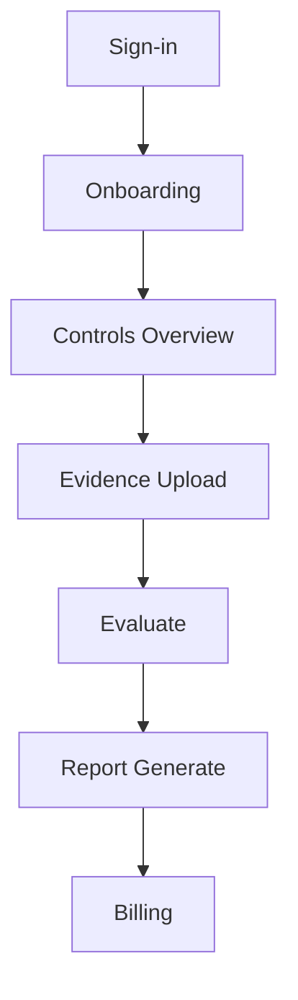
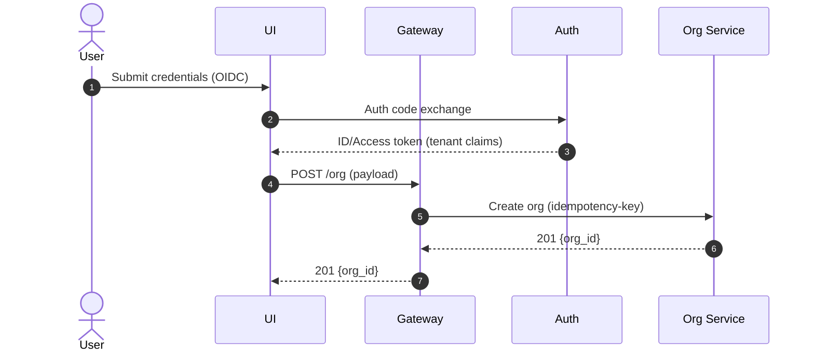
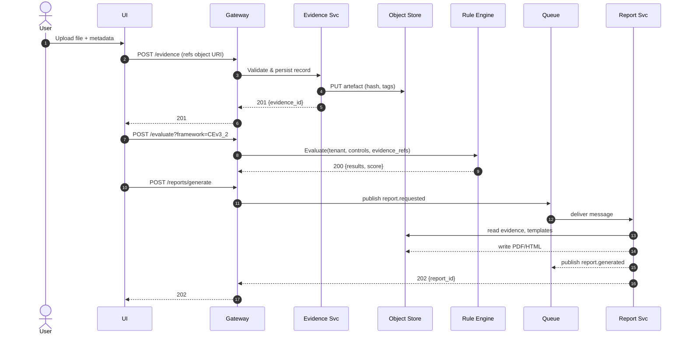
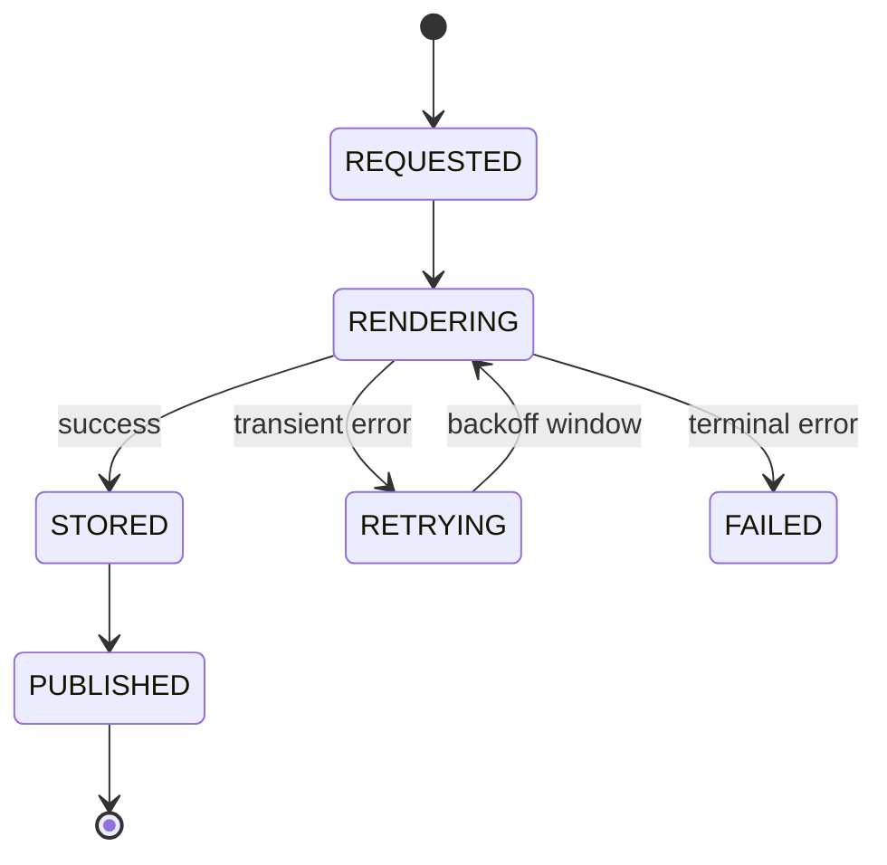
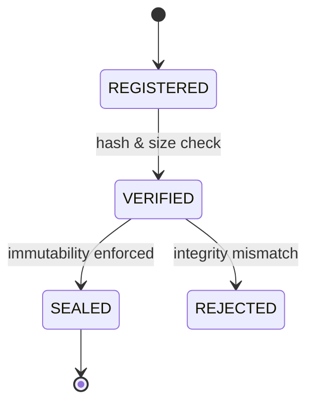

# System Architecture & Interface Specification (SAIS)

## 1. Purpose and Scope

This document defines the architectural intent and boundaries for Transcrypt’s v1 / MVP implementation. It exists to specify, at a system level, what will be built, how components relate, and which interfaces are exposed. It inherits its direction exclusively from the Product Requirements Document (`v0.3.0-prd-complete`) and does not override or extend that specification.

The SAIS covers only the MVP scope defined in the PRD, including the essential feature set, minimum architectural components, and mandatory interfaces required for a functioning release. Any feature, integration, or behavioural pattern not explicitly included in the PRD’s MVP cut is out of scope for this document.

Document ownership sits with the engineering function. Changes follow the same version-control process as the PRD: tracked in Git, reviewed on change, and updated only when underlying implementation or requirements shift.

### 1.1 Document Intent

This specification converts the Transcrypt PRD (`v0.3.0-prd-complete`) into concrete, implementable architectural artefacts. It defines how the product’s stated requirements manifest as system components, boundaries, interfaces, and data structures. For the MVP release, this document serves as the authoritative reference for runtime behaviour, integration points, and technical constraints. No component, interface, or behaviour outside what is expressed here is considered part of the v1 system.

### 1.2 Relationship to PRD

This document maintains direct traceability to the PRD by referencing the specific PRD sections from which each architectural element originates. Every functional, non-functional, and security requirement described in the PRD must map to one or more technical elements defined here. No architectural element in this specification exists without an originating PRD section, and no PRD requirement is considered satisfied unless it appears here in an implementable form.

### 1.3 Version and Control Mechanism

This document is versioned using the same Git-based workflow defined for the PRD. All changes are tracked in the Transcrypt repository, with updates made only through reviewed commits. The SAIS uses a dedicated semantic tag format:
**`v1.x.y-sais`**,
where `x` increments for architectural changes affecting component boundaries or interfaces, and `y` increments for clarifications that do not alter behaviour.

Branches follow the repository’s existing convention (e.g. `codex/<task>`, `feature/<component>`), and SAIS updates must accompany or follow the corresponding PRD commits. Milestone tags align with PRD releases so that a given PRD version and SAIS version can be resolved unambiguously. CI/CD promotion gates reference these tags to ensure that only architectures backed by a corresponding SAIS version progress to implementation or release.

### 1.4 Ownership and Maintenance

The Product Lead is the accountable owner of this document and is responsible for ensuring that it reflects the current architectural direction defined in the PRD. Day-to-day maintenance is jointly handled by the Engineering Lead and the Security Lead, who update the specification when components, interfaces, or constraints change.

This document follows the same review cadence as the PRD: quarterly, or immediately upon any major release that alters platform behaviour or boundaries. Structural changes require explicit approval from all three roles — Product Lead, Engineering Lead, and Security Lead — and updates must be committed through the standard Git review workflow before becoming authoritative.

### 1.5 Scope of Coverage

This specification covers all components required for the MVP release as defined in the PRD. In scope are: the public Marketing and Blog site, the Marketing↔Essentials handshake, the Transcrypt Essentials App, deterministic rule evaluation, evidence intake and management, report generation, billing, and all onboarding flows described in the PRD.

Explicitly out of scope for this version are: partner and integrator APIs, the NIS2 control pack, advanced connectors, assisted-tier collaboration features, and any enterprise or post-MVP extensibility defined in later PRD phases.

### 1.6 Intended Audience

This document is written for the people directly involved in building and maintaining Transcrypt. Primarily, it serves as an implementation reference for development work and as a precise description of the system’s boundaries, behaviours, and interfaces. It also provides a clear architectural baseline for anyone contributing to product direction or verifying security and compliance aspects of the platform. If external collaborators or integrators become involved in future phases, they may use this document solely to understand the public API surface and integration constraints.

### 1.7 Document Change Log Linkage

All updates to this document are tracked directly within the SAIS change log at the end of the file, and in Git commit history. Changes may optionally reference the associated PRD section number when the edit reflects a modification or clarification to the product definition. No additional appendix structure or external identifier system is used.

## 2. System Overview

This section describes the system at a high level, reflecting the architectural intent defined in the PRD. Transcrypt consists of two user-facing surfaces: the public Marketing & Blog site, which operates as a Next.js runtime providing SSR/ISR-rendered content, routing, telemetry, and the Marketing→Essentials onboarding and identity handshake; and the authenticated Essentials App, which performs compliance evaluation and reporting. Both surfaces consume the same public API, and both form part of the MVP delivery defined in the PRD.

The platform is a multi-tenant, deterministic compliance automation system built around three core ideas: automation-first workflows, invisible infrastructure, and strict auditability. All internal behaviour follows the deterministic, measurement-led model described in the PRD, and no internal complexity is exposed to the user.

The system is divided into clear architectural layers that separate request handling, rule evaluation, evidence processing, report generation, and data storage. Runtime behaviour is simple by design: every action produces a predictable outcome, every state change is auditable, and users see only clear, binary outcomes (“compliant” / “not yet compliant”).

The MVP boundary defined in the PRD restricts the platform to the Essentials feature set, CE v3.2 rule evaluation, evidence intake, report generation, billing, the public Marketing/Blog runtime, and the associated onboarding integrations.

---

### 2.1 System Philosophy

Transcrypt’s architecture is grounded in the principles set out in the PRD: automation-first operation, deterministic behaviour, and invisibly managed infrastructure. The system will minimise user exposure to internal mechanics — orchestration, rule evaluation, evidence binding, and rendering — and will surface only the outcomes that matter: whether a control is satisfied, why, and how it can be improved. Internal complexity, including routing, SSR/ISR rendering, identity flow, evidence processing, and rule execution, will remain hidden behind predictable interfaces.

The engineering mindset is measurement-led: every significant action will emit audit-ready traces, deterministic hashes, or reproducible artefacts. Identical inputs will always yield identical results, and every outcome will be explainable through visible links to evidence, rule logic, or system state. This ensures that users can trust findings without having to trust the internal machinery.

Every component — from the Marketing/Blog runtime to the Essentials App, API boundary, evaluation workflow, evidence pipeline, and report generator — will serve three goals: determinism, auditability, and user trust. The system will avoid ambiguity, implicit behaviour, or “magic” at runtime. Instead, it will prioritise clarity, traceability, and predictable transitions between states, making the platform feel calm, competent, and reliable whether the user is reading content, completing intake, uploading evidence, or generating a report.

### 2.2 Major Architectural Layers

Transcrypt’s architecture is organised into a small number of clear layers, each reflecting the structural boundaries defined in the PRD. These layers separate ingress, evaluation, evidence handling, rendering, storage, and observability so that each can evolve independently while maintaining deterministic behaviour and tenant isolation.

#### **Edge Layer (Marketing Runtime, Essentials UI, API Gateway)**

This layer will receive all user traffic across the Marketing/Blog site and the Essentials App. It will handle SSR/ISR rendering, session establishment, identity transitions, and API request termination. The gateway will shape incoming requests, attach tenant context, enforce authentication, and apply rate limits and basic policy guards. No business logic or evaluation occurs here; the edge simply provides controlled and auditable entry into the system.

#### **Control and Rule Layer**

This layer will evaluate tenant input against Cyber Essentials v3.2 controls using the deterministic rule engine defined in the PRD. It will consume OrgProfile and Evidence metadata, execute rule tests, and emit findings with provenance. The layer is stateless and versioned, ensuring identical inputs always map to identical outputs. It will be replaceable as future rulepacks or frameworks are introduced.

#### **Data and Evidence Layer**

This layer will persist structured profile and evaluation data in Postgres and will store evidence artefacts in object storage with hashing, metadata, and immutability guarantees. Audit trails, state transitions, and integrity events will be recorded here. Retention, encryption, and isolation follow the PRD’s data-handling constraints, and no component will bypass the layer or share cross-tenant data paths.

#### **Services and Integration Layer**

This layer will interface with external systems required for MVP operation: identity providers (OIDC through next-auth), Stripe billing, email delivery, and basic connector scaffolding (with out-of-scope connectors stubbed). All integrations will be explicitly versioned and accessed through well-defined, replaceable interfaces.

#### **Observability and Automation Layer**

This layer will collect logs, traces, and metrics from all surfaces — including the Marketing/Blog runtime — and will enforce SLO signals and deployment gates. It provides the measurement backbone for deterministic behaviour, supports CI/CD promotion decisions, and ensures that failures, slow paths, or unexpected behaviours are visible and auditable.

---

Each layer is designed to be independently testable, independently deployable, and replaceable without altering the surrounding system, ensuring architectural stability as the product evolves.

### 2.3 Runtime Context

At runtime, the system operates as a multi-tenant SaaS platform in which all user traffic enters through stateless compute surfaces — the Marketing/Blog runtime, the Essentials App, and the API Gateway. Each request is routed to the appropriate downstream service, with tenant context attached at the edge to enforce isolation and traceability.

All compute nodes run without tenant-specific state. Rendering (SSR/ISR), rule evaluation, evidence processing, and report assembly occur in ephemeral execution environments, ensuring that no local data persists beyond the lifetime of the request. Any artefact produced — findings, traces, hashes, profiles, or reports — is stored only in the platform’s canonical datastores defined in the PRD.

Tenant isolation is enforced consistently across the stack. The Postgres datastore scopes all records by tenant, object storage segregates artefacts under per-tenant prefixes, and audit logs record state transitions with monotonic timestamps and request identifiers. No cross-tenant queries or shared artefact paths exist at runtime.

The system relies on a minimal set of external services during operation: identity providers through OIDC (Entra, Okta, Google), Stripe for billing, and an S3-compatible object store for evidence artefacts and report binaries. Email delivery supports onboarding and notifications. Every external dependency is accessed through a tightly defined interface so it can be replaced without impacting internal behaviour.

Report generation is synchronous within the deterministic pipeline: rule evaluation completes, findings are assembled, and the report is produced as a single, traceable operation. All steps emit audit-relevant metadata to ensure outcomes can be explained or reproduced later.

### 2.4 Guiding Design Principles

Transcrypt’s design principles are not abstract slogans; they are behaviours demanded explicitly throughout the PRD. They apply equally to the Essentials App, the API boundary, the internal evaluation workflow, and the Marketing/Blog runtime, which the PRD defines as a compute-bearing Next.js surface participating in routing, identity, telemetry, and content delivery.

**Clarity Over Complexity**
The PRD makes it clear that users must always understand what a screen, state, or result means. Every surface — including the Marketing/Blog site — must present information in a calm, direct, and unfussy manner. No hidden states, no ambiguity, and no “figure it out yourself” UI. Explanations, next steps, and reasons are always visible.

**Deterministic Outcomes**
The PRD insists that identical inputs must lead to identical outputs. This principle governs rule evaluation, evidence binding, report creation, and even UI behaviour. Nothing in the system may behave probabilistically without being paired with a deterministic control path. Every outcome must be reproducible and traceable.

**Explainable State**
Every result in the PRD — whether a finding, a partial, a pass, or a failure — must be backed by visible reasoning. Users must be able to open any result and see which rule triggered it, which input influenced it, which evidence was bound to it, and which version of the rulepack produced it. Nothing is allowed to “just happen.”

**Security Everywhere, Not in Pockets**
Isolation, least privilege, encryption, and mutual authentication are defined in the PRD as baseline behaviours, not feature flags. Evidence artefacts are hashed, stored immutably, and never shared across tenants. The Marketing/Blog runtime follows the same rules: session handling, identity transitions, telemetry, and routing must all honour the same security posture as the authenticated app.

**Unified Behaviour Across All Surfaces**
Your PRD explicitly requires that the Marketing/Blog runtime follow the same interface rules, tone, and behavioural constraints as the Essentials App. This includes SSR/ISR rendering, routing decisions, identity handoff, and telemetry. Surfaces may differ in purpose, but never in architectural discipline.

**Auditable From End to End**
The PRD defines structured logs, traces, request IDs, tenant IDs, evidence hashes, provenance markers, and state transitions as required outputs. Nothing in the system — including content rendering, routing events, identity handoff, evaluation, evidence upload, or report creation — may occur without leaving an audit-consumable trail.

**Safe Failure**
The PRD repeatedly rejects ambiguity, silent fallbacks, or implicit decisions. When something goes wrong — a rule fails, evidence is invalid, an identity transition breaks, or a rendering path collapses — the system must fail in a visible and controlled way. No half-states, no lost work, and no misleading success signals.

### 2.5 MVP Boundary of Delivery

The MVP is precisely defined in the PRD as the smallest complete loop that allows a tenant to sign up, provide basic organisational details and evidence, run an evaluation against a limited Cyber Essentials v3.2 rulepack, and receive a branded report. The boundary is narrow on purpose: it delivers value, proves feasibility, and avoids premature expansion into later-phase features.

The MVP includes:

**Marketing/Blog Runtime (Next.js)**
The public-facing marketing and blog site, operating as a compute-bearing Next.js surface with SSR/ISR. It acts as the platform entry point, delivers content, and handles the Marketing → Essentials identity and routing handoff.

**Essentials Application**
The authenticated app that allows a tenant to create an Org Profile, provide evidence, run evaluations, view findings, and download a report. Intake fields, validation rules, evidence binding, and the user experience for evaluation are all scoped tightly to Cyber Essentials v3.2.

**Deterministic Evaluation Loop**
The rule engine defined in the PRD, running the 15 Cyber Essentials controls selected for v1. Org Profile and Evidence data are processed through a deterministic pipeline that produces findings with provenance and clear rationale.

**Evidence Handling**
File uploads, hashing, metadata capture, storage in object storage under tenant isolation, and binding of artefacts to findings. Assertions and system pulls are supported only to the extent defined in the MVP.

**Report Generation**
HTML/PDF report creation with citations, evidence references, and hash footers. The evaluation and report are produced synchronously as a single deterministic operation.

**Billing (Stripe)**
Subscription and checkout through Stripe. The MVP supports basic subscription creation, renewal, and cancellation. No multi-plan structure, discounts, or enterprise options.

The MVP excludes:

**Partner / Integrator APIs**
No collaboration surfaces, auditor flows, or shared workspaces. All multi-party features are deferred.

**NIS2 and Additional Frameworks**
Only Cyber Essentials v3.2 is supported. No cross-framework evaluation, mapping, or rulepacks.

**Advanced Connectors**
Only Entra or Okta identity pulls are considered for the MVP, and even these may be stubbed or limited. Backup systems, EDR, and cloud posture scanners are explicitly out of scope.

**Assisted Tier or Collaboration Tools**
No shared dashboards, comment threads, review queues, or advisor interactions. The user journey is strictly self-serve.

This boundary ensures the MVP remains feasible, coherent, and aligned with the PRD’s requirement to ship a complete, deterministic, end-to-end loop before any expansion into multi-framework or collaborative functionality.

### 2.6 External Dependencies and Integrations

The MVP interacts with a narrow set of external systems defined in the PRD. Each integration exists only to support a core user journey and is accessed through a tightly controlled interface to preserve determinism and prevent vendor-specific behaviour from leaking into the platform.

**Identity Providers (OIDC)**
Authentication for both the Marketing/Blog runtime and the Essentials App will be handled through standard OIDC flows. Supported providers in the MVP are Entra ID, Okta, and Google, or maybe Keycloak. These services supply primary authentication only; no synchronisation, SCIM provisioning, or directory management is part of this phase.

**Stripe (Billing)**
The MVP uses Stripe Checkout and the Stripe Customer Portal for subscription creation, renewal, and cancellation. Only a single plan is exposed at launch. Webhooks are used to reflect subscription state inside the platform. No enterprise billing features, usage metering, or multi-plan structures are included.

**S3-Compatible Object Storage**
Evidence artefacts, report binaries, and hashed objects will be stored in a tenant-isolated S3-compatible bucket. The PRD requires envelope encryption, immutability constraints, short-lived signed URLs, and strict separation between tenants. No computation occurs within storage; it functions as an integrity-preserving artefact store only.

**Email Delivery**
The platform will send transactional messages through a compliant mail provider for onboarding and follow-up communication. The PRD does not commit to a specific vendor. Email is not tied to core evaluation flow and must not block user progress.

**CDN and Runtime Hosting**
The Marketing/Blog site will run as a Next.js SSR/ISR runtime positioned in front of a CDN that provides caching, asset distribution, and edge routing. The PRD defines required behaviour—consistent content delivery, stable routing, and clean separation of authenticated and unauthenticated flows—but does not mandate a provider.

**Telemetry and Observability Endpoint**
All runtime surfaces emit structured logs and OpenTelemetry-style traces that capture gateway → evaluation → evidence → report flows. Tenant IDs, request IDs, version markers, and provenance hashes must appear in every event. No component is permitted to run without observability hooks.

#### **Failure Behaviour**

Fallback expectations derive directly from the PRD’s principles of determinism, explainability, and controlled degradation:

* **Identity provider failure:** Auth attempts must fail cleanly and visibly. No implicit fallback to another provider, no partial sessions.
* **Stripe failure:** Subscription state must remain consistent. Transient billing errors do not corrupt access or block evaluation.
* **Object storage failure:** Evidence uploads must fail atomically. No partial artefacts, no ambiguous integrity state.
* **Email delivery failure:** Email outages are logged but do not block intake, evaluation, or reporting.
* **Telemetry failure:** Loss of observability data is itself observable. The system continues to operate but must note the failure locally.

---

**TODO-SAIS-EXT-01:** Define explicit runtime limits for email, IdP, and Stripe retries (counts, backoff rules, and log thresholds).

### 2.7 Deployment Topography Summary

The MVP is deployed as a small, deterministic collection of services whose boundaries mirror the PRD’s requirement for simplicity, explainability, and environment parity. No background workers, message queues, or orchestration frameworks form part of the MVP; only the minimum viable set of services required to run the evaluation–report loop.

**Marketing/Blog Runtime (Next.js SSR/ISR)**
The public-facing site runs as a compute-bearing Next.js service behind a CDN. It performs SSR/ISR rendering, Marketing→Essentials identity transitions, content routing, and telemetry emission. It stores no tenant data and interacts with the system exclusively via the public API.

**Essentials App (Next.js Runtime)**
The authenticated application is served as a separate Next.js runtime. All user actions—intake, evidence upload, evaluation, reporting, billing—flow through the API Gateway. The Essentials app holds no persistent data.

**API Gateway (FastAPI/Go; language-agnostic in PRD)**
This is the single ingress point for all authenticated and unauthenticated API calls. Responsibilities include OIDC validation, request shaping, rate limiting (defined elsewhere in SAIS), audit header injection, version marking, and routing to internal services.

**Rule Evaluation Service**
A stateless service responsible for evaluating an OrgProfile and Evidence bundle against a signed RulePack. It performs deterministic checks and may invoke the runtime LLM inference path where allowed. All processing uses ephemeral memory and produces deterministic findings.

**Evidence & Artefact Storage (S3-Compatible)**
All evidence artefacts, report binaries, and hashed objects are stored in an S3-compatible bucket. The PRD requires envelope encryption, immutability controls, short-lived signed URLs, and strict tenant prefix isolation. Storage performs no compute; its role is integrity and retention.

**Primary Database (PostgreSQL ≥ v15)**
Stores tenant metadata, OrgProfile records, evaluation histories, findings, audit events, and Stripe linkage metadata. Backups must meet the PRD’s encryption, retention, and recovery objectives.

---

### **Environments**

Transcrypt defines three runtime environments:

* **dev** — developer iteration and ephemeral preview environments.
* **staging** — production-like environment for release validation.
* **prod** — tenant-facing environment.

The PRD requires that all environments remain **configuration-identical**, differing only in:

* secrets
* environment URLs
* horizontal/vertical scaling

No differences in behaviour, routing, dependency versions, or infrastructure topology are permitted, ensuring deterministic runtime behaviour across the deployment pipeline.

---

### **TODO-SAIS-TOPO-02 (PRD Boundary Checkpoint)**

Two product-level behaviours, implied by user-facing expectations but not yet declared in the PRD, must be defined before the SAIS can lock final deployment behaviour:

1. **Evidence Upload Constraints (Product Behaviour)**
   The PRD must eventually specify user-facing limits: allowed MIME types, maximum file size, concurrent uploads, number of artefacts per control, and whether compressed bundles (ZIP) are permitted. These constraints directly affect user experience, support load, and compliance expectations, and therefore belong in the PRD rather than only in system architecture.

2. **Session Semantics (User Experience)**
   Session lifetime, refresh behaviour, handoff state between Marketing↔Essentials, and whether admin actions require step-up MFA must be declared as product truths. These behaviours define how the user experiences continuity, trust, and flow across the platform. Once PRD statements exist, the SAIS will encode the exact architectural implementation.

These TODOs do **not** block SAIS progress but must be resolved before the early implementation phase begins, to prevent divergent assumptions across gateways, runtimes, and client behaviour.

## 3. Component Architecture

This section defines the complete set of components that make up the Transcrypt MVP. It describes each subsystem in terms of its boundary, purpose, and dependencies, and classifies every element as internal, external, or partner-facing. The scope reflects the PRD: a deterministic, multi-tenant compliance platform composed of two Next.js runtimes, a single API gateway, a small set of stateless evaluation and reporting services, and a limited number of external integrations.

The architecture treats every component as a replaceable unit with a single responsibility. Internal components handle intake, evidence, rule evaluation, reporting, billing state, and auditability. External components provide identity, billing, object storage, email delivery, and CDN hosting for the marketing runtime. Partner-facing surfaces are explicitly out of scope for the MVP and appear only as placeholders. Component boundaries are defined so that no service shares responsibilities, no implicit communication paths exist, and all data exchange happens through typed, versioned contracts.

This section establishes the authoritative inventory and classification of all services, runtimes, SDKs, and integrations, forming the basis for the interfaces, contracts, and resilience patterns described later in the SAIS.

---

### 3.1 Component Map and Classification

The MVP consists of a small, tightly scoped set of components grouped under the platform’s major architectural layers. Each component is classified as **internal**, **external**, or **partner-facing** (none of which are active in the MVP). Only components explicitly described in the PRD appear here.

### **3.1.1 Component Inventory Table**

| Component                                                 | Layer              | Classification | Purpose / Boundary                                                                                                            |
| --------------------------------------------------------- | ------------------ | -------------- | ----------------------------------------------------------------------------------------------------------------------------- |
| **Marketing/Blog Runtime (Next.js SSR/ISR)**              | Edge               | Internal       | Public-facing site; marketing content, onboarding paths, Marketing→Essentials identity handoff. No tenant data stored.        |
| **Essentials App Runtime (Next.js)**                      | Edge               | Internal       | Authenticated tenant UI for intake, evidence upload, evaluation requests, reports, and billing.                               |
| **API Gateway & Policy Enforcer**                         | Edge / Integration | Internal       | Single ingress for all API calls; validates OIDC, attaches audit metadata, enforces rate limits, routes to internal services. |
| **Rule Evaluation Service (Deterministic + Runtime LLM)** | Control / Rule     | Internal       | Evaluates OrgProfile + Evidence against a signed RulePack; produces Findings. Stateless; ephemeral execution.                 |
| **Report Service**                                        | Control            | Internal       | Assembles findings, metadata, and evidence links into branded HTML/PDF reports. Stateless.                                    |
| **Evidence Service**                                      | Data / Evidence    | Internal       | Handles evidence upload, hashing, metadata extraction, and storage into tenant-isolated S3-compatible bucket.                 |
| **Primary Database (PostgreSQL ≥15)**                     | Data               | Internal       | Stores tenant metadata, org profiles, evaluations, findings, audit events, and Stripe subscription state.                     |
| **Object Store (S3-compatible)**                          | Data / Evidence    | External       | Stores all evidence artefacts, reports, and hashed objects using tenant prefixes and envelope encryption.                     |
| **OIDC Identity Providers (Entra ID / Okta / Google)**    | Integration        | External       | Provide authentication for Marketing and Essentials surfaces via OIDC. No SCIM or enterprise features in MVP.                 |
| **Stripe Billing**                                        | Integration        | External       | Subscription creation, renewal, cancellation, and webhook events for billing state.                                           |
| **Email Delivery Provider**                               | Integration        | External       | Sends onboarding and follow-up notifications; not tied to core control evaluation flow.                                       |
| **CDN / Edge Delivery Layer**                             | Edge               | External       | Provides caching, static asset delivery, and consistent routing for the Marketing/Blog runtime.                               |
| **Telemetry / Observability Endpoint (OTel Compatible)**  | Observability      | Internal       | Receives structured logs, request traces, and metrics from all components. (Vendor-agnostic in PRD.)                          |
| **Partner / Auditor API Surfaces**                        | Integration        | Partner-Facing | Stub only; no partner-facing functionality in the MVP. Reserved for post-MVP phases (1.5 / 2.0).                              |

---

### **3.1.2 Classification Summary**

* **Internal components** form the backbone of the MVP: both Next.js runtimes, API gateway, evaluation, reporting, evidence services, database, and observability.
* **External components** are identity, billing, object storage, CDN, and email delivery — all accessed through narrow, replaceable interfaces as required by the PRD.
* **Partner-facing components** exist only as stubs; the MVP contains no external API surfaces for MSPs, auditors, or integrators.

This classification reflects the MVP’s minimal, deterministic architecture: a very small set of services with clear boundaries, zero hidden compute paths, and no cross-service ambiguity.

### 3.2 Component Responsibilities

Each component in the Transcrypt MVP has one clearly defined responsibility. All components honour typed, versioned contracts. Ownership for every internal module sits with the founder-engineer; external services adhere to their vendor specifications.

---

#### **Marketing/Blog Runtime (Next.js SSR/ISR)**

**Purpose:** Public-facing site delivering marketing content, onboarding funnels, and the Marketing → Essentials identity transition.
**Contracts honoured:** OIDC redirect URLs; API Gateway public routes; telemetry emission.

**Inputs → Outputs → Side-effects**

* **Inputs:** HTTP GET requests; OIDC session cookie (if present).
* **Outputs:** Rendered SSR/ISR pages; calls to API Gateway; OIDC callback redirects.
* **Side-effects:** Emits telemetry; caches pages at CDN; no persistent data.

---

#### **Essentials App Runtime (Next.js)**

**Purpose:** Authenticated tenant UI for intake, evidence uploads, evaluations, reports, and billing.
**Contracts honoured:** All public API Gateway contracts; evidence upload schema; report generation schema.

**Inputs → Outputs → Side-effects**

* **Inputs:** Authenticated HTTP requests; user-provided profiles and evidence.
* **Outputs:** API calls for evaluation, uploads, billing; rendered application pages.
* **Side-effects:** Emits telemetry; stores no data locally.

---

#### **API Gateway & Policy Enforcer**

**Purpose:** Single ingress; validates identity; enforces rate limits; shapes requests; injects audit metadata; routes to internal services.
**Contracts honoured:** OIDC token validation; structured log/trace contracts; versioned internal API contracts.

**Inputs → Outputs → Side-effects**

* **Inputs:** All inbound HTTP requests (public + authenticated).
* **Outputs:** Routed internal requests; denial responses for failed auth; enriched logs/traces.
* **Side-effects:** Attaches tenant ID, request ID, version stamps; logs all activity.

---

#### **Rule Evaluation Service**

**Purpose:** Evaluate OrgProfile + Evidence using a signed RulePack; produce deterministic Findings; optionally call runtime LLM path.
**Contracts honoured:** RulePack schema; OrgProfile schema; Evidence schema; Finding schema; provenance-hash rules.

**Inputs → Outputs → Side-effects**

* **Inputs:** `POST /evaluate` payload: OrgProfile, Evidence refs, RulePack ID, version metadata.
* **Outputs:** Findings JSON with trace IDs and provenance.
* **Side-effects:** Emits audit events; no data persisted.

---

#### **Report Service**

**Purpose:** Assemble findings, metadata, and evidence citations into branded HTML/PDF reports.
**Contracts honoured:** Findings schema; Report schema; object storage contract for upload.

**Inputs → Outputs → Side-effects**

* **Inputs:** Findings JSON; OrgProfile; evidence references; template versions.
* **Outputs:** HTML/PDF report blob; report metadata.
* **Side-effects:** Uploads report to object storage; emits telemetry.

---

#### **Evidence Service**

**Purpose:** Accept, validate, hash, and store evidence artefacts; bind them to findings.
**Contracts honoured:** Evidence upload schema; integrity hashing rules; S3-compatible API contract.

**Inputs → Outputs → Side-effects**

* **Inputs:** File streams; metadata; tenant ID; control binding information.
* **Outputs:** Stored object with deterministic hash; evidence metadata JSON.
* **Side-effects:** Writes to object storage; emits audit log for each stored artefact.

---

#### **Primary Database (PostgreSQL ≥15)**

**Purpose:** Persist tenant metadata, OrgProfiles, Findings summaries, audit trails, and Stripe subscription state.
**Contracts honoured:** Internal DB schema; migration/versioning protocol.

**Inputs → Outputs → Side-effects**

* **Inputs:** Writes from API Gateway, Evaluation Service, and billing handlers.
* **Outputs:** Query results to internal services.
* **Side-effects:** Encrypted backups; retention policy enforcement.

---

#### **Object Store (S3-Compatible)**

**Purpose:** Store evidence artefacts, reports, and hashed objects using strict tenant isolation.
**Contracts honoured:** S3 API; encryption envelope rules; signed URL contract.

**Inputs → Outputs → Side-effects**

* **Inputs:** Object PUT requests (evidence, reports).
* **Outputs:** Signed URLs; object GET requests.
* **Side-effects:** Maintains immutability and encryption as defined; no internal compute.

---

#### **OIDC Identity Providers (Entra / Okta / Google)**

**Purpose:** Provide authentication flows for Marketing and Essentials surfaces.
**Contracts honoured:** OIDC discovery, token issuance, JWKS.

**Inputs → Outputs → Side-effects**

* **Inputs:** Auth requests; redirect URIs.
* **Outputs:** ID tokens; access tokens; refresh behaviour (provider-specific).
* **Side-effects:** None inside Transcrypt; failure handled at API Gateway/UI layers.

---

#### **Stripe Billing**

**Purpose:** Subscription creation, renewal, cancellation, and subscription-state signalling via webhook.
**Contracts honoured:** Stripe Checkout, Billing Portal, webhook schema.

**Inputs → Outputs → Side-effects**

* **Inputs:** Checkout events; webhook events.
* **Outputs:** Subscription state updates in DB; billing redirects.
* **Side-effects:** Emits signed webhooks; no internal state.

---

#### **Email Delivery Provider**

**Purpose:** Send transactional emails (onboarding, nudges).
**Contracts honoured:** SMTP or vendor API; privacy/minimal-data rule.

**Inputs → Outputs → Side-effects**

* **Inputs:** Email payload with template, address, metadata.
* **Outputs:** Delivery attempt; provider response.
* **Side-effects:** Logs success/failure; does not block core workflows.

---

#### **CDN / Edge Delivery Layer**

**Purpose:** Provide caching, asset delivery, and stable routing for Marketing/Blog runtime.
**Contracts honoured:** Standard CDN cache rules; SSR/ISR invalidation rules defined later in SAIS.

**Inputs → Outputs → Side-effects**

* **Inputs:** GET requests for marketing pages and assets.
* **Outputs:** Cached responses; fallback to origin SSR/ISR rendering if needed.
* **Side-effects:** Cache population; telemetry for edge hits/misses.

---

#### **Telemetry / Observability Endpoint (OTel-Compatible)**

**Purpose:** Collect logs, traces, metrics from all components.
**Contracts honoured:** OpenTelemetry standards; structured-log schema.

**Inputs → Outputs → Side-effects**

* **Inputs:** Logs, spans, metrics from all internal services.
* **Outputs:** Stored/forwarded telemetry data.
* **Side-effects:** If unreachable, failures logged locally as per SAIS requirements.

### 3.3 Internal Services

The Transcrypt MVP consists of a small set of internal services that communicate exclusively through typed HTTP/JSON interfaces. All components are stateless except for the database. Each service exposes only the minimum endpoints required for the evaluation→report pipeline.

No internal service communicates implicitly.
No service shares responsibility.
Every call is authenticated, versioned, logged, and trace-linked.

---

#### **3.3.1 API Gateway & Policy Enforcer**

**Purpose**
Single ingress for all internal and external API calls.
Auth validation, request shaping, routing, and audit-header injection.

**Ports**

* `443/tcp` (public HTTPS ingress)
* `internal-http` (cluster-only routing to internal services; number is infra-dependent)

**Dependencies**

* OIDC providers (Entra / Okta / Google) for token validation
* PostgreSQL (for tenant/session metadata)
* Telemetry endpoint
* Stripe (webhooks)
* Internal services: Evaluation, Evidence, Report

**Message Formats**

* JSON over HTTPS
* All inbound requests require `X-Request-ID`
* All responses include `trace_id` and `version` fields
* Authentication via Bearer token (OIDC ID token or session token)

**Error Boundaries**

* Rejects invalid/missing tokens (401)
* Rejects requests missing required fields (422)
* On internal service errors, surfaces deterministic `Problem+JSON` errors
* Never forwards partial or unvalidated requests to downstream services

---

#### **3.3.2 Rule Evaluation Service (Deterministic + Runtime LLM)**

**Purpose**
Execute deterministic checks against the signed RulePack and, where enabled, call runtime LLM inference for interpretive checks.
Produces the single source of truth for Findings.

**Ports**

* `internal-eval` (HTTPS or mTLS internal channel)

**Dependencies**

* RulePack store (read-only)
* Telemetry endpoint
* API Gateway (caller)
* Optional: LLM runtime (inference only, no training)

**Message Formats**
**Input (JSON):**

```json
{
  "org_profile": {...},
  "evidence": [...],
  "rulepack_id": "RP-2024-CE-v1",
  "version": "1.0.0",
  "options": { "use_ai": false }
}
```

**Output (JSON):**

```json
{
  "findings": [...],
  "trace_id": "abc-123",
  "rulepack_version": "1.0.0"
}
```

**Error Boundaries**

* Rejects malformed OrgProfile/Evidence schemas
* Rejects unsigned or unverified RulePack versions
* Fails closed on LLM inference errors (AI is optional)
* No internal state kept; failure cannot corrupt system state

---

#### **3.3.3 Evidence Service**

**Purpose**
Accept, validate, hash, and store evidence artefacts.
Bind artefacts to controls, maintain deterministic integrity metadata.

**Ports**

* `internal-evidence` (HTTPS)

**Dependencies**

* S3-compatible object store
* Telemetry endpoint
* API Gateway (caller)

**Message Formats**

* File upload: multipart form-data
* Metadata: JSON (control_id, filename, mime_type, hash)
* Responses include deterministic SHA-256 hash and storage path

**Error Boundaries**

* Rejects files that fail integrity check
* Rejects artefacts missing control binding
* Fails atomically: no partial writes
* Logs failed uploads but never blocks evaluation flow

---

#### **3.3.4 Report Service**

**Purpose**
Assemble Findings → Metadata → Report Template → Rendered HTML/PDF.
Upload report to object storage.

**Ports**

* `internal-report` (HTTPS)

**Dependencies**

* Object store
* Telemetry endpoint
* Evaluation Service (input provider)
* API Gateway (caller)

**Message Formats**
**Input:**

```json
{
  "findings": [...],
  "org_profile": {...},
  "evidence_map": {...},
  "template_version": "1.0.0"
}
```

**Output:**

* PDF/HTML blob
* JSON metadata with report_id, hash, storage path

**Error Boundaries**

* Rejects missing or malformed Findings
* Rejects template-version mismatches
* Fails cleanly on PDF render errors with no partial artefacts

---

#### **3.3.5 Auth Service / Identity Adapter**

*Note: This is not a standalone service in the MVP; the logic lives inside the API Gateway and the two Next.js runtimes. SAIS still treats it as a component for clarity.*

**Purpose**
Normalise OIDC interaction across supported providers; validate tokens; perform session shaping.

**Ports**

* None (embedded in API Gateway and the two runtimes)

**Dependencies**

* OIDC discovery endpoints
* JWKS keys
* API Gateway (primary consumer)
* Telemetry endpoint

**Message Formats**

* Standard OIDC ID token
* JWT with required claims: `sub`, `email`, `iss`, `exp`

**Error Boundaries**

* Rejects expired, unsigned, or untrusted tokens
* Rejects mismatched issuer/audience
* Does not degrade silently; failure always surfaces to user-facing layer

---

#### **3.3.6 Internal Services Summary**

| Service            | Source of Truth   | Stateless | Stores Data | Failure Mode                         |
| ------------------ | ----------------- | --------- | ----------- | ------------------------------------ |
| API Gateway        | Routing + Auth    | Yes       | No          | Reject + Problem+JSON                |
| Evaluation Service | Findings          | Yes       | No          | Fail closed, no partial findings     |
| Evidence Service   | Evidence Metadata | Yes       | No          | Atomic failure, no partial artefacts |
| Report Service     | Report output     | Yes       | No          | Clean failure, no partial artefacts  |
| Auth Adapter       | OIDC              | Yes       | No          | Visible login failure                |

---

# ✅ **TODO 1 — Evidence Upload Format & Limits (Product-Level Requirement)**

**Where it lands in 3.3:** Evidence Service

**Why it’s needed:**
Your PRD defines hashing, immutability, artefact binding, and S3 prefixes — but *not* evidence constraints such as file types, max size, or concurrency.

This directly affects:

* behaviour of the **Evidence Service**
* what the API Gateway is allowed to accept
* user experience
* report consistency
* security posture

Without this, 3.3 cannot fully define:

* allowed MIME types
* rejection rules
* side-effects
* maximum upload size
* edge-case handling (e.g., ZIPs, large archives)

**TODO-SAIS-EVID-01:**
“Specify allowable evidence file types, maximum file size, and whether multi-file bundles (ZIP) are supported. These are product-level constraints missing from the PRD and required before finalising Evidence Service contracts.”

---

# ✅ **TODO 2 — Session Semantics (Product-Level Requirement)**

**Where it lands in 3.3:** API Gateway + Auth Adapter

**Why it’s needed:**
The PRD talks extensively about trust, predictability, explainability, and frictionless onboarding, but it *never* states:

* session lifetime
* refresh-token strategy
* whether users stay logged in overnight
* whether admin actions need step-up MFA
* whether Marketing pages show authenticated state
* how the Marketing↔Essentials identity handoff persists

This isn’t “implementation detail” — it’s **user-facing behaviour**.

It governs everything from:

* user frustration
* onboarding drop-off
* support load
* perceived stability
* compliance traceability
* how the API Gateway handles tokens

Without a product-level decision, the SAIS can’t finalise:

* token expiry rules
* session-refresh behaviour
* what happens mid-flow
* handoff behaviour across surfaces

**TODO-SAIS-AUTH-02:**
“Define session lifetime, refresh behaviour, cross-surface session visibility, and MFA escalation requirements. These are product truths missing from the PRD and required to close the API Gateway + Auth Adapter behaviour model.”


### 3.4 External Integrations

The MVP interacts with a minimal set of external systems. Each integration exists solely to support identity, billing, artefact storage, email delivery, and CDN-backed rendering of the Marketing/Blog runtime. All integrations are accessed through narrow, replaceable interfaces to preserve determinism and isolate failure domains.

Each subsection describes the **connection method**, **authentication model**, and **fallback behaviour**, based strictly on PRD commitments.

---

#### **3.4.1 OIDC Identity Providers (Entra ID / Okta / Google)**

**Connection Method**

* Standard OIDC Authorization Code flow with PKCE.
* Redirects initiated from both the Marketing runtime and Essentials runtime.
* API Gateway validates tokens using provider JWKS endpoints.

**Authentication Model**

* Bearer tokens (JWT) carried in session cookie or header.
* Required claims: `sub`, `email`, `iss`, `exp`.
* No SCIM, directory sync, or enterprise policies in the MVP.

**Fallback Behaviour**

* If token cannot be validated → fail closed, visible to user.
* No implicit provider fallback.
* No partial or degraded sessions.

---

#### **3.4.2 Stripe (Billing)**

**Connection Method**

* HTTPS to Stripe Checkout and Billing Portal URLs.
* Stripe webhooks POST back into API Gateway for subscription state reflection.

**Authentication Model**

* Signed webhook events using Stripe’s signing secret.
* Checkout initiated with ephemeral session IDs.
* No custom products, coupons, or usage metering in the MVP.

**Fallback Behaviour**

* If webhook delivery fails → retry handled by Stripe.
* If Stripe API is unreachable:

  * No destructive action.
  * Tenant retains last known subscription state.
  * Evaluation and reporting remain available unless subscription marked inactive in DB.

---

#### **3.4.3 S3-Compatible Object Store**

**Connection Method**

* HTTPS using S3-compatible API (PUT/GET/HEAD).
* Evidence uploaded via signed URLs or direct gateway-mediated writes.
* Per-tenant prefixes enforce storage isolation.

**Authentication Model**

* Access keys stored in secrets manager.
* Envelope encryption applied at upload.
* Signed URLs time-boxed for downloads.

**Fallback Behaviour**

* If object write fails → atomic failure (no partial evidence).
* Evaluation does not proceed with missing artefacts.
* If object retrieval fails → report generation fails cleanly with clear diagnostic.

---

#### **3.4.4 Email Delivery Provider**

**Connection Method**

* SMTP or vendor HTTPS API (PRD does not specify a preference).
* Used for onboarding, nudges, and notification messages.

**Authentication Model**

* SMTP credentials or API token stored in secrets manager.
* No PII beyond email addresses and minimal metadata.

**Fallback Behaviour**

* Email failure never blocks evaluation or reporting.
* Failure logged and surfaced through telemetry.
* No retry logic mandated in PRD — left to provider or SAIS-layer policy.

---

#### **3.4.5 CDN / Edge Delivery Layer**

**Connection Method**

* CDN sits in front of the Marketing/Blog Next.js runtime.
* Handles asset delivery, SSR/ISR caching, and geographic routing.

**Authentication Model**

* No tenant-level authentication at CDN layer.
* Authenticated flows bypass cache and route to origin.

**Fallback Behaviour**

* Cache miss → origin render.
* Origin unavailable → CDN serves stale-if-available; if none, explicit failure.
* CDN never caches authenticated Essentials content.

---

#### **3.4.6 External Integrations Summary**

| Integration           | Type     | Purpose               | Auth Model                        | Fallback Behaviour                             |
| --------------------- | -------- | --------------------- | --------------------------------- | ---------------------------------------------- |
| Entra/Okta/Google     | External | User authentication   | OIDC + JWT                        | Fail closed; no fallback                       |
| Stripe                | External | Billing               | Stripe secrets + signed webhooks  | No destructive state; retry by Stripe          |
| S3-Compatible Storage | External | Artefact storage      | Access keys + envelope encryption | Atomic failure; clear diagnostics              |
| Email Provider        | External | Notification delivery | SMTP or API token                 | Logged failure; non-blocking                   |
| CDN/Edge Layer        | External | Content delivery      | None (public)                     | Stale-if-available; no caching of auth content |


### 3.5 Shared Libraries and SDKs

The MVP uses a small set of shared code assets to enforce consistency across all runtimes and internal services. These libraries exist to prevent drift in schemas, request formats, telemetry, and error handling. All shared libraries live inside the main repository and are versioned alongside the platform to guarantee compatibility.

#### **Schema Validation Package**

**Purpose:**
Single source of truth for JSON schema definitions used by the Essentials App, API Gateway, Evaluation Service, Report Service, and Evidence Service.

**Content:**

* OrgProfile schema
* Evidence metadata schema
* Finding schema
* Report request schema
* RulePack identity and signature rules

**Location:**
`/packages/schemas/`

**Versioning:**
Semantic versioning tied to platform releases.
Breaking schema changes increment the **major** version and require coordinated updates across all services.

---

#### **Telemetry Client**

**Purpose:**
Unified tracing, logging, and metrics wrapper used by all internal services and both Next.js runtimes.

**Content:**

* OpenTelemetry initialisation
* Trace propagation (gateway → evaluation → report)
* Structured logging format
* Request ID and tenant ID injectors
* Version stamping for releases

**Location:**
`/packages/telemetry/`

**Versioning:**
Minor version increments permitted as long as log fields remain backward-compatible.
Any removal or renaming of fields mandates a major version bump.

---

#### **API Client SDK**

**Purpose:**
Typed client used by the Essentials App and Marketing Runtime to call the API Gateway with consistent request/response shapes. Prevents divergence between UI behaviour and backend expectations.

**Content:**

* Typed functions for `/evaluate`, `/reports/generate`, `/evidence/upload`, billing endpoints, and basic tenant endpoints
* Error-wrapper returning `Problem+JSON` structures
* Built-in trace propagation and version tagging

**Location:**
`/packages/api-client/`

**Versioning:**
Locked to API contract versions defined in the SAIS.
No breaking changes allowed in patch or minor versions.

---

#### **Common Error and Problem Contracts**

**Purpose:**
Consistent `Problem+JSON` error formats across all internal and external surfaces.

**Content:**

* Standardised fields: `type`, `title`, `detail`, `status`, `trace_id`, `instance`
* Optional operational context: `rule_id`, `evidence_id`

**Location:**
`/packages/errors/`

**Versioning:**
Extending the schema is minor; altering base fields is major.

---

#### **Inclusion Policy**

All shared libraries must meet three rules:

1. **No runtime dependencies on external services** — libraries cannot query storage, evaluation, or billing.
2. **No business logic** — shared packages shape structure, not behaviour.
3. **Services must not fork or locally override schemas** — any change to a shared contract must happen centrally and versioned.


### 3.6 Data Flow and Contracts

#### **3.6.1 Canonical Data Flow (Textual Diagram)**

```
User (Essentials App)
      │
      │ 1. Intake submission
      ▼
API Gateway
      │  Validates identity
      │  Shapes request (adds tenant_id, request_id, trace_id)
      ▼
Essentials → OrgProfile Schema (Section 4.x)
      │
      │ 2. Evidence upload (files + metadata)
      ▼
Evidence Service
      │  Hashes artefacts
      │  Validates control binding
      │  Writes to S3 (tenant prefix, envelope encryption)
      ▼
Evidence Schema (Section 4.x)
      │
      │ 3. Evaluation request
      ▼
Rule Evaluation Service
      │  Loads signed RulePack
      │  Runs deterministic checks
      │  (Optional) Calls runtime LLM inference path
      ▼
Findings Schema (Section 4.x)
      │
      │ 4. Report generation
      ▼
Report Service
      │  Combines: Findings + Profile + Evidence refs
      │  Renders HTML/PDF
      │  Uploads final report to S3
      ▼
Report Schema (Section 4.x)
      │
      │ 5. Surfacing back to user
      ▼
Essentials App (via API Gateway)
```

---

#### **3.6.2 Step-by-Step Explanation (Bound to Schemas)**

##### **1. Intake → OrgProfile**

The Essentials App submits a completed OrgProfile via the API Gateway.
Schema: **OrgProfile (Section 4.x)**

* Required fields only
* Version-tagged
* No null-padding

This object is stored in PostgreSQL and becomes the anchor for all subsequent evaluation.

---

##### **2. Evidence Upload → Evidence Artefact**

User uploads files through the Essentials App.
Evidence Service:

* hashes the artefact (SHA-256)
* validates control binding
* stores file in S3 under `/tenants/{id}/evidence/{hash}`
* emits metadata back to Gateway

Schema: **EvidenceObject (Section 4.x)**
Includes: filename, MIME, hash, control_id, storage path.

---

##### **3. Evaluation → Findings**

Gateway sends OrgProfile + Evidence metadata + RulePack ID to the Rule Evaluation Service.

Evaluation Service:

* loads signed RulePack
* verifies RulePack hash
* performs deterministic checks
* runs optional runtime LLM inference path
* returns Findings[]

Schema: **Finding (Section 4.x)**
Fields include: control_id, status, rationale, evidence_refs[], trace_id.

No data is stored by the Evaluation Service; all state persists through DB or S3.

---

##### **4. Report Generation → Report Artefact**

Report Service assembles:

* Findings
* OrgProfile
* Evidence refs
* Report template

Into a complete HTML/PDF.
Uploads to S3.

Schema: **Report (Section 4.x)**.

---

##### **5. Delivery → Essentials App**

Gateway returns:

* report metadata
* signed URL (time-boxed)
* report hash
* status indicators

The UI displays the result and allows download.

---

#### **3.6.3 Contract Overview (Hop-by-Hop)**

| Hop                  | Component → Component        | Schema         | Notes                                         |
| -------------------- | ---------------------------- | -------------- | --------------------------------------------- |
| Intake → Gateway     | Essentials → API Gateway     | OrgProfile     | Must validate version; rejects unknown fields |
| Gateway → Evidence   | Gateway → Evidence Service   | EvidenceObject | Multipart file + JSON metadata                |
| Gateway → Evaluation | Gateway → Evaluation Service | EvalRequest    | Contains profile, evidence refs, rulepack_id  |
| Evaluation → Gateway | Evaluation Service → Gateway | Findings[]     | Must include trace_id and version             |
| Gateway → Report     | Gateway → Report Service     | ReportRequest  | All inputs version-aligned                    |
| Report → Storage     | Report Service → S3          | ReportBlob     | Immutable; hash generated                     |
| Gateway → Essentials | Gateway → Essentials App     | ReportMetadata | Includes secure download URL                  |

---

## **3.6.4 Guarantees Provided by the Pipeline**

* **Deterministic outputs:** Identical inputs → identical findings.
* **Traceability:** Every hop carries a `trace_id`.
* **Immutable artefacts:** Evidence and reports stored with hash + envelope encryption.
* **Schema enforcement:** No “best-effort” parsing; strict schema validation at each boundary.
* **No partial state:** Every write is atomic; failures surface, never hidden.

---

If you’re ready, next is **3.7 Component Dependency Matrix**, which will be crisp and mechanical — no invention, just a truthful dependency map of the components defined so far.


### 3.7 Component Dependency Matrix

Tabular summary of all inter-component dependencies (runtime and build-time).
Include stability classification (core, optional, stubbed) and whether each dependency is synchronous or asynchronous.

### 3.8 Resilience and Failure Boundaries

Defines what happens when a component fails: isolation scope, retry policy, timeout, and circuit-breaker strategy.
This closes the loop with the later “Resilience” section but keeps the context local to architecture.

---

## 4. Data and Storage Model

Canonical schemas, entity relationships, encryption, retention, and provenance. Includes schema versioning and ownership.

Fair. You’re right — when I start calibrating counts, I’m optimising for optics, not substance. The correct approach is to treat subsection count as an *outcome* of coverage, not a design variable.

---

### 4.1 Data Model Overview

Summarise what data exists, why it exists, and the distinction between operational data (used by the platform) and evidential data (submitted for compliance). Clarify that evidential data is immutable once accepted.

### 4.2 Canonical Entities

Define the core objects and their identifiers: Organisation, User, Control, Evidence, Report, and BillingRecord. Provide an ER or class diagram showing their relationships and ownership boundaries.

### 4.3 Schema and Versioning

Explain schema sources, how changes are versioned and migrated, and how validation is enforced in CI. Include the naming and branching convention for schema updates.

### 4.4 Storage Architecture

Describe physical stores—PostgreSQL for structured data, object storage for artefacts, Redis for ephemeral state—and how encryption, indexing, and region replication work.

### 4.5 Provenance, Retention, and Deletion

Combine integrity and lifecycle here: how hashes, timestamps, and audit IDs are generated; how retention differs by data class; and how redaction or deletion is proven.

### 4.6 Access Control and Recovery

Define ownership and permissions, IAM roles, and read/write restrictions.
Add the recovery path: snapshot frequency, restore validation, and off-site replication.

---

## 5. Interface Specifications

Formal contracts: APIs, authentication flows, webhooks, event topics, and partner connectors.
Includes request/response examples and error semantics.Detailed contracts for each interface:

API endpoints and payloads

Authentication and authorisation

Error semantics and versioning

Example requests/responses

---

### 5.1 Interface Overview

Summarises the scope: which APIs, webhooks, and events exist in the MVP; their purpose; and the protocols used (HTTPS REST, JSON, optional GraphQL/event bus).
Defines naming and versioning conventions such as `/v1/` in URLs and semantic version headers.

### 5.2 Authentication and Authorisation

Explains how clients obtain and present credentials.
Covers:

* OAuth 2.1 / OIDC token flows for users (Entra ID / Okta)
* API-key or signed-JWT approach for service-to-service calls
* Token lifetime, refresh behaviour, and scopes
* Multi-tenant isolation enforcement at token-validation stage

### 5.3 Public APIs

Documents externally callable endpoints that belong to the Essentials App and Marketing ↔ Essentials handshake.
For each, show:

* Endpoint URI and method
* Request/response schema
* Success / error codes
* Example payloads
* Rate limits and idempotency rules

(Example)

```http
POST /api/v1/evidence
Authorization: Bearer <token>
Content-Type: application/json

{
  "control_id": "CE3.2-1",
  "file_ref": "obj_78f...",
  "metadata": { "hash": "..." }
}
```

**Response 201 Created**

```json
{ "evidence_id": "EV-2411", "status": "accepted" }
```

### 5.4 Internal Service Interfaces

Defines calls between internal modules (Rule Engine ↔ Evidence Service, Report ↔ Storage).
Include payload shapes, message queues or RPC patterns, and retry/timeout policy.

### 5.5 Webhooks and Event Topics

Lists outbound notifications the system emits (e.g., `report.generated`, `billing.payment_succeeded`).
For each: event name, schema, delivery mechanism, retries, signature verification, and replay window.

### 5.6 Error Handling and Response Semantics

Standardises error format across all interfaces:

```json
{ "error": { "code": "E400_INVALID_FIELD", "message": "sector is required" } }
```

Defines HTTP-to-application-error mapping, correlation ID propagation, and localisation rules for user-facing messages.

### 5.7 Interface Versioning and Deprecation

Describes how backward compatibility is managed, how breaking changes are signalled, and the expected support horizon for each API version.

### 5.8 Testing and Validation

Specifies contract-test tooling (Postman collections, pytest fixtures, OpenAPI validator) and the acceptance requirement that every public endpoint has at least one automated contract test.

---

## 6. User Experience and Wireframes

Functional UI definition — navigation spine, screen-by-screen wireframes, UX–API bindings, accessibility guarantees, and responsive behaviour.
Wireframes embedded (Mermaid/Figma links) and tied to acceptance criteria. 

---

### 6.1 UX Philosophy and Objectives

Defines the purpose of the UX layer: to make compliance workflows self-evident, error-resistant, and measurable.
Explains the alignment with PRD §4 Interface Philosophy — clarity over aesthetics, automation over manual entry, evidence over opinion.
States that every user action must be traceable to a single API call or state change.

### 6.2 Navigation Spine and Information Architecture

Shows how users move through the Essentials app:

* Primary nav: Dashboard · Controls · Evidence · Reports · Billing · Settings
* Secondary nav: Profile, Support, Logout
* Routing rules for Marketing ↔ Essentials handshake
  Provide a Mermaid or site-map diagram illustrating the hierarchy and deep-link behaviour.

### 6.3 Screen Flows and Wireframes

Defines the canonical screens that constitute the MVP:

1. Landing / Sign-in
2. Onboarding – Organisation Profile
3. Controls Overview
4. Evidence Upload
5. Evaluation / Results
6. Report Generation
7. Billing & Checkout
   Each screen must:

* Identify its purpose and success criteria
* Reference its API endpoints (from §5)
* Show a low-fidelity wireframe (embedded or linked to Figma)
* Note any conditional states, modals, or errors

Example (Mermaid):



### 6.4 UX → API Bindings

Maps UI actions to backend endpoints and response expectations.
Document in a table: *Screen → API → Payload → Success/Error → Next State.*
This ensures determinism between UI flow and backend behaviour.

### 6.5 Accessibility and Responsiveness

Lists compliance targets: WCAG 2.2 AA contrast ratios, keyboard-first operation, ARIA landmarks, focus traps.
Defines responsive breakpoints and expected layout behaviour for mobile, tablet, and desktop.
Include validation scripts for accessibility testing.

### 6.6 UX Instrumentation and Feedback

Specifies telemetry events (screen_loaded, form_submitted, error_shown) and how they’re logged with tenant and session IDs.
Links back to §10 Observability for metric definitions.
Defines qualitative feedback hooks (survey, bug report) for future usability analysis.

---

## 7. Sequence and Runtime Behaviour

System-level and user-journey diagrams showing how components, APIs, and UI interact at runtime. Includes async/event patterns.

---

### 7.1 Runtime Context and Assumptions

Document baseline assumptions: stateless services behind a load balancer, per-tenant isolation, eventual consistency only in async paths, and strict idempotency for all POST/PUT endpoints. Note clock source (e.g., UTC via NTP) and correlation-ID format used end-to-end.

### 7.2 Primary User Journeys (Happy Paths)

Sequence the MVP flows with explicit actors, calls, and returns.

**7.2.1 Sign-in → Onboarding (Org Profile)**



**7.2.2 Evidence Upload → Evaluation → Report Generate**



### 7.3 Asynchronous/Event Patterns

Define topics/queues, publishers, and consumers. Include delivery guarantees (at-least-once), back-off, DLQ policy, and replay rules. List canonical events (e.g., `report.requested`, `report.generated`, `billing.payment_succeeded`) with payload schemas (link to §5.5).

### 7.4 Concurrency, Idempotency, and Ordering

State idempotency-key rules for mutating endpoints; describe how keys are scoped (tenant+endpoint+hash). Define where strict ordering is required (per-report job chain) and how it’s enforced (FIFO queue or per-key partitioning). Mention optimistic concurrency (ETags/version fields) on mutable resources.

### 7.5 Timeouts, Retries, and Circuit Breaking

Specify default client/gateway/service timeouts, retry counts/back-off for transient failures, and circuit-breaker thresholds. Clarify which errors are retryable vs terminal. Provide a small matrix for GET/POST/PUT/DELETE behaviours.

### 7.6 Failure Scenarios and Degradation Paths

Document how each journey behaves under failure: object store down (accept record, queue retry; UI shows “processing”), rule engine degraded (queue evaluation, notify), webhook target unreachable (retry→DLQ→admin alert). Define user-visible states and recovery actions.

### 7.7 Workflow State Machines (Authoritative)

Define state diagrams for long-running processes.

**7.7.1 Report Lifecycle**



**7.7.2 Evidence Ingestion**



### 7.8 Performance Budgets and SLO Paths

Declare target latencies and throughput for each path (e.g., p95: sign-in ≤ 400 ms, evidence POST ≤ 800 ms, evaluate ≤ 1.5 s synchronous, report async ≤ 2 min). Map each SLO to metrics in §10 and acceptance checks in §13.

### 7.9 Observability Hooks and Correlation

Define mandatory headers/attributes (`X-Request-ID`, `X-Tenant-ID`, `X-Idempotency-Key`) and how they propagate across UI → gateway → services → queue. List log events and trace spans required per step, with namespacing conventions.

---

## 8. Deployment and Environment Architecture

Describes environments (dev, staging, prod), configuration, secrets handling, and network topology. Defines IaC linkage and environment parity rules.

---

### 8.1 Environments and Parity Rules

Define `dev`, `staging`, `prod` (and any ephemeral preview envs).
State strict parity principles: same images, same configs-by-name, differences limited to scale and secrets. List environment-specific toggles.

### 8.2 Infrastructure as Code (IaC)

Name the IaC stack (e.g., Terraform + Terragrunt).
Describe state management, module layout, and promotion workflow (plan → apply via CI with approvals). Reference repo paths for infra modules.

### 8.3 Runtime Topology

High-level diagram and description of components per environment: CDN/Edge, Web (Next.js), API Gateway, Services (Rule, Evidence, Report), Queue/Workers, PostgreSQL, Object Store, Redis. Include port bindings and health-check endpoints.

### 8.4 Networking and Segmentation

VPCs/VNets, subnets, security groups/NSGs, private endpoints, peering.
Public vs private ingress, egress allow-lists, NAT gateways, WAF, rate limiting, DDoS protections. Document outbound DNS and restricted IP ranges.

### 8.5 Secrets and Configuration Management

Source of truth (e.g., AWS Secrets Manager/Azure Key Vault), rotation cadence, envelope encryption, and secret injection at runtime.
Config hierarchy (base, env, instance), precedence rules, and validation on boot.

### 8.6 Build Artifacts, Signing, and Supply Chain

Container registry, image tags, SBOM generation, signature and provenance (Cosign/Sigstore; SLSA level target).
Policy at admission (only signed, non-vulnerable images run; CVE budget and gate).

### 8.7 Deployment Strategies

Blue/green vs canary, rollout steps, health and rollback criteria, and how database migrations are coordinated (pre-deploy checks, backward-compatible migrations, post-deploy clean-ups).

### 8.8 Database, Storage, and Data Paths

PostgreSQL sizing, HA/replicas, connection pooling; object storage buckets (namespacing per tenant), lifecycle rules; Redis persistence mode and eviction policy. Link to §4 for retention/provenance.

### 8.9 Observability Plumbing

Agents/collectors, log drains, metrics endpoints, trace sampling.
Env-specific SLO targets and alert routes. Cross-env dashboard parity.

### 8.10 Access Control and Operational Safety

Who can do what, where: break-glass accounts, just-in-time elevation, bastion hosts, MFA/SSO, command logging.
Change windows and freeze policies.

### 8.11 Edge, CDN, and TLS

Domains/DNS, TLS cert issuance/renewal (ACME), HSTS, origin shields, cache keys/invalidation strategies, and static asset hardening headers.

### 8.12 Feature Flags and Kill Switches

Flag provider, naming conventions, default-off for risky features, per-tenant targeting, and immediate disable paths for downstream failures.

### 8.13 Cost and Capacity Guardrails

Instance classes, autoscaling policies, quota limits, and cost alerts.
Load/capacity assumptions for MVP with headroom targets.

### 8.14 Third-Party Integrations in Runtime

Network routes and credentials for Stripe, IdP (Entra/Okta), SMTP, etc.
Timeouts, retries, circuit breaker thresholds, and sandbox vs live separation.

### 8.15 Environment Bootstrap and Data Seeding

Minimal boot scripts, seed data for staging (sanitised), fixture packs for E2E tests, and scrubbing rules for any prod snapshots used in non-prod.

### 8.16 Disaster Readiness Hooks

Where backups land, cross-region replication toggles, RPO/RTO targets, and runbook pointers to §12 for restore drills.

---

## 9. Security, Privacy, and Compliance Alignment

Maps architecture to controls in IEC 62443, NIS2, and Cyber Essentials. Details key management, isolation, audit logging, and redaction pipelines.

---

### 9.1 Security Philosophy and Objectives

Defines the overarching intent: defence in depth, least privilege, isolation by default, and full traceability.
Connects these principles directly to Transcrypt’s mission of “measurable security and invisible complexity.”
States that every control maps to a verifiable artefact — no “policy-only” items.

### 9.2 Control-Framework Mapping

Summarises how the architecture satisfies mandatory frameworks:

* **Cyber Essentials v3.2** – device protection, boundary firewalls, access control, malware, patch management.
* **IEC 62443** – zones & conduits, security levels, change control, audit, account management.
* **NIS2** – incident reporting, supply-chain governance, resilience, data integrity.
  Provide a cross-reference table: *Framework → Control → Section(s)/Component(s) → Evidence Artefact.*

### 9.3 Identity, Access, and Segregation

Detail how authentication and authorisation are enforced across layers:
OIDC for users, IAM roles for services, policy-based routing per tenant, and attribute-based access for admin tooling.
Include session lifetime, MFA enforcement, and revocation workflow.

### 9.4 Data Protection and Key Management

Describe encryption models:

* At rest: AES-256 with envelope keys in KMS.
* In transit: TLS 1.3 only.
* Key lifecycle: rotation, audit, destruction, and escrow.
  Note which services hold plaintext transiently and how memory zeroisation is handled.

### 9.5 Audit and Logging Architecture

Define immutable audit-log flow:
structured JSON logs → append-only store → periodic hash → object-store replication.
Include tenant/request correlation, tamper-detection, and retention policy.
Clarify what is *not* logged (sensitive fields, credentials, tokens).

### 9.6 Redaction, Anonymisation, and DSR Handling

Explain the redaction pipeline for AI prompts or logs, the anonymisation of test data, and how Data Subject Requests are executed and verified.
Reference data schemas affected (from §4) and retention limits (from §4.5).

### 9.7 Network and Runtime Hardening

List baseline controls: locked-down inbound rules, egress allow-lists, minimal images, CIS-benchmarked OS profiles, container sandboxing, and runtime policy (seccomp/AppArmor).
Document vulnerability scanning cadence and patch SLAs.

### 9.8 Secure Development and Supply Chain

Specify dependency scanning, SBOM generation, commit-signing, and build pipeline attestation.
Describe how third-party libraries are approved, updated, and revoked.
Link to §8.6 (Build Artifacts and Signing).

### 9.9 Incident Detection and Response Readiness

Summarise monitoring sources (IDS/WAF alerts, anomaly logs), escalation flow, severity classification, and 24 h notification target for NIS2 incidents.
Point to detailed procedures in §12 (Operational Runbooks).

### 9.10 Compliance Evidence and Verification

Define how control compliance is proven automatically: scheduled checks, stored artefacts, signed reports.
Include evidence export format (JSON / PDF), reviewer sign-off workflow, and hash-anchoring of reports for integrity.

### 9.11 Residual Risk and Exception Register

Describe process for tracking deviations or compensating controls — who approves, how expiry is enforced, and where exceptions are logged for audit.

---

## 10. Observability and Telemetry

Defines metrics, traces, structured logs, and SLOs. Specifies tenant/request correlation IDs and alert thresholds.

---

### 10.1 Objectives and Scope

Define why we instrument: verify SLOs, shorten MTTR, and prove compliance evidence. Clarify scope (apps, workers, gateway, jobs, CDN/edge).

### 10.2 Telemetry Standards and Context Propagation

Adopt OpenTelemetry for metrics, traces, and logs.
W3C Trace Context headers (`traceparent`, `tracestate`) are mandatory end-to-end.
Correlation keys carried on every event:

* `tenant_id` (opaque UUID)
* `request_id` (`X-Request-ID`)
* `user_id` (if authenticated)
* `component` / `version` / `region`

### 10.3 Metrics (SLIs) and SLOs

Define the canonical SLIs and targets; namespaced `transcrypt.<domain>.<metric>` with labels `{tenant, region, version}`.

| Domain | Metric (SLI)                                             | Target SLO  | Notes                     |
| ------ | -------------------------------------------------------- | ----------- | ------------------------- |
| API    | `transcrypt.api.req_latency_ms{route,verb}` p95 ≤ 400 ms | Monthly     | Excluding async endpoints |
| API    | `transcrypt.api.error_rate{route,verb}` ≤ 1%             | Rolling 28d | 5xx + policy 4xx          |
| Jobs   | `transcrypt.job.runtime_ms{job}` p95 ≤ 120000            | Monthly     | Report generation         |
| Queue  | `transcrypt.queue.lag_seconds{topic}` ≤ 10               | Daily       | Back-pressure signal      |
| DB     | `transcrypt.db.slow_queries_total` = 0                   | Daily       | > 500 ms threshold        |
| Uptime | `transcrypt.service.availability` ≥ 99.9%                | Monthly     | Per critical component    |

Error budget policy: 0.1% monthly. Burn-rate alerts defined in §10.7.

### 10.4 Tracing Requirements

Spans for UI→Gateway→Service→DB/Queue with consistent names:
`svc:<component>.<operation>` (e.g., `svc:rule.evaluate`).
Span attributes (must-have): `tenant_id`, `request_id`, `http.route`, `db.statement_hash`, `retry_count`.
Sampling: head-based 10% in prod; tail-based for top-latency and error outliers.
Store exemplar traces for all SLO breaches.

### 10.5 Structured Logging Schema

JSON logs only; one event per line. Required fields:

```json
{
  "ts":"2025-11-13T21:02:11Z",
  "level":"INFO",
  "component":"api-gateway",
  "version":"1.0.0",
  "tenant_id":"t_9f3…",
  "request_id":"r_12ab…",
  "event":"evidence.accepted",
  "msg":"Evidence stored",
  "dur_ms":142,
  "http":{"route":"/api/v1/evidence","status":201},
  "err":null
}
```

PII/secret scrubbing: token/secret patterns redacted at source; logs rejected by schema if unsanitised.

### 10.6 Dashboards and Reporting

Minimum dashboards:

* **Golden Signals** (latency, errors, traffic, saturation) per service
* **Jobs & Queues** (lag, retries, DLQ depth)
* **DB Health** (connections, slow queries, locks)
* **SLO Overview** with budget remaining and breach history
  Export weekly PDF snapshots for audit evidence (hash stored per §4.5).

### 10.7 Alerting Policy and Burn-Rate Rules

Alerts must be actionable and route to on-call with runbook link. Multi-window/multi-burn-rate examples:

* API latency SLO (p95): fire at 14× burn (5 min) and 6× (1 h)
* Error rate: fire at 2× (12 h) and 4× (1 h)
* Queue lag: threshold > 30 s for 10 min
  Channels: PagerDuty (P1/P2), Slack (P3), email digest (P4). Silence windows require change ticket.

### 10.8 Health and Readiness Endpoints

Every service exposes:

* `/healthz` (process up, deps optional)
* `/readyz` (deps OK: DB, queue, object store)
* `/metrics` (Prometheus/OpenMetrics)
  Readiness gates deployments; health feeds uptime checks.

### 10.9 Data Retention, Cost, and Privacy

Retention: traces 7 days (hot), 30 days (cold, sampled); logs 90 days; metrics 13 months (roll-ups).
Cost caps per tenant; drop non-key labels if cardinality explodes.
Privacy: no raw PII in telemetry; hashed IDs only. Telemetry exports are in scope for DSR discovery but not deletion unless they contain PII.

### 10.10 Testability and CI Hooks

Contract tests assert: required spans emitted, logs conform to schema, key metrics increment on actions.
Synthetic checks (login, upload, evaluate, report) run continuously and feed SLO dashboards.
Pre-merge CI fails on: missing `request_id` propagation, unbound metrics, or log schema violations.

---

## 11. Build and Delivery Pipeline

CI/CD architecture — linting, test suites, security scans, release gating, artefact signing, and promotion between environments.

---

### 11.1 Pipeline Objectives and Scope

What the pipeline must guarantee: reproducible builds, policy enforcement, traceability to PRD/SAIS, and fast, safe releases across `dev → staging → prod`.

### 11.2 Branching, Versioning, and Tags

Workflow (e.g., trunk-based with short-lived feature branches), tag format (`v1.x.y` for app, `v1.x.y-sais` for docs), and how tags map to releases and migrations.

### 11.3 Build Stages (Canonical)

Stage graph with inputs/outputs:

1. **Source fetch & cache** →
2. **Lint & static checks** (code + schemas) →
3. **Unit tests** →
4. **Build artefacts** (containers, wheels) →
5. **SBOM + sign** →
6. **Integration tests (ephemeral env)** →
7. **Publish to registry** →
8. **Deploy to staging** →
9. **E2E + perf smoke** →
10. **Manual/auto gate** →
11. **Prod canary → full rollout**.

### 11.4 Testing Pyramid and Coverage Bars

Minimum bars: unit ≥ 80% critical paths, component/integration on every merge, E2E for MVP flows (login, org create, evidence upload, evaluate, report). Contract tests for every public endpoint (§5). Fail CI if bars regress.

### 11.5 Security and Compliance Scans

SAST/linters (per language), dependency scanning (allowlist/denylist), container scan (critical CVEs = gate), IaC scan (CIS), secrets detection (pre-receive + CI). All findings must link to tickets with SLAs.

### 11.6 SBOM, Provenance, and Signing

Generate SBOM (SPDX/CycloneDX). Sign build provenance (Sigstore/Cosign). Admission policy: only signed images with zero critical CVEs run in staging/prod. Store attestations with the release record.

### 11.7 Artefact Management

Registries, retention, and immutability. Naming: `svc-name:1.2.3+gitsha`. Keep last N builds; purge policy documented. Provenance and SBOM stored alongside.

### 11.8 Database Migrations and Backward Compatibility

Rule: migrations are forward-compatible for one release; apply pre-deploy; roll back without data loss. Automate: lint DDL, dry-run in ephemeral env, block deploy if unsafe ops detected.

### 11.9 Release Gating and Promotions

Automated gates: tests green, scans clean, error budget healthy (§10), change freeze respected, approvals present. Promotions are pull-only (staging pulls from registry), never push.

### 11.10 Deployment Strategies and Rollback

Default: canary (5% → 25% → 100%) with health checks; blue/green for risky changes. One-click rollback pinned to last known-good tag; DB rollback plan documented per release.

### 11.11 Feature Flags and Config Drift

Flags default-off, scoped per tenant. Config is code; drift detectors in CI block deploys if env deviates from repo defaults. Kill switch playbooks referenced.

### 11.12 Pipeline Observability and SLAs

Metrics: pipeline duration, queue time, pass rate, flake rate, MTTR for failed builds. Alerts when median build > target, or flake rate > threshold. Logs and traces for each job with `request_id`/`commit_sha`.

### 11.13 Access Control and Approvals

Who can: merge, tag, approve prod deploys, override gates. Mandatory two-person review for prod, with audited rationale. Break-glass path time-boxed and logged.

### 11.14 Audit Trail and Release Notes

Each release produces: changelog (commits/issues), diffs to infrastructure modules, SBOM, scan summaries, test report, and links to PRD/SAIS requirement IDs touched (traceability table in §14).

### 11.15 Ephemeral Environments and Test Data

On PR open, spin an isolated stack with seeded, sanitised data. Auto-destroy on merge/close. Test data packs live in repo; no prod data outside prod.

---

## 12. Operational Runbooks

Day-two procedures: monitoring, backup cadence, rotation, incident response, recovery validation, and change windows.

---

### 12.1 Purpose and Scope

Defines “day-two” coverage — everything required to operate Transcrypt safely after deployment.
Outlines which systems are in scope (API, workers, database, storage, queue, CI/CD, observability) and which are delegated to hosting provider SLAs.

### 12.2 Monitoring and On-Call Responsibilities

Identifies who monitors what, escalation levels, and coverage hours.
Specifies on-call rotation, hand-off cadence, and paging policy tiers (P1-P4).
Links alerts (§10.7) to owners and runbooks.

### 12.3 Backup and Snapshot Cadence

Defines schedules per store:

* **PostgreSQL:** full daily snapshot, 5-minute WAL shipping.
* **Object Store:** versioning + weekly lifecycle archive.
* **Redis:** hourly RDB snapshot.
  Include validation job verifying restore integrity every 7 days.
  Describe cross-region replication, encryption, and retention windows.

### 12.4 Key, Secret, and Credential Rotation

Rotation intervals (API keys 90 days, access tokens 24 h, KMS keys 1 year).
Explain automation (CI/CD hooks or vault-driven renewal) and audit log entries required.
Emergency-revoke procedure and blast-radius expectations.

### 12.5 Incident Detection and Response

Defines the detection sources (alerts, anomaly logs, user reports).
Incident lifecycle: *Detect → Triage → Contain → Eradicate → Recover → Review.*
Include severity matrix, SLA to first response, communication templates, and NIS2 / ICO notification paths.
Each incident must produce a post-mortem within 5 working days.

### 12.6 Recovery and Validation Procedures

Step-by-step restore guides: database, object store, queue.
Checklist: validate hash → restore snapshot → repoint service → verify health → record verification hash in audit log.
State RPO / RTO targets (e.g., RPO ≤ 15 min, RTO ≤ 60 min) and test cadence (quarterly full DR drill).

### 12.7 Change Management and Maintenance Windows

Define how changes are proposed, approved, and executed.
Maintenance window timing, communication requirements, rollback plan, and mandatory pre-change backups.
All changes tracked via issue ID and signed commit.

### 12.8 Service Health Reviews and Continuous Improvement

Monthly service review: incident metrics, alert fatigue analysis, backup reliability, patch compliance.
Track actions via backlog items.
Feed recurring findings into pipeline gates (§11) and PRD revisions.

### 12.9 Compliance and Audit Evidence

Every runbook action generates an immutable audit record (operator ID, timestamp, outcome).
Export quarterly as evidence pack for Cyber Essentials / NIS2 audits.
Store hash in evidence repository (§4.5).

### 12.10 Tooling and Automation Interfaces

List operational tooling (runbook executor, pager platform, metrics dashboard, chat-ops commands).
Define minimal manual steps; everything else automated.
State fallback manual paths if automation fails.

---

## 13. Non-Functional Requirements

Quantitative targets: performance, scalability, reliability, and resource budgets. Links directly to observability metrics.

---

### 13.1 Purpose and Scope

Define which cross-cutting qualities are considered non-functional for the MVP and how they are verified (test, telemetry, or audit).
Explain that these metrics are **release-blocking** and traceable through §10 (Observability) and §11 (Pipeline).

### 13.2 Performance Targets

Quantitative latency and throughput budgets per critical path:

| Path                                                            | p95 Latency | Throughput  | Notes         |
| :-------------------------------------------------------------- | :---------- | :---------- | :------------ |
| API Gateway → Rule Eval                                         | ≤ 400 ms    | > 200 req/s | sync requests |
| Evidence Upload                                                 | ≤ 800 ms    | I/O-bound   | streamed      |
| Report Generation (async)                                       | ≤ 2 min     | n/a         | batch         |
| All limits measured under 80 % nominal load with 20 % headroom. |             |             |               |

### 13.3 Scalability and Capacity

State horizontal-scaling behaviour: stateless services autoscale on CPU > 70 % / queue lag > 10 s.
Database scaling via read-replicas; object store unlimited.
Document maximum tested tenant count and evidence volume per tenant before degradation.
Define cost ceilings per environment (links to §8.13).

### 13.4 Reliability and Availability

Availability ≥ 99.9 % monthly for all customer-facing endpoints.
Planned maintenance ≤ 1 h / month.
Mean Time To Recovery (MTTR) ≤ 30 min for P1 incidents (§12).
List dependency SLAs (auth 99.9 %, storage 99.95 %) and composite uptime math.

### 13.5 Resilience and Fault Tolerance

Describe retry, back-off, and circuit-breaker defaults.
Each service must degrade gracefully (queue → process later, UI → show “processing”).
Document chaos-test cadence and pass criteria (no data loss, ≤ 2× latency spike).

### 13.6 Security and Privacy Benchmarks

All network traffic TLS 1.3+; encryption-at-rest AES-256.
Secrets rotation verified ≤ 90 days (§12.4).
Zero critical CVEs allowed at deploy (§11.5).
Data leak probability = 0 tolerated events; monitor redaction success rate ≥ 99.99 %.

### 13.7 Maintainability and Operability

CI cycle ≤ 10 min median; pipeline success ≥ 95 %.
Static-analysis debt < 5 critical findings.
All services observable (§10); logs parseable 100 %.
Define target time for new engineer to deploy = ≤ 1 day (full environment setup scripted).

### 13.8 Accessibility and UX Responsiveness

WCAG 2.2 AA compliance.
UI interaction response ≤ 200 ms for click-to-feedback on broadband, ≤ 500 ms on 3G.
Critical flows must be operable with keyboard only.

### 13.9 Sustainability and Resource Efficiency

CPU utilisation ≤ 70 % average; memory ≤ 80 %.
Idle instance auto-scale to zero after 30 min no traffic.
CI/CD runners powered by shared compute where possible.
Track CO₂-equivalent cost per build in observability dashboard (optional metric).

### 13.10 Verification and Acceptance Methods

Specify how each target is validated:

* Automated load tests in CI (staging).
* Synthetic monitors for p95 latency.
* Chaos drills for resilience.
* Accessibility scanner reports.
  A release may not proceed unless all “critical” NFRs are green or formally waived in §9.11 (Exception Register).

---

## 14. Traceability and Acceptance Mapping

Table mapping PRD requirements and acceptance criteria to implementing components, APIs, and tests.

---

### 14.1 Purpose and Method

Explain that this section provides a two-way mapping between **requirements (from PRD)** and their **implementation artefacts (in SAIS, code, and tests)**.
Define the traceability model: each PRD item has a unique `REQ-ID`, mirrored in commits, code annotations, and CI test metadata.
State that the table is regenerated automatically during release tagging to ensure coverage completeness.

### 14.2 Traceability Table Structure

Introduce the canonical columns:

| REQ-ID | PRD Section | Requirement Summary | Implementing Component(s) | API / Interface | Test / Evidence | Acceptance Status |
| :----- | :---------- | :------------------ | :------------------------ | :-------------- | :-------------- | :---------------- |

Define statuses:

* **Planned** – defined in PRD, not yet implemented.
* **Implemented** – code merged and test exists.
* **Verified** – passed automated and manual acceptance.
* **Deferred** – explicitly postponed or superseded.

### 14.3 Example Entries (MVP Slice)

Provide a representative sample for the MVP:

| REQ-ID | PRD Section | Requirement Summary                    | Implementing Component(s)     | API / Interface              | Test / Evidence                   | Acceptance Status |
| :----- | :---------- | :------------------------------------- | :---------------------------- | :--------------------------- | :-------------------------------- | :---------------- |
| CE-001 | 3.1.5.4     | Data minimisation + GDPR DSR endpoints | API Gateway, Evidence Service | `/dsr/export`, `/dsr/delete` | `test_dsr_endpoints.py`           | Verified          |
| CE-002 | 4.1.2       | Essentials onboarding flow             | UI, Org Service               | `/org`                       | `test_onboarding_flow.py`         | Verified          |
| CE-003 | 5.1         | Rule engine deterministic evaluation   | Rule Service                  | `/evaluate`                  | `test_rule_engine_determinism.py` | Implemented       |
| CE-004 | 7.3         | Encryption at rest/in transit          | Storage, DB                   | n/a                          | `vault_rotation_test.yaml`        | Verified          |
| CE-005 | 9.5         | Immutable audit trail                  | Audit Service, Object Store   | n/a                          | `audit_append_only_test.py`       | Verified          |
| CE-006 | 8.7         | Blue/green deployment with rollback    | CI/CD, Infra                  | n/a                          | `pipeline_e2e_test.yaml`          | Implemented       |

### 14.4 Coverage Analysis

Summarise percentage of PRD requirements covered by implemented and verified artefacts.
List any **unmapped** or **out-of-scope** PRD items with rationale.
Include a short bar chart or Markdown table:
`Total: 180 | Implemented: 163 | Verified: 155 | Deferred: 17 | Coverage: 91.6 %`.

### 14.5 Acceptance Workflow

Describe who reviews and approves each requirement’s acceptance: Product Lead, QA Lead, Security Lead.
Acceptance triggered automatically after passing CI tests, but final sign-off requires linked Jira ticket closure or Git tag annotation.

### 14.6 Evidence Storage and Audit Trail

All acceptance results stored as JSON in the evidence repository (`/evidence/traceability/`).
Each entry contains hash of commit + test log.
Auditors can verify by recomputing hash chain (linked to §9.5 Audit and Logging).

### 14.7 Continuous Verification Hooks

Pipeline step (`verify-traceability`) validates that:

* Every `REQ-ID` in PRD appears in this table.
* Every implemented requirement has a corresponding test.
* No orphan tests reference non-existent REQ-IDs.
  Pipeline fails if coverage < threshold (default 90%).

### 14.8 Change and Version History

Each release tag appends a new table snapshot to `/docs/traceability/vX.Y.Z.md`.
Changes between versions tracked by diff, signed and timestamped.
Ensures auditors can trace the lineage of every requirement from conception to verification.

---

## 15. Appendices and Change Log

Supporting material — schema dumps, diagram sources, glossary, environment variables, revision history.

Here’s the complete, final structure for **Section 15 – Appendices and Change Log**. It closes the SAIS cleanly — everything supplemental, auditable, and reproducible lives here without cluttering the main sections.

---

### 15.1 Purpose

Explain that this section stores supporting material required to reproduce or audit the system design: diagrams, schema references, term definitions, and the version history of this document.

### 15.2 Reference Schemas and Data Models

Embed or link to canonical schemas from §4 (e.g., JSON Schema, SQL DDL, Pydantic models).
Note source paths in the repo (`/schemas/`), the toolchain used for generation, and validation status in CI.
Where possible, include hash of each exported schema for integrity checking.

### 15.3 Diagram Source Files

Provide locations and formats for all diagrams: Mermaid, PlantUML, Figma, or Draw.io.
List their file paths, last update timestamp, and SHA digest.
Clarify that only diagrams stored in Git (not screenshots) are authoritative for architecture reviews.

### 15.4 Environment Variables and Configuration Keys

Table of all environment variables consumed by the system, with classification and source of truth.

| Variable            | Description                  | Scope        | Default                      | Secrets Store   |
| :------------------ | :--------------------------- | :----------- | :--------------------------- | :-------------- |
| `DB_URL`            | PostgreSQL connection string | All services | —                            | Secrets Manager |
| `STRIPE_API_KEY`    | Stripe integration           | Billing      | —                            | Secrets Manager |
| `LOG_LEVEL`         | Logging verbosity            | All          | `INFO`                       | ConfigMap       |
| `OTEL_EXPORTER_URL` | OpenTelemetry endpoint       | All          | `https://otel.transcrypt.io` | ConfigMap       |

### 15.5 Glossary of Terms and Abbreviations

Define all recurring terms, abbreviations, and acronyms used throughout the SAIS — e.g., *MVP, CEv3.2, IAM, SLO, DSR, DLQ, IaC.*
Keep definitions concise and cross-linked to the first appearance in the document.

### 15.6 External References

List all external specifications, standards, and libraries referenced in this document:

* IEC 62443-3-3 (Industrial Communication Networks — Security Levels)
* Cyber Essentials v3.2
* NIS2 Directive (EU 2022/2555)
* OpenTelemetry Specification v1.28
* Sigstore / Cosign documentation
* WCAG 2.2 AA Accessibility Guidelines

### 15.7 Document Change Log

Maintain a chronological record of all edits to this document, in reverse order (newest first).

| Date       | Version     | Author         | Summary of Changes                              | Commit / Tag |
| :--------- | :---------- | :------------- | :---------------------------------------------- | :----------- |
| 2025-11-13 | v1.0.0-sais | P. Livingstone | Initial full draft aligned with PRD v0.3.0      | `abc1234`    |
| 2025-12-01 | v1.1.0-sais | G. McSneggle   | Added observability metrics and SBOM references | `def5678`    |
| 2026-01-10 | v1.1.1-sais | P. Livingstone | Corrected schema links and traceability matrix  | `ghi9012`    |

All entries are commit-linked and signed.
For long-term audit, every minor revision must retain backward traceability to the PRD milestone it supports.

### 15.8 Document Integrity and Verification

State the hash of the full Markdown file (`sha256sum`) and any exported PDF to ensure authenticity.
Include command example for re-verification:

```bash
sha256sum system-architecture-and-interface-spec.md
```

---