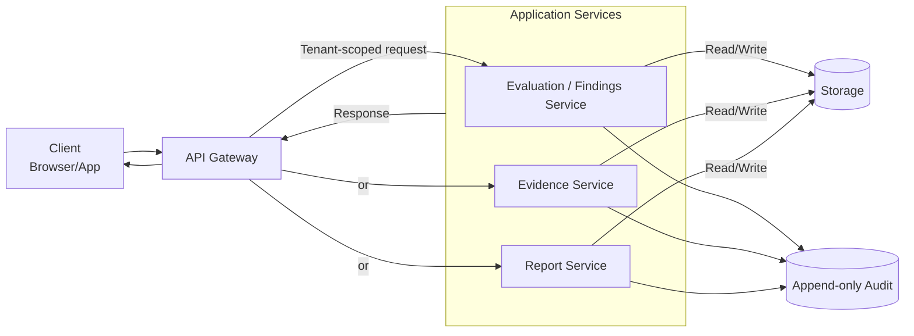
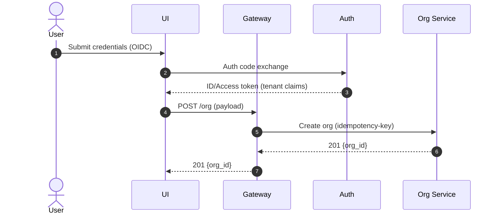
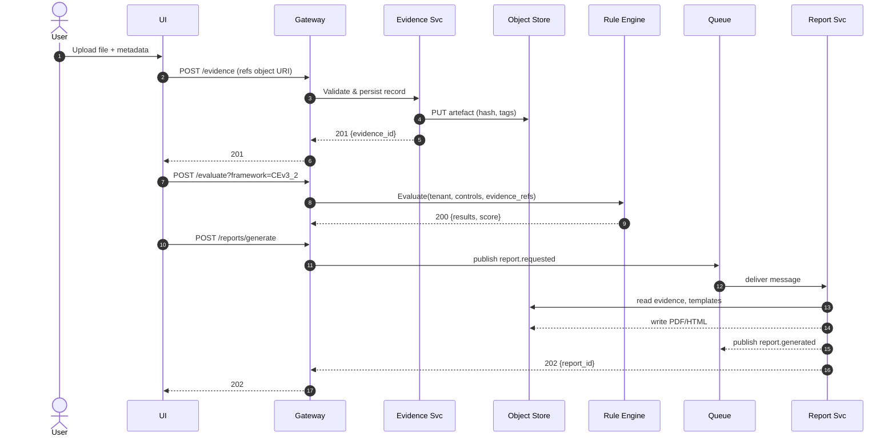
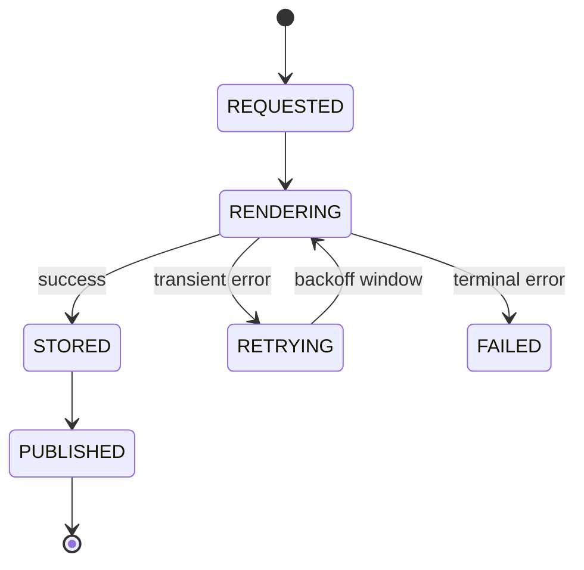
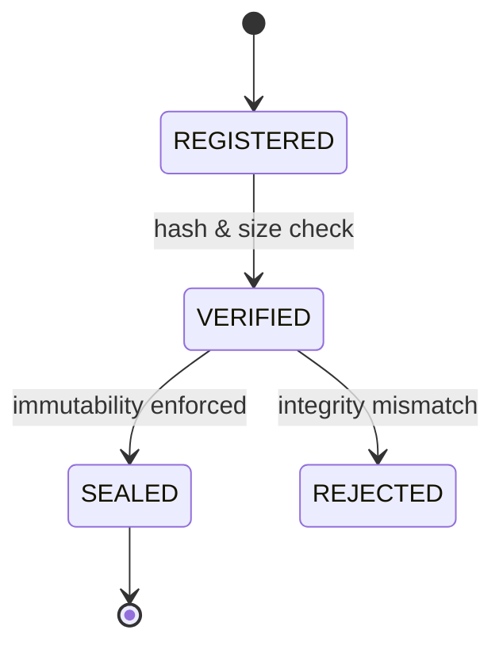

# System Architecture & Interface Specification (SAIS)

## 1. Purpose and Scope

This document defines the architectural intent and boundaries for Transcrypt’s v1 / MVP implementation. It exists to specify, at a system level, what will be built, how components relate, and which interfaces are exposed. It inherits its direction exclusively from the Product Requirements Document (`v0.3.0-prd-complete`) and does not override or extend that specification.

The SAIS covers only the MVP scope defined in the PRD, including the essential feature set, minimum architectural components, and mandatory interfaces required for a functioning release. Any feature, integration, or behavioural pattern not explicitly included in the PRD’s MVP cut is out of scope for this document.

Document ownership sits with the engineering function. Changes follow the same version-control process as the PRD: tracked in Git, reviewed on change, and updated only when underlying implementation or requirements shift.

### 1.1 Document Intent

This specification converts the Transcrypt PRD (`v0.3.0-prd-complete`) into concrete, implementable architectural artefacts. It defines how the product’s stated requirements manifest as system components, boundaries, interfaces, and data structures. For the MVP release, this document serves as the authoritative reference for runtime behaviour, integration points, and technical constraints. No component, interface, or behaviour outside what is expressed here is considered part of the v1 system.

### 1.2 Relationship to PRD

This document maintains direct traceability to the PRD by referencing the specific PRD sections from which each architectural element originates. Every functional, non-functional, and security requirement described in the PRD must map to one or more technical elements defined here. No architectural element in this specification exists without an originating PRD section, and no PRD requirement is considered satisfied unless it appears here in an implementable form.

### 1.3 Version and Control Mechanism

This document is versioned using the same Git-based workflow defined for the PRD. All changes are tracked in the Transcrypt repository, with updates made only through reviewed commits. The SAIS uses a dedicated semantic tag format:
**`v1.x.y-sais`**,
where `x` increments for architectural changes affecting component boundaries or interfaces, and `y` increments for clarifications that do not alter behaviour.

Branches follow the repository’s existing convention (e.g. `codex/<task>`, `feature/<component>`), and SAIS updates must accompany or follow the corresponding PRD commits. Milestone tags align with PRD releases so that a given PRD version and SAIS version can be resolved unambiguously. CI/CD promotion gates reference these tags to ensure that only architectures backed by a corresponding SAIS version progress to implementation or release.

### 1.4 Ownership and Maintenance

The Product Lead is the accountable owner of this document and is responsible for ensuring that it reflects the current architectural direction defined in the PRD. Day-to-day maintenance is jointly handled by the Engineering Lead and the Security Lead, who update the specification when components, interfaces, or constraints change.

This document follows the same review cadence as the PRD: quarterly, or immediately upon any major release that alters platform behaviour or boundaries. Structural changes require explicit approval from all three roles — Product Lead, Engineering Lead, and Security Lead — and updates must be committed through the standard Git review workflow before becoming authoritative.

### 1.5 Scope of Coverage

This specification covers all components required for the MVP release as defined in the PRD. In scope are: the public Marketing and Blog site, the Marketing↔Essentials handshake, the Transcrypt Essentials App, deterministic rule evaluation, evidence intake and management, report generation, billing, and all onboarding flows described in the PRD.

Explicitly out of scope for this version are: partner and integrator APIs, the NIS2 control pack, advanced connectors, assisted-tier collaboration features, and any enterprise or post-MVP extensibility defined in later PRD phases.

### 1.6 Intended Audience

This document is written for the people directly involved in building and maintaining Transcrypt. Primarily, it serves as an implementation reference for development work and as a precise description of the system’s boundaries, behaviours, and interfaces. It also provides a clear architectural baseline for anyone contributing to product direction or verifying security and compliance aspects of the platform. If external collaborators or integrators become involved in future phases, they may use this document solely to understand the public API surface and integration constraints.

### 1.7 Document Change Log Linkage

All updates to this document are tracked directly within the SAIS change log at the end of the file, and in Git commit history. Changes may optionally reference the associated PRD section number when the edit reflects a modification or clarification to the product definition. No additional appendix structure or external identifier system is used.

## 2. System Overview

This section describes the system at a high level, reflecting the architectural intent defined in the PRD. Transcrypt consists of two user-facing surfaces: the public Marketing & Blog site, which operates as a Next.js runtime providing SSR/ISR-rendered content, routing, telemetry, and the Marketing→Essentials onboarding and identity handshake; and the authenticated Essentials App, which performs compliance evaluation and reporting. Both surfaces consume the same public API, and both form part of the MVP delivery defined in the PRD.

The platform is a multi-tenant, deterministic compliance automation system built around three core ideas: automation-first workflows, invisible infrastructure, and strict auditability. All internal behaviour follows the deterministic, measurement-led model described in the PRD, and no internal complexity is exposed to the user.

The system is divided into clear architectural layers that separate request handling, rule evaluation, evidence processing, report generation, and data storage. Runtime behaviour is simple by design: every action produces a predictable outcome, every state change is auditable, and users see only clear, binary outcomes (“compliant” / “not yet compliant”).

The MVP boundary defined in the PRD restricts the platform to the Essentials feature set, CE v3.2 rule evaluation, evidence intake, report generation, billing, the public Marketing/Blog runtime, and the associated onboarding integrations.

---

### 2.1 System Philosophy

Transcrypt’s architecture is grounded in the principles set out in the PRD: automation-first operation, deterministic behaviour, and invisibly managed infrastructure. The system will minimise user exposure to internal mechanics — orchestration, rule evaluation, evidence binding, and rendering — and will surface only the outcomes that matter: whether a control is satisfied, why, and how it can be improved. Internal complexity, including routing, SSR/ISR rendering, identity flow, evidence processing, and rule execution, will remain hidden behind predictable interfaces.

The engineering mindset is measurement-led: every significant action will emit audit-ready traces, deterministic hashes, or reproducible artefacts. Identical inputs will always yield identical results, and every outcome will be explainable through visible links to evidence, rule logic, or system state. This ensures that users can trust findings without having to trust the internal machinery.

Every component — from the Marketing/Blog runtime to the Essentials App, API boundary, evaluation workflow, evidence pipeline, and report generator — will serve three goals: determinism, auditability, and user trust. The system will avoid ambiguity, implicit behaviour, or “magic” at runtime. Instead, it will prioritise clarity, traceability, and predictable transitions between states, making the platform feel calm, competent, and reliable whether the user is reading content, completing intake, uploading evidence, or generating a report.

### 2.2 Major Architectural Layers

Transcrypt’s architecture is organised into a small number of clear layers, each reflecting the structural boundaries defined in the PRD. These layers separate ingress, evaluation, evidence handling, rendering, storage, and observability so that each can evolve independently while maintaining deterministic behaviour and tenant isolation.

#### **Edge Layer (Marketing Runtime, Essentials UI, API Gateway)**

This layer will receive all user traffic across the Marketing/Blog site and the Essentials App. It will handle SSR/ISR rendering, session establishment, identity transitions, and API request termination. The gateway will shape incoming requests, attach tenant context, enforce authentication, and apply rate limits and basic policy guards. No business logic or evaluation occurs here; the edge simply provides controlled and auditable entry into the system.

#### **Control and Rule Layer**

This layer will evaluate tenant input against Cyber Essentials v3.2 controls using the deterministic rule engine defined in the PRD. It will consume OrgProfile and Evidence metadata, execute rule tests, and emit findings with provenance. The layer is stateless and versioned, ensuring identical inputs always map to identical outputs. It will be replaceable as future rulepacks or frameworks are introduced.

#### **Data and Evidence Layer**

This layer will persist structured profile and evaluation data in Postgres and will store evidence artefacts in object storage with hashing, metadata, and immutability guarantees. Audit trails, state transitions, and integrity events will be recorded here. Retention, encryption, and isolation follow the PRD’s data-handling constraints, and no component will bypass the layer or share cross-tenant data paths.

#### **Services and Integration Layer**

This layer will interface with external systems required for MVP operation: identity providers (OIDC through next-auth), Stripe billing, email delivery, and basic connector scaffolding (with out-of-scope connectors stubbed). All integrations will be explicitly versioned and accessed through well-defined, replaceable interfaces.

#### **Observability and Automation Layer**

This layer will collect logs, traces, and metrics from all surfaces — including the Marketing/Blog runtime — and will enforce SLO signals and deployment gates. It provides the measurement backbone for deterministic behaviour, supports CI/CD promotion decisions, and ensures that failures, slow paths, or unexpected behaviours are visible and auditable.

---

Each layer is designed to be independently testable, independently deployable, and replaceable without altering the surrounding system, ensuring architectural stability as the product evolves.

### 2.3 Runtime Context

At runtime, the system operates as a multi-tenant SaaS platform in which all user traffic enters through stateless compute surfaces — the Marketing/Blog runtime, the Essentials App, and the API Gateway. Each request is routed to the appropriate downstream service, with tenant context attached at the edge to enforce isolation and traceability.

All compute nodes run without tenant-specific state. Rendering (SSR/ISR), rule evaluation, evidence processing, and report assembly occur in ephemeral execution environments, ensuring that no local data persists beyond the lifetime of the request. Any artefact produced — findings, traces, hashes, profiles, or reports — is stored only in the platform’s canonical datastores defined in the PRD.

Tenant isolation is enforced consistently across the stack. The Postgres datastore scopes all records by tenant, object storage segregates artefacts under per-tenant prefixes, and audit logs record state transitions with monotonic timestamps and request identifiers. No cross-tenant queries or shared artefact paths exist at runtime.

The system relies on a minimal set of external services during operation: identity providers through OIDC (Entra, Okta, Google), Stripe for billing, and an S3-compatible object store for evidence artefacts and report binaries. Email delivery supports onboarding and notifications. Every external dependency is accessed through a tightly defined interface so it can be replaced without impacting internal behaviour.

Report generation is synchronous within the deterministic pipeline: rule evaluation completes, findings are assembled, and the report is produced as a single, traceable operation. All steps emit audit-relevant metadata to ensure outcomes can be explained or reproduced later.

### 2.4 Guiding Design Principles

Transcrypt’s design principles are not abstract slogans; they are behaviours demanded explicitly throughout the PRD. They apply equally to the Essentials App, the API boundary, the internal evaluation workflow, and the Marketing/Blog runtime, which the PRD defines as a compute-bearing Next.js surface participating in routing, identity, telemetry, and content delivery.

**Clarity Over Complexity**
The PRD makes it clear that users must always understand what a screen, state, or result means. Every surface — including the Marketing/Blog site — must present information in a calm, direct, and unfussy manner. No hidden states, no ambiguity, and no “figure it out yourself” UI. Explanations, next steps, and reasons are always visible.

**Deterministic Outcomes**
The PRD insists that identical inputs must lead to identical outputs. This principle governs rule evaluation, evidence binding, report creation, and even UI behaviour. Nothing in the system may behave probabilistically without being paired with a deterministic control path. Every outcome must be reproducible and traceable.

**Explainable State**
Every result in the PRD — whether a finding, a partial, a pass, or a failure — must be backed by visible reasoning. Users must be able to open any result and see which rule triggered it, which input influenced it, which evidence was bound to it, and which version of the rulepack produced it. Nothing is allowed to “just happen.”

**Security Everywhere, Not in Pockets**
Isolation, least privilege, encryption, and mutual authentication are defined in the PRD as baseline behaviours, not feature flags. Evidence artefacts are hashed, stored immutably, and never shared across tenants. The Marketing/Blog runtime follows the same rules: session handling, identity transitions, telemetry, and routing must all honour the same security posture as the authenticated app.

**Unified Behaviour Across All Surfaces**
Your PRD explicitly requires that the Marketing/Blog runtime follow the same interface rules, tone, and behavioural constraints as the Essentials App. This includes SSR/ISR rendering, routing decisions, identity handoff, and telemetry. Surfaces may differ in purpose, but never in architectural discipline.

**Auditable From End to End**
The PRD defines structured logs, traces, request IDs, tenant IDs, evidence hashes, provenance markers, and state transitions as required outputs. Nothing in the system — including content rendering, routing events, identity handoff, evaluation, evidence upload, or report creation — may occur without leaving an audit-consumable trail.

**Safe Failure**
The PRD repeatedly rejects ambiguity, silent fallbacks, or implicit decisions. When something goes wrong — a rule fails, evidence is invalid, an identity transition breaks, or a rendering path collapses — the system must fail in a visible and controlled way. No half-states, no lost work, and no misleading success signals.

### 2.5 MVP Boundary of Delivery

The MVP is precisely defined in the PRD as the smallest complete loop that allows a tenant to sign up, provide basic organisational details and evidence, run an evaluation against a limited Cyber Essentials v3.2 rulepack, and receive a branded report. The boundary is narrow on purpose: it delivers value, proves feasibility, and avoids premature expansion into later-phase features.

The MVP includes:

**Marketing/Blog Runtime (Next.js)**
The public-facing marketing and blog site, operating as a compute-bearing Next.js surface with SSR/ISR. It acts as the platform entry point, delivers content, and handles the Marketing → Essentials identity and routing handoff.

**Essentials Application**
The authenticated app that allows a tenant to create an Org Profile, provide evidence, run evaluations, view findings, and download a report. Intake fields, validation rules, evidence binding, and the user experience for evaluation are all scoped tightly to Cyber Essentials v3.2.

**Deterministic Evaluation Loop**
The rule engine defined in the PRD, running the 15 Cyber Essentials controls selected for v1. Org Profile and Evidence data are processed through a deterministic pipeline that produces findings with provenance and clear rationale.

**Evidence Handling**
File uploads, hashing, metadata capture, storage in object storage under tenant isolation, and binding of artefacts to findings. Assertions and system pulls are supported only to the extent defined in the MVP.

**Report Generation**
HTML/PDF report creation with citations, evidence references, and hash footers. The evaluation and report are produced synchronously as a single deterministic operation.

**Billing (Stripe)**
Subscription and checkout through Stripe. The MVP supports basic subscription creation, renewal, and cancellation. No multi-plan structure, discounts, or enterprise options.

The MVP excludes:

**Partner / Integrator APIs**
No collaboration surfaces, auditor flows, or shared workspaces. All multi-party features are deferred.

**NIS2 and Additional Frameworks**
Only Cyber Essentials v3.2 is supported. No cross-framework evaluation, mapping, or rulepacks.

**Advanced Connectors**
Only Entra or Okta identity pulls are considered for the MVP, and even these may be stubbed or limited. Backup systems, EDR, and cloud posture scanners are explicitly out of scope.

**Assisted Tier or Collaboration Tools**
No shared dashboards, comment threads, review queues, or advisor interactions. The user journey is strictly self-serve.

This boundary ensures the MVP remains feasible, coherent, and aligned with the PRD’s requirement to ship a complete, deterministic, end-to-end loop before any expansion into multi-framework or collaborative functionality.

### 2.6 External Dependencies and Integrations

The MVP interacts with a narrow set of external systems defined in the PRD. Each integration exists only to support a core user journey and is accessed through a tightly controlled interface to preserve determinism and prevent vendor-specific behaviour from leaking into the platform.

**Identity Providers (OIDC)**
Authentication for both the Marketing/Blog runtime and the Essentials App will be handled through standard OIDC flows. Supported providers in the MVP are Entra ID, Okta, and Google, or maybe Keycloak. These services supply primary authentication only; no synchronisation, SCIM provisioning, or directory management is part of this phase.

**Stripe (Billing)**
The MVP uses Stripe Checkout and the Stripe Customer Portal for subscription creation, renewal, and cancellation. Only a single plan is exposed at launch. Webhooks are used to reflect subscription state inside the platform. No enterprise billing features, usage metering, or multi-plan structures are included.

**S3-Compatible Object Storage**
Evidence artefacts, report binaries, and hashed objects will be stored in a tenant-isolated S3-compatible bucket. The PRD requires envelope encryption, immutability constraints, short-lived signed URLs, and strict separation between tenants. No computation occurs within storage; it functions as an integrity-preserving artefact store only.

**Email Delivery**
The platform will send transactional messages through a compliant mail provider for onboarding and follow-up communication. The PRD does not commit to a specific vendor. Email is not tied to core evaluation flow and must not block user progress.

**CDN and Runtime Hosting**
The Marketing/Blog site will run as a Next.js SSR/ISR runtime positioned in front of a CDN that provides caching, asset distribution, and edge routing. The PRD defines required behaviour—consistent content delivery, stable routing, and clean separation of authenticated and unauthenticated flows—but does not mandate a provider.

**Telemetry and Observability Endpoint**
All runtime surfaces emit structured logs and OpenTelemetry-style traces that capture gateway → evaluation → evidence → report flows. Tenant IDs, request IDs, version markers, and provenance hashes must appear in every event. No component is permitted to run without observability hooks.

#### **Failure Behaviour**

Fallback expectations derive directly from the PRD’s principles of determinism, explainability, and controlled degradation:

* **Identity provider failure:** Auth attempts must fail cleanly and visibly. No implicit fallback to another provider, no partial sessions.
* **Stripe failure:** Subscription state must remain consistent. Transient billing errors do not corrupt access or block evaluation.
* **Object storage failure:** Evidence uploads must fail atomically. No partial artefacts, no ambiguous integrity state.
* **Email delivery failure:** Email outages are logged but do not block intake, evaluation, or reporting.
* **Telemetry failure:** Loss of observability data is itself observable. The system continues to operate but must note the failure locally.

---

**TODO-SAIS-EXT-01:** Define explicit runtime limits for email, IdP, and Stripe retries (counts, backoff rules, and log thresholds).

### 2.7 Deployment Topography Summary

The MVP is deployed as a small, deterministic collection of services whose boundaries mirror the PRD’s requirement for simplicity, explainability, and environment parity. No background workers, message queues, or orchestration frameworks form part of the MVP; only the minimum viable set of services required to run the evaluation–report loop.

**Marketing/Blog Runtime (Next.js SSR/ISR)**
The public-facing site runs as a compute-bearing Next.js service behind a CDN. It performs SSR/ISR rendering, Marketing→Essentials identity transitions, content routing, and telemetry emission. It stores no tenant data and interacts with the system exclusively via the public API.

**Essentials App (Next.js Runtime)**
The authenticated application is served as a separate Next.js runtime. All user actions—intake, evidence upload, evaluation, reporting, billing—flow through the API Gateway. The Essentials app holds no persistent data.

**API Gateway (FastAPI/Go; language-agnostic in PRD)**
This is the single ingress point for all authenticated and unauthenticated API calls. Responsibilities include OIDC validation, request shaping, rate limiting (defined elsewhere in SAIS), audit header injection, version marking, and routing to internal services.

**Rule Evaluation Service**
A stateless service responsible for evaluating an OrgProfile and Evidence bundle against a signed RulePack. It performs deterministic checks and may invoke the runtime LLM inference path where allowed. All processing uses ephemeral memory and produces deterministic findings.

**Evidence & Artefact Storage (S3-Compatible)**
All evidence artefacts, report binaries, and hashed objects are stored in an S3-compatible bucket. The PRD requires envelope encryption, immutability controls, short-lived signed URLs, and strict tenant prefix isolation. Storage performs no compute; its role is integrity and retention.

**Primary Database (PostgreSQL ≥ v15)**
Stores tenant metadata, OrgProfile records, evaluation histories, findings, audit events, and Stripe linkage metadata. Backups must meet the PRD’s encryption, retention, and recovery objectives.

---

### **Environments**

Transcrypt defines three runtime environments:

* **dev** — developer iteration and ephemeral preview environments.
* **staging** — production-like environment for release validation.
* **prod** — tenant-facing environment.

The PRD requires that all environments remain **configuration-identical**, differing only in:

* secrets
* environment URLs
* horizontal/vertical scaling

No differences in behaviour, routing, dependency versions, or infrastructure topology are permitted, ensuring deterministic runtime behaviour across the deployment pipeline.

---

### **TODO-SAIS-TOPO-02 (PRD Boundary Checkpoint)**

Two product-level behaviours, implied by user-facing expectations but not yet declared in the PRD, must be defined before the SAIS can lock final deployment behaviour:

1. **Evidence Upload Constraints (Product Behaviour)**
   The PRD must eventually specify user-facing limits: allowed MIME types, maximum file size, concurrent uploads, number of artefacts per control, and whether compressed bundles (ZIP) are permitted. These constraints directly affect user experience, support load, and compliance expectations, and therefore belong in the PRD rather than only in system architecture.

2. **Session Semantics (User Experience)**
   Session lifetime, refresh behaviour, handoff state between Marketing↔Essentials, and whether admin actions require step-up MFA must be declared as product truths. These behaviours define how the user experiences continuity, trust, and flow across the platform. Once PRD statements exist, the SAIS will encode the exact architectural implementation.

These TODOs do **not** block SAIS progress but must be resolved before the early implementation phase begins, to prevent divergent assumptions across gateways, runtimes, and client behaviour.

## 3. Component Architecture

This section defines the complete set of components that make up the Transcrypt MVP. It describes each subsystem in terms of its boundary, purpose, and dependencies, and classifies every element as internal, external, or partner-facing. The scope reflects the PRD: a deterministic, multi-tenant compliance platform composed of two Next.js runtimes, a single API gateway, a small set of stateless evaluation and reporting services, and a limited number of external integrations.

The architecture treats every component as a replaceable unit with a single responsibility. Internal components handle intake, evidence, rule evaluation, reporting, billing state, and auditability. External components provide identity, billing, object storage, email delivery, and CDN hosting for the marketing runtime. Partner-facing surfaces are explicitly out of scope for the MVP and appear only as placeholders. Component boundaries are defined so that no service shares responsibilities, no implicit communication paths exist, and all data exchange happens through typed, versioned contracts.

This section establishes the authoritative inventory and classification of all services, runtimes, SDKs, and integrations, forming the basis for the interfaces, contracts, and resilience patterns described later in the SAIS.

---

### 3.1 Component Map and Classification

The MVP consists of a small, tightly scoped set of components grouped under the platform’s major architectural layers. Each component is classified as **internal**, **external**, or **partner-facing** (none of which are active in the MVP). Only components explicitly described in the PRD appear here.

### **3.1.1 Component Inventory Table**

| Component                                                 | Layer              | Classification | Purpose / Boundary                                                                                                            |
| --------------------------------------------------------- | ------------------ | -------------- | ----------------------------------------------------------------------------------------------------------------------------- |
| **Marketing/Blog Runtime (Next.js SSR/ISR)**              | Edge               | Internal       | Public-facing site; marketing content, onboarding paths, Marketing→Essentials identity handoff. No tenant data stored.        |
| **Essentials App Runtime (Next.js)**                      | Edge               | Internal       | Authenticated tenant UI for intake, evidence upload, evaluation requests, reports, and billing.                               |
| **API Gateway & Policy Enforcer**                         | Edge / Integration | Internal       | Single ingress for all API calls; validates OIDC, attaches audit metadata, enforces rate limits, routes to internal services. |
| **Rule Evaluation Service (Deterministic + Runtime LLM)** | Control / Rule     | Internal       | Evaluates OrgProfile + Evidence against a signed RulePack; produces Findings. Stateless; ephemeral execution.                 |
| **Report Service**                                        | Control            | Internal       | Assembles findings, metadata, and evidence links into branded HTML/PDF reports. Stateless.                                    |
| **Evidence Service**                                      | Data / Evidence    | Internal       | Handles evidence upload, hashing, metadata extraction, and storage into tenant-isolated S3-compatible bucket.                 |
| **Primary Database (PostgreSQL ≥15)**                     | Data               | Internal       | Stores tenant metadata, org profiles, evaluations, findings, audit events, and Stripe subscription state.                     |
| **Object Store (S3-compatible)**                          | Data / Evidence    | External       | Stores all evidence artefacts, reports, and hashed objects using tenant prefixes and envelope encryption.                     |
| **OIDC Identity Providers (Entra ID / Okta / Google)**    | Integration        | External       | Provide authentication for Marketing and Essentials surfaces via OIDC. No SCIM or enterprise features in MVP.                 |
| **Stripe Billing**                                        | Integration        | External       | Subscription creation, renewal, cancellation, and webhook events for billing state.                                           |
| **Email Delivery Provider**                               | Integration        | External       | Sends onboarding and follow-up notifications; not tied to core control evaluation flow.                                       |
| **CDN / Edge Delivery Layer**                             | Edge               | External       | Provides caching, static asset delivery, and consistent routing for the Marketing/Blog runtime.                               |
| **Telemetry / Observability Endpoint (OTel Compatible)**  | Observability      | Internal       | Receives structured logs, request traces, and metrics from all components. (Vendor-agnostic in PRD.)                          |
| **Partner / Auditor API Surfaces**                        | Integration        | Partner-Facing | Stub only; no partner-facing functionality in the MVP. Reserved for post-MVP phases (1.5 / 2.0).                              |

---

### **3.1.2 Classification Summary**

* **Internal components** form the backbone of the MVP: both Next.js runtimes, API gateway, evaluation, reporting, evidence services, database, and observability.
* **External components** are identity, billing, object storage, CDN, and email delivery — all accessed through narrow, replaceable interfaces as required by the PRD.
* **Partner-facing components** exist only as stubs; the MVP contains no external API surfaces for MSPs, auditors, or integrators.

This classification reflects the MVP’s minimal, deterministic architecture: a very small set of services with clear boundaries, zero hidden compute paths, and no cross-service ambiguity.

### 3.2 Component Responsibilities

Each component in the Transcrypt MVP has one clearly defined responsibility. All components honour typed, versioned contracts. Ownership for every internal module sits with the founder-engineer; external services adhere to their vendor specifications.

---

#### **Marketing/Blog Runtime (Next.js SSR/ISR)**

**Purpose:** Public-facing site delivering marketing content, onboarding funnels, and the Marketing → Essentials identity transition.
**Contracts honoured:** OIDC redirect URLs; API Gateway public routes; telemetry emission.

**Inputs → Outputs → Side-effects**

* **Inputs:** HTTP GET requests; OIDC session cookie (if present).
* **Outputs:** Rendered SSR/ISR pages; calls to API Gateway; OIDC callback redirects.
* **Side-effects:** Emits telemetry; caches pages at CDN; no persistent data.

---

#### **Essentials App Runtime (Next.js)**

**Purpose:** Authenticated tenant UI for intake, evidence uploads, evaluations, reports, and billing.
**Contracts honoured:** All public API Gateway contracts; evidence upload schema; report generation schema.

**Inputs → Outputs → Side-effects**

* **Inputs:** Authenticated HTTP requests; user-provided profiles and evidence.
* **Outputs:** API calls for evaluation, uploads, billing; rendered application pages.
* **Side-effects:** Emits telemetry; stores no data locally.

---

#### **API Gateway & Policy Enforcer**

**Purpose:** Single ingress; validates identity; enforces rate limits; shapes requests; injects audit metadata; routes to internal services.
**Contracts honoured:** OIDC token validation; structured log/trace contracts; versioned internal API contracts.

**Inputs → Outputs → Side-effects**

* **Inputs:** All inbound HTTP requests (public + authenticated).
* **Outputs:** Routed internal requests; denial responses for failed auth; enriched logs/traces.
* **Side-effects:** Attaches tenant ID, request ID, version stamps; logs all activity.

---

#### **Rule Evaluation Service**

**Purpose:** Evaluate OrgProfile + Evidence using a signed RulePack; produce deterministic Findings; optionally call runtime LLM path.
**Contracts honoured:** RulePack schema; OrgProfile schema; Evidence schema; Finding schema; provenance-hash rules.

**Inputs → Outputs → Side-effects**

* **Inputs:** `POST /evaluate` payload: OrgProfile, Evidence refs, RulePack ID, version metadata.
* **Outputs:** Findings JSON with trace IDs and provenance.
* **Side-effects:** Emits audit events; no data persisted.

---

#### **Report Service**

**Purpose:** Assemble findings, metadata, and evidence citations into branded HTML/PDF reports.
**Contracts honoured:** Findings schema; Report schema; object storage contract for upload.

**Inputs → Outputs → Side-effects**

* **Inputs:** Findings JSON; OrgProfile; evidence references; template versions.
* **Outputs:** HTML/PDF report blob; report metadata.
* **Side-effects:** Uploads report to object storage; emits telemetry.

---

#### **Evidence Service**

**Purpose:** Accept, validate, hash, and store evidence artefacts; bind them to findings.
**Contracts honoured:** Evidence upload schema; integrity hashing rules; S3-compatible API contract.

**Inputs → Outputs → Side-effects**

* **Inputs:** File streams; metadata; tenant ID; control binding information.
* **Outputs:** Stored object with deterministic hash; evidence metadata JSON.
* **Side-effects:** Writes to object storage; emits audit log for each stored artefact.

---

#### **Primary Database (PostgreSQL ≥15)**

**Purpose:** Persist tenant metadata, OrgProfiles, Findings summaries, audit trails, and Stripe subscription state.
**Contracts honoured:** Internal DB schema; migration/versioning protocol.

**Inputs → Outputs → Side-effects**

* **Inputs:** Writes from API Gateway, Evaluation Service, and billing handlers.
* **Outputs:** Query results to internal services.
* **Side-effects:** Encrypted backups; retention policy enforcement.

---

#### **Object Store (S3-Compatible)**

**Purpose:** Store evidence artefacts, reports, and hashed objects using strict tenant isolation.
**Contracts honoured:** S3 API; encryption envelope rules; signed URL contract.

**Inputs → Outputs → Side-effects**

* **Inputs:** Object PUT requests (evidence, reports).
* **Outputs:** Signed URLs; object GET requests.
* **Side-effects:** Maintains immutability and encryption as defined; no internal compute.

---

#### **OIDC Identity Providers (Entra / Okta / Google)**

**Purpose:** Provide authentication flows for Marketing and Essentials surfaces.
**Contracts honoured:** OIDC discovery, token issuance, JWKS.

**Inputs → Outputs → Side-effects**

* **Inputs:** Auth requests; redirect URIs.
* **Outputs:** ID tokens; access tokens; refresh behaviour (provider-specific).
* **Side-effects:** None inside Transcrypt; failure handled at API Gateway/UI layers.

---

#### **Stripe Billing**

**Purpose:** Subscription creation, renewal, cancellation, and subscription-state signalling via webhook.
**Contracts honoured:** Stripe Checkout, Billing Portal, webhook schema.

**Inputs → Outputs → Side-effects**

* **Inputs:** Checkout events; webhook events.
* **Outputs:** Subscription state updates in DB; billing redirects.
* **Side-effects:** Emits signed webhooks; no internal state.

---

#### **Email Delivery Provider**

**Purpose:** Send transactional emails (onboarding, nudges).
**Contracts honoured:** SMTP or vendor API; privacy/minimal-data rule.

**Inputs → Outputs → Side-effects**

* **Inputs:** Email payload with template, address, metadata.
* **Outputs:** Delivery attempt; provider response.
* **Side-effects:** Logs success/failure; does not block core workflows.

---

#### **CDN / Edge Delivery Layer**

**Purpose:** Provide caching, asset delivery, and stable routing for Marketing/Blog runtime.
**Contracts honoured:** Standard CDN cache rules; SSR/ISR invalidation rules defined later in SAIS.

**Inputs → Outputs → Side-effects**

* **Inputs:** GET requests for marketing pages and assets.
* **Outputs:** Cached responses; fallback to origin SSR/ISR rendering if needed.
* **Side-effects:** Cache population; telemetry for edge hits/misses.

---

#### **Telemetry / Observability Endpoint (OTel-Compatible)**

**Purpose:** Collect logs, traces, metrics from all components.
**Contracts honoured:** OpenTelemetry standards; structured-log schema.

**Inputs → Outputs → Side-effects**

* **Inputs:** Logs, spans, metrics from all internal services.
* **Outputs:** Stored/forwarded telemetry data.
* **Side-effects:** If unreachable, failures logged locally as per SAIS requirements.

### 3.3 Internal Services

The Transcrypt MVP consists of a small set of internal services that communicate exclusively through typed HTTP/JSON interfaces. All components are stateless except for the database. Each service exposes only the minimum endpoints required for the evaluation→report pipeline.

No internal service communicates implicitly.
No service shares responsibility.
Every call is authenticated, versioned, logged, and trace-linked.

---

#### **3.3.1 API Gateway & Policy Enforcer**

**Purpose**
Single ingress for all internal and external API calls.
Auth validation, request shaping, routing, and audit-header injection.

**Ports**

* `443/tcp` (public HTTPS ingress)
* `internal-http` (cluster-only routing to internal services; number is infra-dependent)

**Dependencies**

* OIDC providers (Entra / Okta / Google) for token validation
* PostgreSQL (for tenant/session metadata)
* Telemetry endpoint
* Stripe (webhooks)
* Internal services: Evaluation, Evidence, Report

**Message Formats**

* JSON over HTTPS
* All inbound requests require `X-Request-ID`
* All responses include `trace_id` and `version` fields
* Authentication via Bearer token (OIDC ID token or session token)

**Error Boundaries**

* Rejects invalid/missing tokens (401)
* Rejects requests missing required fields (422)
* On internal service errors, surfaces deterministic `Problem+JSON` errors
* Never forwards partial or unvalidated requests to downstream services

---

#### **3.3.2 Rule Evaluation Service (Deterministic + Runtime LLM)**

**Purpose**
Execute deterministic checks against the signed RulePack and, where enabled, call runtime LLM inference for interpretive checks.
Produces the single source of truth for Findings.

**Ports**

* `internal-eval` (HTTPS or mTLS internal channel)

**Dependencies**

* RulePack store (read-only)
* Telemetry endpoint
* API Gateway (caller)
* Optional: LLM runtime (inference only, no training)

**Message Formats**
**Input (JSON):**

```json
{
  "org_profile": {...},
  "evidence": [...],
  "rulepack_id": "RP-2024-CE-v1",
  "version": "1.0.0",
  "options": { "use_ai": false }
}
```

**Output (JSON):**

```json
{
  "findings": [...],
  "trace_id": "abc-123",
  "rulepack_version": "1.0.0"
}
```

**Error Boundaries**

* Rejects malformed OrgProfile/Evidence schemas
* Rejects unsigned or unverified RulePack versions
* Fails closed on LLM inference errors (AI is optional)
* No internal state kept; failure cannot corrupt system state

---

#### **3.3.3 Evidence Service**

**Purpose**
Accept, validate, hash, and store evidence artefacts.
Bind artefacts to controls, maintain deterministic integrity metadata.

**Ports**

* `internal-evidence` (HTTPS)

**Dependencies**

* S3-compatible object store
* Telemetry endpoint
* API Gateway (caller)

**Message Formats**

* File upload: multipart form-data
* Metadata: JSON (control_id, filename, mime_type, hash)
* Responses include deterministic SHA-256 hash and storage path

**Error Boundaries**

* Rejects files that fail integrity check
* Rejects artefacts missing control binding
* Fails atomically: no partial writes
* Logs failed uploads but never blocks evaluation flow

---

#### **3.3.4 Report Service**

**Purpose**
Assemble Findings → Metadata → Report Template → Rendered HTML/PDF.
Upload report to object storage.

**Ports**

* `internal-report` (HTTPS)

**Dependencies**

* Object store
* Telemetry endpoint
* Evaluation Service (input provider)
* API Gateway (caller)

**Message Formats**
**Input:**

```json
{
  "findings": [...],
  "org_profile": {...},
  "evidence_map": {...},
  "template_version": "1.0.0"
}
```

**Output:**

* PDF/HTML blob
* JSON metadata with report_id, hash, storage path

**Error Boundaries**

* Rejects missing or malformed Findings
* Rejects template-version mismatches
* Fails cleanly on PDF render errors with no partial artefacts

---

#### **3.3.5 Auth Service / Identity Adapter**

*Note: This is not a standalone service in the MVP; the logic lives inside the API Gateway and the two Next.js runtimes. SAIS still treats it as a component for clarity.*

**Purpose**
Normalise OIDC interaction across supported providers; validate tokens; perform session shaping.

**Ports**

* None (embedded in API Gateway and the two runtimes)

**Dependencies**

* OIDC discovery endpoints
* JWKS keys
* API Gateway (primary consumer)
* Telemetry endpoint

**Message Formats**

* Standard OIDC ID token
* JWT with required claims: `sub`, `email`, `iss`, `exp`

**Error Boundaries**

* Rejects expired, unsigned, or untrusted tokens
* Rejects mismatched issuer/audience
* Does not degrade silently; failure always surfaces to user-facing layer

---

#### **3.3.6 Internal Services Summary**

| Service            | Source of Truth   | Stateless | Stores Data | Failure Mode                         |
| ------------------ | ----------------- | --------- | ----------- | ------------------------------------ |
| API Gateway        | Routing + Auth    | Yes       | No          | Reject + Problem+JSON                |
| Evaluation Service | Findings          | Yes       | No          | Fail closed, no partial findings     |
| Evidence Service   | Evidence Metadata | Yes       | No          | Atomic failure, no partial artefacts |
| Report Service     | Report output     | Yes       | No          | Clean failure, no partial artefacts  |
| Auth Adapter       | OIDC              | Yes       | No          | Visible login failure                |

---

# ✅ **TODO 1 — Evidence Upload Format & Limits (Product-Level Requirement)**

**Where it lands in 3.3:** Evidence Service

**Why it’s needed:**
Your PRD defines hashing, immutability, artefact binding, and S3 prefixes — but *not* evidence constraints such as file types, max size, or concurrency.

This directly affects:

* behaviour of the **Evidence Service**
* what the API Gateway is allowed to accept
* user experience
* report consistency
* security posture

Without this, 3.3 cannot fully define:

* allowed MIME types
* rejection rules
* side-effects
* maximum upload size
* edge-case handling (e.g., ZIPs, large archives)

**TODO-SAIS-EVID-01:**
“Specify allowable evidence file types, maximum file size, and whether multi-file bundles (ZIP) are supported. These are product-level constraints missing from the PRD and required before finalising Evidence Service contracts.”

---

# ✅ **TODO 2 — Session Semantics (Product-Level Requirement)**

**Where it lands in 3.3:** API Gateway + Auth Adapter

**Why it’s needed:**
The PRD talks extensively about trust, predictability, explainability, and frictionless onboarding, but it *never* states:

* session lifetime
* refresh-token strategy
* whether users stay logged in overnight
* whether admin actions need step-up MFA
* whether Marketing pages show authenticated state
* how the Marketing↔Essentials identity handoff persists

This isn’t “implementation detail” — it’s **user-facing behaviour**.

It governs everything from:

* user frustration
* onboarding drop-off
* support load
* perceived stability
* compliance traceability
* how the API Gateway handles tokens

Without a product-level decision, the SAIS can’t finalise:

* token expiry rules
* session-refresh behaviour
* what happens mid-flow
* handoff behaviour across surfaces

**TODO-SAIS-AUTH-02:**
“Define session lifetime, refresh behaviour, cross-surface session visibility, and MFA escalation requirements. These are product truths missing from the PRD and required to close the API Gateway + Auth Adapter behaviour model.”


### 3.4 External Integrations

The MVP interacts with a minimal set of external systems. Each integration exists solely to support identity, billing, artefact storage, email delivery, and CDN-backed rendering of the Marketing/Blog runtime. All integrations are accessed through narrow, replaceable interfaces to preserve determinism and isolate failure domains.

Each subsection describes the **connection method**, **authentication model**, and **fallback behaviour**, based on current PRD commitments plus explicitly agreed implementation choices (Keycloak, MXroute, DigitalOcean Spaces).

---

#### 3.4.1 OIDC Identity Providers (Entra ID / Okta / Google / Keycloak)

**Connection Method**

* Standard OIDC Authorization Code flow with PKCE.
* Redirects can be initiated from both the Marketing runtime and Essentials runtime.
* API Gateway validates tokens using provider JWKS endpoints.
* Keycloak may be self-hosted or managed, but must expose a standard OIDC discovery document.

**Authentication Model**

* Bearer tokens (JWT) carried in session cookie or header.
* Required claims: `sub`, `email`, `iss`, `exp`.
* No SCIM, directory sync, or enterprise policy integration in the MVP.

**Fallback Behaviour**

* If a token cannot be validated → **fail closed**, with a clear error state.
* No automatic fallback between providers.
* No partial or degraded sessions; user must re-authenticate.

---

#### 3.4.2 Stripe (Billing)

**Connection Method**

* HTTPS calls from backend to Stripe Checkout and Billing Portal URLs.
* Stripe webhooks POST back into the API Gateway for subscription state reflection.

**Authentication Model**

* Signed webhook events using Stripe’s signing secret.
* Checkout initiated with ephemeral session IDs.
* Single Essential plan only; no coupons, metering, or complex product trees in the MVP.

**Fallback Behaviour**

* If webhook delivery fails → retries handled by Stripe.
* If Stripe API is unreachable:

  * No destructive action on tenant records.
  * Tenant retains last known subscription state.
  * Evaluation and reporting remain available unless subscription is explicitly marked inactive in the local DB.

---

#### 3.4.3 DigitalOcean Spaces (S3-Compatible Object Store + CDN)

**Connection Method**

* HTTPS using S3-compatible API (PUT/GET/HEAD) to DigitalOcean Spaces.
* Evidence uploaded via signed URLs or direct gateway-mediated writes.
* Per-tenant prefixes enforce storage isolation.
* CDN fronted via Spaces’ integrated edge delivery for public assets and report downloads where appropriate.

**Authentication Model**

* Access keys stored in secrets management (no hard-coded keys).
* Envelope encryption applied at upload.
* Signed URLs time-boxed for downloads.

**Fallback Behaviour**

* If object write fails → atomic failure (no partial artefacts).
* Evaluation does not proceed if required evidence artefacts are missing.
* If object retrieval fails → report generation fails cleanly with a clear diagnostic; no silent degradation.

---

#### 3.4.4 MXroute (Email Delivery Provider)

**Connection Method**

* Outbound email via MXroute using SMTP or, if adopted later, their HTTPS API.
* Used for onboarding, evidence nudges, and notification messages only; no marketing blast behaviour in MVP.

**Authentication Model**

* SMTP credentials or API token stored in secrets management.
* No payload beyond email address, subject, and minimal body metadata; no attachment-heavy workflows for MVP.

**Fallback Behaviour**

* Email failure never blocks evaluation or reporting.
* Failures are logged and surfaced via telemetry.
* Retries may be handled by MXroute’s own delivery semantics; no complex local retry logic in MVP.

---

#### 3.4.5 CDN / Edge Delivery Layer

**Connection Method**

* CDN sits in front of the Marketing/Blog Next.js runtime and static assets hosted in Spaces.
* Handles asset delivery, SSR/ISR caching, and geographic routing.

**Authentication Model**

* No tenant-level authentication at CDN layer for public routes.
* Authenticated Essentials flows bypass cache and route directly to origin.

**Fallback Behaviour**

* Cache miss → origin render.
* Origin unavailable → CDN serves stale content if available; otherwise, explicit failure with a status page where possible.
* CDN never caches authenticated Essentials content or any route that exposes tenant data.

---

#### 3.4.6 External Integrations Summary

| Integration                      | Type     | Purpose                  | Auth Model                         | Fallback Behaviour                              |
| -------------------------------- | -------- | ------------------------ | ---------------------------------- | ----------------------------------------------- |
| Entra / Okta / Google / Keycloak | External | User authentication      | OIDC + JWT                         | Fail closed; no cross-provider fallback         |
| Stripe                           | External | Billing                  | Stripe secrets + signed webhooks   | No destructive state; Stripe retries webhooks   |
| DigitalOcean Spaces (S3 + CDN)   | External | Artefact + asset storage | Access keys + envelope encryption  | Atomic failure; clear diagnostics on retrieval  |
| MXroute                          | External | Notification delivery    | SMTP or API token                  | Logged failure; non-blocking for core workflows |
| CDN / Edge Layer                 | External | Content delivery         | None (public); origin handles auth | Stale-if-available; no caching of auth content  |


### 3.5 Shared Libraries and SDKs

The MVP uses a small set of shared code assets to enforce consistency across all runtimes and internal services. These libraries exist to prevent drift in schemas, request formats, telemetry, and error handling. All shared libraries live inside the main repository and are versioned alongside the platform to guarantee compatibility.

#### **Schema Validation Package**

**Purpose:**
Single source of truth for JSON schema definitions used by the Essentials App, API Gateway, Evaluation Service, Report Service, and Evidence Service.

**Content:**

* OrgProfile schema
* Evidence metadata schema
* Finding schema
* Report request schema
* RulePack identity and signature rules

**Location:**
`/packages/schemas/`

**Versioning:**
Semantic versioning tied to platform releases.
Breaking schema changes increment the **major** version and require coordinated updates across all services.

---

#### **Telemetry Client**

**Purpose:**
Unified tracing, logging, and metrics wrapper used by all internal services and both Next.js runtimes.

**Content:**

* OpenTelemetry initialisation
* Trace propagation (gateway → evaluation → report)
* Structured logging format
* Request ID and tenant ID injectors
* Version stamping for releases

**Location:**
`/packages/telemetry/`

**Versioning:**
Minor version increments permitted as long as log fields remain backward-compatible.
Any removal or renaming of fields mandates a major version bump.

---

#### **API Client SDK**

**Purpose:**
Typed client used by the Essentials App and Marketing Runtime to call the API Gateway with consistent request/response shapes. Prevents divergence between UI behaviour and backend expectations.

**Content:**

* Typed functions for `/evaluate`, `/reports/generate`, `/evidence/upload`, billing endpoints, and basic tenant endpoints
* Error-wrapper returning `Problem+JSON` structures
* Built-in trace propagation and version tagging

**Location:**
`/packages/api-client/`

**Versioning:**
Locked to API contract versions defined in the SAIS.
No breaking changes allowed in patch or minor versions.

---

#### **Common Error and Problem Contracts**

**Purpose:**
Consistent `Problem+JSON` error formats across all internal and external surfaces.

**Content:**

* Standardised fields: `type`, `title`, `detail`, `status`, `trace_id`, `instance`
* Optional operational context: `rule_id`, `evidence_id`

**Location:**
`/packages/errors/`

**Versioning:**
Extending the schema is minor; altering base fields is major.

---

#### **Inclusion Policy**

All shared libraries must meet three rules:

1. **No runtime dependencies on external services** — libraries cannot query storage, evaluation, or billing.
2. **No business logic** — shared packages shape structure, not behaviour.
3. **Services must not fork or locally override schemas** — any change to a shared contract must happen centrally and versioned.


### 3.6 Data Flow and Contracts

#### **3.6.1 Canonical Data Flow (Textual Diagram)**

```
User (Essentials App)
      │
      │ 1. Intake submission
      ▼
API Gateway
      │  Validates identity
      │  Shapes request (adds tenant_id, request_id, trace_id)
      ▼
Essentials → OrgProfile Schema (Section 4.x)
      │
      │ 2. Evidence upload (files + metadata)
      ▼
Evidence Service
      │  Hashes artefacts
      │  Validates control binding
      │  Writes to S3 (tenant prefix, envelope encryption)
      ▼
Evidence Schema (Section 4.x)
      │
      │ 3. Evaluation request
      ▼
Rule Evaluation Service
      │  Loads signed RulePack
      │  Runs deterministic checks
      │  (Optional) Calls runtime LLM inference path
      ▼
Findings Schema (Section 4.x)
      │
      │ 4. Report generation
      ▼
Report Service
      │  Combines: Findings + Profile + Evidence refs
      │  Renders HTML/PDF
      │  Uploads final report to S3
      ▼
Report Schema (Section 4.x)
      │
      │ 5. Surfacing back to user
      ▼
Essentials App (via API Gateway)
```

---

#### **3.6.2 Step-by-Step Explanation (Bound to Schemas)**

##### **1. Intake → OrgProfile**

The Essentials App submits a completed OrgProfile via the API Gateway.
Schema: **OrgProfile (Section 4.x)**

* Required fields only
* Version-tagged
* No null-padding

This object is stored in PostgreSQL and becomes the anchor for all subsequent evaluation.

---

##### **2. Evidence Upload → Evidence Artefact**

User uploads files through the Essentials App.
Evidence Service:

* hashes the artefact (SHA-256)
* validates control binding
* stores file in S3 under `/tenants/{id}/evidence/{hash}`
* emits metadata back to Gateway

Schema: **EvidenceObject (Section 4.x)**
Includes: filename, MIME, hash, control_id, storage path.

---

##### **3. Evaluation → Findings**

Gateway sends OrgProfile + Evidence metadata + RulePack ID to the Rule Evaluation Service.

Evaluation Service:

* loads signed RulePack
* verifies RulePack hash
* performs deterministic checks
* runs optional runtime LLM inference path
* returns Findings[]

Schema: **Finding (Section 4.x)**
Fields include: control_id, status, rationale, evidence_refs[], trace_id.

No data is stored by the Evaluation Service; all state persists through DB or S3.

---

##### **4. Report Generation → Report Artefact**

Report Service assembles:

* Findings
* OrgProfile
* Evidence refs
* Report template

Into a complete HTML/PDF.
Uploads to S3.

Schema: **Report (Section 4.x)**.

---

##### **5. Delivery → Essentials App**

Gateway returns:

* report metadata
* signed URL (time-boxed)
* report hash
* status indicators

The UI displays the result and allows download.

---

#### **3.6.3 Contract Overview (Hop-by-Hop)**

| Hop                  | Component → Component        | Schema         | Notes                                         |
| -------------------- | ---------------------------- | -------------- | --------------------------------------------- |
| Intake → Gateway     | Essentials → API Gateway     | OrgProfile     | Must validate version; rejects unknown fields |
| Gateway → Evidence   | Gateway → Evidence Service   | EvidenceObject | Multipart file + JSON metadata                |
| Gateway → Evaluation | Gateway → Evaluation Service | EvalRequest    | Contains profile, evidence refs, rulepack_id  |
| Evaluation → Gateway | Evaluation Service → Gateway | Findings[]     | Must include trace_id and version             |
| Gateway → Report     | Gateway → Report Service     | ReportRequest  | All inputs version-aligned                    |
| Report → Storage     | Report Service → S3          | ReportBlob     | Immutable; hash generated                     |
| Gateway → Essentials | Gateway → Essentials App     | ReportMetadata | Includes secure download URL                  |

---

#### **3.6.4 Guarantees Provided by the Pipeline**

* **Deterministic outputs:** Identical inputs → identical findings.
* **Traceability:** Every hop carries a `trace_id`.
* **Immutable artefacts:** Evidence and reports stored with hash + envelope encryption.
* **Schema enforcement:** No “best-effort” parsing; strict schema validation at each boundary.
* **No partial state:** Every write is atomic; failures surface, never hidden.

### 3.7 Component Dependency Matrix

#### **3.7.1 Dependency Matrix (Runtime)**

| Component                   | Depends On             | Sync/Async                               | Stability (Core / Optional / Stubbed) | Notes                                                        |
| --------------------------- | ---------------------- | ---------------------------------------- | ------------------------------------- | ------------------------------------------------------------ |
| **Marketing/Blog Runtime**  | API Gateway            | Sync                                     | Core                                  | Public pages cached; authenticated calls routed via Gateway. |
|                             | OIDC Providers         | Sync                                     | Core                                  | For login redirects and callback flows.                      |
|                             | CDN                    | Sync                                     | Core                                  | Edge caching and SSR/ISR fallback.                           |
| **Essentials App Runtime**  | API Gateway            | Sync                                     | Core                                  | All state pulled via typed API calls.                        |
|                             | OIDC Providers         | Sync                                     | Core                                  | Same identity path as Marketing.                             |
| **API Gateway**             | OIDC Providers         | Sync                                     | Core                                  | Token validation using JWKS.                                 |
|                             | PostgreSQL             | Sync                                     | Core                                  | Tenant/session metadata and subscription state lookups.      |
|                             | Evaluation Service     | Sync                                     | Core                                  | For findings generation.                                     |
|                             | Evidence Service       | Sync                                     | Core                                  | For file ingest and metadata flow.                           |
|                             | Report Service         | Sync                                     | Core                                  | For report assembly.                                         |
|                             | Stripe                 | Async (webhook), Sync (portal redirects) | Core                                  | Billing state reflection.                                    |
|                             | Telemetry Endpoint     | Async                                    | Core                                  | Emits logs, traces, metrics.                                 |
| **Rule Evaluation Service** | None (stateless)       | Sync                                     | Core                                  | Only inbound calls; no outbound writes except telemetry.     |
|                             | LLM Runtime (optional) | Sync                                     | Optional                              | Inference-only; can be disabled.                             |
|                             | Telemetry Endpoint     | Async                                    | Core                                  | Full trace required.                                         |
| **Evidence Service**        | S3-Compatible Storage  | Sync                                     | Core                                  | PUT/GET for artefacts.                                       |
|                             | Telemetry Endpoint     | Async                                    | Core                                  | Logs evidence ingest events.                                 |
| **Report Service**          | S3-Compatible Storage  | Sync                                     | Core                                  | Uploads final report artefact.                               |
|                             | Telemetry Endpoint     | Async                                    | Core                                  | Logs render events.                                          |
| **PostgreSQL**              | None                   | N/A                                      | Core                                  | Data store only.                                             |
| **S3-Compatible Storage**   | None                   | N/A                                      | Core                                  | Artefact store only.                                         |
| **Stripe**                  | None                   | N/A                                      | External                              | Provider-driven retries.                                     |
| **Email Provider**          | None                   | N/A                                      | External                              | Notification only; non-blocking.                             |
| **CDN / Edge Layer**        | Marketing Runtime      | Sync                                     | External                              | Caches SSR/ISR output.                                       |
| **Telemetry Endpoint**      | None                   | N/A                                      | Core                                  | Internal or external depending on final vendor.              |

---

#### **3.7.2 Build-Time Dependencies**

| Component              | Build-Time Dependencies                                                    | Stability |
| ---------------------- | -------------------------------------------------------------------------- | --------- |
| Marketing/Blog Runtime | Shared schema package, API client SDK, telemetry client                    | Core      |
| Essentials App Runtime | Shared schema package, API client SDK, telemetry client                    | Core      |
| API Gateway            | Shared schema package, telemetry client, error contracts                   | Core      |
| Evaluation Service     | Schema package (OrgProfile, Evidence, Finding, RulePack), telemetry client | Core      |
| Evidence Service       | Schema package (Evidence), telemetry client                                | Core      |
| Report Service         | Schema package (Findings, Report), telemetry client                        | Core      |
| Shared Libraries       | None                                                                       | Core      |

---

#### **3.7.3 Stability Classification Definitions**

* **Core:** Required for MVP operation; cannot be removed without breaking the evaluation or reporting flow.
* **Optional:** Used when enabled but has a fallback or can be disabled without breaking the system (e.g., LLM inference).
* **Stubbed:** Present as placeholders for future phases; unused in MVP.
  *(None of these exist in 3.7 because stubs are documented in Section 3.1 only.)*

---

#### **3.7.4 Notes on Asynchronous Behaviour**

The MVP is primarily synchronous by design.
Only two integrations exhibit true asynchronous behaviour:

1. **Stripe Webhooks** – Stripe retries delivery; system treats webhook arrival as an external state signal.
2. **Telemetry Emission** – Logs/traces/metrics are fire-and-forget; failures recorded locally but do not block flows.

Everything else is strictly request/response, deterministic, and controlled.

### 3.8 Resilience and Failure Boundaries

This section defines how each internal service behaves under failure conditions. The PRD mandates deterministic behaviour, controlled degradation, and full traceability, so no component is allowed to fail ambiguously or partially. All failure boundaries are strictly local: a fault in one service must not cascade across the system.

#### **3.8.1 Isolation Scope**

All internal services are isolated by default:

* **Evaluation Service** is stateless; failure affects only the current request.
* **Evidence Service** uses atomic writes; evidence cannot enter a “partial” state.
* **Report Service** never produces half-rendered outputs; failures surface cleanly.
* **API Gateway** contains all failure signals—no downstream errors leak raw.
* **Next.js runtimes** (Marketing + Essentials) never store state locally; refresh recovers cleanly.

There is no shared in-memory state between services.
No service may write to another’s datastore.

#### **3.8.2 Retry Policy**

The MVP applies a conservative retry model:

* **Internal service-to-service calls**
  No automatic retries. A failure returns an explicit error up the chain.
  Reason: avoids non-idempotent double-writes and preserves determinism.

* **Evidence uploads**
  No retry inside the Evidence Service; user retries via UI.
  Prevents duplicate artefacts.

* **Stripe webhooks**
  Retries are delegated to Stripe (provider-driven).
  Gateway verifies signature and applies update exactly once.

* **OIDC token validation**
  No retry. Invalid/expired → fail closed.

* **Telemetry emission**
  Fire-and-forget with optional local error log.
  Failures do not impact user flows.

#### **3.8.3 Timeout Strategy**

Each internal API call has a strict timeout:

* **Rule Evaluation Service**
  Short timeout (2–5 seconds) because compute is local and deterministic.
* **Evidence Service**
  Timeout bound by file upload window; metadata validation is immediate.
* **Report Service**
  Timeout bound by render cost (HTML/PDF generation).
* **API Gateway**
  Enforces global request timeout for all inbound traffic.

Timeouts propagate errors cleanly back to the user through the Problem+JSON contract.

#### **3.8.4 Circuit-Breaker Behaviour**

The MVP includes light circuit-breaker logic only where it affects stability:

* **Evaluation Service**
  If repeated failures occur, Gateway marks the service as unhealthy for a short period and surfaces a stable error instead of hammering the backend.

* **Report Service**
  Similar short-lived circuit-breaker prevents repeated render attempts during template or storage outage.

* **External Providers (OIDC / Stripe / Object Storage)**
  Gateway will not circuit-break external providers; instead, it returns clean, visible failures.

There are no complex cascading breaker chains.
Circuit-breakers are local, shallow, and designed to protect user experience, not attempt heroic recovery.

#### **3.8.5 Clean Failure Guarantees**

For every internal service, the following rules apply:

* **No partial writes**
  Evidence, reports, and DB records must either succeed fully or not at all.
* **No silent retries**
  Every retry must be user-driven or provider-driven.
* **No ambiguous state**
  Evaluation cannot proceed with missing artefacts; report generation cannot use incomplete findings.
* **Errors are always surfaced**
  API Gateway converts all failure states into Problem+JSON with `trace_id`.
* **Deterministic recovery**
  Refreshing the page or repeating the request from a clean state restores flow.

This section defines the architectural resilience boundaries.
The broader operational and infrastructure-level resilience model is expanded later in the SAIS under the dedicated Resilience section.

## 4. Data and Storage Model

This section defines how Transcrypt represents, stores, protects, and governs all data across the platform. It establishes the canonical schemas, the entities they describe, and the storage surfaces they occupy. It also sets out the rules for versioning, immutability, provenance, and lifecycle management so that every evaluation, report, and evidential artefact can be traced, verified, and reproduced long after it was created.

The focus is on clarity and determinism: each data class has a single source of truth, a defined ownership boundary, and a lifecycle that can be proven from audit logs and cryptographic hashes. The model covers operational platform data, evidential artefacts, and the version-controlled content that powers the Marketing/Blog runtime, ensuring consistent behaviour across all environments without hidden state or ambiguity.

---

### 4.1 Data Model Overview

Transcrypt’s data model covers **three main classes of data** across both runtime surfaces: operational platform data, evidential artefacts, and product content for the Marketing/Blog site. All of them must be versioned, recoverable, and kept consistent across environments, but they serve different purposes and live in different stores.

**Operational data** is the structured state the platform needs to function: tenants, OrgProfile snapshots, findings, report metadata, billing state, audit events, and RulePack metadata. This data is held in a **local PostgreSQL database** under the app’s control. It changes over time, is queried by the Essentials App and internal services, and is subject to strict tenant isolation and audit logging.

**Evidential data** consists of artefacts submitted or derived as proof during compliance evaluation – file uploads, exports from third-party systems, and generated report binaries. These are stored as immutable blobs in **DigitalOcean Spaces (S3-compatible object storage with CDN)** under tenant-scoped prefixes, with metadata and hashes recorded in the database. Once an evidential artefact is accepted and bound to a finding or report, it is treated as **append-only and immutable**; any correction or replacement creates a new artefact with its own identity and hash, rather than modifying the original.

**Product content data** powers the Marketing/Blog runtime: blog posts, marketing pages, legal pages, changelog entries, and associated metadata. For the MVP, this content lives alongside the Next.js Marketing site in the repository as version-controlled files, compiled at build time and served via SSG/ISR and the CDN. This keeps the marketing surface cheap, deterministic, and fully traceable: content changes are Git-versioned, deployable across environments, and included in the same backup and rollback story as the code that renders them.

Across all three classes, the model follows the same principles: each object has a clear owner (tenant vs platform), a defined storage class (Postgres, DO Spaces, or repo content), and a lifecycle that can be explained, audited, and recovered. Operational data may be updated under strict rules; evidential data is immutable once accepted; product content is mutable but always versioned.

### 4.2 Canonical Entities

This section defines the core entities Transcrypt recognises as first-class data objects, their identifiers, and how they relate to each other. These are the “official nouns” of the system: everything stored, evaluated, or rendered by the platform is expressed in terms of these entities.

#### 4.2.1 Operational Entities (Essentials App)

**Organisation / Tenant**

* **Identifier:** `tenant_id` (UUID)
* **Purpose:** Represents a single customer organisation and acts as the primary isolation boundary.
* **Key relationships:**

  * Has one current **OrgProfile**.
  * Owns many **Evidence** records, **Findings**, **Reports**, **BillingRecords**, and **AuditEvents**.
  * Linked to one or more **Accounts** (human users).

**Account (User)**

* **Identifier:** `account_id` (UUID)
* **Purpose:** Human user with access to one or more tenants (typically the primary contact / admin in v1).
* **Key relationships:**

  * Belongs to one primary **Tenant** in the MVP.
  * Used as the `actor` in **AuditEvents**.

**OrgProfile**

* **Identifier:** `org_profile_id` (UUID) + `tenant_id`
* **Purpose:** Structured snapshot of the organisation’s environment and answers at the time of an evaluation.
* **Key relationships:**

  * Belongs to exactly one **Tenant**.
  * Referenced by one or more **Findings** sets and **Reports**.
* **Notes:** Versioned over time so historical evaluations can be replayed against new RulePacks.

**RulePack / Control Set**

* **Identifier:** `rulepack_id` (UUID), `version`, and `hash`
* **Purpose:** Signed, immutable bundle of controls, tests, and references for Cyber Essentials v3.2 (or later packs).
* **Key relationships:**

  * Referenced by **Findings** and **Reports**.
  * Controls are addressed by `control_id` within a RulePack; they are not separate DB entities in the MVP.

**Finding**

* **Identifier:** `finding_id` (UUID)
* **Purpose:** Result of evaluating a single control or check for a given OrgProfile under a specific RulePack.
* **Key relationships:**

  * Belongs to one **Tenant**.
  * References one **OrgProfile** and one **RulePack** (`org_profile_id`, `rulepack_id`, `control_id`).
  * May reference zero or more **Evidence** items.
  * Aggregated into **Reports**.

**Evidence (Metadata)**

* **Identifier:** `evidence_id` (UUID), `hash`
* **Purpose:** Metadata for an evidential artefact (file or assertion) used to support a finding.
* **Key relationships:**

  * Belongs to one **Tenant**.
  * Stored as metadata in Postgres; blob lives in DO Spaces under a tenant-scoped prefix.
  * Linked to one or more **Findings** and indirectly to **Reports**.
* **Immutability:** Once accepted and bound to a finding, the blob and hash are immutable; replacement creates a new `evidence_id`.

**Report (Metadata)**

* **Identifier:** `report_id` (UUID)
* **Purpose:** Canonical record of an evaluation run and its outcome, including references to findings and evidence.
* **Key relationships:**

  * Belongs to one **Tenant**.
  * References a specific **OrgProfile** and **RulePack**.
  * Aggregates many **Findings** and through them **Evidence**.
  * PDF/HTML artefact stored in DO Spaces; metadata in Postgres.

**BillingRecord**

* **Identifier:** `billing_id` (UUID)
* **Purpose:** Tracks the mapping between Transcrypt tenants and Stripe subscription state.
* **Key relationships:**

  * Belongs to one **Tenant**.
  * Holds Stripe customer ID, subscription ID, plan, and status needed for access control.

**AuditEvent**

* **Identifier:** `audit_id` (UUID)
* **Purpose:** Immutable log of security-relevant and compliance-relevant actions (evaluations, evidence uploads, report generation, billing changes).
* **Key relationships:**

  * Belongs to one **Tenant**.
  * References the acting **Account** (where applicable) and related entities (`report_id`, `evidence_id`, etc.).

#### 4.2.2 Product Content Entities (Marketing / Blog Runtime)

**BlogPost**

* **Identifier:** `slug` (string) + repo path
* **Purpose:** Long-form content explaining concepts, updates, and guidance.
* **Storage:** Versioned file in the Marketing/Blog repo (e.g. markdown/MDX with frontmatter).
* **Key relationships:**

  * May reference product entities conceptually (e.g. screenshots of Reports) but does not bind to tenant data.

**StaticPage / LegalPage**

* **Identifier:** `slug` (string)
* **Purpose:** Marketing pages (`/product`, `/pricing`) and legal/trust surfaces (`/privacy`, `/terms`, `/dpa`, `/subprocessors`, etc.).
* **Storage:** Versioned content in the repo, rendered via Next.js SSG/ISR.

**ChangelogEntry / StatusNote** (if used in v1)

* **Identifier:** timestamp + slug
* **Purpose:** Public record of product changes and availability notes.
* **Storage:** Versioned in the repo, displayed via the Marketing runtime.

#### 4.2.3 Relationship Overview (Text ER Diagram)

At a high level, the relationships can be expressed as:

* **Tenant** 1 — * **Account**
* **Tenant** 1 — 1 **OrgProfile** (current), plus historical profiles as needed
* **Tenant** 1 — * **Evidence**
* **Tenant** 1 — * **Finding**
* **Tenant** 1 — * **Report**
* **Tenant** 1 — * **BillingRecord**
* **Tenant** 1 — * **AuditEvent**

And per evaluation:

* **OrgProfile** + **RulePack** → many **Findings**
* **Finding** → 0..* **Evidence**
* **Report** → aggregates many **Findings** and their linked **Evidence**
* **BillingRecord** → governs whether a **Tenant** may create new **Reports**

Marketing/Blog entities (**BlogPost**, **StaticPage**, **LegalPage**, **ChangelogEntry**) are **owned by the platform**, not by tenants. They are versioned with the codebase, deployed alongside the Marketing runtime, and must be recoverable, but they never contain tenant-specific operational or evidential data.

### 4.3 Schema and Versioning

Transcrypt treats schemas as *public contracts* between services, the UI, and stored data.
They define what is valid, what is storable, and what is auditable.
Nothing may be persisted, transmitted, or evaluated unless it passes schema validation.

This section defines **where schemas live**, **how they are versioned**, **how breaking changes are introduced**, and **how CI enforces correctness**.

---

## **4.3.1 Schema Sources and Location**

All canonical schemas live inside the repository under a dedicated package, for example:

```
/packages/schemas/
    org_profile.schema.json
    evidence.schema.json
    finding.schema.json
    report.schema.json
    rulepack.schema.json
    billing_record.schema.json
    audit_event.schema.json
```

Marketing/Blog content uses a lighter form of schema (frontmatter). These live in the Marketing repo under:

```
/content/blog/*.mdx
/content/pages/*.mdx
/content/legal/*.mdx
/content/changelog/*.mdx
```

and are validated using a Zod or JSON Schema definition embedded in the Marketing site.

All schemas are **source-controlled, diff-reviewed, and version-tagged**.

---

## **4.3.2 Schema Versioning Model**

Transcrypt uses **semantic versioning** for all formal schemas:

```
MAJOR.MINOR.PATCH
```

* **MAJOR** increments only when a breaking change is introduced (field removed, type changed, semantics altered).
* **MINOR** increments when new optional fields or capabilities are added.
* **PATCH** increments for non-breaking corrections or clarifications.

Each schema file includes the version inside its metadata block:

```json
{
  "schema": "OrgProfile",
  "version": "1.1.0",
  "description": "Canonical OrgProfile schema for the Essentials evaluation engine"
}
```

Changes to *any* schema require a version bump.

---

## **4.3.3 Migration Rules**

Schema changes follow strict principles:

1. **No destructive changes to evidential data.**
   Once an evidence artefact is associated with a finding, its metadata may not be mutated.
   Instead, a new evidence record is created.

2. **Operational data migrations are explicit.**
   If a schema requires a DB migration (e.g. adding a non-null column), a matching SQL migration lives in:

   ```
   /migrations/*.sql
   ```

3. **RulePacks are immutable.**
   You do not “migrate” RulePacks; you publish a new signed version.

4. **Marketing content is implicitly versioned by Git.**
   There is no migration system for pages; old versions are in the repo history.

---

## **4.3.4 CI Validation Enforcement**

CI enforces schema correctness through:

**1. Schema Validation Tests**
All payloads in unit tests and fixtures must validate against the canonical JSON schemas.
If a field is added to a schema, all fixtures must be updated or tests fail.

**2. Schema Compatibility Checks**
A CI step compares the previous schema version to the proposed one:

* Breaking changes without a MAJOR version bump → fail
* New fields without a MINOR version bump → fail
* Silent semantic changes → fail

**3. Generation of TypeScript Types**
Types are generated from schemas (e.g. using `json-schema-to-typescript`) to guarantee UI/backend alignment.
Mismatch → fail.

**4. Linting of Marketing Content Frontmatter**
Blog posts and pages must conform to their frontmatter schema.
Incorrect metadata → fail.

---

## **4.3.5 Branching and Change Procedure**

Schema changes follow a specific Git workflow:

1. Create a branch named:

   ```
   schema/<entity>/<short-description>
   ```

   Example:
   `schema/orgprofile/add-backup-schedule`

2. Modify schema, bump version.

3. Update any necessary DB migrations.

4. Update fixtures, generated types, and tests.

5. Open a PR labelled:

   ```
   SCHEMA-CHANGE: <entity> vX.Y.Z
   ```

6. PR reviewers must check:

   * version bump correctness
   * backwards compatibility
   * migration safety
   * test coverage

7. Merge only after CI confirms:

   * schema validity
   * generated types updated
   * migrations applied cleanly in test DB
   * rule engine tests pass

---

## **4.3.6 Why This Rigour Exists**

Transcrypt’s value depends on:

* deterministic evaluations
* reproducible reports
* audit-proof artefacts
* exact replay using stored inputs

Any looseness in schema evolution breaks determinism and undermines trust.

This versioning model ensures that:

* a Report generated today can be regenerated in a year
* a RulePack can be replayed against an older OrgProfile
* no evidence artefact ever becomes invalid due to schema drift
* marketing content remains predictable and build-stable
* every change is reviewable and reversible

### 4.4 Storage Architecture

Transcrypt’s storage architecture is intentionally minimal: a small number of clearly defined storage surfaces, each with a single purpose, strict boundaries, and predictable lifecycle rules. The goal is to keep state easy to reason about, easy to back up, and impossible to tamper with silently.

The MVP uses **three persistent storage surfaces** and **one ephemeral surface**:

1. **PostgreSQL** — structured operational data
2. **DigitalOcean Spaces** — immutable artefacts and large binary objects
3. **Repository-based content** — marketing/blog/static content under Git
4. **Local Droplet Filesystem (ephemeral)** — runtime files generated during build or request processing, never long-term storage

Each surface has its own guarantees and constraints.

---

## **4.4.1 PostgreSQL (Authoritative Structured Storage)**

PostgreSQL stores all structured, queryable operational data:

* Tenants and Accounts
* OrgProfile snapshots
* Findings
* Report metadata
* Evidence metadata (not the blob)
* Billing state
* Audit events
* RulePack metadata

**Characteristics**

* Highly structured, strongly typed, relational.
* Full integrity via foreign keys and unique constraints.
* All changes auditable (AuditEvent on every write).
* Tenant boundary enforced at query level: no cross-tenant joins allowed.

**Encryption**

* Disk-level or PostgreSQL-native at-rest encryption.
* TLS enforced on all connections.

**Indexing Strategy**

* Primary indexes on IDs (`*_id`).
* Composite indexes on time-based lookups (`tenant_id, created_at`).
* Hash index on evidence hash for fast duplicate detection.
* Strict rule: no unindexed foreign keys.

**Backup & Recovery**

* Daily snapshots with 30–day retention.
* Restore operations verified manually as part of environment rotation.
* Backups encrypted before storage.

---

## **4.4.2 DigitalOcean Spaces (Immutable Artefact Storage)**

DigitalOcean Spaces holds all **large, immutable** objects:

* Evidence file blobs
* Screenshots, logs, exports
* Report PDFs
* RulePack bundles
* Optional: marketing images, diagrams, assets

**Path Isolation**

Per-tenant prefixes:

```
spaces/
  tenants/<tenant_id>/evidence/<evidence_id>/...
  tenants/<tenant_id>/reports/<report_id>/...
  rulepacks/<rulepack_id>/bundle.json
```

**Encryption**

* HTTPS in transit.
* DO-managed encryption at rest.
* Optional envelope keying if you want tenant-separated keys later.

**Access Control**

* No public access.
* All downloads via short-lived signed URLs.
* Uploads only through server-side authenticated endpoints.

**CDN Interaction**

* Evidence blobs **never cached** at edge.
* Marketing/static assets cached according to TTL.
* Report downloads may be cached if allowed.

**Replication**

* DO Spaces provides intra-region redundancy.
* Cross-region replication is deferred (future enhancement).

---

## **4.4.3 Repository-Based Content (Marketing / Blog)**

All marketing and blog content lives in the **Git repository** as source files:

* MD/MDX blog posts
* Marketing pages
* Legal/trust documents
* Changelog entries
* Static assets in `/public`

These files are pulled into the build during deployment, converted by Next.js, and served via SSR/ISR or CDN caching.

**Advantages**

* Perfect history via Git
* Atomic rollbacks
* Zero runtime write operations → zero risk of data leakage
* No migrations required
* Deterministic deployment behaviour

**Encryption**

* None required (content is public).
* Secrets for API calls live only in runtime environment variables.

---

## **4.4.4 Local Droplet Filesystem (Ephemeral Runtime Storage)**

The web server droplet has its own disk (typically DO Volumes or ephemeral SSD) which forms the **fourth storage class**, but **not a persistent one**.

It is used for:

* Build artefacts (Next.js `.next` folder)
* Temporary file buffers during uploads
* Report assembly buffers before committing to Spaces
* Cached rulepacks in memory or disk for faster cold-starts
* Node process temp files

**Rules**

* Nothing written here is authoritative.
* Nothing on this disk is considered durable.
* Evidence is only “real” once it reaches DO Spaces AND its metadata row is committed in Postgres.
* Re-deploying the droplet can wipe the entire filesystem without data loss.

**Security**

* Droplet disk encrypted at rest (provider-level).
* File permissions locked to service user.
* Secrets injected via environment variables, not stored on disk.

---

## **4.4.5 Why This Architecture Works**

* Only structured state goes to Postgres.
* Only large/immutable state goes to DO Spaces.
* Only public/read-only content lives in the repo.
* Only transient work lives on the droplet.

This keeps the entire system:

* measurable
* predictable
* easy to restore
* resistant to silent corruption
* cheap to operate
* aligned with your PRD’s “deterministic, auditable, single-founder MVP” design


### 4.5 Provenance, Retention, and Deletion

Transcrypt treats all stored data as evidence—either of customer posture, system behaviour, or product correctness.
This section defines **how every piece of data can be proven, traced, retained, and (where allowed) deleted** without ambiguity or silent mutation.
The goal is simple: *any report, at any time in the future, can be replayed and proven correct.*

---

## **4.5.1 Provenance Model**

Every authoritative object in the system carries **three immutable provenance anchors**:

### **1. Cryptographic Hashes**

All evidential artefacts and RulePacks are hashed using a **stable algorithm** (SHA-256).

* Evidence blob → hash stored in Postgres, blob stored in DO Spaces
* RulePack bundle → hash embedded in metadata
* Report PDF → hash stored at generation

No artefact is considered “real” until its hash is written to the database.

Hashes are used to:

* detect tampering
* guarantee replayability
* serve as deduplication keys
* bind artefacts to Findings

### **2. Timestamps (UTC)**

Every object has:

* `created_at` (immutable)
* `updated_at` (mutable only for operational entities, never evidence)
* `evaluated_at` for Findings and Reports

Timestamps are stored in UTC and never rely on client clocks.

### **3. Audit IDs**

Every write path emits an **AuditEvent**, with:

* `audit_id` (UUID)
* `actor_id` (Account)
* `tenant_id`
* `action` (enum)
* `entity_type` / `entity_id`
* hashes relevant to the action
* timestamp

The audit log is append-only and never mutated.

---

## **4.5.2 Retention Classes**

Not all data has the same purpose or legal constraints.
Transcrypt uses **three retention classes**:

---

### **A. Operational Data (mutable, business-critical)**

Examples:

* Tenant
* Accounts
* OrgProfile snapshots
* BillingRecords
* RulePack metadata

**Retention:** Indefinite unless the tenant deletes their account.
**Mutation rules:**

* Updates allowed
* All updates generate AuditEvents
* Old OrgProfiles retained for replay

---

### **B. Evidential Data (immutable, high-assurance)**

Examples:

* Evidence blobs
* Evidence metadata
* Findings
* Report PDFs/HTML

**Retention:** Minimum of **2 years** for compliance reproducibility.
(You may choose longer later.)

**Mutation rules:**

* **Never** updated in place
* **Never** overwritten
* **Never** re-hashed
* Replacement → new evidence_id, new hash, new audit event

If a tenant requests deletion, the artefact is deleted from DO Spaces and the metadata row is marked as `redacted=true` with:

* deletion timestamp
* deletion audit ID
* destroyed blob hash

This preserves the integrity of historic Reports without retaining the data itself.

---

### **C. Product Content (public, versioned via Git)**

Examples:

* Blog posts
* Marketing pages
* Legal pages
* Changelog entries

**Retention:** As long as needed for product evolution.
**Mutation rules:**

* Direct commits alter content
* Git history *is* the retention mechanism
* No deletion from DB because no DB is involved

This class never stores customer data.

---

## **4.5.3 Deletion and Redaction**

Deletion rules depend on data class:

---

### **Operational Data**

* Fully deletable when a tenant account is closed
* Hard delete followed by audit event
* Backups retain copies until their natural expiry (30 days)

---

### **Evidential Data**

Deletion is **never silent**.

Procedure:

1. Tenant requests deletion (manual or automated workflow).
2. Evidence blob is removed from DO Spaces.
3. Evidence metadata row remains but is marked as:

```json
{
  "redacted": true,
  "deleted_at": "<timestamp>",
  "deleted_by": "<actor>",
  "deletion_audit_id": "<audit_id>"
}
```

4. Findings referencing that evidence remain valid but display a “Redacted Evidence” badge.
5. Reports referencing that evidence remain unmodified (historical truth preserved).

This ensures **GDPR compliance without breaking immutability guarantees**.

---

### **Product Content**

* Deleted via Git commit
* Previous versions preserved in repository history
* Deployment removes content from the runtime automatically

No audit log required beyond Git commit metadata.

---

## **4.5.4 Proving Integrity**

A third party must be able to verify any object via:

* its hash
* its timestamp
* its associated audit trail
* its storage location and lifecycle markers

Examples:

**Proving a Report is genuine**

* Verify Report hash in Postgres
* Verify Findings belong to that RulePack version
* Verify RulePack hash matches the signed bundle
* Verify all referenced evidence hashes match their artefact blobs or redaction records

**Proving an evidence deletion occurred correctly**

* Evidence metadata row shows `redacted=true`
* AuditEvent shows deletion
* Blob missing from DO Spaces
* No update of previous hashes or Findings

---

## **4.5.5 Why This Matters**

This system ensures:

* reports can be re-generated exactly
* tenants cannot accidentally invalidate old evaluations
* redactions are provable
* no silent tampering is possible
* every output is reproducible long after system changes
* your system is legally defensible and auditor-friendly

It is the backbone of Transcrypt’s credibility.


### 4.6 Access Control and Recovery

This section defines **who can touch what**, **how data is protected from accidental or malicious access**, and **how the entire platform is recovered** in the event of data loss, corruption, or infrastructure failure.
The emphasis is on **tenant isolation**, **least privilege**, and **deterministic, testable recovery paths**.

---

## **4.6.1 Access Control Model**

Transcrypt’s MVP deliberately uses a **minimal role model** to match the simplicity of the product:

### **Actors**

1. **Tenant Owner (Account)**

   * The human who signs up and manages the organisation’s subscription.
   * Has full access to their own tenant’s OrgProfile, Evidence, Findings, Reports, and Billing state.

2. **Platform System User (Runtime Services)**

   * Internal service identity used by API Gateway, Evaluation Service, Evidence Service, and Report Service.
   * Strongly scoped credentials; never shared across services.

3. **Administrator (Founder / Operator)**

   * Limited to operational diagnostics and emergency recovery.
   * *Does not* access tenant evidence or private data directly.

---

## **4.6.2 Permission Boundaries**

### **Tenant-Level Isolation (Hard Rule)**

Every request inside the Essentials App carries a `tenant_id`.
No service may return or mutate data where:

```
requested.tenant_id != actor.tenant_id
```

There is **no** cross-tenant visibility—even for the platform admin.

### **Account Permissions**

* Read/write OrgProfile
* Upload evidence
* Trigger evaluation
* Download/view reports
* Manage billing via Stripe customer portal
* View audit events related to their own tenant

### **Platform Services Permissions**

Each internal service has exactly one purpose and only the minimum permissions required:

* **API Gateway**: read/write routes by proxy, verifies tokens
* **Evaluation Service**: read OrgProfile, read Evidence metadata, write Findings
* **Evidence Service**: write Evidence metadata, write blobs to Spaces
* **Report Service**: read Findings, read Evidence metadata, write Report metadata, write blobs to Spaces

### **Prohibitions**

* No service may list tenants.
* No service may return raw blobs except via signed URLs.
* No system component may impersonate a tenant owner.
* No service may access marketing/blog content as if it were runtime data.

This eliminates entire classes of security risk.

---

## **4.6.3 Infrastructure & IAM Controls**

### **PostgreSQL**

* Only the API backend has read/write access.
* Evaluation/Report services use narrowly scoped credentials (no schema modification rights).
* Admin access restricted to maintenance windows.

### **DigitalOcean Spaces**

* Upload/delete via server-side roles only.
* Downloads require generated signed URLs.
* Bucket listing disabled.
* Per-tenant prefixes guarantee logical separation.

### **Droplet Filesystem**

* Process user only.
* No world-readable permissions.
* Secrets provided exclusively through environment variables.

---

## **4.6.4 Snapshot and Backup Strategy**

### **Database (PostgreSQL)**

* Daily automatic snapshot (minimum), 30-day retention.
* Snapshots encrypted and isolated from runtime path.
* Restores tested manually at each environment refresh to verify schema and data integrity.

### **Object Storage (DO Spaces)**

* DO’s intra-region redundancy provides baseline durability.
* Weekly backup of entire Spaces bucket exported to a separate Spaces bucket or cold archive (optional but recommended).
* Versioning OFF by default in MVP to control cost; may be enabled for evidence preservation in later phases.

### **Repository Content**

* Git is the backup mechanism.
* Every clone is a full copy.
* Every deployment includes a full checkout and rebuild.

---

## **4.6.5 Recovery Procedure (MVP)**

Recovery must be **predictable, scriptable, and verifiable**.

### **Step 1: Database Restore**

* Restore from latest valid snapshot.
* Bring database online in isolation.
* Run consistency checks:

  * UUID uniqueness
  * Tenant boundary correctness
  * Evidence/Report cross-references
  * RulePack signatures and hashes

### **Step 2: Object Store Restore**

* Rehydrate affected prefixes in DO Spaces from backup (if blob loss occurred).
* Validate hashes in Postgres against recovered blobs.
* Mark any missing evidence as `redacted` to maintain audit truth.

### **Step 3: Redeploy Services**

* Fresh deploy of Marketing runtime
* Fresh deploy of Essentials backend
* Reconnect to restored database and DO Spaces
* Warm-load current RulePacks and configuration
* Emit an AuditEvent for the restoration event

### **Step 4: Verification**

* Run an evaluation replay test for a random tenant
* Generate a sample report
* Confirm audit logs are intact
* Confirm billing state matches Stripe records

If all checks pass → platform is declared healthy.

---

## **4.6.6 Off-Site Replication (Future Capability)**

While the MVP prioritises simplicity, the architecture allows for optional later enhancements:

* Cross-region snapshot replication (Postgres)
* Cross-region bucket duplication (Spaces)
* External cold-storage export (e.g., monthly encrypted tarball)

These are not required for v1 but are documented so that extending resilience later does not require rethinking the entire design.

---

## **Why This Matters**

This model gives Transcrypt:

* **Tenant isolation that is actually enforceable**
* **A tiny, predictable IAM surface**
* **A provable recovery workflow**
* **A security posture aligned with your PRD (“determinism, auditability, trust”)**
* **A system simple enough for a single founder to operate safely**

---

## 5. Interface Specifications

Formal contracts: APIs, authentication flows, webhooks, event topics, and partner connectors.
Includes request/response examples and error semantics.Detailed contracts for each interface:

API endpoints and payloads

Authentication and authorisation

Error semantics and versioning

Example requests/responses

---

## 5.1 Interface Overview

The MVP exposes a **small, tightly defined set of interfaces**, all of which arise directly from the flows described in the PRD: onboarding via the Marketing site, authentication via OIDC, subscription via Stripe, tenant intake in the Essentials App, evidence upload, evaluation, and report generation. There are no partner APIs, no assisted-tier collaboration surfaces, and no external event feeds in v1. Everything exposed is required to make the end-to-end “intake → evidence → evaluate → report” loop work.

All public interfaces use **HTTPS with JSON**, served through the unified API entrypoint that sits behind the Marketing and Essentials runtimes. REST is the only protocol in the MVP. There is no GraphQL, no gRPC, and no WebSockets. Interface versioning is explicit: all externally callable endpoints live under a `/api/v1/` namespace, and the version is part of the URL, not a header.

Authentication is via **OIDC (Entra ID, Okta, Google)** using the same flow described in the PRD for both Marketing → Essentials sign-in and Essentials session continuation. Every authenticated request includes a short-lived JWT session, and all API calls enforce tenant isolation at token-validation time.

The Essentials App exposes three functional groups of interface:

1. **OrgProfile & Intake**
   Endpoints that collect tenant-submitted structured data required for Cyber Essentials evaluation.

2. **Evidence Upload**
   Endpoints that accept evidential artefacts, forward blobs to object storage, and register metadata and hashes in the canonical store.

3. **Evaluation & Reporting**
   Endpoints that run the rule engine against the tenant’s OrgProfile and evidence, then generate the corresponding report artefact.

In addition, the platform exposes the minimal billing interfaces required for Stripe Checkout and webhook confirmation of subscription state.

Internal services communicate through the same API layer using service credentials — no hidden protocols or secondary transports. Error semantics are uniform across all surfaces, using Problem+JSON structures and correlation IDs to ensure every failure is debuggable and auditable.

This gives the MVP a clear, deterministic interface surface: one identity mechanism, one API gateway, one versioned namespace, and a deliberately narrow set of operations that correspond exactly to the PRD’s defined user flows.

---

### 5.2 Authentication and Authorisation

The MVP uses a single, uniform authentication model across all surfaces: **OIDC for humans**, and **signed service credentials for internal services**. Authorisation is strictly tenant-bound and enforced at the API Gateway. No additional identity mechanisms, roles, or escalation paths exist in v1.

### **5.2.1 User Authentication (OIDC)**

Users authenticate through the **OIDC Authorization Code flow with PKCE** using one of the PRD-specified identity providers: **Entra ID, Okta, or Google**.
The platform requests only the minimal standard claims required to create an account and bind it to a tenant:

```
sub, email, iss, exp
```

After successful sign-in, the frontend receives a **short-lived session JWT** (HttpOnly, Secure, SameSite=Lax).
No access tokens are exposed to the browser, and no passwords are stored by Transcrypt.

### **5.2.2 Service Authentication**

Internal services authenticate to the API Gateway using a **short-lived, signed service JWT**.
Each token encodes:

* service identity
* expiry
* service role (minimal privilege)

These tokens are rotated automatically as part of deployment and are not usable by user-facing clients.

### **5.2.3 Token Lifetime and Renewal**

Token rules in the MVP follow the PRD’s simplicity and determinism:

* User sessions are **short-lived** (hours).
* Refresh occurs only through the IdP; Transcrypt does not mint long-lived tokens.
* Service tokens are valid for **less than one hour** and rotate on container start.
* No device trust, adaptive policies, or extended claims.
* No refresh tokens stored in the browser.

If a refresh fails, the user performs a full OIDC sign-in.

### **5.2.4 Authorisation and Tenant Isolation**

Authorisation is binary:

1. The request must be authenticated.
2. The authenticated user must belong to the tenant they are accessing.

The API Gateway enforces tenant isolation by attaching:

```
X-Account-Id
X-Tenant-Id
X-Request-Id
```

to verified requests.
Downstream services treat these values as authoritative and do not accept tenant identifiers from client payloads.

There is **no cross-tenant visibility**, no shared views, and no admin override for reading tenant evidence or reports.

### **5.2.5 Failure Behaviour**

Consistent with the PRD’s fail-closed posture:

* Invalid or expired tokens → **401**
* Tenant mismatch → **403**
* Missing/invalid service token → **401**
* IdP unreachable → clean error state with correlation ID
* No silent retries or fallback authentication paths

All failures return **Problem+JSON** with a consistent error code and the request’s correlation ID.

---

### 5.3 Public APIs

The MVP exposes a **small, versioned, deterministic API surface** under:

```
/api/v1/
```

All endpoints use HTTPS + JSON, accept only authenticated sessions (except Stripe webhook), and return errors in Problem+JSON format with a correlation ID.
All requests operate within a single tenant context enforced at the API Gateway.

Only the endpoints listed below are part of the public interface for v1.

---

## **5.3.1 Authentication & Session Establishment**

### **POST /api/v1/auth/callback**

Completes the OIDC Authorization Code + PKCE flow and establishes a session cookie.

**Request**

```json
{
  "provider": "entra|okta|google",
  "code": "<oidc_code>",
  "state": "<opaque>",
  "redirect_uri": "<uri>"
}
```

**Response 200**

```json
{ "status": "authenticated" }
```

**Errors**

* 401 invalid code / token
* 400 missing required fields

---

## **5.3.2 Org Profile (Intake) APIs**

### **GET /api/v1/org-profile**

Returns the tenant’s current OrgProfile.

**Response 200**

```json
{ ...OrgProfileSchema }
```

---

### **PUT /api/v1/org-profile**

Updates the tenant’s OrgProfile snapshot.

**Request**

```json
{ ...OrgProfileSchema }
```

**Response 200**

```json
{ "status": "updated" }
```

**Rules**

* Fully replaces the profile (no partial updates in MVP)
* Automatically versioned per update
* Validated strictly against the canonical schema

**Errors**

* 400 schema violation
* 403 tenant mismatch

---

## **5.3.3 Evidence APIs**

### **POST /api/v1/evidence/files**

Registers a file-based evidential artefact.

**Request**

```json
{
  "control_id": "CE3.2-1",
  "filename": "vpn-policy.pdf",
  "size": 482313,
  "hash": "<sha256>",
  "content_type": "application/pdf"
}
```

(Multipart upload or pre-signed PUT upload is allowed ― metadata still posted here.)

**Response 201**

```json
{
  "evidence_id": "<uuid>",
  "status": "accepted"
}
```

---

### **POST /api/v1/evidence/assertions**

Registers a non-file “assertion” artefact (typed claim).

**Request**

```json
{
  "control_id": "CE3.2-5",
  "assertion_type": "boolean|string|object",
  "value": true
}
```

**Response 201**

```json
{ "evidence_id": "<uuid>", "status": "accepted" }
```

**Rules**

* Evidence is immutable once accepted
* All evidence is audit-logged

---

## **5.3.4 Evaluation API**

### **POST /api/v1/evaluate**

Runs the deterministic + runtime-inference evaluation against the tenant’s current OrgProfile and Evidence.

**Request**

```json
{
  "rulepack_id": "<uuid>"
}
```

**Response 200**

```json
{
  "evaluation_id": "<uuid>",
  "findings": [ ...FindingSchema ]
}
```

**Notes**

* Idempotent for unchanged OrgProfile + Evidence
* Generates AuditEvents
* No partial evaluation in MVP

---

## **5.3.5 Report APIs**

### **POST /api/v1/reports**

Creates a new Report from the most recent evaluation.

**Request**

```json
{ "evaluation_id": "<uuid>" }
```

**Response 201**

```json
{
  "report_id": "<uuid>",
  "status": "generated"
}
```

---

### **GET /api/v1/reports/{report_id}**

Returns the canonical Report metadata.

**Response 200**

```json
{ ...ReportSchema }
```

---

### **GET /api/v1/reports/{report_id}/download**

Returns a signed URL for the PDF artefact.

**Response 200**

```json
{ "url": "<signed_url>" }
```

---

## **5.3.6 Billing APIs**

### **POST /api/v1/billing/portal**

Creates a Stripe Customer Portal session.

**Response 200**

```json
{ "url": "<stripe_portal_url>" }
```

---

### **POST /api/v1/billing/checkout**

Starts a Stripe Checkout session for the Essentials plan.

**Response 200**

```json
{ "url": "<stripe_checkout_url>" }
```

---

### **POST /api/v1/billing/stripe/webhook** *(unauthenticated, signature-verified)*

Receives billing state changes from Stripe.

**Events consumed**

* `checkout.session.completed`
* `customer.subscription.updated`
* `invoice.paid`
* `invoice.payment_failed`

**Response**
Always 200 on acceptance (or 400 on invalid signature).

---

## **5.3.7 Marketing → Essentials Handshake**

### **GET /api/v1/handshake/redirect**

Used by the Marketing runtime to confirm session validity and hand the user into the Essentials app seamlessly.

**Response 200**

```json
{ "status": "ok", "tenant_id": "<uuid>" }
```

**Notes**

* No personal data returned
* Purely state-confirmation for routing

---

## **5.3.8 Rate Limits and Idempotency**

### **Rate Limits**

MVP-level throttles apply:

* Per-IP simple request limits
* Per-session limits on evidence uploads
* Soft throttling for evaluation (1 run per minute)
* Hard throttling on report generation (protects cost + CPU)

Exact numbers are **not** committed in SAIS; only the presence of throttling.

### **Idempotency**

* Evidence metadata POSTs are idempotent by `(tenant_id, hash)`
* Evaluation is idempotent by `(tenant_id, rulepack_id, org_profile_hash, evidence_set_hash)`
* Report creation is idempotent by `evaluation_id`

---

### 5.4 Internal Service Interfaces

Internal services in the MVP communicate using the same HTTP/JSON contracts and canonical schemas as the public APIs. There is no separate internal protocol, no hidden message bus, and no second ingress path: all calls are normalised through the API Gateway, which attaches identity and tenancy context. The goal is to keep service boundaries clear while avoiding accidental divergence between “public” and “internal” behaviour.

Only the services required to support the PRD’s intake → evidence → evaluate → report loop exist in v1:

* API Gateway
* Auth / Identity Adapter
* OrgProfile / Intake handler
* Evidence Service
* Rule Evaluation Service
* Report Service

The Marketing/Blog runtime does not talk to separate internal services; it calls the same public APIs exposed to the Essentials App.

#### 5.4.1 Gateway → Internal Service Contracts

The API Gateway is the single entrypoint for all runtime requests and forwards them to internal handlers with the following guarantees:

* HTTP/JSON only
* Canonical schemas only (OrgProfile, Evidence, Findings, Report, BillingRecord)
* Tenant and account context attached via headers:

  ```
  X-Account-Id
  X-Tenant-Id
  X-Request-Id
  ```

Downstream services **never** infer tenancy from client-supplied body fields. They trust only gateway-injected context.

Examples:

* `PUT /api/v1/org-profile` → forwarded to the OrgProfile handler with validated body = `OrgProfile` schema.
* `POST /api/v1/evidence/files` → forwarded to the Evidence Service with validated evidence metadata and a pre-authenticated DO Spaces write path.
* `POST /api/v1/evaluate` → forwarded to the Rule Evaluation Service with `tenant_id`, `rulepack_id`, and the relevant OrgProfile/Evidence references.
* `POST /api/v1/reports` → forwarded to the Report Service with `evaluation_id`.

No internal service can bypass the gateway or accept unauthenticated traffic.

#### 5.4.2 Evidence Service Interface

The Evidence Service is responsible for registering evidential artefacts and coordinating blob storage in DigitalOcean Spaces.

**Inputs**

* Evidence metadata as per `Evidence` schema
* Gateway context headers (`X-Tenant-Id`, `X-Account-Id`, `X-Request-Id`)

**Outputs**

* `evidence_id` (UUID)
* status (`accepted` / `rejected`)
* AuditEvent for every accepted artefact

**Behaviour**

* Writes metadata to Postgres.
* Writes blobs to DO Spaces under tenant-scoped prefixes.
* Returns only identifiers and statuses; never returns raw blob content.
* Treats evidence as immutable once accepted.

All failures are returned to the gateway as Problem+JSON; partial writes (blob without metadata, or vice versa) are treated as failures.

#### 5.4.3 Rule Evaluation Service Interface

The Rule Evaluation Service consumes OrgProfile snapshots, Evidence metadata, and RulePack definitions to emit Findings.

**Inputs**

* `tenant_id` from gateway
* `rulepack_id`
* References to current `OrgProfile` and Evidence set (via DB lookups)

**Outputs**

* `evaluation_id` (UUID)
* List of Findings, each following the canonical Finding schema
* AuditEvent for the evaluation run

**Behaviour**

* Pulls OrgProfile and Evidence metadata from Postgres.
* Loads the referenced RulePack (immutable bundle).
* Produces deterministic Findings for objective controls; may invoke runtime inference for interpretive checks, but always under the guardrails described in the PRD.
* Writes Findings and evaluation metadata back to Postgres.

The Evaluation Service is called synchronously in MVP. If an evaluation cannot complete within the configured timeout, it returns a clean failure with a traceable error code; it does not leave half-written findings.

#### 5.4.4 Report Service Interface

The Report Service assembles a Report from a completed evaluation and publishes the PDF/HTML artefact.

**Inputs**

* `evaluation_id` (UUID) via the gateway
* Gateway context headers

**Outputs**

* `report_id` (UUID)
* Report metadata as per `Report` schema
* Signed URL (via a separate download endpoint)
* AuditEvent for report generation

**Behaviour**

* Reads Findings and referenced OrgProfile / RulePack metadata from Postgres.
* Renders the report (HTML → PDF) using the current template version.
* Writes the PDF to DO Spaces under the tenant’s prefix.
* Writes Report metadata (including artefact hash) to Postgres.

Report generation is idempotent per `evaluation_id`. If the same request is replayed, the service returns the existing `report_id` and artefact reference rather than generating duplicates.

#### 5.4.5 Auth / Identity Adapter Interface

The Auth/Identity adapter mediates between OIDC providers and Transcrypt’s session model.

**Inputs**

* OIDC callback data (`code`, `state`, `provider`, `redirect_uri`)
* Gateway context for request tracing

**Outputs**

* Session cookie (set via gateway / frontend)
* Canonical Account identity (`account_id`)
* Tenant binding for the user (where applicable)
* AuditEvent for sign-in

**Behaviour**

* Exchanges the OIDC code for tokens with the chosen provider (Entra ID, Okta, Google).
* Validates token signatures and claims.
* Creates or updates the local Account record.
* Binds the account to a tenant according to the MVP rules (typically one tenant per account).

It never exposes IdP access tokens to other services; internal services work only with Transcrypt’s own `account_id` and `tenant_id`.

#### 5.4.6 Error, Retry, and Timeout Policy (Internal)

Internal interfaces follow the same high-level rules as public ones, but without committing to numeric thresholds in this SAIS:

* All errors are propagated back to the gateway as Problem+JSON with `trace_id`.
* Transient failures (e.g. a brief DO Spaces blip) may be retried once by the calling service; repeated failure results in a single, clear error to the client.
* No internal automatic “fire-and-forget” flows in MVP: evaluations and report generation are synchronous from the caller’s perspective.
* Circuit-breaking and fine-grained timeout values are implementation details and must not change the observable contract (either the operation completes successfully, or it fails in a single, well-defined way).

This keeps the internal interface model simple: a small number of services, a single transport (HTTP/JSON through the gateway), canonical schemas as payloads, and deterministic behaviour that matches the expectations set by the PRD.

## 5.5 Webhooks and Event Topics

The MVP does **not** expose any outbound webhooks or event topics.
No external systems subscribe to Transcrypt events, and Transcrypt does not publish notifications such as `report.generated`, `evaluation.completed`, or `evidence.uploaded`. These capabilities belong to later phases (Assisted Tier, Partner Channel) and are deliberately excluded from v1.

The only webhook interaction in the MVP is **inbound**, from Stripe to Transcrypt, used to confirm billing events (`checkout.session.completed`, subscription updates, invoice status). Stripe’s webhook is validated using its signature scheme, processed synchronously, and logged via an AuditEvent. No replay window or outbound retries are required because Transcrypt is the consumer, not the producer.

Outbound event feeds, partner-facing webhooks, or pub/sub topics remain **out of scope for v1** and will be introduced only when the PRD expands to the Assisted Tier or Partner APIs.

---

## 5.6 Error Handling and Response Semantics

All public and internal interfaces follow a single error-handling model so that failures are predictable, debuggable, and traceable across the entire request path. Errors are expressed using a structured JSON envelope, paired with standard HTTP status codes, and always include a correlation identifier assigned by the API Gateway.

### **5.6.1 Error Envelope**

All errors returned by the platform use this canonical structure:

```json
{
  "error": {
    "code": "E403_TENANT_MISMATCH",
    "message": "You do not have access to this tenant.",
    "trace_id": "req-9f87b5e2"
  }
}
```

Fields:

* **code** — Stable, machine-readable error identifier (string).
* **message** — Human-readable explanation suitable for UI display.
* **trace_id** — The correlation ID generated at the gateway and propagated through all internal services.

No additional fields are included unless they form part of the stable public contract.
Stack traces are never returned to clients.

---

### **5.6.2 HTTP ↔ Application Error Mapping**

The MVP uses a deterministic mapping between HTTP status codes and application error categories:

| HTTP Code | Meaning                                          | Example Application Error Code            |
| --------- | ------------------------------------------------ | ----------------------------------------- |
| **400**   | Invalid input or schema failure                  | `E400_INVALID_FIELD`, `E400_BAD_SCHEMA`   |
| **401**   | Unauthenticated                                  | `E401_INVALID_TOKEN`, `E401_OIDC_FAILURE` |
| **403**   | Authenticated but forbidden                      | `E403_TENANT_MISMATCH`                    |
| **404**   | Resource not found                               | `E404_REPORT_NOT_FOUND`                   |
| **409**   | Conflict / duplicate                             | `E409_EVIDENCE_EXISTS`                    |
| **422**   | Semantically valid JSON but failed business rule | `E422_EVALUATION_IMPOSSIBLE`              |
| **429**   | Rate limited                                     | `E429_TOO_MANY_REQUESTS`                  |
| **500**   | Unexpected server error                          | `E500_INTERNAL`                           |
| **503**   | Downstream dependency unavailable                | `E503_OBJECT_STORE_UNAVAILABLE`           |

This table is **not** an exhaustive taxonomy; it defines the conventions.
Implementations may add more codes, but all must conform to these mappings.

---

### **5.6.3 Correlation ID Propagation**

Every request receives a gateway-generated correlation ID:

```
X-Request-Id: req-9f87b5e2
```

Rules:

* Included in all log lines (gateway and internal services).
* Returned to the client on both success and error.
* Recorded in AuditEvents where applicable.
* Never overwritten by downstream services.

This ensures every incident is traceable across HTTP logs, audit logs, and object-store access logs.

---

### **5.6.4 Localisation & User-facing Messages**

User-facing error messages follow the PRD’s tone: **plain, direct, non-technical**.

Localisation is **out of scope** for the MVP; messages are English-only.
Internal log messages may contain additional context but never leak PII or tenant secrets.

UI surfaces are expected to display the `message` field as returned by the API, without rewriting or embedding sensitive detail.

---

### **5.6.5 Idempotency and Safe Replays**

Many API operations (evidence submission, evaluation, report generation) are idempotent per their respective keys (hash, evaluation_id).
If an idempotent call is replayed:

* The API returns **200 or 201** with the existing resource identifier.
* **No duplicate writes** occur.
* No partial-write scenarios leave the system in an inconsistent state.

If a duplicated request is incompatible (wrong tenant, changed OrgProfile, stale state), the API responds with:

```
409 Conflict
```

paired with an appropriate `E409_*` code.

---

### **5.6.6 Failure Behaviour for Downstream Dependencies**

When a downstream service fails (DO Spaces, Stripe, IdP):

* The platform **fails closed**.
* A deterministic error is returned with an appropriate code, e.g.:

```
503 Service Unavailable
E503_OBJECT_STORE_UNAVAILABLE
```

* No retries are hidden from the client except a single safe retry permitted for evidence blob storage or evaluation metadata fetch.

No automatic fallback services exist in the MVP.
All failure modes are explicit.

---

### **5.6.7 Why This Matters**

A single, stable error contract prevents ambiguity in client handling and simplifies debugging.
It reinforces the PRD’s emphasis on:

* deterministic behaviour
* auditability
* transparent reasoning
* developer ergonomics
* predictable failures in a multi-tenant environment

This error surface is small, consistent, and hostile to ambiguity — exactly what a compliance-automation platform requires.

---

## 5.7 Interface Versioning and Deprecation

The MVP exposes a single, stable public API namespace under:

```
/api/v1/
```

Versioning exists to guarantee that once a contract is published, it remains reliable for the lifetime of the version. The MVP does not introduce multiple API versions, but it defines the rules that will govern them as the product evolves.

### **5.7.1 Versioning Model**

Transcrypt uses **URL-prefix semantic versioning** for public interfaces:

* `/api/v1/` — current stable interface
* `/api/v2/` — future breaking changes
* No headers, no negotiated versions, no mode flags

A new **major version** is created only when:

* a request or response schema changes incompatibly,
* an endpoint is removed or fundamentally repurposed,
* a behavioural guarantee is altered in a way that affects clients.

Minor or additive changes within `/api/v1/` do not require a new prefix. These include:

* adding optional fields
* adding new endpoints
* enriching metadata
* adding new error codes that conform to the existing structure

### **5.7.2 Backward Compatibility Guarantees**

Within a major version:

* No existing required fields may change type or semantics
* No endpoints may be removed
* No HTTP codes may be changed in a way that alters client behaviour
* No idempotency rules may be relaxed
* No error envelope changes are allowed
* No tenant-scoping behaviour may change

These guarantees ensure that `/api/v1/` clients continue to function without modification.

### **5.7.3 Deprecation Policy**

Deprecation can occur only in two ways:

1. **Soft Deprecation (within v1)**

   * Endpoint remains fully functional
   * Marked in documentation as deprecated
   * Logging emits a structured `"deprecated": true` field
   * No behavioural change until a major version is released

2. **Hard Deprecation (new major version)**

   * Deprecated operations removed only in the next major version (`v2`)
   * `/api/v1/` remains available for the full deprecation window
   * Feature flagged rollout to ensure safe transition

No silent removal or behaviour changes are permitted.

### **5.7.4 Deprecation Window**

The MVP does not require a formal duration because multiple API versions do not yet exist.
However, the SAIS defines the future principle:

* Each major API version will be supported for a **minimum of one full billing cycle** after a new version becomes available.
  (i.e., customers must never lose functionality mid-subscription.)

### **5.7.5 Schema Versioning Interaction**

API versioning is **separate** from schema versioning:

* Schemas (OrgProfile, Evidence, Report, Finding) evolve via semver inside the repo
* API versions evolve via URL prefixes
* A new schema version **does not** create a new API version unless it is breaking
* Clients always receive schemas that match the API’s declared major version

This prevents accidental coupling between backend evolution and public contracts.

### **5.7.6 Internal Interfaces**

Internal service contracts follow the same principles but **do not publish public version prefixes**.
Breaking changes in internal interfaces require:

* regeneration of the service JWT roles
* redeployment of dependent services
* no impact on public API callers

Internal versioning is implementation detail, never exposed to clients.

### **5.7.7 Signalling Breaking Changes**

Before introducing a breaking change, Transcrypt must:

* Document the pending removal in `/changelog` on the Marketing site
* Announce the change via email to affected tenants (if applicable)
* Maintain `/api/v1/` unchanged throughout the transition
* Release `/api/v2/` as opt-in until ready to switch by default

This mirrors the PRD’s commitment to transparency, plain language, and predictability.

---

### 5.8 Testing and Validation

Interface contracts in the MVP are validated through a small but mandatory set of automated checks. The goal is to guarantee that every public endpoint behaves exactly as specified, that schemas remain stable across changes, and that no regressions can silently break the Marketing ↔ Essentials flows or the intake → evidence → evaluate → report loop defined in the PRD.

Testing focuses on **behavioural correctness**, **schema fidelity**, and **deterministic responses**, rather than large-scale load or fuzz testing. Every test is repeatable, environment-agnostic, and runs as part of CI before deployment.

### **5.8.1 Contract Testing Requirements**

Every public endpoint under `/api/v1/` must have at least one automated **contract test** that verifies:

* request/response shape matches canonical schemas
* correct HTTP status codes (200/201/400/401/403/404/409/422/429/500/503 as appropriate)
* correct error envelope format (Problem+JSON)
* correct propagation of `X-Request-Id`
* correct enforcement of tenant isolation
* correct behaviour under idempotent replay

Contract tests are considered part of the public API itself: changing a contract test is equivalent to changing the interface and requires review.

### **5.8.2 Schema Validation in CI**

Canonical schemas (OrgProfile, Evidence, Findings, Report, BillingRecord) are validated in CI using:

* a schema validator (JSON Schema, Zod, or equivalent)
* fixtures representing valid and invalid payloads
* auto-generated types used by the frontend and backend

If a schema evolves (new field, removed field, type change):

* CI will fail until fixtures and generated types are updated
* a version bump is required per Section 4.3
* incompatible changes require a new API version prefix

This prevents accidental drift between definition and implementation.

### **5.8.3 API Consistency Checks**

CI includes a lightweight static consistency check that ensures:

* all public endpoints are documented in the SAIS
* all endpoints in the codebase exist in the OpenAPI definition (if generated)
* no undocumented or experimental endpoints are exposed
* all response shapes are serialisable, traceable, and deterministic

These checks help maintain the “small surface, no surprises” promise of the PRD.

### **5.8.4 Integration Tests for Core Flows**

Two end-to-end flows are considered **mandatory** for validation:

1. **Intake → Evidence Upload → Evaluation**
2. **Evaluation → Report Generation → Report Download**

Integration tests run these flows against a test environment, ensuring:

* strict adherence to schemas
* idempotent behaviour
* stable findings for identical inputs
* correct storage of artefacts in DO Spaces
* correct audit log emission

The system must be able to recreate a report deterministically from stored inputs during test replay.

### **5.8.5 Stripe Webhook Validation**

The Stripe webhook handler must have automated tests that verify:

* signature validation
* correct event handling (`checkout.session.completed`, subscription updates, invoices)
* correct update of BillingRecord
* correct audit events
* correct behaviour on malformed or unexpected events

Failure in Stripe webhook tests blocks deployment.

### **5.8.6 Environment Parity Tests**

The same contract tests run in:

* PR builds
* staging
* pre-deploy checks in production

This enforces the PRD’s mandate that **environments differ only in secrets and scale**, not behaviour.

### **5.8.7 No Mock-Only Interfaces**

Critical paths (evidence, evaluation, reports) must be tested against the real internal services, not mocks.
Mocks may be used to simulate failures (e.g., object storage outage), but not as a substitute for testing actual behaviour.

### **5.8.8 Acceptance Criteria**

A deployment is acceptable only if:

* all contract tests pass
* all integration flows pass
* schema validation passes
* error-format tests pass
* gateway context propagation (tenant, account, request ID) is verified
* Stripe webhook tests pass
* audit event tests pass

If any interface test fails, the release is blocked.
There is no manual override in the MVP.

---

## 6. Sequence and Runtime Behaviour

System-level and user-journey diagrams showing how components, APIs, and UI interact at runtime. Includes async/event patterns.

---

### 6.1 Runtime Context and Assumptions

This section defines the fixed conditions under which all runtime behaviour in §6 operates. These assumptions are binding: every sequence, workflow, and state diagram that follows is interpreted within this model.

Transcrypt Essential executes as a collection of **stateless application services**, all reachable exclusively through the **API Gateway**, running on a shared host for the MVP while maintaining strict tenant-level logical isolation. All request-scoped information is explicitly provided; no component relies on ambient state or hidden context.

---

### **6.1.1 Execution Model**

All runtime interactions follow the same invariant structure:

**Client → API Gateway → Application Service → Storage / Audit / Events → API Gateway → Client**

Where *Application Service* refers to:

* the Evaluation/Findings service,
* the Evidence service,
* the Report service,
* internal admin/control endpoints exposed through the Gateway.

There are **no intermediate routing layers**, **no out-of-band service access**, and **no direct client-to-service calls**. The Gateway is the sole ingress and egress for all interactive operations.

---

### **6.1.2 Stateless Service Behaviour**

All application services are stateless:

* No service instance keeps session data, workflow state, or cached identity.
* Every call is self-contained and depends only on its request payload, headers, and the persistent state held in storage.
* Any instance may process any request without reliance on prior calls.

This ensures deterministic behaviour for synchronous evaluation and reporting workflows.

---

### **6.1.3 Tenant Isolation Assumptions**

Every request is executed under a **tenant-scoped context** established by the Gateway via:

* token validation,
* extraction of tenant identity from claims,
* lookup of the organisation record, and
* enforcement of the tenant’s permissions and plan.

Assumptions:

* No cross-tenant reads or writes.
* All storage access is performed in the tenant’s logical namespace.
* Audit entries always include tenant identifiers.
* Event payloads include tenant metadata.

Tenant isolation is behavioural, storage-level, and audit-level.

---

### **6.1.4 Consistency and Determinism**

Transcrypt uses a split consistency model:

**Synchronous paths:**
(e.g., evaluation, evidence fetch, report generation)
→ deterministically consistent;
given the same inputs, all services produce the same output.

**Asynchronous paths:**
(e.g., scheduled evidence pullers, background processing, template refresh)
→ eventually consistent;
these do not affect correctness of synchronous workflows.

No user workflow depends on the completion of an asynchronous task for correctness.

---

### **6.1.5 Idempotency Requirements**

All state-mutating operations exposed through the Gateway must be idempotent:

* Retries must not create duplicates or inconsistent intermediate states.
* If a request is replayed (client retry, network retry, or internal retry), the end-state must be the same as if it were executed once.
* Connectors and background jobs must revalidate before writing.

This protects the system from accidental duplication and race conditions.

---

### **6.1.6 Time, Ordering, and Correlation**

Runtime assumptions:

* All services operate in **UTC**.
* All timestamps conform to **RFC 3339**.
* Ordering-sensitive operations use monotonic timestamps or sequence counters.
* Every inbound request receives a **correlation ID** generated at Gateway ingress if not supplied.
* Correlation IDs propagate through all internal service calls, audit writes, and event emissions.

This enables end-to-end traceability and reliable ordering for diagnostics and audit reconstruction.

---

### **6.1.7 Baseline Runtime Diagram**

````markdown

````

This diagram expresses the runtime invariants: single ingress, stateless services, explicit tenant context, and deterministic request–response behaviour.

---

### 6.2 Primary User Journeys (Happy Paths)

Sequence the MVP flows with explicit actors, calls, and returns.

**7.2.1 Sign-in → Onboarding (Org Profile)**



**7.2.2 Evidence Upload → Evaluation → Report Generate**



### 6.3 Asynchronous/Event Patterns

Define topics/queues, publishers, and consumers. Include delivery guarantees (at-least-once), back-off, DLQ policy, and replay rules. List canonical events (e.g., `report.requested`, `report.generated`, `billing.payment_succeeded`) with payload schemas (link to §5.5).

### 6.4 Concurrency, Idempotency, and Ordering

State idempotency-key rules for mutating endpoints; describe how keys are scoped (tenant+endpoint+hash). Define where strict ordering is required (per-report job chain) and how it’s enforced (FIFO queue or per-key partitioning). Mention optimistic concurrency (ETags/version fields) on mutable resources.

### 6.5 Timeouts, Retries, and Circuit Breaking

Specify default client/gateway/service timeouts, retry counts/back-off for transient failures, and circuit-breaker thresholds. Clarify which errors are retryable vs terminal. Provide a small matrix for GET/POST/PUT/DELETE behaviours.

### 6.6 Failure Scenarios and Degradation Paths

Document how each journey behaves under failure: object store down (accept record, queue retry; UI shows “processing”), rule engine degraded (queue evaluation, notify), webhook target unreachable (retry→DLQ→admin alert). Define user-visible states and recovery actions.

### 6.7 Workflow State Machines (Authoritative)

Define state diagrams for long-running processes.

**7.7.1 Report Lifecycle**



**7.7.2 Evidence Ingestion**



### 6.8 Performance Budgets and SLO Paths

Declare target latencies and throughput for each path (e.g., p95: sign-in ≤ 400 ms, evidence POST ≤ 800 ms, evaluate ≤ 1.5 s synchronous, report async ≤ 2 min). Map each SLO to metrics in §10 and acceptance checks in §13.

### 6.9 Observability Hooks and Correlation

Define mandatory headers/attributes (`X-Request-ID`, `X-Tenant-ID`, `X-Idempotency-Key`) and how they propagate across UI → gateway → services → queue. List log events and trace spans required per step, with namespacing conventions.

---

## 7. Deployment and Environment Architecture

Describes environments (dev, staging, prod), configuration, secrets handling, and network topology. Defines IaC linkage and environment parity rules.

---

### 8.1 Environments and Parity Rules

Define `dev`, `staging`, `prod` (and any ephemeral preview envs).
State strict parity principles: same images, same configs-by-name, differences limited to scale and secrets. List environment-specific toggles.

### 8.2 Infrastructure as Code (IaC)

Name the IaC stack (e.g., Terraform + Terragrunt).
Describe state management, module layout, and promotion workflow (plan → apply via CI with approvals). Reference repo paths for infra modules.

### 8.3 Runtime Topology

High-level diagram and description of components per environment: CDN/Edge, Web (Next.js), API Gateway, Services (Rule, Evidence, Report), Queue/Workers, PostgreSQL, Object Store, Redis. Include port bindings and health-check endpoints.

### 8.4 Networking and Segmentation

VPCs/VNets, subnets, security groups/NSGs, private endpoints, peering.
Public vs private ingress, egress allow-lists, NAT gateways, WAF, rate limiting, DDoS protections. Document outbound DNS and restricted IP ranges.

### 8.5 Secrets and Configuration Management

Source of truth (e.g., AWS Secrets Manager/Azure Key Vault), rotation cadence, envelope encryption, and secret injection at runtime.
Config hierarchy (base, env, instance), precedence rules, and validation on boot.

### 8.6 Build Artifacts, Signing, and Supply Chain

Container registry, image tags, SBOM generation, signature and provenance (Cosign/Sigstore; SLSA level target).
Policy at admission (only signed, non-vulnerable images run; CVE budget and gate).

### 8.7 Deployment Strategies

Blue/green vs canary, rollout steps, health and rollback criteria, and how database migrations are coordinated (pre-deploy checks, backward-compatible migrations, post-deploy clean-ups).

### 8.8 Database, Storage, and Data Paths

PostgreSQL sizing, HA/replicas, connection pooling; object storage buckets (namespacing per tenant), lifecycle rules; Redis persistence mode and eviction policy. Link to §4 for retention/provenance.

### 8.9 Observability Plumbing

Agents/collectors, log drains, metrics endpoints, trace sampling.
Env-specific SLO targets and alert routes. Cross-env dashboard parity.

### 8.10 Access Control and Operational Safety

Who can do what, where: break-glass accounts, just-in-time elevation, bastion hosts, MFA/SSO, command logging.
Change windows and freeze policies.

### 8.11 Edge, CDN, and TLS

Domains/DNS, TLS cert issuance/renewal (ACME), HSTS, origin shields, cache keys/invalidation strategies, and static asset hardening headers.

### 8.12 Feature Flags and Kill Switches

Flag provider, naming conventions, default-off for risky features, per-tenant targeting, and immediate disable paths for downstream failures.

### 8.13 Cost and Capacity Guardrails

Instance classes, autoscaling policies, quota limits, and cost alerts.
Load/capacity assumptions for MVP with headroom targets.

### 8.14 Third-Party Integrations in Runtime

Network routes and credentials for Stripe, IdP (Entra/Okta), SMTP, etc.
Timeouts, retries, circuit breaker thresholds, and sandbox vs live separation.

### 8.15 Environment Bootstrap and Data Seeding

Minimal boot scripts, seed data for staging (sanitised), fixture packs for E2E tests, and scrubbing rules for any prod snapshots used in non-prod.

### 8.16 Disaster Readiness Hooks

Where backups land, cross-region replication toggles, RPO/RTO targets, and runbook pointers to §12 for restore drills.

---

## 8. Security, Privacy, and Compliance Alignment

Maps architecture to controls in IEC 62443, NIS2, and Cyber Essentials. Details key management, isolation, audit logging, and redaction pipelines.

---

### 9.1 Security Philosophy and Objectives

Defines the overarching intent: defence in depth, least privilege, isolation by default, and full traceability.
Connects these principles directly to Transcrypt’s mission of “measurable security and invisible complexity.”
States that every control maps to a verifiable artefact — no “policy-only” items.

### 9.2 Control-Framework Mapping

Summarises how the architecture satisfies mandatory frameworks:

* **Cyber Essentials v3.2** – device protection, boundary firewalls, access control, malware, patch management.
* **IEC 62443** – zones & conduits, security levels, change control, audit, account management.
* **NIS2** – incident reporting, supply-chain governance, resilience, data integrity.
  Provide a cross-reference table: *Framework → Control → Section(s)/Component(s) → Evidence Artefact.*

### 9.3 Identity, Access, and Segregation

Detail how authentication and authorisation are enforced across layers:
OIDC for users, IAM roles for services, policy-based routing per tenant, and attribute-based access for admin tooling.
Include session lifetime, MFA enforcement, and revocation workflow.

### 9.4 Data Protection and Key Management

Describe encryption models:

* At rest: AES-256 with envelope keys in KMS.
* In transit: TLS 1.3 only.
* Key lifecycle: rotation, audit, destruction, and escrow.
  Note which services hold plaintext transiently and how memory zeroisation is handled.

### 9.5 Audit and Logging Architecture

Define immutable audit-log flow:
structured JSON logs → append-only store → periodic hash → object-store replication.
Include tenant/request correlation, tamper-detection, and retention policy.
Clarify what is *not* logged (sensitive fields, credentials, tokens).

### 9.6 Redaction, Anonymisation, and DSR Handling

Explain the redaction pipeline for AI prompts or logs, the anonymisation of test data, and how Data Subject Requests are executed and verified.
Reference data schemas affected (from §4) and retention limits (from §4.5).

### 9.7 Network and Runtime Hardening

List baseline controls: locked-down inbound rules, egress allow-lists, minimal images, CIS-benchmarked OS profiles, container sandboxing, and runtime policy (seccomp/AppArmor).
Document vulnerability scanning cadence and patch SLAs.

### 9.8 Secure Development and Supply Chain

Specify dependency scanning, SBOM generation, commit-signing, and build pipeline attestation.
Describe how third-party libraries are approved, updated, and revoked.
Link to §8.6 (Build Artifacts and Signing).

### 9.9 Incident Detection and Response Readiness

Summarise monitoring sources (IDS/WAF alerts, anomaly logs), escalation flow, severity classification, and 24 h notification target for NIS2 incidents.
Point to detailed procedures in §12 (Operational Runbooks).

### 9.10 Compliance Evidence and Verification

Define how control compliance is proven automatically: scheduled checks, stored artefacts, signed reports.
Include evidence export format (JSON / PDF), reviewer sign-off workflow, and hash-anchoring of reports for integrity.

### 9.11 Residual Risk and Exception Register

Describe process for tracking deviations or compensating controls — who approves, how expiry is enforced, and where exceptions are logged for audit.

---

## 9. Observability and Telemetry

Defines metrics, traces, structured logs, and SLOs. Specifies tenant/request correlation IDs and alert thresholds.

---

### 10.1 Objectives and Scope

Define why we instrument: verify SLOs, shorten MTTR, and prove compliance evidence. Clarify scope (apps, workers, gateway, jobs, CDN/edge).

### 10.2 Telemetry Standards and Context Propagation

Adopt OpenTelemetry for metrics, traces, and logs.
W3C Trace Context headers (`traceparent`, `tracestate`) are mandatory end-to-end.
Correlation keys carried on every event:

* `tenant_id` (opaque UUID)
* `request_id` (`X-Request-ID`)
* `user_id` (if authenticated)
* `component` / `version` / `region`

### 10.3 Metrics (SLIs) and SLOs

Define the canonical SLIs and targets; namespaced `transcrypt.<domain>.<metric>` with labels `{tenant, region, version}`.

| Domain | Metric (SLI)                                             | Target SLO  | Notes                     |
| ------ | -------------------------------------------------------- | ----------- | ------------------------- |
| API    | `transcrypt.api.req_latency_ms{route,verb}` p95 ≤ 400 ms | Monthly     | Excluding async endpoints |
| API    | `transcrypt.api.error_rate{route,verb}` ≤ 1%             | Rolling 28d | 5xx + policy 4xx          |
| Jobs   | `transcrypt.job.runtime_ms{job}` p95 ≤ 120000            | Monthly     | Report generation         |
| Queue  | `transcrypt.queue.lag_seconds{topic}` ≤ 10               | Daily       | Back-pressure signal      |
| DB     | `transcrypt.db.slow_queries_total` = 0                   | Daily       | > 500 ms threshold        |
| Uptime | `transcrypt.service.availability` ≥ 99.9%                | Monthly     | Per critical component    |

Error budget policy: 0.1% monthly. Burn-rate alerts defined in §10.7.

### 10.4 Tracing Requirements

Spans for UI→Gateway→Service→DB/Queue with consistent names:
`svc:<component>.<operation>` (e.g., `svc:rule.evaluate`).
Span attributes (must-have): `tenant_id`, `request_id`, `http.route`, `db.statement_hash`, `retry_count`.
Sampling: head-based 10% in prod; tail-based for top-latency and error outliers.
Store exemplar traces for all SLO breaches.

### 10.5 Structured Logging Schema

JSON logs only; one event per line. Required fields:

```json
{
  "ts":"2025-11-13T21:02:11Z",
  "level":"INFO",
  "component":"api-gateway",
  "version":"1.0.0",
  "tenant_id":"t_9f3…",
  "request_id":"r_12ab…",
  "event":"evidence.accepted",
  "msg":"Evidence stored",
  "dur_ms":142,
  "http":{"route":"/api/v1/evidence","status":201},
  "err":null
}
```

PII/secret scrubbing: token/secret patterns redacted at source; logs rejected by schema if unsanitised.

### 10.6 Dashboards and Reporting

Minimum dashboards:

* **Golden Signals** (latency, errors, traffic, saturation) per service
* **Jobs & Queues** (lag, retries, DLQ depth)
* **DB Health** (connections, slow queries, locks)
* **SLO Overview** with budget remaining and breach history
  Export weekly PDF snapshots for audit evidence (hash stored per §4.5).

### 10.7 Alerting Policy and Burn-Rate Rules

Alerts must be actionable and route to on-call with runbook link. Multi-window/multi-burn-rate examples:

* API latency SLO (p95): fire at 14× burn (5 min) and 6× (1 h)
* Error rate: fire at 2× (12 h) and 4× (1 h)
* Queue lag: threshold > 30 s for 10 min
  Channels: PagerDuty (P1/P2), Slack (P3), email digest (P4). Silence windows require change ticket.

### 10.8 Health and Readiness Endpoints

Every service exposes:

* `/healthz` (process up, deps optional)
* `/readyz` (deps OK: DB, queue, object store)
* `/metrics` (Prometheus/OpenMetrics)
  Readiness gates deployments; health feeds uptime checks.

### 10.9 Data Retention, Cost, and Privacy

Retention: traces 7 days (hot), 30 days (cold, sampled); logs 90 days; metrics 13 months (roll-ups).
Cost caps per tenant; drop non-key labels if cardinality explodes.
Privacy: no raw PII in telemetry; hashed IDs only. Telemetry exports are in scope for DSR discovery but not deletion unless they contain PII.

### 10.10 Testability and CI Hooks

Contract tests assert: required spans emitted, logs conform to schema, key metrics increment on actions.
Synthetic checks (login, upload, evaluate, report) run continuously and feed SLO dashboards.
Pre-merge CI fails on: missing `request_id` propagation, unbound metrics, or log schema violations.

---

## 10. Build and Delivery Pipeline

CI/CD architecture — linting, test suites, security scans, release gating, artefact signing, and promotion between environments.

---

### 11.1 Pipeline Objectives and Scope

What the pipeline must guarantee: reproducible builds, policy enforcement, traceability to PRD/SAIS, and fast, safe releases across `dev → staging → prod`.

### 11.2 Branching, Versioning, and Tags

Workflow (e.g., trunk-based with short-lived feature branches), tag format (`v1.x.y` for app, `v1.x.y-sais` for docs), and how tags map to releases and migrations.

### 11.3 Build Stages (Canonical)

Stage graph with inputs/outputs:

1. **Source fetch & cache** →
2. **Lint & static checks** (code + schemas) →
3. **Unit tests** →
4. **Build artefacts** (containers, wheels) →
5. **SBOM + sign** →
6. **Integration tests (ephemeral env)** →
7. **Publish to registry** →
8. **Deploy to staging** →
9. **E2E + perf smoke** →
10. **Manual/auto gate** →
11. **Prod canary → full rollout**.

### 11.4 Testing Pyramid and Coverage Bars

Minimum bars: unit ≥ 80% critical paths, component/integration on every merge, E2E for MVP flows (login, org create, evidence upload, evaluate, report). Contract tests for every public endpoint (§5). Fail CI if bars regress.

### 11.5 Security and Compliance Scans

SAST/linters (per language), dependency scanning (allowlist/denylist), container scan (critical CVEs = gate), IaC scan (CIS), secrets detection (pre-receive + CI). All findings must link to tickets with SLAs.

### 11.6 SBOM, Provenance, and Signing

Generate SBOM (SPDX/CycloneDX). Sign build provenance (Sigstore/Cosign). Admission policy: only signed images with zero critical CVEs run in staging/prod. Store attestations with the release record.

### 11.7 Artefact Management

Registries, retention, and immutability. Naming: `svc-name:1.2.3+gitsha`. Keep last N builds; purge policy documented. Provenance and SBOM stored alongside.

### 11.8 Database Migrations and Backward Compatibility

Rule: migrations are forward-compatible for one release; apply pre-deploy; roll back without data loss. Automate: lint DDL, dry-run in ephemeral env, block deploy if unsafe ops detected.

### 11.9 Release Gating and Promotions

Automated gates: tests green, scans clean, error budget healthy (§10), change freeze respected, approvals present. Promotions are pull-only (staging pulls from registry), never push.

### 11.10 Deployment Strategies and Rollback

Default: canary (5% → 25% → 100%) with health checks; blue/green for risky changes. One-click rollback pinned to last known-good tag; DB rollback plan documented per release.

### 11.11 Feature Flags and Config Drift

Flags default-off, scoped per tenant. Config is code; drift detectors in CI block deploys if env deviates from repo defaults. Kill switch playbooks referenced.

### 11.12 Pipeline Observability and SLAs

Metrics: pipeline duration, queue time, pass rate, flake rate, MTTR for failed builds. Alerts when median build > target, or flake rate > threshold. Logs and traces for each job with `request_id`/`commit_sha`.

### 11.13 Access Control and Approvals

Who can: merge, tag, approve prod deploys, override gates. Mandatory two-person review for prod, with audited rationale. Break-glass path time-boxed and logged.

### 11.14 Audit Trail and Release Notes

Each release produces: changelog (commits/issues), diffs to infrastructure modules, SBOM, scan summaries, test report, and links to PRD/SAIS requirement IDs touched (traceability table in §14).

### 11.15 Ephemeral Environments and Test Data

On PR open, spin an isolated stack with seeded, sanitised data. Auto-destroy on merge/close. Test data packs live in repo; no prod data outside prod.

---

## 11. Operational Runbooks

Day-two procedures: monitoring, backup cadence, rotation, incident response, recovery validation, and change windows.

---

### 12.1 Purpose and Scope

Defines “day-two” coverage — everything required to operate Transcrypt safely after deployment.
Outlines which systems are in scope (API, workers, database, storage, queue, CI/CD, observability) and which are delegated to hosting provider SLAs.

### 12.2 Monitoring and On-Call Responsibilities

Identifies who monitors what, escalation levels, and coverage hours.
Specifies on-call rotation, hand-off cadence, and paging policy tiers (P1-P4).
Links alerts (§10.7) to owners and runbooks.

### 12.3 Backup and Snapshot Cadence

Defines schedules per store:

* **PostgreSQL:** full daily snapshot, 5-minute WAL shipping.
* **Object Store:** versioning + weekly lifecycle archive.
* **Redis:** hourly RDB snapshot.
  Include validation job verifying restore integrity every 7 days.
  Describe cross-region replication, encryption, and retention windows.

### 12.4 Key, Secret, and Credential Rotation

Rotation intervals (API keys 90 days, access tokens 24 h, KMS keys 1 year).
Explain automation (CI/CD hooks or vault-driven renewal) and audit log entries required.
Emergency-revoke procedure and blast-radius expectations.

### 12.5 Incident Detection and Response

Defines the detection sources (alerts, anomaly logs, user reports).
Incident lifecycle: *Detect → Triage → Contain → Eradicate → Recover → Review.*
Include severity matrix, SLA to first response, communication templates, and NIS2 / ICO notification paths.
Each incident must produce a post-mortem within 5 working days.

### 12.6 Recovery and Validation Procedures

Step-by-step restore guides: database, object store, queue.
Checklist: validate hash → restore snapshot → repoint service → verify health → record verification hash in audit log.
State RPO / RTO targets (e.g., RPO ≤ 15 min, RTO ≤ 60 min) and test cadence (quarterly full DR drill).

### 12.7 Change Management and Maintenance Windows

Define how changes are proposed, approved, and executed.
Maintenance window timing, communication requirements, rollback plan, and mandatory pre-change backups.
All changes tracked via issue ID and signed commit.

### 12.8 Service Health Reviews and Continuous Improvement

Monthly service review: incident metrics, alert fatigue analysis, backup reliability, patch compliance.
Track actions via backlog items.
Feed recurring findings into pipeline gates (§11) and PRD revisions.

### 12.9 Compliance and Audit Evidence

Every runbook action generates an immutable audit record (operator ID, timestamp, outcome).
Export quarterly as evidence pack for Cyber Essentials / NIS2 audits.
Store hash in evidence repository (§4.5).

### 12.10 Tooling and Automation Interfaces

List operational tooling (runbook executor, pager platform, metrics dashboard, chat-ops commands).
Define minimal manual steps; everything else automated.
State fallback manual paths if automation fails.

---

## 12. Non-Functional Requirements

Quantitative targets: performance, scalability, reliability, and resource budgets. Links directly to observability metrics.

---

### 13.1 Purpose and Scope

Define which cross-cutting qualities are considered non-functional for the MVP and how they are verified (test, telemetry, or audit).
Explain that these metrics are **release-blocking** and traceable through §10 (Observability) and §11 (Pipeline).

### 13.2 Performance Targets

Quantitative latency and throughput budgets per critical path:

| Path                                                            | p95 Latency | Throughput  | Notes         |
| :-------------------------------------------------------------- | :---------- | :---------- | :------------ |
| API Gateway → Rule Eval                                         | ≤ 400 ms    | > 200 req/s | sync requests |
| Evidence Upload                                                 | ≤ 800 ms    | I/O-bound   | streamed      |
| Report Generation (async)                                       | ≤ 2 min     | n/a         | batch         |
| All limits measured under 80 % nominal load with 20 % headroom. |             |             |               |

### 13.3 Scalability and Capacity

State horizontal-scaling behaviour: stateless services autoscale on CPU > 70 % / queue lag > 10 s.
Database scaling via read-replicas; object store unlimited.
Document maximum tested tenant count and evidence volume per tenant before degradation.
Define cost ceilings per environment (links to §8.13).

### 13.4 Reliability and Availability

Availability ≥ 99.9 % monthly for all customer-facing endpoints.
Planned maintenance ≤ 1 h / month.
Mean Time To Recovery (MTTR) ≤ 30 min for P1 incidents (§12).
List dependency SLAs (auth 99.9 %, storage 99.95 %) and composite uptime math.

### 13.5 Resilience and Fault Tolerance

Describe retry, back-off, and circuit-breaker defaults.
Each service must degrade gracefully (queue → process later, UI → show “processing”).
Document chaos-test cadence and pass criteria (no data loss, ≤ 2× latency spike).

### 13.6 Security and Privacy Benchmarks

All network traffic TLS 1.3+; encryption-at-rest AES-256.
Secrets rotation verified ≤ 90 days (§12.4).
Zero critical CVEs allowed at deploy (§11.5).
Data leak probability = 0 tolerated events; monitor redaction success rate ≥ 99.99 %.

### 13.7 Maintainability and Operability

CI cycle ≤ 10 min median; pipeline success ≥ 95 %.
Static-analysis debt < 5 critical findings.
All services observable (§10); logs parseable 100 %.
Define target time for new engineer to deploy = ≤ 1 day (full environment setup scripted).

### 13.8 Accessibility and UX Responsiveness

WCAG 2.2 AA compliance.
UI interaction response ≤ 200 ms for click-to-feedback on broadband, ≤ 500 ms on 3G.
Critical flows must be operable with keyboard only.

### 13.9 Sustainability and Resource Efficiency

CPU utilisation ≤ 70 % average; memory ≤ 80 %.
Idle instance auto-scale to zero after 30 min no traffic.
CI/CD runners powered by shared compute where possible.
Track CO₂-equivalent cost per build in observability dashboard (optional metric).

### 13.10 Verification and Acceptance Methods

Specify how each target is validated:

* Automated load tests in CI (staging).
* Synthetic monitors for p95 latency.
* Chaos drills for resilience.
* Accessibility scanner reports.
  A release may not proceed unless all “critical” NFRs are green or formally waived in §9.11 (Exception Register).

---

## 13. Traceability and Acceptance Mapping

Table mapping PRD requirements and acceptance criteria to implementing components, APIs, and tests.

---

### 14.1 Purpose and Method

Explain that this section provides a two-way mapping between **requirements (from PRD)** and their **implementation artefacts (in SAIS, code, and tests)**.
Define the traceability model: each PRD item has a unique `REQ-ID`, mirrored in commits, code annotations, and CI test metadata.
State that the table is regenerated automatically during release tagging to ensure coverage completeness.

### 14.2 Traceability Table Structure

Introduce the canonical columns:

| REQ-ID | PRD Section | Requirement Summary | Implementing Component(s) | API / Interface | Test / Evidence | Acceptance Status |
| :----- | :---------- | :------------------ | :------------------------ | :-------------- | :-------------- | :---------------- |

Define statuses:

* **Planned** – defined in PRD, not yet implemented.
* **Implemented** – code merged and test exists.
* **Verified** – passed automated and manual acceptance.
* **Deferred** – explicitly postponed or superseded.

### 14.3 Example Entries (MVP Slice)

Provide a representative sample for the MVP:

| REQ-ID | PRD Section | Requirement Summary                    | Implementing Component(s)     | API / Interface              | Test / Evidence                   | Acceptance Status |
| :----- | :---------- | :------------------------------------- | :---------------------------- | :--------------------------- | :-------------------------------- | :---------------- |
| CE-001 | 3.1.5.4     | Data minimisation + GDPR DSR endpoints | API Gateway, Evidence Service | `/dsr/export`, `/dsr/delete` | `test_dsr_endpoints.py`           | Verified          |
| CE-002 | 4.1.2       | Essentials onboarding flow             | UI, Org Service               | `/org`                       | `test_onboarding_flow.py`         | Verified          |
| CE-003 | 5.1         | Rule engine deterministic evaluation   | Rule Service                  | `/evaluate`                  | `test_rule_engine_determinism.py` | Implemented       |
| CE-004 | 7.3         | Encryption at rest/in transit          | Storage, DB                   | n/a                          | `vault_rotation_test.yaml`        | Verified          |
| CE-005 | 9.5         | Immutable audit trail                  | Audit Service, Object Store   | n/a                          | `audit_append_only_test.py`       | Verified          |
| CE-006 | 8.7         | Blue/green deployment with rollback    | CI/CD, Infra                  | n/a                          | `pipeline_e2e_test.yaml`          | Implemented       |

### 14.4 Coverage Analysis

Summarise percentage of PRD requirements covered by implemented and verified artefacts.
List any **unmapped** or **out-of-scope** PRD items with rationale.
Include a short bar chart or Markdown table:
`Total: 180 | Implemented: 163 | Verified: 155 | Deferred: 17 | Coverage: 91.6 %`.

### 14.5 Acceptance Workflow

Describe who reviews and approves each requirement’s acceptance: Product Lead, QA Lead, Security Lead.
Acceptance triggered automatically after passing CI tests, but final sign-off requires linked Jira ticket closure or Git tag annotation.

### 14.6 Evidence Storage and Audit Trail

All acceptance results stored as JSON in the evidence repository (`/evidence/traceability/`).
Each entry contains hash of commit + test log.
Auditors can verify by recomputing hash chain (linked to §9.5 Audit and Logging).

### 14.7 Continuous Verification Hooks

Pipeline step (`verify-traceability`) validates that:

* Every `REQ-ID` in PRD appears in this table.
* Every implemented requirement has a corresponding test.
* No orphan tests reference non-existent REQ-IDs.
  Pipeline fails if coverage < threshold (default 90%).

### 14.8 Change and Version History

Each release tag appends a new table snapshot to `/docs/traceability/vX.Y.Z.md`.
Changes between versions tracked by diff, signed and timestamped.
Ensures auditors can trace the lineage of every requirement from conception to verification.

---

## 14. Appendices and Change Log

Supporting material — schema dumps, diagram sources, glossary, environment variables, revision history.

Here’s the complete, final structure for **Section 15 – Appendices and Change Log**. It closes the SAIS cleanly — everything supplemental, auditable, and reproducible lives here without cluttering the main sections.

---

### 15.1 Purpose

Explain that this section stores supporting material required to reproduce or audit the system design: diagrams, schema references, term definitions, and the version history of this document.

### 15.2 Reference Schemas and Data Models

Embed or link to canonical schemas from §4 (e.g., JSON Schema, SQL DDL, Pydantic models).
Note source paths in the repo (`/schemas/`), the toolchain used for generation, and validation status in CI.
Where possible, include hash of each exported schema for integrity checking.

### 15.3 Diagram Source Files

Provide locations and formats for all diagrams: Mermaid, PlantUML, Figma, or Draw.io.
List their file paths, last update timestamp, and SHA digest.
Clarify that only diagrams stored in Git (not screenshots) are authoritative for architecture reviews.

### 15.4 Environment Variables and Configuration Keys

Table of all environment variables consumed by the system, with classification and source of truth.

| Variable            | Description                  | Scope        | Default                      | Secrets Store   |
| :------------------ | :--------------------------- | :----------- | :--------------------------- | :-------------- |
| `DB_URL`            | PostgreSQL connection string | All services | —                            | Secrets Manager |
| `STRIPE_API_KEY`    | Stripe integration           | Billing      | —                            | Secrets Manager |
| `LOG_LEVEL`         | Logging verbosity            | All          | `INFO`                       | ConfigMap       |
| `OTEL_EXPORTER_URL` | OpenTelemetry endpoint       | All          | `https://otel.transcrypt.io` | ConfigMap       |

### 15.5 Glossary of Terms and Abbreviations

Define all recurring terms, abbreviations, and acronyms used throughout the SAIS — e.g., *MVP, CEv3.2, IAM, SLO, DSR, DLQ, IaC.*
Keep definitions concise and cross-linked to the first appearance in the document.

### 15.6 External References

List all external specifications, standards, and libraries referenced in this document:

* IEC 62443-3-3 (Industrial Communication Networks — Security Levels)
* Cyber Essentials v3.2
* NIS2 Directive (EU 2022/2555)
* OpenTelemetry Specification v1.28
* Sigstore / Cosign documentation
* WCAG 2.2 AA Accessibility Guidelines

### 15.7 Document Change Log

Maintain a chronological record of all edits to this document, in reverse order (newest first).

| Date       | Version     | Author         | Summary of Changes                              | Commit / Tag |
| :--------- | :---------- | :------------- | :---------------------------------------------- | :----------- |
| 2025-11-13 | v1.0.0-sais | P. Livingstone | Initial full draft aligned with PRD v0.3.0      | `abc1234`    |
| 2025-12-01 | v1.1.0-sais | G. McSneggle   | Added observability metrics and SBOM references | `def5678`    |
| 2026-01-10 | v1.1.1-sais | P. Livingstone | Corrected schema links and traceability matrix  | `ghi9012`    |

All entries are commit-linked and signed.
For long-term audit, every minor revision must retain backward traceability to the PRD milestone it supports.

### 15.8 Document Integrity and Verification

State the hash of the full Markdown file (`sha256sum`) and any exported PDF to ensure authenticity.
Include command example for re-verification:

```bash
sha256sum system-architecture-and-interface-spec.md
```

---